# Qualcomm Hexagon DSP

<cite>
**Referenced Files in This Document**
- [apps/hexagon_api/README.md](file://apps/hexagon_api/README.md)
- [apps/hexagon_launcher/README.md](file://apps/hexagon_launcher/README.md)
- [apps/hexagon_launcher/launcher_main.cc](file://apps/hexagon_launcher/launcher_main.cc)
- [apps/hexagon_launcher/launcher_core.h](file://apps/hexagon_launcher/launcher_core.h)
- [python/tvm/contrib/hexagon/__init__.py](file://python/tvm/contrib/hexagon/__init__.py)
- [python/tvm/contrib/hexagon/build.py](file://python/tvm/contrib/hexagon/build.py)
- [python/tvm/contrib/hexagon/session.py](file://python/tvm/contrib/hexagon/session.py)
- [python/tvm/contrib/hexagon/tools.py](file://python/tvm/contrib/hexagon/tools.py)
- [python/tvm/contrib/hexagon/hexagon_profiler.py](file://python/tvm/contrib/hexagon/hexagon_profiler.py)
- [python/tvm/contrib/hexagon/profiling/process_lwp_data.py](file://python/tvm/contrib/hexagon/profiling/process_lwp_data.py)
- [src/runtime/hexagon/README.md](file://src/runtime/hexagon/README.md)
- [src/runtime/hexagon/hexagon_device_api.h](file://src/runtime/hexagon/hexagon_device_api.h)
- [src/runtime/hexagon/hexagon_buffer.h](file://src/runtime/hexagon/hexagon_buffer.h)
- [src/runtime/hexagon/hexagon_vtcm_pool.h](file://src/runtime/hexagon/hexagon_vtcm_pool.h)
- [src/runtime/hexagon/rpc/hexagon/rpc_server.cc](file://src/runtime/hexagon/rpc/hexagon/rpc_server.cc)
- [src/runtime/hexagon/rpc/simulator/rpc_server.cc](file://src/runtime/hexagon/rpc/simulator/rpc_server.cc)
- [src/runtime/hexagon/profiler/README.md](file://src/runtime/hexagon/profiler/README.md)
</cite>

## Table of Contents
1. [Introduction](#introduction)
2. [Project Structure](#project-structure)
3. [Core Components](#core-components)
4. [Architecture Overview](#architecture-overview)
5. [Detailed Component Analysis](#detailed-component-analysis)
6. [Dependency Analysis](#dependency-analysis)
7. [Performance Considerations](#performance-considerations)
8. [Troubleshooting Guide](#troubleshooting-guide)
9. [Conclusion](#conclusion)
10. [Appendices](#appendices)

## Introduction
This document explains the Qualcomm Hexagon DSP backend in TVM. It covers the Hexagon architecture, Hexagon Binary Format (HBF) compilation, SDK integration, the Hexagon API wrapper, the launcher system for remote execution, and memory management across Hexagon cores. It also documents Hexagon-specific optimizations (vector processing units, scalar processing units, and shared memory hierarchies), provides examples of integrating Hexagon-enabled applications, describes performance profiling with the Lightweight Profiling (LWP) framework, and outlines development workflow, SDK requirements, and deployment considerations for various Qualcomm chipsets.

## Project Structure
The Hexagon integration spans three primary areas:
- Host-side Python tools for building, linking, exporting, and session management
- Runtime components compiled for Hexagon and Android
- Launcher utilities for on-device and simulator execution

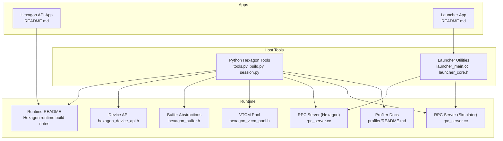

**Diagram sources**
- [apps/hexagon_api/README.md:18-59](file://apps/hexagon_api/README.md#L18-L59)
- [apps/hexagon_launcher/README.md:17-146](file://apps/hexagon_launcher/README.md#L17-L146)
- [apps/hexagon_launcher/launcher_main.cc:67-160](file://apps/hexagon_launcher/launcher_main.cc#L67-L160)
- [apps/hexagon_launcher/launcher_core.h:96-134](file://apps/hexagon_launcher/launcher_core.h#L96-L134)
- [src/runtime/hexagon/README.md:18-75](file://src/runtime/hexagon/README.md#L18-L75)
- [src/runtime/hexagon/hexagon_device_api.h:46-203](file://src/runtime/hexagon/hexagon_device_api.h#L46-L203)
- [src/runtime/hexagon/hexagon_buffer.h:38-203](file://src/runtime/hexagon/hexagon_buffer.h#L38-L203)
- [src/runtime/hexagon/hexagon_vtcm_pool.h:36-119](file://src/runtime/hexagon/hexagon_vtcm_pool.h#L36-L119)
- [src/runtime/hexagon/rpc/hexagon/rpc_server.cc:258-369](file://src/runtime/hexagon/rpc/hexagon/rpc_server.cc#L258-L369)
- [src/runtime/hexagon/rpc/simulator/rpc_server.cc:293-372](file://src/runtime/hexagon/rpc/simulator/rpc_server.cc#L293-L372)
- [src/runtime/hexagon/profiler/README.md:18-86](file://src/runtime/hexagon/profiler/README.md#L18-L86)

**Section sources**
- [apps/hexagon_api/README.md:18-59](file://apps/hexagon_api/README.md#L18-L59)
- [apps/hexagon_launcher/README.md:17-146](file://apps/hexagon_launcher/README.md#L17-L146)
- [src/runtime/hexagon/README.md:18-75](file://src/runtime/hexagon/README.md#L18-L75)

## Core Components
- Host-side build and packaging:
  - Toolchain detection and version checks
  - Shared library linking and packing imports for Hexagon
  - Export utilities for generated binaries
- Session management:
  - RPC tracker-based session creation and teardown
  - Resource acquisition/release hooks for Hexagon runtime
- Runtime device API:
  - Device memory allocation, workspace management, and interop
  - Thread, DMA, VTCM, and power managers
- Buffer abstractions:
  - 1-D and 2-D buffer allocation with scope-aware placement
  - Copy utilities between external and Hexagon buffers
- VTCM pool:
  - Device-side memory pool management for VTCM
- RPC servers:
  - Hexagon RPC server for device-to-host communication
  - Simulator RPC server for host-controlled simulation
- Profiling:
  - LWP instrumentation and post-processing pipeline

**Section sources**
- [python/tvm/contrib/hexagon/tools.py:68-401](file://python/tvm/contrib/hexagon/tools.py#L68-L401)
- [python/tvm/contrib/hexagon/build.py:44-690](file://python/tvm/contrib/hexagon/build.py#L44-L690)
- [python/tvm/contrib/hexagon/session.py:42-287](file://python/tvm/contrib/hexagon/session.py#L42-L287)
- [src/runtime/hexagon/hexagon_device_api.h:46-203](file://src/runtime/hexagon/hexagon_device_api.h#L46-L203)
- [src/runtime/hexagon/hexagon_buffer.h:38-203](file://src/runtime/hexagon/hexagon_buffer.h#L38-L203)
- [src/runtime/hexagon/hexagon_vtcm_pool.h:36-119](file://src/runtime/hexagon/hexagon_vtcm_pool.h#L36-L119)
- [src/runtime/hexagon/rpc/hexagon/rpc_server.cc:258-369](file://src/runtime/hexagon/rpc/hexagon/rpc_server.cc#L258-L369)
- [src/runtime/hexagon/rpc/simulator/rpc_server.cc:293-372](file://src/runtime/hexagon/rpc/simulator/rpc_server.cc#L293-L372)
- [src/runtime/hexagon/profiler/README.md:18-86](file://src/runtime/hexagon/profiler/README.md#L18-L86)

## Architecture Overview
The Hexagon backend integrates TVM’s host compiler with a Hexagon runtime and RPC infrastructure. Host tools generate and package executables, then deploy them to a device or simulator via RPC. The runtime exposes a device API with integrated managers for threads, DMA, VTCM, and buffers. The launcher orchestrates model loading, input preparation, execution, and output retrieval.

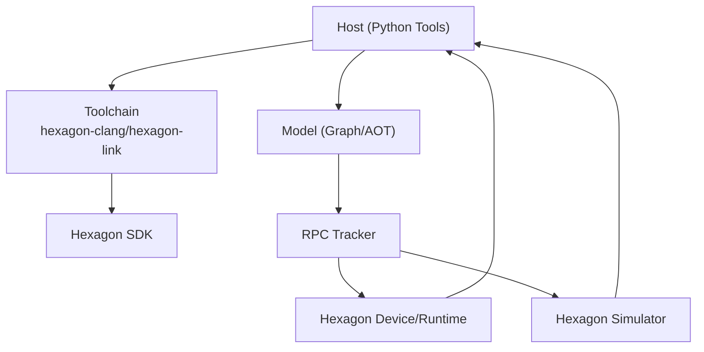

**Diagram sources**
- [python/tvm/contrib/hexagon/tools.py:79-107](file://python/tvm/contrib/hexagon/tools.py#L79-L107)
- [src/runtime/hexagon/README.md:28-75](file://src/runtime/hexagon/README.md#L28-L75)
- [apps/hexagon_launcher/README.md:19-90](file://apps/hexagon_launcher/README.md#L19-L90)
- [src/runtime/hexagon/rpc/hexagon/rpc_server.cc:258-369](file://src/runtime/hexagon/rpc/hexagon/rpc_server.cc#L258-L369)
- [src/runtime/hexagon/rpc/simulator/rpc_server.cc:293-372](file://src/runtime/hexagon/rpc/simulator/rpc_server.cc#L293-L372)

## Detailed Component Analysis

### Host Build and Packaging Pipeline
- Toolchain discovery and version checks ensure compatibility with the Hexagon toolchain.
- Shared library linking uses the Hexagon toolchain and packs imported blobs into device objects.
- Export utilities write artifacts for deployment.

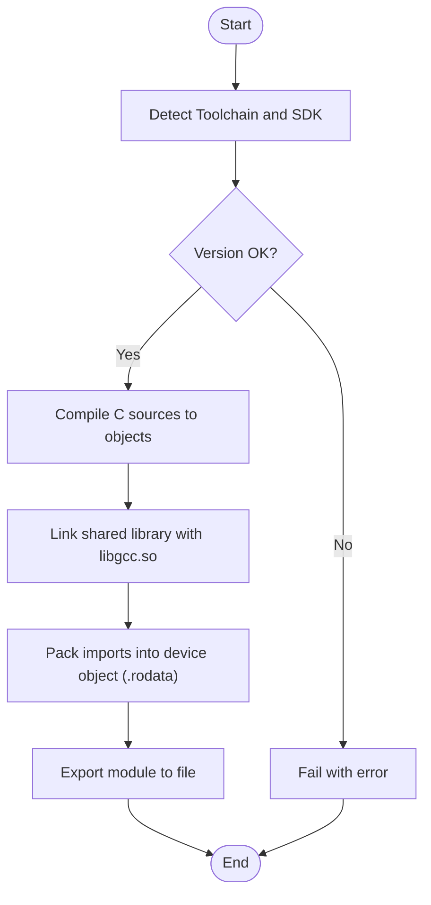

**Diagram sources**
- [python/tvm/contrib/hexagon/tools.py:79-107](file://python/tvm/contrib/hexagon/tools.py#L79-L107)
- [python/tvm/contrib/hexagon/tools.py:167-180](file://python/tvm/contrib/hexagon/tools.py#L167-L180)
- [python/tvm/contrib/hexagon/tools.py:304-395](file://python/tvm/contrib/hexagon/tools.py#L304-L395)
- [python/tvm/contrib/hexagon/tools.py:397-401](file://python/tvm/contrib/hexagon/tools.py#L397-L401)

**Section sources**
- [python/tvm/contrib/hexagon/tools.py:68-401](file://python/tvm/contrib/hexagon/tools.py#L68-L401)

### Session Management and Remote Execution
- Sessions connect to an RPC tracker, request a Hexagon server, acquire device resources, and manage lifecycle.
- The session uploads executables and loads them remotely.

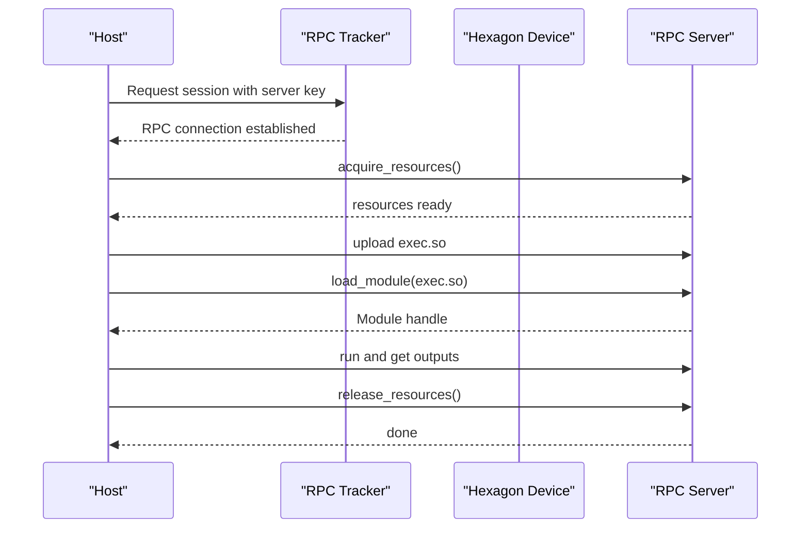

**Diagram sources**
- [python/tvm/contrib/hexagon/session.py:83-122](file://python/tvm/contrib/hexagon/session.py#L83-L122)
- [python/tvm/contrib/hexagon/session.py:246-287](file://python/tvm/contrib/hexagon/session.py#L246-L287)
- [src/runtime/hexagon/rpc/hexagon/rpc_server.cc:331-369](file://src/runtime/hexagon/rpc/hexagon/rpc_server.cc#L331-L369)

**Section sources**
- [python/tvm/contrib/hexagon/session.py:42-287](file://python/tvm/contrib/hexagon/session.py#L42-L287)
- [src/runtime/hexagon/rpc/hexagon/rpc_server.cc:258-369](file://src/runtime/hexagon/rpc/hexagon/rpc_server.cc#L258-L369)

### Launcher System for Remote Execution
- The launcher parses configuration, loads the model, sets inputs, executes, collects outputs, and optionally generates LWP JSON for profiling.
- It supports both device and simulator modes.

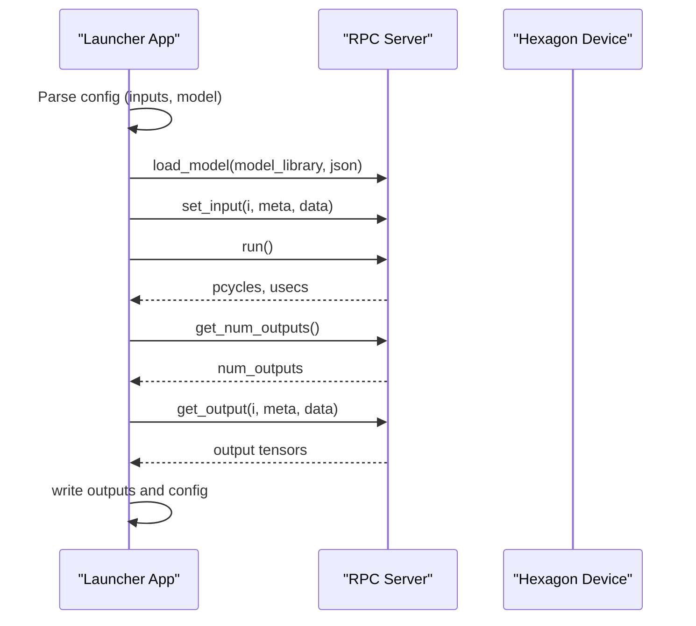

**Diagram sources**
- [apps/hexagon_launcher/launcher_main.cc:67-160](file://apps/hexagon_launcher/launcher_main.cc#L67-L160)
- [apps/hexagon_launcher/launcher_core.h:96-134](file://apps/hexagon_launcher/launcher_core.h#L96-L134)
- [src/runtime/hexagon/rpc/hexagon/rpc_server.cc:331-369](file://src/runtime/hexagon/rpc/hexagon/rpc_server.cc#L331-L369)

**Section sources**
- [apps/hexagon_launcher/launcher_main.cc:67-160](file://apps/hexagon_launcher/launcher_main.cc#L67-L160)
- [apps/hexagon_launcher/launcher_core.h:96-134](file://apps/hexagon_launcher/launcher_core.h#L96-L134)
- [apps/hexagon_launcher/README.md:81-146](file://apps/hexagon_launcher/README.md#L81-L146)

### Runtime Device API and Memory Managers
- Device API exposes allocation, copying, and resource management, delegating to internal managers.
- Managers include thread scheduling, DMA, VTCM pool, and buffer management.

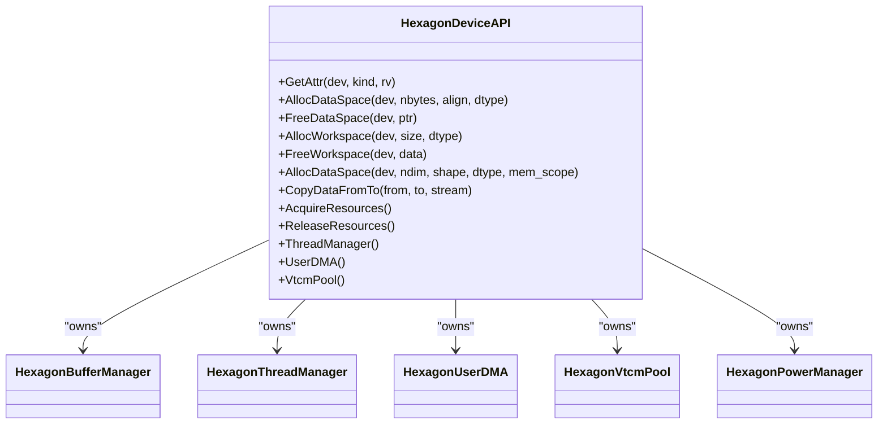

**Diagram sources**
- [src/runtime/hexagon/hexagon_device_api.h:46-203](file://src/runtime/hexagon/hexagon_device_api.h#L46-L203)

**Section sources**
- [src/runtime/hexagon/hexagon_device_api.h:46-203](file://src/runtime/hexagon/hexagon_device_api.h#L46-L203)

### Buffer Abstractions and VTCM Pool
- HexagonBuffer supports 1-D contiguous and 2-D discontiguous allocations with scope-aware placement (DDR vs VTCM).
- HexagonVtcmPool manages device-side VTCM allocation and free, tracking segments and providing bounds checking.

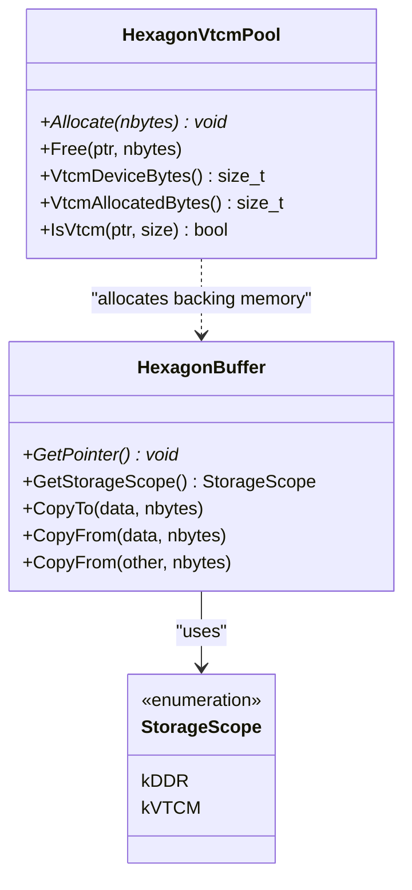

**Diagram sources**
- [src/runtime/hexagon/hexagon_buffer.h:38-203](file://src/runtime/hexagon/hexagon_buffer.h#L38-L203)
- [src/runtime/hexagon/hexagon_vtcm_pool.h:36-119](file://src/runtime/hexagon/hexagon_vtcm_pool.h#L36-L119)

**Section sources**
- [src/runtime/hexagon/hexagon_buffer.h:38-203](file://src/runtime/hexagon/hexagon_buffer.h#L38-L203)
- [src/runtime/hexagon/hexagon_vtcm_pool.h:36-119](file://src/runtime/hexagon/hexagon_vtcm_pool.h#L36-L119)

### RPC Servers for Device and Simulator
- Hexagon RPC server wraps MinRPC and exposes packed functions for module loading and profile output retrieval.
- Simulator RPC server coordinates passive message exchange with the simulator.

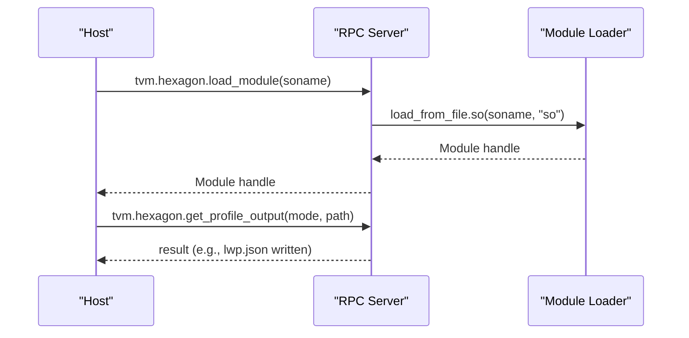

**Diagram sources**
- [src/runtime/hexagon/rpc/hexagon/rpc_server.cc:331-369](file://src/runtime/hexagon/rpc/hexagon/rpc_server.cc#L331-L369)
- [src/runtime/hexagon/rpc/simulator/rpc_server.cc:334-372](file://src/runtime/hexagon/rpc/simulator/rpc_server.cc#L334-L372)

**Section sources**
- [src/runtime/hexagon/rpc/hexagon/rpc_server.cc:258-369](file://src/runtime/hexagon/rpc/hexagon/rpc_server.cc#L258-L369)
- [src/runtime/hexagon/rpc/simulator/rpc_server.cc:293-372](file://src/runtime/hexagon/rpc/simulator/rpc_server.cc#L293-L372)

### Hexagon-Specific Optimizations
- Vector processing units (HVX): The runtime exposes HVX resources to the thread manager and DMA subsystem, enabling vectorized kernels and DMA offload.
- Scalar processing units (HTP): Hardware resource enumeration includes HTP units for compute tasks.
- Shared memory hierarchies: VTCM pool and buffer scoping enable efficient data movement between DDR and VTCM.

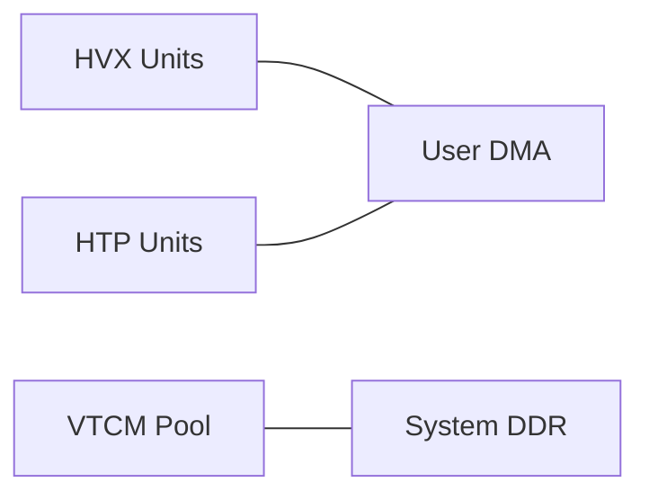

**Diagram sources**
- [src/runtime/hexagon/hexagon_device_api.h:190-194](file://src/runtime/hexagon/hexagon_device_api.h#L190-L194)
- [src/runtime/hexagon/hexagon_vtcm_pool.h:89-109](file://src/runtime/hexagon/hexagon_vtcm_pool.h#L89-L109)

**Section sources**
- [src/runtime/hexagon/hexagon_device_api.h:190-194](file://src/runtime/hexagon/hexagon_device_api.h#L190-L194)
- [src/runtime/hexagon/hexagon_vtcm_pool.h:89-109](file://src/runtime/hexagon/hexagon_vtcm_pool.h#L89-L109)

### Hexagon Binary Format (HBF) and Compilation
- The build tools compile C sources using the Hexagon toolchain and link with libgcc.so from the toolchain.
- Imported blobs are packed into device objects for consumption by the runtime.

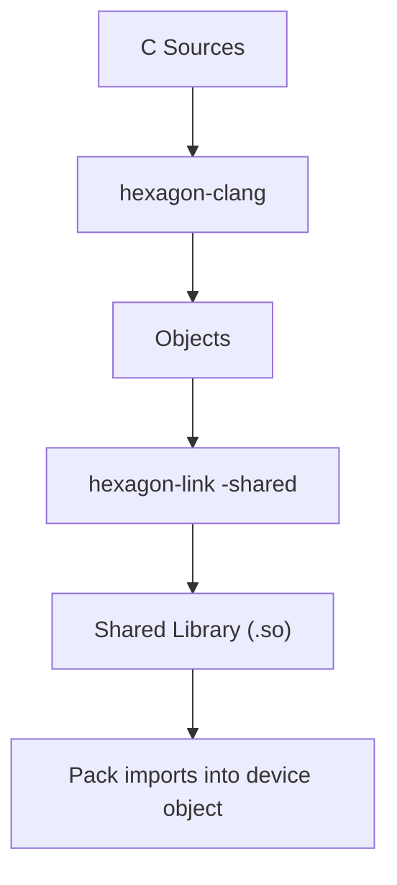

**Diagram sources**
- [python/tvm/contrib/hexagon/tools.py:167-180](file://python/tvm/contrib/hexagon/tools.py#L167-L180)
- [python/tvm/contrib/hexagon/tools.py:304-395](file://python/tvm/contrib/hexagon/tools.py#L304-L395)

**Section sources**
- [python/tvm/contrib/hexagon/tools.py:167-180](file://python/tvm/contrib/hexagon/tools.py#L167-L180)
- [python/tvm/contrib/hexagon/tools.py:304-395](file://python/tvm/contrib/hexagon/tools.py#L304-L395)

### SDK Integration and Build Notes
- The runtime README outlines enabling Hexagon support via CMake options and platform-specific flags for Android and Hexagon targets.
- The API app README documents required configuration variables for building RPC binaries and runtime libraries.

**Section sources**
- [src/runtime/hexagon/README.md:28-75](file://src/runtime/hexagon/README.md#L28-L75)
- [apps/hexagon_api/README.md:27-59](file://apps/hexagon_api/README.md#L27-L59)

### Examples of Hexagon-Enabled App Integration
- The launcher app demonstrates loading a model, preparing inputs, running inference, and collecting outputs.
- The launcher README describes preparation steps and execution commands for Android devices.

**Section sources**
- [apps/hexagon_launcher/launcher_main.cc:67-160](file://apps/hexagon_launcher/launcher_main.cc#L67-L160)
- [apps/hexagon_launcher/README.md:81-146](file://apps/hexagon_launcher/README.md#L81-L146)

### Performance Profiling Using LWP
- LWP instrumentation inserts profiling builtins during codegen, which are handled on Hexagon to record runtime info into a buffer and emit JSON.
- The profiler README explains configuration flags and usage with RPC launcher tests.
- The Python profiler module and processing utilities support generating CSV reports.

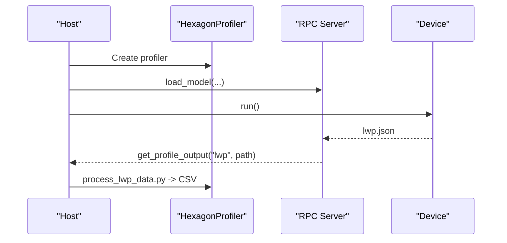

**Diagram sources**
- [src/runtime/hexagon/profiler/README.md:50-86](file://src/runtime/hexagon/profiler/README.md#L50-L86)
- [python/tvm/contrib/hexagon/hexagon_profiler.py](file://python/tvm/contrib/hexagon/hexagon_profiler.py)
- [python/tvm/contrib/hexagon/profiling/process_lwp_data.py](file://python/tvm/contrib/hexagon/profiling/process_lwp_data.py)

**Section sources**
- [src/runtime/hexagon/profiler/README.md:18-86](file://src/runtime/hexagon/profiler/README.md#L18-L86)
- [python/tvm/contrib/hexagon/hexagon_profiler.py](file://python/tvm/contrib/hexagon/hexagon_profiler.py)
- [python/tvm/contrib/hexagon/profiling/process_lwp_data.py](file://python/tvm/contrib/hexagon/profiling/process_lwp_data.py)

### Debugging Techniques for DSP Code Execution
- Use the simulator RPC server to debug without a physical device.
- Preserve test directories during profiling runs by passing a debug flag to pytest.
- Inspect device logs and ensure resource acquisition/release sequences are intact.

**Section sources**
- [src/runtime/hexagon/rpc/simulator/rpc_server.cc:293-372](file://src/runtime/hexagon/rpc/simulator/rpc_server.cc#L293-L372)
- [src/runtime/hexagon/profiler/README.md:80-86](file://src/runtime/hexagon/profiler/README.md#L80-L86)

## Dependency Analysis
Key dependencies and relationships:
- Host tools depend on the Hexagon toolchain and SDK for compilation and linking.
- The runtime device API depends on managers for threads, DMA, VTCM, and buffers.
- The RPC servers depend on the MinRPC framework and expose packed functions for module loading and profiling.

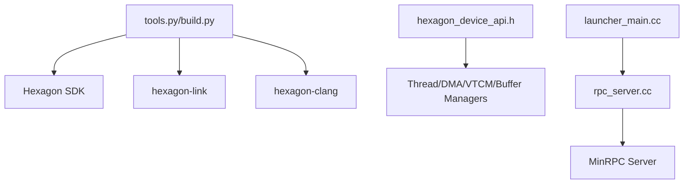

**Diagram sources**
- [python/tvm/contrib/hexagon/tools.py:79-107](file://python/tvm/contrib/hexagon/tools.py#L79-L107)
- [src/runtime/hexagon/hexagon_device_api.h:46-203](file://src/runtime/hexagon/hexagon_device_api.h#L46-L203)
- [src/runtime/hexagon/rpc/hexagon/rpc_server.cc:258-369](file://src/runtime/hexagon/rpc/hexagon/rpc_server.cc#L258-L369)
- [apps/hexagon_launcher/launcher_main.cc:67-160](file://apps/hexagon_launcher/launcher_main.cc#L67-L160)

**Section sources**
- [python/tvm/contrib/hexagon/tools.py:79-107](file://python/tvm/contrib/hexagon/tools.py#L79-L107)
- [src/runtime/hexagon/hexagon_device_api.h:46-203](file://src/runtime/hexagon/hexagon_device_api.h#L46-L203)
- [src/runtime/hexagon/rpc/hexagon/rpc_server.cc:258-369](file://src/runtime/hexagon/rpc/hexagon/rpc_server.cc#L258-L369)
- [apps/hexagon_launcher/launcher_main.cc:67-160](file://apps/hexagon_launcher/launcher_main.cc#L67-L160)

## Performance Considerations
- Prefer VTCM for frequently accessed tensors to reduce DRAM bandwidth.
- Use HVX-capable operators and ensure vectorization passes are enabled.
- Minimize cross-scope copies (e.g., avoid frequent DDR-VTCM transitions).
- Enable LWP instrumentation selectively to avoid overhead on tight loops.

## Troubleshooting Guide
- Missing environment variables:
  - Ensure HEXAGON_TOOLCHAIN is set and points to a valid toolchain.
  - Ensure HEXAGON_RPC_LIB_DIR is set for API binaries.
- Session failures:
  - Verify RPC tracker connectivity and server key.
  - Confirm resource acquisition/release sequences are executed.
- Simulator issues:
  - Confirm simulator RPC server is launched and message buffers are properly mapped.
- Profiling:
  - Ensure LWP instrumentation is enabled during model build and that the profiler writes lwp.json to the device.

**Section sources**
- [python/tvm/contrib/hexagon/build.py:68-85](file://python/tvm/contrib/hexagon/build.py#L68-L85)
- [python/tvm/contrib/hexagon/_ci_env_check.py:46-62](file://python/tvm/contrib/hexagon/_ci_env_check.py#L46-L62)
- [src/runtime/hexagon/rpc/simulator/rpc_server.cc:293-372](file://src/runtime/hexagon/rpc/simulator/rpc_server.cc#L293-L372)
- [src/runtime/hexagon/profiler/README.md:80-86](file://src/runtime/hexagon/profiler/README.md#L80-L86)

## Conclusion
The Hexagon backend in TVM provides a complete pipeline from host-side compilation and packaging to device execution and profiling. With robust memory management, RPC infrastructure, and profiling support, developers can efficiently deploy AI workloads on Qualcomm Hexagon DSPs across various chipsets.

## Appendices
- Supported Snapdragon architectures in the launcher: 855, 865, 888.
- Minimum Hexagon SDK version: 4.0.0.
- Minimum LLVM version recommendation: 7.0.0.

**Section sources**
- [apps/hexagon_launcher/README.md:24-32](file://apps/hexagon_launcher/README.md#L24-L32)
- [src/runtime/hexagon/README.md:23-26](file://src/runtime/hexagon/README.md#L23-L26)