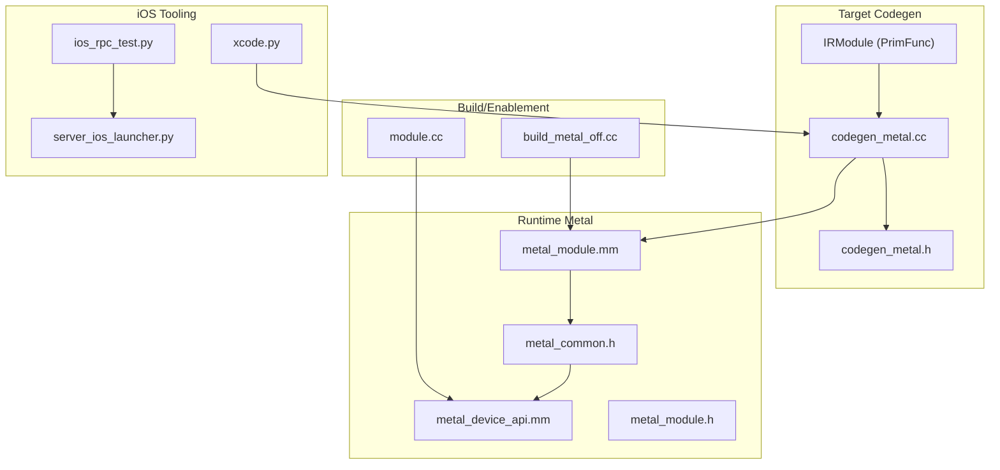
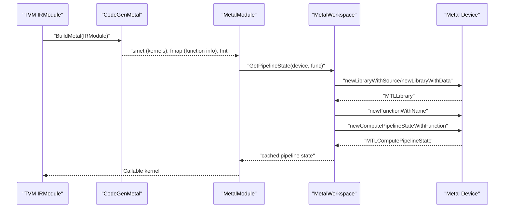
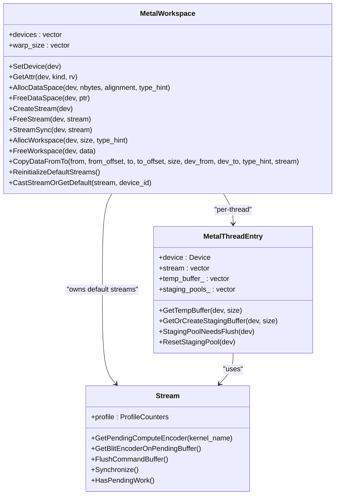
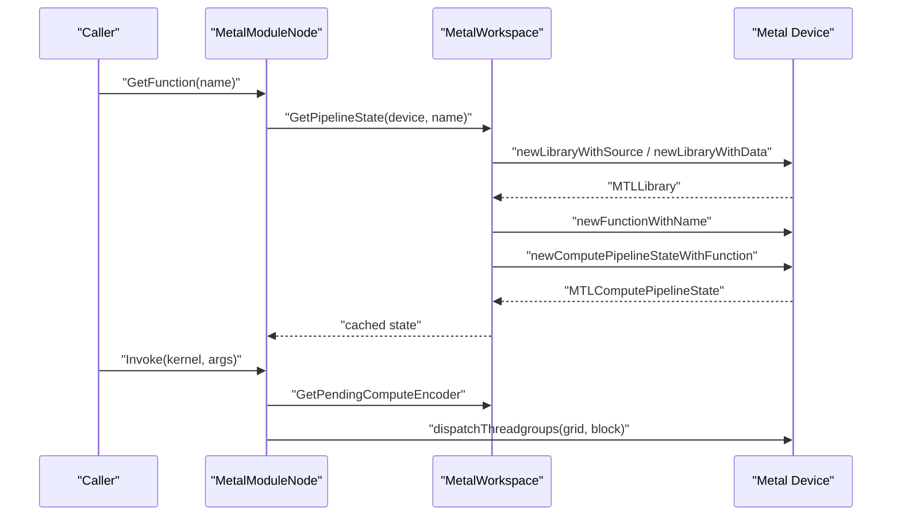
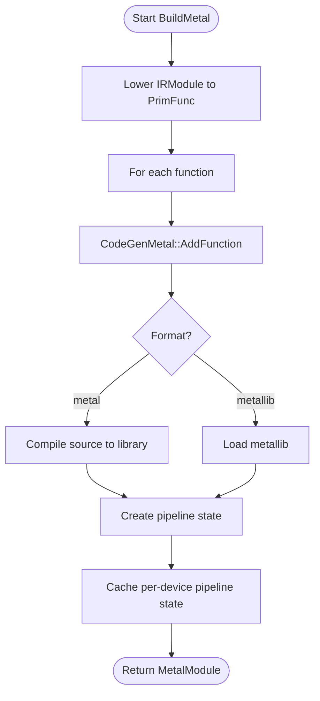
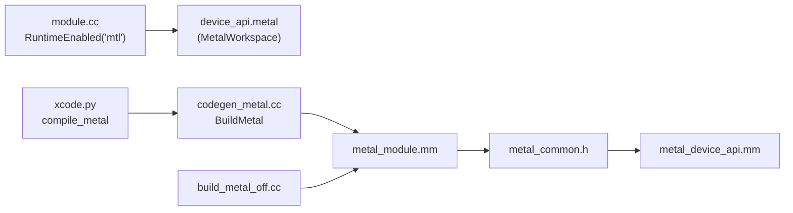

# iOS Metal Backend

<cite>
**Referenced Files in This Document**
- [metal_common.h](file://src/runtime/metal/metal_common.h)
- [metal_device_api.mm](file://src/runtime/metal/metal_device_api.mm)
- [metal_module.h](file://src/runtime/metal/metal_module.h)
- [metal_module.mm](file://src/runtime/metal/metal_module.mm)
- [codegen_metal.h](file://src/target/source/codegen_metal.h)
- [codegen_metal.cc](file://src/target/source/codegen_metal.cc)
- [intrin_rule_metal.cc](file://src/target/source/intrin_rule_metal.cc)
- [build_metal_off.cc](file://src/target/opt/build_metal_off.cc)
- [module.cc](file://src/runtime/module.cc)
- [xcode.py](file://python/tvm/contrib/xcode.py)
- [ios_rpc_test.py](file://apps/ios_rpc/tests/ios_rpc_test.py)
- [server_ios_launcher.py](file://python/tvm/rpc/server_ios_launcher.py)
</cite>

## Table of Contents
1. [Introduction](#introduction)
2. [Project Structure](#project-structure)
3. [Core Components](#core-components)
4. [Architecture Overview](#architecture-overview)
5. [Detailed Component Analysis](#detailed-component-analysis)
6. [Dependency Analysis](#dependency-analysis)
7. [Performance Considerations](#performance-considerations)
8. [Troubleshooting Guide](#troubleshooting-guide)
9. [Conclusion](#conclusion)
10. [Appendices](#appendices)

## Introduction
This document explains the iOS Metal backend support in TVM. It covers how TVM integrates with Apple’s Metal runtime on iOS, including device API integration, memory management, compilation pipeline for Metal shaders, module loading, device selection strategies, and performance optimizations tailored to Apple GPUs. It also provides practical guidance for iOS app integration, memory mapping between Metal buffers and TVM tensors, debugging approaches for Metal kernel execution, and iOS-specific constraints such as memory pressure handling, background execution limitations, and App Store review considerations for ML inference acceleration.

## Project Structure
The iOS Metal backend spans several core areas:
- Runtime device API and memory management for Metal on iOS
- Metal module creation and kernel invocation
- Target-side code generation for Metal kernels
- Optional build path when Metal runtime is disabled
- iOS RPC server launcher for development and testing
- Python helpers for compiling Metal libraries with Xcode toolchain

**Diagram sources**
- [codegen_metal.cc:445-479](file://src/target/source/codegen_metal.cc#L445-L479)
- [metal_common.h:298-442](file://src/runtime/metal/metal_common.h#L298-L442)
- [metal_device_api.mm:37-175](file://src/runtime/metal/metal_device_api.mm#L37-L175)
- [metal_module.mm:52-176](file://src/runtime/metal/metal_module.mm#L52-L176)
- [build_metal_off.cc:29-34](file://src/target/opt/build_metal_off.cc#L29-L34)
- [module.cc:38-69](file://src/runtime/module.cc#L38-L69)
- [xcode.py:111-169](file://python/tvm/contrib/xcode.py#L111-L169)
- [ios_rpc_test.py](file://apps/ios_rpc/tests/ios_rpc_test.py)
- [server_ios_launcher.py](file://python/tvm/rpc/server_ios_launcher.py)

**Section sources**
- [codegen_metal.cc:445-479](file://src/target/source/codegen_metal.cc#L445-L479)
- [metal_common.h:298-442](file://src/runtime/metal/metal_common.h#L298-L442)
- [metal_device_api.mm:37-175](file://src/runtime/metal/metal_device_api.mm#L37-L175)
- [metal_module.mm:52-176](file://src/runtime/metal/metal_module.mm#L52-L176)
- [build_metal_off.cc:29-34](file://src/target/opt/build_metal_off.cc#L29-L34)
- [module.cc:38-69](file://src/runtime/module.cc#L38-L69)
- [xcode.py:111-169](file://python/tvm/contrib/xcode.py#L111-L169)
- [ios_rpc_test.py](file://apps/ios_rpc/tests/ios_rpc_test.py)
- [server_ios_launcher.py](file://python/tvm/rpc/server_ios_launcher.py)

## Core Components
- Metal device API and streams: Provides device enumeration, attributes, memory allocation/deallocation, CPU/GPU data transfers, and synchronization.
- Metal module and kernel invocation: Compiles Metal kernels from source or binary, caches pipeline states per device, and launches compute kernels with argument binding.
- Code generation for Metal: Emits Metal kernel code from TIR/PrimFunc, handles storage scopes, vector types, barriers, and intrinsic lowering to Metal-specific operations.
- Optional runtime fallback: When Metal runtime is disabled, returns a source module for interpretation.
- iOS tooling: Helpers to compile Metal libraries via Xcode toolchain and iOS RPC server launcher for development/testing.

Key responsibilities:
- Device selection: Uses system default device on iOS; supports multiple devices on macOS.
- Memory model: Private storage mode for GPU buffers; shared staging buffers for CPU→GPU copies; temporary buffers for GPU→CPU reads.
- Command batching: Batches compute dispatches and blit operations in a single command buffer; ensures ordering and flushes before deallocation or readback.
- Kernel compilation: Supports “metal” source and “metallib” binary formats; caches pipeline states per device.

**Section sources**
- [metal_device_api.mm:160-175](file://src/runtime/metal/metal_device_api.mm#L160-L175)
- [metal_device_api.mm:181-217](file://src/runtime/metal/metal_device_api.mm#L181-L217)
- [metal_device_api.mm:226-309](file://src/runtime/metal/metal_device_api.mm#L226-L309)
- [metal_common.h:298-346](file://src/runtime/metal/metal_common.h#L298-L346)
- [metal_module.mm:87-150](file://src/runtime/metal/metal_module.mm#L87-L150)
- [metal_module.mm:198-234](file://src/runtime/metal/metal_module.mm#L198-L234)
- [codegen_metal.cc:445-479](file://src/target/source/codegen_metal.cc#L445-L479)
- [build_metal_off.cc:29-34](file://src/target/opt/build_metal_off.cc#L29-L34)

## Architecture Overview
The Metal backend architecture connects TVM’s target code generation with the Metal runtime on iOS/macOS. The flow is:
- IRModule with PrimFunc functions is lowered and code-generated into Metal kernels.
- The generated source or precompiled metallib is packaged into a Metal runtime module.
- The module compiles kernels on demand per device, caches pipeline states, and launches compute commands through Metal streams.
- Data movement between CPU and GPU is handled by the Metal device API with careful synchronization and staging.

**Diagram sources**
- [codegen_metal.cc:445-479](file://src/target/source/codegen_metal.cc#L445-L479)
- [metal_module.mm:87-150](file://src/runtime/metal/metal_module.mm#L87-L150)
- [metal_device_api.mm:104-138](file://src/runtime/metal/metal_device_api.mm#L104-L138)

## Detailed Component Analysis

### Metal Device API and Streams
Responsibilities:
- Enumerate devices and initialize default streams per device.
- Expose device attributes (e.g., max threads per block, total memory).
- Allocate/free GPU buffers with appropriate storage modes.
- Copy data between CPU and GPU, using staging buffers and temporary buffers as needed.
- Synchronize streams and report errors encountered in command buffers.

Notable behaviors:
- On iOS, uses the system default device; on macOS, enumerates all devices.
- Storage mode for GPU buffers is configured; staging buffers use shared storage for CPU→GPU copies.
- Copy paths:
  - GPU→GPU: inlined blit into pending command buffer.
  - GPU→CPU: flushes and waits for completion; uses shared temporary buffer when necessary.
  - CPU→GPU: inlines blit using a staging buffer pool; enforces a limit to prevent unbounded growth.

**Diagram sources**
- [metal_common.h:298-442](file://src/runtime/metal/metal_common.h#L298-L442)
- [metal_device_api.mm:160-175](file://src/runtime/metal/metal_device_api.mm#L160-L175)
- [metal_device_api.mm:226-309](file://src/runtime/metal/metal_device_api.mm#L226-L309)

**Section sources**
- [metal_common.h:119-293](file://src/runtime/metal/metal_common.h#L119-L293)
- [metal_device_api.mm:160-175](file://src/runtime/metal/metal_device_api.mm#L160-L175)
- [metal_device_api.mm:181-217](file://src/runtime/metal/metal_device_api.mm#L181-L217)
- [metal_device_api.mm:226-309](file://src/runtime/metal/metal_device_api.mm#L226-L309)

### Metal Module System and Kernel Invocation
Responsibilities:
- Create Metal runtime modules from kernel source or metallib.
- Compile kernels on first use per device, caching pipeline states.
- Wrap kernel invocations with argument binding and launch parameter extraction.
- Serialize/deserialize modules for transport.

Key mechanisms:
- Pipeline state caching per device to avoid repeated compilation.
- Argument packing for POD parameters passed via a dedicated buffer binding.
- Launch parameter extraction from function metadata to configure grid/block sizes.

**Diagram sources**
- [metal_module.mm:52-176](file://src/runtime/metal/metal_module.mm#L52-L176)
- [metal_module.mm:198-234](file://src/runtime/metal/metal_module.mm#L198-L234)
- [metal_device_api.mm:87-150](file://src/runtime/metal/metal_device_api.mm#L87-L150)

**Section sources**
- [metal_module.h:36-55](file://src/runtime/metal/metal_module.h#L36-L55)
- [metal_module.mm:52-176](file://src/runtime/metal/metal_module.mm#L52-L176)
- [metal_module.mm:198-234](file://src/runtime/metal/metal_module.mm#L198-L234)

### Compilation Pipeline for Metal Shaders
Responsibilities:
- Lower IRModule to PrimFunc kernels and emit Metal source.
- Optionally preprocess source via a callback to produce metallib.
- Package kernels into a Metal runtime module with function metadata.

Highlights:
- Emits Metal kernel signatures with buffer bindings and optional POD argument structs.
- Handles storage scopes (“device”, “threadgroup”, “thread”) and vector types.
- Supports SIMD subgroup intrinsics and Metal-specific math functions.

**Diagram sources**
- [codegen_metal.cc:445-479](file://src/target/source/codegen_metal.cc#L445-L479)
- [codegen_metal.cc:60-180](file://src/target/source/codegen_metal.cc#L60-L180)
- [metal_module.mm:87-150](file://src/runtime/metal/metal_module.mm#L87-L150)

**Section sources**
- [codegen_metal.h:37-73](file://src/target/source/codegen_metal.h#L37-L73)
- [codegen_metal.cc:445-479](file://src/target/source/codegen_metal.cc#L445-L479)
- [codegen_metal.cc:60-180](file://src/target/source/codegen_metal.cc#L60-L180)

### Intrinsics and Math Functions for Metal
Responsibilities:
- Map TVM intrinsics to Metal-compatible operations.
- Provide SIMD shuffle and warp-level operations via Metal’s simdgroup intrinsics.
- Support common math functions and special-case handling (e.g., erf).

Key mappings:
- Warp shuffle operations mapped to Metal simd shuffle variants.
- Common math ops lowered to pure extern calls compatible with Metal math functions.

**Section sources**
- [intrin_rule_metal.cc:33-162](file://src/target/source/intrin_rule_metal.cc#L33-L162)

### Optional Runtime Fallback
When Metal runtime is disabled, the build returns a source module instead of a compiled Metal module. This allows development and testing without Metal runtime enabled.

**Section sources**
- [build_metal_off.cc:29-34](file://src/target/opt/build_metal_off.cc#L29-L34)

### iOS App Integration and RPC
- Python helpers compile Metal libraries using Xcode toolchain and capture metallib artifacts.
- iOS RPC test and launcher enable running TVM-backed inference on iOS devices for development and testing.

Practical steps:
- Use the Xcode helper to compile Metal sources into metallib binaries.
- Package metallib into the app bundle or fetch at runtime.
- Initialize TVM runtime and load the Metal module; ensure device selection and memory initialization occur on the main thread.

**Section sources**
- [xcode.py:111-169](file://python/tvm/contrib/xcode.py#L111-L169)
- [ios_rpc_test.py](file://apps/ios_rpc/tests/ios_rpc_test.py)
- [server_ios_launcher.py](file://python/tvm/rpc/server_ios_launcher.py)

## Dependency Analysis
The Metal backend integrates tightly with TVM’s runtime and target subsystems. The dependency graph below highlights key relationships.

**Diagram sources**
- [module.cc:38-69](file://src/runtime/module.cc#L38-L69)
- [codegen_metal.cc:445-479](file://src/target/source/codegen_metal.cc#L445-L479)
- [metal_module.mm:52-176](file://src/runtime/metal/metal_module.mm#L52-L176)
- [metal_common.h:298-442](file://src/runtime/metal/metal_common.h#L298-L442)
- [metal_device_api.mm:37-175](file://src/runtime/metal/metal_device_api.mm#L37-L175)
- [build_metal_off.cc:29-34](file://src/target/opt/build_metal_off.cc#L29-L34)
- [xcode.py:111-169](file://python/tvm/contrib/xcode.py#L111-L169)

**Section sources**
- [module.cc:38-69](file://src/runtime/module.cc#L38-L69)
- [codegen_metal.cc:445-479](file://src/target/source/codegen_metal.cc#L445-L479)
- [metal_module.mm:52-176](file://src/runtime/metal/metal_module.mm#L52-L176)
- [metal_common.h:298-442](file://src/runtime/metal/metal_common.h#L298-L442)
- [metal_device_api.mm:37-175](file://src/runtime/metal/metal_device_api.mm#L37-L175)
- [build_metal_off.cc:29-34](file://src/target/opt/build_metal_off.cc#L29-L34)
- [xcode.py:111-169](file://python/tvm/contrib/xcode.py#L111-L169)

## Performance Considerations
- Command batching: Use pending compute encoders and blit encoders on a single command buffer to reduce CPU overhead and improve throughput.
- Synchronization discipline: Always flush or synchronize before GPU→CPU readback, buffer deallocation, or stream sync to avoid Metal crashes.
- Staging buffers: Limit the number of inline CPU→GPU staging buffers to prevent unbounded memory growth; flush when the staging pool reaches capacity.
- Pipeline state caching: Reuse compiled pipeline states per device to avoid repeated compilation overhead.
- Vectorization and storage scopes: Use appropriate storage scopes (“device”, “threadgroup”) and vector types to match Metal memory hierarchy and SIMD execution.
- Barrier usage: Prefer threadgroup barriers for shared memory synchronization; global barriers are not supported in Metal kernels.

[No sources needed since this section provides general guidance]

## Troubleshooting Guide
Common issues and remedies:
- Kernel launch failures: Verify grid/block dimensions respect device limits and that pipeline states are cached for the correct device.
- GPU memory errors: Ensure buffers are not freed while still referenced by pending command buffers; flush before deallocation.
- Readback timing: For GPU→CPU copies, flush and wait for completion before accessing host memory.
- Error propagation: The stream tracks Metal command buffer errors and augments messages with the last dispatched kernel name for easier diagnosis.
- Profiling: Use built-in counters to track dispatches, blits, and syncs; reset counters to isolate regressions.

**Section sources**
- [metal_device_api.mm:201-217](file://src/runtime/metal/metal_device_api.mm#L201-L217)
- [metal_device_api.mm:252-274](file://src/runtime/metal/metal_device_api.mm#L252-L274)
- [metal_common.h:141-147](file://src/runtime/metal/metal_common.h#L141-L147)
- [metal_common.h:258-267](file://src/runtime/metal/metal_common.h#L258-L267)

## Conclusion
TVM’s iOS Metal backend provides a robust foundation for accelerating ML workloads on Apple GPUs. It integrates seamlessly with TVM’s compilation pipeline, manages memory efficiently with staging and temporary buffers, and offers precise control over command encoding and synchronization. By following the performance and troubleshooting guidance herein, developers can build reliable, high-performance iOS applications leveraging Metal acceleration.

[No sources needed since this section summarizes without analyzing specific files]

## Appendices

### iOS-Specific Constraints and Recommendations
- Memory pressure handling:
  - Monitor and cap staging buffer usage; flush early when approaching limits.
  - Prefer streaming inputs/outputs to reduce peak memory footprint.
- Background execution:
  - Keep long-running inference short or schedule around foreground activity to avoid termination.
- App Store review:
  - Ensure ML acceleration is part of a coherent feature; avoid misleading claims.
  - Provide clear user controls to disable acceleration if needed.

[No sources needed since this section provides general guidance]