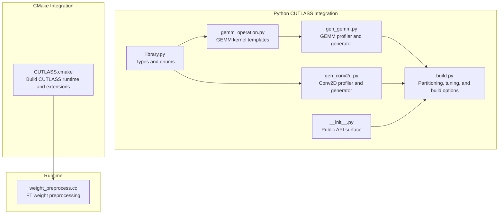
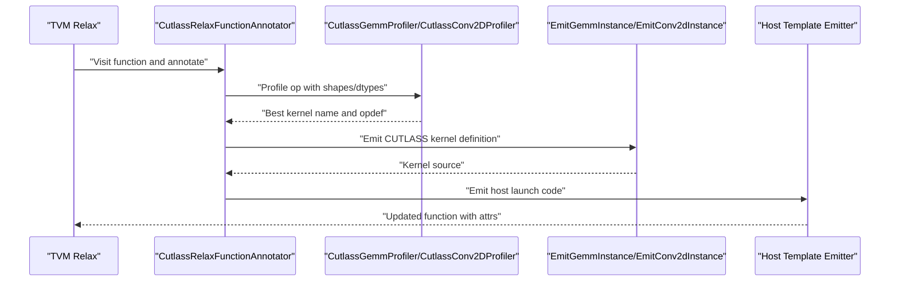
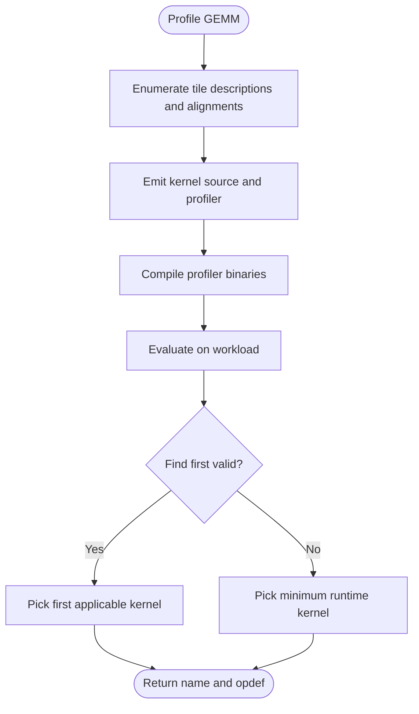
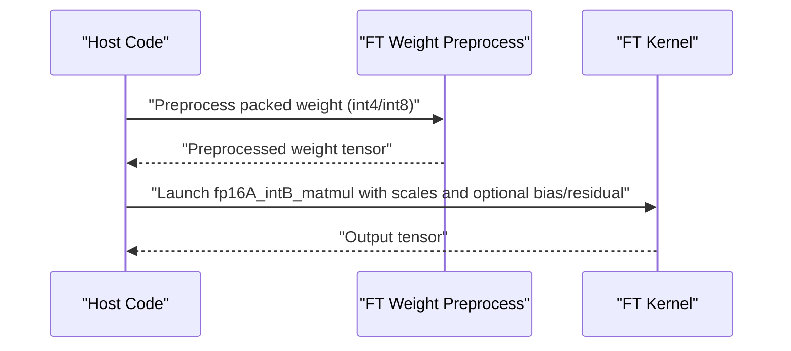
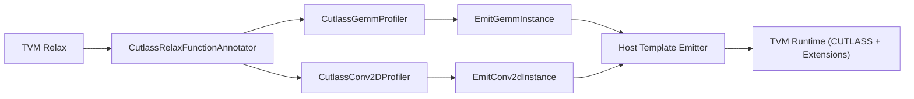

# CUTLASS Tensor Cores

<cite>
**Referenced Files in This Document**
- [__init__.py](file://python/tvm/contrib/cutlass/__init__.py)
- [library.py](file://python/tvm/contrib/cutlass/library.py)
- [gemm_operation.py](file://python/tvm/contrib/cutlass/gemm_operation.py)
- [gen_gemm.py](file://python/tvm/contrib/cutlass/gen_gemm.py)
- [gen_conv2d.py](file://python/tvm/contrib/cutlass/gen_conv2d.py)
- [build.py](file://python/tvm/contrib/cutlass/build.py)
- [CUTLASS.cmake](file://cmake/modules/contrib/CUTLASS.cmake)
- [weight_preprocess.cc](file://src/runtime/contrib/cutlass/weight_preprocess.cc)
- [LICENSE.cutlass.txt](file://licenses/LICENSE.cutlass.txt)
</cite>

## Table of Contents
1. [Introduction](#introduction)
2. [Project Structure](#project-structure)
3. [Core Components](#core-components)
4. [Architecture Overview](#architecture-overview)
5. [Detailed Component Analysis](#detailed-component-analysis)
6. [Dependency Analysis](#dependency-analysis)
7. [Performance Considerations](#performance-considerations)
8. [Troubleshooting Guide](#troubleshooting-guide)
9. [Conclusion](#conclusion)
10. [Appendices](#appendices)

## Introduction
This document explains how TVM integrates NVIDIA’s CUTLASS library to accelerate tensor core-enabled GEMM and related operations. It covers the CUTLASS integration layer, supported matrix multiplication patterns, data type support, kernel generation and selection, auto-tuning mechanisms, and performance optimization techniques. It also documents the FP-A INT-B GEMM extensions, weight-only quantization support, mixed-precision workflows, licensing, build configuration, and GPU architecture compatibility.

## Project Structure
The CUTLASS integration in TVM spans Python generators and profilers, CMake build integration, and runtime preprocessing for specialized quantized kernels.

**Diagram sources**
- [library.py:1-302](file://python/tvm/contrib/cutlass/library.py#L1-302)
- [gemm_operation.py:1-479](file://python/tvm/contrib/cutlass/gemm_operation.py#L1-479)
- [gen_gemm.py:1-353](file://python/tvm/contrib/cutlass/gen_gemm.py#L1-353)
- [gen_conv2d.py:1-393](file://python/tvm/contrib/cutlass/gen_conv2d.py#L1-393)
- [build.py:1-908](file://python/tvm/contrib/cutlass/build.py#L1-908)
- [CUTLASS.cmake:1-88](file://cmake/modules/contrib/CUTLASS.cmake#L1-88)
- [weight_preprocess.cc:1-65](file://src/runtime/contrib/cutlass/weight_preprocess.cc#L1-65)

**Section sources**
- [__init__.py:1-21](file://python/tvm/contrib/cutlass/__init__.py#L1-21)
- [library.py:1-302](file://python/tvm/contrib/cutlass/library.py#L1-302)
- [gemm_operation.py:1-479](file://python/tvm/contrib/cutlass/gemm_operation.py#L1-479)
- [gen_gemm.py:1-353](file://python/tvm/contrib/cutlass/gen_gemm.py#L1-353)
- [gen_conv2d.py:1-393](file://python/tvm/contrib/cutlass/gen_conv2d.py#L1-393)
- [build.py:1-908](file://python/tvm/contrib/cutlass/build.py#L1-908)
- [CUTLASS.cmake:1-88](file://cmake/modules/contrib/CUTLASS.cmake#L1-88)
- [weight_preprocess.cc:1-65](file://src/runtime/contrib/cutlass/weight_preprocess.cc#L1-65)

## Core Components
- Type and enum definitions for CUTLASS data types, layouts, opcodes, epilogue functors, and swizzling.
- GEMM and Conv2D operation generators that emit CUTLASS device kernel instantiations and host launch code.
- Auto-tuning profilers that enumerate candidate kernels, compile lightweight evaluators, and select the best-performing kernel per workload.
- Build-time integration that compiles CUTLASS runtime extensions and third-party FP-A INT-B kernels.
- Runtime preprocessing for FasterTransformer-style weight packing and scaling.

Key capabilities:
- Supported GEMM patterns: dense, batched, transposed B, residual/broadcast fusion, bias addition, fused activations.
- Data types: FP16, FP32, S8/U8, S32. Mixed precision via accumulator selection.
- Tensor core programming model: TensorOp/WmmaTensorOp with configurable threadblock/warp/instruction tiles and stages.
- Memory coalescing: row/col major layouts, swizzling functors, and alignment constraints.
- FP-A INT-B GEMM: FP16 input A with INT4/INT8 weights and per-column or fine-grained scales, with optional bias and residual fusion.
- Weight-only quantization: preprocessing to permute/transpose/interleave weights and adjust dtype for FT kernels.

**Section sources**
- [library.py:32-302](file://python/tvm/contrib/cutlass/library.py#L32-302)
- [gemm_operation.py:24-479](file://python/tvm/contrib/cutlass/gemm_operation.py#L24-479)
- [gen_gemm.py:37-353](file://python/tvm/contrib/cutlass/gen_gemm.py#L37-353)
- [gen_conv2d.py:41-393](file://python/tvm/contrib/cutlass/gen_conv2d.py#L41-393)
- [build.py:43-908](file://python/tvm/contrib/cutlass/build.py#L43-908)
- [CUTLASS.cmake:18-88](file://cmake/modules/contrib/CUTLASS.cmake#L18-88)
- [weight_preprocess.cc:29-65](file://src/runtime/contrib/cutlass/weight_preprocess.cc#L29-65)

## Architecture Overview
The CUTLASS integration follows a partitioning and tuning pipeline:
- Partitioning: TVM Relax identifies ops suitable for CUTLASS offload.
- Annotation: The annotator extracts shapes/dtypes and profiles kernels for each partition.
- Kernel Selection: A profiler enumerates candidates, compiles evaluators, and selects the fastest kernel.
- Host Code Emission: Templates generate CUTLASS device kernel definitions and host launch code.
- Runtime: Specialized kernels and preprocessing are linked into the runtime.

**Diagram sources**
- [build.py:442-800](file://python/tvm/contrib/cutlass/build.py#L442-800)
- [gen_gemm.py:194-353](file://python/tvm/contrib/cutlass/gen_gemm.py#L194-353)
- [gen_conv2d.py:184-393](file://python/tvm/contrib/cutlass/gen_conv2d.py#L184-393)
- [gemm_operation.py:149-413](file://python/tvm/contrib/cutlass/gemm_operation.py#L149-413)

## Detailed Component Analysis

### GEMM Kernel Generation and Selection
- Operation modeling: The GEMM operation class composes data types, layouts, tile shapes, and epilogue functors into a procedural name and template instantiation.
- Template emission: The emitter generates CUTLASS device kernel typedefs and host Arguments structures, including leading dimension computation and batch strides.
- Epilogue fusion: Supports linear combinations, ReLU/SiLU/GELU/Sigmoid/HardSwish, residual blocks, and bias addition.
- Profiling: The profiler enumerates tile descriptions and alignments, compiles lightweight evaluators, and selects the best kernel by measured runtime.

**Diagram sources**
- [gen_gemm.py:194-353](file://python/tvm/contrib/cutlass/gen_gemm.py#L194-353)
- [gemm_operation.py:149-413](file://python/tvm/contrib/cutlass/gemm_operation.py#L149-413)

**Section sources**
- [gemm_operation.py:24-479](file://python/tvm/contrib/cutlass/gemm_operation.py#L24-479)
- [gen_gemm.py:37-353](file://python/tvm/contrib/cutlass/gen_gemm.py#L37-353)

### Conv2D Kernel Generation and Selection
- Operation modeling: Conv2D uses NHWC tensors, iterator algorithms, stride support, and split-K slices for reduction.
- Template emission: Emits CUTLASS conv kernels with optional reduction stage for split-K.
- Profiling: Similar enumeration and evaluation pipeline as GEMM, with workload-specific constraints.

**Section sources**
- [gen_conv2d.py:41-393](file://python/tvm/contrib/cutlass/gen_conv2d.py#L41-393)

### FP-A INT-B GEMM and Weight-Only Quantization
- FP-A INT-B kernels: FP16 input A with INT4/INT8 weight matrices and per-column or fine-grained scales, enabling mixed-precision inference with quantized weights.
- Bias and residual fusion: Optional bias vector and residual connections with activation fusion.
- Preprocessing: Weight permutation/transposition/interleaving and dtype adjustment for FasterTransformer kernels, executed on CPU and returned as a TVM tensor.

**Diagram sources**
- [gemm_operation.py:415-479](file://python/tvm/contrib/cutlass/gemm_operation.py#L415-479)
- [weight_preprocess.cc:29-65](file://src/runtime/contrib/cutlass/weight_preprocess.cc#L29-65)

**Section sources**
- [gemm_operation.py:415-479](file://python/tvm/contrib/cutlass/gemm_operation.py#L415-479)
- [weight_preprocess.cc:29-65](file://src/runtime/contrib/cutlass/weight_preprocess.cc#L29-65)

### Build and Runtime Integration
- CMake integration builds CUTLASS runtime objects and conditionally includes FP-A INT-B and Flash-Attention components based on selected CUDA architectures and flags.
- Build options include NVCC flags, include paths for CUTLASS and extensions, and fast-math toggles.

**Section sources**
- [CUTLASS.cmake:18-88](file://cmake/modules/contrib/CUTLASS.cmake#L18-88)
- [build.py:59-92](file://python/tvm/contrib/cutlass/build.py#L59-92)

## Dependency Analysis
- Python CUTLASS module depends on TVM Relax and Topi utilities for shape extraction and dtype handling.
- Profilers rely on generator functions that produce kernel templates and compile-time evaluators.
- Runtime linkage integrates CUTLASS headers and third-party extensions for FP-A INT-B and Flash Attention.

**Diagram sources**
- [build.py:442-800](file://python/tvm/contrib/cutlass/build.py#L442-800)
- [gen_gemm.py:194-353](file://python/tvm/contrib/cutlass/gen_gemm.py#L194-353)
- [gen_conv2d.py:184-393](file://python/tvm/contrib/cutlass/gen_conv2d.py#L184-393)

**Section sources**
- [build.py:1-908](file://python/tvm/contrib/cutlass/build.py#L1-908)
- [gen_gemm.py:1-353](file://python/tvm/contrib/cutlass/gen_gemm.py#L1-353)
- [gen_conv2d.py:1-393](file://python/tvm/contrib/cutlass/gen_conv2d.py#L1-393)

## Performance Considerations
- Kernel selection: Use the profiler to choose optimal threadblock/warp/instruction tiles and alignments for the target architecture and workload.
- Mixed precision: Prefer FP16 accumulation for FP16 inputs to balance throughput and accuracy; use 3xtf32 mode for FP32 inputs on tensor cores when higher precision is needed.
- Split-K: For certain convolutions (e.g., wgrad), split-K can improve throughput at the cost of workspace and a post-reduction kernel.
- Alignment and coalescing: Ensure leading dimensions and alignments match layout requirements; swizzling functors help reduce bank conflicts.
- Residual fusion: Fuse residual adds and activations to reduce memory bandwidth and eliminate intermediate buffers.
- FP-A INT-B: Use per-column or fine-grained scaling to reduce quantization error while keeping weights compressed.

[No sources needed since this section provides general guidance]

## Troubleshooting Guide
- Shape validation: The matmul handler validates batch stride constraints; mismatches can cause failures. Ensure batch dimensions are compatible or use supported patterns.
- Dynamic shapes: For symbolic shapes, the profiler falls back to default kernels; consider providing concrete shapes or tuning policies.
- Alignment constraints: Some kernels require specific alignments; the profiler enumerates feasible alignments automatically.
- CUDA version and threads: Compiler flags and parallel compilation depend on detected CUDA version; ensure a compatible CUDA toolkit is installed.
- Licensing: CUTLASS and FP-A INT-B extensions are redistributed under their respective licenses; ensure compliance in your deployment environment.

**Section sources**
- [build.py:407-440](file://python/tvm/contrib/cutlass/build.py#L407-440)
- [build.py:89-92](file://python/tvm/contrib/cutlass/build.py#L89-92)
- [LICENSE.cutlass.txt:1-24](file://licenses/LICENSE.cutlass.txt#L1-24)

## Conclusion
TVM’s CUTLASS integration provides a robust framework for accelerating GEMM and convolution workloads on NVIDIA GPUs with tensor cores. Through automatic kernel generation, profiling, and runtime specialization—including FP-A INT-B quantization—the system achieves high performance across diverse precisions and layouts. Proper configuration of build options, tuning parameters, and data layouts ensures optimal performance and broad compatibility across GPU architectures.

[No sources needed since this section summarizes without analyzing specific files]

## Appendices

### Supported Data Types and Layouts
- Data types: FP16, FP32, S8, U8, S32.
- Layouts: RowMajor, ColumnMajor, TensorNHWC.
- Accumulator: Selectable based on compute precision needs.

**Section sources**
- [library.py:32-302](file://python/tvm/contrib/cutlass/library.py#L32-302)

### Supported GEMM Patterns
- Dense matmul, batched matmul, transposed B, residual fusion, bias addition, fused activations (ReLU, SiLU, GELU, Sigmoid, HardSwish).

**Section sources**
- [gemm_operation.py:24-479](file://python/tvm/contrib/cutlass/gemm_operation.py#L24-479)
- [gen_gemm.py:37-110](file://python/tvm/contrib/cutlass/gen_gemm.py#L37-110)

### Auto-Tuning Options
- use_3xtf32: Toggle 3xtf32 vs tf32 for FP32 inputs on tensor cores.
- split_k_slices: Candidate split-K factors for convolutions.
- profile_all_alignments: Profile all feasible alignments.
- find_first_valid: Stop profiling after the first applicable kernel.
- use_multiprocessing: Parallel compilation of profiler binaries.

**Section sources**
- [build.py:288-363](file://python/tvm/contrib/cutlass/build.py#L288-363)
- [gen_conv2d.py:333-393](file://python/tvm/contrib/cutlass/gen_conv2d.py#L333-393)
- [gen_gemm.py:308-353](file://python/tvm/contrib/cutlass/gen_gemm.py#L308-353)

### Practical Integration Steps
- Partition Relax functions for CUTLASS offload.
- Run tuning to annotate each partition with the best kernel name and emitted code.
- Build with CUTLASS enabled and appropriate CUDA architectures.
- For FP-A INT-B, preprocess weights and pass scales/bias/residual as needed.

**Section sources**
- [build.py:288-363](file://python/tvm/contrib/cutlass/build.py#L288-363)
- [gemm_operation.py:415-479](file://python/tvm/contrib/cutlass/gemm_operation.py#L415-479)
- [weight_preprocess.cc:29-65](file://src/runtime/contrib/cutlass/weight_preprocess.cc#L29-65)