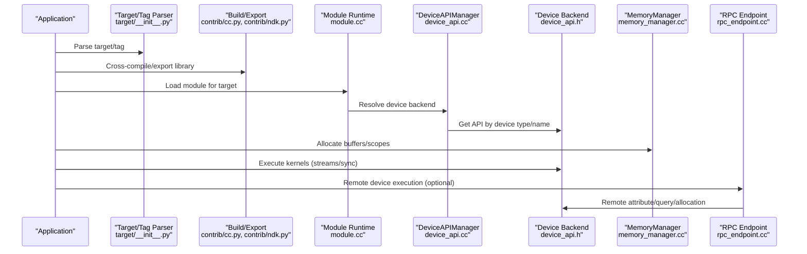
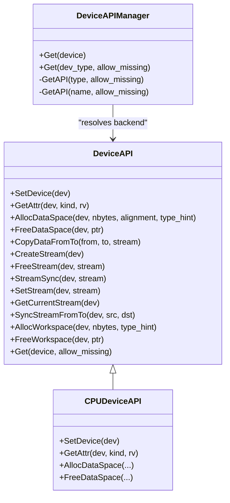
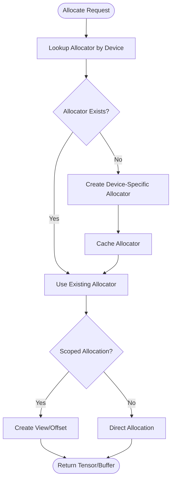
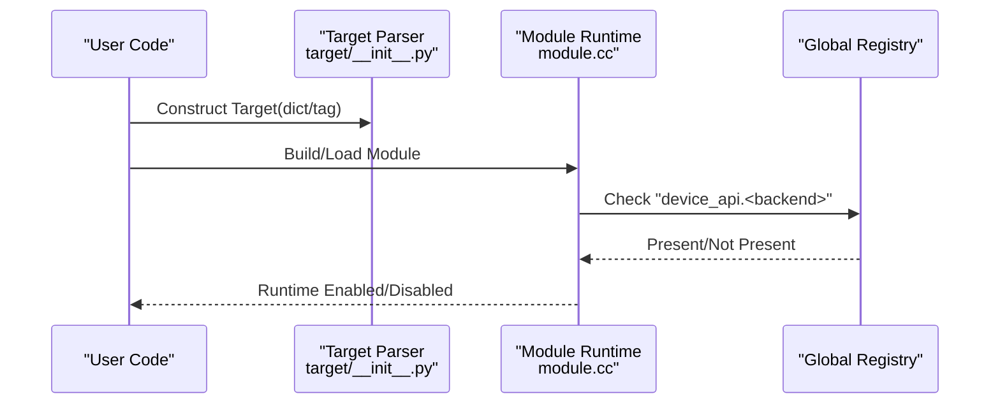
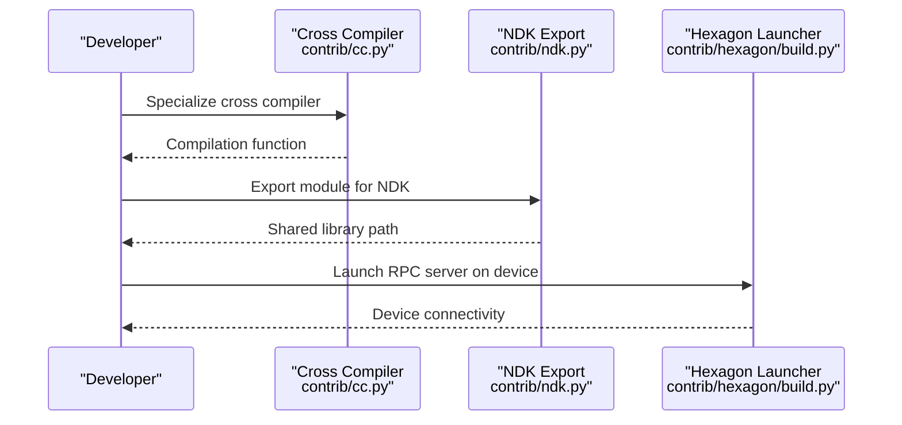
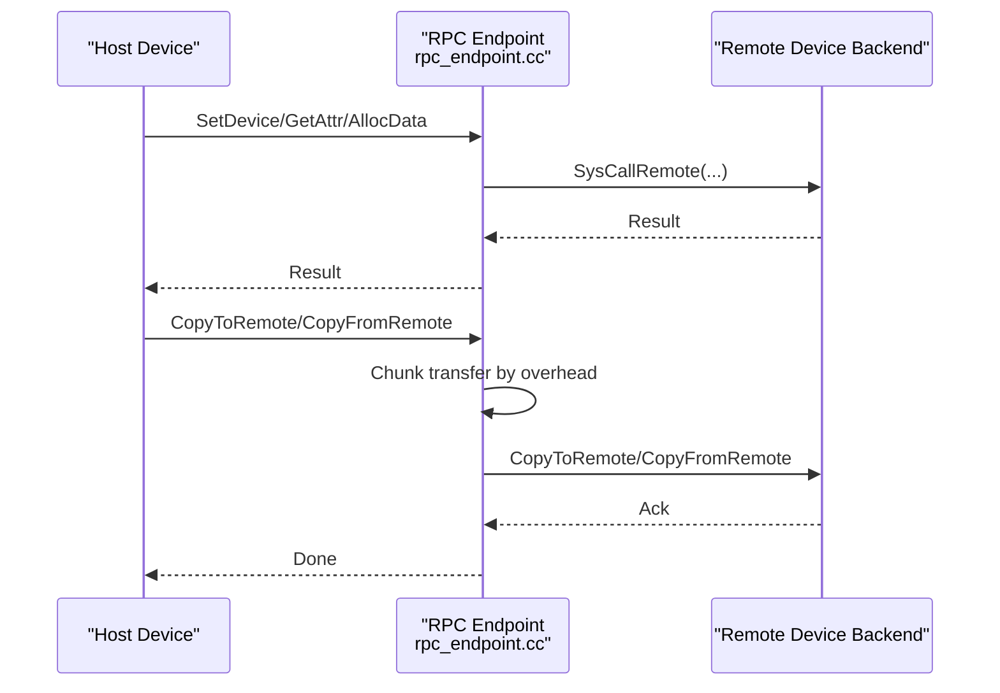
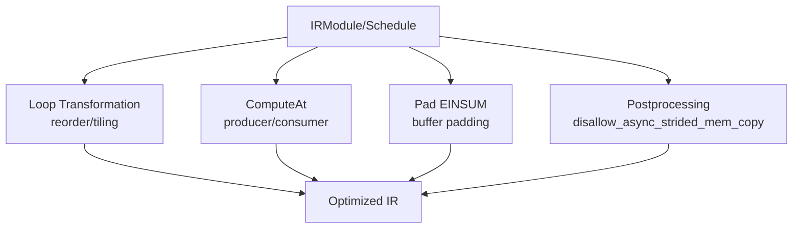
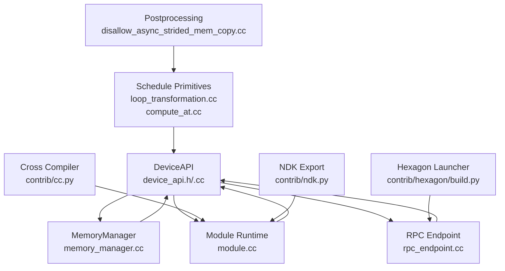

# Custom Accelerator Integration

<cite>
**Referenced Files in This Document**
- [device_api.h](file://include/tvm/runtime/device_api.h)
- [device_api.cc](file://src/runtime/device_api.cc)
- [cpu_device_api.cc](file://src/runtime/cpu_device_api.cc)
- [dlpack.h](file://3rdparty/tvm-ffi/3rdparty/dlpack/include/dlpack/dlpack.h)
- [memory_manager.cc](file://src/runtime/memory/memory_manager.cc)
- [module.cc](file://src/runtime/module.cc)
- [rpc_endpoint.cc](file://src/runtime/rpc/rpc_endpoint.cc)
- [device_target_interactions.rst](file://docs/arch/device_target_interactions.rst)
- [cross_compiler](file://python/tvm/contrib/cc.py)
- [ndk_export](file://python/tvm/contrib/ndk.py)
- [hexagon_launcher](file://python/tvm/contrib/hexagon/build.py)
- [target_init](file://python/tvm/target/__init__.py)
- [memory_manager_tests.cc](file://tests/cpp/runtime/memory/memory_manager_tests.cc)
- [concrete_schedule.h](file://src/s_tir/schedule/concrete_schedule.h)
- [loop_transformation.cc](file://src/s_tir/schedule/primitive/loop_transformation.cc)
- [compute_at.cc](file://src/s_tir/schedule/primitive/compute_at.cc)
- [disallow_async_strided_mem_copy.cc](file://src/s_tir/meta_schedule/postproc/disallow_async_strided_mem_copy.cc)
- [pad_einsum.cc](file://src/s_tir/schedule/primitive/pad_einsum.cc)
- [nvshmem_runtime_builtin_kv_cache_transfer_kernel.py](file://tests/python/relax/nvshmem/test_runtime_builtin_kv_cache_transfer_kernel.py)
</cite>

## Table of Contents
1. [Introduction](#introduction)
2. [Project Structure](#project-structure)
3. [Core Components](#core-components)
4. [Architecture Overview](#architecture-overview)
5. [Detailed Component Analysis](#detailed-component-analysis)
6. [Dependency Analysis](#dependency-analysis)
7. [Performance Considerations](#performance-considerations)
8. [Troubleshooting Guide](#troubleshooting-guide)
9. [Conclusion](#conclusion)
10. [Appendices](#appendices)

## Introduction
This document explains how to integrate custom hardware accelerators into TVM. It covers the accelerator plugin architecture, custom runtime development, and hardware abstraction layers. It also documents memory management strategies, data movement optimization, accelerator-specific scheduling, contribution module system patterns, third-party library integration, vendor SDK incorporation, plugin registration, configuration management, testing frameworks, hardware emulation/simulation support, and cross-compilation workflows.

## Project Structure
The TVM codebase organizes accelerator integration across several subsystems:
- Hardware abstraction and device API: device abstraction, attribute queries, memory allocation, streams, and synchronization
- Runtime memory management: allocators, storage scoping, and device-specific allocator selection
- Target and runtime enablement: target parsing, runtime checks, and tag-based configuration
- Cross-compilation and packaging: cross compilers, Android NDK integration, and export helpers
- RPC and remote execution: remote device execution and data movement
- Scheduling and optimization passes: schedule primitives, postprocessing, and buffer allocation

```mermaid
graph TB
subgraph "Hardware Abstraction"
DA["DeviceAPI<br/>device_api.h/.cc"]
CPU["CPUDeviceAPI<br/>cpu_device_api.cc"]
DL["DLDeviceType<br/>dlpack.h"]
end
subgraph "Runtime Memory"
MM["MemoryManager<br/>memory_manager.cc"]
AL["Allocators<br/>naive/pooled"]
end
subgraph "Target and Runtime"
MOD["Runtime Enablement<br/>module.cc"]
TAG["Target Tags<br/>target/__init__.py"]
end
subgraph "Cross-Compilation"
CC["Cross Compiler<br/>contrib/cc.py"]
NDK["NDK Export Helper<br/>contrib/ndk.py"]
HEX["Hexagon Launcher<br/>contrib/hexagon/build.py"]
end
subgraph "RPC"
RPC["RPC Endpoint<br/>rpc_endpoint.cc"]
end
subgraph "Scheduling"
SCH["Schedule Primitives<br/>loop_transformation.cc<br/>compute_at.cc<br/>pad_einsum.cc"]
POST["Postprocessing<br/>disallow_async_strided_mem_copy.cc"]
end
DA --> CPU
DA --> DL
MM --> DA
MOD --> DA
TAG --> MOD
CC --> MOD
NDK --> MOD
HEX --> RPC
RPC --> DA
SCH --> DA
POST --> SCH
```

**Diagram sources**
- [device_api.h:128-310](file://include/tvm/runtime/device_api.h#L128-L310)
- [device_api.cc:49-95](file://src/runtime/device_api.cc#L49-L95)
- [cpu_device_api.cc:50-109](file://src/runtime/cpu_device_api.cc#L50-L109)
- [dlpack.h:68-136](file://3rdparty/tvm-ffi/3rdparty/dlpack/include/dlpack/dlpack.h#L68-L136)
- [memory_manager.cc:127-191](file://src/runtime/memory/memory_manager.cc#L127-L191)
- [module.cc:38-69](file://src/runtime/module.cc#L38-L69)
- [target_init:18-32](file://python/tvm/target/__init__.py#L18-L32)
- [cross_compiler:262-316](file://python/tvm/contrib/cc.py#L262-L316)
- [ndk_export:161-167](file://python/tvm/contrib/ndk.py#L161-L167)
- [hexagon_launcher:156-551](file://python/tvm/contrib/hexagon/build.py#L156-L551)
- [rpc_endpoint.cc:1136-1194](file://src/runtime/rpc/rpc_endpoint.cc#L1136-L1194)
- [loop_transformation.cc:984-1014](file://src/s_tir/schedule/primitive/loop_transformation.cc#L984-L1014)
- [compute_at.cc:124-146](file://src/s_tir/schedule/primitive/compute_at.cc#L124-L146)
- [pad_einsum.cc:161-194](file://src/s_tir/schedule/primitive/pad_einsum.cc#L161-L194)
- [disallow_async_strided_mem_copy.cc:124-150](file://src/s_tir/meta_schedule/postproc/disallow_async_strided_mem_copy.cc#L124-L150)

**Section sources**
- [device_api.h:128-310](file://include/tvm/runtime/device_api.h#L128-L310)
- [memory_manager.cc:127-191](file://src/runtime/memory/memory_manager.cc#L127-L191)
- [module.cc:38-69](file://src/runtime/module.cc#L38-L69)
- [target_init:18-32](file://python/tvm/target/__init__.py#L18-L32)

## Core Components
- Device abstraction and API: The DeviceAPI class defines the contract for device-specific operations including attribute queries, memory allocation/deallocation, data copying, streams, and synchronization. DeviceAPIManager resolves the appropriate backend by device type or name.
- Memory management: MemoryManager maintains per-device allocators (naive and pooled) and selects device-specific allocators via global registry hooks. It supports scoped allocations and views.
- Target and runtime enablement: Targets are configured via dictionaries or tags. Runtime enablement checks determine whether a given target’s runtime is available.
- Cross-compilation and packaging: Cross compilers and NDK helpers enable building libraries for remote targets. Hexagon launcher integrates Android toolchains and RPC servers.
- RPC and remote execution: RPCEndpoint handles remote device operations, including attribute queries, allocation, and bulk data transfers with chunking.
- Scheduling and optimization: Schedule primitives manipulate loops, compute-at, and buffer padding. Postprocessing avoids asynchronous strided memory copies when unsupported.

**Section sources**
- [device_api.h:128-310](file://include/tvm/runtime/device_api.h#L128-L310)
- [device_api.cc:49-95](file://src/runtime/device_api.cc#L49-L95)
- [memory_manager.cc:127-191](file://src/runtime/memory/memory_manager.cc#L127-L191)
- [module.cc:38-69](file://src/runtime/module.cc#L38-L69)
- [rpc_endpoint.cc:1136-1194](file://src/runtime/rpc/rpc_endpoint.cc#L1136-L1194)
- [loop_transformation.cc:984-1014](file://src/s_tir/schedule/primitive/loop_transformation.cc#L984-L1014)
- [compute_at.cc:124-146](file://src/s_tir/schedule/primitive/compute_at.cc#L124-L146)
- [disallow_async_strided_mem_copy.cc:124-150](file://src/s_tir/meta_schedule/postproc/disallow_async_strided_mem_copy.cc#L124-L150)

## Architecture Overview
The accelerator integration architecture centers on pluggable device backends and a unified runtime. The high-level flow:
- Application constructs a Target and builds a module
- Runtime enablement checks ensure the target’s runtime is present
- DeviceAPIManager resolves the device backend for each operation
- MemoryManager provides device-local allocators and scoped storage
- Scheduling transforms IR to optimize for the accelerator
- RPCEndpoint enables remote execution and data movement



**Diagram sources**
- [target_init:18-32](file://python/tvm/target/__init__.py#L18-L32)
- [cross_compiler:262-316](file://python/tvm/contrib/cc.py#L262-L316)
- [ndk_export:161-167](file://python/tvm/contrib/ndk.py#L161-L167)
- [module.cc:38-69](file://src/runtime/module.cc#L38-L69)
- [device_api.cc:49-95](file://src/runtime/device_api.cc#L49-L95)
- [device_api.h:128-310](file://include/tvm/runtime/device_api.h#L128-L310)
- [memory_manager.cc:127-191](file://src/runtime/memory/memory_manager.cc#L127-L191)
- [rpc_endpoint.cc:1136-1194](file://src/runtime/rpc/rpc_endpoint.cc#L1136-L1194)

## Detailed Component Analysis

### Device Abstraction Layer
The DeviceAPI defines the contract for device backends:
- Device selection and attributes
- Memory allocation and deallocation
- Data movement between tensors and streams
- Stream creation, synchronization, and inter-stream synchronization
- Workspace allocation for intermediate computations

DeviceAPIManager resolves backends by device type or by a “device_api.<name>” global function. It caches backends per device type and supports RPC sessions.



**Diagram sources**
- [device_api.h:128-310](file://include/tvm/runtime/device_api.h#L128-L310)
- [device_api.cc:49-95](file://src/runtime/device_api.cc#L49-L95)
- [cpu_device_api.cc:50-109](file://src/runtime/cpu_device_api.cc#L50-L109)

**Section sources**
- [device_api.h:128-310](file://include/tvm/runtime/device_api.h#L128-L310)
- [device_api.cc:49-95](file://src/runtime/device_api.cc#L49-L95)
- [cpu_device_api.cc:50-109](file://src/runtime/cpu_device_api.cc#L50-L109)
- [device_target_interactions.rst:62-98](file://docs/arch/device_target_interactions.rst#L62-L98)

### Memory Management and Data Movement
MemoryManager provides per-device allocators and selects device-specific allocators via a global registry hook. It supports scoped allocations and views, enabling efficient reuse of device memory regions. The manager ensures thread-safe creation and retrieval of allocators.



**Diagram sources**
- [memory_manager.cc:127-191](file://src/runtime/memory/memory_manager.cc#L127-L191)

**Section sources**
- [memory_manager.cc:127-191](file://src/runtime/memory/memory_manager.cc#L127-L191)
- [memory_manager_tests.cc:51-118](file://tests/cpp/runtime/memory/memory_manager_tests.cc#L51-L118)

### Target Configuration and Runtime Enablement
Targets can be specified as dictionaries or tags. Runtime enablement checks determine whether a target’s runtime is present by resolving global functions such as “device_api.cuda”, “device_api.opencl”, etc.



**Diagram sources**
- [target_init:18-32](file://python/tvm/target/__init__.py#L18-L32)
- [module.cc:38-69](file://src/runtime/module.cc#L38-L69)

**Section sources**
- [target_init:18-32](file://python/tvm/target/__init__.py#L18-L32)
- [module.cc:38-69](file://src/runtime/module.cc#L38-L69)

### Cross-Compilation and Packaging
Cross-compilation helpers enable building libraries for remote targets. The NDK export helper packages built modules for Android/Hexagon environments. Hexagon launcher integrates ADB and RPC server lifecycle for remote execution.



**Diagram sources**
- [cross_compiler:262-316](file://python/tvm/contrib/cc.py#L262-L316)
- [ndk_export:161-167](file://python/tvm/contrib/ndk.py#L161-L167)
- [hexagon_launcher:156-551](file://python/tvm/contrib/hexagon/build.py#L156-L551)

**Section sources**
- [cross_compiler:262-316](file://python/tvm/contrib/cc.py#L262-L316)
- [ndk_export:161-167](file://python/tvm/contrib/ndk.py#L161-L167)
- [hexagon_launcher:156-551](file://python/tvm/contrib/hexagon/build.py#L156-L551)

### RPC and Remote Execution
RPCEndpoint delegates device operations to remote devices, including attribute queries, allocation, and bulk data transfers. It chunks large transfers to respect RPC packet overhead and device limits.



**Diagram sources**
- [rpc_endpoint.cc:1136-1194](file://src/runtime/rpc/rpc_endpoint.cc#L1136-L1194)

**Section sources**
- [rpc_endpoint.cc:1136-1194](file://src/runtime/rpc/rpc_endpoint.cc#L1136-L1194)

### Scheduling and Accelerator-Specific Optimization
Scheduling primitives manipulate loops, compute-at, and buffer padding to improve locality and reduce data movement. Postprocessing avoids asynchronous strided memory copies when unsupported by the target.



**Diagram sources**
- [loop_transformation.cc:984-1014](file://src/s_tir/schedule/primitive/loop_transformation.cc#L984-L1014)
- [compute_at.cc:124-146](file://src/s_tir/schedule/primitive/compute_at.cc#L124-L146)
- [pad_einsum.cc:161-194](file://src/s_tir/schedule/primitive/pad_einsum.cc#L161-L194)
- [disallow_async_strided_mem_copy.cc:124-150](file://src/s_tir/meta_schedule/postproc/disallow_async_strided_mem_copy.cc#L124-L150)

**Section sources**
- [concrete_schedule.h:36-68](file://src/s_tir/schedule/concrete_schedule.h#L36-L68)
- [loop_transformation.cc:984-1014](file://src/s_tir/schedule/primitive/loop_transformation.cc#L984-L1014)
- [compute_at.cc:124-146](file://src/s_tir/schedule/primitive/compute_at.cc#L124-L146)
- [pad_einsum.cc:161-194](file://src/s_tir/schedule/primitive/pad_einsum.cc#L161-L194)
- [disallow_async_strided_mem_copy.cc:124-150](file://src/s_tir/meta_schedule/postproc/disallow_async_strided_mem_copy.cc#L124-L150)

### Practical Examples and Patterns
- Developing a custom accelerator backend:
  - Implement a DeviceAPI subclass and register it via a global function named “device_api.<name>”
  - Provide AllocDataSpace, FreeDataSpace, CopyDataFromTo, streams, and attribute queries
  - Ensure DLDeviceType compatibility and device identification
- Implementing device APIs:
  - Follow the DeviceAPI contract and leverage DeviceAPIManager resolution
  - Support workspace allocation and stream synchronization
- Creating optimization passes:
  - Use schedule primitives to transform loops and buffer layouts
  - Apply postprocessing to disable unsupported memory copy patterns
- Plugin registration and configuration:
  - Use target tags and dictionaries to configure runtime and device properties
  - Validate runtime enablement before execution
- Third-party library and vendor SDK integration:
  - Cross-compile with specialized compilers and link vendor libraries
  - Package artifacts for remote deployment using NDK helpers and Hexagon launcher
- Testing frameworks:
  - Use C++ memory manager tests to validate allocator behavior
  - Validate remote execution with RPC endpoint tests and device attribute queries

**Section sources**
- [device_api.h:128-310](file://include/tvm/runtime/device_api.h#L128-L310)
- [device_api.cc:49-95](file://src/runtime/device_api.cc#L49-L95)
- [memory_manager.cc:127-191](file://src/runtime/memory/memory_manager.cc#L127-L191)
- [module.cc:38-69](file://src/runtime/module.cc#L38-L69)
- [cross_compiler:262-316](file://python/tvm/contrib/cc.py#L262-L316)
- [ndk_export:161-167](file://python/tvm/contrib/ndk.py#L161-L167)
- [hexagon_launcher:156-551](file://python/tvm/contrib/hexagon/build.py#L156-L551)
- [memory_manager_tests.cc:51-118](file://tests/cpp/runtime/memory/memory_manager_tests.cc#L51-L118)
- [nvshmem_runtime_builtin_kv_cache_transfer_kernel.py:190-214](file://tests/python/relax/nvshmem/test_runtime_builtin_kv_cache_transfer_kernel.py#L190-L214)

## Dependency Analysis
The following diagram shows key dependencies among components involved in accelerator integration:



**Diagram sources**
- [device_api.h:128-310](file://include/tvm/runtime/device_api.h#L128-L310)
- [device_api.cc:49-95](file://src/runtime/device_api.cc#L49-L95)
- [memory_manager.cc:127-191](file://src/runtime/memory/memory_manager.cc#L127-L191)
- [module.cc:38-69](file://src/runtime/module.cc#L38-L69)
- [rpc_endpoint.cc:1136-1194](file://src/runtime/rpc/rpc_endpoint.cc#L1136-L1194)
- [cross_compiler:262-316](file://python/tvm/contrib/cc.py#L262-L316)
- [ndk_export:161-167](file://python/tvm/contrib/ndk.py#L161-L167)
- [hexagon_launcher:156-551](file://python/tvm/contrib/hexagon/build.py#L156-L551)
- [loop_transformation.cc:984-1014](file://src/s_tir/schedule/primitive/loop_transformation.cc#L984-L1014)
- [compute_at.cc:124-146](file://src/s_tir/schedule/primitive/compute_at.cc#L124-L146)
- [disallow_async_strided_mem_copy.cc:124-150](file://src/s_tir/meta_schedule/postproc/disallow_async_strided_mem_copy.cc#L124-L150)

**Section sources**
- [device_api.h:128-310](file://include/tvm/runtime/device_api.h#L128-L310)
- [memory_manager.cc:127-191](file://src/runtime/memory/memory_manager.cc#L127-L191)
- [module.cc:38-69](file://src/runtime/module.cc#L38-L69)
- [rpc_endpoint.cc:1136-1194](file://src/runtime/rpc/rpc_endpoint.cc#L1136-L1194)
- [cross_compiler:262-316](file://python/tvm/contrib/cc.py#L262-L316)
- [ndk_export:161-167](file://python/tvm/contrib/ndk.py#L161-L167)
- [hexagon_launcher:156-551](file://python/tvm/contrib/hexagon/build.py#L156-L551)
- [loop_transformation.cc:984-1014](file://src/s_tir/schedule/primitive/loop_transformation.cc#L984-L1014)
- [compute_at.cc:124-146](file://src/s_tir/schedule/primitive/compute_at.cc#L124-L146)
- [disallow_async_strided_mem_copy.cc:124-150](file://src/s_tir/meta_schedule/postproc/disallow_async_strided_mem_copy.cc#L124-L150)

## Performance Considerations
- Prefer pooled allocators for frequent small allocations to reduce fragmentation and overhead
- Use scoped allocations to minimize copies and maximize reuse within device memory pools
- Align allocations to device-specific boundaries to improve DMA and cache behavior
- Leverage schedule transformations to increase spatial and temporal locality
- Avoid asynchronous strided memory copies on targets that do not support them
- Chunk large RPC transfers to balance overhead and throughput

[No sources needed since this section provides general guidance]

## Troubleshooting Guide
Common issues and remedies:
- Device backend not enabled:
  - Ensure the target’s runtime is present and the “device_api.<backend>” global function is registered
- Memory allocation failures:
  - Verify alignment and size calculations; confirm device-specific allocator availability
- Remote execution errors:
  - Check RPC packet overhead and adjust chunk sizes; validate device attribute queries
- Scheduling errors:
  - Confirm loop chains and compute-at feasibility; apply postprocessing to disable unsupported patterns

**Section sources**
- [module.cc:38-69](file://src/runtime/module.cc#L38-L69)
- [memory_manager.cc:127-191](file://src/runtime/memory/memory_manager.cc#L127-L191)
- [rpc_endpoint.cc:1136-1194](file://src/runtime/rpc/rpc_endpoint.cc#L1136-L1194)
- [disallow_async_strided_mem_copy.cc:124-150](file://src/s_tir/meta_schedule/postproc/disallow_async_strided_mem_copy.cc#L124-L150)

## Conclusion
Integrating custom accelerators into TVM hinges on a robust device abstraction, flexible memory management, and a pluggable runtime. By implementing a DeviceAPI backend, leveraging MemoryManager and scheduling primitives, and using cross-compilation and RPC capabilities, developers can deliver efficient, portable accelerator support. Proper configuration, testing, and vendor SDK integration ensure reliable deployment across diverse hardware environments.

[No sources needed since this section summarizes without analyzing specific files]

## Appendices

### Appendix A: Device Types and Extensions
- Standard device types include CPU, CUDA, OpenCL, Vulkan, Metal, ROCm, Hexagon, WebGPU, MAIA, Trainium, and ExtDev
- TVM extends device types for internal use and ensures compatibility with DLPack’s DLDeviceType

**Section sources**
- [dlpack.h:68-136](file://3rdparty/tvm-ffi/3rdparty/dlpack/include/dlpack/dlpack.h#L68-L136)
- [device_api.h:69-78](file://include/tvm/runtime/device_api.h#L69-L78)

### Appendix B: Example Test Coverage
- Memory manager tests validate allocator behavior and scoped allocations
- Remote execution tests exercise device attribute queries and data movement

**Section sources**
- [memory_manager_tests.cc:51-118](file://tests/cpp/runtime/memory/memory_manager_tests.cc#L51-L118)
- [nvshmem_runtime_builtin_kv_cache_transfer_kernel.py:190-214](file://tests/python/relax/nvshmem/test_runtime_builtin_kv_cache_transfer_kernel.py#L190-L214)