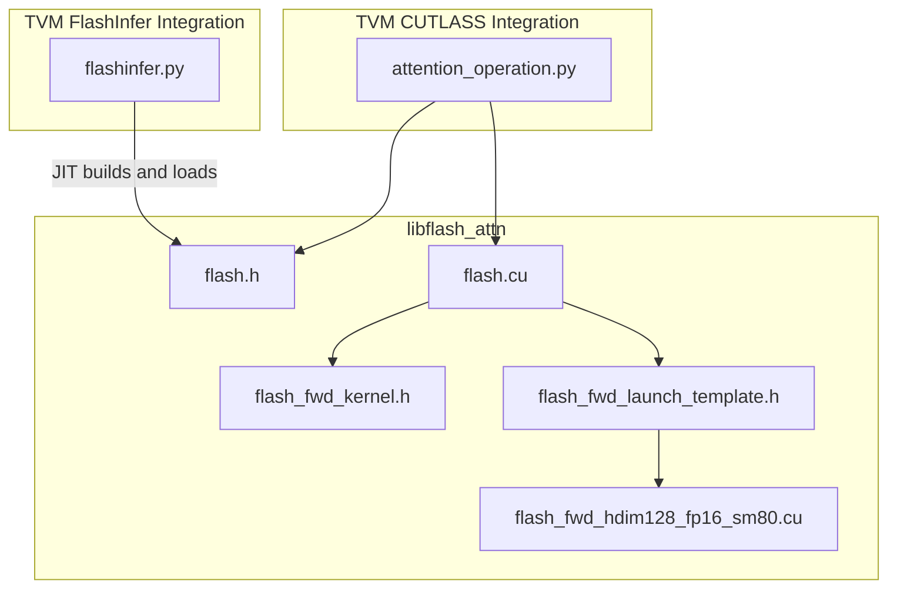
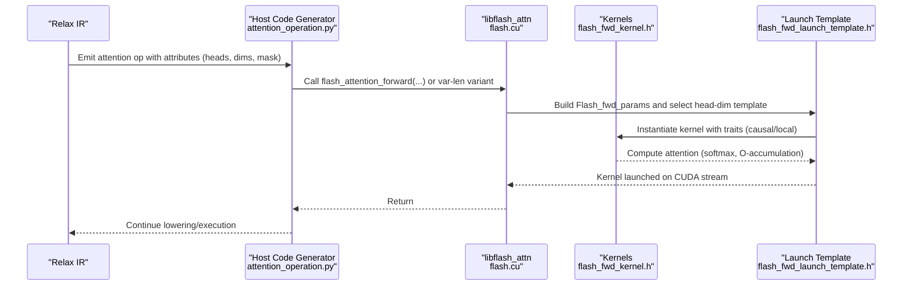
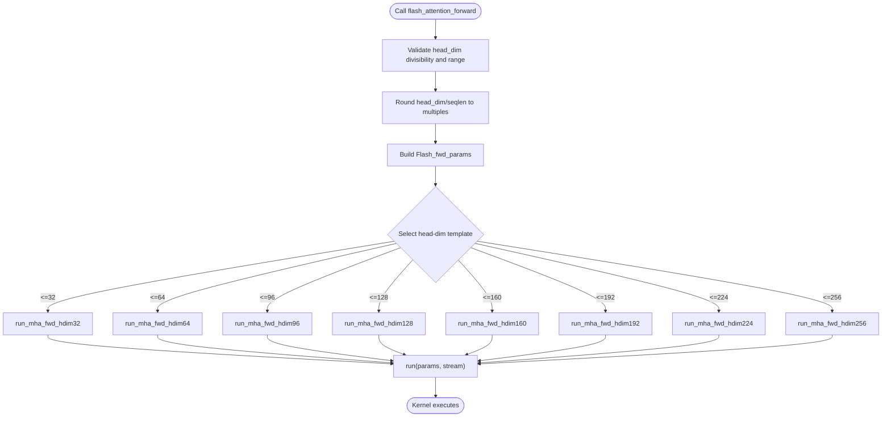
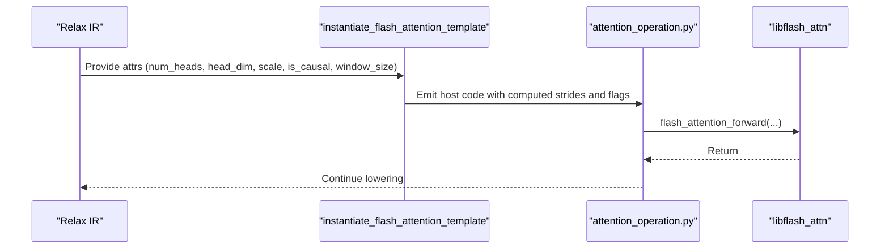
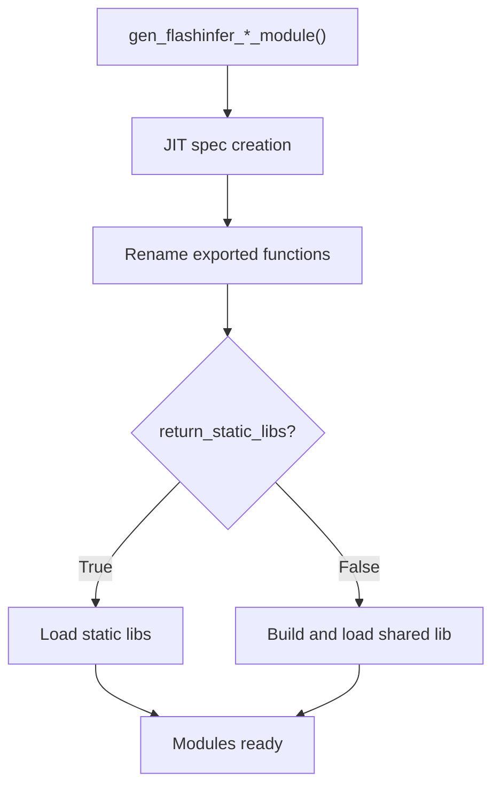
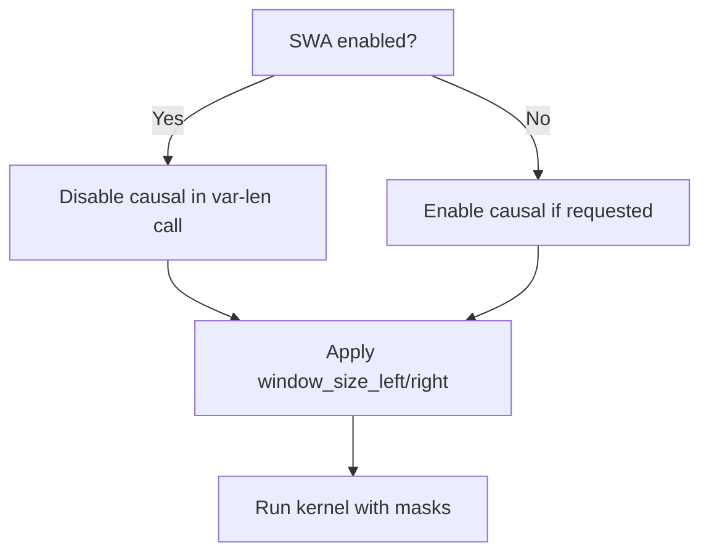
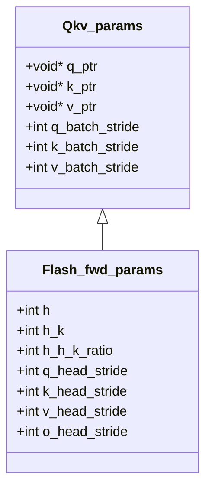
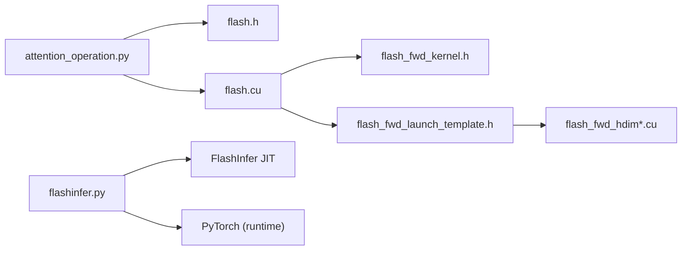

# Flash Attention Acceleration

<cite>
**Referenced Files in This Document**
- [flash.h](file://3rdparty/libflash_attn/include/flash.h)
- [flash.cu](file://3rdparty/libflash_attn/src/flash.cu)
- [flash_fwd_kernel.h](file://3rdparty/libflash_attn/src/flash_fwd_kernel.h)
- [flash_fwd_launch_template.h](file://3rdparty/libflash_attn/src/flash_fwd_launch_template.h)
- [flash_fwd_hdim128_fp16_sm80.cu](file://3rdparty/libflash_attn/src/flash_fwd_hdim128_fp16_sm80.cu)
- [attention_operation.py](file://python/tvm/contrib/cutlass/attention_operation.py)
- [flashinfer.py](file://python/tvm/relax/backend/cuda/flashinfer.py)
- [LICENSE.libflash_attn.txt](file://licenses/LICENSE.libflash_attn.txt)
- [README.md](file://3rdparty/libflash_attn/README.md)
- [test_group_gemm_flashinfer.py](file://tests/python/relax/test_group_gemm_flashinfer.py)
</cite>

## Table of Contents
1. [Introduction](#introduction)
2. [Project Structure](#project-structure)
3. [Core Components](#core-components)
4. [Architecture Overview](#architecture-overview)
5. [Detailed Component Analysis](#detailed-component-analysis)
6. [Dependency Analysis](#dependency-analysis)
7. [Performance Considerations](#performance-considerations)
8. [Troubleshooting Guide](#troubleshooting-guide)
9. [Conclusion](#conclusion)
10. [Appendices](#appendices)

## Introduction
This document explains how TVM integrates Flash Attention acceleration via libflash_attn and FlashInfer, focusing on:
- Flash Attention algorithm implementation and memory-efficient attention computation
- Sliding window attention (SWA) and causal masking
- Kernel selection by head dimension and sequence length handling
- Batch processing strategies and multi-query attention patterns
- Performance characteristics, memory bandwidth optimization, and numerical stability
- Practical integration steps, parameter configuration, and benchmarking guidance
- Licensing, build requirements, and compatibility with transformer architectures

## Project Structure
The Flash Attention acceleration spans three primary areas:
- libflash_attn: CUDA kernels and launch logic for Flash Attention forward passes
- CUTLASS integration: Host-side code generator for CUTLASS attention and Flash Attention dispatch
- FlashInfer integration: JIT compilation and runtime modules for FlashInfer kernels

**Diagram sources**
- [flash.h:15-70](file://3rdparty/libflash_attn/include/flash.h#L15-L70)
- [flash.cu:48-119](file://3rdparty/libflash_attn/src/flash.cu#L48-L119)
- [flash_fwd_kernel.h:60-506](file://3rdparty/libflash_attn/src/flash_fwd_kernel.h#L60-L506)
- [flash_fwd_launch_template.h:72-262](file://3rdparty/libflash_attn/src/flash_fwd_launch_template.h#L72-L262)
- [flash_fwd_hdim128_fp16_sm80.cu:29-32](file://3rdparty/libflash_attn/src/flash_fwd_hdim128_fp16_sm80.cu#L29-L32)
- [attention_operation.py:173-327](file://python/tvm/contrib/cutlass/attention_operation.py#L173-L327)
- [flashinfer.py:58-345](file://python/tvm/relax/backend/cuda/flashinfer.py#L58-L345)

**Section sources**
- [flash.h:15-70](file://3rdparty/libflash_attn/include/flash.h#L15-L70)
- [flash.cu:48-119](file://3rdparty/libflash_attn/src/flash.cu#L48-L119)
- [flash_fwd_kernel.h:60-506](file://3rdparty/libflash_attn/src/flash_fwd_kernel.h#L60-L506)
- [flash_fwd_launch_template.h:72-262](file://3rdparty/libflash_attn/src/flash_fwd_launch_template.h#L72-L262)
- [flash_fwd_hdim128_fp16_sm80.cu:29-32](file://3rdparty/libflash_attn/src/flash_fwd_hdim128_fp16_sm80.cu#L29-L32)
- [attention_operation.py:173-327](file://python/tvm/contrib/cutlass/attention_operation.py#L173-L327)
- [flashinfer.py:58-345](file://python/tvm/relax/backend/cuda/flashinfer.py#L58-L345)

## Core Components
- libflash_attn API: Declares Flash Attention forward passes for fixed-length and variable-length sequences, with sliding window and causal masking parameters.
- Kernel selection: Dispatches to specialized templates based on head dimension and device compute capability.
- CUTLASS host generator: Emits host code to call libflash_attn or CUTLASS kernels depending on attributes and masks.
- FlashInfer JIT: Generates and loads FlashInfer modules for prefill/decode/MLA and grouped GEMM.

Key capabilities:
- Fixed-length attention with optional causal masking and sliding window
- Variable-length attention with cu_seqlens
- Multi-head, multi-query/grouped-query attention patterns
- Head dimensions supported via dedicated templates (e.g., 32–256)
- Batched execution across batches and heads

**Section sources**
- [flash.h:15-70](file://3rdparty/libflash_attn/include/flash.h#L15-L70)
- [flash.cu:48-119](file://3rdparty/libflash_attn/src/flash.cu#L48-L119)
- [flash_fwd_launch_template.h:108-259](file://3rdparty/libflash_attn/src/flash_fwd_launch_template.h#L108-L259)
- [attention_operation.py:173-327](file://python/tvm/contrib/cutlass/attention_operation.py#L173-L327)
- [flashinfer.py:58-345](file://python/tvm/relax/backend/cuda/flashinfer.py#L58-L345)

## Architecture Overview
The end-to-end flow from TVM Relax IR to hardware execution:

**Diagram sources**
- [attention_operation.py:173-327](file://python/tvm/contrib/cutlass/attention_operation.py#L173-L327)
- [flash.cu:48-119](file://3rdparty/libflash_attn/src/flash.cu#L48-L119)
- [flash_fwd_kernel.h:60-506](file://3rdparty/libflash_attn/src/flash_fwd_kernel.h#L60-L506)
- [flash_fwd_launch_template.h:72-106](file://3rdparty/libflash_attn/src/flash_fwd_launch_template.h#L72-L106)

## Detailed Component Analysis

### libflash_attn Forward API and Kernel Selection
- API surface:
  - Fixed-length: accepts Q, K, V pointers, batch/head/stride parameters, scaling, causal flag, and sliding window offsets.
  - Variable-length: accepts cu_seqlens arrays and max sequence lengths.
- Kernel selection:
  - Runtime head-dimension checks and rounding to multiples of 32/128.
  - Dispatch to specialized templates per head dimension (e.g., 32, 64, 96, 128, 160, 192, 224, 256).
  - Device capability detection to choose optimal block sizes and shared memory usage.
- Sliding window and causal:
  - Window offsets are passed to kernels; causal disables local window mode.
  - Early-exit logic avoids out-of-bounds reads when windows do not overlap.

**Diagram sources**
- [flash.cu:75-119](file://3rdparty/libflash_attn/src/flash.cu#L75-L119)
- [flash_fwd_launch_template.h:108-259](file://3rdparty/libflash_attn/src/flash_fwd_launch_template.h#L108-L259)

**Section sources**
- [flash.h:15-70](file://3rdparty/libflash_attn/include/flash.h#L15-L70)
- [flash.cu:48-119](file://3rdparty/libflash_attn/src/flash.cu#L48-L119)
- [flash_fwd_launch_template.h:108-259](file://3rdparty/libflash_attn/src/flash_fwd_launch_template.h#L108-L259)

### CUTLASS Host Code Generator for Flash Attention
- Attribute-driven generation:
  - Computes strides for Q/K/V/O across batch, row, and head dimensions.
  - Supports stacked QKV layout and separate Q/K/V layouts.
  - Passes sliding window and causal flags to the underlying API.
- Variable-length support:
  - Uses cu_seqlens and max sequence lengths; adjusts window behavior for SWA vs causal.
- Bias and workspace handling:
  - Optional bias tensor with strides; accumulates output when needed.

**Diagram sources**
- [attention_operation.py:173-327](file://python/tvm/contrib/cutlass/attention_operation.py#L173-L327)

**Section sources**
- [attention_operation.py:173-327](file://python/tvm/contrib/cutlass/attention_operation.py#L173-L327)

### FlashInfer JIT Integration
- Precompile-time JIT:
  - Generates prefill/decode/MLA modules with configurable dtypes and head dimensions.
  - Renames exported function names to avoid conflicts.
- Runtime loading:
  - Builds and loads static libraries or returns raw object files for later linking.
- Tests demonstrate correctness and performance baselines for grouped GEMM and FlashInfer kernels.

**Diagram sources**
- [flashinfer.py:58-345](file://python/tvm/relax/backend/cuda/flashinfer.py#L58-L345)

**Section sources**
- [flashinfer.py:58-345](file://python/tvm/relax/backend/cuda/flashinfer.py#L58-L345)
- [test_group_gemm_flashinfer.py:352-476](file://tests/python/relax/test_group_gemm_flashinfer.py#L352-L476)

### Sliding Window Attention and Masking
- Sliding window:
  - Left/right window offsets are passed to kernels; SWA requires disabling causal to avoid conflicting constraints.
- Causal masking:
  - Enforced via kernel logic that limits attention to valid positions.
- Variable-length sequences:
  - cu_seqlens define per-batch sequence boundaries; max lengths guide tiling and rounding.

**Diagram sources**
- [flash.cu:121-187](file://3rdparty/libflash_attn/src/flash.cu#L121-L187)
- [attention_operation.py:278-327](file://python/tvm/contrib/cutlass/attention_operation.py#L278-L327)

**Section sources**
- [flash.cu:121-187](file://3rdparty/libflash_attn/src/flash.cu#L121-L187)
- [attention_operation.py:278-327](file://python/tvm/contrib/cutlass/attention_operation.py#L278-L327)

### Multi-Query and Grouped Attention Patterns
- libflash_attn supports num_heads_k != num_heads via stride and ratio fields.
- CUTLASS host generator sets num_q_heads and num_kv_heads accordingly.
- FlashInfer integration targets multi-head attention; MQA/GQA can be modeled via head ratios.

**Diagram sources**
- [flash_fwd_launch_template.h:18-69](file://3rdparty/libflash_attn/src/flash_fwd_launch_template.h#L18-L69)

**Section sources**
- [flash_fwd_launch_template.h:18-69](file://3rdparty/libflash_attn/src/flash_fwd_launch_template.h#L18-L69)
- [attention_operation.py:173-275](file://python/tvm/contrib/cutlass/attention_operation.py#L173-L275)

## Dependency Analysis
- TVM CUTLASS attention generator depends on libflash_attn headers and APIs.
- libflash_attn kernels depend on CUTLASS types and CUTLASS-compatible numeric types.
- FlashInfer integration depends on external FlashInfer Python package and PyTorch for JIT.

**Diagram sources**
- [attention_operation.py:173-327](file://python/tvm/contrib/cutlass/attention_operation.py#L173-L327)
- [flash.h:15-70](file://3rdparty/libflash_attn/include/flash.h#L15-L70)
- [flash.cu:48-119](file://3rdparty/libflash_attn/src/flash.cu#L48-L119)
- [flash_fwd_kernel.h:60-506](file://3rdparty/libflash_attn/src/flash_fwd_kernel.h#L60-L506)
- [flash_fwd_launch_template.h:72-106](file://3rdparty/libflash_attn/src/flash_fwd_launch_template.h#L72-L106)
- [flashinfer.py:58-345](file://python/tvm/relax/backend/cuda/flashinfer.py#L58-L345)

**Section sources**
- [attention_operation.py:173-327](file://python/tvm/contrib/cutlass/attention_operation.py#L173-L327)
- [flashinfer.py:58-345](file://python/tvm/relax/backend/cuda/flashinfer.py#L58-L345)

## Performance Considerations
- Memory bandwidth optimization:
  - Tiled GEMM with cp.async and shared-memory reuse reduces global memory traffic.
  - V transposition and swizzled layouts improve coalesced access.
- Numerical stability:
  - Online softmax rescaling prevents overflow; log-sum-exp tracked per row.
- Occupancy and shared memory:
  - Device capability-aware kernel traits; dynamic shared memory attributes set for large templates.
- Head-dimension specialization:
  - Separate templates for 32–256 improve occupancy and reduce register pressure.
- Batch and sequence handling:
  - Even-M/N and even-K assumptions reduce predicate overhead; fallback paths for irregular shapes.

[No sources needed since this section provides general guidance]

## Troubleshooting Guide
- Compilation issues with host compiler:
  - g++-9 may cause issues; g++-11 recommended.
- Missing dependencies:
  - FlashInfer requires installation and PyTorch availability for JIT.
- Incorrect window/causal combinations:
  - SWA and causal cannot be combined in variable-length mode; ensure proper flags.
- Workspace allocation:
  - CUTLASS path may require an output accumulator buffer; ensure sufficient workspace.

**Section sources**
- [README.md:6-14](file://3rdparty/libflash_attn/README.md#L6-L14)
- [flashinfer.py:92-104](file://python/tvm/relax/backend/cuda/flashinfer.py#L92-L104)
- [attention_operation.py:110-159](file://python/tvm/contrib/cutlass/attention_operation.py#L110-L159)

## Conclusion
TVM’s Flash Attention acceleration combines libflash_attn’s high-performance CUDA kernels with CUTLASS host code generation and FlashInfer’s JIT pipeline. This enables efficient, numerically stable attention for transformers with support for causal masking, sliding window attention, variable-length sequences, and multi-head/multi-query patterns. Proper configuration of head dimensions, sequence lengths, and masks ensures peak performance while maintaining compatibility across NVIDIA architectures.

[No sources needed since this section summarizes without analyzing specific files]

## Appendices

### Practical Integration Steps
- Configure attention parameters:
  - Set num_q_heads, num_kv_heads, head_dim, scale, is_causal, window_size_left/right.
- Choose kernel path:
  - Fixed-length: use flash_attention_forward.
  - Variable-length: use flash_attention_var_len_forward with cu_seqlens.
- Multi-query attention:
  - Adjust num_kv_heads and rely on stride/ratio fields.
- Benchmarking:
  - Use FlashInfer grouped GEMM tests as a reference for correctness and performance baselines.

**Section sources**
- [attention_operation.py:173-327](file://python/tvm/contrib/cutlass/attention_operation.py#L173-L327)
- [flashinfer.py:58-345](file://python/tvm/relax/backend/cuda/flashinfer.py#L58-L345)
- [test_group_gemm_flashinfer.py:352-476](file://tests/python/relax/test_group_gemm_flashinfer.py#L352-L476)

### Licensing and Compatibility
- libflash_attn license: BSD 3-Clause.
- Compatibility:
  - Requires CUDA-capable devices; head_dim support up to 256.
  - FlashInfer requires FlashInfer and PyTorch installations.

**Section sources**
- [LICENSE.libflash_attn.txt:1-30](file://licenses/LICENSE.libflash_attn.txt#L1-L30)
- [flashinfer.py:92-104](file://python/tvm/relax/backend/cuda/flashinfer.py#L92-L104)