# Hexagon DSP Backend

<cite>
**Referenced Files in This Document**
- [README.md](file://src/runtime/hexagon/README.md)
- [hexagon_device_api.h](file://src/runtime/hexagon/hexagon_device_api.h)
- [hexagon_buffer.h](file://src/runtime/hexagon/hexagon_buffer.h)
- [hexagon_buffer_manager.h](file://src/runtime/hexagon/hexagon_buffer_manager.h)
- [hexagon_hvx.h](file://src/runtime/hexagon/hexagon_hvx.h)
- [hexagon_power_manager.h](file://src/runtime/hexagon/hexagon_power_manager.h)
- [hexagon_vtcm_pool.h](file://src/runtime/hexagon/hexagon_vtcm_pool.h)
- [hexagon_thread_manager.h](file://src/runtime/hexagon/hexagon_thread_manager.h)
- [hexagon_user_dma.h](file://src/runtime/hexagon/hexagon_user_dma.h)
- [session.py](file://python/tvm/contrib/hexagon/session.py)
- [build.py](file://python/tvm/contrib/hexagon/build.py)
- [tools.py](file://python/tvm/contrib/hexagon/tools.py)
- [meta_schedule.py](file://python/tvm/contrib/hexagon/meta_schedule.py)
- [README.md](file://apps/hexagon_launcher/README.md)
- [threading_backend.cc](file://src/runtime/threading_backend.cc)
</cite>

## Table of Contents
1. [Introduction](#introduction)
2. [Project Structure](#project-structure)
3. [Core Components](#core-components)
4. [Architecture Overview](#architecture-overview)
5. [Detailed Component Analysis](#detailed-component-analysis)
6. [Dependency Analysis](#dependency-analysis)
7. [Performance Considerations](#performance-considerations)
8. [Troubleshooting Guide](#troubleshooting-guide)
9. [Conclusion](#conclusion)
10. [Appendices](#appendices)

## Introduction
This document explains the Hexagon DSP backend support in TVM. It covers the Hexagon runtime system, DSP programming model, and memory hierarchy. It also documents Hexagon-specific optimizations, vector processing capabilities, power management features, SDK/toolchain integration, deployment workflow, launcher architecture, RPC communication, application lifecycle management, data layout requirements, quantization strategies, and performance tuning guidelines. Practical examples are provided via file references to real implementations in the repository.

## Project Structure
The Hexagon backend spans runtime components, Python integration helpers, and launcher applications:
- Runtime: device API, buffer management, HVX, VTCM, DMA, power management, threading, and profiling.
- Python integration: session management, RPC launcher, build utilities, and meta-schedule integration.
- Launcher: Android and simulator-side components for model execution and profiling.

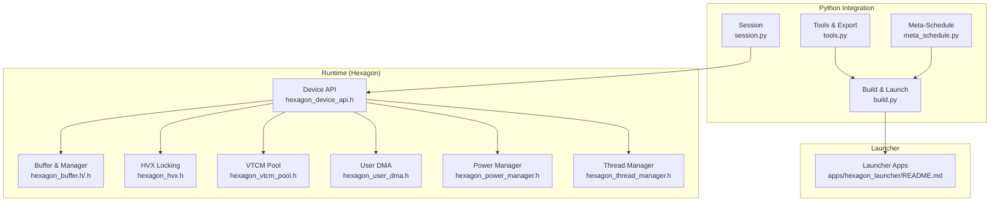

**Diagram sources**
- [session.py:34-122](file://python/tvm/contrib/hexagon/session.py#L34-L122)
- [build.py:168-314](file://python/tvm/contrib/hexagon/build.py#L168-L314)
- [tools.py:397-401](file://python/tvm/contrib/hexagon/tools.py#L397-L401)
- [meta_schedule.py:132-148](file://python/tvm/contrib/hexagon/meta_schedule.py#L132-L148)
- [hexagon_device_api.h:46-203](file://src/runtime/hexagon/hexagon_device_api.h#L46-L203)
- [hexagon_buffer.h:38-160](file://src/runtime/hexagon/hexagon_buffer.h#L38-L160)
- [hexagon_hvx.h:27-62](file://src/runtime/hexagon/hexagon_hvx.h#L27-L62)
- [hexagon_vtcm_pool.h:36-112](file://src/runtime/hexagon/hexagon_vtcm_pool.h#L36-L112)
- [hexagon_user_dma.h:40-104](file://src/runtime/hexagon/hexagon_user_dma.h#L40-L104)
- [hexagon_power_manager.h:27-57](file://src/runtime/hexagon/hexagon_power_manager.h#L27-L57)
- [hexagon_thread_manager.h:54-244](file://src/runtime/hexagon/hexagon_thread_manager.h#L54-L244)
- [README.md:18-75](file://src/runtime/hexagon/README.md#L18-L75)
- [README.md:17-146](file://apps/hexagon_launcher/README.md#L17-L146)

**Section sources**
- [README.md:18-75](file://src/runtime/hexagon/README.md#L18-L75)
- [README.md:17-146](file://apps/hexagon_launcher/README.md#L17-L146)

## Core Components
- Device API: central runtime entry for resource acquisition, attribute queries, memory/workspace allocation/free, and data copies. It composes buffer manager, VTCM pool, thread manager, DMA, and power manager.
- Buffer and Buffer Manager: manage 1-D contiguous and 2-D discontiguous allocations across DDR and VTCM, with copy primitives and RAII.
- HVX: thread-local locking mechanism to reserve HVX units for vector operations.
- VTCM Pool: allocates and tracks VTCM segments, exposes capacity and allocation status.
- User DMA: user-space DMA engine abstraction with queues, grouping, polling, and waits.
- Power Manager: controls HVX/HTP power domains and DCVS settings.
- Thread Manager: spawns and coordinates Hexagon threads with pipes, semaphores, and resource binding.
- Python Session: RPC session wrapper to acquire/release runtime resources, upload modules, and load them remotely.
- Build/Launch: utilities to export modules, push artifacts, and start RPC servers on device or simulator.
- Tools: export shared libraries, allocate arrays with physical layouts, and link shared objects.
- Meta-Schedule: builder and evaluator integration for Hexagon targets.

**Section sources**
- [hexagon_device_api.h:46-203](file://src/runtime/hexagon/hexagon_device_api.h#L46-L203)
- [hexagon_buffer.h:38-160](file://src/runtime/hexagon/hexagon_buffer.h#L38-L160)
- [hexagon_buffer_manager.h:36-87](file://src/runtime/hexagon/hexagon_buffer_manager.h#L36-L87)
- [hexagon_hvx.h:27-62](file://src/runtime/hexagon/hexagon_hvx.h#L27-L62)
- [hexagon_vtcm_pool.h:36-112](file://src/runtime/hexagon/hexagon_vtcm_pool.h#L36-L112)
- [hexagon_user_dma.h:40-104](file://src/runtime/hexagon/hexagon_user_dma.h#L40-L104)
- [hexagon_power_manager.h:27-57](file://src/runtime/hexagon/hexagon_power_manager.h#L27-L57)
- [hexagon_thread_manager.h:54-244](file://src/runtime/hexagon/hexagon_thread_manager.h#L54-L244)
- [session.py:34-122](file://python/tvm/contrib/hexagon/session.py#L34-L122)
- [build.py:168-314](file://python/tvm/contrib/hexagon/build.py#L168-L314)
- [tools.py:397-401](file://python/tvm/contrib/hexagon/tools.py#L397-L401)
- [meta_schedule.py:132-148](file://python/tvm/contrib/hexagon/meta_schedule.py#L132-L148)

## Architecture Overview
The Hexagon runtime integrates with TVM’s device abstraction and provides DSP-specific subsystems. The Python session establishes an RPC connection to a remote Hexagon device or simulator, acquires runtime resources, uploads modules, and loads them for execution. The runtime composes buffer, DMA, HVX, VTCM, power, and threading subsystems.

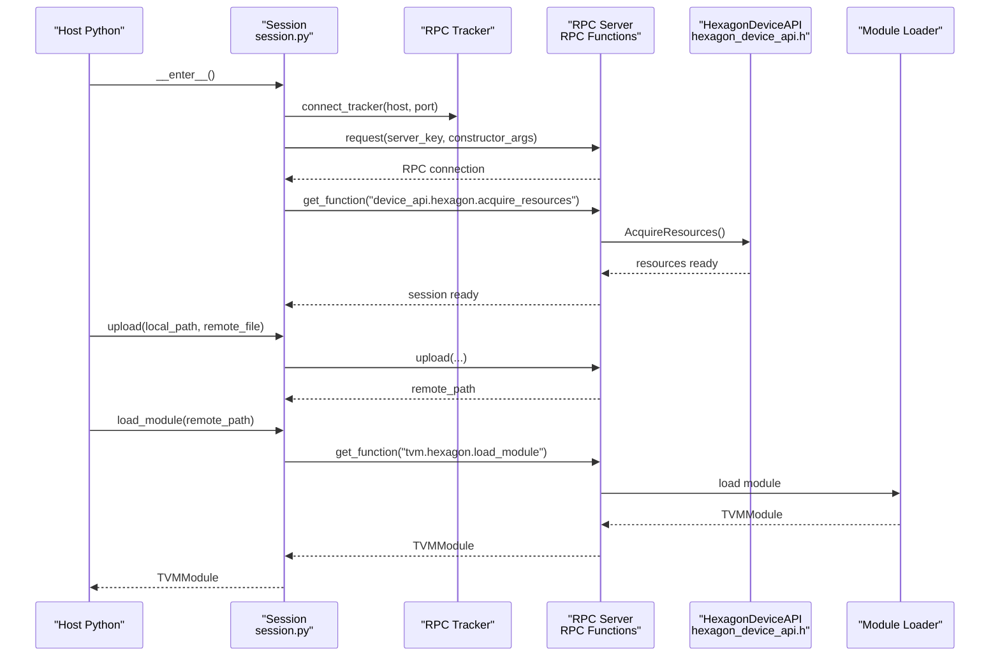

**Diagram sources**
- [session.py:83-122](file://python/tvm/contrib/hexagon/session.py#L83-L122)
- [hexagon_device_api.h:57-93](file://src/runtime/hexagon/hexagon_device_api.h#L57-L93)

## Detailed Component Analysis

### Device API and Resource Lifecycle
The Hexagon Device API is a singleton that orchestrates runtime resource initialization and teardown. It creates and owns the buffer manager, VTCM pool, thread manager, DMA engine, and power manager. It implements memory/workspace allocation and copying, and exposes thread/DMA/VTCM accessors.

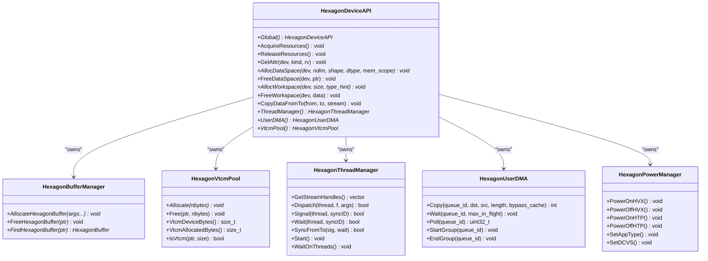

**Diagram sources**
- [hexagon_device_api.h:46-203](file://src/runtime/hexagon/hexagon_device_api.h#L46-L203)
- [hexagon_buffer_manager.h:36-87](file://src/runtime/hexagon/hexagon_buffer_manager.h#L36-L87)
- [hexagon_vtcm_pool.h:36-112](file://src/runtime/hexagon/hexagon_vtcm_pool.h#L36-L112)
- [hexagon_thread_manager.h:54-244](file://src/runtime/hexagon/hexagon_thread_manager.h#L54-L244)
- [hexagon_user_dma.h:40-104](file://src/runtime/hexagon/hexagon_user_dma.h#L40-L104)
- [hexagon_power_manager.h:27-57](file://src/runtime/hexagon/hexagon_power_manager.h#L27-L57)

**Section sources**
- [hexagon_device_api.h:46-203](file://src/runtime/hexagon/hexagon_device_api.h#L46-L203)

### Buffer Management and Memory Scopes
Hexagon buffers support 1-D contiguous and 2-D discontiguous allocations with explicit storage scopes (DDR and VTCM). The buffer manager tracks allocations and ensures RAII semantics. Copies can be performed between external buffers and Hexagon buffers, and between buffers themselves.

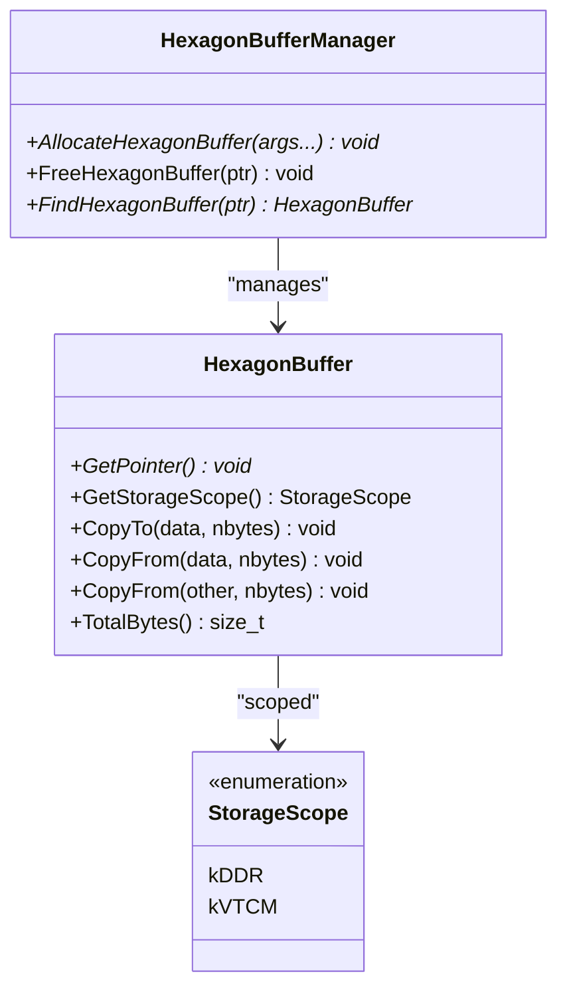

**Diagram sources**
- [hexagon_buffer.h:38-160](file://src/runtime/hexagon/hexagon_buffer.h#L38-L160)
- [hexagon_buffer_manager.h:36-87](file://src/runtime/hexagon/hexagon_buffer_manager.h#L36-L87)

**Section sources**
- [hexagon_buffer.h:38-160](file://src/runtime/hexagon/hexagon_buffer.h#L38-L160)
- [hexagon_buffer_manager.h:36-87](file://src/runtime/hexagon/hexagon_buffer_manager.h#L36-L87)

### HVX Locking and Vector Processing
HVX locking allows a thread to reserve an HVX unit for vector operations. The API prevents copying/moving and provides lock/unlock semantics.

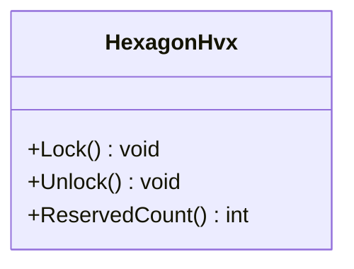

**Diagram sources**
- [hexagon_hvx.h:27-62](file://src/runtime/hexagon/hexagon_hvx.h#L27-L62)

**Section sources**
- [hexagon_hvx.h:27-62](file://src/runtime/hexagon/hexagon_hvx.h#L27-L62)

### VTCM Pool and Capacity Tracking
The VTCM pool allocates from device VTCM, tracks allocations and free segments, and exposes capacity metrics. It verifies whether a pointer resides within VTCM bounds.

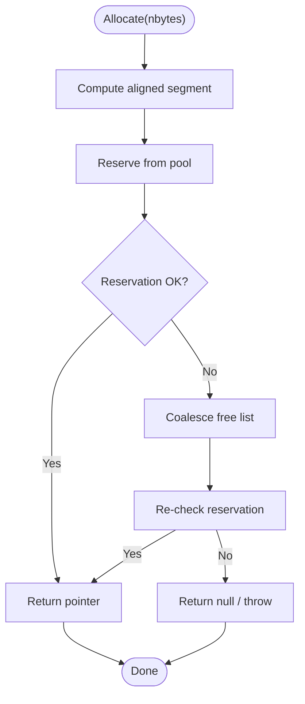

**Diagram sources**
- [hexagon_vtcm_pool.h:56-86](file://src/runtime/hexagon/hexagon_vtcm_pool.h#L56-L86)

**Section sources**
- [hexagon_vtcm_pool.h:36-112](file://src/runtime/hexagon/hexagon_vtcm_pool.h#L36-L112)

### User DMA Engine
The user DMA engine provides a queue-based abstraction for asynchronous transfers. It supports grouping operations, polling in-flight transfers, and waiting until limits are met.

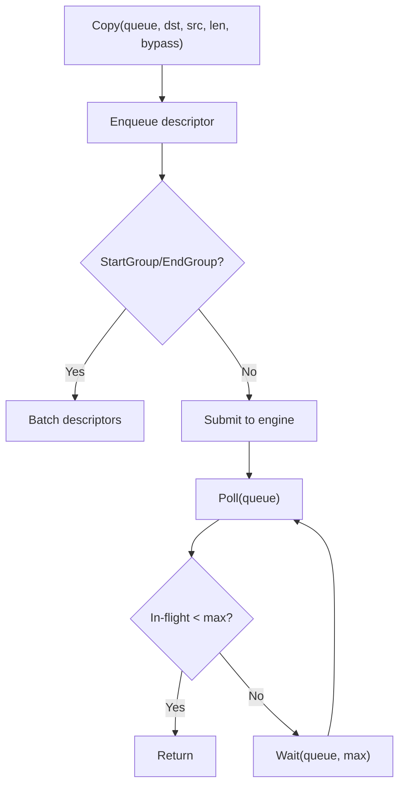

**Diagram sources**
- [hexagon_user_dma.h:49-84](file://src/runtime/hexagon/hexagon_user_dma.h#L49-L84)

**Section sources**
- [hexagon_user_dma.h:40-104](file://src/runtime/hexagon/hexagon_user_dma.h#L40-L104)

### Power Management
The power manager controls HVX/HTP power domains and DCVS settings. It encapsulates platform-specific power context and exposes power-on/power-off routines.

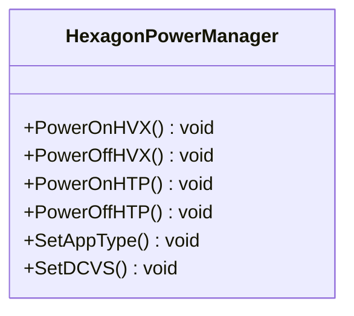

**Diagram sources**
- [hexagon_power_manager.h:27-57](file://src/runtime/hexagon/hexagon_power_manager.h#L27-L57)

**Section sources**
- [hexagon_power_manager.h:27-57](file://src/runtime/hexagon/hexagon_power_manager.h#L27-L57)

### Thread Manager and Concurrency
The thread manager spawns multiple Hexagon threads with configurable stack sizes and pipe/command buffer sizes. It supports dispatching functions, signaling/waiting on semaphores, and synchronizing between threads. It binds resources (HTP/HVX) to threads and manages command pipes.

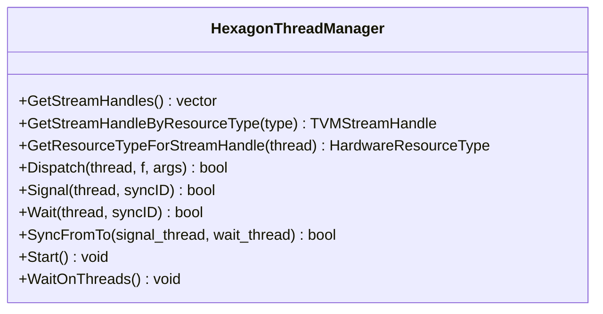

**Diagram sources**
- [hexagon_thread_manager.h:54-244](file://src/runtime/hexagon/hexagon_thread_manager.h#L54-L244)

**Section sources**
- [hexagon_thread_manager.h:54-244](file://src/runtime/hexagon/hexagon_thread_manager.h#L54-L244)

### Python Session and RPC Lifecycle
The Python Session manages RPC connections to Hexagon devices or simulators, requests sessions from the tracker, acquires runtime resources, uploads modules, and loads them. It also supports profiling output retrieval.

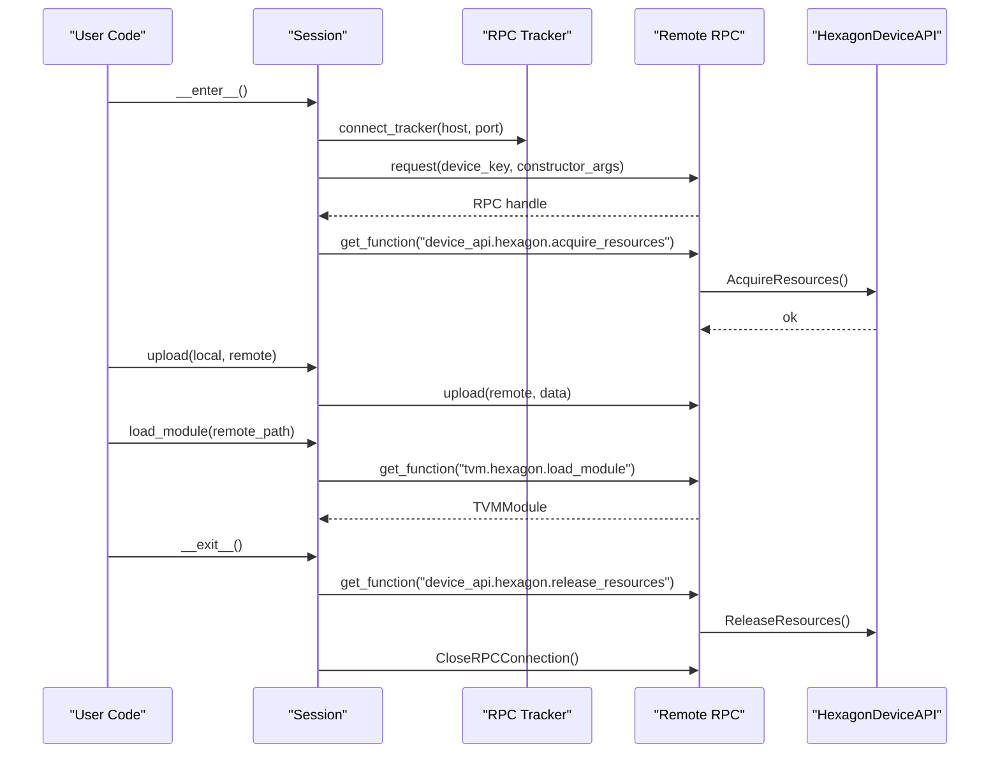

**Diagram sources**
- [session.py:83-122](file://python/tvm/contrib/hexagon/session.py#L83-L122)
- [session.py:166-202](file://python/tvm/contrib/hexagon/session.py#L166-L202)

**Section sources**
- [session.py:34-122](file://python/tvm/contrib/hexagon/session.py#L34-L122)
- [session.py:166-202](file://python/tvm/contrib/hexagon/session.py#L166-L202)

### Launcher Architecture and Deployment Workflow
The launcher comprises Android and Hexagon components. The Android component runs on-device and coordinates model execution, while the Hexagon component runs on the DSP. The workflow includes building the launcher, pushing binaries to the device, and executing with configuration files. Lightweight profiling (LWP) can be enabled during model compilation and dumped to JSON.

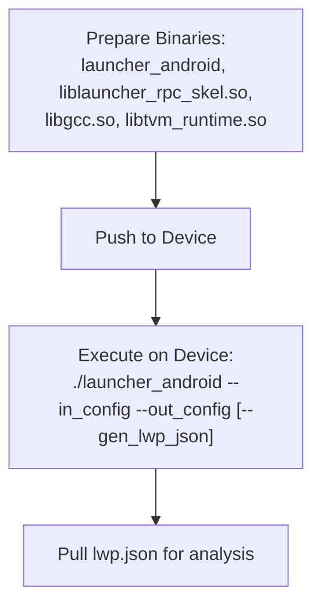

**Diagram sources**
- [README.md:91-136](file://apps/hexagon_launcher/README.md#L91-L136)

**Section sources**
- [README.md:17-146](file://apps/hexagon_launcher/README.md#L17-L146)

### Toolchain Setup and SDK Integration
The runtime README outlines enabling Hexagon support via CMake options, specifying the SDK path, and selecting architectures. It also describes building for host (cross-compilation) and non-host platforms (Hexagon/Android).

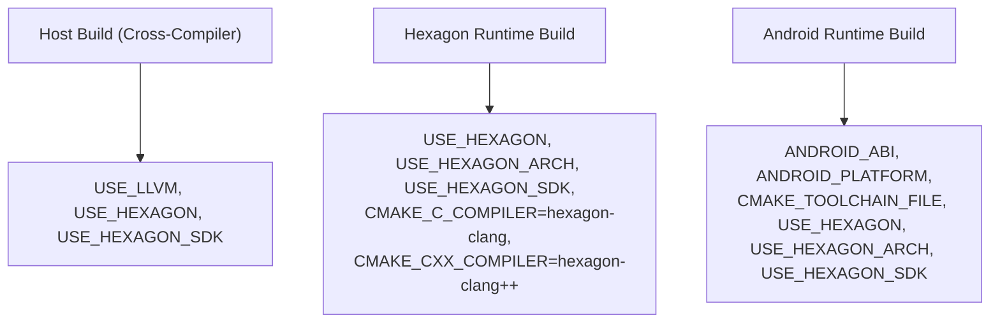

**Diagram sources**
- [README.md:28-75](file://src/runtime/hexagon/README.md#L28-L75)

**Section sources**
- [README.md:28-75](file://src/runtime/hexagon/README.md#L28-L75)

### Meta-Schedule Integration
Meta-schedule builder and evaluator integrate with Hexagon targets. The worker function creates a session, uploads the artifact, loads the module, prepares repeated arguments, and runs the evaluator to collect costs.

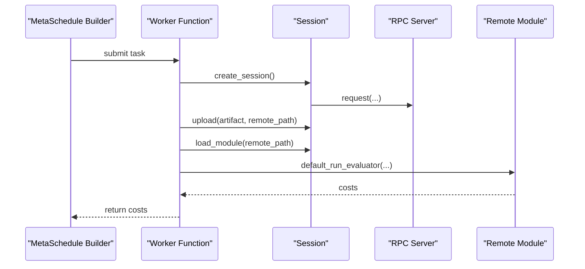

**Diagram sources**
- [meta_schedule.py:110-129](file://python/tvm/contrib/hexagon/meta_schedule.py#L110-L129)

**Section sources**
- [meta_schedule.py:110-129](file://python/tvm/contrib/hexagon/meta_schedule.py#L110-L129)

## Dependency Analysis
Key runtime dependencies among Hexagon components:

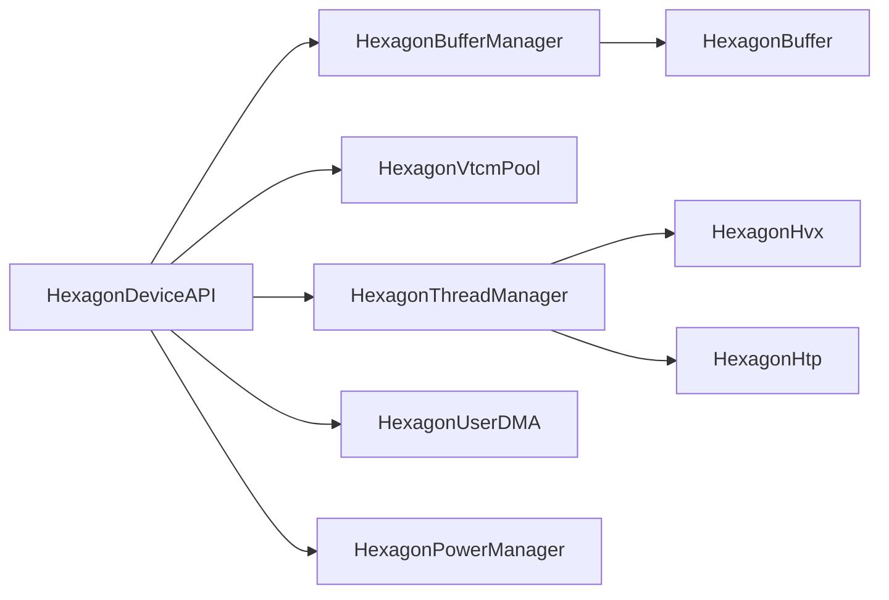

**Diagram sources**
- [hexagon_device_api.h:46-203](file://src/runtime/hexagon/hexagon_device_api.h#L46-L203)
- [hexagon_thread_manager.h:54-244](file://src/runtime/hexagon/hexagon_thread_manager.h#L54-L244)
- [hexagon_buffer_manager.h:36-87](file://src/runtime/hexagon/hexagon_buffer_manager.h#L36-L87)

**Section sources**
- [hexagon_device_api.h:46-203](file://src/runtime/hexagon/hexagon_device_api.h#L46-L203)
- [hexagon_thread_manager.h:54-244](file://src/runtime/hexagon/hexagon_thread_manager.h#L54-L244)
- [hexagon_buffer_manager.h:36-87](file://src/runtime/hexagon/hexagon_buffer_manager.h#L36-L87)

## Performance Considerations
- Vector processing: Use HVX locking to reserve units for vector kernels; align data to HVX vector lengths for optimal throughput.
- Memory placement: Prefer VTCM for hot tensors to reduce off-chip bandwidth; monitor VTCM pool capacity and allocation status.
- DMA batching: Group DMA operations using StartGroup/EndGroup to minimize descriptor overhead; poll and throttle in-flight transfers.
- Threading: Tune thread stack and pipe sizes; use semaphores to coordinate pipeline stages and avoid head-of-line blocking.
- Power: Enable appropriate power policies for sustained performance; balance HVX/HTP power gating with workload characteristics.
- Quantization: Use quantized kernels and layouts to reduce bandwidth and improve arithmetic intensity; validate accuracy with calibration datasets.
- Profiling: Enable LWP instrumentation during codegen and dump profiling JSON for function/loop-level cycle analysis.

[No sources needed since this section provides general guidance]

## Troubleshooting Guide
- RPC session acquisition failures: Verify tracker connectivity and device key; ensure acquire_resources succeeds before loading modules.
- VTCM allocation failures: Check VTCM capacity and free list coalescing; reduce tensor sizes or increase VTCM budget.
- DMA stalls: Inspect in-flight counts and adjust max_in_flight limits; ensure descriptors are properly grouped.
- HVX contention: Avoid oversubscribing HVX units; serialize vector workloads or reduce vector width.
- Launcher profiling: Confirm LWP instrumentation flags during model compilation and pull lwp.json after execution.

**Section sources**
- [session.py:83-122](file://python/tvm/contrib/hexagon/session.py#L83-L122)
- [hexagon_vtcm_pool.h:76-86](file://src/runtime/hexagon/hexagon_vtcm_pool.h#L76-L86)
- [hexagon_user_dma.h:65-72](file://src/runtime/hexagon/hexagon_user_dma.h#L65-L72)
- [README.md:104-136](file://apps/hexagon_launcher/README.md#L104-L136)

## Conclusion
The Hexagon DSP backend in TVM provides a comprehensive runtime system integrating device APIs, buffer management, VTCM pools, DMA engines, HVX locking, power management, and threading. Python utilities streamline RPC sessions, module export, and meta-schedule integration. The launcher enables on-device execution and profiling. Proper data layout, quantization, and performance tuning yield significant gains on Hexagon DSP.

[No sources needed since this section summarizes without analyzing specific files]

## Appendices

### Practical Examples (by file reference)
- Export a module to a shared object for deployment:
  - [tools.py:397-401](file://python/tvm/contrib/hexagon/tools.py#L397-L401)
- Allocate a Hexagon array with physical layout:
  - [tools.py:404-438](file://python/tvm/contrib/hexagon/tools.py#L404-L438)
- Build and launch on Android/simulator:
  - [build.py:168-314](file://python/tvm/contrib/hexagon/build.py#L168-L314)
- Start a session and load a module:
  - [session.py:83-122](file://python/tvm/contrib/hexagon/session.py#L83-L122)
  - [session.py:166-202](file://python/tvm/contrib/hexagon/session.py#L166-L202)
- Meta-schedule evaluation on Hexagon:
  - [meta_schedule.py:110-129](file://python/tvm/contrib/hexagon/meta_schedule.py#L110-L129)
- Enable LWP profiling in launcher:
  - [README.md:104-136](file://apps/hexagon_launcher/README.md#L104-L136)