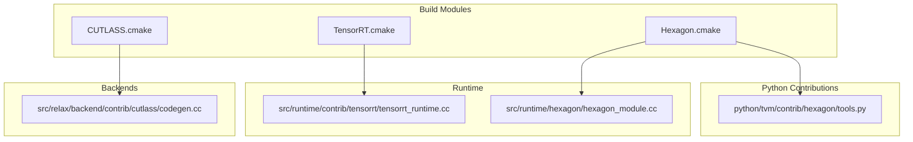
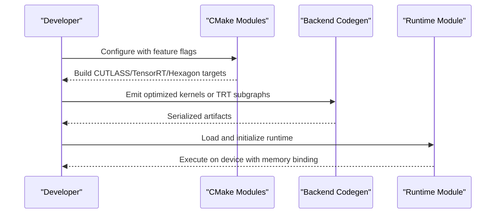
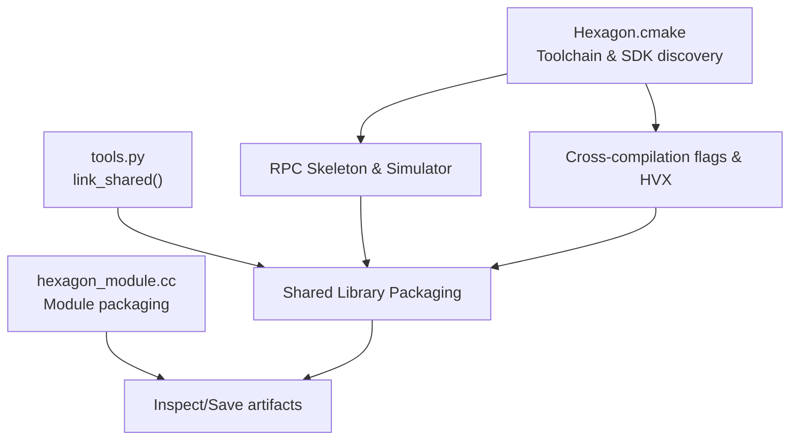
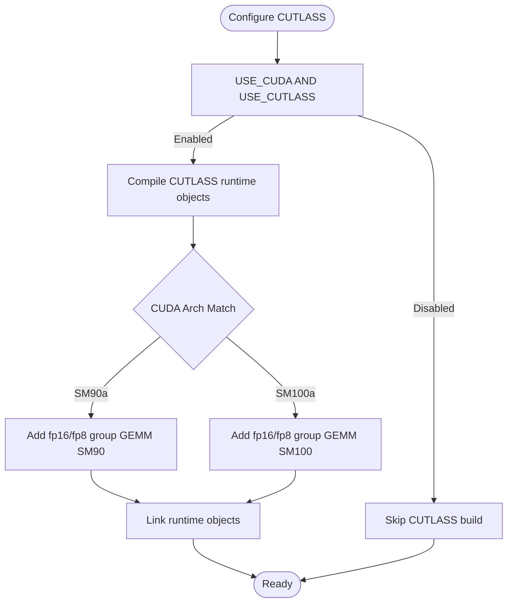
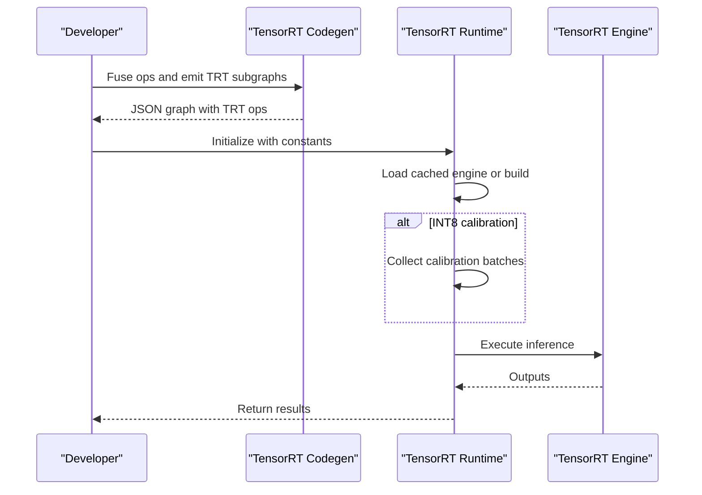
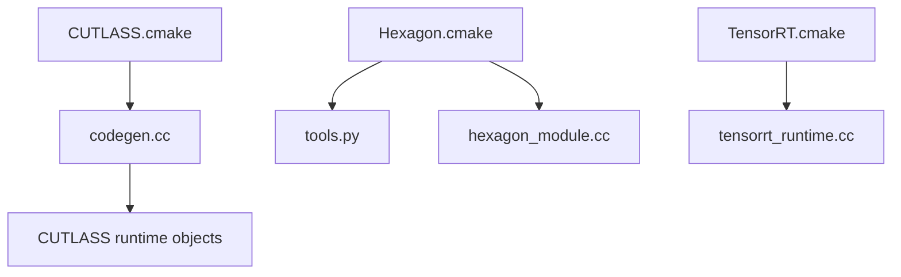

# Specialized Accelerators

<cite>
**Referenced Files in This Document**
- [CUTLASS.cmake](file://cmake/modules/contrib/CUTLASS.cmake)
- [TensorRT.cmake](file://cmake/modules/contrib/TensorRT.cmake)
- [Hexagon.cmake](file://cmake/modules/Hexagon.cmake)
- [tools.py](file://python/tvm/contrib/hexagon/tools.py)
- [hexagon_module.cc](file://src/runtime/hexagon/hexagon_module.cc)
- [tensorrt_runtime.cc](file://src/runtime/contrib/tensorrt/tensorrt_runtime.cc)
- [codegen.cc](file://src/relax/backend/contrib/cutlass/codegen.cc)
- [README.md (Hexagon API app)](file://apps/hexagon_api/README.md)
- [README.md (Hexagon Graph Launcher)](file://apps/hexagon_launcher/README.md)
- [cl_ext.h](file://3rdparty/OpenCL-Headers/CL/cl_ext.h)
- [LICENSE.cutlass.txt](file://licenses/LICENSE.cutlass.txt)
- [LICENSE.tensorrt_llm.txt](file://licenses/LICENSE.tensorrt_llm.txt)
- [test_codegen_tensorrt.py](file://tests/python/relax/test_codegen_tensorrt.py)
</cite>

## Table of Contents
1. [Introduction](#introduction)
2. [Project Structure](#project-structure)
3. [Core Components](#core-components)
4. [Architecture Overview](#architecture-overview)
5. [Detailed Component Analysis](#detailed-component-analysis)
6. [Dependency Analysis](#dependency-analysis)
7. [Performance Considerations](#performance-considerations)
8. [Troubleshooting Guide](#troubleshooting-guide)
9. [Conclusion](#conclusion)
10. [Appendices](#appendices)

## Introduction
This document explains specialized hardware accelerator support in TVM with a focus on:
- Hexagon DSP backend for Qualcomm SoCs
- CUTLASS tensor core optimizations for NVIDIA GPUs
- TensorRT inference optimization for NVIDIA GPUs
- Other specialized accelerators and vendor toolchains

It covers accelerator-specific programming models, memory hierarchies, integration with third-party libraries and SDKs, deployment workflows, performance tuning, debugging, licensing, and compatibility considerations. Emerging accelerator technologies are discussed alongside established ones.

## Project Structure
TVM’s specialized accelerator support spans build configuration, Python contribution utilities, runtime modules, and backend code generation:
- Build modules define how to include CUTLASS, TensorRT, and Hexagon components.
- Python contributions expose tooling for Hexagon linking and packaging.
- Runtime modules implement device-specific execution and memory management.
- Backend code generators translate high-level operators into optimized kernels.

**Diagram sources**
- [CUTLASS.cmake:18-87](file://cmake/modules/contrib/CUTLASS.cmake#L18-L87)
- [TensorRT.cmake:24-59](file://cmake/modules/contrib/TensorRT.cmake#L24-L59)
- [Hexagon.cmake:55-343](file://cmake/modules/Hexagon.cmake#L55-L343)
- [tools.py:30-249](file://python/tvm/contrib/hexagon/tools.py#L30-L249)
- [hexagon_module.cc:40-100](file://src/runtime/hexagon/hexagon_module.cc#L40-L100)
- [tensorrt_runtime.cc:61-559](file://src/runtime/contrib/tensorrt/tensorrt_runtime.cc#L61-L559)
- [codegen.cc](file://src/relax/backend/contrib/cutlass/codegen.cc)

**Section sources**
- [CUTLASS.cmake:18-87](file://cmake/modules/contrib/CUTLASS.cmake#L18-L87)
- [TensorRT.cmake:24-59](file://cmake/modules/contrib/TensorRT.cmake#L24-L59)
- [Hexagon.cmake:55-343](file://cmake/modules/Hexagon.cmake#L55-L343)

## Core Components
- Hexagon DSP backend
  - Build integration via Hexagon.cmake, including SDK discovery, RPC skeleton, and simulator support.
  - Python tooling for linking shared libraries and orchestrating cross-compilation.
  - Runtime module for packaging and inspecting DSP binaries.
- CUTLASS tensor cores
  - Build integration via CUTLASS.cmake, enabling fp16/fp8 group GEMM and SM90/SM100 kernels.
  - Backend code generation for CUTLASS-backed GEMM.
- TensorRT inference
  - Build integration via TensorRT.cmake, enabling codegen and runtime with optional TensorRT SDK presence.
  - Runtime module implementing JSON graph execution with engine caching and calibration.

**Section sources**
- [Hexagon.cmake:55-343](file://cmake/modules/Hexagon.cmake#L55-L343)
- [tools.py:30-249](file://python/tvm/contrib/hexagon/tools.py#L30-L249)
- [hexagon_module.cc:40-100](file://src/runtime/hexagon/hexagon_module.cc#L40-L100)
- [CUTLASS.cmake:18-87](file://cmake/modules/contrib/CUTLASS.cmake#L18-L87)
- [codegen.cc](file://src/relax/backend/contrib/cutlass/codegen.cc)
- [TensorRT.cmake:24-59](file://cmake/modules/contrib/TensorRT.cmake#L24-L59)
- [tensorrt_runtime.cc:61-559](file://src/runtime/contrib/tensorrt/tensorrt_runtime.cc#L61-L559)

## Architecture Overview
The accelerator pipeline integrates build-time selection, code generation, and runtime execution:
- Build-time: Feature flags enable CUTLASS, TensorRT, and Hexagon; CMake locates SDKs and compiles runtime extensions.
- Code generation: Backends emit optimized kernels or delegate to third-party libraries.
- Runtime: Device-specific modules handle initialization, memory binding, and execution.

**Diagram sources**
- [CUTLASS.cmake:18-87](file://cmake/modules/contrib/CUTLASS.cmake#L18-L87)
- [TensorRT.cmake:24-59](file://cmake/modules/contrib/TensorRT.cmake#L24-L59)
- [Hexagon.cmake:55-343](file://cmake/modules/Hexagon.cmake#L55-L343)
- [tensorrt_runtime.cc:113-356](file://src/runtime/contrib/tensorrt/tensorrt_runtime.cc#L113-L356)

## Detailed Component Analysis

### Hexagon DSP Backend
Hexagon support is centered around:
- Toolchain discovery and SDK integration
- RPC skeleton and simulator linkage
- Cross-compilation and shared library linking
- Runtime module for DSP binary packaging

**Diagram sources**
- [Hexagon.cmake:23-44](file://cmake/modules/Hexagon.cmake#L23-L44)
- [Hexagon.cmake:250-341](file://cmake/modules/Hexagon.cmake#L250-L341)
- [Hexagon.cmake:123-248](file://cmake/modules/Hexagon.cmake#L123-L248)
- [tools.py:63-249](file://python/tvm/contrib/hexagon/tools.py#L63-L249)
- [hexagon_module.cc:40-100](file://src/runtime/hexagon/hexagon_module.cc#L40-L100)

Key capabilities:
- Toolchain detection and environment setup
- RPC IDL generation and linking for Android/Hexagon/host
- HVX compile flags and external library integration
- Shared library linking with Docker fallback on macOS
- Module inspection and artifact export (asm, obj, ll, bc)

Practical deployment:
- Build runtime binaries for Android and Hexagon using the Hexagon API app and Graph Launcher.
- Use environment variables to configure architecture, SDK paths, and toolchain locations.
- Package DSP modules and deploy with RPC servers for simulation or device execution.

**Section sources**
- [Hexagon.cmake:23-44](file://cmake/modules/Hexagon.cmake#L23-L44)
- [Hexagon.cmake:250-341](file://cmake/modules/Hexagon.cmake#L250-L341)
- [Hexagon.cmake:123-248](file://cmake/modules/Hexagon.cmake#L123-L248)
- [tools.py:63-249](file://python/tvm/contrib/hexagon/tools.py#L63-L249)
- [hexagon_module.cc:40-100](file://src/runtime/hexagon/hexagon_module.cc#L40-L100)
- [README.md (Hexagon API app):27-59](file://apps/hexagon_api/README.md#L27-L59)
- [README.md (Hexagon Graph Launcher):34-90](file://apps/hexagon_launcher/README.md#L34-L90)

### CUTLASS Tensor Cores
CUTLASS integration enables high-throughput GEMM on supported NVIDIA architectures:
- Build-time selection of fp16/fp8 kernels for SM90/SM100
- Runtime object libraries for fpA_intB GEMM and flash attention
- Backend code generation for CUTLASS GEMM

**Diagram sources**
- [CUTLASS.cmake:18-87](file://cmake/modules/contrib/CUTLASS.cmake#L18-L87)

Optimization strategies:
- Choose appropriate precision (fp16/fp8) and layout for workload
- Tune group GEMM parameters and tiling for memory bandwidth
- Use fpA_intB GEMM for mixed-precision quantized kernels

**Section sources**
- [CUTLASS.cmake:18-87](file://cmake/modules/contrib/CUTLASS.cmake#L18-L87)
- [codegen.cc](file://src/relax/backend/contrib/cutlass/codegen.cc)

### TensorRT Inference Optimization
TensorRT integration supports offloading subgraphs and optimizing inference:
- Build-time codegen and optional runtime inclusion
- Runtime engine caching, calibration, and multi-engine modes
- JSON graph execution with automatic FP16 and INT8 support

**Diagram sources**
- [TensorRT.cmake:24-59](file://cmake/modules/contrib/TensorRT.cmake#L24-L59)
- [tensorrt_runtime.cc:113-356](file://src/runtime/contrib/tensorrt/tensorrt_runtime.cc#L113-L356)

Operational controls:
- Environment variables for workspace size, FP16, INT8 calibration, and engine caching
- Multi-engine vs single-engine batching strategies
- Dynamic vs implicit batch dimension handling

**Section sources**
- [TensorRT.cmake:24-59](file://cmake/modules/contrib/TensorRT.cmake#L24-L59)
- [tensorrt_runtime.cc:61-559](file://src/runtime/contrib/tensorrt/tensorrt_runtime.cc#L61-L559)
- [test_codegen_tensorrt.py:75-116](file://tests/python/relax/test_codegen_tensorrt.py#L75-L116)

### Other Specialized Accelerators and Vendor Toolchains
- OpenCL Intel accelerator extensions
  - Provides APIs for creating and managing Intel accelerators, motion estimation descriptors, and related device info queries.
  - Useful for integrating OpenCL-based accelerators in heterogeneous environments.

- Licensing and third-party integration
  - CUTLASS and TensorRT LLM components include separate license files indicating their terms and conditions.

**Section sources**
- [cl_ext.h:1833-1975](file://3rdparty/OpenCL-Headers/CL/cl_ext.h#L1833-L1975)
- [LICENSE.cutlass.txt](file://licenses/LICENSE.cutlass.txt)
- [LICENSE.tensorrt_llm.txt](file://licenses/LICENSE.tensorrt_llm.txt)

## Dependency Analysis
The build modules conditionally include runtime and codegen components based on feature flags. The Hexagon and TensorRT modules rely on external SDKs and libraries.

**Diagram sources**
- [CUTLASS.cmake:18-87](file://cmake/modules/contrib/CUTLASS.cmake#L18-L87)
- [codegen.cc](file://src/relax/backend/contrib/cutlass/codegen.cc)
- [Hexagon.cmake:55-343](file://cmake/modules/Hexagon.cmake#L55-L343)
- [tools.py:30-249](file://python/tvm/contrib/hexagon/tools.py#L30-L249)
- [hexagon_module.cc:40-100](file://src/runtime/hexagon/hexagon_module.cc#L40-L100)
- [TensorRT.cmake:24-59](file://cmake/modules/contrib/TensorRT.cmake#L24-L59)
- [tensorrt_runtime.cc:61-559](file://src/runtime/contrib/tensorrt/tensorrt_runtime.cc#L61-L559)

**Section sources**
- [CUTLASS.cmake:18-87](file://cmake/modules/contrib/CUTLASS.cmake#L18-L87)
- [Hexagon.cmake:55-343](file://cmake/modules/Hexagon.cmake#L55-L343)
- [TensorRT.cmake:24-59](file://cmake/modules/contrib/TensorRT.cmake#L24-L59)

## Performance Considerations
- Hexagon
  - Use HVX flags and architecture-specific ops for vectorized kernels.
  - Prefer RPC simulator for early profiling; switch to device for final benchmarks.
  - Enable lightweight profiling (LWP) instrumentation during codegen for cycle-level insights.
- CUTLASS
  - Select precision and tiling to maximize occupancy and minimize stalls.
  - Utilize group GEMM for multi-head attention and quantized kernels.
- TensorRT
  - Cache engines to disk to avoid repeated build latency.
  - Use multi-engine mode for varied batch sizes; single-engine mode for memory-constrained deployments.
  - Calibrate INT8 carefully to preserve accuracy while gaining throughput.

[No sources needed since this section provides general guidance]

## Troubleshooting Guide
- Hexagon
  - Verify toolchain and SDK paths; ensure environment variables are set before linking.
  - On macOS, shared library linking uses Docker; confirm image availability and network access.
  - Use module inspection to extract asm/obj/ll/bc for debugging DSP binaries.
- CUTLASS
  - Confirm CUDA architecture matches SM90a or SM100a to enable specialized kernels.
  - Increase verbosity via compile definitions for kernel tracing.
- TensorRT
  - Ensure TensorRT SDK is found when enabling runtime; otherwise, codegen-only builds are possible.
  - Validate INT8 calibration batches and environment variables controlling calibration and engine caching.

**Section sources**
- [tools.py:50-58](file://python/tvm/contrib/hexagon/tools.py#L50-L58)
- [tools.py:183-237](file://python/tvm/contrib/hexagon/tools.py#L183-L237)
- [hexagon_module.cc:49-81](file://src/runtime/hexagon/hexagon_module.cc#L49-L81)
- [CUTLASS.cmake:59-81](file://cmake/modules/contrib/CUTLASS.cmake#L59-L81)
- [TensorRT.cmake:37-59](file://cmake/modules/contrib/TensorRT.cmake#L37-L59)
- [tensorrt_runtime.cc:78-92](file://src/runtime/contrib/tensorrt/tensorrt_runtime.cc#L78-L92)

## Conclusion
TVM’s specialized accelerator support integrates vendor SDKs and libraries through robust build modules, efficient runtime execution, and backend code generation. Hexagon DSP, CUTLASS tensor cores, and TensorRT offer complementary optimization strategies across DSP, GPU tensor cores, and GPU inference. Proper configuration, profiling, and tuning yield significant performance gains while maintaining portability and debuggability.

[No sources needed since this section summarizes without analyzing specific files]

## Appendices

### Deployment Workflows
- Hexagon
  - Build runtime and RPC binaries using the Hexagon API app and Graph Launcher.
  - Package DSP modules and deploy with RPC servers for simulator or device.
- CUTLASS
  - Enable CUTLASS in build and select target architecture for fp16/fp8 kernels.
- TensorRT
  - Fuse ops and offload to TRT subgraphs; cache engines and calibrate INT8 as needed.

**Section sources**
- [README.md (Hexagon API app):27-59](file://apps/hexagon_api/README.md#L27-L59)
- [README.md (Hexagon Graph Launcher):34-90](file://apps/hexagon_launcher/README.md#L34-L90)
- [CUTLASS.cmake:18-87](file://cmake/modules/contrib/CUTLASS.cmake#L18-L87)
- [TensorRT.cmake:24-59](file://cmake/modules/contrib/TensorRT.cmake#L24-L59)

### Compatibility and Licensing
- CUTLASS: Refer to the license file for terms and conditions.
- TensorRT LLM: Refer to the license file for terms and conditions.
- OpenCL Intel extensions: Use documented APIs for accelerator creation and motion estimation.

**Section sources**
- [LICENSE.cutlass.txt](file://licenses/LICENSE.cutlass.txt)
- [LICENSE.tensorrt_llm.txt](file://licenses/LICENSE.tensorrt_llm.txt)
- [cl_ext.h:1833-1975](file://3rdparty/OpenCL-Headers/CL/cl_ext.h#L1833-L1975)