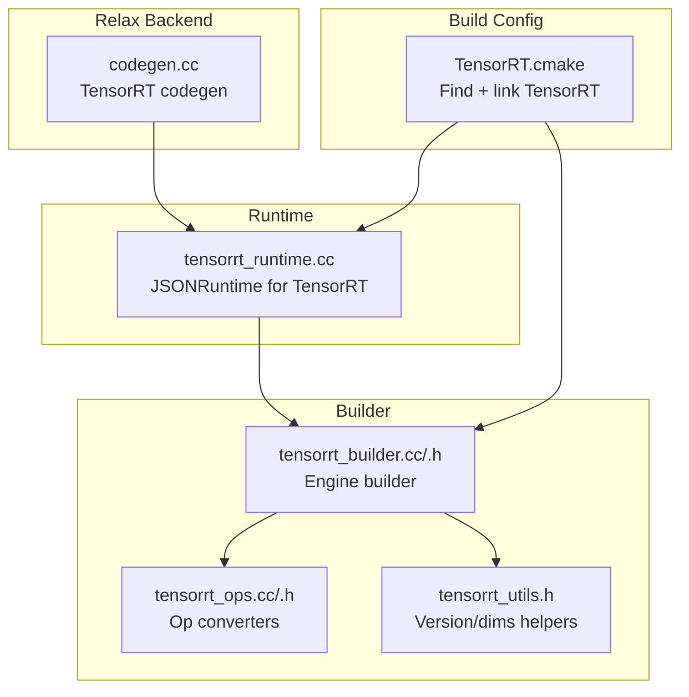
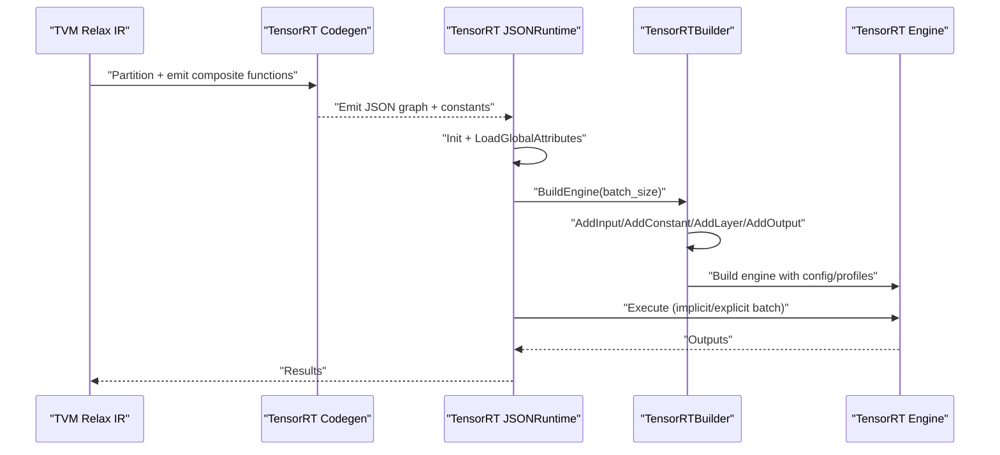
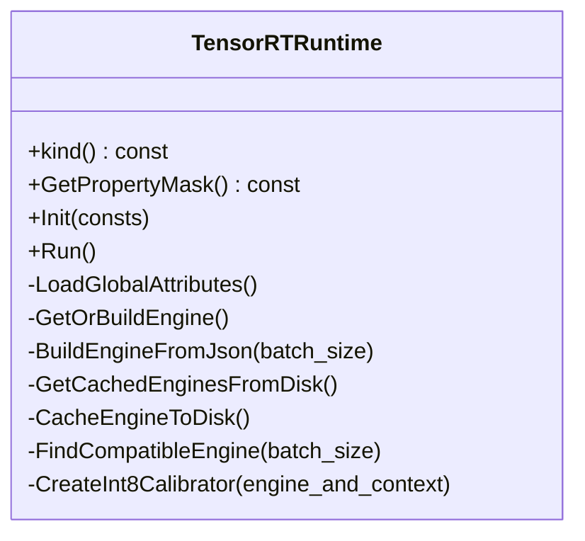
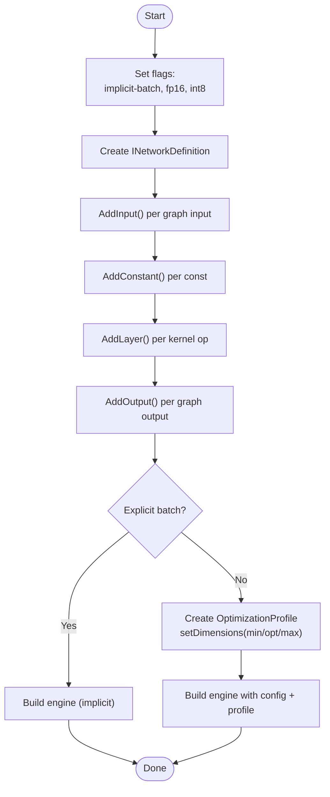
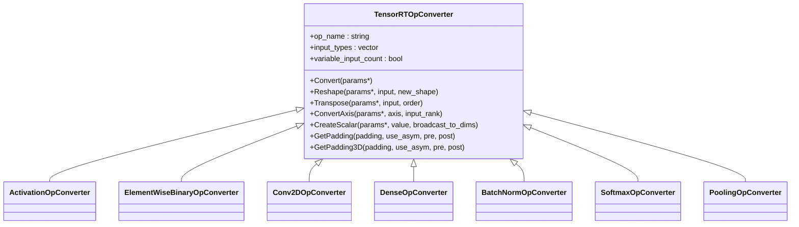
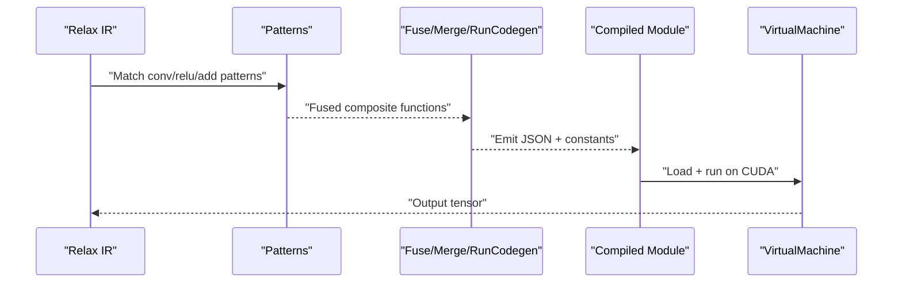
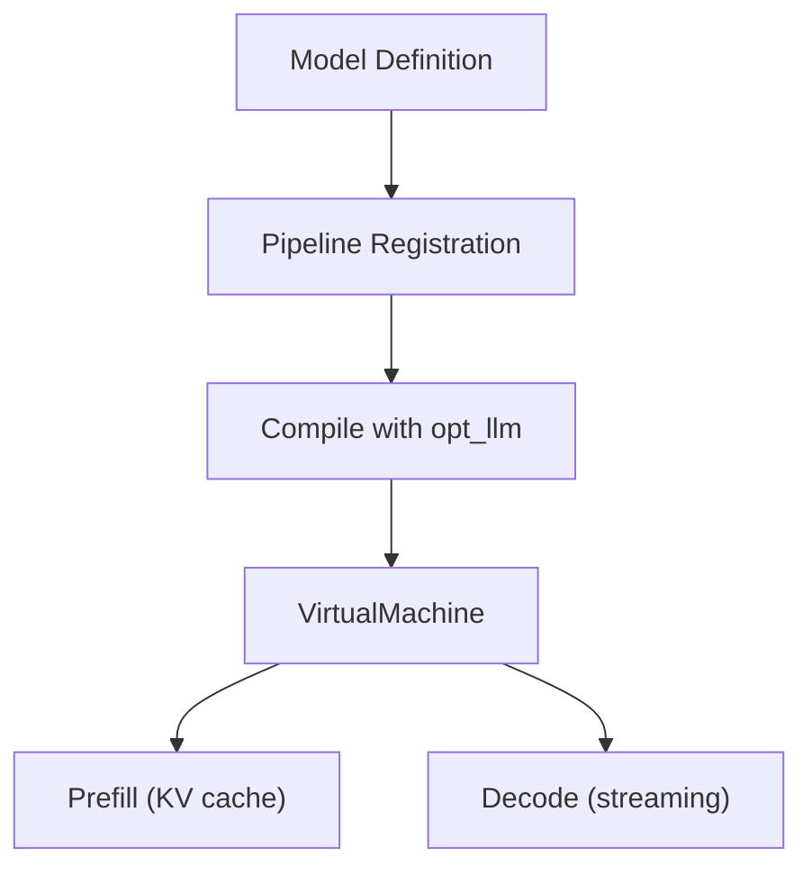
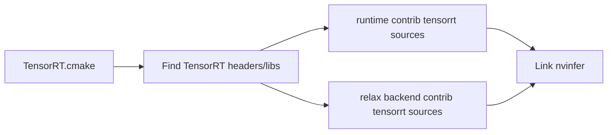

# TensorRT Inference Engine

<cite>
**Referenced Files in This Document**
- [tensorrt_runtime.cc](file://src/runtime/contrib/tensorrt/tensorrt_runtime.cc)
- [tensorrt_builder.cc](file://src/runtime/contrib/tensorrt/tensorrt_builder.cc)
- [tensorrt_builder.h](file://src/runtime/contrib/tensorrt/tensorrt_builder.h)
- [tensorrt_ops.cc](file://src/runtime/contrib/tensorrt/tensorrt_ops.cc)
- [tensorrt_ops.h](file://src/runtime/contrib/tensorrt/tensorrt_ops.h)
- [tensorrt_utils.h](file://src/runtime/contrib/tensorrt/tensorrt_utils.h)
- [TensorRT.cmake](file://cmake/modules/contrib/TensorRT.cmake)
- [test_codegen_tensorrt.py](file://tests/python/relax/test_codegen_tensorrt.py)
- [optimize_llm.py](file://docs/how_to/tutorials/optimize_llm.py)
- [LICENSE.tensorrt_llm.txt](file://licenses/LICENSE.tensorrt_llm.txt)
</cite>

## Table of Contents
1. [Introduction](#introduction)
2. [Project Structure](#project-structure)
3. [Core Components](#core-components)
4. [Architecture Overview](#architecture-overview)
5. [Detailed Component Analysis](#detailed-component-analysis)
6. [Dependency Analysis](#dependency-analysis)
7. [Performance Considerations](#performance-considerations)
8. [Troubleshooting Guide](#troubleshooting-guide)
9. [Conclusion](#conclusion)
10. [Appendices](#appendices)

## Introduction
This document explains how NVIDIA TensorRT integrates with TVM for high-performance inference. It covers TVM’s TensorRT code generation and runtime, including implicit batch mode, dynamic shapes, mixed-precision inference, and TensorRT-LLM integration for large language models. Practical guidance is provided for converting TVM models to TensorRT engines, configuring optimization profiles, and benchmarking performance. The document also describes plugin registration, custom layer implementation, debugging workflows, version compatibility, CUDA dependency management, and production deployment considerations.

## Project Structure
TVM’s TensorRT integration comprises:
- Relax backend code generator for TensorRT
- JSON runtime module for TensorRT
- Builder and converter infrastructure for constructing TensorRT engines
- Utilities for version checks and dimension conversions
- Build configuration for linking against TensorRT

**Diagram sources**
- [codegen.cc](file://src/relax/backend/contrib/tensorrt/codegen.cc)
- [tensorrt_runtime.cc](file://src/runtime/contrib/tensorrt/tensorrt_runtime.cc)
- [tensorrt_builder.cc](file://src/runtime/contrib/tensorrt/tensorrt_builder.cc)
- [tensorrt_builder.h](file://src/runtime/contrib/tensorrt/tensorrt_builder.h)
- [tensorrt_ops.cc](file://src/runtime/contrib/tensorrt/tensorrt_ops.cc)
- [tensorrt_ops.h](file://src/runtime/contrib/tensorrt/tensorrt_ops.h)
- [tensorrt_utils.h](file://src/runtime/contrib/tensorrt/tensorrt_utils.h)
- [TensorRT.cmake](file://cmake/modules/contrib/TensorRT.cmake)

**Section sources**
- [TensorRT.cmake:18-60](file://cmake/modules/contrib/TensorRT.cmake#L18-L60)

## Core Components
- TensorRT JSON Runtime: Loads subgraphs, initializes constants, builds or loads engines, and executes inference with optional caching and calibration.
- TensorRT Builder: Converts a JSON graph into a TensorRT engine, supporting implicit/explicit batch modes, mixed precision, and INT8 calibration.
- Op Converters: Implementations for operators (convolution, pooling, activations, etc.) mapping TVM IR to TensorRT layers.
- Utilities: Version macros and dimension conversion helpers for TRT compatibility and shape handling.

Key capabilities:
- Implicit vs explicit batch modes
- Dynamic shapes via optimization profiles
- Mixed precision (FP16) and INT8 calibration
- Engine caching and multi-engine modes
- Environment-driven tuning (workspace size, precision, calibration)

**Section sources**
- [tensorrt_runtime.cc:61-141](file://src/runtime/contrib/tensorrt/tensorrt_runtime.cc#L61-L141)
- [tensorrt_builder.cc:40-72](file://src/runtime/contrib/tensorrt/tensorrt_builder.cc#L40-L72)
- [tensorrt_ops.cc:161-195](file://src/runtime/contrib/tensorrt/tensorrt_ops.cc#L161-L195)
- [tensorrt_utils.h:35-38](file://src/runtime/contrib/tensorrt/tensorrt_utils.h#L35-L38)

## Architecture Overview
End-to-end flow from TVM Relax IR to TensorRT execution:

**Diagram sources**
- [tensorrt_runtime.cc:113-141](file://src/runtime/contrib/tensorrt/tensorrt_runtime.cc#L113-L141)
- [tensorrt_runtime.cc:325-356](file://src/runtime/contrib/tensorrt/tensorrt_runtime.cc#L325-L356)
- [tensorrt_builder.cc:169-220](file://src/runtime/contrib/tensorrt/tensorrt_builder.cc#L169-L220)

## Detailed Component Analysis

### TensorRT JSON Runtime
Responsibilities:
- Deserialize subgraphs and initialize constants
- Configure runtime flags (implicit batch, FP16, workspace)
- Build or load engines, manage caches, and execute
- Support INT8 calibration and multi-engine modes

Key behaviors:
- Environment variables control precision, workspace, and calibration
- Engines are cached to disk and reused by subgraph key
- Dynamic batching supported via explicit batch mode and optimization profiles

**Diagram sources**
- [tensorrt_runtime.cc:61-141](file://src/runtime/contrib/tensorrt/tensorrt_runtime.cc#L61-L141)
- [tensorrt_runtime.cc:283-356](file://src/runtime/contrib/tensorrt/tensorrt_runtime.cc#L283-L356)

**Section sources**
- [tensorrt_runtime.cc:61-141](file://src/runtime/contrib/tensorrt/tensorrt_runtime.cc#L61-L141)
- [tensorrt_runtime.cc:164-252](file://src/runtime/contrib/tensorrt/tensorrt_runtime.cc#L164-L252)
- [tensorrt_runtime.cc:283-356](file://src/runtime/contrib/tensorrt/tensorrt_runtime.cc#L283-L356)
- [tensorrt_runtime.cc:358-447](file://src/runtime/contrib/tensorrt/tensorrt_runtime.cc#L358-L447)

### TensorRT Builder and Engine Construction
Responsibilities:
- Create builder, network, and config
- Add inputs, constants, layers, and outputs
- Configure optimization profiles for dynamic shapes
- Build engine and context, clean up temporary resources

**Diagram sources**
- [tensorrt_builder.cc:40-72](file://src/runtime/contrib/tensorrt/tensorrt_builder.cc#L40-L72)
- [tensorrt_builder.cc:169-220](file://src/runtime/contrib/tensorrt/tensorrt_builder.cc#L169-L220)
- [tensorrt_builder.cc:186-206](file://src/runtime/contrib/tensorrt/tensorrt_builder.cc#L186-L206)

**Section sources**
- [tensorrt_builder.cc:40-72](file://src/runtime/contrib/tensorrt/tensorrt_builder.cc#L40-L72)
- [tensorrt_builder.cc:169-220](file://src/runtime/contrib/tensorrt/tensorrt_builder.cc#L169-L220)
- [tensorrt_builder.h:64-112](file://src/runtime/contrib/tensorrt/tensorrt_builder.h#L64-L112)

### Operator Converters
Converters implement TVM IR to TensorRT layers. Examples:
- Activations (ReLU, Sigmoid, TanH, Clip, LeakyReLU)
- Elementwise binary ops (Add, Sub, Mul, Div, Pow, Max, Min)
- Convolutions (1D/2D/3D), Dense (fully connected), BatchNorm, LayerNorm
- Pooling (Max/Avg 2D/3D), Global pooling, Softmax
- Utility helpers for reshape, transpose, axis conversion, padding

**Diagram sources**
- [tensorrt_ops.h:107-139](file://src/runtime/contrib/tensorrt/tensorrt_ops.h#L107-L139)
- [tensorrt_ops.cc:161-195](file://src/runtime/contrib/tensorrt/tensorrt_ops.cc#L161-L195)
- [tensorrt_ops.cc:197-237](file://src/runtime/contrib/tensorrt/tensorrt_ops.cc#L197-L237)
- [tensorrt_ops.cc:289-351](file://src/runtime/contrib/tensorrt/tensorrt_ops.cc#L289-L351)
- [tensorrt_ops.cc:405-439](file://src/runtime/contrib/tensorrt/tensorrt_ops.cc#L405-L439)
- [tensorrt_ops.cc:441-538](file://src/runtime/contrib/tensorrt/tensorrt_ops.cc#L441-L538)
- [tensorrt_ops.cc:629-645](file://src/runtime/contrib/tensorrt/tensorrt_ops.cc#L629-L645)
- [tensorrt_ops.cc:647-718](file://src/runtime/contrib/tensorrt/tensorrt_ops.cc#L647-L718)

**Section sources**
- [tensorrt_ops.h:107-139](file://src/runtime/contrib/tensorrt/tensorrt_ops.h#L107-L139)
- [tensorrt_ops.cc:161-195](file://src/runtime/contrib/tensorrt/tensorrt_ops.cc#L161-L195)
- [tensorrt_ops.cc:289-351](file://src/runtime/contrib/tensorrt/tensorrt_ops.cc#L289-L351)
- [tensorrt_ops.cc:405-439](file://src/runtime/contrib/tensorrt/tensorrt_ops.cc#L405-L439)
- [tensorrt_ops.cc:441-538](file://src/runtime/contrib/tensorrt/tensorrt_ops.cc#L441-L538)
- [tensorrt_ops.cc:629-645](file://src/runtime/contrib/tensorrt/tensorrt_ops.cc#L629-L645)
- [tensorrt_ops.cc:647-718](file://src/runtime/contrib/tensorrt/tensorrt_ops.cc#L647-L718)

### TensorRT Code Generation and Offloading
TVM partitions Relax IR into composite functions and emits them for TensorRT execution. The test demonstrates:
- Pattern-based fusion (conv+relu, add)
- Composite merging and code generation
- Building and running on CUDA with TensorRT runtime

**Diagram sources**
- [test_codegen_tensorrt.py:75-113](file://tests/python/relax/test_codegen_tensorrt.py#L75-L113)

**Section sources**
- [test_codegen_tensorrt.py:75-113](file://tests/python/relax/test_codegen_tensorrt.py#L75-L113)

### TensorRT-LLM Integration for Large Language Models
TVM includes LLM-focused optimizations and KV cache support. The tutorial outlines:
- Model construction (embedding, decoder layers, output head)
- Pipeline registration and compilation with an LLM-optimized pipeline
- Prefill and decode stages with paged KV cache

**Diagram sources**
- [optimize_llm.py:428-431](file://docs/how_to/tutorials/optimize_llm.py#L428-L431)
- [optimize_llm.py:267-280](file://docs/how_to/tutorials/optimize_llm.py#L267-L280)

**Section sources**
- [optimize_llm.py:428-431](file://docs/how_to/tutorials/optimize_llm.py#L428-L431)
- [optimize_llm.py:267-280](file://docs/how_to/tutorials/optimize_llm.py#L267-L280)

## Dependency Analysis
- Build configuration locates TensorRT headers and libraries and conditionally compiles runtime and codegen sources.
- Runtime depends on TensorRT headers and links the TensorRT library.
- Codegen and runtime share common utilities for version checks and dimension conversions.

**Diagram sources**
- [TensorRT.cmake:36-60](file://cmake/modules/contrib/TensorRT.cmake#L36-L60)

**Section sources**
- [TensorRT.cmake:18-60](file://cmake/modules/contrib/TensorRT.cmake#L18-L60)

## Performance Considerations
- Mixed precision (FP16) reduces memory bandwidth and increases throughput; enable via environment flags.
- Workspace size controls memory allocated for kernel selection and fusion; adjust based on GPU memory.
- Implicit vs explicit batch: implicit batch simplifies shapes but limits flexibility; explicit batch enables dynamic shapes with optimization profiles.
- INT8 quantization improves latency and throughput with calibration; ensure calibration batches are sufficient.
- Engine caching avoids repeated build time; configure cache directory via environment variable.
- Multi-engine vs single-engine mode trades memory for reduced build overhead.

[No sources needed since this section provides general guidance]

## Troubleshooting Guide
Common issues and resolutions:
- TensorRT runtime not enabled: ensure build flag is set to include runtime sources.
- Calibration failures: verify environment variables for INT8 calibration and that calibration batches are configured.
- Dynamic shape errors: confirm optimization profiles are set for explicit batch mode and that input shapes align with profiles.
- Memory issues: reduce workspace size or disable FP16/INT8 to diagnose bottlenecks; monitor GPU memory usage.
- Version mismatches: use TRT version macros to guard features; ensure TensorRT headers match runtime library.

**Section sources**
- [tensorrt_runtime.cc:505-519](file://src/runtime/contrib/tensorrt/tensorrt_runtime.cc#L505-L519)
- [tensorrt_runtime.cc:82-92](file://src/runtime/contrib/tensorrt/tensorrt_runtime.cc#L82-L92)
- [tensorrt_builder.cc:186-206](file://src/runtime/contrib/tensorrt/tensorrt_builder.cc#L186-L206)
- [tensorrt_utils.h:35-38](file://src/runtime/contrib/tensorrt/tensorrt_utils.h#L35-L38)

## Conclusion
TVM’s TensorRT integration provides a robust path from Relax IR to optimized TensorRT engines. By leveraging implicit/explicit batch modes, dynamic shapes, and mixed precision, TVM delivers high-performance inference. The JSON runtime and builder infrastructure simplify deployment, while caching and calibration streamline production workflows. For LLMs, TVM’s LLM-optimized pipeline and KV cache support enable efficient prefill and decode stages.

[No sources needed since this section summarizes without analyzing specific files]

## Appendices

### Practical Recipes

- Convert TVM Relax IR to TensorRT:
  - Define patterns and fuse ops, merge composites, and run codegen.
  - Execute on CUDA with TensorRT runtime enabled.

  **Section sources**
  - [test_codegen_tensorrt.py:75-113](file://tests/python/relax/test_codegen_tensorrt.py#L75-L113)

- Configure optimization profiles for dynamic shapes:
  - Explicit batch mode with optimization profiles sets min/opt/max dimensions per input.

  **Section sources**
  - [tensorrt_builder.cc:186-206](file://src/runtime/contrib/tensorrt/tensorrt_builder.cc#L186-L206)

- Enable mixed precision and INT8:
  - Use environment variables to toggle FP16 and INT8; configure calibration batches.

  **Section sources**
  - [tensorrt_runtime.cc:79-92](file://src/runtime/contrib/tensorrt/tensorrt_runtime.cc#L79-L92)
  - [tensorrt_runtime.cc:326-328](file://src/runtime/contrib/tensorrt/tensorrt_runtime.cc#L326-L328)

- Engine caching and multi-engine mode:
  - Cache engines to disk and reuse; choose multi-engine for lower latency at higher memory cost.

  **Section sources**
  - [tensorrt_runtime.cc:358-447](file://src/runtime/contrib/tensorrt/tensorrt_runtime.cc#L358-L447)
  - [tensorrt_runtime.cc:521-541](file://src/runtime/contrib/tensorrt/tensorrt_runtime.cc#L521-L541)

- TensorRT-LLM prefill and decode:
  - Use paged KV cache for efficient streaming generation.

  **Section sources**
  - [optimize_llm.py:267-280](file://docs/how_to/tutorials/optimize_llm.py#L267-L280)

### Licensing Notes
- TensorRT-LLM materials in the repository are subject to the Apache License, Version 2.0.

**Section sources**
- [LICENSE.tensorrt_llm.txt:1-203](file://licenses/LICENSE.tensorrt_llm.txt#L1-L203)