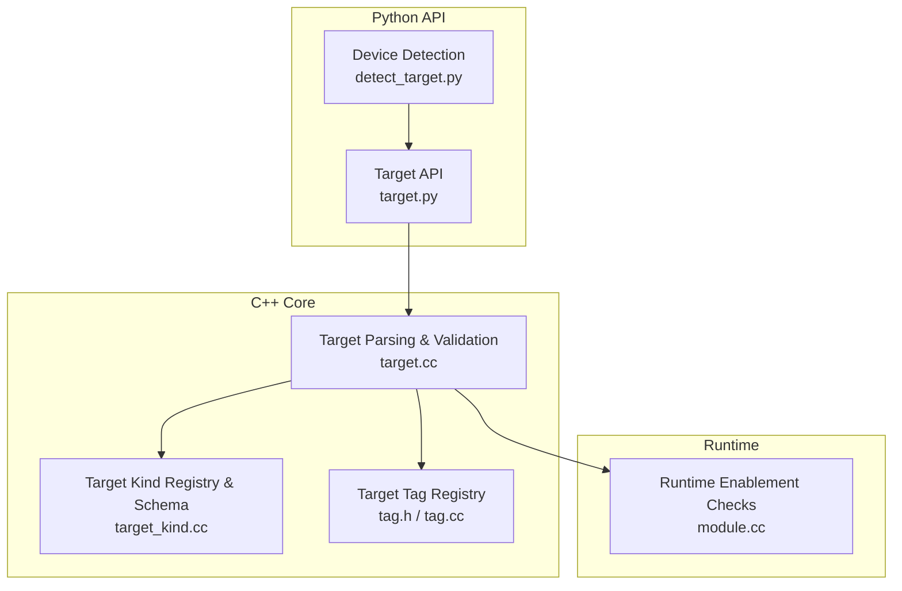
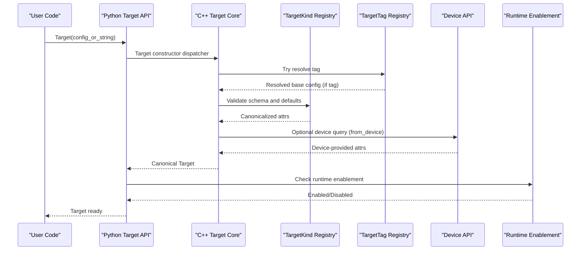
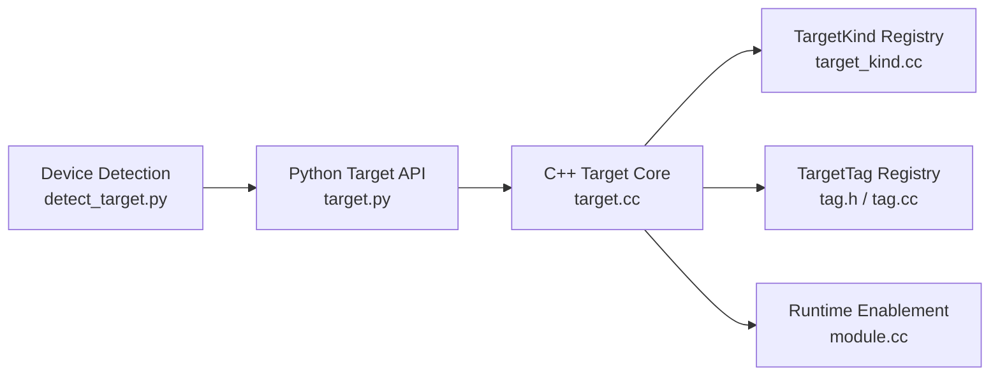

# Target Configuration

<cite>
**Referenced Files in This Document**
- [target.py](file://python/tvm/target/target.py)
- [detect_target.py](file://python/tvm/target/detect_target.py)
- [target.cc](file://src/target/target.cc)
- [target_kind.cc](file://src/target/target_kind.cc)
- [tag.h](file://include/tvm/target/tag.h)
- [tag.cc](file://src/target/tag.cc)
- [module.cc](file://src/runtime/module.cc)
- [test_target_codegen_cross_llvm.py](file://tests/python/codegen/test_target_codegen_cross_llvm.py)
- [test_target_codegen.py](file://tests/python/codegen/test_target_codegen.py)
- [target_test.cc](file://tests/cpp/target_test.cc)
</cite>

## Table of Contents
1. [Introduction](#introduction)
2. [Project Structure](#project-structure)
3. [Core Components](#core-components)
4. [Architecture Overview](#architecture-overview)
5. [Detailed Component Analysis](#detailed-component-analysis)
6. [Dependency Analysis](#dependency-analysis)
7. [Performance Considerations](#performance-considerations)
8. [Troubleshooting Guide](#troubleshooting-guide)
9. [Conclusion](#conclusion)
10. [Appendices](#appendices)

## Introduction
This document explains the TVM target configuration system: how targets are represented, parsed, validated, and executed. It covers target string syntax, parameter specification, capability detection, factory patterns, device enumeration, runtime enablement checks, alias/tag resolution, fallback mechanisms, cross-compilation configuration, multi-target compilation, dynamic target selection, validation, error handling, and debugging techniques. The goal is to help both new and experienced users configure targets correctly and troubleshoot issues efficiently.

## Project Structure
The target configuration system spans Python APIs, C++ core logic, and runtime checks:
- Python API: target construction, device-based detection, and feature access
- C++ core: target parsing, schema validation, canonicalization, tag registry, and host composition
- Runtime: device availability and optional runtime enablement checks

**Diagram sources**
- [target.py:1-233](file://python/tvm/target/target.py#L1-L233)
- [detect_target.py:1-148](file://python/tvm/target/detect_target.py#L1-L148)
- [target.cc:1-497](file://src/target/target.cc#L1-L497)
- [target_kind.cc:1-531](file://src/target/target_kind.cc#L1-L531)
- [tag.h:1-174](file://include/tvm/target/tag.h#L1-L174)
- [tag.cc:1-86](file://src/target/tag.cc#L1-L86)
- [module.cc:30-69](file://src/runtime/module.cc#L30-L69)

**Section sources**
- [target.py:1-233](file://python/tvm/target/target.py#L1-L233)
- [detect_target.py:1-148](file://python/tvm/target/detect_target.py#L1-L148)
- [target.cc:1-497](file://src/target/target.cc#L1-L497)
- [target_kind.cc:1-531](file://src/target/target_kind.cc#L1-L531)
- [tag.h:1-174](file://include/tvm/target/tag.h#L1-L174)
- [tag.cc:1-86](file://src/target/tag.cc#L1-L86)
- [module.cc:30-69](file://src/runtime/module.cc#L30-L69)

## Core Components
- Target object: encapsulates target kind, keys, attributes, and optional host target
- TargetKind: defines per-kind schema, default keys, and canonicalizers
- TargetTag: named aliases that resolve to concrete target configurations
- Device detection: auto-detects target parameters from runtime devices
- Runtime enablement: checks whether a target’s runtime is compiled into TVM

Key responsibilities:
- Parse target strings and dictionaries into canonical Target objects
- Validate attributes against TargetKind schemas
- Apply kind-specific canonicalizers and defaults
- Resolve tags and merge overrides
- Compose host targets for cross-compilation
- Query device properties when requested

**Section sources**
- [target.py:51-233](file://python/tvm/target/target.py#L51-L233)
- [target.cc:254-423](file://src/target/target.cc#L254-L423)
- [target_kind.cc:301-507](file://src/target/target_kind.cc#L301-L507)
- [tag.h:35-105](file://include/tvm/target/tag.h#L35-L105)
- [tag.cc:52-83](file://src/target/tag.cc#L52-L83)
- [detect_target.py:109-147](file://python/tvm/target/detect_target.py#L109-L147)
- [module.cc:38-69](file://src/runtime/module.cc#L38-L69)

## Architecture Overview
The target system follows a layered design:
- Python API constructs Target objects and exposes device detection
- C++ core validates and canonicalizes targets, resolves tags, composes hosts, and queries devices
- TargetKind registry enforces schema and applies kind-specific logic
- TargetTag registry provides alias resolution
- Runtime checks ensure the selected target is supported

**Diagram sources**
- [target.py:78-145](file://python/tvm/target/target.py#L78-L145)
- [target.cc:254-423](file://src/target/target.cc#L254-L423)
- [target_kind.cc:301-507](file://src/target/target_kind.cc#L301-L507)
- [tag.cc:52-83](file://src/target/tag.cc#L52-L83)
- [module.cc:38-69](file://src/runtime/module.cc#L38-L69)

## Detailed Component Analysis

### Target String Syntax and Parameter Specification
- Acceptable forms:
  - Tag string: resolves to a registered alias
  - JSON-like dictionary: supports kind, tag, keys, device, libs, system-lib, mcpu, model, runtime, mtriple, mattr, mfloat-abi, mabi, host, and arbitrary attributes
  - Bare kind name: e.g., "llvm", "cuda" (no spaces; CLI-style strings are rejected)
- Special keys:
  - tag: loads base config and merges overrides
  - host: nested target for cross-compilation
  - from_device: query device properties and merge into attrs
- Validation:
  - kind is mandatory
  - JSON must be a dict
  - Unknown non-feature keys cause schema validation failure
  - Type mismatches cause errors

Practical examples (described):
- Cross-compilation to ARM Linux with a specific triple
  - Example path: [test_target_codegen_cross_llvm.py:63-75](file://tests/python/codegen/test_target_codegen_cross_llvm.py#L63-L75)
- Multi-target compilation with a composite kind
  - Composite kind supports a devices array containing targets, strings, or dicts
  - Example path: [target_kind.cc:480-504](file://src/target/target_kind.cc#L480-L504)

**Section sources**
- [target.py:78-145](file://python/tvm/target/target.py#L78-L145)
- [target.cc:254-284](file://src/target/target.cc#L254-L284)
- [target.cc:286-423](file://src/target/target.cc#L286-L423)
- [target_kind.cc:480-504](file://src/target/target_kind.cc#L480-L504)
- [test_target_codegen_cross_llvm.py:63-75](file://tests/python/codegen/test_target_codegen_cross_llvm.py#L63-L75)

### Capability Detection and Device Enumeration
- Device-based detection:
  - Supported device types: cpu, cuda, metal, vulkan, rocm, opencl
  - Uses runtime device APIs to query device properties and construct a target
- Runtime property queries:
  - Some targets accept from_device to fetch device capabilities and fill missing attributes
  - If runtime is not compiled in or device does not exist, defaults are used and a warning is logged

Example paths:
- Device detection mapping and validation: [detect_target.py:109-137](file://python/tvm/target/detect_target.py#L109-L137)
- Device query and fallback: [target.cc:425-459](file://src/target/target.cc#L425-L459)

**Section sources**
- [detect_target.py:109-137](file://python/tvm/target/detect_target.py#L109-L137)
- [target.cc:425-459](file://src/target/target.cc#L425-L459)

### Runtime Enablement Checks
- Runtime enablement is checked before building/executing:
  - Specific targets map to device API globals or codegen checks
  - Unknown targets raise internal errors
- Typical checks:
  - CUDA, ROCm, Vulkan, Metal, OpenCL, Hexagon, NVPTX, and LLVM runtime enablement

Example path:
- Runtime enablement logic: [module.cc:38-69](file://src/runtime/module.cc#L38-L69)

**Section sources**
- [module.cc:38-69](file://src/runtime/module.cc#L38-L69)

### Target Factory Patterns and Alias Resolution
- TargetKind registry:
  - Defines per-kind schema, default keys, and canonicalizers
  - Provides option lists and kind attributes
- TargetTag registry:
  - Registers named aliases that resolve to concrete configs
  - Supports listing tags and adding new tags

Example paths:
- TargetKind registration and options: [target_kind.cc:301-507](file://src/target/target_kind.cc#L301-L507)
- Tag registry operations: [tag.h:70-105](file://include/tvm/target/tag.h#L70-L105), [tag.cc:52-83](file://src/target/tag.cc#L52-L83)

**Section sources**
- [target_kind.cc:301-507](file://src/target/target_kind.cc#L301-L507)
- [tag.h:70-105](file://include/tvm/target/tag.h#L70-L105)
- [tag.cc:52-83](file://src/target/tag.cc#L52-L83)

### Fallback Mechanisms
- Unknown target kind or tag:
  - Errors are thrown during parsing/validation
- Device query fallback:
  - If runtime is not compiled or device does not exist, defaults are used and warnings are logged
- Schema validation:
  - Unknown non-feature keys cause failures; feature.* keys are preserved across round-trips

Example paths:
- Unknown target kind error: [target.cc:93-99](file://src/target/target.cc#L93-L99)
- Device query fallback: [target.cc:432-448](file://src/target/target.cc#L432-L448)
- Feature preservation: [target.cc:337-362](file://src/target/target.cc#L337-L362)

**Section sources**
- [target.cc:93-99](file://src/target/target.cc#L93-L99)
- [target.cc:432-448](file://src/target/target.cc#L432-L448)
- [target.cc:337-362](file://src/target/target.cc#L337-L362)

### Cross-Compilation Configuration
- Host composition:
  - Target can be composed with a host target using WithHost or Target(target, host)
  - Host is recursively parsed and validated
- Nested host reconstruction preserves feature.* keys across round-trips

Example paths:
- Host composition and export: [target.cc:54-69](file://src/target/target.cc#L54-L69), [target.cc:151-176](file://src/target/target.cc#L151-L176)
- Round-trip host preservation: [target_test.cc:246-270](file://tests/cpp/target_test.cc#L246-L270)

**Section sources**
- [target.cc:54-69](file://src/target/target.cc#L54-L69)
- [target.cc:151-176](file://src/target/target.cc#L151-L176)
- [target_test.cc:246-270](file://tests/cpp/target_test.cc#L246-L270)

### Dynamic Target Selection
- Current target context:
  - Thread-local stack allows entering/exiting target scopes
  - Target.current() retrieves the current target
- Device-based selection:
  - Target.from_device() detects a target for a given device

Example paths:
- Scope enter/exit and current target: [target.py:147-153](file://python/tvm/target/target.py#L147-L153), [target.py:183-195](file://python/tvm/target/target.py#L183-L195)
- Device-based detection: [detect_target.py:109-137](file://python/tvm/target/detect_target.py#L109-L137)

**Section sources**
- [target.py:147-153](file://python/tvm/target/target.py#L147-L153)
- [target.py:183-195](file://python/tvm/target/target.py#L183-L195)
- [detect_target.py:109-137](file://python/tvm/target/detect_target.py#L109-L137)

### Practical Examples

#### Cross-compilation to ARM Linux
- Configure target with a specific triple and build an object file
- Optionally verify ELF machine type and run on remote via RPC

Example path:
- [test_target_codegen_cross_llvm.py:63-97](file://tests/python/codegen/test_target_codegen_cross_llvm.py#L63-L97)

#### Multi-target compilation with composite kind
- Use composite kind with a devices array containing targets, strings, or dicts

Example path:
- [target_kind.cc:480-504](file://src/target/target_kind.cc#L480-L504)

#### GPU target validation and error handling
- Parametrize tests with GPU kinds and expect specific errors for unsupported predicates

Example path:
- [test_target_codegen.py:39-56](file://tests/python/codegen/test_target_codegen.py#L39-L56)

### Target Validation and Error Handling
- Validation pipeline:
  - Tag resolution
  - JSON parsing and dict validation
  - Schema.Resolve() applies defaults and validates types
  - Canonicalizer may set feature.* keys and transform attributes
  - Unknown non-feature keys fail schema validation
- Error types:
  - ValueError for malformed inputs
  - TypeError for wrong types
  - InternalError for unknown runtime paths

Example paths:
- Validation and error wrapping: [target.cc:110-132](file://src/target/target.cc#L110-L132), [target.cc:254-284](file://src/target/target.cc#L254-L284)
- Unknown key failure: [target_test.cc:106-127](file://tests/cpp/target_test.cc#L106-L127)
- Type mismatch failure: [target_test.cc:129-149](file://tests/cpp/target_test.cc#L129-L149)

**Section sources**
- [target.cc:110-132](file://src/target/target.cc#L110-L132)
- [target.cc:254-284](file://src/target/target.cc#L254-L284)
- [target_test.cc:106-127](file://tests/cpp/target_test.cc#L106-L127)
- [target_test.cc:129-149](file://tests/cpp/target_test.cc#L129-L149)

## Dependency Analysis
The target system exhibits clear separation of concerns:
- Python API depends on C++ FFI bindings
- C++ core depends on TargetKind and TargetTag registries
- Runtime enablement checks depend on global function availability

**Diagram sources**
- [target.py:1-233](file://python/tvm/target/target.py#L1-L233)
- [detect_target.py:1-148](file://python/tvm/target/detect_target.py#L1-L148)
- [target.cc:1-497](file://src/target/target.cc#L1-L497)
- [target_kind.cc:1-531](file://src/target/target_kind.cc#L1-L531)
- [tag.h:1-174](file://include/tvm/target/tag.h#L1-L174)
- [tag.cc:1-86](file://src/target/tag.cc#L1-L86)
- [module.cc:30-69](file://src/runtime/module.cc#L30-L69)

**Section sources**
- [target.py:1-233](file://python/tvm/target/target.py#L1-L233)
- [detect_target.py:1-148](file://python/tvm/target/detect_target.py#L1-L148)
- [target.cc:1-497](file://src/target/target.cc#L1-L497)
- [target_kind.cc:1-531](file://src/target/target_kind.cc#L1-L531)
- [tag.h:1-174](file://include/tvm/target/tag.h#L1-L174)
- [tag.cc:1-86](file://src/target/tag.cc#L1-L86)
- [module.cc:30-69](file://src/runtime/module.cc#L30-L69)

## Performance Considerations
- Prefer using tags for frequently used configurations to reduce repeated JSON parsing and schema validation overhead
- Avoid excessive nested host compositions; keep host targets minimal and reuse tagged hosts
- Use from_device judiciously; device queries require runtime enablement and may incur overhead
- Canonicalizers can transform attributes; cache or reuse targets when possible to avoid repeated transformations

## Troubleshooting Guide
Common issues and resolutions:
- Unknown target kind or tag
  - Ensure the kind is registered and spelled correctly
  - Example path: [target.cc:93-99](file://src/target/target.cc#L93-L99)
- JSON parsing errors
  - Confirm the input is a JSON object/dictionary
  - Example path: [target.cc:273-284](file://src/target/target.cc#L273-L284)
- Type mismatches in attributes
  - Match expected types (string, array, integer, boolean) as per TargetKind schema
  - Example path: [target_test.cc:129-149](file://tests/cpp/target_test.cc#L129-L149)
- Unknown non-feature keys
  - Remove or correct keys not defined in the TargetKind schema
  - Example path: [target_test.cc:106-127](file://tests/cpp/target_test.cc#L106-L127)
- Device not detected or runtime not enabled
  - Verify device installation and TVM build with the corresponding runtime
  - Check runtime enablement via module.cc logic
  - Example path: [module.cc:38-69](file://src/runtime/module.cc#L38-L69)
- from_device fallback
  - If runtime is not compiled or device does not exist, defaults are used; confirm logs
  - Example path: [target.cc:432-448](file://src/target/target.cc#L432-L448)

**Section sources**
- [target.cc:93-99](file://src/target/target.cc#L93-L99)
- [target.cc:273-284](file://src/target/target.cc#L273-L284)
- [target_test.cc:106-127](file://tests/cpp/target_test.cc#L106-L127)
- [target_test.cc:129-149](file://tests/cpp/target_test.cc#L129-L149)
- [module.cc:38-69](file://src/runtime/module.cc#L38-L69)
- [target.cc:432-448](file://src/target/target.cc#L432-L448)

## Conclusion
The TVM target configuration system provides a robust, extensible framework for specifying compilation targets. Its design separates concerns between Python convenience, C++ validation and canonicalization, and runtime enablement checks. By leveraging tags, device detection, and host composition, users can configure complex cross-compilation scenarios while maintaining strong validation and clear error reporting.

## Appendices

### Appendix A: TargetKind Options and Defaults
- TargetKind registers define per-kind attributes, defaults, and canonicalizers
- Use TargetKind options to discover available attributes for a kind

Example path:
- [target_kind.cc:301-507](file://src/target/target_kind.cc#L301-L507)

### Appendix B: Tag Registry Operations
- List tags, get tag config, and add new tags

Example path:
- [tag.h:70-105](file://include/tvm/target/tag.h#L70-L105)
- [tag.cc:52-83](file://src/target/tag.cc#L52-L83)

### Appendix C: Example Workflows
- Cross-compilation to ARM Linux
  - Example path: [test_target_codegen_cross_llvm.py:63-97](file://tests/python/codegen/test_target_codegen_cross_llvm.py#L63-L97)
- Multi-target compilation with composite kind
  - Example path: [target_kind.cc:480-504](file://src/target/target_kind.cc#L480-L504)
- GPU target validation
  - Example path: [test_target_codegen.py:39-56](file://tests/python/codegen/test_target_codegen.py#L39-L56)