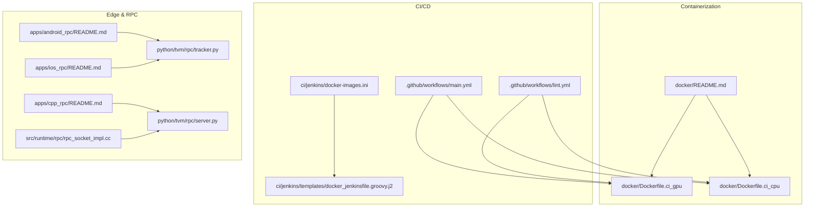
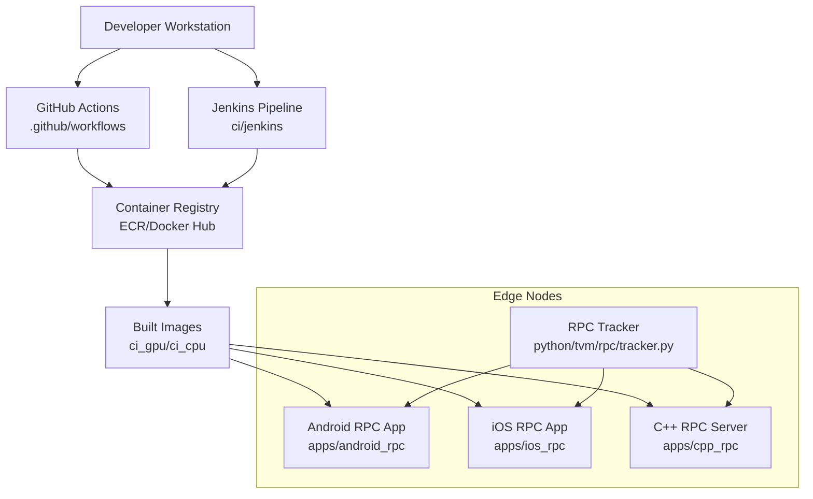
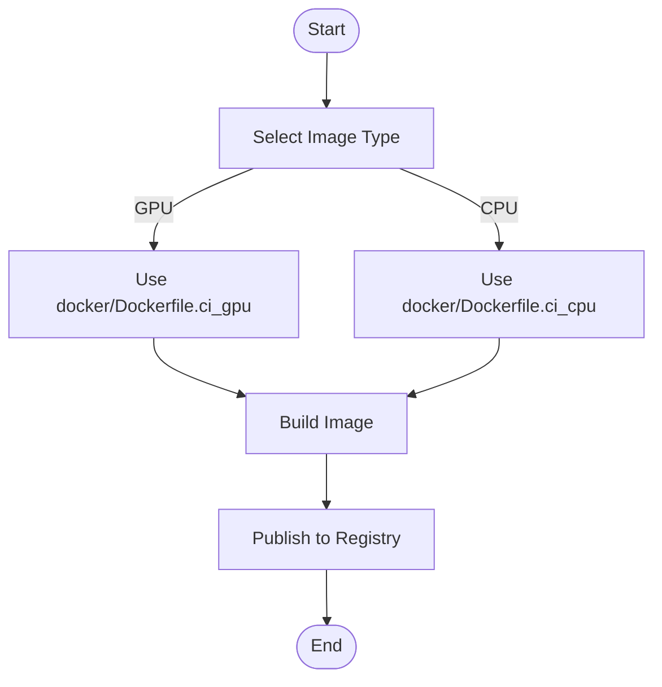
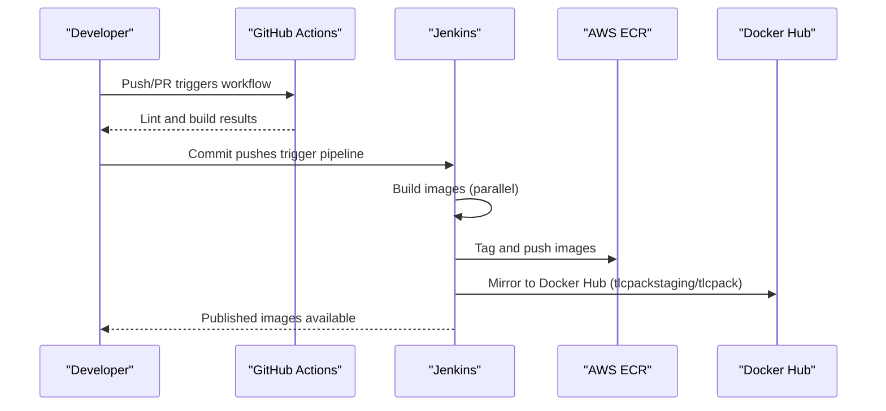
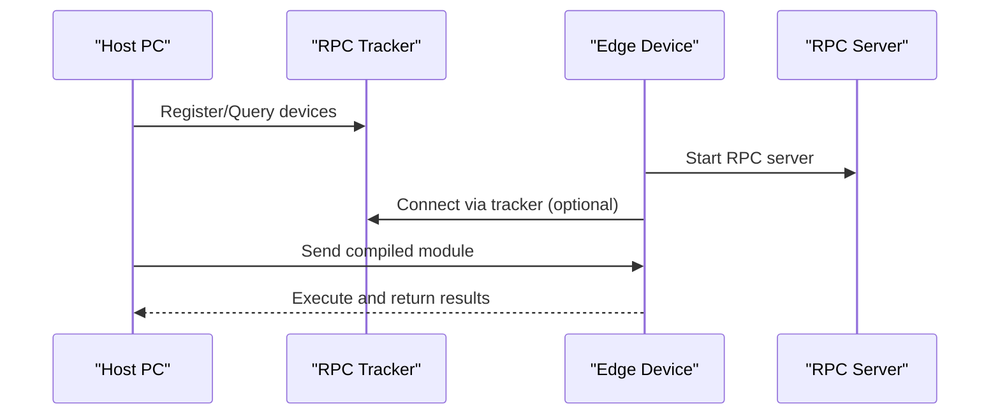
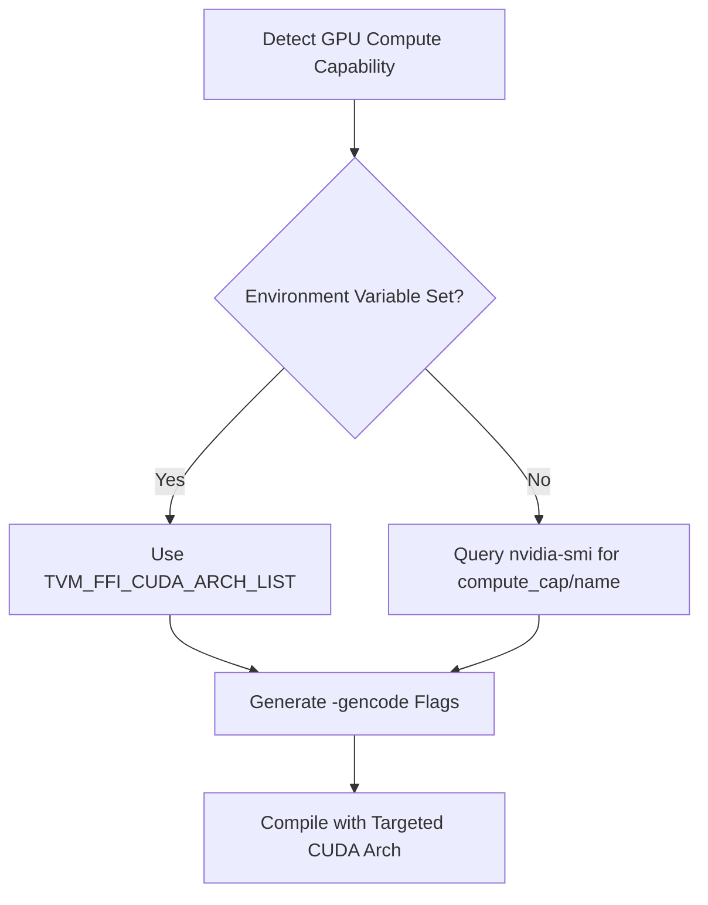
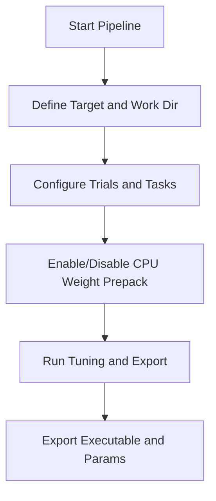
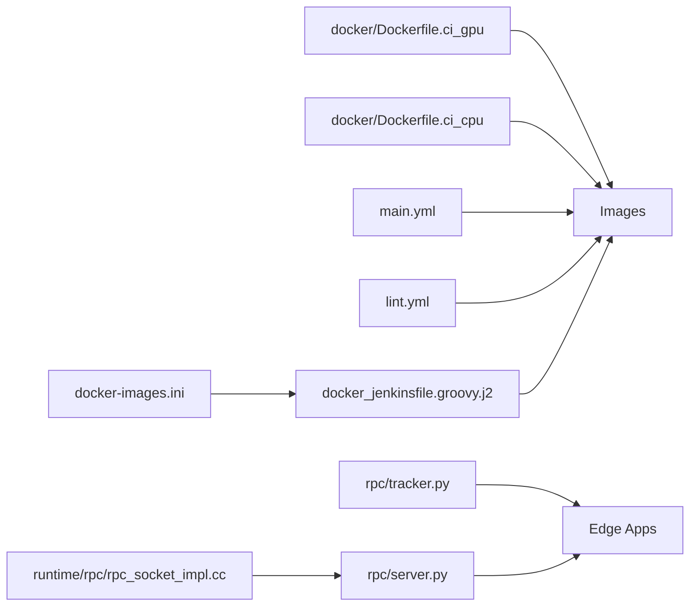

# Cloud and Edge Deployment

<cite>
**Referenced Files in This Document**
- [docker/README.md](file://docker/README.md)
- [docker/Dockerfile.ci_gpu](file://docker/Dockerfile.ci_gpu)
- [docker/Dockerfile.ci_cpu](file://docker/Dockerfile.ci_cpu)
- [.github/workflows/main.yml](file://.github/workflows/main.yml)
- [.github/workflows/lint.yml](file://.github/workflows/lint.yml)
- [ci/jenkins/docker-images.ini](file://ci/jenkins/docker-images.ini)
- [ci/jenkins/templates/docker_jenkinsfile.groovy.j2](file://ci/jenkins/templates/docker_jenkinsfile.groovy.j2)
- [apps/android_rpc/README.md](file://apps/android_rpc/README.md)
- [apps/ios_rpc/README.md](file://apps/ios_rpc/README.md)
- [apps/cpp_rpc/README.md](file://apps/cpp_rpc/README.md)
- [python/tvm/rpc/tracker.py](file://python/tvm/rpc/tracker.py)
- [python/tvm/rpc/server.py](file://python/tvm/rpc/server.py)
- [src/runtime/rpc/rpc_socket_impl.cc](file://src/runtime/rpc/rpc_socket_impl.cc)
- [docs/reference/security.rst](file://docs/reference/security.rst)
- [docs/how_to/tutorials/export_and_load_executable.py](file://docs/how_to/tutorials/export_and_load_executable.py)
- [python/tvm/contrib/nvcc.py](file://python/tvm/contrib/nvcc.py)
- [3rdparty/tvm-ffi/python/tvm_ffi/cpp/extension.py](file://3rdparty/tvm-ffi/python/tvm_ffi/cpp/extension.py)
- [python/tvm/relax/pipeline.py](file://python/tvm/relax/pipeline.py)
</cite>

## Table of Contents
1. [Introduction](#introduction)
2. [Project Structure](#project-structure)
3. [Core Components](#core-components)
4. [Architecture Overview](#architecture-overview)
5. [Detailed Component Analysis](#detailed-component-analysis)
6. [Dependency Analysis](#dependency-analysis)
7. [Performance Considerations](#performance-considerations)
8. [Troubleshooting Guide](#troubleshooting-guide)
9. [Conclusion](#conclusion)
10. [Appendices](#appendices)

## Introduction
This document provides a comprehensive guide to deploying TVM in cloud and edge computing environments. It covers containerized deployment using Docker, CI/CD pipelines, RPC-based edge deployment, and practical guidance for GPU optimization, security, and operational monitoring. The goal is to help teams reliably operate TVM inference services, model serving pipelines, and real-time processing systems across diverse infrastructures.

## Project Structure
The repository organizes deployment assets and runtime capabilities across several areas:
- Containerization: Dockerfiles and helper scripts for CPU and GPU environments
- CI/CD: GitHub Actions and Jenkins templates for building and publishing images
- Edge deployment: RPC servers and clients for Android, iOS, and C++ targets
- Runtime and RPC: Core runtime and RPC server implementations
- Security and guidance: Security reference and deployment best practices

**Diagram sources**
- [docker/README.md:1-133](file://docker/README.md#L1-L133)
- [docker/Dockerfile.ci_gpu:1-146](file://docker/Dockerfile.ci_gpu#L1-L146)
- [docker/Dockerfile.ci_cpu:1-99](file://docker/Dockerfile.ci_cpu#L1-L99)
- [.github/workflows/main.yml:1-105](file://.github/workflows/main.yml#L1-L105)
- [.github/workflows/lint.yml:1-43](file://.github/workflows/lint.yml#L1-L43)
- [ci/jenkins/docker-images.ini:1-26](file://ci/jenkins/docker-images.ini#L1-L26)
- [ci/jenkins/templates/docker_jenkinsfile.groovy.j2:1-203](file://ci/jenkins/templates/docker_jenkinsfile.groovy.j2#L1-L203)
- [apps/android_rpc/README.md:1-171](file://apps/android_rpc/README.md#L1-L171)
- [apps/ios_rpc/README.md:1-257](file://apps/ios_rpc/README.md#L1-L257)
- [apps/cpp_rpc/README.md:1-84](file://apps/cpp_rpc/README.md#L1-L84)
- [python/tvm/rpc/tracker.py:1-29](file://python/tvm/rpc/tracker.py#L1-L29)
- [python/tvm/rpc/server.py:280-305](file://python/tvm/rpc/server.py#L280-L305)
- [src/runtime/rpc/rpc_socket_impl.cc:105-127](file://src/runtime/rpc/rpc_socket_impl.cc#L105-L127)

**Section sources**
- [docker/README.md:1-133](file://docker/README.md#L1-L133)
- [docker/Dockerfile.ci_gpu:1-146](file://docker/Dockerfile.ci_gpu#L1-L146)
- [docker/Dockerfile.ci_cpu:1-99](file://docker/Dockerfile.ci_cpu#L1-L99)
- [.github/workflows/main.yml:1-105](file://.github/workflows/main.yml#L1-L105)
- [.github/workflows/lint.yml:1-43](file://.github/workflows/lint.yml#L1-L43)
- [ci/jenkins/docker-images.ini:1-26](file://ci/jenkins/docker-images.ini#L1-L26)
- [ci/jenkins/templates/docker_jenkinsfile.groovy.j2:1-203](file://ci/jenkins/templates/docker_jenkinsfile.groovy.j2#L1-L203)
- [apps/android_rpc/README.md:1-171](file://apps/android_rpc/README.md#L1-L171)
- [apps/ios_rpc/README.md:1-257](file://apps/ios_rpc/README.md#L1-L257)
- [apps/cpp_rpc/README.md:1-84](file://apps/cpp_rpc/README.md#L1-L84)
- [python/tvm/rpc/tracker.py:1-29](file://python/tvm/rpc/tracker.py#L1-L29)
- [python/tvm/rpc/server.py:280-305](file://python/tvm/rpc/server.py#L280-L305)
- [src/runtime/rpc/rpc_socket_impl.cc:105-127](file://src/runtime/rpc/rpc_socket_impl.cc#L105-L127)

## Core Components
- Container images for CPU and GPU builds, including CUDA, ROCm, Vulkan, and Python toolchains
- CI/CD workflows for linting and cross-platform builds
- Jenkins pipeline for building and publishing Docker images to registries
- RPC tracker and server for orchestrating edge devices and remote execution
- Edge deployment guides for Android, iOS, and C++ RPC servers

Key deployment assets:
- GPU image with CUDA and supporting frameworks
- CPU image with Python and build tools
- GitHub Actions for linting and macOS/windows builds
- Jenkins templates for ECR and Docker Hub publishing
- RPC tracker and server APIs for device registration and scheduling

**Section sources**
- [docker/Dockerfile.ci_gpu:1-146](file://docker/Dockerfile.ci_gpu#L1-L146)
- [docker/Dockerfile.ci_cpu:1-99](file://docker/Dockerfile.ci_cpu#L1-L99)
- [.github/workflows/lint.yml:1-43](file://.github/workflows/lint.yml#L1-L43)
- [.github/workflows/main.yml:1-105](file://.github/workflows/main.yml#L1-L105)
- [ci/jenkins/docker-images.ini:1-26](file://ci/jenkins/docker-images.ini#L1-L26)
- [ci/jenkins/templates/docker_jenkinsfile.groovy.j2:1-203](file://ci/jenkins/templates/docker_jenkinsfile.groovy.j2#L1-L203)
- [python/tvm/rpc/tracker.py:1-29](file://python/tvm/rpc/tracker.py#L1-L29)
- [python/tvm/rpc/server.py:280-305](file://python/tvm/rpc/server.py#L280-L305)

## Architecture Overview
The deployment architecture centers on:
- Containerized build and runtime environments
- RPC-based device orchestration for edge nodes
- Automated image publishing via CI/CD
- GPU-aware compilation and runtime selection

**Diagram sources**
- [.github/workflows/main.yml:1-105](file://.github/workflows/main.yml#L1-L105)
- [.github/workflows/lint.yml:1-43](file://.github/workflows/lint.yml#L1-L43)
- [ci/jenkins/docker-images.ini:1-26](file://ci/jenkins/docker-images.ini#L1-L26)
- [ci/jenkins/templates/docker_jenkinsfile.groovy.j2:1-203](file://ci/jenkins/templates/docker_jenkinsfile.groovy.j2#L1-L203)
- [apps/android_rpc/README.md:1-171](file://apps/android_rpc/README.md#L1-L171)
- [apps/ios_rpc/README.md:1-257](file://apps/ios_rpc/README.md#L1-L257)
- [apps/cpp_rpc/README.md:1-84](file://apps/cpp_rpc/README.md#L1-L84)
- [python/tvm/rpc/tracker.py:1-29](file://python/tvm/rpc/tracker.py#L1-L29)

## Detailed Component Analysis

### Containerized Build and Runtime Environments
- GPU image: Ubuntu-based, CUDA 12.8.1, cuDNN, LLVM, Python via uv, Vulkan, ROCm, and ML framework dependencies
- CPU image: Ubuntu-based, Python via uv, build tools, and selected ML dependencies
- Helper scripts and documentation for building and running containers

**Diagram sources**
- [docker/Dockerfile.ci_gpu:1-146](file://docker/Dockerfile.ci_gpu#L1-L146)
- [docker/Dockerfile.ci_cpu:1-99](file://docker/Dockerfile.ci_cpu#L1-L99)
- [docker/README.md:1-133](file://docker/README.md#L1-L133)

**Section sources**
- [docker/Dockerfile.ci_gpu:1-146](file://docker/Dockerfile.ci_gpu#L1-L146)
- [docker/Dockerfile.ci_cpu:1-99](file://docker/Dockerfile.ci_cpu#L1-L99)
- [docker/README.md:1-133](file://docker/README.md#L1-L133)

### CI/CD Pipelines and Image Publishing
- GitHub Actions workflows for linting and macOS/windows builds
- Jenkins pipeline template for building images and publishing to ECR and Docker Hub
- Image naming and tagging strategy aligned with branch, commit, and timestamp

**Diagram sources**
- [.github/workflows/lint.yml:1-43](file://.github/workflows/lint.yml#L1-L43)
- [.github/workflows/main.yml:1-105](file://.github/workflows/main.yml#L1-L105)
- [ci/jenkins/docker-images.ini:1-26](file://ci/jenkins/docker-images.ini#L1-L26)
- [ci/jenkins/templates/docker_jenkinsfile.groovy.j2:1-203](file://ci/jenkins/templates/docker_jenkinsfile.groovy.j2#L1-L203)

**Section sources**
- [.github/workflows/lint.yml:1-43](file://.github/workflows/lint.yml#L1-L43)
- [.github/workflows/main.yml:1-105](file://.github/workflows/main.yml#L1-L105)
- [ci/jenkins/docker-images.ini:1-26](file://ci/jenkins/docker-images.ini#L1-L26)
- [ci/jenkins/templates/docker_jenkinsfile.groovy.j2:1-203](file://ci/jenkins/templates/docker_jenkinsfile.groovy.j2#L1-L203)

### RPC-Based Edge Deployment
- Android RPC app: Launch RPC server on Android, register with tracker, and run inference
- iOS RPC app: Three modes: standalone, proxy, and tracker; supports Metal and custom DSO loading
- C++ RPC server: Cross-compilation targets for Android and embedded Linux; supports OpenCL

**Diagram sources**
- [apps/android_rpc/README.md:1-171](file://apps/android_rpc/README.md#L1-L171)
- [apps/ios_rpc/README.md:1-257](file://apps/ios_rpc/README.md#L1-L257)
- [apps/cpp_rpc/README.md:1-84](file://apps/cpp_rpc/README.md#L1-L84)
- [python/tvm/rpc/tracker.py:1-29](file://python/tvm/rpc/tracker.py#L1-L29)
- [python/tvm/rpc/server.py:280-305](file://python/tvm/rpc/server.py#L280-L305)
- [src/runtime/rpc/rpc_socket_impl.cc:105-127](file://src/runtime/rpc/rpc_socket_impl.cc#L105-L127)

**Section sources**
- [apps/android_rpc/README.md:1-171](file://apps/android_rpc/README.md#L1-L171)
- [apps/ios_rpc/README.md:1-257](file://apps/ios_rpc/README.md#L1-L257)
- [apps/cpp_rpc/README.md:1-84](file://apps/cpp_rpc/README.md#L1-L84)
- [python/tvm/rpc/tracker.py:1-29](file://python/tvm/rpc/tracker.py#L1-L29)
- [python/tvm/rpc/server.py:280-305](file://python/tvm/rpc/server.py#L280-L305)
- [src/runtime/rpc/rpc_socket_impl.cc:105-127](file://src/runtime/rpc/rpc_socket_impl.cc#L105-L127)

### GPU Instance Optimization and Compilation
- Compute capability detection and CUDA architecture flags
- Environment-driven target selection for GPU builds
- Guidance for exporting executables and managing device placement

**Diagram sources**
- [3rdparty/tvm-ffi/python/tvm_ffi/cpp/extension.py:161-190](file://3rdparty/tvm-ffi/python/tvm_ffi/cpp/extension.py#L161-L190)
- [python/tvm/contrib/nvcc.py:920-973](file://python/tvm/contrib/nvcc.py#L920-L973)
- [docs/how_to/tutorials/export_and_load_executable.py:293-309](file://docs/how_to/tutorials/export_and_load_executable.py#L293-L309)

**Section sources**
- [3rdparty/tvm-ffi/python/tvm_ffi/cpp/extension.py:161-190](file://3rdparty/tvm-ffi/python/tvm_ffi/cpp/extension.py#L161-L190)
- [python/tvm/contrib/nvcc.py:920-973](file://python/tvm/contrib/nvcc.py#L920-L973)
- [docs/how_to/tutorials/export_and_load_executable.py:293-309](file://docs/how_to/tutorials/export_and_load_executable.py#L293-L309)

### Model Serving Pipeline and Relax VM
- Relax VM pipeline configuration and tuning parameters
- CPU weight prepacking considerations and performance trade-offs

**Diagram sources**
- [python/tvm/relax/pipeline.py:119-150](file://python/tvm/relax/pipeline.py#L119-L150)
- [docs/how_to/tutorials/export_and_load_executable.py:293-309](file://docs/how_to/tutorials/export_and_load_executable.py#L293-L309)

**Section sources**
- [python/tvm/relax/pipeline.py:119-150](file://python/tvm/relax/pipeline.py#L119-L150)
- [docs/how_to/tutorials/export_and_load_executable.py:293-309](file://docs/how_to/tutorials/export_and_load_executable.py#L293-L309)

## Dependency Analysis
- Container images depend on OS base images, CUDA/ROCm/Vulkan SDKs, and Python toolchains
- CI/CD depends on GitHub Actions and Jenkins for parallel builds and publishing
- Edge deployment depends on RPC tracker and server implementations for device orchestration

**Diagram sources**
- [docker/Dockerfile.ci_gpu:1-146](file://docker/Dockerfile.ci_gpu#L1-L146)
- [docker/Dockerfile.ci_cpu:1-99](file://docker/Dockerfile.ci_cpu#L1-L99)
- [.github/workflows/main.yml:1-105](file://.github/workflows/main.yml#L1-L105)
- [.github/workflows/lint.yml:1-43](file://.github/workflows/lint.yml#L1-L43)
- [ci/jenkins/docker-images.ini:1-26](file://ci/jenkins/docker-images.ini#L1-L26)
- [ci/jenkins/templates/docker_jenkinsfile.groovy.j2:1-203](file://ci/jenkins/templates/docker_jenkinsfile.groovy.j2#L1-L203)
- [python/tvm/rpc/tracker.py:1-29](file://python/tvm/rpc/tracker.py#L1-L29)
- [python/tvm/rpc/server.py:280-305](file://python/tvm/rpc/server.py#L280-L305)
- [src/runtime/rpc/rpc_socket_impl.cc:105-127](file://src/runtime/rpc/rpc_socket_impl.cc#L105-L127)

**Section sources**
- [docker/Dockerfile.ci_gpu:1-146](file://docker/Dockerfile.ci_gpu#L1-L146)
- [docker/Dockerfile.ci_cpu:1-99](file://docker/Dockerfile.ci_cpu#L1-L99)
- [.github/workflows/main.yml:1-105](file://.github/workflows/main.yml#L1-L105)
- [.github/workflows/lint.yml:1-43](file://.github/workflows/lint.yml#L1-L43)
- [ci/jenkins/docker-images.ini:1-26](file://ci/jenkins/docker-images.ini#L1-L26)
- [ci/jenkins/templates/docker_jenkinsfile.groovy.j2:1-203](file://ci/jenkins/templates/docker_jenkinsfile.groovy.j2#L1-L203)
- [python/tvm/rpc/tracker.py:1-29](file://python/tvm/rpc/tracker.py#L1-L29)
- [python/tvm/rpc/server.py:280-305](file://python/tvm/rpc/server.py#L280-L305)
- [src/runtime/rpc/rpc_socket_impl.cc:105-127](file://src/runtime/rpc/rpc_socket_impl.cc#L105-L127)

## Performance Considerations
- Prefer targeted CUDA architecture flags to match deployed GPUs
- Use CPU weight prepacking for CPU-heavy workloads when acceptable
- Optimize image sizes and reuse layers in Dockerfiles
- Minimize RPC round trips by batching inference requests where feasible

[No sources needed since this section provides general guidance]

## Troubleshooting Guide
- RPC tracker connectivity: Verify tracker address and port; confirm device registration and queue status
- RPC server loops and sockets: Inspect server loop initialization and socket channels
- Android/iOS RPC: Confirm tracker/proxy mode, device IP/port, and USB mux for offline scenarios
- GPU compute capability: Ensure compute capability detection and CUDA flags align with target hardware

**Section sources**
- [python/tvm/rpc/tracker.py:1-29](file://python/tvm/rpc/tracker.py#L1-L29)
- [src/runtime/rpc/rpc_socket_impl.cc:105-127](file://src/runtime/rpc/rpc_socket_impl.cc#L105-L127)
- [apps/android_rpc/README.md:1-171](file://apps/android_rpc/README.md#L1-L171)
- [apps/ios_rpc/README.md:1-257](file://apps/ios_rpc/README.md#L1-L257)
- [apps/cpp_rpc/README.md:1-84](file://apps/cpp_rpc/README.md#L1-L84)

## Conclusion
By leveraging containerized environments, robust CI/CD pipelines, and RPC-based edge deployment, teams can reliably operate TVM across cloud and edge infrastructures. Proper GPU targeting, security practices, and operational monitoring are essential for production-grade reliability and performance.

[No sources needed since this section summarizes without analyzing specific files]

## Appendices

### Security and Compliance
- Follow private reporting procedures for security issues
- Apply least-privilege access to registries and CI runners
- Audit image provenance and enforce signed images in production

**Section sources**
- [docs/reference/security.rst:1-27](file://docs/reference/security.rst#L1-L27)

### Practical Examples Index
- Android RPC: Tracker-based device registration and inference execution
- iOS RPC: Standalone, proxy, and tracker modes with Metal acceleration
- C++ RPC: Cross-compilation and embedded deployment
- GPU export: Compiled module and parameter artifacts for remote execution

**Section sources**
- [apps/android_rpc/README.md:1-171](file://apps/android_rpc/README.md#L1-L171)
- [apps/ios_rpc/README.md:1-257](file://apps/ios_rpc/README.md#L1-L257)
- [apps/cpp_rpc/README.md:1-84](file://apps/cpp_rpc/README.md#L1-L84)
- [docs/how_to/tutorials/export_and_load_executable.py:293-309](file://docs/how_to/tutorials/export_and_load_executable.py#L293-L309)