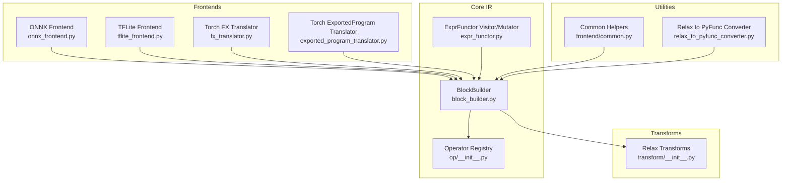
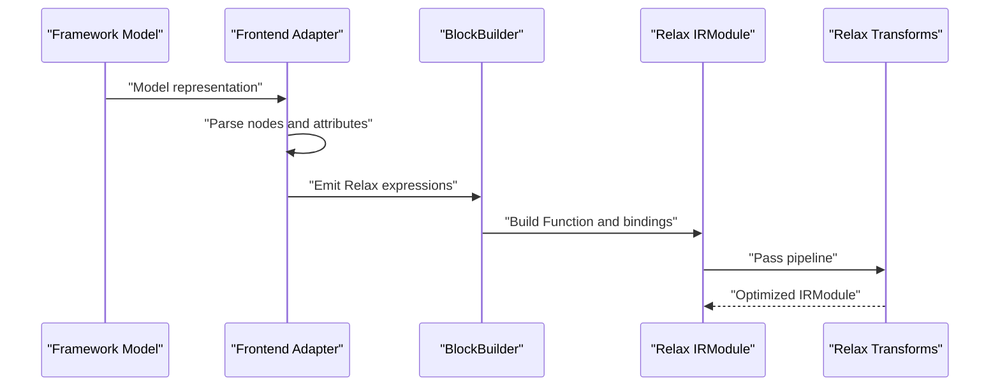
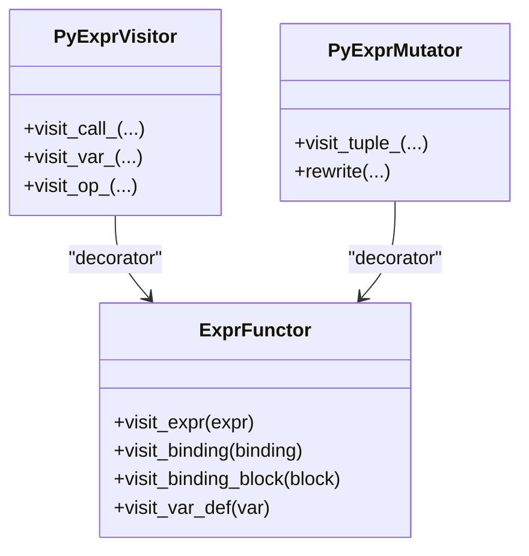
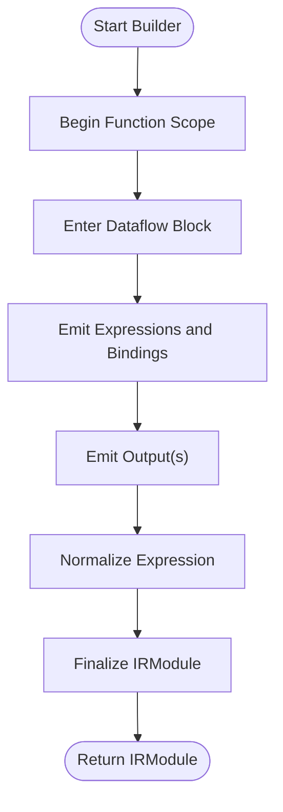
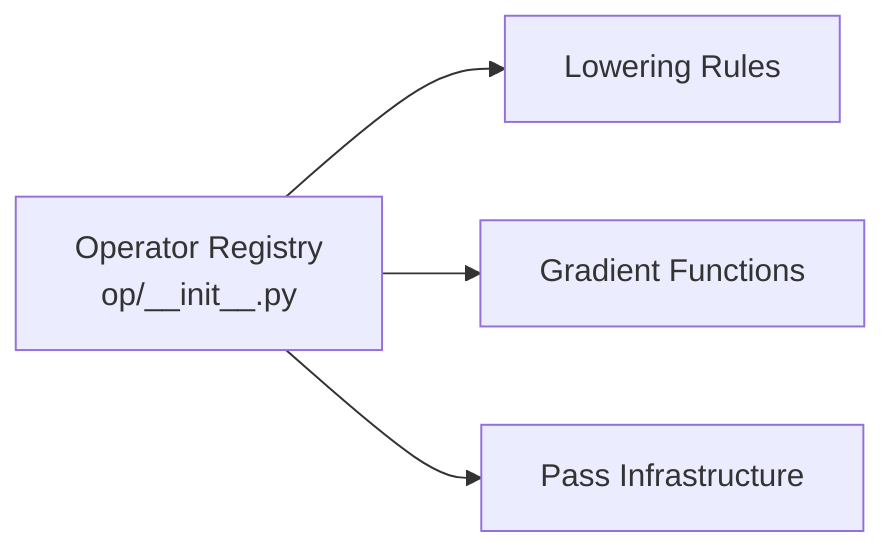
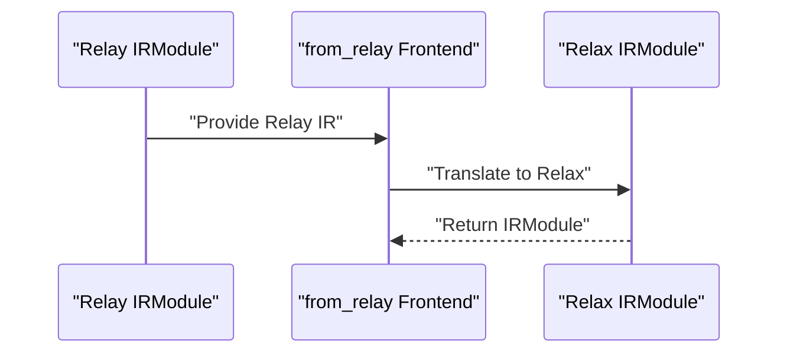
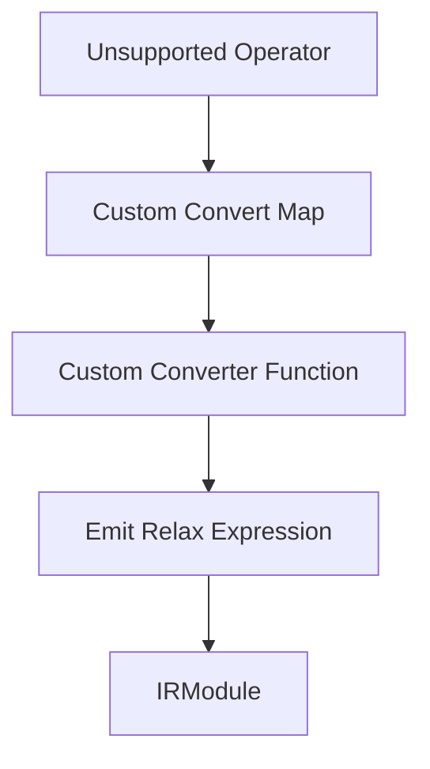
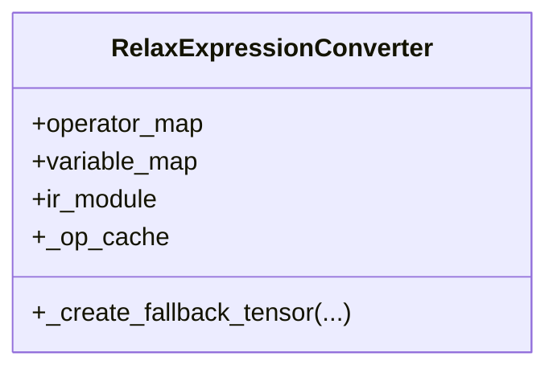
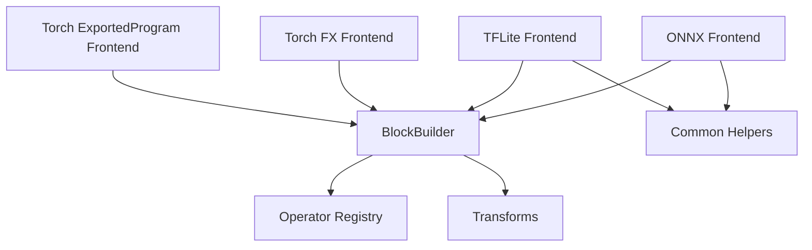
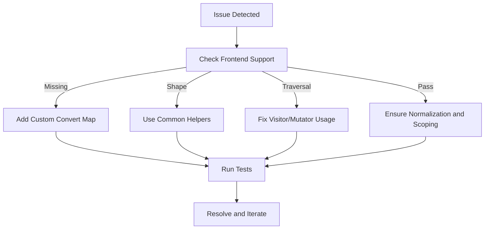

# Custom Framework Integration

<cite>
**Referenced Files in This Document**
- [frontend/__init__.py](file://python/tvm/relax/frontend/__init__.py)
- [frontend/common.py](file://python/tvm/relax/frontend/common.py)
- [expr_functor.py](file://python/tvm/relax/expr_functor.py)
- [block_builder.py](file://python/tvm/relax/block_builder.py)
- [frontend/onnx/onnx_frontend.py](file://python/tvm/relax/frontend/onnx/onnx_frontend.py)
- [frontend/tflite/tflite_frontend.py](file://python/tvm/relax/frontend/tflite/tflite_frontend.py)
- [frontend/torch/fx_translator.py](file://python/tvm/relax/frontend/torch/fx_translator.py)
- [frontend/torch/exported_program_translator.py](file://python/tvm/relax/frontend/torch/exported_program_translator.py)
- [op/__init__.py](file://python/tvm/relax/op/__init__.py)
- [transform/__init__.py](file://python/tvm/relax/transform/__init__.py)
- [relax_to_pyfunc_converter.py](file://python/tvm/relax/relax_to_pyfunc_converter.py)
- [tests/python/relax/test_expr_functor.py](file://tests/python/relax/test_expr_functor.py)
- [tests/python/relax/test_transform_alter_op_impl.py](file://tests/python/relax/test_transform_alter_op_impl.py)
- [docs/how_to/tutorials/import_model.py](file://docs/how_to/tutorials/import_model.py)
</cite>

## Table of Contents
1. [Introduction](#introduction)
2. [Project Structure](#project-structure)
3. [Core Components](#core-components)
4. [Architecture Overview](#architecture-overview)
5. [Detailed Component Analysis](#detailed-component-analysis)
6. [Dependency Analysis](#dependency-analysis)
7. [Performance Considerations](#performance-considerations)
8. [Troubleshooting Guide](#troubleshooting-guide)
9. [Conclusion](#conclusion)
10. [Appendices](#appendices)

## Introduction
This document explains how to develop custom framework integrations with TVM’s Relax IR. It focuses on the frontend adapter pattern, custom operator development, and integration with the Relax IR via the BlockBuilder and operator registries. It also covers bridging legacy Relay frontends using the from_relay frontend, custom convert maps, operator registration workflows, visitor patterns, and AST transformation techniques. Step-by-step guides are provided for creating new frontend adapters, implementing custom operators, and integrating with TVM’s pass infrastructure. Testing strategies, debugging techniques, and best practices are included to maintain robust custom integrations.

## Project Structure
The Relax frontend ecosystem is organized around:
- Frontends: ONNX, TensorFlow Lite, and PyTorch (FX and ExportedProgram) adapters
- Core IR and utilities: BlockBuilder, ExprFunctor visitor/mutator, operator registry
- Transformations: Pass infrastructure for optimization and lowering
- Utilities: Common helpers and conversion utilities



**Diagram sources**
- [frontend/onnx/onnx_frontend.py:18-37](file://python/tvm/relax/frontend/onnx/onnx_frontend.py#L18-L37)
- [frontend/tflite/tflite_frontend.py:25-39](file://python/tvm/relax/frontend/tflite/tflite_frontend.py#L25-L39)
- [frontend/torch/fx_translator.py:20-36](file://python/tvm/relax/frontend/torch/fx_translator.py#L20-L36)
- [frontend/torch/exported_program_translator.py:17-35](file://python/tvm/relax/frontend/torch/exported_program_translator.py#L17-L35)
- [block_builder.py:107-154](file://python/tvm/relax/block_builder.py#L107-L154)
- [expr_functor.py:130-265](file://python/tvm/relax/expr_functor.py#L130-L265)
- [op/__init__.py:24-179](file://python/tvm/relax/op/__init__.py#L24-L179)
- [transform/__init__.py:20-103](file://python/tvm/relax/transform/__init__.py#L20-L103)
- [frontend/common.py:26-55](file://python/tvm/relax/frontend/common.py#L26-L55)
- [relax_to_pyfunc_converter.py:360-390](file://python/tvm/relax/relax_to_pyfunc_converter.py#L360-L390)

**Section sources**
- [frontend/__init__.py:18-22](file://python/tvm/relax/frontend/__init__.py#L18-L22)
- [frontend/common.py:26-55](file://python/tvm/relax/frontend/common.py#L26-L55)
- [expr_functor.py:130-265](file://python/tvm/relax/expr_functor.py#L130-L265)
- [block_builder.py:107-154](file://python/tvm/relax/block_builder.py#L107-L154)
- [op/__init__.py:24-179](file://python/tvm/relax/op/__init__.py#L24-L179)
- [transform/__init__.py:20-103](file://python/tvm/relax/transform/__init__.py#L20-L103)
- [relax_to_pyfunc_converter.py:360-390](file://python/tvm/relax/relax_to_pyfunc_converter.py#L360-L390)

## Core Components
- Frontend adapters: Convert framework graphs to Relax IR using operator-specific converters and a BlockBuilder.
- BlockBuilder: Constructs Relax functions, emits bindings, and normalizes expressions.
- ExprFunctor: Provides visitor and mutator patterns to traverse and transform Relax ASTs.
- Operator registry: Exposes Relax operators and enables registration of gradients and lowering rules.
- Transform passes: Provide optimization and lowering steps integrated into the compilation pipeline.

Key responsibilities:
- Frontend adapters map framework operators to Relax equivalents using convert maps and emit via BlockBuilder.
- ExprFunctor enables AST traversal and rewriting for analysis and transformation.
- Operator registry centralizes operator definitions and attributes for downstream passes.

**Section sources**
- [frontend/onnx/onnx_frontend.py:284-313](file://python/tvm/relax/frontend/onnx/onnx_frontend.py#L284-L313)
- [frontend/tflite/tflite_frontend.py:99-116](file://python/tvm/relax/frontend/tflite/tflite_frontend.py#L99-L116)
- [frontend/torch/fx_translator.py:31-43](file://python/tvm/relax/frontend/torch/fx_translator.py#L31-L43)
- [frontend/torch/exported_program_translator.py:37-40](file://python/tvm/relax/frontend/torch/exported_program_translator.py#L37-L40)
- [block_builder.py:107-154](file://python/tvm/relax/block_builder.py#L107-L154)
- [expr_functor.py:130-265](file://python/tvm/relax/expr_functor.py#L130-L265)
- [op/__init__.py:24-179](file://python/tvm/relax/op/__init__.py#L24-L179)

## Architecture Overview
The integration architecture connects framework frontends to Relax IR through a standardized adapter pattern. Each frontend:
- Parses framework-specific constructs
- Resolves operator semantics using a convert map
- Emits Relax expressions via BlockBuilder
- Produces an IRModule suitable for downstream passes



**Diagram sources**
- [frontend/onnx/onnx_frontend.py:284-313](file://python/tvm/relax/frontend/onnx/onnx_frontend.py#L284-L313)
- [frontend/tflite/tflite_frontend.py:99-116](file://python/tvm/relax/frontend/tflite/tflite_frontend.py#L99-L116)
- [frontend/torch/fx_translator.py:31-43](file://python/tvm/relax/frontend/torch/fx_translator.py#L31-L43)
- [frontend/torch/exported_program_translator.py:37-40](file://python/tvm/relax/frontend/torch/exported_program_translator.py#L37-L40)
- [block_builder.py:107-154](file://python/tvm/relax/block_builder.py#L107-L154)
- [transform/__init__.py:20-103](file://python/tvm/relax/transform/__init__.py#L20-L103)

## Detailed Component Analysis

### Frontend Adapter Pattern
Frontend adapters encapsulate the conversion logic from framework graphs to Relax IR. They:
- Maintain a convert map that maps framework operator names to Relax conversion functions
- Traverse the framework graph and resolve inputs/attributes
- Emit Relax expressions using BlockBuilder and collect parameters

Representative patterns:
- ONNX adapter uses a converter base class and versioned implementations
- TFLite adapter maintains a convert map and operator-specific handlers
- Torch adapters translate FX graphs and ExportedProgram IR to Relax

```mermaid
classDiagram
class OnnxOpConverter {
+get_converter(opset)
+_impl_vx(...)
}
class OperatorConverter {
+convert_map
+convert_op(...)
}
class TorchFXImporter {
+env
+block_builder
+_convert_op(...)
}
class ExportedProgramImporter {
+env
+block_builder
+_convert_op(...)
}
OnnxOpConverter <|-- QuantizeLinear
OnnxOpConverter <|-- DequantizeLinear
OperatorConverter --> "uses convert_map"
TorchFXImporter --> "emits via BlockBuilder"
ExportedProgramImporter --> "emits via BlockBuilder"
```

**Diagram sources**
- [frontend/onnx/onnx_frontend.py:284-313](file://python/tvm/relax/frontend/onnx/onnx_frontend.py#L284-L313)
- [frontend/tflite/tflite_frontend.py:99-116](file://python/tvm/relax/frontend/tflite/tflite_frontend.py#L99-L116)
- [frontend/torch/fx_translator.py:31-43](file://python/tvm/relax/frontend/torch/fx_translator.py#L31-L43)
- [frontend/torch/exported_program_translator.py:37-40](file://python/tvm/relax/frontend/torch/exported_program_translator.py#L37-L40)

**Section sources**
- [frontend/onnx/onnx_frontend.py:284-313](file://python/tvm/relax/frontend/onnx/onnx_frontend.py#L284-L313)
- [frontend/tflite/tflite_frontend.py:99-116](file://python/tvm/relax/frontend/tflite/tflite_frontend.py#L99-L116)
- [frontend/torch/fx_translator.py:31-43](file://python/tvm/relax/frontend/torch/fx_translator.py#L31-L43)
- [frontend/torch/exported_program_translator.py:37-40](file://python/tvm/relax/frontend/torch/exported_program_translator.py#L37-L40)

### Visitor Patterns and AST Transformation
ExprFunctor provides visitor and mutator decorators to traverse and rewrite Relax expressions. Visitors can inspect operator usage, variables, and bindings, while mutators can transform subtrees.



**Diagram sources**
- [expr_functor.py:130-265](file://python/tvm/relax/expr_functor.py#L130-L265)
- [expr_functor.py:383-435](file://python/tvm/relax/expr_functor.py#L383-L435)
- [expr_functor.py:787-808](file://python/tvm/relax/expr_functor.py#L787-L808)

**Section sources**
- [expr_functor.py:130-265](file://python/tvm/relax/expr_functor.py#L130-L265)
- [expr_functor.py:383-435](file://python/tvm/relax/expr_functor.py#L383-L435)
- [expr_functor.py:787-808](file://python/tvm/relax/expr_functor.py#L787-L808)
- [tests/python/relax/test_expr_functor.py:591-639](file://tests/python/relax/test_expr_functor.py#L591-L639)

### BlockBuilder and IR Construction
BlockBuilder is the developer API for constructing Relax IR. It manages scopes, dataflow blocks, and emits bindings and function outputs. It supports:
- Function scopes with parameters and attributes
- Dataflow scopes for binding sequences
- Emitting expressions and outputs
- Normalizing expressions and finalizing IRModule



**Diagram sources**
- [block_builder.py:107-154](file://python/tvm/relax/block_builder.py#L107-L154)
- [block_builder.py:213-266](file://python/tvm/relax/block_builder.py#L213-L266)
- [block_builder.py:283-291](file://python/tvm/relax/block_builder.py#L283-L291)
- [block_builder.py:312-331](file://python/tvm/relax/block_builder.py#L312-L331)
- [block_builder.py:576-593](file://python/tvm/relax/block_builder.py#L576-L593)
- [block_builder.py:677-703](file://python/tvm/relax/block_builder.py#L677-L703)

**Section sources**
- [block_builder.py:107-154](file://python/tvm/relax/block_builder.py#L107-L154)
- [block_builder.py:213-266](file://python/tvm/relax/block_builder.py#L213-L266)
- [block_builder.py:283-291](file://python/tvm/relax/block_builder.py#L283-L291)
- [block_builder.py:312-331](file://python/tvm/relax/block_builder.py#L312-L331)
- [block_builder.py:576-593](file://python/tvm/relax/block_builder.py#L576-L593)
- [block_builder.py:677-703](file://python/tvm/relax/block_builder.py#L677-L703)

### Operator Registration and Custom Operators
Operators are exposed through the Relax operator registry. New operators can be:
- Defined in the operator registry
- Associated with lowering rules and gradient functions
- Integrated into pass infrastructure for optimization and lowering



**Diagram sources**
- [op/__init__.py:24-179](file://python/tvm/relax/op/__init__.py#L24-L179)
- [transform/__init__.py:20-103](file://python/tvm/relax/transform/__init__.py#L20-L103)

**Section sources**
- [op/__init__.py:24-179](file://python/tvm/relax/op/__init__.py#L24-L179)
- [transform/__init__.py:20-103](file://python/tvm/relax/transform/__init__.py#L20-L103)

### Bridging Legacy Relay Frontends with from_relay
Legacy Relay-based frontends can be bridged into Relax using the from_relay frontend. This enables incremental migration and coexistence of Relay and Relax IR within the same pipeline.



[No sources needed since this diagram shows conceptual workflow, not actual code structure]

### Custom Convert Maps and Unsupported Operators
When a frontend lacks support for a framework operator, you can extend it with a custom convert map. This map associates operator names with custom conversion functions that receive the framework node and the importer instance.



**Diagram sources**
- [docs/how_to/tutorials/import_model.py:117-144](file://docs/how_to/tutorials/import_model.py#L117-L144)

**Section sources**
- [docs/how_to/tutorials/import_model.py:117-144](file://docs/how_to/tutorials/import_model.py#L117-L144)

### Relax to Python/PyTorch Conversion Utility
The RelaxExpressionConverter transforms Relax expressions into Python/PyTorch code using an operator map and caches for efficient reuse.



**Diagram sources**
- [relax_to_pyfunc_converter.py:360-390](file://python/tvm/relax/relax_to_pyfunc_converter.py#L360-L390)

**Section sources**
- [relax_to_pyfunc_converter.py:360-390](file://python/tvm/relax/relax_to_pyfunc_converter.py#L360-L390)

## Dependency Analysis
Frontend adapters depend on:
- BlockBuilder for IR construction
- Operator registry for operator emission
- Common helpers for shape inference and padding
- Transform passes for post-processing



**Diagram sources**
- [frontend/onnx/onnx_frontend.py:284-313](file://python/tvm/relax/frontend/onnx/onnx_frontend.py#L284-L313)
- [frontend/tflite/tflite_frontend.py:99-116](file://python/tvm/relax/frontend/tflite/tflite_frontend.py#L99-L116)
- [frontend/torch/fx_translator.py:31-43](file://python/tvm/relax/frontend/torch/fx_translator.py#L31-L43)
- [frontend/torch/exported_program_translator.py:37-40](file://python/tvm/relax/frontend/torch/exported_program_translator.py#L37-L40)
- [block_builder.py:107-154](file://python/tvm/relax/block_builder.py#L107-L154)
- [op/__init__.py:24-179](file://python/tvm/relax/op/__init__.py#L24-L179)
- [frontend/common.py:26-55](file://python/tvm/relax/frontend/common.py#L26-L55)
- [transform/__init__.py:20-103](file://python/tvm/relax/transform/__init__.py#L20-L103)

**Section sources**
- [frontend/onnx/onnx_frontend.py:284-313](file://python/tvm/relax/frontend/onnx/onnx_frontend.py#L284-L313)
- [frontend/tflite/tflite_frontend.py:99-116](file://python/tvm/relax/frontend/tflite/tflite_frontend.py#L99-L116)
- [frontend/torch/fx_translator.py:31-43](file://python/tvm/relax/frontend/torch/fx_translator.py#L31-L43)
- [frontend/torch/exported_program_translator.py:37-40](file://python/tvm/relax/frontend/torch/exported_program_translator.py#L37-L40)
- [block_builder.py:107-154](file://python/tvm/relax/block_builder.py#L107-L154)
- [op/__init__.py:24-179](file://python/tvm/relax/op/__init__.py#L24-L179)
- [frontend/common.py:26-55](file://python/tvm/relax/frontend/common.py#L26-L55)
- [transform/__init__.py:20-103](file://python/tvm/relax/transform/__init__.py#L20-L103)

## Performance Considerations
- Prefer emitting TE-based calls via BlockBuilder to leverage TIR lowering and kernel fusion.
- Use operator registration and lowering rules to ensure optimal kernel selection.
- Apply transform passes early to reduce redundant computations and enable aggressive fusion.
- Cache operator mappings in converters to minimize repeated lookups.

[No sources needed since this section provides general guidance]

## Troubleshooting Guide
Common issues and techniques:
- Unsupported operators: Extend the frontend with a custom convert map and provide a converter function that emits the appropriate Relax expression.
- Shape inference failures: Use common helpers for autopadding and shape computation.
- Visitor/mutator misuse: Ensure visitor methods are correctly overridden and used with the visitor decorator.
- Pass pipeline errors: Verify IR normalization and function scoping before applying passes.



**Section sources**
- [docs/how_to/tutorials/import_model.py:117-144](file://docs/how_to/tutorials/import_model.py#L117-L144)
- [frontend/common.py:58-128](file://python/tvm/relax/frontend/common.py#L58-L128)
- [expr_functor.py:130-265](file://python/tvm/relax/expr_functor.py#L130-L265)
- [block_builder.py:662-675](file://python/tvm/relax/block_builder.py#L662-L675)

## Conclusion
Custom framework integrations with TVM’s Relax IR rely on a consistent adapter pattern, robust IR construction via BlockBuilder, and a flexible operator registry. By leveraging visitor/mutator patterns, custom convert maps, and the pass infrastructure, developers can extend TVM to support new frameworks and operators while maintaining performance and correctness. The provided guides and best practices offer a practical roadmap for building, testing, and debugging custom integrations.

[No sources needed since this section summarizes without analyzing specific files]

## Appendices

### Step-by-Step: Creating a New Frontend Adapter
- Define a converter map that maps framework operator names to conversion functions.
- Implement conversion functions that accept inputs, attributes, and the importer context.
- Emit Relax expressions using BlockBuilder and collect parameters.
- Validate IRModule and integrate with downstream transforms.

**Section sources**
- [frontend/onnx/onnx_frontend.py:284-313](file://python/tvm/relax/frontend/onnx/onnx_frontend.py#L284-L313)
- [frontend/tflite/tflite_frontend.py:99-116](file://python/tvm/relax/frontend/tflite/tflite_frontend.py#L99-L116)
- [block_builder.py:107-154](file://python/tvm/relax/block_builder.py#L107-L154)

### Step-by-Step: Implementing Custom Operators
- Register the operator in the operator registry.
- Provide lowering rules and gradient functions if needed.
- Integrate with pass infrastructure for optimization and code generation.

**Section sources**
- [op/__init__.py:24-179](file://python/tvm/relax/op/__init__.py#L24-L179)
- [transform/__init__.py:20-103](file://python/tvm/relax/transform/__init__.py#L20-L103)

### Step-by-Step: Integrating with Pass Infrastructure
- Build IRModule using BlockBuilder.
- Apply transform passes to optimize and lower the IR.
- Finalize IRModule and prepare for runtime execution.

**Section sources**
- [block_builder.py:677-703](file://python/tvm/relax/block_builder.py#L677-L703)
- [transform/__init__.py:20-103](file://python/tvm/relax/transform/__init__.py#L20-L103)

### Step-by-Step: Testing Strategies and Debugging
- Use visitor/mutator tests to validate AST traversal and rewriting.
- Compare IR before and after passes to ensure correctness.
- Employ custom convert maps for unsupported operators and add targeted tests.

**Section sources**
- [tests/python/relax/test_expr_functor.py:591-639](file://tests/python/relax/test_expr_functor.py#L591-L639)
- [tests/python/relax/test_transform_alter_op_impl.py:64-449](file://tests/python/relax/test_transform_alter_op_impl.py#L64-L449)
- [docs/how_to/tutorials/import_model.py:117-144](file://docs/how_to/tutorials/import_model.py#L117-L144)