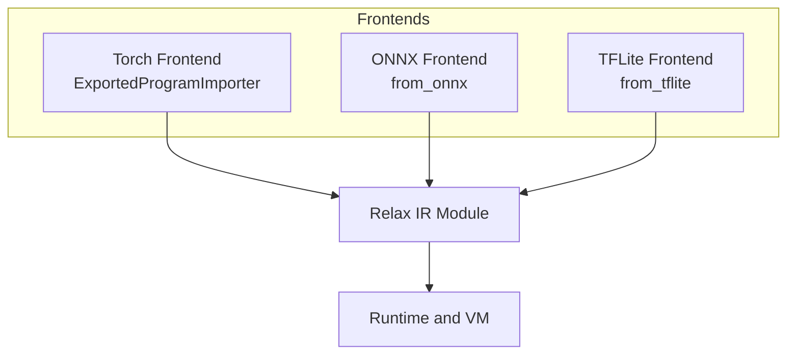
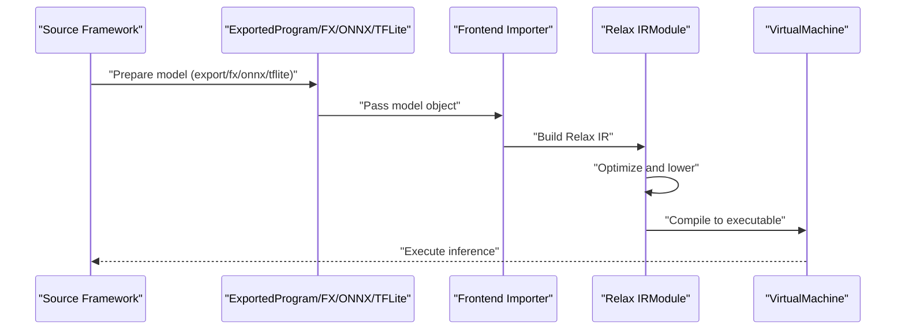
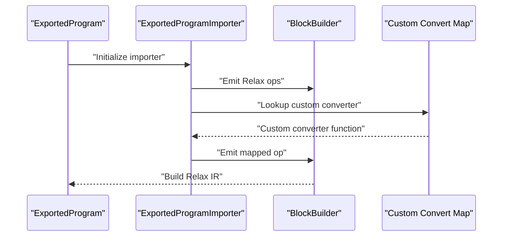
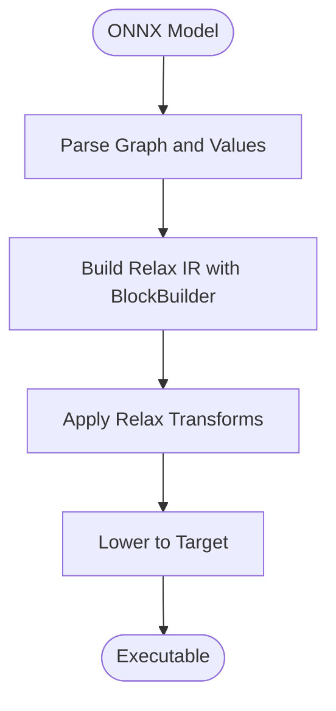
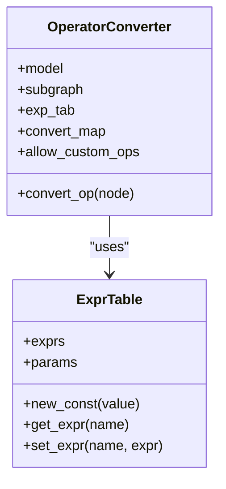
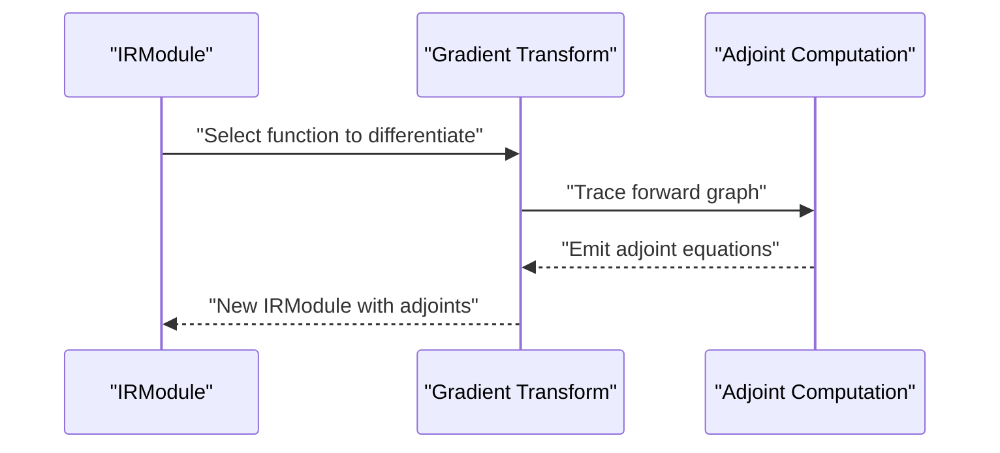
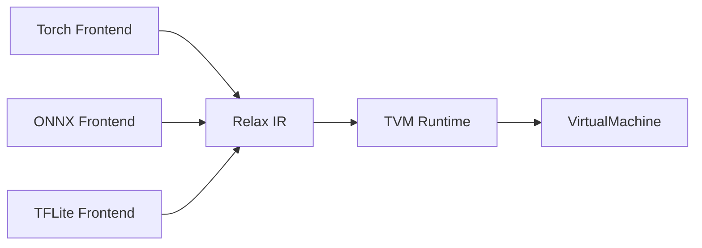

# Framework Integration

<cite>
**Referenced Files in This Document**
- [import_model.py](file://docs/how_to/tutorials/import_model.py)
- [onnx_frontend.py](file://python/tvm/relax/frontend/onnx/onnx_frontend.py)
- [exported_program_translator.py](file://python/tvm/relax/frontend/torch/exported_program_translator.py)
- [tflite_frontend.py](file://python/tvm/relax/frontend/tflite/tflite_frontend.py)
- [relax_to_pyfunc_converter.py](file://python/tvm/relax/relax_to_pyfunc_converter.py)
- [test_transform_gradient.py](file://tests/python/relax/test_transform_gradient.py)
- [test_transform_gradient_checkpoint.py](file://tests/python/relax/test_transform_gradient_checkpoint.py)
- [test_training_setup_trainer.py](file://tests/python/relax/test_training_setup_trainer.py)
- [cpu_device_api.cc](file://src/runtime/cpu_device_api.cc)
- [memory_manager_tests.cc](file://tests/cpp/runtime/memory/memory_manager_tests.cc)
- [gen_tensor_op.py](file://python/tvm/contrib/cutlass/gen_tensor_op.py)
</cite>

## Table of Contents
1. [Introduction](#introduction)
2. [Project Structure](#project-structure)
3. [Core Components](#core-components)
4. [Architecture Overview](#architecture-overview)
5. [Detailed Component Analysis](#detailed-component-analysis)
6. [Dependency Analysis](#dependency-analysis)
7. [Performance Considerations](#performance-considerations)
8. [Troubleshooting Guide](#troubleshooting-guide)
9. [Conclusion](#conclusion)
10. [Appendices](#appendices)

## Introduction
This document explains how Apache TVM integrates seamlessly with major machine learning frameworks, focusing on:
- Model import workflows from PyTorch, ONNX, and TensorFlow Lite
- Frontend adapters and conversion utilities
- Interoperability mechanisms and automatic differentiation support
- Relax frontend integration patterns and custom operator development
- Practical examples for verifying correctness and optimizing performance
- Memory management, device placement, and deployment considerations

## Project Structure
TVM’s framework integration lives primarily in the Relax frontend and runtime layers:
- Torch frontend: translates PyTorch ExportedProgram into Relax IR
- ONNX frontend: reads ONNX graphs and builds Relax IR
- TFLite frontend: parses TFLite models and emits Relax expressions
- Runtime and memory: device allocation, memory pools, and VM execution
- Tests and tutorials: demonstrate import, verification, gradients, and training setup

**Diagram sources**
- [exported_program_translator.py:1-200](file://python/tvm/relax/frontend/torch/exported_program_translator.py#L1-L200)
- [onnx_frontend.py:1-200](file://python/tvm/relax/frontend/onnx/onnx_frontend.py#L1-L200)
- [tflite_frontend.py:1-200](file://python/tvm/relax/frontend/tflite/tflite_frontend.py#L1-L200)

**Section sources**
- [import_model.py:19-40](file://docs/how_to/tutorials/import_model.py#L19-L40)

## Core Components
- Torch frontend: Provides from_exported_program and related helpers to import PyTorch models. It decomposes high-level operators and maps ATen ops to Relax equivalents.
- ONNX frontend: Provides from_onnx to import ONNX graphs, preserving dynamic shapes and mapping operators to Relax.
- TFLite frontend: Provides from_tflite to import TFLite models, with a comprehensive operator map to Relax ops.
- Relax IR: The unified intermediate representation that enables optimization and deployment.
- Runtime and VM: Compile-time and runtime execution, including device placement and memory management.

**Section sources**
- [import_model.py:42-96](file://docs/how_to/tutorials/import_model.py#L42-L96)
- [exported_program_translator.py:37-200](file://python/tvm/relax/frontend/torch/exported_program_translator.py#L37-L200)
- [onnx_frontend.py:18-200](file://python/tvm/relax/frontend/onnx/onnx_frontend.py#L18-L200)
- [tflite_frontend.py:25-200](file://python/tvm/relax/frontend/tflite/tflite_frontend.py#L25-L200)

## Architecture Overview
End-to-end integration follows a predictable flow:
- Prepare model in source framework (e.g., torch.export)
- Import into Relax via appropriate frontend
- Detach parameters and optimize
- Compile to target runtime
- Execute on chosen device

**Diagram sources**
- [import_model.py:80-116](file://docs/how_to/tutorials/import_model.py#L80-L116)
- [exported_program_translator.py:37-200](file://python/tvm/relax/frontend/torch/exported_program_translator.py#L37-L200)
- [onnx_frontend.py:18-200](file://python/tvm/relax/frontend/onnx/onnx_frontend.py#L18-L200)
- [tflite_frontend.py:25-200](file://python/tvm/relax/frontend/tflite/tflite_frontend.py#L25-L200)

## Detailed Component Analysis

### Torch Frontend Integration
- Entry points: from_exported_program, from_fx, relax_dynamo, dynamo_capture_subgraphs
- Key parameters: keep_params_as_input, unwrap_unit_return_tuple, run_ep_decomposition
- Unsupported operator handling: custom_convert_map with ExportedProgramImporter
- Automatic differentiation: Gradient transform and checkpointing in tests

**Diagram sources**
- [import_model.py:117-163](file://docs/how_to/tutorials/import_model.py#L117-L163)
- [exported_program_translator.py:37-200](file://python/tvm/relax/frontend/torch/exported_program_translator.py#L37-L200)

**Section sources**
- [import_model.py:42-116](file://docs/how_to/tutorials/import_model.py#L42-L116)
- [import_model.py:117-163](file://docs/how_to/tutorials/import_model.py#L117-L163)
- [exported_program_translator.py:37-200](file://python/tvm/relax/frontend/torch/exported_program_translator.py#L37-L200)

### ONNX Frontend Integration
- Entry point: from_onnx
- Dynamic shapes: preserved and lowered to static when possible
- Operator coverage: extensible via operator registry

**Diagram sources**
- [onnx_frontend.py:18-200](file://python/tvm/relax/frontend/onnx/onnx_frontend.py#L18-L200)

**Section sources**
- [onnx_frontend.py:18-200](file://python/tvm/relax/frontend/onnx/onnx_frontend.py#L18-L200)

### TFLite Frontend Integration
- Entry point: from_tflite
- Operator map: comprehensive mapping from TFLite ops to Relax ops
- Quantization/dequantization support via dedicated converters

**Diagram sources**
- [tflite_frontend.py:99-200](file://python/tvm/relax/frontend/tflite/tflite_frontend.py#L99-L200)

**Section sources**
- [tflite_frontend.py:99-200](file://python/tvm/relax/frontend/tflite/tflite_frontend.py#L99-L200)

### Automatic Differentiation and Gradients
- Gradient transform: computes adjoints and returns function plus gradients
- Checkpointing: reduces memory by recomputing activations during backward pass
- Training setup: demonstrates loss and gradient computation patterns

**Diagram sources**
- [test_transform_gradient.py:105-256](file://tests/python/relax/test_transform_gradient.py#L105-L256)
- [test_transform_gradient_checkpoint.py:327-348](file://tests/python/relax/test_transform_gradient_checkpoint.py#L327-L348)
- [test_training_setup_trainer.py:63-154](file://tests/python/relax/test_training_setup_trainer.py#L63-L154)

**Section sources**
- [test_transform_gradient.py:105-256](file://tests/python/relax/test_transform_gradient.py#L105-L256)
- [test_transform_gradient_checkpoint.py:327-348](file://tests/python/relax/test_transform_gradient_checkpoint.py#L327-L348)
- [test_training_setup_trainer.py:63-154](file://tests/python/relax/test_training_setup_trainer.py#L63-L154)

### Interoperability with PyTorch Operators
- Relax-to-PyTorch operator mapping enables bridging and verification
- Useful for cross-framework validation and debugging

**Section sources**
- [relax_to_pyfunc_converter.py:152-184](file://python/tvm/relax/relax_to_pyfunc_converter.py#L152-L184)

## Dependency Analysis
Frontend importers depend on Relax IR and TVM runtime. They rely on:
- Relax BlockBuilder and Var emission
- Operator registries and mapping tables
- Shape and type inference utilities
- Optional framework-specific packages (ONNX, TFLite, Torch)

**Diagram sources**
- [exported_program_translator.py:37-200](file://python/tvm/relax/frontend/torch/exported_program_translator.py#L37-L200)
- [onnx_frontend.py:18-200](file://python/tvm/relax/frontend/onnx/onnx_frontend.py#L18-L200)
- [tflite_frontend.py:25-200](file://python/tvm/relax/frontend/tflite/tflite_frontend.py#L25-L200)

**Section sources**
- [import_model.py:383-407](file://docs/how_to/tutorials/import_model.py#L383-L407)

## Performance Considerations
- CUTLASS integration: generate and profile GEMM kernels to select optimal configurations
- Operator coverage: leverage frontend operator maps to avoid fallbacks and improve throughput
- Decomposition: run EP decomposition to increase optimization opportunities
- Memory pooling: use pooled allocators to reduce fragmentation and overhead

**Section sources**
- [gen_tensor_op.py:419-454](file://python/tvm/contrib/cutlass/gen_tensor_op.py#L419-L454)

## Troubleshooting Guide
Common issues and remedies:
- Unsupported operators in PyTorch: extend via custom_convert_map with ExportedProgramImporter
- Dynamic shapes in ONNX: expect dynamic ops if static lowering is not possible
- Parameter management: use detach_params to separate weights for independent handling
- Memory errors: verify device memory availability and allocator usage

**Section sources**
- [import_model.py:117-163](file://docs/how_to/tutorials/import_model.py#L117-L163)
- [onnx_frontend.py:31-37](file://python/tvm/relax/frontend/onnx/onnx_frontend.py#L31-L37)
- [cpu_device_api.cc:60-109](file://src/runtime/cpu_device_api.cc#L60-L109)
- [memory_manager_tests.cc:51-146](file://tests/cpp/runtime/memory/memory_manager_tests.cc#L51-L146)

## Conclusion
TVM’s Relax frontend provides robust, extensible integration with PyTorch, ONNX, and TensorFlow Lite. By leveraging frontend importers, custom operator maps, and gradient transforms, developers can import, verify, optimize, and deploy models across diverse hardware targets while maintaining computational fidelity and performance.

## Appendices

### Practical Import Examples
- PyTorch: torch.export → from_exported_program → detach_params → compile and run
- ONNX: from_onnx → optional transforms → compile and run
- TFLite: from_tflite → operator mapping → compile and run

**Section sources**
- [import_model.py:42-116](file://docs/how_to/tutorials/import_model.py#L42-L116)
- [import_model.py:383-407](file://docs/how_to/tutorials/import_model.py#L383-L407)

### Device Placement and Deployment
- CPU device API provides total memory and allocation routines
- Runtime memory managers support naive and pooled allocators
- VirtualMachine executes compiled modules on target devices

**Section sources**
- [cpu_device_api.cc:60-109](file://src/runtime/cpu_device_api.cc#L60-L109)
- [memory_manager_tests.cc:51-146](file://tests/cpp/runtime/memory/memory_manager_tests.cc#L51-L146)