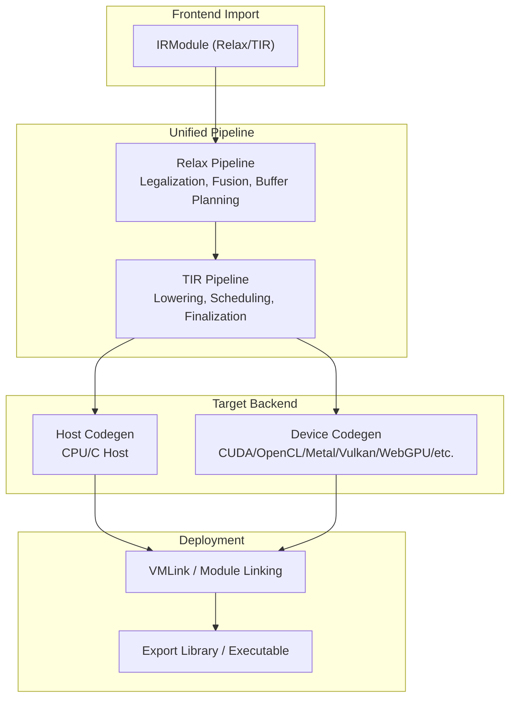
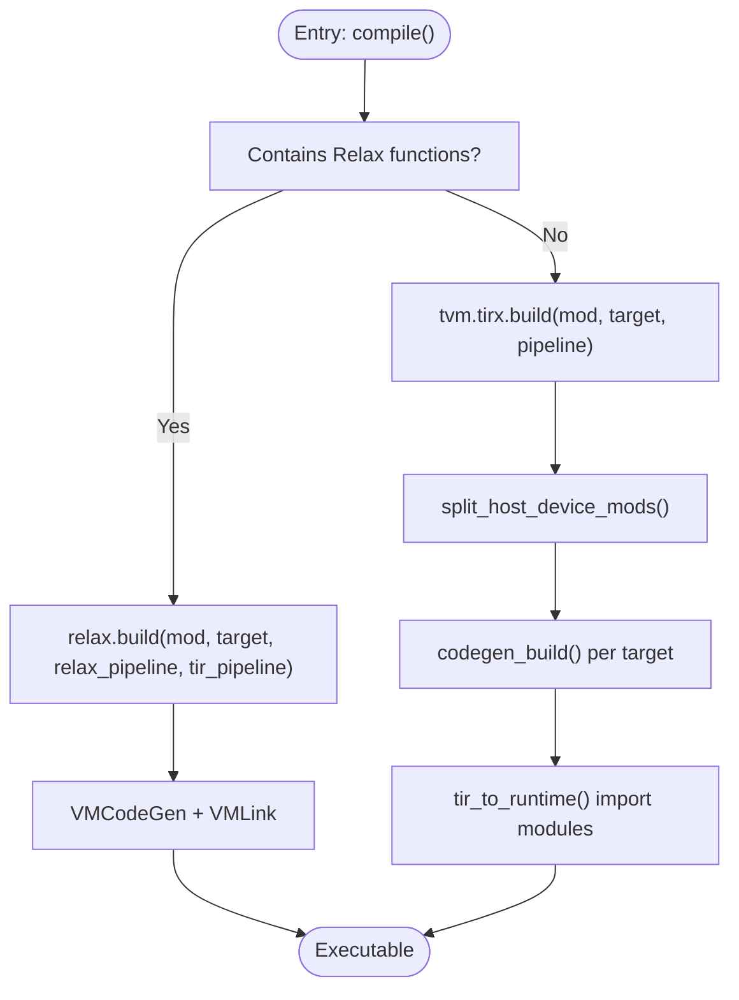
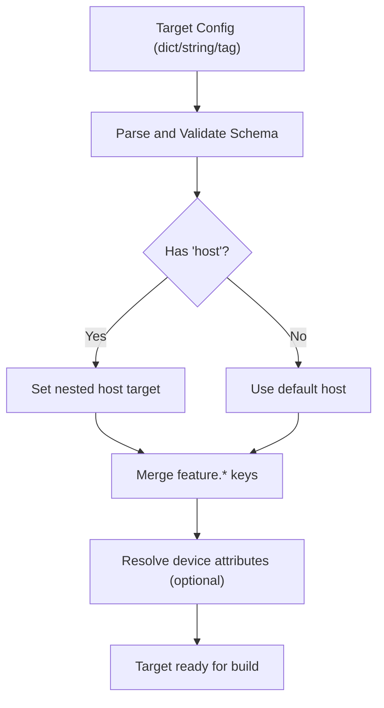
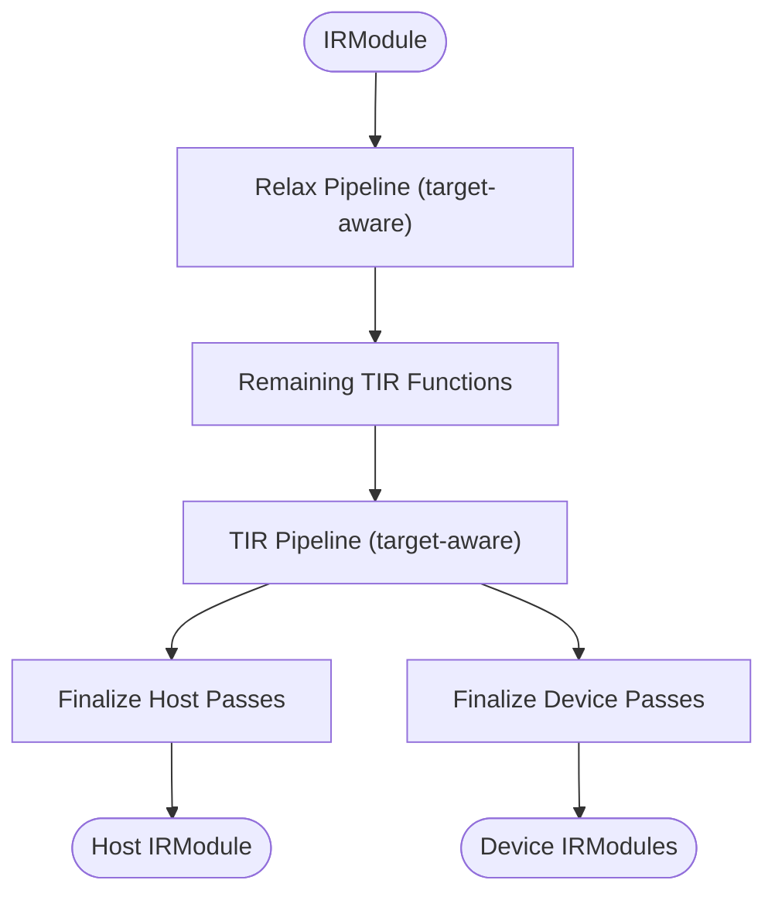
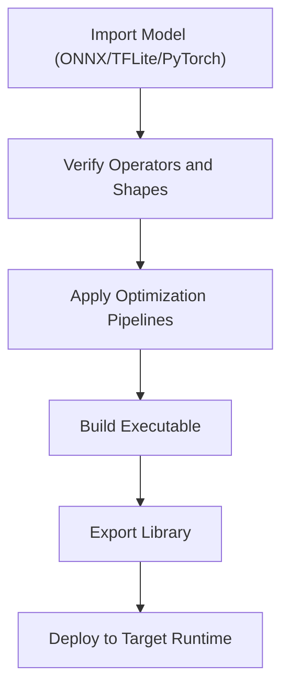
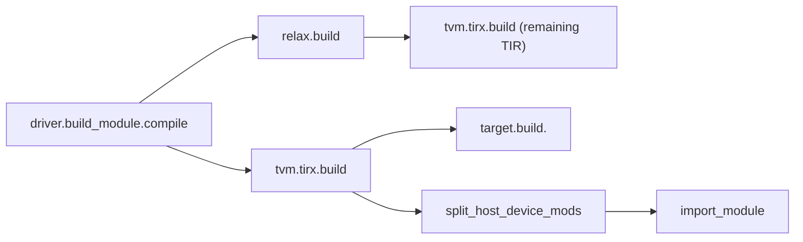

# Model Conversion Workflows

<cite>
**Referenced Files in This Document**
- [build_module.py](file://python/tvm/driver/build_module.py)
- [build.py](file://python/tvm/tirx/build.py)
- [target.py](file://python/tvm/target/target.py)
- [target.cc](file://src/target/target.cc)
- [vm_build.py](file://python/tvm/relax/vm_build.py)
- [pipeline.py](file://python/tvm/relax/pipeline.py)
- [codegen.rst](file://docs/arch/codegen.rst)
- [relax_vm.rst](file://docs/arch/relax_vm.rst)
- [import_model.py](file://docs/how_to/tutorials/import_model.py)
- [export_and_load_executable.py](file://docs/how_to/tutorials/export_and_load_executable.py)
- [module.cc](file://src/runtime/module.cc)
- [pass_infra.rst](file://docs/arch/pass_infra.rst)
</cite>

## Table of Contents
1. [Introduction](#introduction)
2. [Project Structure](#project-structure)
3. [Core Components](#core-components)
4. [Architecture Overview](#architecture-overview)
5. [Detailed Component Analysis](#detailed-component-analysis)
6. [Dependency Analysis](#dependency-analysis)
7. [Performance Considerations](#performance-considerations)
8. [Troubleshooting Guide](#troubleshooting-guide)
9. [Conclusion](#conclusion)
10. [Appendices](#appendices)

## Introduction
This document explains model conversion workflows across frameworks in TVM. It covers the unified compilation pipeline, optimization passes, and deployment preparation steps. It documents the build_module workflow, target configuration, and runtime selection processes. It also addresses model validation, shape inference, operator mapping verification, and provides practical end-to-end examples from raw model import through optimization to deployment-ready executables. Finally, it includes performance optimization tips, memory management strategies, and troubleshooting common conversion bottlenecks.

## Project Structure
At a high level, TVM’s model conversion spans three stages:
- Frontend importers convert framework models (ONNX, TFLite, PyTorch ExportedProgram) into a canonical IRModule.
- The unified compilation pipeline applies Relax/TIR optimization passes and lowers to target-specific code.
- Deployment prepares runtime executables and handles host-device linkage.



**Section sources**
- [codegen.rst: Where Codegen Fits:30-62](file://docs/arch/codegen.rst#L30-L62)
- [relax_vm.rst: Compilation: From Relax IR to Bytecode:60-94](file://docs/arch/relax_vm.rst#L60-L94)

## Core Components
- Unified build entrypoints:
  - Python driver: compile and build functions route to Relax or TIR paths depending on module type.
  - TIR build: split host/device modules, apply TIR pipeline, and codegen/link.
  - Relax build: apply Relax pipeline, emit VM bytecode, lower remaining TIR, and link with VM.
- Target configuration:
  - Target object supports JSON config, tags, and host/target nesting.
  - Target creation validates schema, merges features, and supports device queries.
- Runtime selection:
  - Runtime-enabled checks determine availability of device runtimes and codegen backends.

**Section sources**
- [build_module.py: compile and build routing:72-113](file://python/tvm/driver/build_module.py#L72-L113)
- [build.py: TIR build pipeline:155-242](file://python/tvm/tirx/build.py#L155-L242)
- [vm_build.py: Relax build and VM link:172-284](file://python/tvm/relax/vm_build.py#L172-L284)
- [target.py: Target API:52-233](file://python/tvm/target/target.py#L52-L233)
- [target.cc: Target creation and canonicalization:254-423](file://src/target/target.cc#L254-L423)
- [module.cc: Runtime-enabled checks:38-69](file://src/runtime/module.cc#L38-L69)

## Architecture Overview
The unified pipeline integrates Relax and TIR compilation with target-specific code generation and linking.

```mermaid
sequenceDiagram
participant User as "User Code"
participant Driver as "tvm.driver.build_module.compile"
participant Relax as "relax.build"
participant TIR as "tvm.tirx.build"
participant Target as "Target"
participant Codegen as "target.build.<kind>"
participant Link as "VMLink / Module Link"
User->>Driver : compile(mod, target, relax_pipeline, tir_pipeline)
alt Contains Relax functions
Driver->>Relax : build(mod, target, relax_pipeline, tir_pipeline)
Relax->>Relax : Apply Relax pipeline
Relax->>TIR : Lower remaining TIR functions
else Pure TIR
Driver->>TIR : build(mod, target, pipeline)
end
TIR->>Target : Resolve target and host
TIR->>Codegen : target.build.<kind>(IRModule, Target)
Codegen-->>TIR : Host/Device Modules
TIR->>Link : Import device modules into host
Link-->>User : Executable (VM or standalone)
```

**Diagram sources**
- [build_module.py: compile routing:104-112](file://python/tvm/driver/build_module.py#L104-L112)
- [vm_build.py: build and VMLink:172-284](file://python/tvm/relax/vm_build.py#L172-L284)
- [build.py: split_host_device_mods and tir_to_runtime:28-153](file://python/tvm/tirx/build.py#L28-L153)
- [target.cc: Target creation and canonicalization:254-423](file://src/target/target.cc#L254-L423)

**Section sources**
- [codegen.rst: Two-phase compilation:30-62](file://docs/arch/codegen.rst#L30-L62)
- [relax_vm.rst: VM bytecode emission and linking:60-94](file://docs/arch/relax_vm.rst#L60-L94)

## Detailed Component Analysis

### Unified Build Entrypoints
- tvm.driver.build_module.compile:
  - Detects Relax vs TIR modules and routes accordingly.
  - Delegates to relax.build for Relax modules and tvm.tirx.build for TIR.
- tvm.tirx.build:
  - Determines target/host, binds target to functions, applies TIR pipeline, splits host/device, and links modules.
- tvm.relax.vm_build.build:
  - Applies Relax pipeline, emits VM bytecode, lowers remaining TIR, and links with VMLink.



**Diagram sources**
- [build_module.py: compile routing:104-112](file://python/tvm/driver/build_module.py#L104-L112)
- [vm_build.py: build:172-284](file://python/tvm/relax/vm_build.py#L172-L284)
- [build.py: build:155-242](file://python/tvm/tirx/build.py#L155-L242)

**Section sources**
- [build_module.py: compile and build:72-113](file://python/tvm/driver/build_module.py#L72-L113)
- [build.py: build:155-242](file://python/tvm/tirx/build.py#L155-L242)
- [vm_build.py: build:172-284](file://python/tvm/relax/vm_build.py#L172-L284)

### Target Configuration and Runtime Selection
- Target creation supports:
  - JSON config dicts, tags, and kind names.
  - Feature keys preserved across canonicalization.
  - Device queries to populate target attributes.
- Runtime-enabled checks ensure device runtime and codegen backends are available.



**Diagram sources**
- [target.cc: FromConfig parsing and canonicalization:286-423](file://src/target/target.cc#L286-L423)
- [target.py: Target API and context:52-233](file://python/tvm/target/target.py#L52-L233)
- [module.cc: Runtime-enabled checks:38-69](file://src/runtime/module.cc#L38-L69)

**Section sources**
- [target.cc: Target creation and schema resolution:254-423](file://src/target/target.cc#L254-L423)
- [target.py: Target API and context:52-233](file://python/tvm/target/target.py#L52-L233)
- [module.cc: Runtime-enabled checks:38-69](file://src/runtime/module.cc#L38-L69)

### Optimization Passes and Pipelines
- Relax pipeline:
  - Default pipelines vary by target kind (e.g., CUDA, ROCm, Metal, CPU, Adreno).
  - Includes operator legalization, fusion, buffer planning, and scheduling.
- TIR pipeline:
  - Host and device finalize passes applied after lowering.
  - Target-specific pipelines selected via target kind.



**Diagram sources**
- [relax_vm.rst: Relax pipeline steps:84-92](file://docs/arch/relax_vm.rst#L84-L92)
- [pipeline.py: get_default_pipeline:330-347](file://python/tvm/relax/pipeline.py#L330-L347)
- [build.py: finalize_host_passes/finalize_device_passes:230-236](file://python/tvm/tirx/build.py#L230-L236)

**Section sources**
- [relax_vm.rst: Compilation steps:60-94](file://docs/arch/relax_vm.rst#L60-L94)
- [pipeline.py: get_default_pipeline:330-347](file://python/tvm/relax/pipeline.py#L330-L347)
- [build.py: finalize passes:230-236](file://python/tvm/tirx/build.py#L230-L236)

### Deployment Preparation and Executable Export
- VMExecutable wraps runtime modules with convenience methods.
- VMLink imports device modules into host and produces a VM executable.
- Export library writes artifacts to disk for deployment.

```mermaid
sequenceDiagram
participant Build as "relax.build"
participant VM as "VMCodeGen"
participant TIRB as "tvm.tirx.build"
participant Link as "VMLink"
participant Export as "export_library"
Build->>VM : Emit bytecode from Relax functions
VM-->>Build : IRModule with remaining TIR
Build->>TIRB : Build remaining TIR to native
TIRB-->>Build : Host + Device modules
Build->>Link : Import device modules into host
Link-->>Build : VMExecutable
Build->>Export : Write artifacts
```

**Diagram sources**
- [vm_build.py: VMExecutable and VMLink:29-170](file://python/tvm/relax/vm_build.py#L29-L170)
- [export_and_load_executable.py: export_library usage:116-138](file://docs/how_to/tutorials/export_and_load_executable.py#L116-L138)

**Section sources**
- [vm_build.py: VMExecutable and VMLink:29-170](file://python/tvm/relax/vm_build.py#L29-L170)
- [export_and_load_executable.py: export_library:116-138](file://docs/how_to/tutorials/export_and_load_executable.py#L116-L138)

### Practical End-to-End Conversion Workflows
- Import model:
  - Use framework-specific frontends to produce an IRModule.
  - Verify operator coverage and mapping in the frontend’s converter map.
- Optimize:
  - Apply default Relax pipeline for Relax modules.
  - Apply default TIR pipeline for TIR modules.
- Build and export:
  - Build with target and export library for deployment.



**Diagram sources**
- [import_model.py: Frontend entry points and verification:379-407](file://docs/how_to/tutorials/import_model.py#L379-L407)
- [relax_vm.rst: VM bytecode emission:84-92](file://docs/arch/relax_vm.rst#L84-L92)
- [export_and_load_executable.py: export_library:116-138](file://docs/how_to/tutorials/export_and_load_executable.py#L116-L138)

**Section sources**
- [import_model.py: Frontend entry points:379-407](file://docs/how_to/tutorials/import_model.py#L379-L407)
- [export_and_load_executable.py: export_library:116-138](file://docs/how_to/tutorials/export_and_load_executable.py#L116-L138)

## Dependency Analysis
- Driver to Relax/TIR:
  - build_module.compile dispatches based on module type.
- Relax to TIR:
  - Relax build lowers remaining TIR functions for native compilation.
- Target to Codegen:
  - Target kind determines backend code generation function.
- Host/Device Split:
  - TIR build separates host and device functions and imports device modules into host.



**Diagram sources**
- [build_module.py: compile routing:104-112](file://python/tvm/driver/build_module.py#L104-L112)
- [vm_build.py: build:172-284](file://python/tvm/relax/vm_build.py#L172-L284)
- [build.py: split_host_device_mods and tir_to_runtime:28-153](file://python/tvm/tirx/build.py#L28-L153)
- [target.cc: Target kind dispatch:122-138](file://src/target/target.cc#L122-L138)

**Section sources**
- [build_module.py: compile routing:104-112](file://python/tvm/driver/build_module.py#L104-L112)
- [build.py: split_host_device_mods and tir_to_runtime:28-153](file://python/tvm/tirx/build.py#L28-L153)
- [target.cc: Target kind dispatch:122-138](file://src/target/target.cc#L122-L138)

## Performance Considerations
- Choose target-aware pipelines:
  - Relax default pipelines select GPU-specific optimizations when applicable.
- Optimize pass orchestration:
  - Use PassContext to control optimization levels and disabled passes.
- Memory management:
  - Prefer system-lib builds for static embedding when needed.
  - Consider VTCM limits on Hexagon targets.
- Host/Device separation:
  - Ensure minimal host overhead by grouping device kernels and importing only necessary device modules.

[No sources needed since this section provides general guidance]

## Troubleshooting Guide
- Target creation failures:
  - Ensure kind and schema fields are valid; unknown keys cause errors.
- Runtime not enabled:
  - Verify device runtime and codegen backend availability.
- Missing target in environment:
  - Set target context or pass target explicitly.
- Shape inference and operator mapping:
  - Confirm frontend converter maps and verify shapes/dtypes during import.

**Section sources**
- [target.cc: Target creation and schema validation:254-423](file://src/target/target.cc#L254-L423)
- [module.cc: Runtime-enabled checks:38-69](file://src/runtime/module.cc#L38-L69)
- [import_model.py: Frontend verification:379-407](file://docs/how_to/tutorials/import_model.py#L379-L407)

## Conclusion
TVM’s unified model conversion pipeline integrates frontend import, Relax/TIR optimization, target-specific code generation, and deployment-ready executable export. Correct target configuration, pipeline selection, and runtime checks are essential for successful conversions. Following the documented workflows and leveraging the provided components ensures reliable, optimized deployments across diverse hardware targets.

[No sources needed since this section summarizes without analyzing specific files]

## Appendices

### Appendix A: Target Configuration Reference
- JSON config fields:
  - kind, tag, keys, device, libs, system-lib, mcpu, model, runtime, mtriple, mattr, mfloat-abi, mabi, host.
- Tag-based configuration:
  - Tags load base configs and allow overrides.
- Feature keys:
  - feature.* keys preserved across canonicalization.

**Section sources**
- [target.py: Target API and fields:78-146](file://python/tvm/target/target.py#L78-L146)
- [target.cc: Target creation and feature preservation:333-363](file://src/target/target.cc#L333-L363)

### Appendix B: Pass Infrastructure Overview
- PassContext manages optimization configuration and instrumentation.
- SequentialPass executes passes in order and resolves dependencies.

**Section sources**
- [pass_infra.rst: Pass infrastructure:54-286](file://docs/arch/pass_infra.rst#L54-L286)