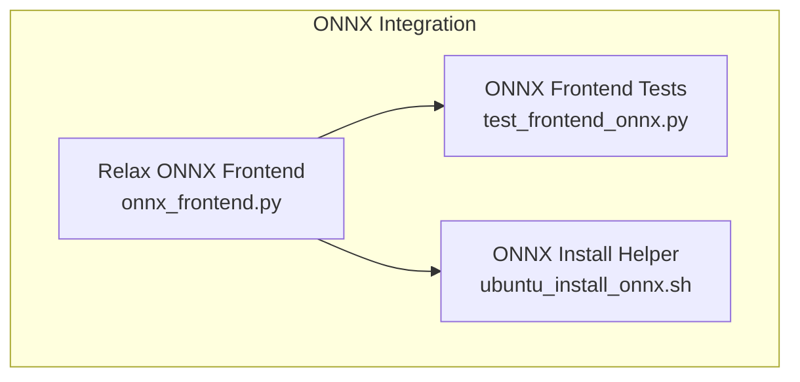
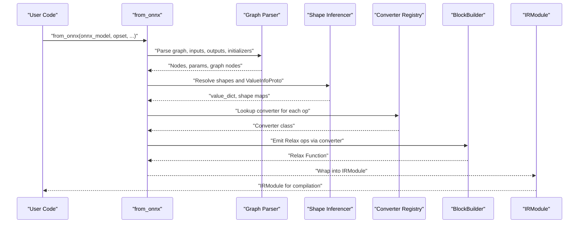
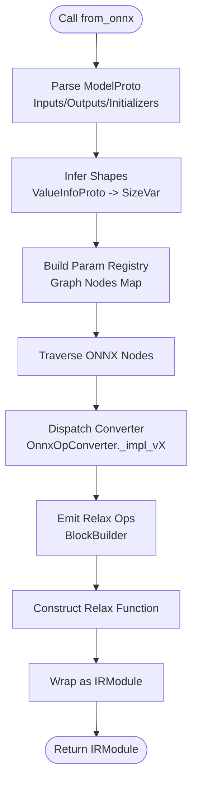
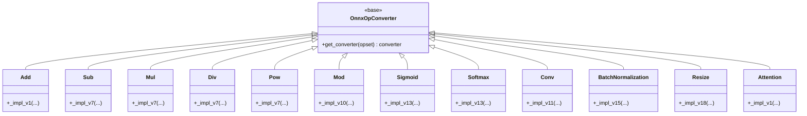
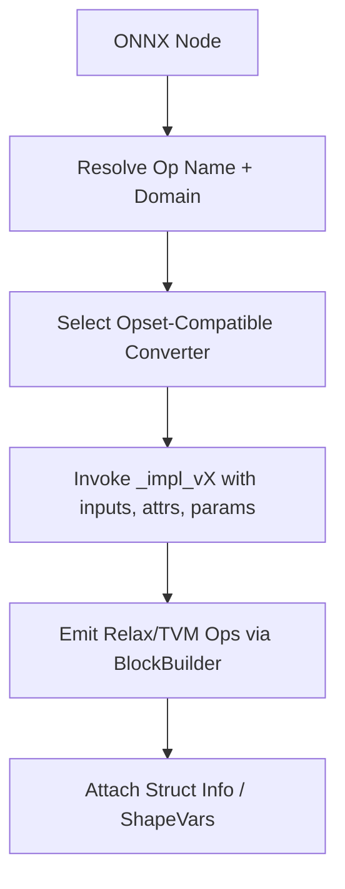
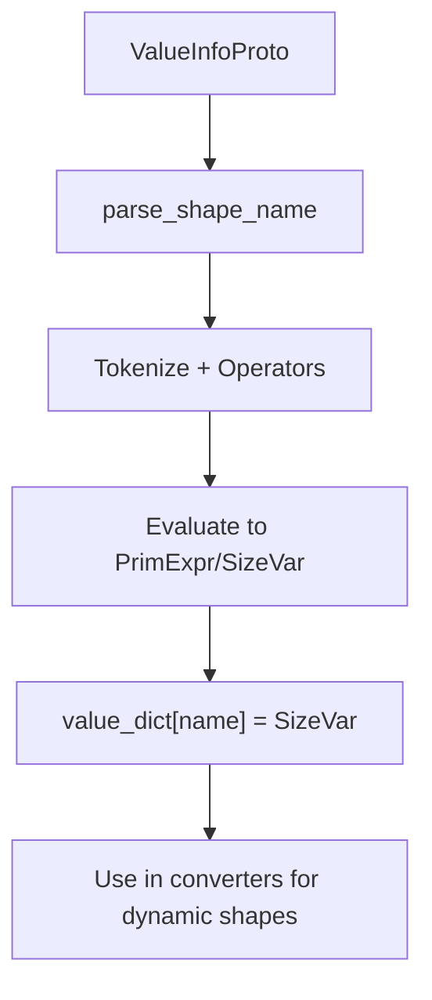
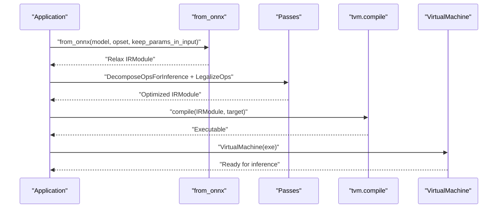
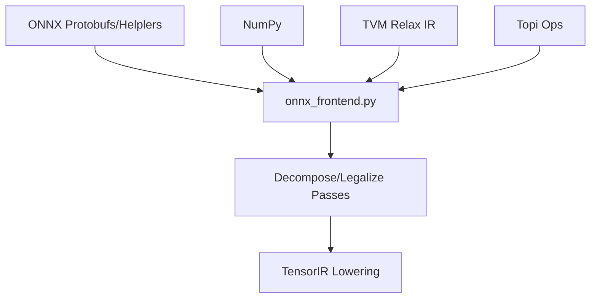

# ONNX Integration

<cite>
**Referenced Files in This Document**
- [onnx_frontend.py](file://python/tvm/relax/frontend/onnx/onnx_frontend.py)
- [test_frontend_onnx.py](file://tests/python/relax/test_frontend_onnx.py)
- [ubuntu_install_onnx.sh](file://docker/install/ubuntu_install_onnx.sh)
</cite>

## Table of Contents
1. [Introduction](#introduction)
2. [Project Structure](#project-structure)
3. [Core Components](#core-components)
4. [Architecture Overview](#architecture-overview)
5. [Detailed Component Analysis](#detailed-component-analysis)
6. [Dependency Analysis](#dependency-analysis)
7. [Performance Considerations](#performance-considerations)
8. [Troubleshooting Guide](#troubleshooting-guide)
9. [Conclusion](#conclusion)
10. [Appendices](#appendices)

## Introduction
This document explains how TVM integrates with the ONNX (Open Neural Network Exchange) framework through the Relax frontend. It focuses on the from_onnx workflow for importing ONNX models, operator coverage and conversion maps, frontend architecture, custom operator development, support for ONNX extensions, model validation, shape inference, and dynamic dimension handling. Practical examples demonstrate importing pre-trained models, handling unsupported operators, and optimizing ONNX workflows. Common conversion issues, performance considerations, and troubleshooting strategies are also covered.

## Project Structure
The ONNX integration lives in the Relax frontend and is backed by comprehensive tests and installation guidance:
- Frontend implementation: python/tvm/relax/frontend/onnx/onnx_frontend.py
- Tests and examples: tests/python/relax/test_frontend_onnx.py
- ONNX installation helper: docker/install/ubuntu_install_onnx.sh

**Diagram sources**
- [onnx_frontend.py:1-50](file://python/tvm/relax/frontend/onnx/onnx_frontend.py#L1-L50)
- [test_frontend_onnx.py:1-40](file://tests/python/relax/test_frontend_onnx.py#L1-L40)
- [ubuntu_install_onnx.sh:1-50](file://docker/install/ubuntu_install_onnx.sh#L1-L50)

**Section sources**
- [onnx_frontend.py:1-50](file://python/tvm/relax/frontend/onnx/onnx_frontend.py#L1-L50)
- [test_frontend_onnx.py:1-40](file://tests/python/relax/test_frontend_onnx.py#L1-L40)
- [ubuntu_install_onnx.sh:1-50](file://docker/install/ubuntu_install_onnx.sh#L1-L50)

## Core Components
- from_onnx entry point: The primary entry point to import ONNX models into Relax IR. It parses ONNX graphs, resolves shapes, maps operators to Relax equivalents, and returns an IRModule ready for compilation.
- Operator converter registry: A mapping from ONNX operator names to converter classes implementing _impl_vX methods for specific opsets.
- Converter base classes: OnnxOpConverter and specialized helpers (BinaryBase, MultiInputBase, Pool) provide shared logic and version dispatch.
- Shape inference and dynamic dimensions: Utilities to parse ValueInfoProto shapes, normalize axes, and handle symbolic dimensions using SizeVar and PrimExpr.
- Validation and error reporting: Type conversion helpers, attribute validation, and explicit error messages for unsupported features.

Key responsibilities:
- Parse ONNX protobufs and extract inputs, outputs, initializers, and attributes.
- Resolve shapes and dtypes, including dynamic shapes and symbolic variables.
- Map ONNX operators to Relax ops, with opset-aware version selection.
- Support ONNX extensions via domain-specific converters (e.g., com.microsoft).

**Section sources**
- [onnx_frontend.py:20-40](file://python/tvm/relax/frontend/onnx/onnx_frontend.py#L20-L40)
- [onnx_frontend.py:284-313](file://python/tvm/relax/frontend/onnx/onnx_frontend.py#L284-L313)

## Architecture Overview
The ONNX frontend converts ONNX graphs into Relax IR using a structured pipeline:
- Graph parsing: Extract nodes, inputs, outputs, and initializers.
- Shape inference: Build dictionaries of ValueInfoProto to SizeVar mappings and compute derived shapes.
- Operator conversion: Dispatch to OnnxOpConverter subclasses based on op name and opset.
- IR emission: Use Relax BlockBuilder to emit calls to Relax/TVM ops.
- Post-processing: Legalization and decomposition passes prepare the graph for lowering to TensorIR.

**Diagram sources**
- [onnx_frontend.py:191-227](file://python/tvm/relax/frontend/onnx/onnx_frontend.py#L191-L227)
- [onnx_frontend.py:284-313](file://python/tvm/relax/frontend/onnx/onnx_frontend.py#L284-L313)

## Detailed Component Analysis

### from_onnx Workflow
- Input: ONNX ModelProto, optional opset and flags (e.g., keep_params_in_input).
- Processing:
  - Normalize opset and IR version.
  - Parse ValueInfoProto to extract shapes and dtypes.
  - Build parameter registry and graph node map.
  - Traverse ONNX graph nodes and convert each to Relax via registered converters.
  - Emit Relax calls and construct a function with parameters and outputs.
- Output: IRModule containing the imported Relax function.

**Diagram sources**
- [onnx_frontend.py:191-227](file://python/tvm/relax/frontend/onnx/onnx_frontend.py#L191-L227)
- [onnx_frontend.py:284-313](file://python/tvm/relax/frontend/onnx/onnx_frontend.py#L284-L313)

**Section sources**
- [onnx_frontend.py:191-227](file://python/tvm/relax/frontend/onnx/onnx_frontend.py#L191-L227)
- [onnx_frontend.py:284-313](file://python/tvm/relax/frontend/onnx/onnx_frontend.py#L284-L313)

### Operator Coverage and Conversion Maps
The frontend includes converters for a broad set of ONNX operators. Representative categories:
- Arithmetic: Add, Sub, Mul, Div, Pow, Mod, FloorMod, logical ops (And, Or, Xor), comparisons (Less, Greater, Equal, etc.), bitwise ops (BitwiseAnd, BitwiseOr, BitwiseXor, BitwiseNot, BitShift).
- Activations: Sigmoid, Softmax, LogSoftmax, Hardmax, Relu, Elu, Selu, Mish, PRelu, ThresholdedRelu, LeakyRelu, Gelu variants, FastGelu, BiasGelu.
- Linear algebra: MatMul, MatMulInteger16, Gemm.
- Convolutions: Conv, ConvTranspose (1D/2D/3D), pooling (MaxPool, AveragePool, LpPool, Global variants), LRN.
- Normalization: BatchNormalization, InstanceNormalization, LayerNormalization, MeanVarianceNormalization.
- Control flow: Shape, Rank, Size, Where, ArgMax/ArgMin/TopK.
- Reshaping: Reshape, Squeeze, Unsqueeze, Concat, Split, Transpose, Pad, Expand, Tile, Slice, Flatten.
- Vision/image: Resize, AffineGrid, RoiAlign, MaxRoiPool, Einsum.
- Extensions: Attention (Microsoft), SkipLayerNormalization, EmbedLayerNormalization.

Version dispatch:
- Each converter class selects the appropriate implementation based on the model’s opset using OnnxOpConverter.get_converter.

**Diagram sources**
- [onnx_frontend.py:472-542](file://python/tvm/relax/frontend/onnx/onnx_frontend.py#L472-L542)
- [onnx_frontend.py:716-722](file://python/tvm/relax/frontend/onnx/onnx_frontend.py#L716-L722)
- [onnx_frontend.py:1068-1098](file://python/tvm/relax/frontend/onnx/onnx_frontend.py#L1068-L1098)
- [onnx_frontend.py:1421-1489](file://python/tvm/relax/frontend/onnx/onnx_frontend.py#L1421-L1489)
- [onnx_frontend.py:3126-3151](file://python/tvm/relax/frontend/onnx/onnx_frontend.py#L3126-L3151)
- [onnx_frontend.py:2808-2938](file://python/tvm/relax/frontend/onnx/onnx_frontend.py#L2808-L2938)
- [onnx_frontend.py:2570-2698](file://python/tvm/relax/frontend/onnx/onnx_frontend.py#L2570-L2698)

**Section sources**
- [onnx_frontend.py:472-542](file://python/tvm/relax/frontend/onnx/onnx_frontend.py#L472-L542)
- [onnx_frontend.py:716-722](file://python/tvm/relax/frontend/onnx/onnx_frontend.py#L716-L722)
- [onnx_frontend.py:1068-1098](file://python/tvm/relax/frontend/onnx/onnx_frontend.py#L1068-L1098)
- [onnx_frontend.py:1421-1489](file://python/tvm/relax/frontend/onnx/onnx_frontend.py#L1421-L1489)
- [onnx_frontend.py:3126-3151](file://python/tvm/relax/frontend/onnx/onnx_frontend.py#L3126-L3151)
- [onnx_frontend.py:2808-2938](file://python/tvm/relax/frontend/onnx/onnx_frontend.py#L2808-L2938)
- [onnx_frontend.py:2570-2698](file://python/tvm/relax/frontend/onnx/onnx_frontend.py#L2570-L2698)

### Frontend Architecture and Converter Registry
- Converter lookup: For each ONNX node, the frontend determines the op name and domain, then selects the highest implemented version ≤ model opset.
- Converter base class: Provides shared utilities (e.g., get_constant, axis normalization, shape tensor helpers).
- Specialized bases: BinaryBase, MultiInputBase, Pool simplify common patterns.

**Diagram sources**
- [onnx_frontend.py:284-313](file://python/tvm/relax/frontend/onnx/onnx_frontend.py#L284-L313)
- [onnx_frontend.py:2017-2076](file://python/tvm/relax/frontend/onnx/onnx_frontend.py#L2017-L2076)

**Section sources**
- [onnx_frontend.py:284-313](file://python/tvm/relax/frontend/onnx/onnx_frontend.py#L284-L313)
- [onnx_frontend.py:2017-2076](file://python/tvm/relax/frontend/onnx/onnx_frontend.py#L2017-L2076)

### Custom Operator Development
To add a new ONNX operator:
- Create a subclass of OnnxOpConverter with one or more _impl_vX methods for supported opsets.
- Implement the conversion logic using Relax ops and BlockBuilder emits.
- Register the converter by ensuring the class name matches the ONNX op name; the registry automatically maps op names to converters.

Guidelines:
- Use get_constant to resolve constant inputs when possible.
- Normalize axes and handle negative indices consistently.
- Prefer emitting Relax ops; use TE wrappers only when necessary.
- Validate attributes and raise explicit errors for unsupported configurations.

**Section sources**
- [onnx_frontend.py:284-313](file://python/tvm/relax/frontend/onnx/onnx_frontend.py#L284-L313)

### Support for ONNX Extensions
- Domain-specific converters: The frontend recognizes non-core domains (e.g., com.microsoft) and routes accordingly (e.g., MatMulInteger16, Attention, SkipLayerNormalization, EmbedLayerNormalization).
- Example: MatMulInteger16 domain “com.microsoft” with opset 1 is handled by a dedicated converter.

**Section sources**
- [onnx_frontend.py:444-530](file://python/tvm/relax/frontend/onnx/onnx_frontend.py#L444-L530)
- [test_frontend_onnx.py:457-507](file://tests/python/relax/test_frontend_onnx.py#L457-L507)

### Model Validation, Shape Inference, and Dynamic Dimensions
- Shape parsing: ValueInfoProto dimensions are parsed into either concrete ints or SizeVar, enabling symbolic shape handling.
- Expression evaluation: parse_shape_name supports arithmetic expressions in shape names.
- Dynamic shapes: Many converters support dynamic inputs and emit dynamic ops when necessary (e.g., dynamic strided slice, dynamic tile).
- Validation: Explicit checks for axis ranges, broadcasting rules, and unsupported modes raise informative errors.

**Diagram sources**
- [onnx_frontend.py:140-189](file://python/tvm/relax/frontend/onnx/onnx_frontend.py#L140-L189)
- [onnx_frontend.py:2106-2176](file://python/tvm/relax/frontend/onnx/onnx_frontend.py#L2106-L2176)

**Section sources**
- [onnx_frontend.py:140-189](file://python/tvm/relax/frontend/onnx/onnx_frontend.py#L140-L189)
- [onnx_frontend.py:2106-2176](file://python/tvm/relax/frontend/onnx/onnx_frontend.py#L2106-L2176)

### Practical Examples and Workflows

#### Importing Pre-trained ONNX Models
- Typical workflow:
  - Load ONNX model (ensure ONNX Python package is installed).
  - Call from_onnx with desired opset and flags.
  - Apply passes (DecomposeOpsForInference, LegalizeOps).
  - Detach parameters and compile for target runtime.

**Diagram sources**
- [test_frontend_onnx.py:129-151](file://tests/python/relax/test_frontend_onnx.py#L129-L151)
- [test_frontend_onnx.py:200-233](file://tests/python/relax/test_frontend_onnx.py#L200-L233)

**Section sources**
- [test_frontend_onnx.py:129-151](file://tests/python/relax/test_frontend_onnx.py#L129-L151)
- [test_frontend_onnx.py:200-233](file://tests/python/relax/test_frontend_onnx.py#L200-L233)

#### Handling Unsupported Operators
- Strategy:
  - Identify missing converter or unsupported attribute.
  - Implement a custom converter or adjust model to supported subset.
  - Use domain-specific converters for Microsoft extensions when applicable.

Evidence from tests:
- MatMulInteger16 requires a specific domain and opset; attempting unsupported dtypes raises explicit errors.
- Some ops (e.g., IsInf, IsNaN) are intentionally skipped in tests due to LegalizeOps limitations.

**Section sources**
- [test_frontend_onnx.py:457-529](file://tests/python/relax/test_frontend_onnx.py#L457-L529)
- [test_frontend_onnx.py:693-694](file://tests/python/relax/test_frontend_onnx.py#L693-L694)

#### Optimizing ONNX Workflows
- Recommended passes:
  - DecomposeOpsForInference: Simplifies composite ops for inference.
  - LegalizeOps: Converts remaining ops to TensorIR-compatible forms.
- Compilation:
  - Use tvm.compile with appropriate target and PassContext opt level.
  - VirtualMachine for execution.

**Section sources**
- [test_frontend_onnx.py:130-134](file://tests/python/relax/test_frontend_onnx.py#L130-L134)
- [test_frontend_onnx.py:216-218](file://tests/python/relax/test_frontend_onnx.py#L216-L218)

## Dependency Analysis
- External dependencies:
  - ONNX protobufs and helper APIs (tensor_dtype_to_np_dtype, to_array).
  - NumPy for array conversions and computations.
- Internal dependencies:
  - TVM Relax IR, BlockBuilder, and TensorIR ops.
  - Topi ops for certain image/vision transformations.
  - Autopad utilities for convolution padding.

**Diagram sources**
- [onnx_frontend.py:48-76](file://python/tvm/relax/frontend/onnx/onnx_frontend.py#L48-L76)
- [onnx_frontend.py:51-58](file://python/tvm/relax/frontend/onnx/onnx_frontend.py#L51-L58)

**Section sources**
- [onnx_frontend.py:48-76](file://python/tvm/relax/frontend/onnx/onnx_frontend.py#L48-L76)
- [onnx_frontend.py:51-58](file://python/tvm/relax/frontend/onnx/onnx_frontend.py#L51-L58)

## Performance Considerations
- Prefer static shapes when possible to enable aggressive optimizations; dynamic shapes may retain dynamic ops.
- Use LegalizeOps and DecomposeOpsForInference to reduce composite ops and improve kernel coverage.
- For image/vision ops, leverage optimized Topi implementations (e.g., resize, roi_align).
- Avoid unnecessary conversions between arrays and tensors; use Relax constants and shape expressions where feasible.

[No sources needed since this section provides general guidance]

## Troubleshooting Guide
Common issues and resolutions:
- Missing ONNX package: Ensure ONNX Python bindings are installed before importing.
- Unsupported opset or attributes: Implement or adapt a converter; adjust model to supported opset/domain.
- Dynamic shape mismatches: Verify axis normalization and broadcasting rules; use explicit passes to legalize dynamic ops.
- Extension ops not recognized: Confirm domain and opset; use domain-specific converters.

Installation hint:
- The repository includes an ONNX installation helper script for Ubuntu environments.

**Section sources**
- [onnx_frontend.py:68-76](file://python/tvm/relax/frontend/onnx/onnx_frontend.py#L68-L76)
- [ubuntu_install_onnx.sh:1-50](file://docker/install/ubuntu_install_onnx.sh#L1-L50)

## Conclusion
TVM’s ONNX integration through the Relax frontend provides a robust pathway to import and optimize ONNX models. The from_onnx workflow, extensive operator coverage, opset-aware dispatch, and support for dynamic shapes and extensions enable broad model compatibility. By following recommended passes and leveraging domain-specific converters, developers can efficiently deploy ONNX models across diverse hardware targets.

[No sources needed since this section summarizes without analyzing specific files]

## Appendices

### Appendix A: Representative Operator Implementations
- Arithmetic and logical: BinaryBase-based converters for elementwise ops.
- Activations: Direct mapping to Relax/TVM activation ops.
- Linear algebra: MatMul/Gemm with optional transposes and broadcasts.
- Convolutions and pooling: Layout-aware converters with autopad support.
- Normalization: BatchNormalization, InstanceNormalization, LayerNormalization.
- Image/vision: Resize, AffineGrid, RoiAlign, MaxRoiPool, Einsum.
- Extensions: Attention, MatMulInteger16, SkipLayerNormalization, EmbedLayerNormalization.

**Section sources**
- [onnx_frontend.py:472-542](file://python/tvm/relax/frontend/onnx/onnx_frontend.py#L472-L542)
- [onnx_frontend.py:1068-1098](file://python/tvm/relax/frontend/onnx/onnx_frontend.py#L1068-L1098)
- [onnx_frontend.py:1421-1489](file://python/tvm/relax/frontend/onnx/onnx_frontend.py#L1421-L1489)
- [onnx_frontend.py:3126-3151](file://python/tvm/relax/frontend/onnx/onnx_frontend.py#L3126-L3151)
- [onnx_frontend.py:2808-2938](file://python/tvm/relax/frontend/onnx/onnx_frontend.py#L2808-L2938)
- [onnx_frontend.py:2570-2698](file://python/tvm/relax/frontend/onnx/onnx_frontend.py#L2570-L2698)