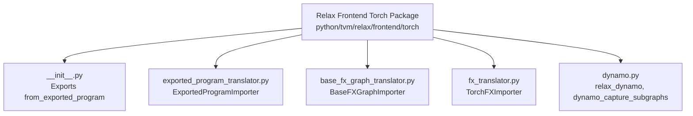
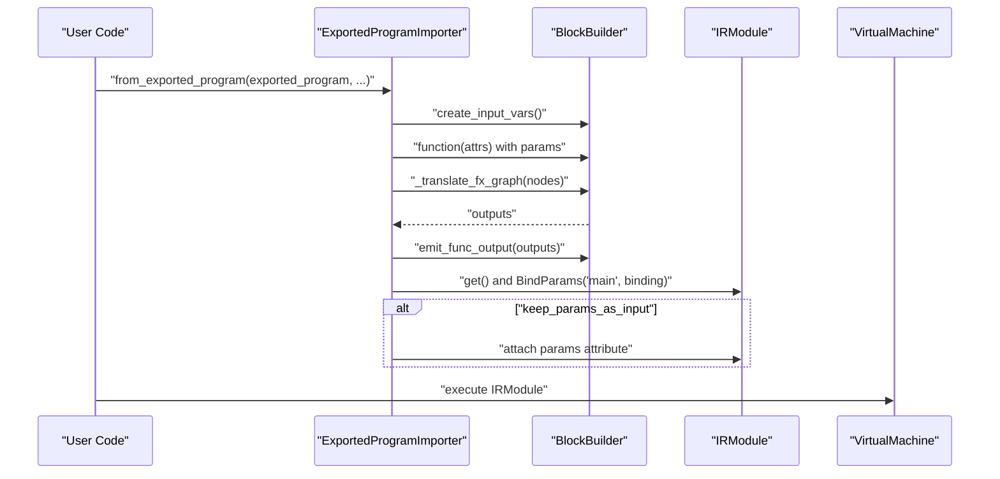
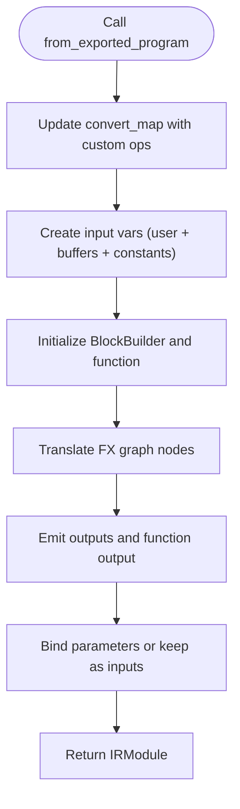
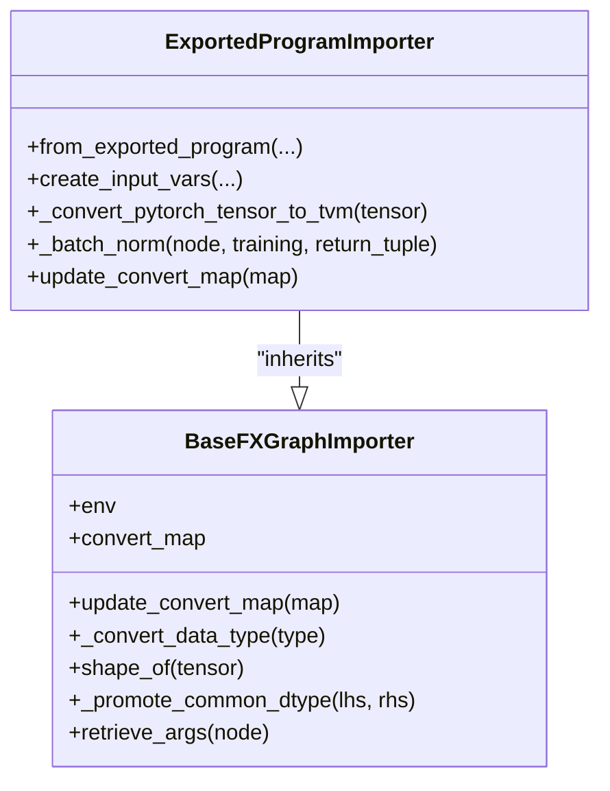
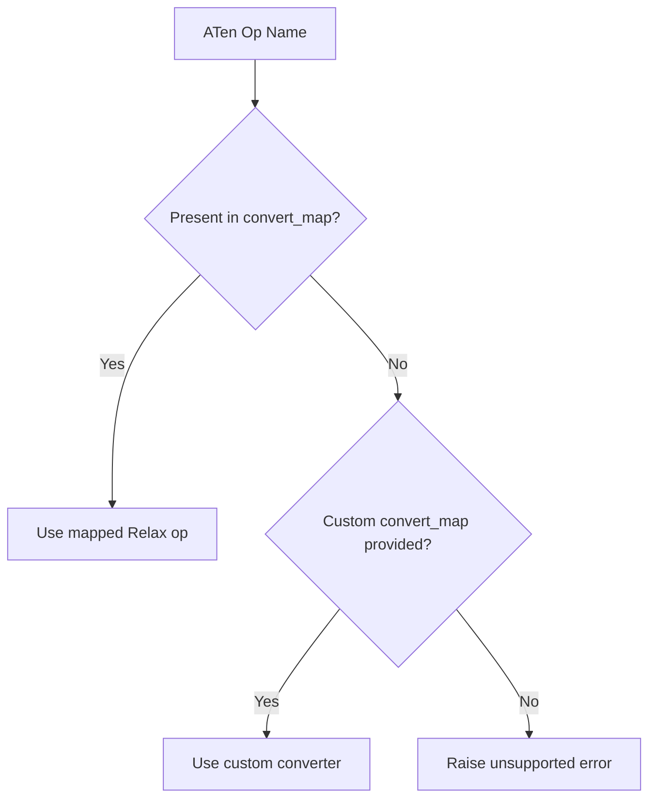
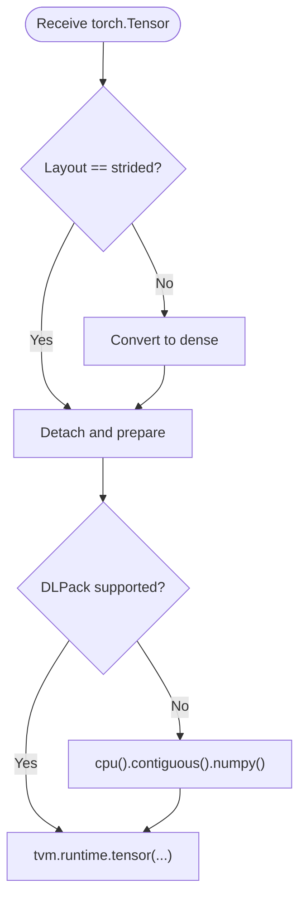
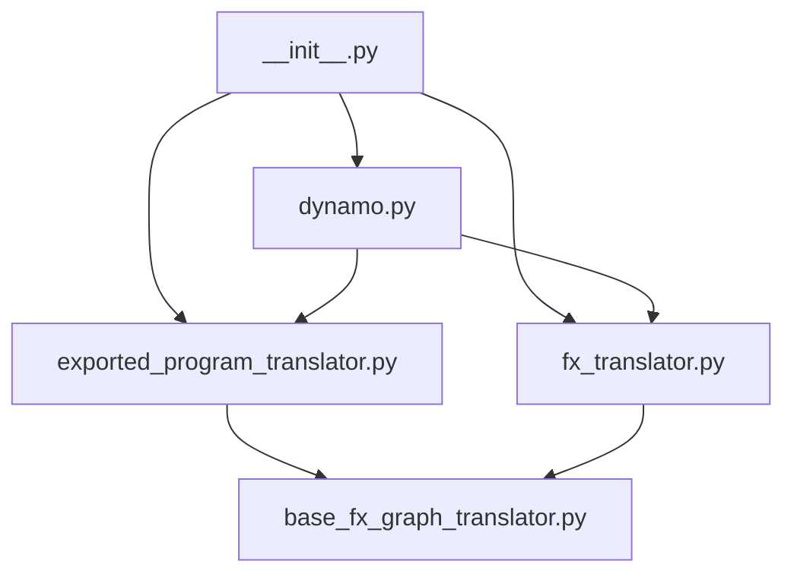

# PyTorch Integration

<cite>
**Referenced Files in This Document**
- [__init__.py](file://python/tvm/relax/frontend/torch/__init__.py)
- [exported_program_translator.py](file://python/tvm/relax/frontend/torch/exported_program_translator.py)
- [base_fx_graph_translator.py](file://python/tvm/relax/frontend/torch/base_fx_graph_translator.py)
- [fx_translator.py](file://python/tvm/relax/frontend/torch/fx_translator.py)
- [dynamo.py](file://python/tvm/relax/frontend/torch/dynamo.py)
- [e2e_opt_model.py](file://docs/how_to/tutorials/e2e_opt_model.py)
- [import_model.py](file://docs/how_to/tutorials/import_model.py)
- [ir_module.py](file://docs/get_started/tutorials/ir_module.py)
- [cross_compilation_and_rpc.py](file://docs/how_to/tutorials/cross_compilation_and_rpc.py)
- [export_and_load_executable.py](file://docs/how_to/tutorials/export_and_load_executable.py)
- [test_frontend_from_exported_program.py](file://tests/python/relax/test_frontend_from_exported_program.py)
</cite>

## Table of Contents
1. [Introduction](#introduction)
2. [Project Structure](#project-structure)
3. [Core Components](#core-components)
4. [Architecture Overview](#architecture-overview)
5. [Detailed Component Analysis](#detailed-component-analysis)
6. [Dependency Analysis](#dependency-analysis)
7. [Performance Considerations](#performance-considerations)
8. [Troubleshooting Guide](#troubleshooting-guide)
9. [Conclusion](#conclusion)
10. [Appendices](#appendices)

## Introduction
This document explains how TVM integrates with the PyTorch ecosystem, focusing on the from_exported_program workflow for importing TorchScript models produced by torch.export. It covers the pytorch_frontend module architecture, operator mapping, custom operator development, JIT compilation via Dynamo, and memory management for PyTorch tensors. Practical examples demonstrate importing pre-trained models, handling dynamic shapes, and optimizing models for deployment. Common conversion issues, performance optimization techniques, and troubleshooting strategies are included.

## Project Structure
The PyTorch integration resides under the Relax frontend for PyTorch. The primary entry points and translators are organized as follows:
- Frontend package exports: from .exported_program_translator import from_exported_program
- Core translator: ExportedProgramImporter converts torch.export.ExportedProgram to a Relax IRModule
- Base importer: BaseFXGraphImporter provides shared utilities and conversion map infrastructure
- FX translator: TorchFXImporter supports FX graph translation paths
- Dynamo backend: relax_dynamo and dynamo_capture_subgraphs integrate with torch.compile



**Diagram sources**
- [__init__.py:18-25](file://python/tvm/relax/frontend/torch/__init__.py#L18-L25)
- [exported_program_translator.py:37-40](file://python/tvm/relax/frontend/torch/exported_program_translator.py#L37-L40)
- [base_fx_graph_translator.py:32-48](file://python/tvm/relax/frontend/torch/base_fx_graph_translator.py#L32-L48)
- [fx_translator.py:31-43](file://python/tvm/relax/frontend/torch/fx_translator.py#L31-L43)
- [dynamo.py:38-50](file://python/tvm/relax/frontend/torch/dynamo.py#L38-L50)

**Section sources**
- [__init__.py:18-25](file://python/tvm/relax/frontend/torch/__init__.py#L18-L25)

## Core Components
- ExportedProgramImporter: Converts torch.export.ExportedProgram to a Relax IRModule, manages input variables, binds parameters, and applies optional decomposition and custom conversions.
- BaseFXGraphImporter: Provides shared utilities (dtype conversion, shape handling, argument retrieval), maintains a conversion map, and enforces supported function types.
- TorchFXImporter: Handles FX graph translation paths and module-level operators.
- relax_dynamo and dynamo_capture_subgraphs: Integrate with torch.compile to capture subgraphs and produce executable backends.

Key capabilities:
- Importing ExportedProgram via from_exported_program
- Operator mapping and custom operator registration
- Dynamic shape support through symbolic variables
- Parameter handling (keep as input vs bind)
- Memory management for PyTorch tensors (DLPack and fallback paths)

**Section sources**
- [exported_program_translator.py:1935-2042](file://python/tvm/relax/frontend/torch/exported_program_translator.py#L1935-L2042)
- [base_fx_graph_translator.py:42-61](file://python/tvm/relax/frontend/torch/base_fx_graph_translator.py#L42-L61)
- [fx_translator.py:31-43](file://python/tvm/relax/frontend/torch/fx_translator.py#L31-L43)
- [dynamo.py:38-142](file://python/tvm/relax/frontend/torch/dynamo.py#L38-L142)

## Architecture Overview
The PyTorch integration pipeline transforms a PyTorch ExportedProgram into a TVM IRModule, enabling downstream optimization and execution.



**Diagram sources**
- [exported_program_translator.py:1935-2042](file://python/tvm/relax/frontend/torch/exported_program_translator.py#L1935-L2042)
- [dynamo.py:120-140](file://python/tvm/relax/frontend/torch/dynamo.py#L120-L140)

## Detailed Component Analysis

### from_exported_program Workflow
The from_exported_program function orchestrates the conversion of a torch.export.ExportedProgram into a Relax IRModule. It:
- Updates the conversion map with custom ops if provided
- Creates input variables (user inputs and parameters/buffers/constants)
- Initializes a BlockBuilder and function with attributes for dynamic shapes
- Translates the FX graph nodes and emits outputs
- Binds parameters to the function and optionally keeps them as inputs
- Returns the constructed IRModule



**Diagram sources**
- [exported_program_translator.py:1935-2042](file://python/tvm/relax/frontend/torch/exported_program_translator.py#L1935-L2042)

**Section sources**
- [exported_program_translator.py:1935-2042](file://python/tvm/relax/frontend/torch/exported_program_translator.py#L1935-L2042)

### ExportedProgramImporter Class
Responsibilities:
- Convert PyTorch tensors to TVM tensors (DLPack preferred, fallback to numpy)
- Map PyTorch operators to Relax equivalents
- Handle dynamic shapes and range constraints
- Manage batch normalization variants and training modes
- Support custom operator conversion via a conversion map



**Diagram sources**
- [exported_program_translator.py:37-69](file://python/tvm/relax/frontend/torch/exported_program_translator.py#L37-L69)
- [base_fx_graph_translator.py:32-61](file://python/tvm/relax/frontend/torch/base_fx_graph_translator.py#L32-L61)

**Section sources**
- [exported_program_translator.py:40-69](file://python/tvm/relax/frontend/torch/exported_program_translator.py#L40-L69)
- [exported_program_translator.py:127-182](file://python/tvm/relax/frontend/torch/exported_program_translator.py#L127-L182)
- [base_fx_graph_translator.py:62-102](file://python/tvm/relax/frontend/torch/base_fx_graph_translator.py#L62-L102)
- [base_fx_graph_translator.py:104-151](file://python/tvm/relax/frontend/torch/base_fx_graph_translator.py#L104-L151)

### Operator Mapping and Custom Operators
- Built-in mapping: The importer maintains a conversion map linking PyTorch ATen operator names to Relax ops.
- Custom operators: Users can register custom converters via custom_convert_map keyed by ATen operator names (e.g., "sigmoid.default").
- Special handling: Some ops require functional-style dispatch (e.g., F.relu) or module-level parameters (e.g., Softmax).



**Diagram sources**
- [exported_program_translator.py:1945-1950](file://python/tvm/relax/frontend/torch/exported_program_translator.py#L1945-L1950)
- [base_fx_graph_translator.py:188-196](file://python/tvm/relax/frontend/torch/base_fx_graph_translator.py#L188-L196)

**Section sources**
- [import_model.py:147-163](file://docs/how_to/tutorials/import_model.py#L147-L163)
- [base_fx_graph_translator.py:51-60](file://python/tvm/relax/frontend/torch/base_fx_graph_translator.py#L51-L60)

### JIT Compilation with Dynamo
The Dynamo backend integrates torch.compile with TVM:
- relax_dynamo produces a backend callable that translates FX graphs to Relax, optimizes, builds, and executes via VirtualMachine
- dynamo_capture_subgraphs captures subgraphs during compilation into separate IRModule functions

```mermaid
sequenceDiagram
participant Model as "PyTorch Model"
participant Dyn as "torch.compile"
participant Cap as "dynamo_capture_subgraphs"
participant FX as "from_fx"
participant Opt as "Optimization Pipeline"
participant VM as "VirtualMachine"
Model->>Dyn : "compile(backend=relax_dynamo/pipeline)"
Dyn->>Cap : "capture subgraphs"
Cap->>FX : "from_fx(graph_module, input_info)"
FX-->>Cap : "IRModule"
Cap->>Opt : "apply pipeline"
Opt-->>VM : "executable"
VM-->>Model : "callable wrapper"
```

**Diagram sources**
- [dynamo.py:145-194](file://python/tvm/relax/frontend/torch/dynamo.py#L145-L194)
- [dynamo.py:38-142](file://python/tvm/relax/frontend/torch/dynamo.py#L38-L142)

**Section sources**
- [dynamo.py:38-142](file://python/tvm/relax/frontend/torch/dynamo.py#L38-L142)
- [dynamo.py:145-194](file://python/tvm/relax/frontend/torch/dynamo.py#L145-L194)

### Memory Management for PyTorch Tensors
- Prefer DLPack conversion for zero-copy transfer when possible
- Fallback to numpy conversion for unsupported layouts or devices
- Handle sparse tensors by converting to dense before conversion
- Device-aware execution paths (CPU/GPU) and contiguous input preparation



**Diagram sources**
- [exported_program_translator.py:40-69](file://python/tvm/relax/frontend/torch/exported_program_translator.py#L40-L69)

**Section sources**
- [exported_program_translator.py:40-69](file://python/tvm/relax/frontend/torch/exported_program_translator.py#L40-L69)

### Practical Examples

- End-to-end optimization with from_exported_program
  - Steps: torch.export.export → from_exported_program → detach_params → relax frontend → build
  - Reference: [e2e_opt_model.py:64-87](file://docs/how_to/tutorials/e2e_opt_model.py#L64-L87)

- Importing models and handling dynamic shapes
  - Use from_exported_program with keep_params_as_input and dynamic shapes
  - Reference: [import_model.py:82-99](file://docs/how_to/tutorials/import_model.py#L82-L99), [import_model.py:152-167](file://docs/how_to/tutorials/import_model.py#L152-L167)

- Cross-compilation and RPC
  - Replace from_onnx with from_exported_program for PyTorch models
  - Reference: [cross_compilation_and_rpc.py:284-306](file://docs/how_to/tutorials/cross_compilation_and_rpc.py#L284-L306), [cross_compilation_and_rpc.py:339-341](file://docs/how_to/tutorials/cross_compilation_and_rpc.py#L339-L341)

- Exporting and loading executables
  - Use from_exported_program followed by build and load
  - Reference: [export_and_load_executable.py:66-99](file://docs/how_to/tutorials/export_and_load_executable.py#L66-L99), [export_and_load_executable.py:210-210](file://docs/how_to/tutorials/export_and_load_executable.py#L210-L210)

**Section sources**
- [e2e_opt_model.py:64-87](file://docs/how_to/tutorials/e2e_opt_model.py#L64-L87)
- [import_model.py:82-99](file://docs/how_to/tutorials/import_model.py#L82-L99)
- [import_model.py:152-167](file://docs/how_to/tutorials/import_model.py#L152-L167)
- [cross_compilation_and_rpc.py:284-306](file://docs/how_to/tutorials/cross_compilation_and_rpc.py#L284-L306)
- [cross_compilation_and_rpc.py:339-341](file://docs/how_to/tutorials/cross_compilation_and_rpc.py#L339-L341)
- [export_and_load_executable.py:66-99](file://docs/how_to/tutorials/export_and_load_executable.py#L66-L99)
- [export_and_load_executable.py:210-210](file://docs/how_to/tutorials/export_and_load_executable.py#L210-L210)

## Dependency Analysis
The pytorch_frontend module composes multiple translators and utilities:
- __init__.py exports from_exported_program, from_fx, and Dynamo helpers
- exported_program_translator depends on base_fx_graph_translator and relax IR builders
- fx_translator extends base utilities for FX graphs
- dynamo.py depends on relax build and VirtualMachine



**Diagram sources**
- [__init__.py:21-24](file://python/tvm/relax/frontend/torch/__init__.py#L21-L24)
- [exported_program_translator.py:34-35](file://python/tvm/relax/frontend/torch/exported_program_translator.py#L34-L35)
- [fx_translator.py:28-29](file://python/tvm/relax/frontend/torch/fx_translator.py#L28-L29)
- [base_fx_graph_translator.py:28-29](file://python/tvm/relax/frontend/torch/base_fx_graph_translator.py#L28-L29)
- [dynamo.py:26-28](file://python/tvm/relax/frontend/torch/dynamo.py#L26-L28)

**Section sources**
- [__init__.py:21-24](file://python/tvm/relax/frontend/torch/__init__.py#L21-L24)
- [exported_program_translator.py:34-35](file://python/tvm/relax/frontend/torch/exported_program_translator.py#L34-L35)
- [fx_translator.py:28-29](file://python/tvm/relax/frontend/torch/fx_translator.py#L28-L29)
- [base_fx_graph_translator.py:28-29](file://python/tvm/relax/frontend/torch/base_fx_graph_translator.py#L28-L29)
- [dynamo.py:26-28](file://python/tvm/relax/frontend/torch/dynamo.py#L26-L28)

## Performance Considerations
- Prefer DLPack conversion for tensor transfers to minimize overhead
- Keep parameters bound to avoid redundant inputs when deploying
- Use dynamic shape support to avoid recompilation for varying sizes
- Apply the default optimization pipeline or a tailored pass pipeline via relax_dynamo
- Ensure inputs are contiguous and on the correct device to avoid extra copies

[No sources needed since this section provides general guidance]

## Troubleshooting Guide
Common issues and resolutions:
- Unsupported ATen operator: Register a custom converter via custom_convert_map using the exact ATen name reported by the error
  - Reference: [import_model.py:147-163](file://docs/how_to/tutorials/import_model.py#L147-L163)
- Sparse tensors: They are converted to dense automatically; verify correctness after conversion
  - Reference: [exported_program_translator.py:120-124](file://python/tvm/relax/frontend/torch/exported_program_translator.py#L120-L124)
- Dynamic shapes: Provide symbolic variables and ensure range constraints are set appropriately
  - Reference: [exported_program_translator.py:1965-1977](file://python/tvm/relax/frontend/torch/exported_program_translator.py#L1965-L1977)
- Parameter handling: Choose between keeping parameters as inputs or binding them based on deployment needs
  - Reference: [exported_program_translator.py:2020-2041](file://python/tvm/relax/frontend/torch/exported_program_translator.py#L2020-L2041)
- Gradient computation: For inference, use torch.no_grad; for training, ensure gradients are detached before conversion
  - Reference: [e2e_opt_model.py:82-84](file://docs/how_to/tutorials/e2e_opt_model.py#L82-L84)

**Section sources**
- [import_model.py:147-163](file://docs/how_to/tutorials/import_model.py#L147-L163)
- [exported_program_translator.py:120-124](file://python/tvm/relax/frontend/torch/exported_program_translator.py#L120-L124)
- [exported_program_translator.py:1965-1977](file://python/tvm/relax/frontend/torch/exported_program_translator.py#L1965-L1977)
- [exported_program_translator.py:2020-2041](file://python/tvm/relax/frontend/torch/exported_program_translator.py#L2020-L2041)
- [e2e_opt_model.py:82-84](file://docs/how_to/tutorials/e2e_opt_model.py#L82-L84)

## Conclusion
TVM’s PyTorch integration centers on the from_exported_program workflow, which leverages a robust translator architecture to convert ExportedProgram into a TVM IRModule. The system supports dynamic shapes, custom operators, and efficient memory management. With Dynamo integration, developers can compile and execute PyTorch models seamlessly within TVM’s optimization and deployment pipeline.

[No sources needed since this section summarizes without analyzing specific files]

## Appendices

### Example References
- End-to-end optimization: [e2e_opt_model.py:64-87](file://docs/how_to/tutorials/e2e_opt_model.py#L64-L87)
- Importing and dynamic shapes: [import_model.py:82-99](file://docs/how_to/tutorials/import_model.py#L82-L99), [import_model.py:152-167](file://docs/how_to/tutorials/import_model.py#L152-L167)
- Cross-compilation and RPC: [cross_compilation_and_rpc.py:284-306](file://docs/how_to/tutorials/cross_compilation_and_rpc.py#L284-L306), [cross_compilation_and_rpc.py:339-341](file://docs/how_to/tutorials/cross_compilation_and_rpc.py#L339-L341)
- Export and load executables: [export_and_load_executable.py:66-99](file://docs/how_to/tutorials/export_and_load_executable.py#L66-L99), [export_and_load_executable.py:210-210](file://docs/how_to/tutorials/export_and_load_executable.py#L210-L210)
- Getting started IRModule: [ir_module.py:45-77](file://docs/get_started/tutorials/ir_module.py#L45-L77)

**Section sources**
- [e2e_opt_model.py:64-87](file://docs/how_to/tutorials/e2e_opt_model.py#L64-L87)
- [import_model.py:82-99](file://docs/how_to/tutorials/import_model.py#L82-L99)
- [import_model.py:152-167](file://docs/how_to/tutorials/import_model.py#L152-L167)
- [cross_compilation_and_rpc.py:284-306](file://docs/how_to/tutorials/cross_compilation_and_rpc.py#L284-L306)
- [cross_compilation_and_rpc.py:339-341](file://docs/how_to/tutorials/cross_compilation_and_rpc.py#L339-L341)
- [export_and_load_executable.py:66-99](file://docs/how_to/tutorials/export_and_load_executable.py#L66-L99)
- [export_and_load_executable.py:210-210](file://docs/how_to/tutorials/export_and_load_executable.py#L210-L210)
- [ir_module.py:45-77](file://docs/get_started/tutorials/ir_module.py#L45-L77)