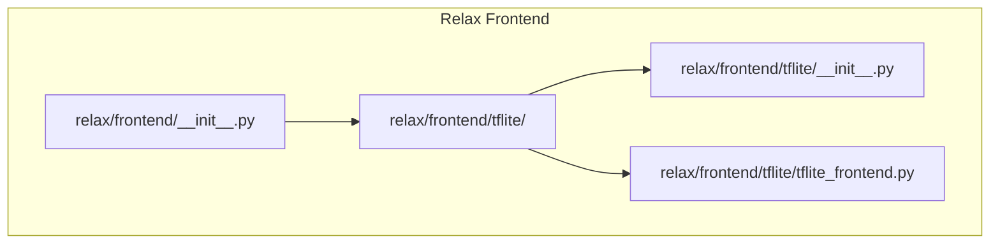
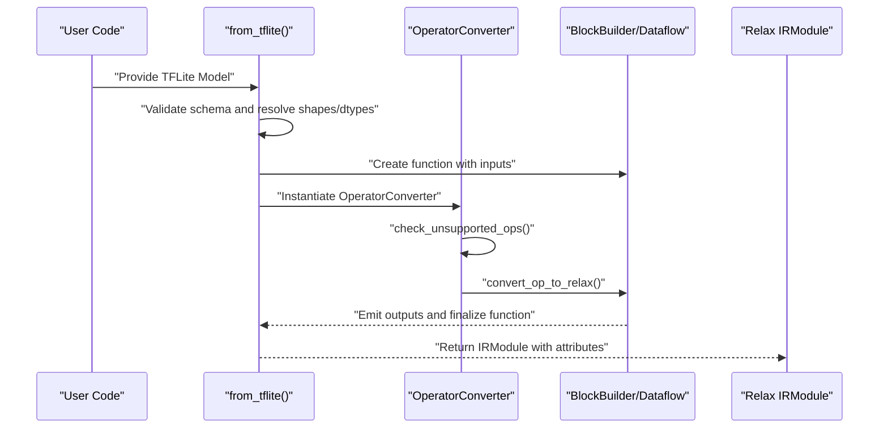
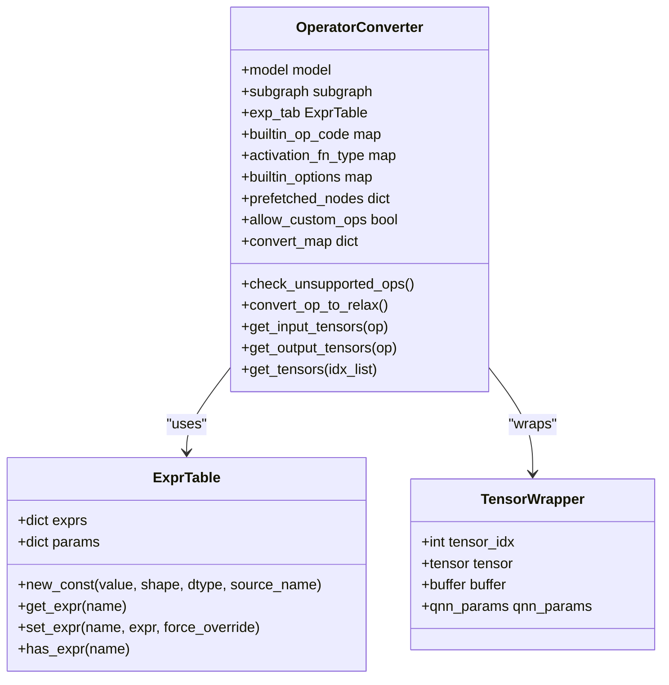
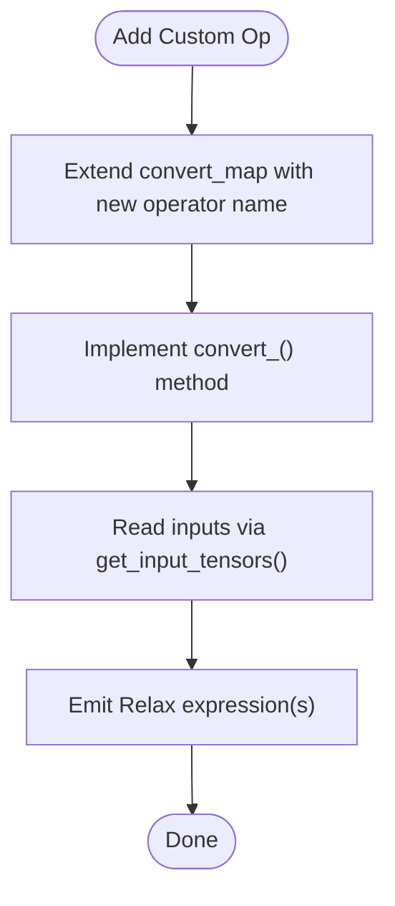
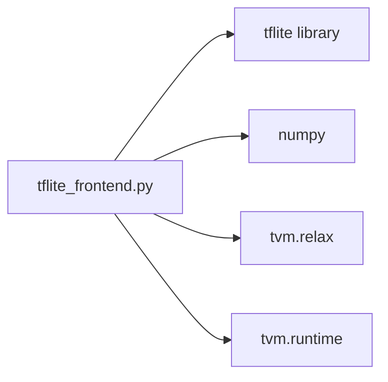

# TensorFlow Integration

<cite>
**Referenced Files in This Document**
- [tflite_frontend.py](file://python/tvm/relax/frontend/tflite/tflite_frontend.py)
- [tflite/__init__.py](file://python/tvm/relax/frontend/tflite/__init__.py)
- [frontend/__init__.py](file://python/tvm/relax/frontend/__init__.py)
- [import_model.py](file://docs/how_to/tutorials/import_model.py)
- [ubuntu_install_tensorflow.sh](file://docker/install/ubuntu_install_tensorflow.sh)
- [ubuntu_install_tensorflow_aarch64.sh](file://docker/install/ubuntu_install_tensorflow_aarch64.sh)
</cite>

## Table of Contents
1. [Introduction](#introduction)
2. [Project Structure](#project-structure)
3. [Core Components](#core-components)
4. [Architecture Overview](#architecture-overview)
5. [Detailed Component Analysis](#detailed-component-analysis)
6. [Dependency Analysis](#dependency-analysis)
7. [Performance Considerations](#performance-considerations)
8. [Troubleshooting Guide](#troubleshooting-guide)
9. [Conclusion](#conclusion)
10. [Appendices](#appendices)

## Introduction
This document explains how TVM integrates with TensorFlow via the Relax frontend, focusing on:
- The from_tensorflow workflow for importing frozen graphs and SavedModel formats
- TensorFlow Lite integration through the TFLite frontend, including model conversion and operator support
- TensorFlow 2.x integration patterns, Keras model import, and tf.function compatibility
- Frontend architecture, custom operation development, and performance optimization techniques
- Practical examples for importing various TensorFlow model types, handling variable scopes, and managing TensorFlow-specific features such as control flow and dynamic shapes

## Project Structure
The TensorFlow integration in TVM centers around the Relax frontend ecosystem. The TFLite frontend resides under the Relax frontend package and exposes a single entry function to convert TFLite models into Relax IR modules. The frontend package also exposes a common initialization entry for Relax frontends.

**Diagram sources**
- [frontend/__init__.py:1-22](file://python/tvm/relax/frontend/__init__.py#L1-L22)
- [tflite/__init__.py:1-21](file://python/tvm/relax/frontend/tflite/__init__.py#L1-L21)
- [tflite_frontend.py:1-40](file://python/tvm/relax/frontend/tflite/tflite_frontend.py#L1-L40)

**Section sources**
- [frontend/__init__.py:1-22](file://python/tvm/relax/frontend/__init__.py#L1-L22)
- [tflite/__init__.py:1-21](file://python/tvm/relax/frontend/tflite/__init__.py#L1-L21)
- [tflite_frontend.py:1-40](file://python/tvm/relax/frontend/tflite/tflite_frontend.py#L1-L40)

## Core Components
- TFLite frontend entrypoint: The from_tflite function converts a TFLite Model object into a Relax IRModule. It supports optional shape and dtype dictionaries, and accepts a pluggable OperatorConverter class for advanced customization.
- OperatorConverter: Maps TFLite operator codes to Relax operations, handles builtin and custom operators, and manages expression tables for inputs, constants, and intermediate tensors.
- Expression table: Maintains a mapping from tensor names to Relax expressions, enabling graph construction and parameter extraction.

Key responsibilities:
- Parse TFLite model metadata (subgraphs, inputs, outputs)
- Build Relax BlockBuilder functions with DataflowTuples
- Convert operators to Relax ops via OperatorConverter
- Attach function attributes (number of inputs, parameter tensors)

**Section sources**
- [tflite_frontend.py:4118-4277](file://python/tvm/relax/frontend/tflite/tflite_frontend.py#L4118-L4277)
- [tflite_frontend.py:118-200](file://python/tvm/relax/frontend/tflite/tflite_frontend.py#L118-L200)
- [tflite_frontend.py:53-87](file://python/tvm/relax/frontend/tflite/tflite_frontend.py#L53-L87)

## Architecture Overview
The TFLite import pipeline transforms a TFLite model into a compiled Relax IRModule. The flow includes:
- Input validation and schema compatibility checks
- Shape and dtype resolution
- Relax BlockBuilder function creation
- Operator conversion loop
- Output wrapping and function emission

**Diagram sources**
- [tflite_frontend.py:4118-4277](file://python/tvm/relax/frontend/tflite/tflite_frontend.py#L4118-L4277)
- [tflite_frontend.py:118-200](file://python/tvm/relax/frontend/tflite/tflite_frontend.py#L118-L200)

## Detailed Component Analysis

### TFLite Frontend Entry Point
- Purpose: Convert a TFLite Model into a Relax IRModule, optionally accepting shape and dtype hints and a custom OperatorConverter.
- Behavior:
  - Validates TFLite schema compatibility across versions
  - Resolves input shapes and dtypes from the model or overrides
  - Creates a Relax function with DataflowTuple and emits outputs
  - Attaches function attributes for number of inputs and parameters

Usage highlights:
- Accepts tf.lite.Model or tf.lite.Model.Model depending on TFLite version
- Supports tf.function-compatible concrete functions as input to TFLiteConverter

**Section sources**
- [tflite_frontend.py:4118-4277](file://python/tvm/relax/frontend/tflite/tflite_frontend.py#L4118-L4277)

### OperatorConverter and Expression Table
- OperatorConverter:
  - Initializes maps for builtin operator codes, activation functions, and builtin options
  - Provides a convert_map from TFLite operator names to Relax op converters
  - Handles builtin vs custom operators, raising explicit errors for unsupported custom ops
  - Manages prefetched nodes and allows enabling custom ops when necessary
- ExpressionTable:
  - Stores Relax expressions keyed by tensor names
  - Generates new constants and tracks parameters
  - Supports forced overrides for scenarios like preprocessing renaming

**Diagram sources**
- [tflite_frontend.py:53-87](file://python/tvm/relax/frontend/tflite/tflite_frontend.py#L53-L87)
- [tflite_frontend.py:89-97](file://python/tvm/relax/frontend/tflite/tflite_frontend.py#L89-L97)
- [tflite_frontend.py:99-115](file://python/tvm/relax/frontend/tflite/tflite_frontend.py#L99-L115)
- [tflite_frontend.py:118-200](file://python/tvm/relax/frontend/tflite/tflite_frontend.py#L118-L200)

**Section sources**
- [tflite_frontend.py:53-87](file://python/tvm/relax/frontend/tflite/tflite_frontend.py#L53-L87)
- [tflite_frontend.py:89-97](file://python/tvm/relax/frontend/tflite/tflite_frontend.py#L89-L97)
- [tflite_frontend.py:99-115](file://python/tvm/relax/frontend/tflite/tflite_frontend.py#L99-L115)
- [tflite_frontend.py:118-200](file://python/tvm/relax/frontend/tflite/tflite_frontend.py#L118-L200)

### TensorFlow Lite Operator Support
The OperatorConverter includes a comprehensive convert_map covering:
- Unary and binary elemwise ops (abs, add, div, mul, pow, sub, etc.)
- Comparison ops (equal, greater, less, etc.)
- Logical ops (logical_and, logical_or, logical_not)
- Pooling ops (average_pool_2d, max_pool_2d, l2_pool_2d)
- Convolution ops (conv_2d, depthwise_conv_2d)
- Reduction ops (mean, max, min)
- Activations (logistic, relu, leaky_relu, gelu, hard_swish)
- Others (concatenation, dequantize, detection_postprocess, fill, gather, matmul variants, pad, quantize, reshape, squeeze, transpose, etc.)

Unsupported custom operators are explicitly rejected unless enabled, ensuring robustness against unknown ops.

**Section sources**
- [tflite_frontend.py:118-200](file://python/tvm/relax/frontend/tflite/tflite_frontend.py#L118-L200)
- [tflite_frontend.py:378-398](file://python/tvm/relax/frontend/tflite/tflite_frontend.py#L378-L398)

### TensorFlow 2.x Integration Patterns and tf.function Compatibility
- Concrete functions: The TFLite frontend documentation demonstrates creating tf.function-decorated methods inside tf.Module subclasses and obtaining concrete functions via get_concrete_function with TensorSpec inputs.
- TFLiteConverter: Concrete functions are passed to tf.lite.TFLiteConverter.from_concrete_functions to produce a TFLite Model object.
- Supported ops: The converter enables SELECT_TF_OPS alongside TFLITE_BUILTINS to bridge TF ops not natively supported by TFLite.

Practical guidance:
- Ensure input signatures match the expected shapes and dtypes
- Use TensorSpec to define static shapes for conversion
- Enable SELECT_TF_OPS when the model relies on TensorFlow-specific ops

**Section sources**
- [tflite_frontend.py:4151-4207](file://python/tvm/relax/frontend/tflite/tflite_frontend.py#L4151-L4207)

### Importing Frozen Graphs and SavedModel Formats
- The TFLite frontend focuses on TFLite Model objects. To import frozen graphs or SavedModel formats:
  - Convert the SavedModel or frozen graph to a tf.function or concrete function
  - Use tf.lite.TFLiteConverter.from_concrete_functions to obtain a TFLite Model
  - Pass the TFLite Model to from_tflite for Relax IR generation

This workflow leverages TensorFlow’s built-in conversion capabilities and aligns with the TFLite frontend’s expectations.

**Section sources**
- [tflite_frontend.py:4195-4200](file://python/tvm/relax/frontend/tflite/tflite_frontend.py#L4195-L4200)

### Handling Variable Scopes and Control Flow
- Variable scopes: The TFLite frontend constructs inputs as Relax variables and resolves outputs through tensor wrappers; variable scoping is implicit in the graph traversal.
- Control flow: The frontend’s OperatorConverter operates on operator-level semantics and does not interpret control flow primitives. For models with control flow, ensure conversion to a static graph (e.g., concrete functions) prior to TFLite conversion.

**Section sources**
- [tflite_frontend.py:4235-4264](file://python/tvm/relax/frontend/tflite/tflite_frontend.py#L4235-L4264)

### Managing Dynamic Shapes
- Static shapes: The from_tflite entrypoint expects deterministic shapes. Provide shape_dict and dtype_dict to override inferred shapes when necessary.
- Dynamic shapes: If the model uses dynamic shapes, freeze the graph or provide concrete functions with fixed shapes before conversion to TFLite.

**Section sources**
- [tflite_frontend.py:4120-4123](file://python/tvm/relax/frontend/tflite/tflite_frontend.py#L4120-L4123)
- [tflite_frontend.py:4219-4224](file://python/tvm/relax/frontend/tflite/tflite_frontend.py#L4219-L4224)

### Custom Operation Development
- Extend OperatorConverter:
  - Add entries to convert_map for new TFLite operator names
  - Implement a dedicated convert_* method that reads inputs via get_input_tensors and produces Relax expressions
  - Use TensorWrapper to handle tensor indices and optional qnn_params
- Enabling custom ops:
  - Set allow_custom_ops to True in OperatorConverter to permit custom operator handling
  - Implement a dedicated handler for the specific custom operator code

**Diagram sources**
- [tflite_frontend.py:118-200](file://python/tvm/relax/frontend/tflite/tflite_frontend.py#L118-L200)
- [tflite_frontend.py:114-115](file://python/tvm/relax/frontend/tflite/tflite_frontend.py#L114-L115)

**Section sources**
- [tflite_frontend.py:118-200](file://python/tvm/relax/frontend/tflite/tflite_frontend.py#L118-L200)
- [tflite_frontend.py:378-398](file://python/tvm/relax/frontend/tflite/tflite_frontend.py#L378-L398)
- [tflite_frontend.py:114-115](file://python/tvm/relax/frontend/tflite/tflite_frontend.py#L114-L115)

## Dependency Analysis
- External dependencies:
  - tflite: Used to parse TFLite Model objects and operator schemas
  - numpy: Used for shape and tensor utilities
- Internal dependencies:
  - tvm.relax: Provides Relax IR constructs (ops, BlockBuilder, Var, Tuple, TensorStructInfo)
  - tvm: Runtime tensor packaging for function attributes

**Diagram sources**
- [tflite_frontend.py:27-37](file://python/tvm/relax/frontend/tflite/tflite_frontend.py#L27-L37)

**Section sources**
- [tflite_frontend.py:27-37](file://python/tvm/relax/frontend/tflite/tflite_frontend.py#L27-L37)

## Performance Considerations
- Prefer concrete functions with static shapes to avoid dynamic shape overhead during conversion.
- Limit the use of SELECT_TF_OPS to only what is necessary, as it introduces additional bridging overhead.
- Keep operator coverage within TFLITE_BUILTINS where possible to maximize downstream optimizations.
- Use shape_dict and dtype_dict to guide inference and reduce ambiguity in graph construction.

## Troubleshooting Guide
Common issues and resolutions:
- Unsupported operator or custom operator:
  - Symptom: NotImplementedError for a given operator code
  - Resolution: Enable custom ops in OperatorConverter or implement a dedicated converter; otherwise, refactor the model to avoid unsupported ops
- Shape mismatch:
  - Symptom: Incorrect shapes in Relax IR
  - Resolution: Provide shape_dict and dtype_dict to override inferred shapes
- Version compatibility:
  - Symptom: Assertion failures for TFLite Model type
  - Resolution: Ensure the correct tflite.Model import path per TFLite version

**Section sources**
- [tflite_frontend.py:378-398](file://python/tvm/relax/frontend/tflite/tflite_frontend.py#L378-L398)
- [tflite_frontend.py:4210-4217](file://python/tvm/relax/frontend/tflite/tflite_frontend.py#L4210-L4217)
- [tflite_frontend.py:4219-4224](file://python/tvm/relax/frontend/tflite/tflite_frontend.py#L4219-L4224)

## Conclusion
TVM’s Relax frontend provides a robust pathway to import TensorFlow Lite models into a compiled Relax IRModule. By leveraging tf.function-compatible concrete functions and TFLiteConverter, users can convert SavedModel and frozen graph workflows into the TFLite frontend. The OperatorConverter’s extensive convert_map and extensibility enable broad operator coverage, while shape and dtype hints ensure predictable graph construction. For advanced needs, custom operator development and careful handling of control flow and dynamic shapes yield reliable integration.

## Appendices

### Example Workflows
- Converting a tf.function-decorated tf.Module to Relax IR via TFLite:
  - Create a tf.Module subclass with a tf.function
  - Obtain a concrete function via get_concrete_function with TensorSpec inputs
  - Use tf.lite.TFLiteConverter.from_concrete_functions to produce a TFLite Model
  - Pass the TFLite Model to from_tflite to obtain a Relax IRModule

**Section sources**
- [tflite_frontend.py:4151-4207](file://python/tvm/relax/frontend/tflite/tflite_frontend.py#L4151-L4207)

### Related Frontend Entry Points and Operator Coverage
- The import model tutorial documents entry points and operator coverage across frontends, including TFLite.

**Section sources**
- [import_model.py:379-407](file://docs/how_to/tutorials/import_model.py#L379-L407)

### TensorFlow Installation Notes
- Docker installation scripts for TensorFlow are available for CPU and ARM64 environments.

**Section sources**
- [ubuntu_install_tensorflow.sh](file://docker/install/ubuntu_install_tensorflow.sh)
- [ubuntu_install_tensorflow_aarch64.sh](file://docker/install/ubuntu_install_tensorflow_aarch64.sh)