# Integration Examples

<cite>
**Referenced Files in This Document**
- [README.md](file://README.md)
- [cross_compilation_and_rpc.py](file://docs/how_to/tutorials/cross_compilation_and_rpc.py)
- [import_model.py](file://docs/how_to/tutorials/import_model.py)
- [export_and_load_executable.py](file://docs/how_to/tutorials/export_and_load_executable.py)
- [android_rpc/README.md](file://apps/android_rpc/README.md)
- [ios_rpc/README.md](file://apps/ios_rpc/README.md)
- [web/README.md](file://web/README.md)
- [jvm/README.md](file://jvm/README.md)
- [cpp_rpc/README.md](file://apps/cpp_rpc/README.md)
- [rpc_endpoint.cc](file://src/runtime/rpc/rpc_endpoint.cc)
- [emcc.py](file://python/tvm/contrib/emcc.py)
- [tvmjs.py](file://python/tvm/contrib/tvmjs.py)
- [rpc_server_ios_launcher.py](file://python/tvm/rpc/server_ios_launcher.py)
- [hexagon_api/README.md](file://apps/hexagon_api/README.md)
</cite>

## Table of Contents
1. [Introduction](#introduction)
2. [Project Structure](#project-structure)
3. [Core Components](#core-components)
4. [Architecture Overview](#architecture-overview)
5. [Detailed Component Analysis](#detailed-component-analysis)
6. [Dependency Analysis](#dependency-analysis)
7. [Performance Considerations](#performance-considerations)
8. [Troubleshooting Guide](#troubleshooting-guide)
9. [Conclusion](#conclusion)
10. [Appendices](#appendices)

## Introduction
This document presents comprehensive integration examples for Apache TVM across diverse environments and deployment targets. It covers framework integration patterns with PyTorch, TensorFlow Lite, and ONNX; web deployment using WebAssembly; JVM bindings for Java applications; and mobile deployment strategies for Android and iOS. It also documents RPC-based distributed compilation and deployment, cloud and edge computing patterns, practical model import/export workflows, custom operator development, and deployment automation. Step-by-step tutorials and troubleshooting guidance are included to help developers integrate TVM into production systems reliably.

## Project Structure
The repository organizes integration examples and runtime components across documentation tutorials, platform-specific apps, web runtime, JVM bindings, and C++ RPC server utilities. The following diagram highlights the key areas relevant to integration examples.

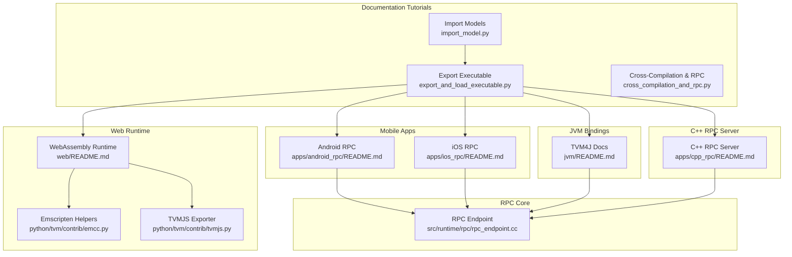

**Diagram sources**
- [import_model.py:1-408](file://docs/how_to/tutorials/import_model.py#L1-L408)
- [export_and_load_executable.py:1-382](file://docs/how_to/tutorials/export_and_load_executable.py#L1-L382)
- [cross_compilation_and_rpc.py:1-601](file://docs/how_to/tutorials/cross_compilation_and_rpc.py#L1-L601)
- [android_rpc/README.md:1-171](file://apps/android_rpc/README.md#L1-L171)
- [ios_rpc/README.md:1-257](file://apps/ios_rpc/README.md#L1-L257)
- [web/README.md:1-98](file://web/README.md#L1-L98)
- [jvm/README.md:1-151](file://jvm/README.md#L1-L151)
- [cpp_rpc/README.md:1-84](file://apps/cpp_rpc/README.md#L1-L84)
- [rpc_endpoint.cc:94-225](file://src/runtime/rpc/rpc_endpoint.cc#L94-L225)
- [emcc.py:39-108](file://python/tvm/contrib/emcc.py#L39-L108)
- [tvmjs.py:399-424](file://python/tvm/contrib/tvmjs.py#L399-L424)

**Section sources**
- [README.md:18-66](file://README.md#L18-L66)

## Core Components
- Framework Importers: TVM’s Relax frontend provides importers for PyTorch, ONNX, and TensorFlow Lite, enabling end-to-end model import and verification.
- Export and Load Executables: TVM compiles Relax modules into executables and exports shared libraries for deployment across platforms.
- RPC Infrastructure: TVM’s RPC server and client enable cross-compilation and remote execution on constrained devices, with support for trackers and proxies.
- Mobile Apps: Android and iOS RPC apps provide out-of-the-box RPC servers for mobile devices, with optional OpenCL/Metal/Vulkan support.
- WebAssembly Runtime: Emscripten-based WebAssembly runtime and TVMJS bundling enable browser and Node.js deployments.
- JVM Bindings: TVM4J exposes TVM runtime to Java applications, including RPC server/client capabilities and module loading.

**Section sources**
- [import_model.py:42-408](file://docs/how_to/tutorials/import_model.py#L42-L408)
- [export_and_load_executable.py:38-382](file://docs/how_to/tutorials/export_and_load_executable.py#L38-L382)
- [cross_compilation_and_rpc.py:18-601](file://docs/how_to/tutorials/cross_compilation_and_rpc.py#L18-L601)
- [android_rpc/README.md:19-171](file://apps/android_rpc/README.md#L19-L171)
- [ios_rpc/README.md:18-257](file://apps/ios_rpc/README.md#L18-L257)
- [web/README.md:18-98](file://web/README.md#L18-L98)
- [jvm/README.md:18-151](file://jvm/README.md#L18-L151)

## Architecture Overview
The integration architecture centers on a unified compilation and deployment pipeline that converts models from popular frameworks into TVM’s Relax IR, optimizes them, and deploys them to diverse targets via RPC, WebAssembly, or native libraries.

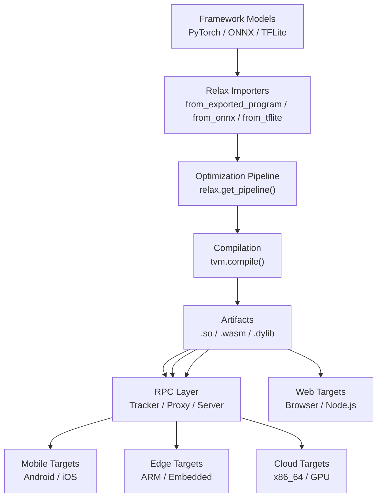

**Diagram sources**
- [import_model.py:42-408](file://docs/how_to/tutorials/import_model.py#L42-L408)
- [export_and_load_executable.py:108-382](file://docs/how_to/tutorials/export_and_load_executable.py#L108-L382)
- [cross_compilation_and_rpc.py:262-601](file://docs/how_to/tutorials/cross_compilation_and_rpc.py#L262-L601)
- [web/README.md:18-98](file://web/README.md#L18-L98)

## Detailed Component Analysis

### Framework Integration Patterns
- PyTorch: Use the modern PyTorch export workflow with Relax import and parameter separation for flexible deployment.
- ONNX: Import ONNX models and adjust shapes/dtypes as needed; verify outputs against the original model.
- TensorFlow Lite: Convert TFLite models via the TVM frontend and customize operator conversions if needed.

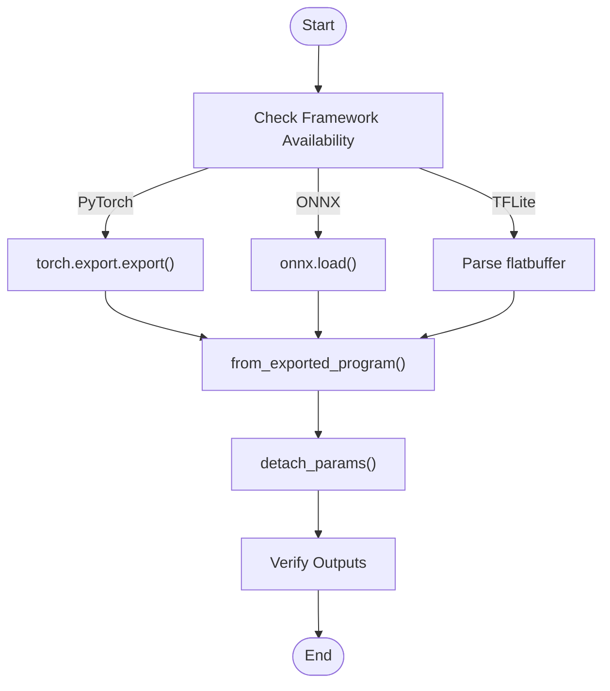

**Diagram sources**
- [import_model.py:42-408](file://docs/how_to/tutorials/import_model.py#L42-L408)

**Section sources**
- [import_model.py:42-408](file://docs/how_to/tutorials/import_model.py#L42-L408)

### Export and Load Executables
- Build Relax modules with the default pipeline, compile to an executable, export a shared library, and load it on target devices.
- Separate parameters for flexible deployment or embed them for single-file deployment.

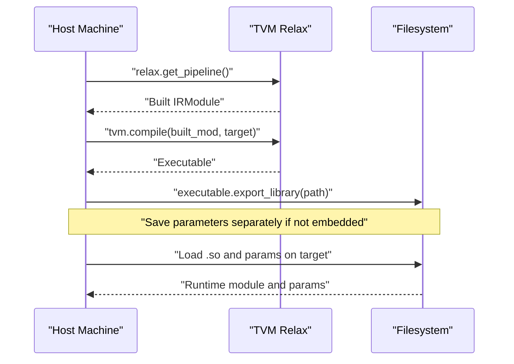

**Diagram sources**
- [export_and_load_executable.py:108-382](file://docs/how_to/tutorials/export_and_load_executable.py#L108-L382)

**Section sources**
- [export_and_load_executable.py:38-382](file://docs/how_to/tutorials/export_and_load_executable.py#L38-L382)

### RPC-Based Distributed Compilation and Deployment
- Use RPC to offload compilation to powerful hosts and execute on remote devices.
- Support tracker and proxy modes for scalable device management.

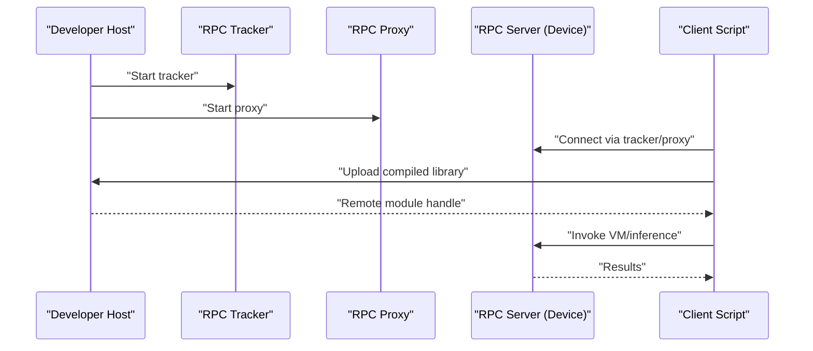

**Diagram sources**
- [cross_compilation_and_rpc.py:164-601](file://docs/how_to/tutorials/cross_compilation_and_rpc.py#L164-L601)
- [rpc_endpoint.cc:94-225](file://src/runtime/rpc/rpc_endpoint.cc#L94-L225)

**Section sources**
- [cross_compilation_and_rpc.py:18-601](file://docs/how_to/tutorials/cross_compilation_and_rpc.py#L18-L601)
- [rpc_endpoint.cc:94-225](file://src/runtime/rpc/rpc_endpoint.cc#L94-L225)

### Web Deployment Using WebAssembly
- Build TVM WebAssembly runtime and TVMJS bundle; compile models to WASM; run in browsers or Node.js via WebSocket RPC.

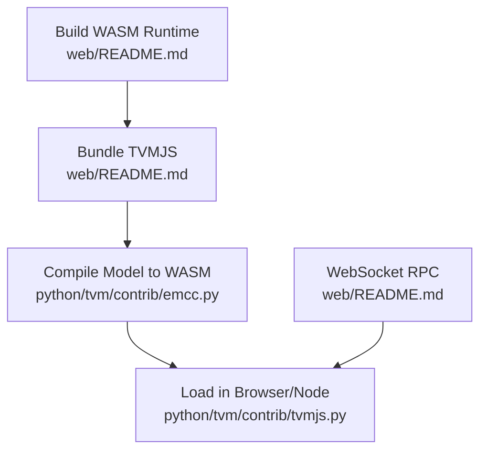

**Diagram sources**
- [web/README.md:18-98](file://web/README.md#L18-L98)
- [emcc.py:39-108](file://python/tvm/contrib/emcc.py#L39-L108)
- [tvmjs.py:399-424](file://python/tvm/contrib/tvmjs.py#L399-L424)

**Section sources**
- [web/README.md:18-98](file://web/README.md#L18-L98)
- [emcc.py:39-108](file://python/tvm/contrib/emcc.py#L39-L108)
- [tvmjs.py:399-424](file://python/tvm/contrib/tvmjs.py#L399-L424)

### JVM Bindings for Java Applications
- Use TVM4J to load shared libraries, construct tensors, and run inference; start RPC servers and clients from Java.

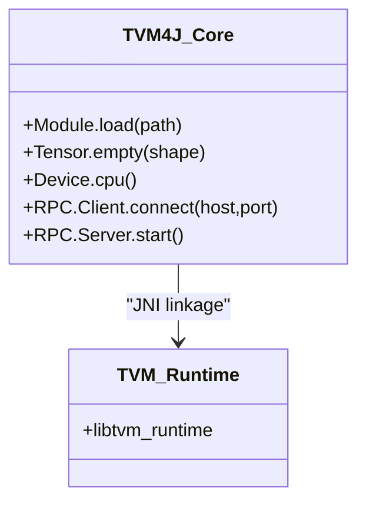

**Diagram sources**
- [jvm/README.md:18-151](file://jvm/README.md#L18-L151)

**Section sources**
- [jvm/README.md:18-151](file://jvm/README.md#L18-L151)

### Mobile Deployment Strategies
- Android RPC App: Build and install APK; connect to tracker/proxy; cross-compile for Android targets; run CPU/GPU tests.
- iOS RPC App: Build runtime dylib and app; support standalone, proxy, and tracker modes; USBMUX for offline scenarios.

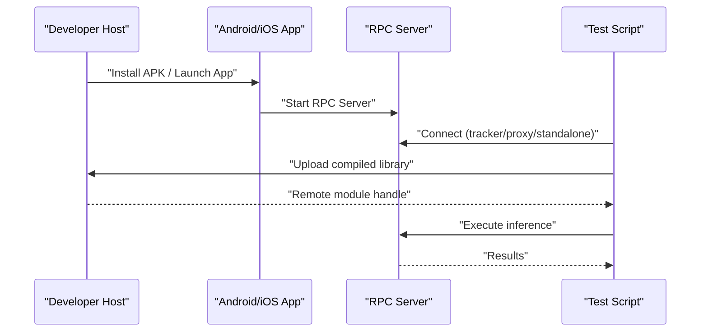

**Diagram sources**
- [android_rpc/README.md:19-171](file://apps/android_rpc/README.md#L19-L171)
- [ios_rpc/README.md:18-257](file://apps/ios_rpc/README.md#L18-L257)

**Section sources**
- [android_rpc/README.md:19-171](file://apps/android_rpc/README.md#L19-L171)
- [ios_rpc/README.md:18-257](file://apps/ios_rpc/README.md#L18-L257)

### Custom Operator Development
- Extend TVM by adding custom converters for unsupported operators in PyTorch and TFLite frontends.

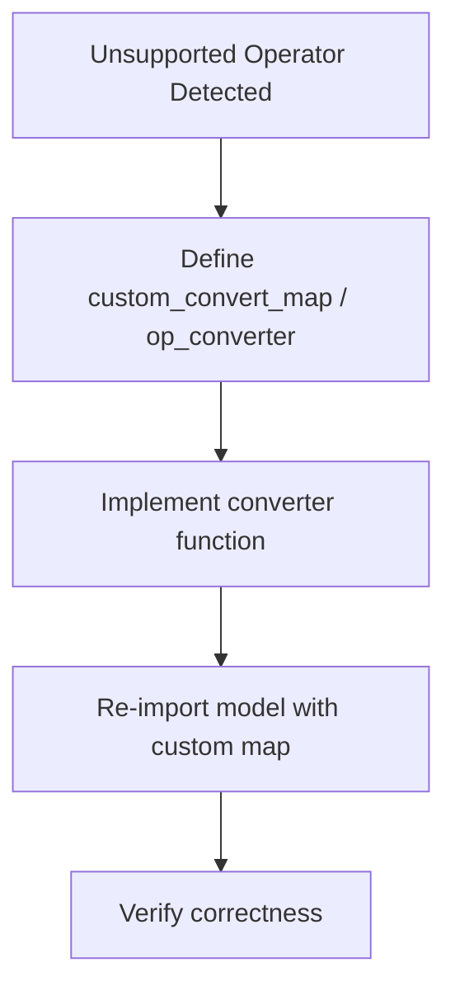

**Diagram sources**
- [import_model.py:118-182](file://docs/how_to/tutorials/import_model.py#L118-L182)

**Section sources**
- [import_model.py:118-182](file://docs/how_to/tutorials/import_model.py#L118-L182)

### Edge and Cloud Deployment Patterns
- Cross-compile for ARM, x86, and GPU targets; deploy via RPC to remote devices or cloud instances; measure performance excluding network overhead.

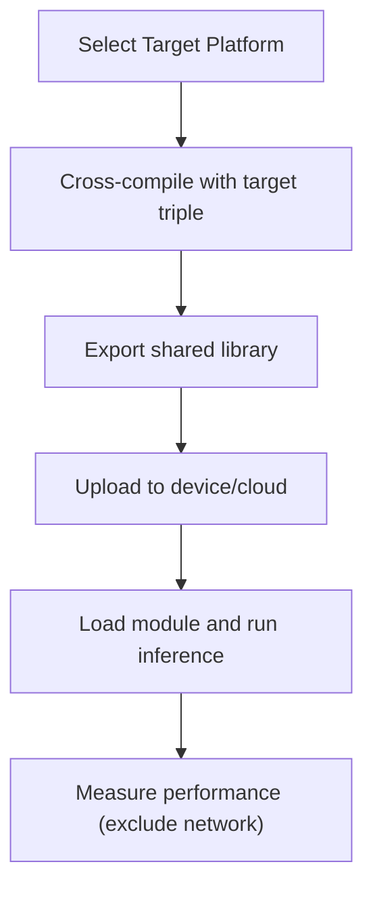

**Diagram sources**
- [cross_compilation_and_rpc.py:116-201](file://docs/how_to/tutorials/cross_compilation_and_rpc.py#L116-L201)

**Section sources**
- [cross_compilation_and_rpc.py:116-201](file://docs/how_to/tutorials/cross_compilation_and_rpc.py#L116-L201)

### Application Examples
- Android RPC: Build APK, configure standalone toolchain, connect to tracker, and run vector addition on CPU/GPU.
- iOS RPC: Build runtime dylib and app, support standalone/proxy/tracker modes, and use USBMUX for offline scenarios.
- Cross-platform deployment: Use RPC to deploy to ARM, x86, and GPU targets uniformly.

**Section sources**
- [android_rpc/README.md:83-171](file://apps/android_rpc/README.md#L83-L171)
- [ios_rpc/README.md:93-257](file://apps/ios_rpc/README.md#L93-L257)
- [cross_compilation_and_rpc.py:262-601](file://docs/how_to/tutorials/cross_compilation_and_rpc.py#L262-L601)

## Dependency Analysis
The integration examples rely on a layered dependency chain: framework importers depend on Relax IR; executables depend on compilation and export APIs; deployment targets depend on RPC, WebAssembly, or native runtime libraries.

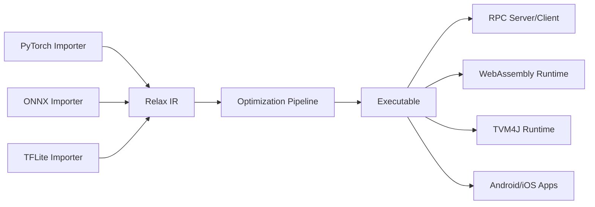

**Diagram sources**
- [import_model.py:42-408](file://docs/how_to/tutorials/import_model.py#L42-L408)
- [export_and_load_executable.py:108-382](file://docs/how_to/tutorials/export_and_load_executable.py#L108-L382)
- [web/README.md:18-98](file://web/README.md#L18-L98)
- [jvm/README.md:18-151](file://jvm/README.md#L18-L151)
- [android_rpc/README.md:19-171](file://apps/android_rpc/README.md#L19-L171)
- [ios_rpc/README.md:18-257](file://apps/ios_rpc/README.md#L18-L257)

**Section sources**
- [import_model.py:42-408](file://docs/how_to/tutorials/import_model.py#L42-L408)
- [export_and_load_executable.py:108-382](file://docs/how_to/tutorials/export_and_load_executable.py#L108-L382)
- [web/README.md:18-98](file://web/README.md#L18-L98)
- [jvm/README.md:18-151](file://jvm/README.md#L18-L151)
- [android_rpc/README.md:19-171](file://apps/android_rpc/README.md#L19-L171)
- [ios_rpc/README.md:18-257](file://apps/ios_rpc/README.md#L18-L257)

## Performance Considerations
- Prefer RPC-based evaluation to exclude network overhead when measuring performance.
- Use architecture-specific target features (e.g., NEON, AVX-512, RISC-V vector) to maximize throughput.
- Apply automated tuning or predefined schedules for optimal performance on target hardware.

[No sources needed since this section provides general guidance]

## Troubleshooting Guide
- Android APK signing conflicts: Uninstall previous version or regenerate keystore.
- iOS “Untrusted Developer” prompt: Trust the developer profile in Settings.
- WebAssembly runtime not found: Ensure TVM web runtime is built and TVMJS bundle copied to runtime directory.
- JVM library loading: Ensure libtvm_runtime is on the library path and TVM4J is installed to the local Maven repository.
- RPC connectivity: Verify tracker/proxy configuration and device firewall settings.

**Section sources**
- [android_rpc/README.md:63-171](file://apps/android_rpc/README.md#L63-L171)
- [ios_rpc/README.md:83-91](file://apps/ios_rpc/README.md#L83-L91)
- [web/README.md:40-98](file://web/README.md#L40-L98)
- [jvm/README.md:48-66](file://jvm/README.md#L48-L66)

## Conclusion
TVM’s integration examples provide a robust, extensible foundation for deploying ML models across diverse environments. By leveraging framework importers, exportable executables, RPC infrastructure, WebAssembly runtime, JVM bindings, and mobile apps, teams can achieve portable, high-performance deployments from desktop to edge and cloud. The provided workflows, diagrams, and troubleshooting guidance enable reliable integration and automation across production systems.

[No sources needed since this section summarizes without analyzing specific files]

## Appendices

### Step-by-Step Tutorials

- Importing Models from PyTorch/ONNX/TFLite
  - Use the documented importers and verification workflow to translate models to Relax IR and validate outputs.
  - Reference: [import_model.py:42-408](file://docs/how_to/tutorials/import_model.py#L42-L408)

- Exporting and Loading Executables
  - Build with the default pipeline, export a shared library, and load it on target devices; optionally embed parameters for single-file deployment.
  - Reference: [export_and_load_executable.py:108-382](file://docs/how_to/tutorials/export_and_load_executable.py#L108-L382)

- Cross-Compilation and RPC
  - Build TVM runtime on device, start RPC server, cross-compile on host, upload, and run inference remotely.
  - Reference: [cross_compilation_and_rpc.py:18-601](file://docs/how_to/tutorials/cross_compilation_and_rpc.py#L18-L601)

- Android RPC
  - Build APK, configure standalone toolchain, connect to tracker/proxy, and run CPU/GPU tests.
  - Reference: [android_rpc/README.md:25-171](file://apps/android_rpc/README.md#L25-L171)

- iOS RPC
  - Build runtime dylib and app, support standalone/proxy/tracker modes, and use USBMUX for offline scenarios.
  - Reference: [ios_rpc/README.md:33-257](file://apps/ios_rpc/README.md#L33-L257)

- WebAssembly Runtime
  - Build WASM runtime and TVMJS bundle; compile models to WASM; run via browser or Node.js with WebSocket RPC.
  - Reference: [web/README.md:18-98](file://web/README.md#L18-L98), [emcc.py:39-108](file://python/tvm/contrib/emcc.py#L39-L108), [tvmjs.py:399-424](file://python/tvm/contrib/tvmjs.py#L399-L424)

- JVM Bindings
  - Install TVM4J, load shared libraries, construct tensors, and start RPC servers/clients from Java.
  - Reference: [jvm/README.md:18-151](file://jvm/README.md#L18-L151)

- C++ RPC Server
  - Build and run C++ RPC server for Linux/Android/Windows; configure tracker and key for device identification.
  - Reference: [cpp_rpc/README.md:18-84](file://apps/cpp_rpc/README.md#L18-L84)

- iOS Simulator RPC Launcher
  - Utility to manage iOS simulator devices and RPC server modes for development and testing.
  - Reference: [rpc_server_ios_launcher.py:18-87](file://python/tvm/rpc/server_ios_launcher.py#L18-L87)

- Hexagon API App
  - Build TVM runtime and RPC server for Android and RPC library for Hexagon with integrated runtime.
  - Reference: [hexagon_api/README.md:18-59](file://apps/hexagon_api/README.md#L18-L59)