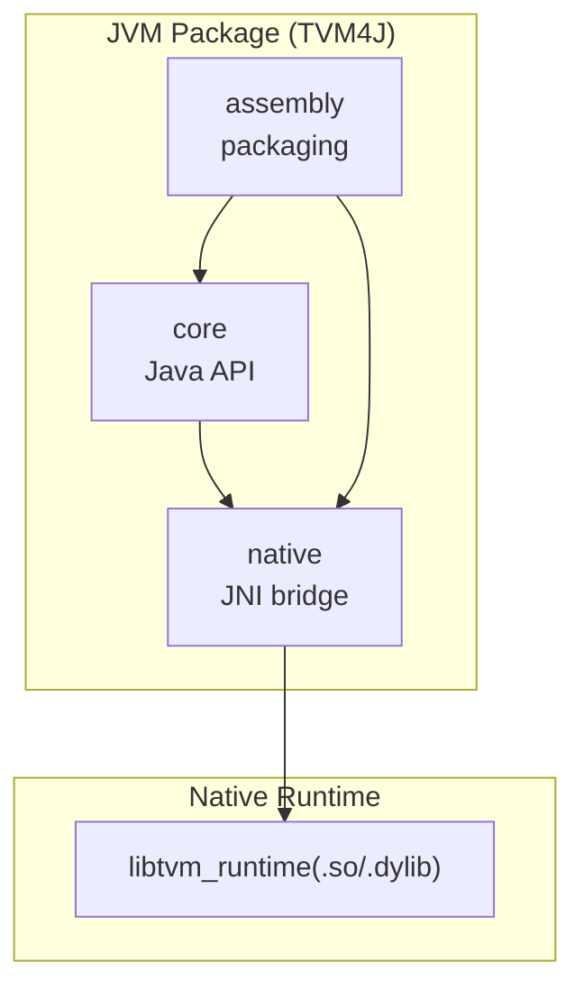
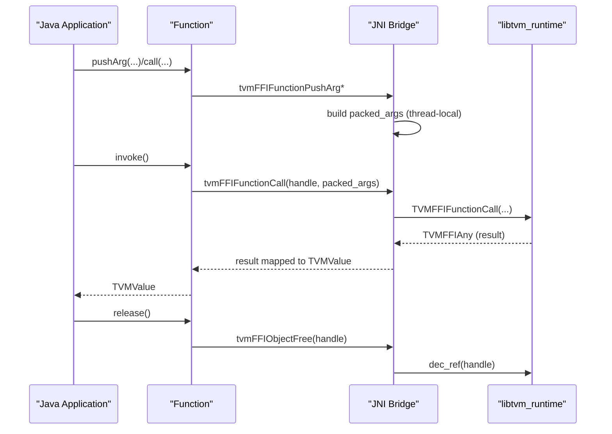
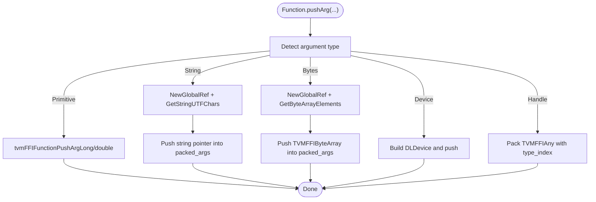
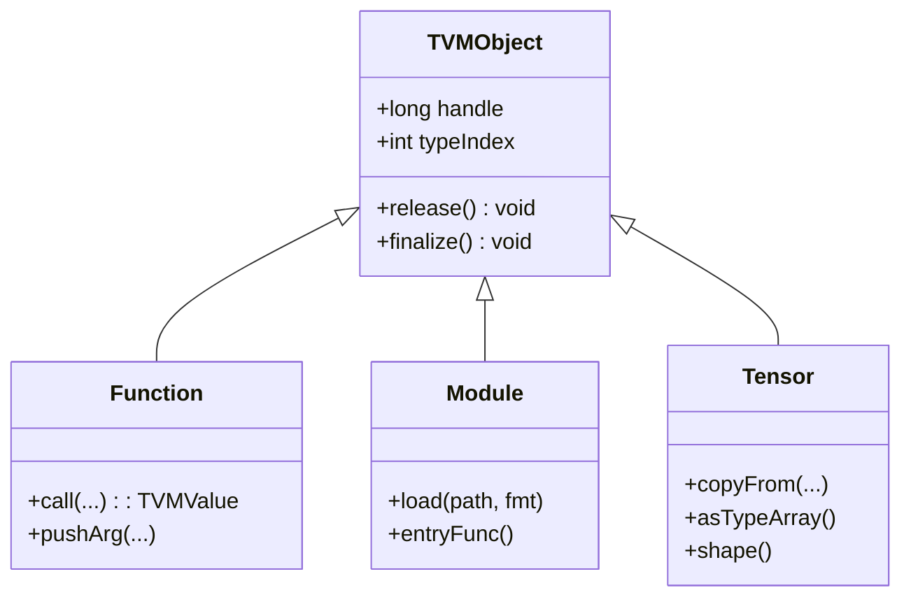
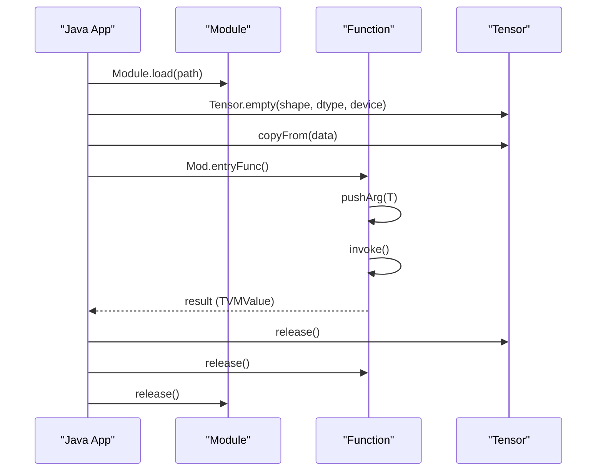
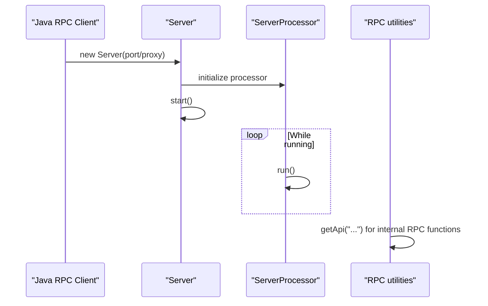
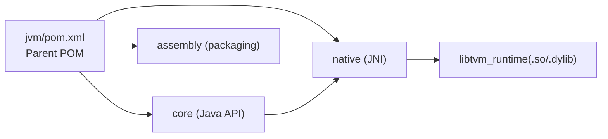

# JVM Bindings

<cite>
**Referenced Files in This Document**
- [README.md](file://jvm/README.md)
- [pom.xml](file://jvm/pom.xml)
- [Base.java](file://jvm/core/src/main/java/org/apache/tvm/Base.java)
- [TVMObject.java](file://jvm/core/src/main/java/org/apache/tvm/TVMObject.java)
- [API.java](file://jvm/core/src/main/java/org/apache/tvm/API.java)
- [Function.java](file://jvm/core/src/main/java/org/apache/tvm/Function.java)
- [Module.java](file://jvm/core/src/main/java/org/apache/tvm/Module.java)
- [Tensor.java](file://jvm/core/src/main/java/org/apache/tvm/Tensor.java)
- [org_apache_tvm_native_c_api.cc](file://jvm/native/src/main/native/org_apache_tvm_native_c_api.cc)
- [RPC.java](file://jvm/core/src/main/java/org/apache/tvm/rpc/RPC.java)
- [Server.java](file://jvm/core/src/main/java/org/apache/tvm/rpc/Server.java)
</cite>

## Table of Contents
1. [Introduction](#introduction)
2. [Project Structure](#project-structure)
3. [Core Components](#core-components)
4. [Architecture Overview](#architecture-overview)
5. [Detailed Component Analysis](#detailed-component-analysis)
6. [Dependency Analysis](#dependency-analysis)
7. [Performance Considerations](#performance-considerations)
8. [Troubleshooting Guide](#troubleshooting-guide)
9. [Conclusion](#conclusion)
10. [Appendices](#appendices)

## Introduction
This document explains the TVM JVM bindings (“TVM4J”), which bring the TVM runtime to Java and Kotlin via a JNI-based native interface. It covers the Java API design, memory management across language boundaries, Maven/Gradle integration, tensor operations, model loading, inference execution, and practical integration patterns for enterprise Java applications, Android, and microservices. It also documents performance characteristics, garbage collection impact, memory leak prevention, platform-specific deployment, cross-compilation considerations, and troubleshooting strategies.

## Project Structure
The JVM package is organized as a Maven multi-module project:
- core: Pure Java API and runtime abstractions for TVM objects, tensors, functions, modules, and RPC.
- native: JNI glue that bridges Java to the TVM C runtime, exposing FFI APIs and managing argument marshalling.
- assembly: Assembles core, native, and runtime libraries into a single artifact for easy integration.

**Diagram sources**
- [pom.xml:50-54](file://jvm/pom.xml#L50-L54)
- [README.md:35-45](file://jvm/README.md#L35-L45)

**Section sources**
- [README.md:35-45](file://jvm/README.md#L35-L45)
- [pom.xml:49-54](file://jvm/pom.xml#L49-L54)

## Core Components
- Base and initialization: Loads the native library, initializes the runtime, and registers a shutdown hook to release resources.
- TVMObject: Base class for all TVM-managed objects with explicit release semantics and finalizer-based cleanup.
- API: Provides cached retrieval of TVM API functions.
- Function: Encapsulates TVM packed functions, supports argument pushing, invocation, and registration of Java callbacks as TVM functions.
- Module: Loads compiled modules from disk and exposes entry functions and imports.
- Tensor: Wraps DLManagedTensor, supports shape queries, element-wise conversions, and efficient copy operations between Java arrays and TVM tensors.
- RPC: Utilities and server classes to start RPC servers and communicate with remote TVM clients.

**Section sources**
- [Base.java:58-96](file://jvm/core/src/main/java/org/apache/tvm/Base.java#L58-L96)
- [TVMObject.java:23-42](file://jvm/core/src/main/java/org/apache/tvm/TVMObject.java#L23-L42)
- [API.java:26-47](file://jvm/core/src/main/java/org/apache/tvm/API.java#L26-L47)
- [Function.java:27-88](file://jvm/core/src/main/java/org/apache/tvm/Function.java#L27-L88)
- [Module.java:26-133](file://jvm/core/src/main/java/org/apache/tvm/Module.java#L26-L133)
- [Tensor.java:28-410](file://jvm/core/src/main/java/org/apache/tvm/Tensor.java#L28-L410)
- [RPC.java:24-63](file://jvm/core/src/main/java/org/apache/tvm/rpc/RPC.java#L24-L63)
- [Server.java:25-88](file://jvm/core/src/main/java/org/apache/tvm/rpc/Server.java#L25-L88)

## Architecture Overview
The JVM API communicates with the TVM runtime through JNI. Java objects are passed to native code as handles or typed values. The native layer marshals arguments, invokes TVM FFI functions, and returns results back to Java. Memory is managed explicitly via release() on TVMObject-derived instances.

**Diagram sources**
- [Function.java:84-88](file://jvm/core/src/main/java/org/apache/tvm/Function.java#L84-L88)
- [org_apache_tvm_native_c_api.cc:173-206](file://jvm/native/src/main/native/org_apache_tvm_native_c_api.cc#L173-L206)
- [TVMObject.java:32-35](file://jvm/core/src/main/java/org/apache/tvm/TVMObject.java#L32-L35)

## Detailed Component Analysis

### JNI Layer and Argument Marshalling
The JNI layer maintains a per-thread stack of arguments and ensures proper lifecycle management of Java-owned resources (strings and byte arrays). It converts Java objects to TVMFFIAny and back, and synchronizes device streams when needed.

**Diagram sources**
- [org_apache_tvm_native_c_api.cc:83-143](file://jvm/native/src/main/native/org_apache_tvm_native_c_api.cc#L83-L143)

**Section sources**
- [org_apache_tvm_native_c_api.cc:44-54](file://jvm/native/src/main/native/org_apache_tvm_native_c_api.cc#L44-L54)
- [org_apache_tvm_native_c_api.cc:83-143](file://jvm/native/src/main/native/org_apache_tvm_native_c_api.cc#L83-L143)
- [org_apache_tvm_native_c_api.cc:173-206](file://jvm/native/src/main/native/org_apache_tvm_native_c_api.cc#L173-L206)

### Memory Management Across Boundaries
- Explicit release: TVMObject.release() decrements the native reference count and clears the handle.
- Finalizer safety: TVMObject.finalize() ensures release runs during GC, but relying on finalizers is discouraged; prefer deterministic release.
- JNI lifecycle: Strings and byte arrays are tracked and released after function calls to avoid leaks.

**Diagram sources**
- [TVMObject.java:23-42](file://jvm/core/src/main/java/org/apache/tvm/TVMObject.java#L23-L42)
- [Function.java:27-88](file://jvm/core/src/main/java/org/apache/tvm/Function.java#L27-L88)
- [Module.java:26-133](file://jvm/core/src/main/java/org/apache/tvm/Module.java#L26-L133)
- [Tensor.java:28-410](file://jvm/core/src/main/java/org/apache/tvm/Tensor.java#L28-L410)

**Section sources**
- [TVMObject.java:32-41](file://jvm/core/src/main/java/org/apache/tvm/TVMObject.java#L32-L41)
- [org_apache_tvm_native_c_api.cc:185-197](file://jvm/native/src/main/native/org_apache_tvm_native_c_api.cc#L185-L197)

### Java API Design and Usage Patterns
- Function: Register Java callbacks as TVM functions, call global functions, and push heterogeneous arguments.
- Module: Load shared libraries produced by TVM, query entry functions, and import other modules.
- Tensor: Construct empty tensors, copy from/to Java arrays, query shapes, and manage device placement.

**Diagram sources**
- [Module.java:113-120](file://jvm/core/src/main/java/org/apache/tvm/Module.java#L113-L120)
- [Tensor.java:362-396](file://jvm/core/src/main/java/org/apache/tvm/Tensor.java#L362-L396)
- [Function.java:199-204](file://jvm/core/src/main/java/org/apache/tvm/Function.java#L199-L204)

**Section sources**
- [Function.java:260-285](file://jvm/core/src/main/java/org/apache/tvm/Function.java#L260-L285)
- [Module.java:77-88](file://jvm/core/src/main/java/org/apache/tvm/Module.java#L77-L88)
- [Tensor.java:362-396](file://jvm/core/src/main/java/org/apache/tvm/Tensor.java#L362-L396)

### RPC Server and Client Integration
- Standalone and proxy modes are supported. Servers run in dedicated worker threads and process RPC requests.
- RPC utilities provide constants and internal function lookup helpers.

**Diagram sources**
- [Server.java:28-52](file://jvm/core/src/main/java/org/apache/tvm/rpc/Server.java#L28-L52)
- [RPC.java:52-62](file://jvm/core/src/main/java/org/apache/tvm/rpc/RPC.java#L52-L62)

**Section sources**
- [Server.java:59-87](file://jvm/core/src/main/java/org/apache/tvm/rpc/Server.java#L59-L87)
- [RPC.java:39-62](file://jvm/core/src/main/java/org/apache/tvm/rpc/RPC.java#L39-L62)

## Dependency Analysis
- Build system: Maven multi-module with core, native, and assembly modules. The parent POM defines compiler and packaging plugins.
- Runtime linkage: The JNI layer optionally dlopen libtvm_runtime; otherwise, a packed runtime variant may be used.
- Platform variants: Separate native libraries per OS/architecture are attempted during load.

**Diagram sources**
- [pom.xml:49-54](file://jvm/pom.xml#L49-L54)
- [Base.java:103-130](file://jvm/core/src/main/java/org/apache/tvm/Base.java#L103-L130)

**Section sources**
- [pom.xml:113-202](file://jvm/pom.xml#L113-L202)
- [Base.java:60-96](file://jvm/core/src/main/java/org/apache/tvm/Base.java#L60-L96)

## Performance Considerations
- Minimize array copies: Prefer in-place operations and reuse tensors where possible.
- Batch invocations: Group multiple operations into fewer function calls to reduce JNI overhead.
- Device synchronization: Use explicit synchronization when measuring or coordinating GPU/CPU workloads.
- Memory lifecycle: Always release TVM objects deterministically to avoid holding native resources across GC cycles.
- Garbage collection: JNI-created strings and byte arrays are tracked and released after each call; still, avoid creating transient large arrays repeatedly in tight loops.

[No sources needed since this section provides general guidance]

## Troubleshooting Guide
Common issues and remedies:
- Native library not found: The initializer attempts OS-specific variants and falls back to embedded extraction. Ensure the runtime library is discoverable or configure the appropriate library path.
- JNI UnsatisfiedLinkError: Verify that the correct architecture-specific native library is available and matches the JVM’s bitness.
- Resource leaks: Always call release() on Function, Module, and Tensor instances; rely on finalizers as a last resort.
- RPC connectivity: Confirm server mode (standalone vs proxy) and network/firewall settings.

**Section sources**
- [Base.java:60-96](file://jvm/core/src/main/java/org/apache/tvm/Base.java#L60-L96)
- [TVMObject.java:32-41](file://jvm/core/src/main/java/org/apache/tvm/TVMObject.java#L32-L41)
- [README.md:27-66](file://jvm/README.md#L27-L66)

## Conclusion
TVM4J provides a robust JNI bridge enabling Java and Kotlin applications to leverage TVM’s compiled modules, tensors, and runtime capabilities. By following deterministic resource management, minimizing JNI crossings, and leveraging the provided RPC facilities, teams can integrate TVM into enterprise Java stacks, Android apps, and microservices reliably and efficiently.

[No sources needed since this section summarizes without analyzing specific files]

## Appendices

### Maven/Gradle Integration and Build Configuration
- Build prerequisites: JDK 1.6+ and Maven; TVM runtime shared library built with LLVM support.
- Modules:
  - core: Java API classes.
  - native: JNI sources compiled into platform-specific libraries.
  - assembly: Packages core, native, and runtime into a deployable artifact.
- Build commands: Use the provided scripts to compile and optionally install artifacts locally.

**Section sources**
- [README.md:27-66](file://jvm/README.md#L27-L66)
- [pom.xml:49-54](file://jvm/pom.xml#L49-L54)

### Practical Integration Scenarios
- Enterprise Java applications: Load precompiled modules, allocate tensors on CPU/GPU, and execute inference via Function calls.
- Android development: Use the RPC server components to offload model execution to a remote device or a local RPC server.
- Microservices: Package the assembly artifact, deploy alongside service binaries, and expose inference endpoints using the Java API.

**Section sources**
- [README.md:126-151](file://jvm/README.md#L126-L151)
- [Module.java:113-120](file://jvm/core/src/main/java/org/apache/tvm/Module.java#L113-L120)
- [Tensor.java:362-396](file://jvm/core/src/main/java/org/apache/tvm/Tensor.java#L362-L396)

### Cross-Compilation and Platform Deployment
- Platform variants: The initializer attempts OS-specific native libraries (e.g., linux-x86_64, osx-x86_64). Ensure the correct variant is present or packaged.
- Packaging: The assembly module bundles the native library and runtime for simplified distribution.

**Section sources**
- [Base.java:103-130](file://jvm/core/src/main/java/org/apache/tvm/Base.java#L103-L130)
- [README.md:42-44](file://jvm/README.md#L42-L44)