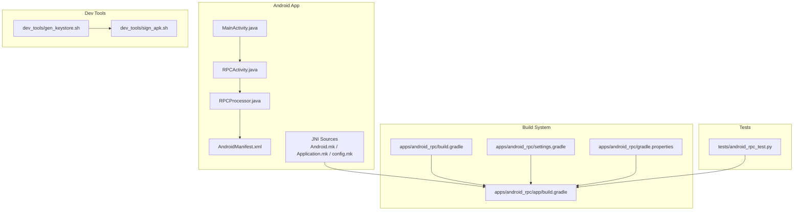
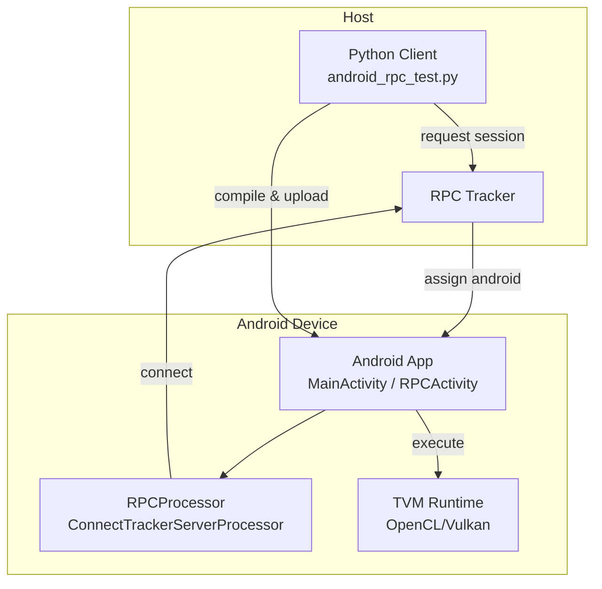
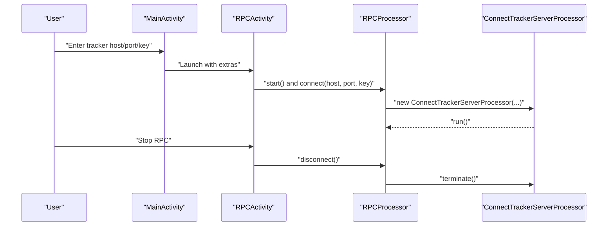
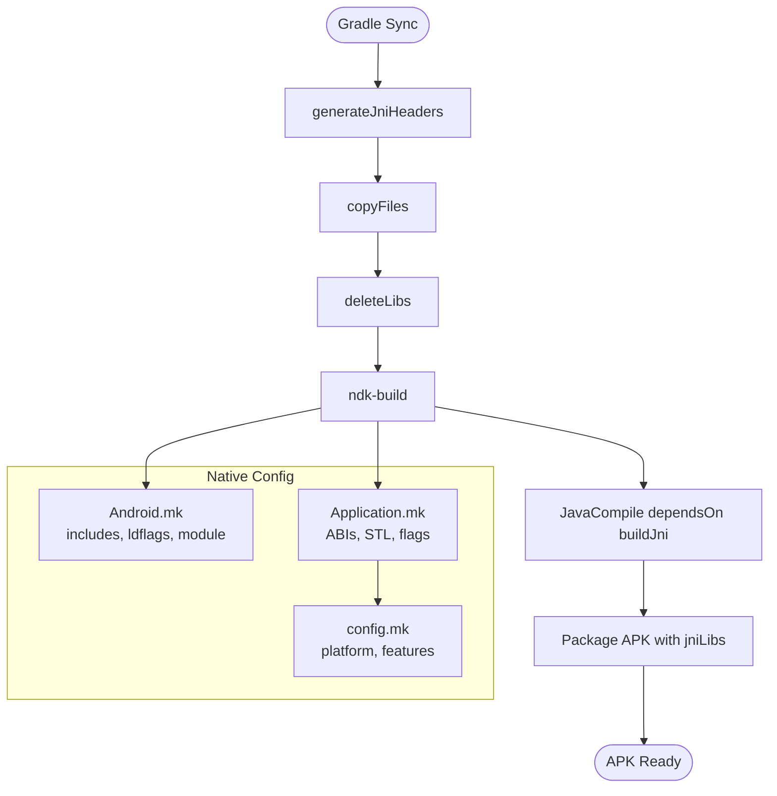
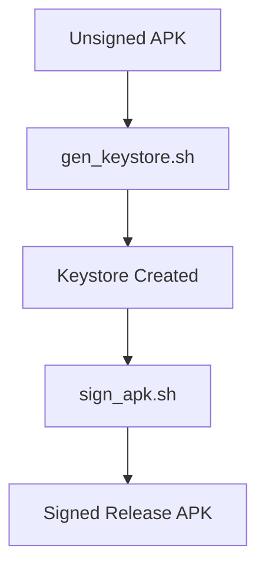
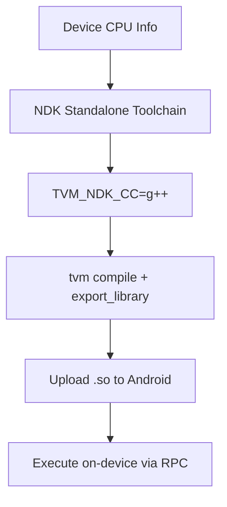
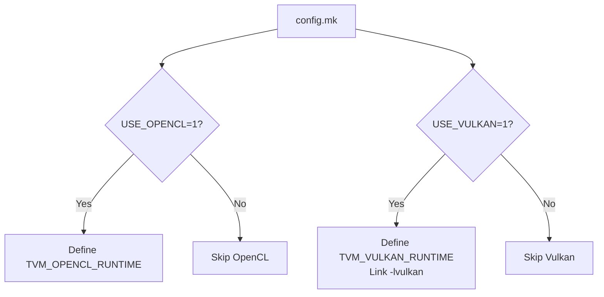
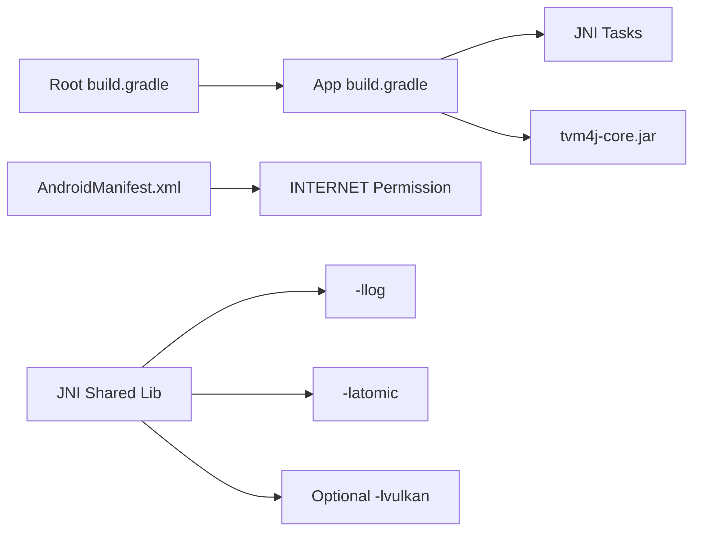

# Android RPC Deployment

<cite>
**Referenced Files in This Document**
- [apps/android_rpc/README.md](file://apps/android_rpc/README.md)
- [apps/android_rpc/build.gradle](file://apps/android_rpc/build.gradle)
- [apps/android_rpc/app/build.gradle](file://apps/android_rpc/app/build.gradle)
- [apps/android_rpc/settings.gradle](file://apps/android_rpc/settings.gradle)
- [apps/android_rpc/gradle.properties](file://apps/android_rpc/gradle.properties)
- [apps/android_rpc/app/src/main/AndroidManifest.xml](file://apps/android_rpc/app/src/main/AndroidManifest.xml)
- [apps/android_rpc/app/src/main/java/org/apache/tvm/tvmrpc/MainActivity.java](file://apps/android_rpc/app/src/main/java/org/apache/tvm/tvmrpc/MainActivity.java)
- [apps/android_rpc/app/src/main/java/org/apache/tvm/tvmrpc/RPCActivity.java](file://apps/android_rpc/app/src/main/java/org/apache/tvm/tvmrpc/RPCActivity.java)
- [apps/android_rpc/app/src/main/java/org/apache/tvm/tvmrpc/RPCProcessor.java](file://apps/android_rpc/app/src/main/java/org/apache/tvm/tvmrpc/RPCProcessor.java)
- [apps/android_rpc/app/src/main/jni/make/config.mk](file://apps/android_rpc/app/src/main/jni/make/config.mk)
- [apps/android_rpc/app/src/main/jni/Android.mk](file://apps/android_rpc/app/src/main/jni/Android.mk)
- [apps/android_rpc/app/src/main/jni/Application.mk](file://apps/android_rpc/app/src/main/jni/Application.mk)
- [apps/android_rpc/tests/android_rpc_test.py](file://apps/android_rpc/tests/android_rpc_test.py)
- [apps/android_rpc/dev_tools/gen_keystore.sh](file://apps/android_rpc/dev_tools/gen_keystore.sh)
- [apps/android_rpc/dev_tools/sign_apk.sh](file://apps/android_rpc/dev_tools/sign_apk.sh)
</cite>

## Table of Contents
1. [Introduction](#introduction)
2. [Project Structure](#project-structure)
3. [Core Components](#core-components)
4. [Architecture Overview](#architecture-overview)
5. [Detailed Component Analysis](#detailed-component-analysis)
6. [Dependency Analysis](#dependency-analysis)
7. [Performance Considerations](#performance-considerations)
8. [Troubleshooting Guide](#troubleshooting-guide)
9. [Conclusion](#conclusion)
10. [Appendices](#appendices)

## Introduction
This document explains how to deploy and operate TVM’s Android RPC application end-to-end. It covers NDK configuration, building the APK with Gradle, enabling OpenCL/Vulkan support, launching the RPC server on Android, connecting from a Python client, cross-compilation for Android targets, standalone toolchain generation, and deployment strategies. Practical examples demonstrate running inference tests, performance benchmarking, and troubleshooting common Android deployment issues. Guidance is also provided for integrating the Android RPC app into existing Android projects.

## Project Structure
The Android RPC application is organized as an Android Studio project with a dedicated Gradle build configuration, JNI sources for the TVM runtime, and a test suite for validating cross-compiled modules on-device.



**Diagram sources**
- [apps/android_rpc/app/src/main/java/org/apache/tvm/tvmrpc/MainActivity.java:1-161](file://apps/android_rpc/app/src/main/java/org/apache/tvm/tvmrpc/MainActivity.java#L1-L161)
- [apps/android_rpc/app/src/main/java/org/apache/tvm/tvmrpc/RPCActivity.java:1-68](file://apps/android_rpc/app/src/main/java/org/apache/tvm/tvmrpc/RPCActivity.java#L1-L68)
- [apps/android_rpc/app/src/main/java/org/apache/tvm/tvmrpc/RPCProcessor.java:1-96](file://apps/android_rpc/app/src/main/java/org/apache/tvm/tvmrpc/RPCProcessor.java#L1-L96)
- [apps/android_rpc/app/src/main/AndroidManifest.xml:1-58](file://apps/android_rpc/app/src/main/AndroidManifest.xml#L1-L58)
- [apps/android_rpc/app/src/main/jni/Android.mk:1-59](file://apps/android_rpc/app/src/main/jni/Android.mk#L1-L59)
- [apps/android_rpc/app/src/main/jni/Application.mk:1-51](file://apps/android_rpc/app/src/main/jni/Application.mk#L1-L51)
- [apps/android_rpc/app/src/main/jni/make/config.mk:1-58](file://apps/android_rpc/app/src/main/jni/make/config.mk#L1-L58)
- [apps/android_rpc/build.gradle:1-51](file://apps/android_rpc/build.gradle#L1-L51)
- [apps/android_rpc/app/build.gradle:1-104](file://apps/android_rpc/app/build.gradle#L1-L104)
- [apps/android_rpc/settings.gradle:1-19](file://apps/android_rpc/settings.gradle#L1-L19)
- [apps/android_rpc/gradle.properties:1-20](file://apps/android_rpc/gradle.properties#L1-L20)
- [apps/android_rpc/dev_tools/gen_keystore.sh:1-20](file://apps/android_rpc/dev_tools/gen_keystore.sh#L1-L20)
- [apps/android_rpc/dev_tools/sign_apk.sh:1-24](file://apps/android_rpc/dev_tools/sign_apk.sh#L1-L24)
- [apps/android_rpc/tests/android_rpc_test.py:1-87](file://apps/android_rpc/tests/android_rpc_test.py#L1-L87)

**Section sources**
- [apps/android_rpc/README.md:1-171](file://apps/android_rpc/README.md#L1-L171)
- [apps/android_rpc/app/build.gradle:1-104](file://apps/android_rpc/app/build.gradle#L1-L104)
- [apps/android_rpc/build.gradle:1-51](file://apps/android_rpc/build.gradle#L1-L51)
- [apps/android_rpc/settings.gradle:1-19](file://apps/android_rpc/settings.gradle#L1-L19)
- [apps/android_rpc/gradle.properties:1-20](file://apps/android_rpc/gradle.properties#L1-L20)

## Core Components
- Android UI and RPC orchestration:
  - MainActivity: Collects tracker host/port/key, persists preferences, and launches RPCActivity.
  - RPCActivity: Hosts the RPC lifecycle, starts/stops RPCProcessor, and connects to the tracker.
  - RPCProcessor: Manages the RPC connection loop, watchdog integration, and termination.
- Native runtime linkage:
  - JNI build pipeline generates headers, copies native sources, builds shared libraries via ndk-build, and packages jniLibs.
  - Android.mk and Application.mk configure include paths, ABI selection, STL, and feature flags (OpenCL/Vulkan).
  - config.mk controls platform level, optional features, and additional includes/links.
- Build system:
  - Root build.gradle defines Android Gradle Plugin version and repositories.
  - app/build.gradle wires JNI tasks, sets Android manifest metadata, and declares dependencies.
  - settings.gradle and gradle.properties finalize module inclusion and AndroidX/Jetifier flags.
- Dev tools:
  - gen_keystore.sh creates a keystore for signing.
  - sign_apk.sh signs the unsigned APK to produce a release APK.
- Tests:
  - android_rpc_test.py demonstrates tracker-based connection, scheduling, compilation for Android targets, and optional OpenCL/Vulkan execution.

**Section sources**
- [apps/android_rpc/app/src/main/java/org/apache/tvm/tvmrpc/MainActivity.java:1-161](file://apps/android_rpc/app/src/main/java/org/apache/tvm/tvmrpc/MainActivity.java#L1-L161)
- [apps/android_rpc/app/src/main/java/org/apache/tvm/tvmrpc/RPCActivity.java:1-68](file://apps/android_rpc/app/src/main/java/org/apache/tvm/tvmrpc/RPCActivity.java#L1-L68)
- [apps/android_rpc/app/src/main/java/org/apache/tvm/tvmrpc/RPCProcessor.java:1-96](file://apps/android_rpc/app/src/main/java/org/apache/tvm/tvmrpc/RPCProcessor.java#L1-L96)
- [apps/android_rpc/app/src/main/jni/Android.mk:1-59](file://apps/android_rpc/app/src/main/jni/Android.mk#L1-L59)
- [apps/android_rpc/app/src/main/jni/Application.mk:1-51](file://apps/android_rpc/app/src/main/jni/Application.mk#L1-L51)
- [apps/android_rpc/app/src/main/jni/make/config.mk:1-58](file://apps/android_rpc/app/src/main/jni/make/config.mk#L1-L58)
- [apps/android_rpc/app/build.gradle:1-104](file://apps/android_rpc/app/build.gradle#L1-L104)
- [apps/android_rpc/build.gradle:1-51](file://apps/android_rpc/build.gradle#L1-L51)
- [apps/android_rpc/settings.gradle:1-19](file://apps/android_rpc/settings.gradle#L1-L19)
- [apps/android_rpc/gradle.properties:1-20](file://apps/android_rpc/gradle.properties#L1-L20)
- [apps/android_rpc/dev_tools/gen_keystore.sh:1-20](file://apps/android_rpc/dev_tools/gen_keystore.sh#L1-L20)
- [apps/android_rpc/dev_tools/sign_apk.sh:1-24](file://apps/android_rpc/dev_tools/sign_apk.sh#L1-L24)
- [apps/android_rpc/tests/android_rpc_test.py:1-87](file://apps/android_rpc/tests/android_rpc_test.py#L1-L87)

## Architecture Overview
The Android RPC app runs a TVM RPC server that registers with a TVM RPC tracker. The Python client connects to the tracker, requests an Android session, compiles TVM modules for Android targets, uploads artifacts, and executes kernels on CPU/GPU.



**Diagram sources**
- [apps/android_rpc/tests/android_rpc_test.py:1-87](file://apps/android_rpc/tests/android_rpc_test.py#L1-L87)
- [apps/android_rpc/app/src/main/java/org/apache/tvm/tvmrpc/MainActivity.java:1-161](file://apps/android_rpc/app/src/main/java/org/apache/tvm/tvmrpc/MainActivity.java#L1-L161)
- [apps/android_rpc/app/src/main/java/org/apache/tvm/tvmrpc/RPCActivity.java:1-68](file://apps/android_rpc/app/src/main/java/org/apache/tvm/tvmrpc/RPCActivity.java#L1-L68)
- [apps/android_rpc/app/src/main/java/org/apache/tvm/tvmrpc/RPCProcessor.java:1-96](file://apps/android_rpc/app/src/main/java/org/apache/tvm/tvmrpc/RPCProcessor.java#L1-L96)

## Detailed Component Analysis

### Android UI and RPC Lifecycle
- MainActivity collects tracker address, port, and key from the UI, persists them, and starts RPCActivity with extras.
- RPCActivity initializes RPCProcessor, starts it as a daemon thread, and invokes connect(host, port, key).
- RPCProcessor manages the connection loop, instantiates the tracker server processor, and coordinates termination and watchdog behavior.



**Diagram sources**
- [apps/android_rpc/app/src/main/java/org/apache/tvm/tvmrpc/MainActivity.java:1-161](file://apps/android_rpc/app/src/main/java/org/apache/tvm/tvmrpc/MainActivity.java#L1-L161)
- [apps/android_rpc/app/src/main/java/org/apache/tvm/tvmrpc/RPCActivity.java:1-68](file://apps/android_rpc/app/src/main/java/org/apache/tvm/tvmrpc/RPCActivity.java#L1-L68)
- [apps/android_rpc/app/src/main/java/org/apache/tvm/tvmrpc/RPCProcessor.java:1-96](file://apps/android_rpc/app/src/main/java/org/apache/tvm/tvmrpc/RPCProcessor.java#L1-L96)

**Section sources**
- [apps/android_rpc/app/src/main/java/org/apache/tvm/tvmrpc/MainActivity.java:34-161](file://apps/android_rpc/app/src/main/java/org/apache/tvm/tvmrpc/MainActivity.java#L34-L161)
- [apps/android_rpc/app/src/main/java/org/apache/tvm/tvmrpc/RPCActivity.java:26-68](file://apps/android_rpc/app/src/main/java/org/apache/tvm/tvmrpc/RPCActivity.java#L26-L68)
- [apps/android_rpc/app/src/main/java/org/apache/tvm/tvmrpc/RPCProcessor.java:28-96](file://apps/android_rpc/app/src/main/java/org/apache/tvm/tvmrpc/RPCProcessor.java#L28-L96)

### JNI Build Pipeline and Native Configuration
- Gradle tasks:
  - generateJniHeaders: Generates JNI headers from JVM LibInfo class.
  - copyFiles: Copies native sources into the JNI directory.
  - deleteLibs: Cleans previous jniLibs.
  - buildJni: Invokes ndk-build to produce shared libraries.
  - JavaCompile depends on buildJni to ensure native libs are built before packaging.
- Android.mk:
  - Defines include paths for TVM headers, DLPack, and OpenCL-Headers.
  - Links against log and atomic libs; sets module name for the packed runtime.
- Application.mk:
  - Selects ABIs, STL, and C++ standard.
  - Enables feature flags for OpenCL/Vulkan based on config.mk.
  - Adds optional defines for sort/random contributions.
- config.mk:
  - Sets APP_ABI, APP_PLATFORM, and toggles USE_OPENCL/USE_VULKAN.
  - Allows overriding platform level when Vulkan is enabled.



**Diagram sources**
- [apps/android_rpc/app/build.gradle:20-59](file://apps/android_rpc/app/build.gradle#L20-L59)
- [apps/android_rpc/app/src/main/jni/Android.mk:1-59](file://apps/android_rpc/app/src/main/jni/Android.mk#L1-L59)
- [apps/android_rpc/app/src/main/jni/Application.mk:1-51](file://apps/android_rpc/app/src/main/jni/Application.mk#L1-L51)
- [apps/android_rpc/app/src/main/jni/make/config.mk:1-58](file://apps/android_rpc/app/src/main/jni/make/config.mk#L1-L58)

**Section sources**
- [apps/android_rpc/app/build.gradle:20-59](file://apps/android_rpc/app/build.gradle#L20-L59)
- [apps/android_rpc/app/src/main/jni/Android.mk:26-59](file://apps/android_rpc/app/src/main/jni/Android.mk#L26-L59)
- [apps/android_rpc/app/src/main/jni/Application.mk:18-51](file://apps/android_rpc/app/src/main/jni/Application.mk#L18-L51)
- [apps/android_rpc/app/src/main/jni/make/config.mk:18-58](file://apps/android_rpc/app/src/main/jni/make/config.mk#L18-L58)

### APK Signing and Distribution
- Keystore generation:
  - gen_keystore.sh creates a keystore using keytool with alias and validity.
- APK signing:
  - sign_apk.sh signs the unsigned APK with jarsigner and outputs a release APK.



**Diagram sources**
- [apps/android_rpc/dev_tools/gen_keystore.sh:1-20](file://apps/android_rpc/dev_tools/gen_keystore.sh#L1-L20)
- [apps/android_rpc/dev_tools/sign_apk.sh:1-24](file://apps/android_rpc/dev_tools/sign_apk.sh#L1-L24)

**Section sources**
- [apps/android_rpc/dev_tools/gen_keystore.sh:1-20](file://apps/android_rpc/dev_tools/gen_keystore.sh#L1-L20)
- [apps/android_rpc/dev_tools/sign_apk.sh:1-24](file://apps/android_rpc/dev_tools/sign_apk.sh#L1-L24)

### Cross-Compilation and Standalone Toolchain
- Determine device architecture:
  - Use adb to inspect CPU info and derive the target triple (e.g., arm64).
- Generate standalone toolchain:
  - Use NDK’s make-standalone-toolchain.sh targeting android-24 with desired arch.
- Configure TVM build:
  - Set TVM_NDK_CC to the standalone toolchain’s g++.
- Build and test:
  - Start RPC tracker, connect Android app to tracker, then run android_rpc_test.py to compile and execute modules on CPU/OpenCL/Vulkan.



**Diagram sources**
- [apps/android_rpc/README.md:83-138](file://apps/android_rpc/README.md#L83-L138)
- [apps/android_rpc/tests/android_rpc_test.py:33-87](file://apps/android_rpc/tests/android_rpc_test.py#L33-L87)

**Section sources**
- [apps/android_rpc/README.md:83-138](file://apps/android_rpc/README.md#L83-L138)
- [apps/android_rpc/tests/android_rpc_test.py:33-87](file://apps/android_rpc/tests/android_rpc_test.py#L33-L87)

### OpenCL and Vulkan Support
- OpenCL:
  - Enabled by default; the app attempts dynamic loading of OpenCL on the device.
  - To disable, set USE_OPENCL=0 in config.mk.
- Vulkan:
  - Controlled by USE_VULKAN in config.mk; when enabled, APP_PLATFORM is forced to android-24.
  - Requires Vulkan-capable drivers; failures are reported at runtime.



**Diagram sources**
- [apps/android_rpc/app/src/main/jni/make/config.mk:36-51](file://apps/android_rpc/app/src/main/jni/make/config.mk#L36-L51)
- [apps/android_rpc/app/src/main/jni/Application.mk:35-42](file://apps/android_rpc/app/src/main/jni/Application.mk#L35-L42)

**Section sources**
- [apps/android_rpc/README.md:75-82](file://apps/android_rpc/README.md#L75-L82)
- [apps/android_rpc/app/src/main/jni/make/config.mk:36-51](file://apps/android_rpc/app/src/main/jni/make/config.mk#L36-L51)
- [apps/android_rpc/app/src/main/jni/Application.mk:35-42](file://apps/android_rpc/app/src/main/jni/Application.mk#L35-L42)

### Permissions and Manifest
- INTERNET permission is declared to allow network communication with the RPC tracker.
- Optional native library declaration for OpenCL is included with required=false.

**Section sources**
- [apps/android_rpc/app/src/main/AndroidManifest.xml:24-34](file://apps/android_rpc/app/src/main/AndroidManifest.xml#L24-L34)

### Client-Server Communication Protocol
- Tracker-based registration:
  - The Android app connects to the RPC tracker using the provided host/port/key.
  - The Python client queries the tracker and requests a session keyed by "android".
- Module execution:
  - The Python client schedules and compiles TIR/IR modules for Android targets.
  - Artifacts are uploaded and executed remotely; timing APIs can be used for benchmarking.

```mermaid
sequenceDiagram
participant Py as "Python Client"
participant Tr as "RPC Tracker"
participant And as "Android App"
Py->>Tr : "connect_tracker(host, port)"
Py->>Tr : "request(key='android')"
Tr-->>Py : "session assigned"
Py->>And : "upload compiled module"
And-->>Py : "execution results"
```

**Diagram sources**
- [apps/android_rpc/tests/android_rpc_test.py:58-82](file://apps/android_rpc/tests/android_rpc_test.py#L58-L82)

**Section sources**
- [apps/android_rpc/tests/android_rpc_test.py:18-87](file://apps/android_rpc/tests/android_rpc_test.py#L18-L87)

## Dependency Analysis
- Build-time dependencies:
  - Android Gradle Plugin version and repositories are configured at the root.
  - app/build.gradle depends on JNI tasks and declares tvm4j-core jar.
- Runtime dependencies:
  - AndroidManifest declares INTERNET permission and optional OpenCL library.
  - JNI libraries link against log and atomic; optional Vulkan linkage when enabled.



**Diagram sources**
- [apps/android_rpc/build.gradle:20-46](file://apps/android_rpc/build.gradle#L20-L46)
- [apps/android_rpc/app/build.gradle:93-103](file://apps/android_rpc/app/build.gradle#L93-L103)
- [apps/android_rpc/app/src/main/AndroidManifest.xml:24-34](file://apps/android_rpc/app/src/main/AndroidManifest.xml#L24-L34)
- [apps/android_rpc/app/src/main/jni/Android.mk:37-47](file://apps/android_rpc/app/src/main/jni/Android.mk#L37-L47)

**Section sources**
- [apps/android_rpc/build.gradle:20-46](file://apps/android_rpc/build.gradle#L20-L46)
- [apps/android_rpc/app/build.gradle:93-103](file://apps/android_rpc/app/build.gradle#L93-L103)
- [apps/android_rpc/app/src/main/AndroidManifest.xml:24-34](file://apps/android_rpc/app/src/main/AndroidManifest.xml#L24-L34)
- [apps/android_rpc/app/src/main/jni/Android.mk:37-47](file://apps/android_rpc/app/src/main/jni/Android.mk#L37-L47)

## Performance Considerations
- Prefer Vulkan on capable devices when USE_VULKAN is enabled; otherwise OpenCL can be used if present.
- Use appropriate target triples derived from device CPU info to maximize performance.
- Benchmarking:
  - Use time_evaluator on the remote device to measure kernel execution time.
  - Compare CPU vs GPU timings to select optimal backends.

**Section sources**
- [apps/android_rpc/tests/android_rpc_test.py:79-82](file://apps/android_rpc/tests/android_rpc_test.py#L79-L82)
- [apps/android_rpc/README.md:138-157](file://apps/android_rpc/README.md#L138-L157)

## Troubleshooting Guide
- Gradle version mismatch:
  - Android Studio may report minimum supported Gradle version is 7.5; sync project to regenerate wrapper and adjust distributionUrl accordingly.
- Signature mismatch during install:
  - Uninstall the previous version before installing a newly signed APK.
- Vulkan initialization failure:
  - On some devices, Vulkan driver incompatibility leads to initialization errors; fallback to CPU/OpenCL is recommended.
- OpenCL availability:
  - If the device lacks OpenCL runtime, dynamic loading fails; ensure device supports OpenCL or disable via config.

**Section sources**
- [apps/android_rpc/README.md:161-171](file://apps/android_rpc/README.md#L161-L171)
- [apps/android_rpc/README.md:63-74](file://apps/android_rpc/README.md#L63-L74)
- [apps/android_rpc/README.md:148-157](file://apps/android_rpc/README.md#L148-L157)

## Conclusion
The Android RPC application integrates seamlessly with TVM’s RPC ecosystem. By configuring the NDK, building JNI libraries, enabling OpenCL/Vulkan, and using the tracker-based workflow, you can compile and execute optimized kernels on Android devices. The provided scripts and tests simplify APK signing, cross-compilation, and performance validation. For robust deployments, ensure device compatibility, handle driver-specific failures gracefully, and leverage benchmarking to choose the best backend.

## Appendices

### Step-by-Step: Build APK
- Install prerequisites and prepare tvm4j-core.
- Set ANDROID_HOME and run Gradle build.
- Generate keystore and sign the APK.
- Install the signed APK on the device.

**Section sources**
- [apps/android_rpc/README.md:25-61](file://apps/android_rpc/README.md#L25-L61)
- [apps/android_rpc/dev_tools/gen_keystore.sh:1-20](file://apps/android_rpc/dev_tools/gen_keystore.sh#L1-L20)
- [apps/android_rpc/dev_tools/sign_apk.sh:1-24](file://apps/android_rpc/dev_tools/sign_apk.sh#L1-L24)

### Step-by-Step: Cross-Compile and Run
- Determine device architecture and generate standalone toolchain.
- Start RPC tracker and connect the Android app.
- Run android_rpc_test.py to compile and execute modules on CPU/OpenCL/Vulkan.

**Section sources**
- [apps/android_rpc/README.md:83-138](file://apps/android_rpc/README.md#L83-L138)
- [apps/android_rpc/tests/android_rpc_test.py:18-87](file://apps/android_rpc/tests/android_rpc_test.py#L18-L87)

### Integrating with Existing Android Projects
- Add tvm4j-core dependency to your app’s dependencies.
- Wire JNI tasks to build native libraries via ndk-build.
- Declare INTERNET permission and optional OpenCL library in the manifest.
- Launch RPCActivity with host/port/key and manage lifecycle in your app.

**Section sources**
- [apps/android_rpc/app/build.gradle:93-103](file://apps/android_rpc/app/build.gradle#L93-L103)
- [apps/android_rpc/app/src/main/AndroidManifest.xml:24-34](file://apps/android_rpc/app/src/main/AndroidManifest.xml#L24-L34)
- [apps/android_rpc/app/src/main/java/org/apache/tvm/tvmrpc/RPCActivity.java:26-68](file://apps/android_rpc/app/src/main/java/org/apache/tvm/tvmrpc/RPCActivity.java#L26-L68)