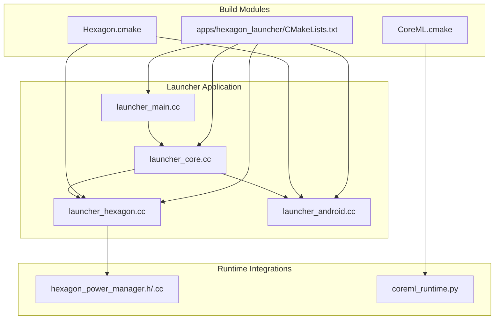
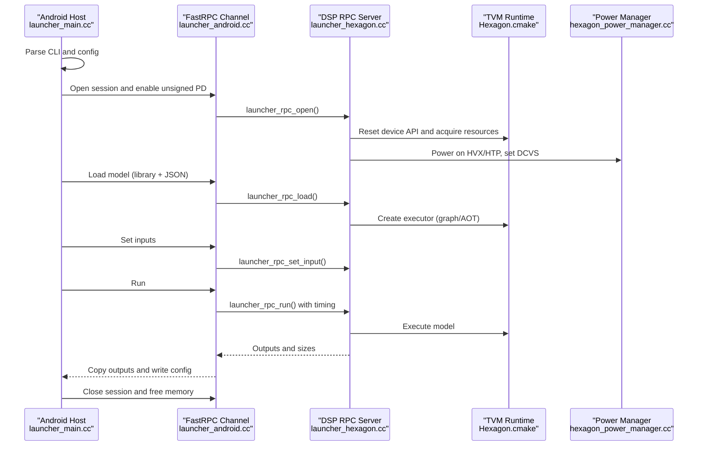
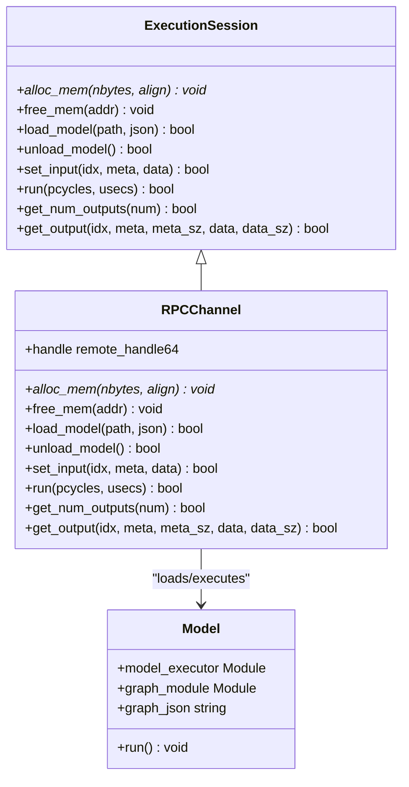
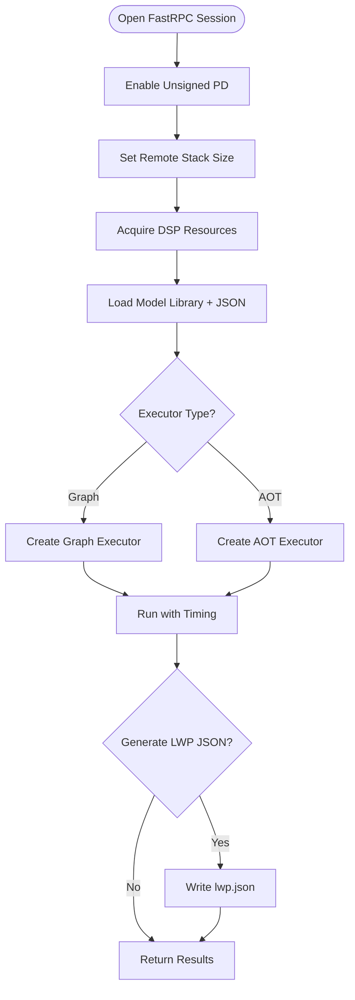
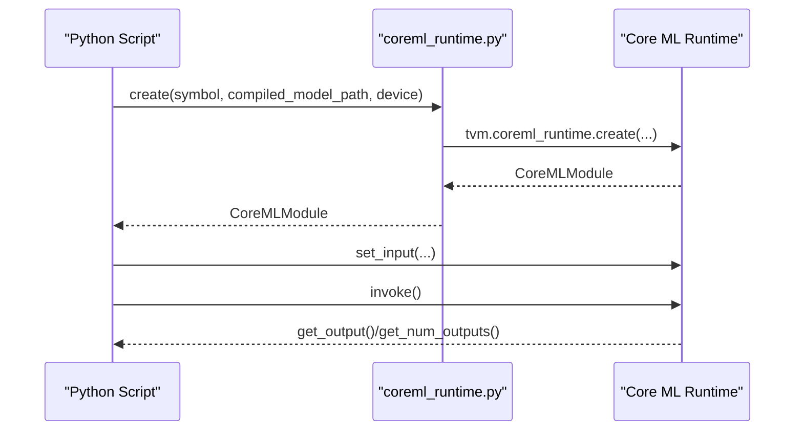
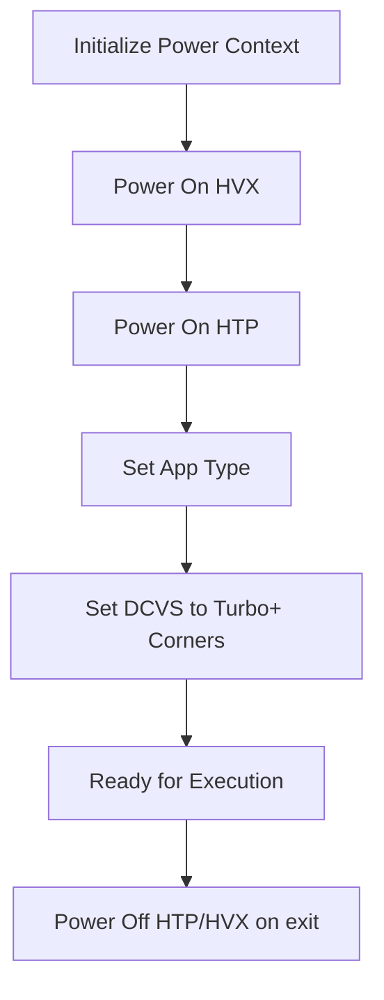
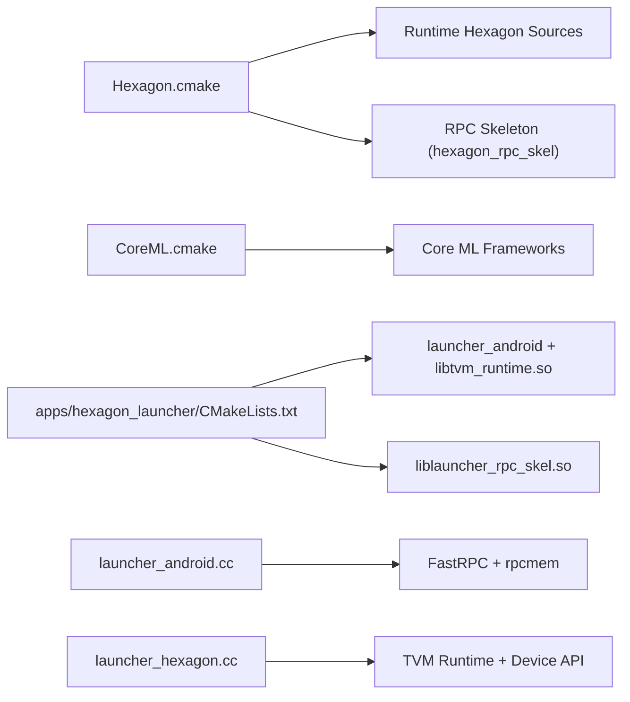

# Embedded Platforms

<cite>
**Referenced Files in This Document**
- [README.md](file://apps/hexagon_launcher/README.md)
- [CMakeLists.txt](file://apps/hexagon_launcher/CMakeLists.txt)
- [launcher_main.cc](file://apps/hexagon_launcher/launcher_main.cc)
- [launcher_core.cc](file://apps/hexagon_launcher/launcher_core.cc)
- [launcher_hexagon.cc](file://apps/hexagon_launcher/launcher_hexagon.cc)
- [launcher_android.cc](file://apps/hexagon_launcher/launcher_android.cc)
- [Hexagon.cmake](file://cmake/modules/Hexagon.cmake)
- [CoreML.cmake](file://cmake/modules/contrib/CoreML.cmake)
- [coreml_runtime.py](file://python/tvm/contrib/coreml_runtime.py)
- [hexagon_power_manager.h](file://src/runtime/hexagon/hexagon_power_manager.h)
- [hexagon_power_manager.cc](file://src/runtime/hexagon/hexagon_power_manager.cc)
- [build.py](file://python/tvm/contrib/hexagon/build.py)
</cite>

## Table of Contents
1. [Introduction](#introduction)
2. [Project Structure](#project-structure)
3. [Core Components](#core-components)
4. [Architecture Overview](#architecture-overview)
5. [Detailed Component Analysis](#detailed-component-analysis)
6. [Dependency Analysis](#dependency-analysis)
7. [Performance Considerations](#performance-considerations)
8. [Troubleshooting Guide](#troubleshooting-guide)
9. [Conclusion](#conclusion)
10. [Appendices](#appendices)

## Introduction
This document explains how to deploy machine learning models on embedded platforms using TVM’s Hexagon launcher and Core ML runtime integration. It covers the Qualcomm AI acceleration platform workflow, device provisioning, runtime environment setup, and optimization techniques for resource-constrained and edge computing scenarios. It also addresses power management, thermal and power-aware execution, and practical deployment examples.

## Project Structure
The embedded deployment spans three primary areas:
- Hexagon launcher application for Qualcomm DSP execution
- TVM runtime modules for Hexagon and Core ML
- Build and packaging configuration via CMake modules

**Diagram sources**
- [launcher_main.cc:67-159](file://apps/hexagon_launcher/launcher_main.cc#L67-L159)
- [launcher_core.cc:128-232](file://apps/hexagon_launcher/launcher_core.cc#L128-L232)
- [launcher_hexagon.cc:47-237](file://apps/hexagon_launcher/launcher_hexagon.cc#L47-L237)
- [launcher_android.cc:57-171](file://apps/hexagon_launcher/launcher_android.cc#L57-L171)
- [Hexagon.cmake:123-344](file://cmake/modules/Hexagon.cmake#L123-L344)
- [CoreML.cmake:18-26](file://cmake/modules/contrib/CoreML.cmake#L18-L26)
- [CMakeLists.txt:40-82](file://apps/hexagon_launcher/CMakeLists.txt#L40-L82)
- [hexagon_power_manager.h:27-61](file://src/runtime/hexagon/hexagon_power_manager.h#L27-L61)
- [hexagon_power_manager.cc:32-104](file://src/runtime/hexagon/hexagon_power_manager.cc#L32-L104)
- [coreml_runtime.py:24-77](file://python/tvm/contrib/coreml_runtime.py#L24-L77)

**Section sources**
- [README.md:19-146](file://apps/hexagon_launcher/README.md#L19-L146)
- [CMakeLists.txt:18-82](file://apps/hexagon_launcher/CMakeLists.txt#L18-L82)
- [Hexagon.cmake:18-344](file://cmake/modules/Hexagon.cmake#L18-L344)
- [CoreML.cmake:18-26](file://cmake/modules/contrib/CoreML.cmake#L18-L26)

## Core Components
- Launcher entrypoint and CLI orchestration
- Model configuration parsing and I/O handling
- Android-hosted RPC client to DSP
- DSP-side RPC server and model executor bindings
- TVM runtime Hexagon integration and power management
- Core ML runtime creation and invocation

Key responsibilities:
- launcher_main.cc: Parses CLI, loads model config, orchestrates execution, and writes outputs.
- launcher_core.cc: Defines data structures, JSON config loaders/savers, and runtime module helpers.
- launcher_android.cc: Manages FastRPC channel lifecycle, memory allocation, and RPC calls.
- launcher_hexagon.cc: Implements RPC callbacks for DSP, model load/unload, inputs/outputs, and timing.
- Hexagon.cmake: Adds Hexagon runtime sources, RPC skeleton, and QHL/HVX/HTP support.
- CoreML.cmake: Links Core ML runtime contributions on macOS/iOS.
- hexagon_power_manager.*: Controls HVX/HTP power and DCVS settings on Hexagon.

**Section sources**
- [launcher_main.cc:32-159](file://apps/hexagon_launcher/launcher_main.cc#L32-L159)
- [launcher_core.cc:128-232](file://apps/hexagon_launcher/launcher_core.cc#L128-L232)
- [launcher_android.cc:57-171](file://apps/hexagon_launcher/launcher_android.cc#L57-L171)
- [launcher_hexagon.cc:47-237](file://apps/hexagon_launcher/launcher_hexagon.cc#L47-L237)
- [Hexagon.cmake:123-344](file://cmake/modules/Hexagon.cmake#L123-L344)
- [CoreML.cmake:18-26](file://cmake/modules/contrib/CoreML.cmake#L18-L26)
- [hexagon_power_manager.h:27-61](file://src/runtime/hexagon/hexagon_power_manager.h#L27-L61)
- [hexagon_power_manager.cc:32-104](file://src/runtime/hexagon/hexagon_power_manager.cc#L32-L104)

## Architecture Overview
The embedded deployment uses a split-process architecture:
- Android host runs the launcher binary and manages RPC sessions.
- DSP executes the model via a FastRPC channel and TVM graph/AOT executors.
- Optional profiling and power management are integrated into the DSP path.

**Diagram sources**
- [launcher_main.cc:67-159](file://apps/hexagon_launcher/launcher_main.cc#L67-L159)
- [launcher_android.cc:57-171](file://apps/hexagon_launcher/launcher_android.cc#L57-L171)
- [launcher_hexagon.cc:47-237](file://apps/hexagon_launcher/launcher_hexagon.cc#L47-L237)
- [Hexagon.cmake:123-344](file://cmake/modules/Hexagon.cmake#L123-L344)
- [hexagon_power_manager.cc:32-104](file://src/runtime/hexagon/hexagon_power_manager.cc#L32-L104)

## Detailed Component Analysis

### Launcher Application Architecture
The launcher comprises:
- CLI parsing and configuration I/O
- Host-side execution session abstraction
- DSP-side RPC server implementation
- Executor selection (graph vs AOT) and device binding

**Diagram sources**
- [launcher_android.cc:57-171](file://apps/hexagon_launcher/launcher_android.cc#L57-L171)
- [launcher_core.cc:159-232](file://apps/hexagon_launcher/launcher_core.cc#L159-L232)

**Section sources**
- [launcher_main.cc:32-159](file://apps/hexagon_launcher/launcher_main.cc#L32-L159)
- [launcher_core.cc:128-232](file://apps/hexagon_launcher/launcher_core.cc#L128-L232)
- [launcher_android.cc:57-171](file://apps/hexagon_launcher/launcher_android.cc#L57-L171)
- [launcher_hexagon.cc:47-237](file://apps/hexagon_launcher/launcher_hexagon.cc#L47-L237)

### Hexagon DSP Deployment Workflow
- Device provisioning: enable unsigned PD, set remote thread params, acquire DSP resources.
- Model loading: select executor type (graph or AOT) and bind to device.
- Execution: run with cycle/time measurement; optionally emit LWP profiling.
- Output retrieval: fetch shapes/dtypes and copy output tensors.

**Diagram sources**
- [launcher_android.cc:34-82](file://apps/hexagon_launcher/launcher_android.cc#L34-L82)
- [launcher_hexagon.cc:64-237](file://apps/hexagon_launcher/launcher_hexagon.cc#L64-L237)
- [README.md:104-136](file://apps/hexagon_launcher/README.md#L104-L136)

**Section sources**
- [launcher_android.cc:34-82](file://apps/hexagon_launcher/launcher_android.cc#L34-L82)
- [launcher_hexagon.cc:64-237](file://apps/hexagon_launcher/launcher_hexagon.cc#L64-L237)
- [README.md:81-136](file://apps/hexagon_launcher/README.md#L81-L136)

### Core ML Runtime Integration
- Python API creates a Core ML runtime module from a compiled model and device.
- The runtime exposes invoke/set_input/get_output/get_num_outputs for execution.
- Build integration links Foundation and Core ML frameworks on macOS/iOS.

**Diagram sources**
- [coreml_runtime.py:24-77](file://python/tvm/contrib/coreml_runtime.py#L24-L77)
- [CoreML.cmake:18-26](file://cmake/modules/contrib/CoreML.cmake#L18-L26)

**Section sources**
- [coreml_runtime.py:24-77](file://python/tvm/contrib/coreml_runtime.py#L24-L77)
- [CoreML.cmake:18-26](file://cmake/modules/contrib/CoreML.cmake#L18-L26)

### Power Management and Thermal Control
- Power manager initializes HAP power context and toggles HVX/HTP on/off.
- Sets application type and configures DCVS to fixed turbo-plus corners to reduce thermal throttling and stabilize latency.

**Diagram sources**
- [hexagon_power_manager.h:27-61](file://src/runtime/hexagon/hexagon_power_manager.h#L27-L61)
- [hexagon_power_manager.cc:32-104](file://src/runtime/hexagon/hexagon_power_manager.cc#L32-L104)

**Section sources**
- [hexagon_power_manager.h:27-61](file://src/runtime/hexagon/hexagon_power_manager.h#L27-L61)
- [hexagon_power_manager.cc:32-104](file://src/runtime/hexagon/hexagon_power_manager.cc#L32-L104)

## Dependency Analysis
- Build-time dependencies:
  - Hexagon.cmake adds Hexagon runtime sources, RPC skeleton, and optional QHL/HVX ops.
  - CoreML.cmake links Foundation and Core ML frameworks for macOS/iOS.
  - apps/hexagon_launcher/CMakeLists.txt composes Android and Hexagon launcher binaries via ExternalProject.
- Runtime dependencies:
  - Android launcher depends on FastRPC and rpcmem for shared memory.
  - DSP RPC server depends on TVM runtime and Hexagon device APIs.

**Diagram sources**
- [Hexagon.cmake:123-344](file://cmake/modules/Hexagon.cmake#L123-L344)
- [CoreML.cmake:18-26](file://cmake/modules/contrib/CoreML.cmake#L18-L26)
- [CMakeLists.txt:40-82](file://apps/hexagon_launcher/CMakeLists.txt#L40-L82)
- [launcher_android.cc:57-171](file://apps/hexagon_launcher/launcher_android.cc#L57-L171)
- [launcher_hexagon.cc:47-237](file://apps/hexagon_launcher/launcher_hexagon.cc#L47-L237)

**Section sources**
- [Hexagon.cmake:123-344](file://cmake/modules/Hexagon.cmake#L123-L344)
- [CoreML.cmake:18-26](file://cmake/modules/contrib/CoreML.cmake#L18-L26)
- [CMakeLists.txt:40-82](file://apps/hexagon_launcher/CMakeLists.txt#L40-L82)
- [launcher_android.cc:57-171](file://apps/hexagon_launcher/launcher_android.cc#L57-L171)
- [launcher_hexagon.cc:47-237](file://apps/hexagon_launcher/launcher_hexagon.cc#L47-L237)

## Performance Considerations
- Execution timing: The DSP measures processor cycles and microseconds around run to quantify performance.
- Lightweight profiling (LWP): Instrumentation and JSON dumping are supported via a dedicated flag.
- Power and thermal: Fixed DCVS corners minimize throttling for real-time workloads.
- Memory: Use rpcmem for efficient host-device transfers; allocate only what is needed.

Practical tips:
- Prefer AOT executor for minimal runtime overhead on constrained devices.
- Reduce input/output copies by aligning shapes and dtypes to model expectations.
- Keep model size and memory footprint within device limits; leverage quantization and pruning upstream.

**Section sources**
- [launcher_hexagon.cc:210-237](file://apps/hexagon_launcher/launcher_hexagon.cc#L210-L237)
- [README.md:104-136](file://apps/hexagon_launcher/README.md#L104-L136)
- [hexagon_power_manager.cc:86-104](file://src/runtime/hexagon/hexagon_power_manager.cc#L86-L104)

## Troubleshooting Guide
Common issues and remedies:
- Missing or incorrect SDK/toolchain paths: Ensure USE_HEXAGON_SDK and USE_HEXAGON_TOOLCHAIN are set and valid.
- Unsigned PD failures: Verify enable_unsigned_pd succeeds; some devices restrict unsigned modules.
- FastRPC channel errors: Confirm remote session control and stack size settings; check return codes.
- Model load failures: Validate model library and JSON paths; ensure executor type matches module.
- Output mismatches: Verify meta_size/value_size checks and tensor_meta alignment.
- Profiling data missing: Ensure LWP instrumentation was enabled at compile-time and use the gen_lwp_json flag.

Operational utilities:
- Log retrieval and crash parsing are supported by the Hexagon build helper, including sysmon capture and logcat parsing.

**Section sources**
- [launcher_android.cc:34-82](file://apps/hexagon_launcher/launcher_android.cc#L34-L82)
- [launcher_hexagon.cc:64-237](file://apps/hexagon_launcher/launcher_hexagon.cc#L64-L237)
- [build.py:516-610](file://python/tvm/contrib/hexagon/build.py#L516-L610)

## Conclusion
The Hexagon launcher and Core ML runtime integration provide a robust foundation for deploying TVM models on embedded and edge devices. By leveraging FastRPC, power-aware execution, and profiling capabilities, developers can achieve predictable performance and reliable operation in resource-constrained environments.

## Appendices

### Practical Deployment Examples
- Deploying on Android with Hexagon DSP:
  - Build Android and Hexagon launcher binaries using the provided CMake targets.
  - Transfer required artifacts to the device and run the launcher with input configuration and model files.
  - Use profiling flags to collect LWP data for optimization.
- Running Core ML models on Apple platforms:
  - Build with Core ML enabled and link required frameworks.
  - Use the Python runtime API to create and execute models on CPU or GPU.

**Section sources**
- [README.md:19-146](file://apps/hexagon_launcher/README.md#L19-L146)
- [CoreML.cmake:18-26](file://cmake/modules/contrib/CoreML.cmake#L18-L26)
- [coreml_runtime.py:24-77](file://python/tvm/contrib/coreml_runtime.py#L24-L77)