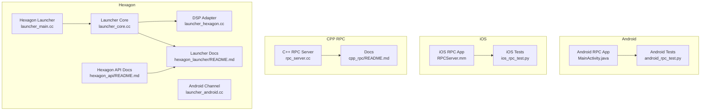
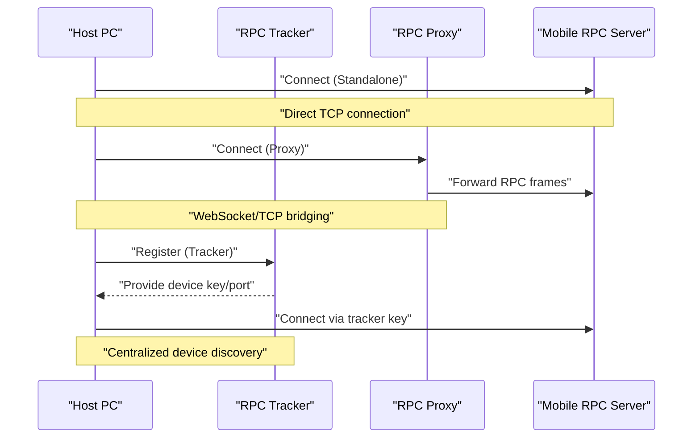
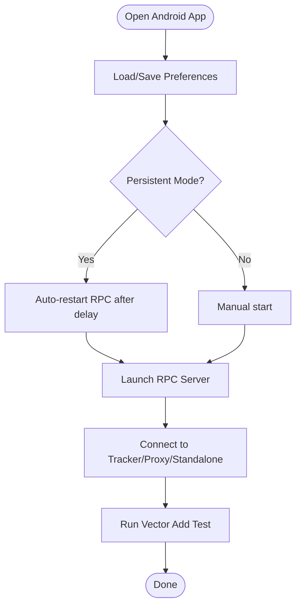
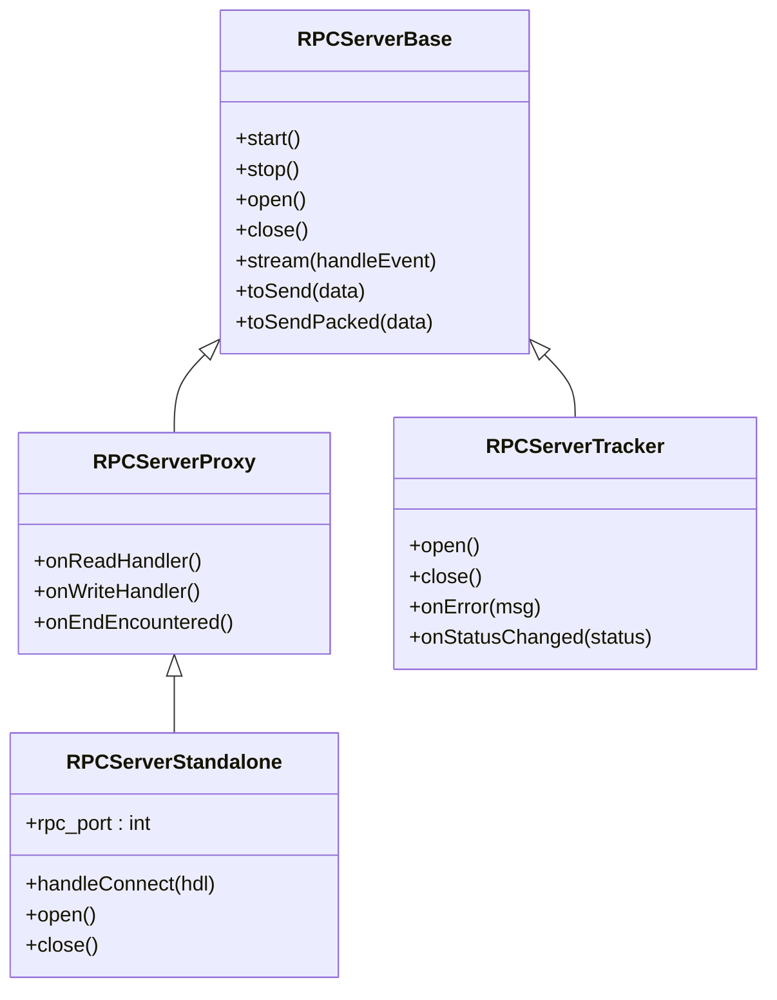
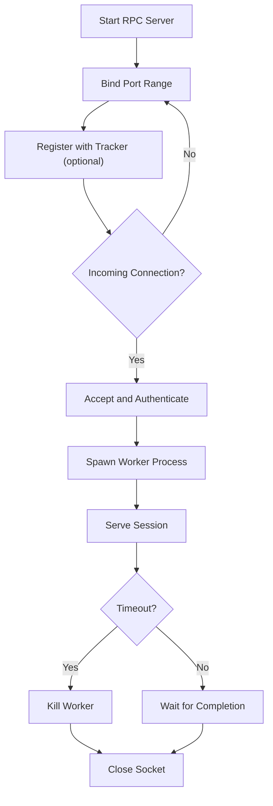
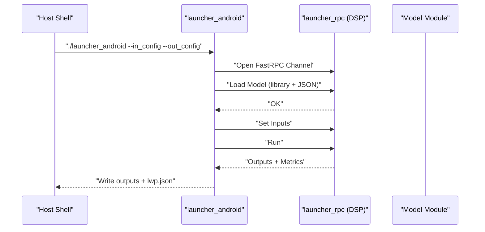
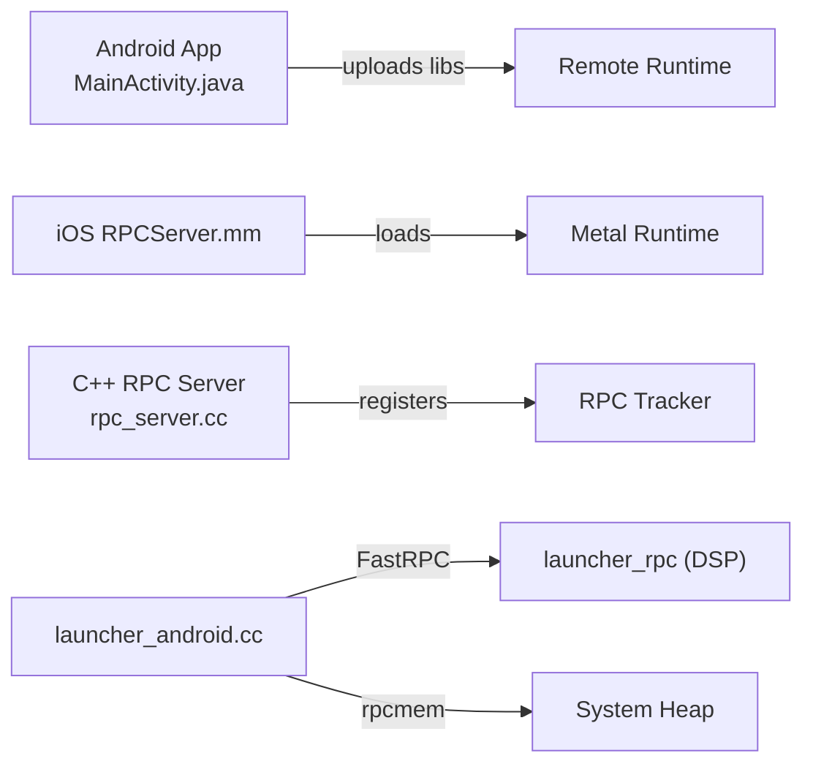

# Mobile Deployment

<cite>
**Referenced Files in This Document**
- [apps/android_rpc/README.md](file://apps/android_rpc/README.md)
- [apps/android_rpc/app/src/main/java/org/apache/tvm/tvmrpc/MainActivity.java](file://apps/android_rpc/app/src/main/java/org/apache/tvm/tvmrpc/MainActivity.java)
- [apps/android_rpc/tests/android_rpc_test.py](file://apps/android_rpc/tests/android_rpc_test.py)
- [apps/ios_rpc/README.md](file://apps/ios_rpc/README.md)
- [apps/ios_rpc/tvmrpc/AppDelegate.m](file://apps/ios_rpc/tvmrpc/AppDelegate.m)
- [apps/ios_rpc/tvmrpc/RPCServer.mm](file://apps/ios_rpc/tvmrpc/RPCServer.mm)
- [apps/ios_rpc/tests/ios_rpc_test.py](file://apps/ios_rpc/tests/ios_rpc_test.py)
- [apps/cpp_rpc/README.md](file://apps/cpp_rpc/README.md)
- [apps/cpp_rpc/rpc_server.cc](file://apps/cpp_rpc/rpc_server.cc)
- [apps/hexagon_api/README.md](file://apps/hexagon_api/README.md)
- [apps/hexagon_launcher/README.md](file://apps/hexagon_launcher/README.md)
- [apps/hexagon_launcher/launcher_main.cc](file://apps/hexagon_launcher/launcher_main.cc)
- [apps/hexagon_launcher/launcher_core.cc](file://apps/hexagon_launcher/launcher_core.cc)
- [apps/hexagon_launcher/launcher_hexagon.cc](file://apps/hexagon_launcher/launcher_hexagon.cc)
- [apps/hexagon_launcher/launcher_android.cc](file://apps/hexagon_launcher/launcher_android.cc)
</cite>

## Table of Contents
1. [Introduction](#introduction)
2. [Project Structure](#project-structure)
3. [Core Components](#core-components)
4. [Architecture Overview](#architecture-overview)
5. [Detailed Component Analysis](#detailed-component-analysis)
6. [Dependency Analysis](#dependency-analysis)
7. [Performance Considerations](#performance-considerations)
8. [Troubleshooting Guide](#troubleshooting-guide)
9. [Conclusion](#conclusion)
10. [Appendices](#appendices)

## Introduction
This document explains how to deploy TVM across Android, iOS, and embedded platforms using the RPC system. It covers:
- Android RPC client app and server-side orchestration
- iOS RPC server modes (standalone, proxy, tracker) and Metal runtime integration
- Qualcomm Hexagon DSP deployment via the Hexagon Graph Launcher
- Practical workflows for mobile inference, real-time processing, and edge computing
- Platform-specific APIs, permissions, and performance optimizations
- Security considerations, offline strategies, and troubleshooting

## Project Structure
The mobile deployment assets are organized under dedicated application folders:
- Android RPC app and tests
- iOS RPC app and tests
- Generic C++ RPC server for Linux/Android/Windows and embedded targets
- Hexagon API and launcher for DSP offload

**Diagram sources**
- [apps/android_rpc/app/src/main/java/org/apache/tvm/tvmrpc/MainActivity.java:1-161](file://apps/android_rpc/app/src/main/java/org/apache/tvm/tvmrpc/MainActivity.java#L1-L161)
- [apps/android_rpc/tests/android_rpc_test.py:1-87](file://apps/android_rpc/tests/android_rpc_test.py#L1-L87)
- [apps/ios_rpc/tvmrpc/RPCServer.mm:1-815](file://apps/ios_rpc/tvmrpc/RPCServer.mm#L1-L815)
- [apps/ios_rpc/tests/ios_rpc_test.py:1-98](file://apps/ios_rpc/tests/ios_rpc_test.py#L1-L98)
- [apps/cpp_rpc/rpc_server.cc:1-406](file://apps/cpp_rpc/rpc_server.cc#L1-L406)
- [apps/cpp_rpc/README.md:1-84](file://apps/cpp_rpc/README.md#L1-L84)
- [apps/hexagon_launcher/launcher_main.cc:1-160](file://apps/hexagon_launcher/launcher_main.cc#L1-L160)
- [apps/hexagon_launcher/launcher_core.cc:1-232](file://apps/hexagon_launcher/launcher_core.cc#L1-L232)
- [apps/hexagon_launcher/launcher_hexagon.cc:1-237](file://apps/hexagon_launcher/launcher_hexagon.cc#L1-L237)
- [apps/hexagon_launcher/launcher_android.cc:1-171](file://apps/hexagon_launcher/launcher_android.cc#L1-L171)
- [apps/hexagon_api/README.md:1-59](file://apps/hexagon_api/README.md#L1-L59)
- [apps/hexagon_launcher/README.md:1-146](file://apps/hexagon_launcher/README.md#L1-L146)

**Section sources**
- [apps/android_rpc/README.md:1-171](file://apps/android_rpc/README.md#L1-L171)
- [apps/ios_rpc/README.md:1-257](file://apps/ios_rpc/README.md#L1-L257)
- [apps/cpp_rpc/README.md:1-84](file://apps/cpp_rpc/README.md#L1-L84)
- [apps/hexagon_api/README.md:1-59](file://apps/hexagon_api/README.md#L1-L59)
- [apps/hexagon_launcher/README.md:1-146](file://apps/hexagon_launcher/README.md#L1-L146)

## Core Components
- Android RPC App: UI-driven RPC server launcher with persistent mode and preference persistence.
- iOS RPC App: Event-driven RPC server supporting standalone, proxy, and tracker modes; integrates Metal runtime.
- C++ RPC Server: Cross-platform RPC server for Linux/Android/Windows/embedded; supports tracker registration and timeouts.
- Hexagon Launcher: Multi-binary launcher for Android and Hexagon DSP; loads models and executes via RPC/FastRPC channels; supports profiling.

**Section sources**
- [apps/android_rpc/app/src/main/java/org/apache/tvm/tvmrpc/MainActivity.java:34-160](file://apps/android_rpc/app/src/main/java/org/apache/tvm/tvmrpc/MainActivity.java#L34-L160)
- [apps/ios_rpc/tvmrpc/RPCServer.mm:113-815](file://apps/ios_rpc/tvmrpc/RPCServer.mm#L113-L815)
- [apps/cpp_rpc/rpc_server.cc:106-362](file://apps/cpp_rpc/rpc_server.cc#L106-L362)
- [apps/hexagon_launcher/launcher_main.cc:67-159](file://apps/hexagon_launcher/launcher_main.cc#L67-L159)

## Architecture Overview
The mobile deployment architecture centers on the TVM RPC protocol. Clients (host-side Python scripts) connect to mobile RPC servers using three primary patterns:
- Standalone: Direct TCP connection from host to device IP/port.
- Proxy: Host-side proxy relays RPC traffic to the device.
- Tracker: Device registers with a central tracker; clients request devices by key.

**Diagram sources**
- [apps/ios_rpc/README.md:115-214](file://apps/ios_rpc/README.md#L115-L214)
- [apps/android_rpc/README.md:100-136](file://apps/android_rpc/README.md#L100-L136)
- [apps/cpp_rpc/README.md:69-80](file://apps/cpp_rpc/README.md#L69-L80)

## Detailed Component Analysis

### Android RPC Client
- UI and lifecycle:
  - Persistent mode restarts the RPC server automatically after a delay.
  - Preferences saved for host, port, key, and persistence toggle.
- Build and install:
  - Gradle-based build with TVM4J dependency; optional OpenCL support.
- Cross-compilation and testing:
  - Uses a standalone Android NDK toolchain; compiles CPU/GPU targets.
  - Test script demonstrates tracker-based connection and OpenCL/Vulkan toggles.

**Diagram sources**
- [apps/android_rpc/app/src/main/java/org/apache/tvm/tvmrpc/MainActivity.java:51-94](file://apps/android_rpc/app/src/main/java/org/apache/tvm/tvmrpc/MainActivity.java#L51-L94)
- [apps/android_rpc/README.md:25-82](file://apps/android_rpc/README.md#L25-L82)
- [apps/android_rpc/tests/android_rpc_test.py:38-86](file://apps/android_rpc/tests/android_rpc_test.py#L38-L86)

**Section sources**
- [apps/android_rpc/app/src/main/java/org/apache/tvm/tvmrpc/MainActivity.java:34-160](file://apps/android_rpc/app/src/main/java/org/apache/tvm/tvmrpc/MainActivity.java#L34-L160)
- [apps/android_rpc/README.md:25-171](file://apps/android_rpc/README.md#L25-L171)
- [apps/android_rpc/tests/android_rpc_test.py:18-87](file://apps/android_rpc/tests/android_rpc_test.py#L18-L87)

### iOS RPC Server
- Modes:
  - Standalone: Binds a local TCP port and prints device IP/port for direct host connection.
  - Proxy: Communicates via a host-side proxy using a dedicated event-driven handler.
  - Tracker: Registers with a tracker and waits for requests.
- Metal runtime integration:
  - Uses Metal-compatible targets and a global callback to compile Metal kernels for iOS.
- Network connectivity:
  - Detects WiFi IP address for standalone mode; supports USB-based connections via usbmux/iproxy for offline scenarios.

**Diagram sources**
- [apps/ios_rpc/tvmrpc/RPCServer.mm:113-815](file://apps/ios_rpc/tvmrpc/RPCServer.mm#L113-L815)

**Section sources**
- [apps/ios_rpc/README.md:93-257](file://apps/ios_rpc/README.md#L93-L257)
- [apps/ios_rpc/tvmrpc/RPCServer.mm:84-111](file://apps/ios_rpc/tvmrpc/RPCServer.mm#L84-L111)
- [apps/ios_rpc/tests/ios_rpc_test.py:39-97](file://apps/ios_rpc/tests/ios_rpc_test.py#L39-L97)

### C++ RPC Server (Linux/Android/Windows/Embedded)
- Features:
  - Binds a TCP port range and listens for connections.
  - Supports tracker registration and key-based matching.
  - Fork-based per-session server loop with optional timeout.
- Cross-compilation:
  - Android toolchain and embedded Linux targets supported.
  - Optional OpenCL support via wrapper or system library.

**Diagram sources**
- [apps/cpp_rpc/rpc_server.cc:137-242](file://apps/cpp_rpc/rpc_server.cc#L137-L242)
- [apps/cpp_rpc/README.md:21-84](file://apps/cpp_rpc/README.md#L21-L84)

**Section sources**
- [apps/cpp_rpc/rpc_server.cc:106-362](file://apps/cpp_rpc/rpc_server.cc#L106-L362)
- [apps/cpp_rpc/README.md:18-84](file://apps/cpp_rpc/README.md#L18-L84)

### Hexagon DSP Deployment
- Components:
  - Android part: FastRPC channel setup, unsigned PD enablement, remote stack sizing, and memory allocation via rpcmem.
  - DSP part: RPC adapter implementing launcher RPC functions (load/unload/run/get/set).
  - Launcher: Parses model config, loads model, sets inputs, runs, collects outputs, and writes profiling JSON.
- Build and execution:
  - Separate Hexagon and Android builds; launcher binaries copied to device; model artifacts deployed alongside.

**Diagram sources**
- [apps/hexagon_launcher/launcher_main.cc:67-159](file://apps/hexagon_launcher/launcher_main.cc#L67-L159)
- [apps/hexagon_launcher/launcher_android.cc:57-170](file://apps/hexagon_launcher/launcher_android.cc#L57-L170)
- [apps/hexagon_launcher/launcher_hexagon.cc:64-236](file://apps/hexagon_launcher/launcher_hexagon.cc#L64-L236)
- [apps/hexagon_launcher/launcher_core.cc:159-232](file://apps/hexagon_launcher/launcher_core.cc#L159-L232)

**Section sources**
- [apps/hexagon_api/README.md:18-59](file://apps/hexagon_api/README.md#L18-L59)
- [apps/hexagon_launcher/README.md:17-146](file://apps/hexagon_launcher/README.md#L17-L146)
- [apps/hexagon_launcher/launcher_main.cc:67-159](file://apps/hexagon_launcher/launcher_main.cc#L67-L159)
- [apps/hexagon_launcher/launcher_core.cc:159-232](file://apps/hexagon_launcher/launcher_core.cc#L159-L232)
- [apps/hexagon_launcher/launcher_hexagon.cc:64-236](file://apps/hexagon_launcher/launcher_hexagon.cc#L64-L236)
- [apps/hexagon_launcher/launcher_android.cc:57-170](file://apps/hexagon_launcher/launcher_android.cc#L57-L170)

## Dependency Analysis
- Android:
  - App depends on tvm4j for runtime bindings; OpenCL support is optional.
  - Test script depends on tracker environment variables and NDK cross-compiler.
- iOS:
  - RPC server depends on TVM’s event-driven RPC server and Metal compiler callback.
  - Tests depend on xcode Metal SDK configuration.
- C++ RPC:
  - Depends on TVM runtime RPC endpoint and socket utilities; supports tracker and timeouts.
- Hexagon:
  - Android launcher depends on FastRPC and rpcmem; DSP adapter depends on TVM runtime and Hexagon device API.

**Diagram sources**
- [apps/android_rpc/app/src/main/java/org/apache/tvm/tvmrpc/MainActivity.java:51-77](file://apps/android_rpc/app/src/main/java/org/apache/tvm/tvmrpc/MainActivity.java#L51-L77)
- [apps/ios_rpc/tvmrpc/RPCServer.mm:63-82](file://apps/ios_rpc/tvmrpc/RPCServer.mm#L63-L82)
- [apps/cpp_rpc/rpc_server.cc:152-175](file://apps/cpp_rpc/rpc_server.cc#L152-L175)
- [apps/hexagon_launcher/launcher_android.cc:57-82](file://apps/hexagon_launcher/launcher_android.cc#L57-L82)

**Section sources**
- [apps/android_rpc/README.md:25-82](file://apps/android_rpc/README.md#L25-L82)
- [apps/ios_rpc/README.md:33-103](file://apps/ios_rpc/README.md#L33-L103)
- [apps/cpp_rpc/README.md:21-56](file://apps/cpp_rpc/README.md#L21-L56)
- [apps/hexagon_launcher/README.md:19-90](file://apps/hexagon_launcher/README.md#L19-L90)

## Performance Considerations
- Android:
  - Prefer GPU backends (OpenCL/Vulkan) when available; fallback to CPU for compatibility.
  - Use vectorized schedules and target-specific tuning to maximize throughput.
- iOS:
  - Metal runtime provides strong GPU performance; ensure proper target triple and SDK selection.
  - Background execution and app lifecycle transitions can interrupt sessions; design for reconnection.
- Embedded/Linux:
  - Use minimal runtime footprint; enable OpenCL only when present to avoid dynamic load failures.
  - Tune port ranges and timeouts to match constrained environments.
- Hexagon:
  - Enable unsigned PD and adjust remote stack size for DSP sessions.
  - Use profiling flags to collect LWP metrics and optimize kernels.

[No sources needed since this section provides general guidance]

## Troubleshooting Guide
- Android:
  - Signature mismatch during install: uninstall previous version before installing signed APK.
  - Gradle version conflicts: upgrade wrapper distribution to meet minimum required version.
  - OpenCL/Vulkan availability: device may lack drivers; compile for CPU as fallback.
- iOS:
  - Untrusted developer prompt: approve in Settings after first run.
  - Standalone IP unknown: device may lack Wi-Fi; use usbmux/iproxy for USB-based connection.
  - Proxy/Tracker registration: verify tracker address and key; confirm server reports to tracker.
- C++ RPC:
  - Port binding failures: adjust port range; ensure firewall allows inbound connections.
  - Tracker mismatch: verify key format and tracker connectivity.
- Hexagon:
  - FastRPC channel open failure: ensure unsigned PD enabled and remote stack size adequate.
  - Model load errors: verify module type and JSON consistency; check DSP device API availability.

**Section sources**
- [apps/android_rpc/README.md:63-171](file://apps/android_rpc/README.md#L63-L171)
- [apps/ios_rpc/README.md:83-91](file://apps/ios_rpc/README.md#L83-L91)
- [apps/ios_rpc/README.md:222-257](file://apps/ios_rpc/README.md#L222-L257)
- [apps/cpp_rpc/README.md:69-84](file://apps/cpp_rpc/README.md#L69-L84)
- [apps/hexagon_launcher/launcher_android.cc:34-55](file://apps/hexagon_launcher/launcher_android.cc#L34-L55)

## Conclusion
TVM’s mobile deployment stack provides flexible RPC pathways for Android, iOS, and embedded targets, with robust DSP offload for Hexagon. By selecting the appropriate connection mode, optimizing for platform constraints, and leveraging profiling and offline strategies, teams can deliver efficient, secure, and maintainable mobile inference systems.

[No sources needed since this section summarizes without analyzing specific files]

## Appendices

### Practical Workflows and Examples
- Android:
  - Start tracker, connect app, run vector addition on CPU/GPU, and validate results.
  - Reference: [android_rpc/README.md:100-158](file://apps/android_rpc/README.md#L100-L158), [android_rpc_test.py:49-86](file://apps/android_rpc/tests/android_rpc_test.py#L49-L86)
- iOS:
  - Choose standalone/proxy/tracker mode; compile Metal kernel; upload and run on device.
  - Reference: [ios_rpc/README.md:115-214](file://apps/ios_rpc/README.md#L115-L214), [ios_rpc_test.py:45-97](file://apps/ios_rpc/tests/ios_rpc_test.py#L45-L97)
- C++ RPC:
  - Build tvm_runtime and tvm_rpc; start server with host/port/tracker/key; serve sessions.
  - Reference: [cpp_rpc/README.md:21-84](file://apps/cpp_rpc/README.md#L21-L84), [rpc_server.cc:390-398](file://apps/cpp_rpc/rpc_server.cc#L390-L398)
- Hexagon:
  - Build Android and DSP components; copy binaries to device; run launcher with input config.
  - Reference: [hexagon_launcher/README.md:34-90](file://apps/hexagon_launcher/README.md#L34-L90), [launcher_main.cc:67-159](file://apps/hexagon_launcher/launcher_main.cc#L67-L159)

### Security and Offline Strategies
- Security:
  - Use tracker-based device registration to control access; enforce keys and timeouts.
  - iOS sandbox restrictions require bundling libraries or using debug-time JIT via custom dlopen plugin.
- Offline:
  - Use usbmux/iproxy for USB-based RPC when Wi-Fi is unavailable or unstable.
  - Pre-deploy model artifacts and runtime libraries to minimize bandwidth usage.

**Section sources**
- [apps/ios_rpc/README.md:33-103](file://apps/ios_rpc/README.md#L33-L103)
- [apps/ios_rpc/README.md:216-257](file://apps/ios_rpc/README.md#L216-L257)
- [apps/android_rpc/README.md:100-136](file://apps/android_rpc/README.md#L100-L136)