# Mobile Performance Optimization

<cite>
**Referenced Files in This Document**
- [README.md](file://apps/android_rpc/README.md)
- [README.md](file://apps/ios_rpc/README.md)
- [config.mk](file://apps/android_rpc/app/src/main/jni/make/config.mk)
- [init_proj.py](file://apps/ios_rpc/init_proj.py)
- [module.cc](file://src/runtime/module.cc)
- [profiling.cc](file://src/runtime/profiling.cc)
- [profiling.h](file://include/tvm/runtime/profiling.h)
- [workspace_pool.cc](file://src/runtime/workspace_pool.cc)
- [workspace_pool.h](file://src/runtime/workspace_pool.h)
- [threading_backend.cc](file://src/runtime/threading_backend.cc)
- [dlpack.h](file://3rdparty/tvm-ffi/examples/cubin_launcher/embedded_cubin/include_bin2c/main.py)
- [cross_compilation_and_rpc.py](file://docs/how_to/tutorials/cross_compilation_and_rpc.py)
- [runtime.rst](file://docs/arch/runtime.rst)
- [device_target_interactions.rst](file://docs/arch/device_target_interactions.rst)
- [hexagon_profiler.py](file://python/tvm/contrib/hexagon/hexagon_profiler.py)
- [tflite_frontend.py](file://python/tvm/relax/frontend/tflite/tflite_frontend.py)
- [rpc_module.cc](file://src/runtime/rpc/rpc_module.cc)
- [rpc_socket_impl.cc](file://src/runtime/rpc/rpc_socket_impl.cc)
- [server.py](file://python/tvm/rpc/server.py)
- [server_ios_launcher.py](file://python/tvm/rpc/server_ios_launcher.py)
- [meta_schedule/profiler.cc](file://src/s_tir/meta_schedule/profiler.cc)
</cite>

## Table of Contents
1. [Introduction](#introduction)
2. [Project Structure](#project-structure)
3. [Core Components](#core-components)
4. [Architecture Overview](#architecture-overview)
5. [Detailed Component Analysis](#detailed-component-analysis)
6. [Dependency Analysis](#dependency-analysis)
7. [Performance Considerations](#performance-considerations)
8. [Troubleshooting Guide](#troubleshooting-guide)
9. [Conclusion](#conclusion)
10. [Appendices](#appendices)

## Introduction
This document provides a comprehensive guide to mobile-specific performance optimization for Android, iOS, and embedded platforms using the TVM runtime and toolchain. It covers memory management, battery life and thermal considerations, GPU utilization, CPU scheduling, power-efficient computation patterns, model quantization, operator fusion, memory layout optimizations, and practical profiling/benchmarking workflows. It also includes platform-specific deployment guides, monitoring tools, and debugging techniques tailored for mobile inference.

## Project Structure
The repository organizes mobile-focused capabilities across:
- Android and iOS RPC applications for remote execution and profiling
- Runtime profiling infrastructure for device-aware timing and metrics
- Memory workspace pooling for reduced allocation overhead
- Threading backend for CPU affinity and scheduling on heterogeneous cores
- Quantization and operator fusion pathways in the frontend
- Cross-compilation and RPC deployment workflows

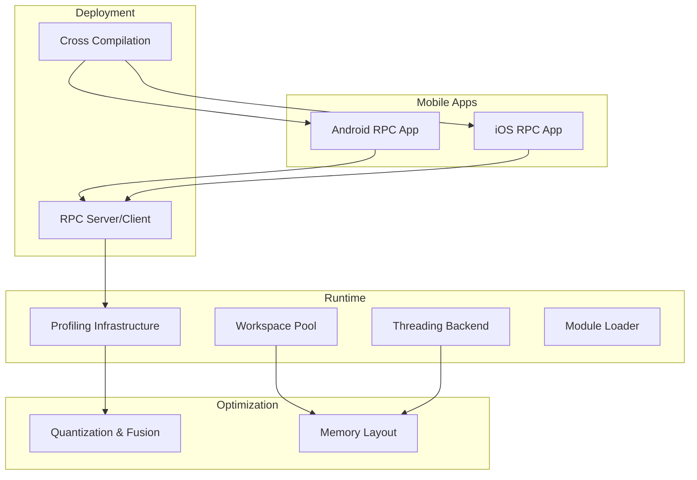

**Section sources**
- [README.md:1-171](file://apps/android_rpc/README.md#L1-L171)
- [README.md:1-257](file://apps/ios_rpc/README.md#L1-L257)
- [runtime.rst:136-160](file://docs/arch/runtime.rst#L136-L160)

## Core Components
- Android and iOS RPC apps enable deploying compiled models to devices and executing them remotely for profiling and benchmarking.
- Runtime profiling supports device-specific timers, per-call metrics, and aggregation into reports.
- Workspace pooling reduces temporary allocation churn and improves cache locality.
- Threading backend manages CPU affinity and thread placement for power and performance balance.
- Quantization and fusion in the frontend reduce compute and memory traffic.
- Cross-compilation and RPC workflows streamline deployment across diverse mobile targets.

**Section sources**
- [README.md:1-171](file://apps/android_rpc/README.md#L1-L171)
- [README.md:1-257](file://apps/ios_rpc/README.md#L1-L257)
- [profiling.cc:122-937](file://src/runtime/profiling.cc#L122-L937)
- [workspace_pool.cc:1-168](file://src/runtime/workspace_pool.cc#L1-L168)
- [threading_backend.cc:261-328](file://src/runtime/threading_backend.cc#L261-L328)
- [tflite_frontend.py:1233-1947](file://python/tvm/relax/frontend/tflite/tflite_frontend.py#L1233-L1947)
- [cross_compilation_and_rpc.py:380-408](file://docs/how_to/tutorials/cross_compilation_and_rpc.py#L380-L408)

## Architecture Overview
The mobile optimization architecture integrates:
- Device-aware profiling and reporting
- Power-aware CPU scheduling and memory pooling
- Quantization and operator fusion to reduce compute and memory
- Cross-compilation and RPC for seamless deployment

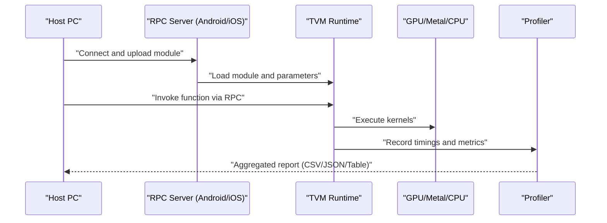

**Diagram sources**
- [rpc_module.cc:405-429](file://src/runtime/rpc/rpc_module.cc#L405-L429)
- [rpc_socket_impl.cc:105-127](file://src/runtime/rpc/rpc_socket_impl.cc#L105-L127)
- [profiling.cc:122-937](file://src/runtime/profiling.cc#L122-L937)

**Section sources**
- [rpc_module.cc:405-429](file://src/runtime/rpc/rpc_module.cc#L405-L429)
- [rpc_socket_impl.cc:105-127](file://src/runtime/rpc/rpc_socket_impl.cc#L105-L127)
- [profiling.cc:122-937](file://src/runtime/profiling.cc#L122-L937)

## Detailed Component Analysis

### Android RPC App
- Supports building APKs with optional OpenCL/Vulkan backends and cross-compiles shared libraries for Android architectures.
- Integrates with RPC tracker/proxy for device connectivity and testing.
- Demonstrates GPU acceleration (OpenCL flavor) and fallback CPU execution.

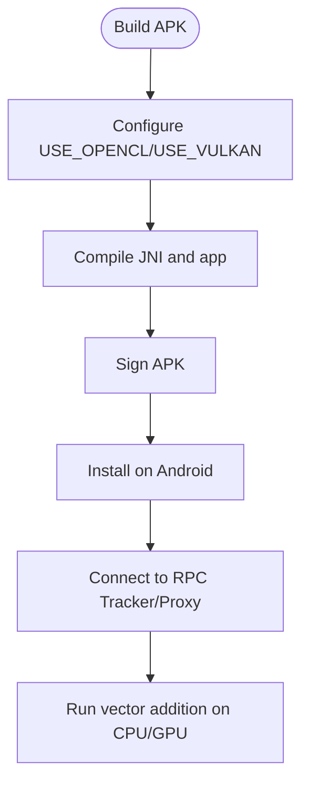

**Diagram sources**
- [README.md:25-171](file://apps/android_rpc/README.md#L25-L171)
- [config.mk:32-58](file://apps/android_rpc/app/src/main/jni/make/config.mk#L32-L58)

**Section sources**
- [README.md:25-171](file://apps/android_rpc/README.md#L25-L171)
- [config.mk:32-58](file://apps/android_rpc/app/src/main/jni/make/config.mk#L32-L58)

### iOS RPC App
- Provides three operational modes: standalone, proxy, and tracker.
- Uses a custom DSO loader plugin to bypass iOS restrictions for dynamic loading under debug sessions.
- Supports Metal runtime and CPU execution.

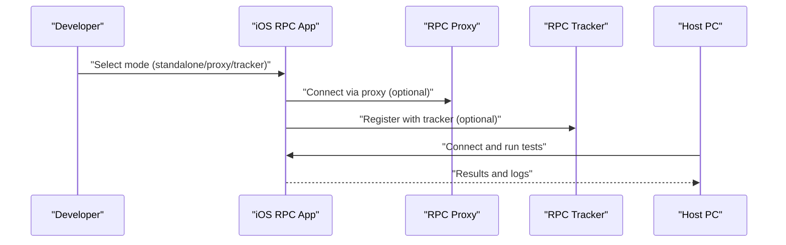

**Diagram sources**
- [README.md:93-257](file://apps/ios_rpc/README.md#L93-L257)
- [server.py:495-553](file://python/tvm/rpc/server.py#L495-L553)
- [server_ios_launcher.py:487-503](file://python/tvm/rpc/server_ios_launcher.py#L487-L503)

**Section sources**
- [README.md:93-257](file://apps/ios_rpc/README.md#L93-L257)
- [server.py:495-553](file://python/tvm/rpc/server.py#L495-L553)
- [server_ios_launcher.py:487-503](file://python/tvm/rpc/server_ios_launcher.py#L487-L503)

### Runtime Profiling and Benchmarking
- Device-specific timers and a profiler record per-call durations, counts, and device metrics.
- Reports support CSV, JSON, and human-readable tables; includes aggregation and percentage breakdowns.
- TimeEvaluator wraps packed functions to collect robust timing with adaptive repeat/number and cooldown.

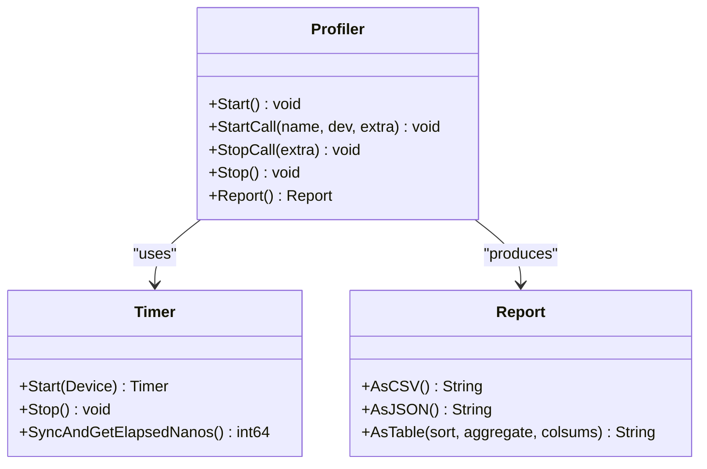

**Diagram sources**
- [profiling.h:46-591](file://include/tvm/runtime/profiling.h#L46-L591)
- [profiling.cc:122-937](file://src/runtime/profiling.cc#L122-L937)

**Section sources**
- [profiling.h:46-591](file://include/tvm/runtime/profiling.h#L46-L591)
- [profiling.cc:122-937](file://src/runtime/profiling.cc#L122-L937)

### Memory Workspace Pooling
- Reduces temporary allocation overhead by reusing device workspace pages aligned to page boundaries.
- Improves cache locality and reduces fragmentation during operator execution.

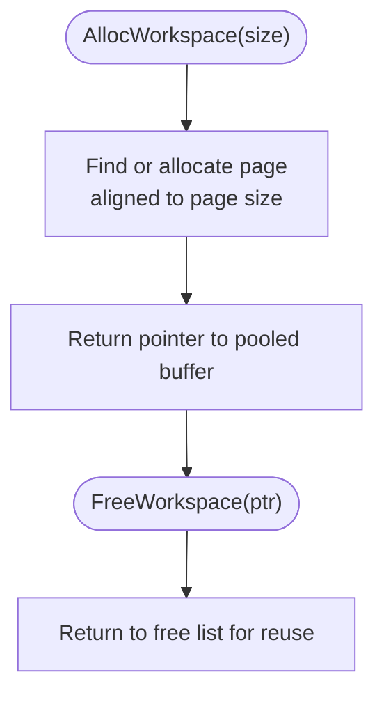

**Diagram sources**
- [workspace_pool.h:45-81](file://src/runtime/workspace_pool.h#L45-L81)
- [workspace_pool.cc:46-168](file://src/runtime/workspace_pool.cc#L46-L168)

**Section sources**
- [workspace_pool.h:45-81](file://src/runtime/workspace_pool.h#L45-L81)
- [workspace_pool.cc:46-168](file://src/runtime/workspace_pool.cc#L46-L168)

### CPU Scheduling and Thermal Management
- CPU affinity and thread placement leverage per-core frequency and topology to avoid hotspots and reduce thermal throttling.
- Supports modes for big/little cores and explicit thread sharing policies.

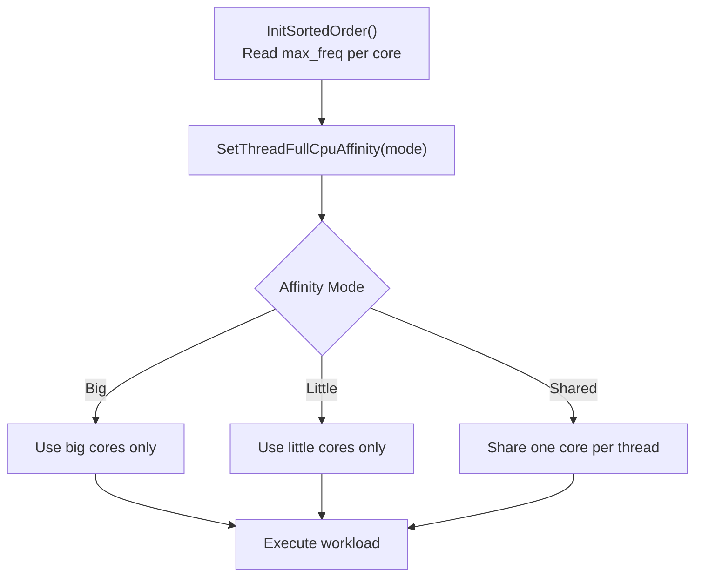

**Diagram sources**
- [threading_backend.cc:261-328](file://src/runtime/threading_backend.cc#L261-L328)

**Section sources**
- [threading_backend.cc:261-328](file://src/runtime/threading_backend.cc#L261-L328)

### GPU Utilization Optimization
- Android app supports OpenCL and Vulkan backends; Vulkan may require compatible drivers.
- iOS app leverages Metal runtime for GPU acceleration.

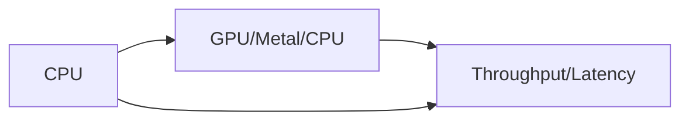

**Section sources**
- [README.md:75-158](file://apps/android_rpc/README.md#L75-L158)
- [README.md:34-66](file://apps/ios_rpc/README.md#L34-L66)

### Power-Efficient Computation Patterns
- Use device-specific timers to isolate GPU/CPU costs and minimize unnecessary synchronization.
- Warm-up iterations before profiling to stabilize caches and power states.
- Cooldown intervals between repeated measurements to avoid thermal lag.

**Section sources**
- [profiling.cc:857-914](file://src/runtime/profiling.cc#L857-L914)

### Model Quantization and Operator Fusion
- Frontend converts quantized operators and fuses activations to reduce memory bandwidth and improve throughput.
- Enables requantize and fused activation handling for QNN operators.

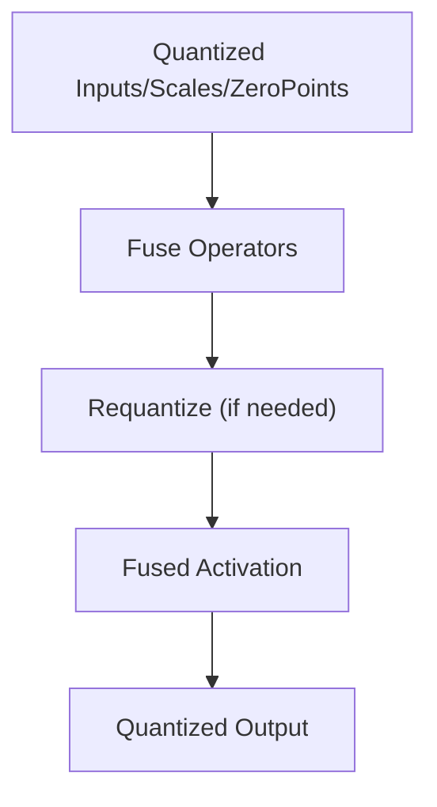

**Diagram sources**
- [tflite_frontend.py:1233-1947](file://python/tvm/relax/frontend/tflite/tflite_frontend.py#L1233-L1947)

**Section sources**
- [tflite_frontend.py:1233-1947](file://python/tvm/relax/frontend/tflite/tflite_frontend.py#L1233-L1947)

### Memory Layout Optimizations
- Workspace pool aligns allocations to page boundaries and recycles buffers to reduce TLB pressure and improve cache locality.
- Device target interactions distinguish data space vs. workspace allocations for optimal memory usage.

**Section sources**
- [workspace_pool.cc:46-168](file://src/runtime/workspace_pool.cc#L46-L168)
- [device_target_interactions.rst:78-98](file://docs/arch/device_target_interactions.rst#L78-L98)

### Cross-Compilation and RPC Deployment
- Cross-compilation builds device-specific shared libraries; RPC uploads and executes modules remotely.
- RPC server supports tracker/proxy modes for flexible connectivity.

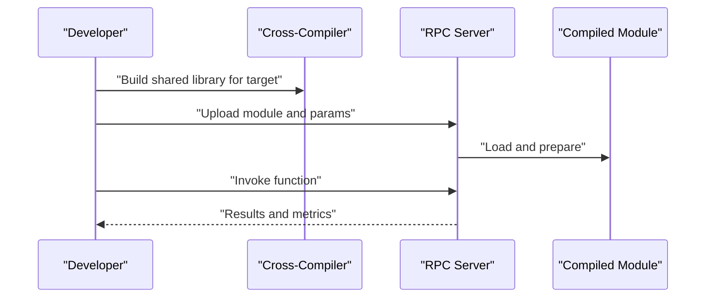

**Diagram sources**
- [cross_compilation_and_rpc.py:380-408](file://docs/how_to/tutorials/cross_compilation_and_rpc.py#L380-L408)
- [README.md:83-139](file://apps/android_rpc/README.md#L83-L139)
- [README.md:93-214](file://apps/ios_rpc/README.md#L93-L214)

**Section sources**
- [cross_compilation_and_rpc.py:380-408](file://docs/how_to/tutorials/cross_compilation_and_rpc.py#L380-L408)
- [README.md:83-139](file://apps/android_rpc/README.md#L83-L139)
- [README.md:93-214](file://apps/ios_rpc/README.md#L93-L214)

## Dependency Analysis
- Runtime-enabled checks gate optional device backends (e.g., CUDA, OpenCL, Metal, Vulkan).
- Profiling depends on timers and device APIs; RPC bridges host and device execution.
- Threading backend integrates with CPU topology and scheduler.

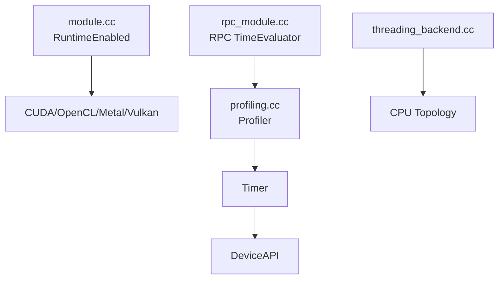

**Diagram sources**
- [module.cc:38-69](file://src/runtime/module.cc#L38-L69)
- [profiling.cc:122-937](file://src/runtime/profiling.cc#L122-L937)
- [rpc_module.cc:405-429](file://src/runtime/rpc/rpc_module.cc#L405-L429)
- [threading_backend.cc:261-328](file://src/runtime/threading_backend.cc#L261-L328)

**Section sources**
- [module.cc:38-69](file://src/runtime/module.cc#L38-L69)
- [profiling.cc:122-937](file://src/runtime/profiling.cc#L122-L937)
- [rpc_module.cc:405-429](file://src/runtime/rpc/rpc_module.cc#L405-L429)
- [threading_backend.cc:261-328](file://src/runtime/threading_backend.cc#L261-L328)

## Performance Considerations
- Latency optimization
  - Warm-up before timing; use device-specific timers to avoid CPU-GPU synchronization overhead.
  - Minimize repeated allocations by leveraging workspace pooling.
- Throughput maximization
  - Prefer big cores for heavy compute; reserve little cores for background tasks.
  - Fuse operators and use quantization to reduce memory bandwidth.
- Battery and thermal
  - Avoid sustained high-frequency operation; use cooldown intervals between repeated runs.
  - Prefer Metal on iOS and GPU backends on Android when available.

[No sources needed since this section provides general guidance]

## Troubleshooting Guide
- Android Vulkan initialization failures
  - Driver incompatibility may prevent Vulkan initialization; fallback to CPU/OpenCL.
- iOS dynamic library loading
  - Use custom DSO loader plugin under debug sessions; ensure signing and provisioning profiles.
- RPC connectivity
  - Use tracker/proxy modes when Wi-Fi is unavailable; USB multiplexing (usbmux/iproxy) can improve stability.

**Section sources**
- [README.md:140-158](file://apps/android_rpc/README.md#L140-L158)
- [README.md:68-92](file://apps/ios_rpc/README.md#L68-L92)
- [README.md:216-257](file://apps/ios_rpc/README.md#L216-L257)

## Conclusion
By combining device-aware profiling, memory pooling, CPU scheduling, and quantization/fusion optimizations, TVM enables robust, power-efficient mobile inference across Android, iOS, and embedded targets. The RPC and cross-compilation workflows simplify deployment, while comprehensive reporting and benchmarking provide actionable insights for continuous optimization.

[No sources needed since this section summarizes without analyzing specific files]

## Appendices

### Practical Profiling and Benchmarking Workflow
- Prepare device: connect via RPC tracker/proxy or standalone.
- Build and upload module for target architecture.
- Warm up and run TimeEvaluator with adaptive repeat/number and cooldown.
- Inspect CSV/JSON/table reports for per-operator breakdowns and device metrics.

**Section sources**
- [profiling.cc:581-914](file://src/runtime/profiling.cc#L581-L914)
- [README.md:100-139](file://apps/android_rpc/README.md#L100-L139)
- [README.md:132-214](file://apps/ios_rpc/README.md#L132-L214)

### Platform-Specific Guides
- Android
  - Configure OpenCL/Vulkan flags; build APK; install and run tests.
- iOS
  - Initialize Xcode project with team ID and build libtvm_runtime.dylib; use proxy/tracker modes.

**Section sources**
- [config.mk:32-58](file://apps/android_rpc/app/src/main/jni/make/config.mk#L32-L58)
- [init_proj.py:17-57](file://apps/ios_rpc/init_proj.py#L17-L57)

### Performance Monitoring Tools
- Built-in profiler reports (CSV/JSON/Table) and device metrics.
- Meta-schedule profiler for structured profiling workflows.

**Section sources**
- [profiling.cc:251-703](file://src/runtime/profiling.cc#L251-L703)
- [meta_schedule/profiler.cc:40-125](file://src/s_tir/meta_schedule/profiler.cc#L40-L125)

### Debugging Techniques
- Hexagon profiling utilities for LWP output processing and logcat integration.
- RPC server lifecycle and termination controls for iterative debugging.

**Section sources**
- [hexagon_profiler.py:94-125](file://python/tvm/contrib/hexagon/hexagon_profiler.py#L94-L125)
- [server.py:543-553](file://python/tvm/rpc/server.py#L543-L553)