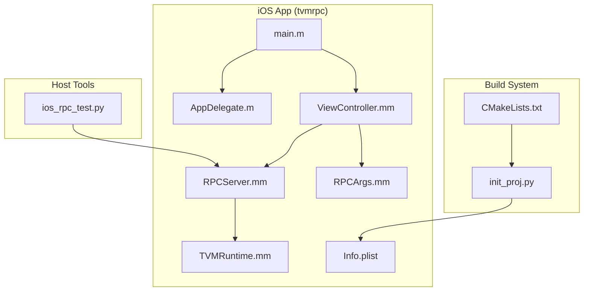
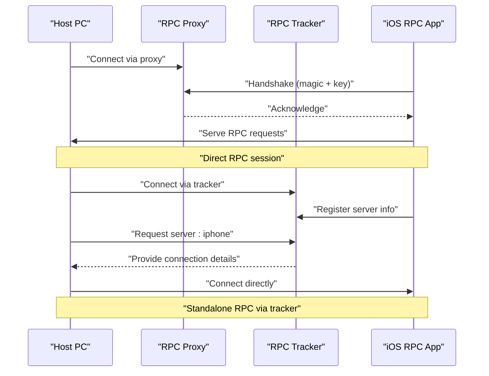
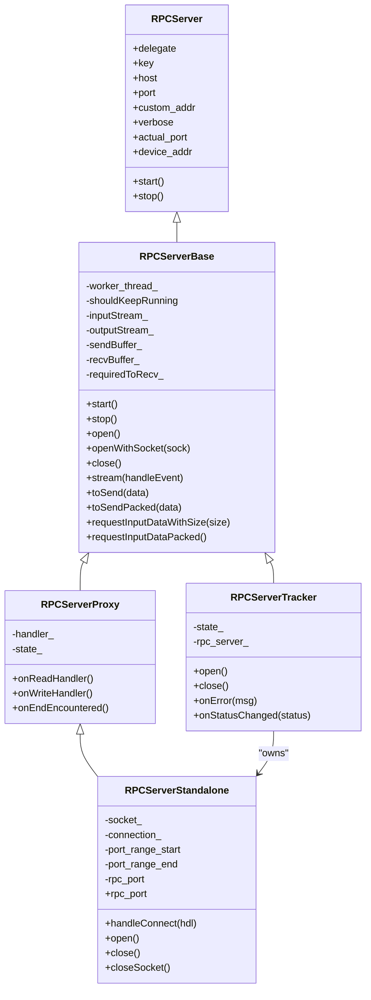
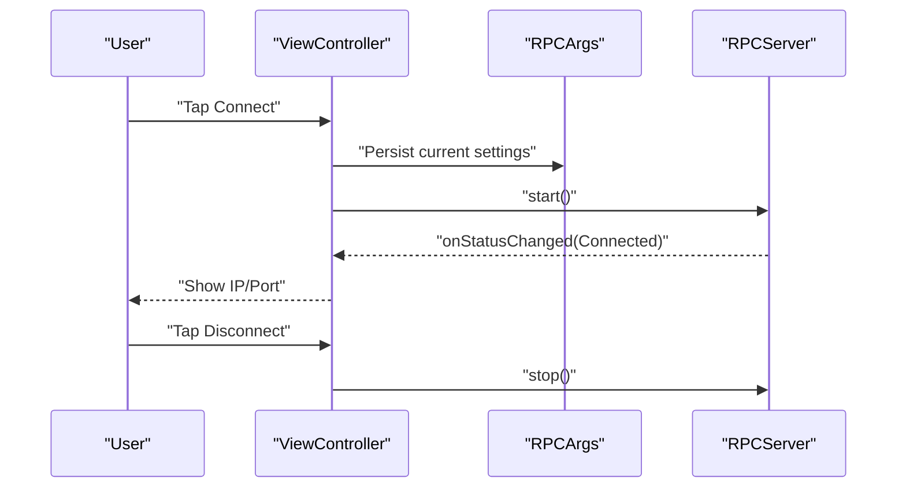
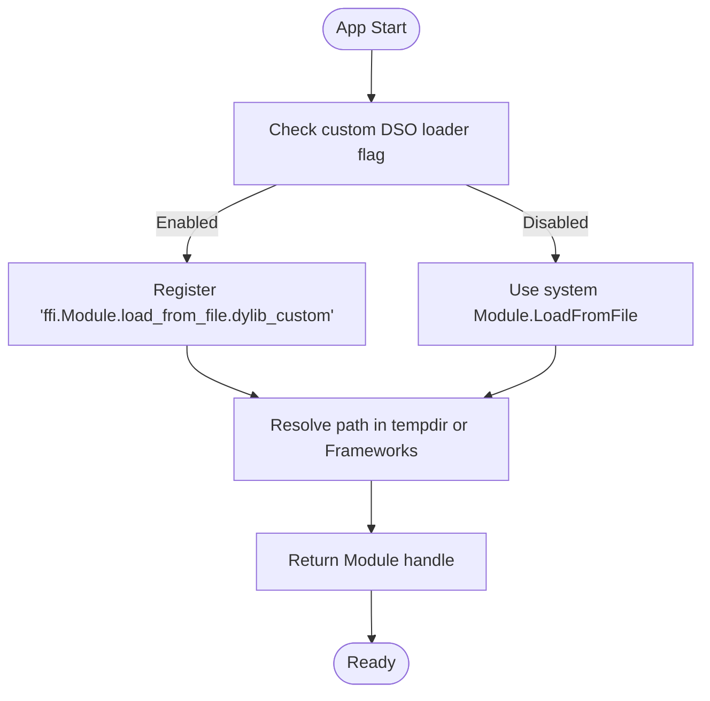
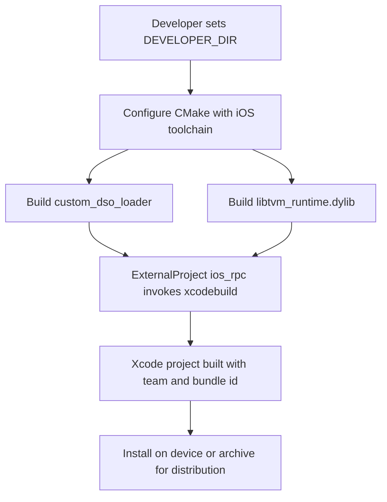
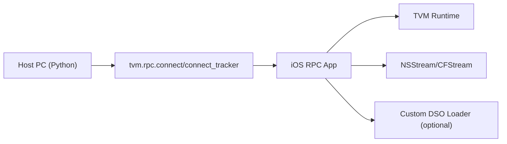

# iOS Integration

<cite>
**Referenced Files in This Document**
- [README.md](file://apps/ios_rpc/README.md)
- [CMakeLists.txt](file://apps/ios_rpc/CMakeLists.txt)
- [init_proj.py](file://apps/ios_rpc/init_proj.py)
- [RPCServer.h](file://apps/ios_rpc/tvmrpc/RPCServer.h)
- [RPCServer.mm](file://apps/ios_rpc/tvmrpc/RPCServer.mm)
- [ViewController.h](file://apps/ios_rpc/tvmrpc/ViewController.h)
- [ViewController.mm](file://apps/ios_rpc/tvmrpc/ViewController.mm)
- [RPCArgs.h](file://apps/ios_rpc/tvmrpc/RPCArgs.h)
- [RPCArgs.mm](file://apps/ios_rpc/tvmrpc/RPCArgs.mm)
- [TVMRuntime.mm](file://apps/ios_rpc/tvmrpc/TVMRuntime.mm)
- [Info.plist](file://apps/ios_rpc/tvmrpc/Info.plist)
- [main.m](file://apps/ios_rpc/tvmrpc/main.m)
- [ios_rpc_test.py](file://apps/ios_rpc/tests/ios_rpc_test.py)
</cite>

## Table of Contents
1. [Introduction](#introduction)
2. [Project Structure](#project-structure)
3. [Core Components](#core-components)
4. [Architecture Overview](#architecture-overview)
5. [Detailed Component Analysis](#detailed-component-analysis)
6. [Dependency Analysis](#dependency-analysis)
7. [Performance Considerations](#performance-considerations)
8. [Troubleshooting Guide](#troubleshooting-guide)
9. [Conclusion](#conclusion)
10. [Appendices](#appendices)

## Introduction
This document explains how to integrate iOS devices with TVM’s RPC system. It covers the iOS RPC application architecture, Xcode project setup, Objective-C/Swift integration patterns, RPC server modes, secure communication, and App Store deployment considerations. It also provides iOS-specific optimizations, memory management constraints, background execution limitations, practical examples for deploying TVM models on iOS, real-time inference scenarios, performance optimization techniques, security frameworks, code signing requirements, enterprise deployment strategies, and troubleshooting guidance.

## Project Structure
The iOS RPC application resides under apps/ios_rpc and includes:
- An Xcode project (tvmrpc.xcodeproj) with Objective-C sources implementing the RPC server and UI.
- Build orchestration via CMake to generate the iOS project and optional custom DSO loader plugin.
- Test scripts demonstrating how to connect from a host and run inference on iOS.

**Diagram sources**
- [CMakeLists.txt:18-83](file://apps/ios_rpc/CMakeLists.txt#L18-L83)
- [init_proj.py:17-57](file://apps/ios_rpc/init_proj.py#L17-L57)
- [main.m:24-34](file://apps/ios_rpc/tvmrpc/main.m#L24-L34)
- [AppDelegate.m:24-69](file://apps/ios_rpc/tvmrpc/AppDelegate.m#L24-L69)
- [ViewController.mm:24-170](file://apps/ios_rpc/tvmrpc/ViewController.mm#L24-L170)
- [RPCServer.mm:24-815](file://apps/ios_rpc/tvmrpc/RPCServer.mm#L24-L815)
- [RPCArgs.mm:20-198](file://apps/ios_rpc/tvmrpc/RPCArgs.mm#L20-L198)
- [TVMRuntime.mm:24-129](file://apps/ios_rpc/tvmrpc/TVMRuntime.mm#L24-L129)
- [Info.plist:19-63](file://apps/ios_rpc/tvmrpc/Info.plist#L19-L63)
- [ios_rpc_test.py:17-98](file://apps/ios_rpc/tests/ios_rpc_test.py#L17-L98)

**Section sources**
- [README.md:18-257](file://apps/ios_rpc/README.md#L18-L257)
- [CMakeLists.txt:18-83](file://apps/ios_rpc/CMakeLists.txt#L18-L83)
- [init_proj.py:17-57](file://apps/ios_rpc/init_proj.py#L17-L57)
- [Info.plist:19-63](file://apps/ios_rpc/tvmrpc/Info.plist#L19-L63)

## Core Components
- RPCServer: Manages three operational modes (Standalone, Proxy, Tracker) and exposes lifecycle events to a delegate.
- ViewController: Provides UI controls to configure connection parameters and start/stop the server.
- RPCArgs: Encapsulates command-line and persistent configuration for the app.
- TVMRuntime: Initializes TVM runtime hooks, including a custom DSO loader for unsigned binaries on iOS.
- Tests: Host-side Python script to compile and upload a small TVM module to iOS and run inference.

Key responsibilities:
- Network I/O and event-driven RPC handling.
- Device IP discovery and reporting.
- Dynamic library loading and module registration.
- Host connectivity via Standalone, Proxy, or Tracker.

**Section sources**
- [RPCServer.h:24-101](file://apps/ios_rpc/tvmrpc/RPCServer.h#L24-L101)
- [RPCServer.mm:113-815](file://apps/ios_rpc/tvmrpc/RPCServer.mm#L113-L815)
- [ViewController.h:24-40](file://apps/ios_rpc/tvmrpc/ViewController.h#L24-L40)
- [ViewController.mm:24-170](file://apps/ios_rpc/tvmrpc/ViewController.mm#L24-L170)
- [RPCArgs.h:20-78](file://apps/ios_rpc/tvmrpc/RPCArgs.h#L20-L78)
- [RPCArgs.mm:20-198](file://apps/ios_rpc/tvmrpc/RPCArgs.mm#L20-L198)
- [TVMRuntime.mm:24-129](file://apps/ios_rpc/tvmrpc/TVMRuntime.mm#L24-L129)
- [ios_rpc_test.py:17-98](file://apps/ios_rpc/tests/ios_rpc_test.py#L17-L98)

## Architecture Overview
The iOS RPC app runs a lightweight event-driven server that can operate in three modes:
- Standalone: Listens on a local TCP port and accepts direct client connections.
- Proxy: Registers with an RPC proxy and routes traffic through it.
- Tracker: Registers with an RPC tracker and waits for clients to request the device.

**Diagram sources**
- [RPCServer.mm:381-520](file://apps/ios_rpc/tvmrpc/RPCServer.mm#L381-L520)
- [RPCServer.mm:632-797](file://apps/ios_rpc/tvmrpc/RPCServer.mm#L632-L797)
- [ios_rpc_test.py:36-98](file://apps/ios_rpc/tests/ios_rpc_test.py#L36-L98)

## Detailed Component Analysis

### RPCServer: Modes and Event Loop
- Modes:
  - Standalone: Opens a local TCP socket, binds to a free port, reports device IP/port, and serves RPC sessions.
  - Proxy: Establishes a handshake with a proxy and forwards RPC frames.
  - Tracker: Starts a Standalone server internally, registers with the tracker, and waits for client requests.
- Event loop:
  - Uses NSStream delegates and NSRunLoop to drive asynchronous I/O.
  - Implements packet framing with size-prefixed payloads.
  - Emits lifecycle events to a delegate for UI updates and logging.

**Diagram sources**
- [RPCServer.h:24-101](file://apps/ios_rpc/tvmrpc/RPCServer.h#L24-L101)
- [RPCServer.mm:113-815](file://apps/ios_rpc/tvmrpc/RPCServer.mm#L113-L815)

**Section sources**
- [RPCServer.h:24-101](file://apps/ios_rpc/tvmrpc/RPCServer.h#L24-L101)
- [RPCServer.mm:113-815](file://apps/ios_rpc/tvmrpc/RPCServer.mm#L113-L815)

### ViewController: UI and Lifecycle
- Captures user inputs for host, port, key, and mode.
- Starts/stops the RPC server and updates UI labels/status.
- Persists configuration via NSUserDefaults and restores on launch.

**Diagram sources**
- [ViewController.mm:24-170](file://apps/ios_rpc/tvmrpc/ViewController.mm#L24-L170)
- [RPCArgs.mm:77-106](file://apps/ios_rpc/tvmrpc/RPCArgs.mm#L77-L106)
- [RPCServer.mm:148-177](file://apps/ios_rpc/tvmrpc/RPCServer.mm#L148-L177)

**Section sources**
- [ViewController.h:24-40](file://apps/ios_rpc/tvmrpc/ViewController.h#L24-L40)
- [ViewController.mm:24-170](file://apps/ios_rpc/tvmrpc/ViewController.mm#L24-L170)
- [RPCArgs.h:20-78](file://apps/ios_rpc/tvmrpc/RPCArgs.h#L20-L78)
- [RPCArgs.mm:77-106](file://apps/ios_rpc/tvmrpc/RPCArgs.mm#L77-L106)

### TVMRuntime: Custom DSO Loader and Work Path
- Overrides TVM’s module loading to support unsigned dynamic libraries on iOS using a custom dlopen implementation.
- Provides a workpath resolver for RPC server artifacts.
- Logs via NSLog and integrates with TVM’s reflection registry.

**Diagram sources**
- [TVMRuntime.mm:55-129](file://apps/ios_rpc/tvmrpc/TVMRuntime.mm#L55-L129)

**Section sources**
- [TVMRuntime.mm:24-129](file://apps/ios_rpc/tvmrpc/TVMRuntime.mm#L24-L129)

### Build and Project Setup
- CMake orchestrates building the custom DSO loader and iOS app via xcodebuild.
- init_proj.py injects Apple Team ID and TVM build directory into the Xcode project file.
- The iOS app requires a valid provisioning profile and signing identity for distribution.

**Diagram sources**
- [CMakeLists.txt:18-83](file://apps/ios_rpc/CMakeLists.txt#L18-L83)
- [init_proj.py:17-57](file://apps/ios_rpc/init_proj.py#L17-L57)
- [Info.plist:21-63](file://apps/ios_rpc/tvmrpc/Info.plist#L21-L63)

**Section sources**
- [CMakeLists.txt:18-83](file://apps/ios_rpc/CMakeLists.txt#L18-L83)
- [init_proj.py:17-57](file://apps/ios_rpc/init_proj.py#L17-L57)
- [Info.plist:21-63](file://apps/ios_rpc/tvmrpc/Info.plist#L21-L63)

### Secure Communication and Deployment
- Standalone mode exposes a TCP port; ensure network segmentation and firewall rules.
- Proxy and Tracker modes centralize routing and reduce exposure.
- For App Store distribution, ensure all binaries are signed and provisioned; avoid runtime code generation unless permitted by Apple’s policies.

**Section sources**
- [README.md:94-114](file://apps/ios_rpc/README.md#L94-L114)
- [RPCServer.mm:576-630](file://apps/ios_rpc/tvmrpc/RPCServer.mm#L576-L630)

## Dependency Analysis
- The iOS app depends on:
  - TVM runtime and RPC server internals.
  - iOS Foundation and UIKit frameworks.
  - Optional custom DSO loader plugin for unsigned binary loading.
- Host-side dependencies:
  - Python TVM RPC client and Metal compilation helpers.

**Diagram sources**
- [ios_rpc_test.py:23-98](file://apps/ios_rpc/tests/ios_rpc_test.py#L23-L98)
- [RPCServer.mm:24-82](file://apps/ios_rpc/tvmrpc/RPCServer.mm#L24-L82)
- [TVMRuntime.mm:34-129](file://apps/ios_rpc/tvmrpc/TVMRuntime.mm#L34-L129)

**Section sources**
- [ios_rpc_test.py:23-98](file://apps/ios_rpc/tests/ios_rpc_test.py#L23-L98)
- [RPCServer.mm:24-82](file://apps/ios_rpc/tvmrpc/RPCServer.mm#L24-L82)
- [TVMRuntime.mm:34-129](file://apps/ios_rpc/tvmrpc/TVMRuntime.mm#L34-L129)

## Performance Considerations
- Prefer Tracker or Proxy mode for reduced latency and centralized scheduling.
- Use Metal runtime on supported devices for GPU acceleration; the test script demonstrates Metal compilation for iOS.
- Minimize model size and leverage quantization or pruning to reduce memory footprint.
- Batch inference and reuse allocated tensors to reduce allocation overhead.
- Keep the RPC session alive to avoid repeated handshakes and warm-up costs.

[No sources needed since this section provides general guidance]

## Troubleshooting Guide
Common issues and resolutions:
- Untrusted Developer prompt on first run: Trust the development certificate in Settings → General → Device Management.
- Cannot connect in Standalone mode: Verify device IP is visible and port is reachable; use USB mux for local port forwarding if Wi-Fi is unavailable.
- Wrong magic or handshake failure: Confirm mode selection and that the server is in the correct state.
- Custom DSO loader not used: Ensure the build flag is enabled and the plugin is present in the app bundle.

**Section sources**
- [README.md:83-91](file://apps/ios_rpc/README.md#L83-L91)
- [README.md:216-257](file://apps/ios_rpc/README.md#L216-L257)
- [RPCServer.mm:423-500](file://apps/ios_rpc/tvmrpc/RPCServer.mm#L423-L500)
- [TVMRuntime.mm:90-125](file://apps/ios_rpc/tvmrpc/TVMRuntime.mm#L90-L125)

## Conclusion
The iOS RPC application provides a flexible and efficient way to deploy and run TVM models on iOS devices. By leveraging Standalone, Proxy, or Tracker modes, developers can tailor connectivity to their environment. The custom DSO loader enables loading unsigned binaries during development, while strict signing and provisioning are required for distribution. With careful attention to performance, memory, and background execution constraints, production-grade inference applications are achievable.

[No sources needed since this section summarizes without analyzing specific files]

## Appendices

### Practical Examples
- Running vector addition on iOS via Standalone mode:
  - Start the iOS app and note the reported IP and port.
  - Execute the host test script with the device IP/port and mode set to standalone.
- Using Tracker mode:
  - Start the tracker on the host, connect the iOS app to the tracker, and request the device by key.

**Section sources**
- [README.md:115-141](file://apps/ios_rpc/README.md#L115-L141)
- [README.md:170-214](file://apps/ios_rpc/README.md#L170-L214)
- [ios_rpc_test.py:45-98](file://apps/ios_rpc/tests/ios_rpc_test.py#L45-L98)

### iOS-Specific Constraints and Optimizations
- Background execution: iOS restricts background networking; keep RPC sessions short or use foreground-only scenarios.
- Memory: Prefer Metal for GPU compute; minimize peak memory usage by reusing NDArrays and avoiding large intermediate buffers.
- Network: On weak Wi-Fi, use USB mux to bind a local port to the device and communicate over USB.

**Section sources**
- [README.md:216-257](file://apps/ios_rpc/README.md#L216-L257)

### Security and Enterprise Deployment
- Code signing: Use a valid Apple Developer Team ID and provisioning profiles; ensure entitlements align with app capabilities.
- Transport security: Prefer encrypted channels where possible; use proxies or trackers in trusted networks.
- Enterprise distribution: Use MDM or ad-hoc/distribution certificates; enforce device trust and policy compliance.

**Section sources**
- [init_proj.py:26-42](file://apps/ios_rpc/init_proj.py#L26-L42)
- [Info.plist:38-60](file://apps/ios_rpc/tvmrpc/Info.plist#L38-L60)