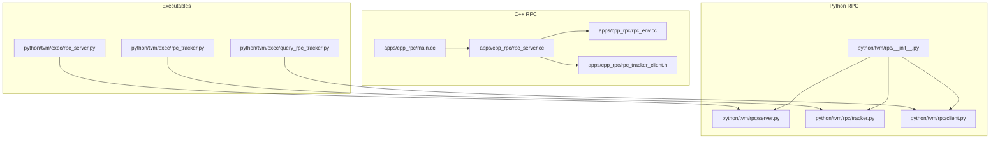
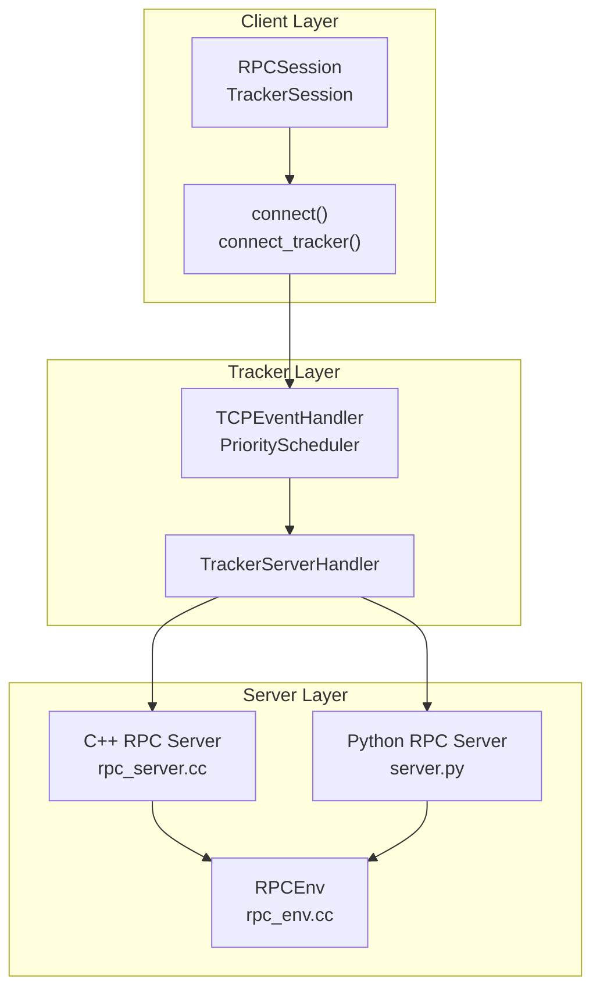
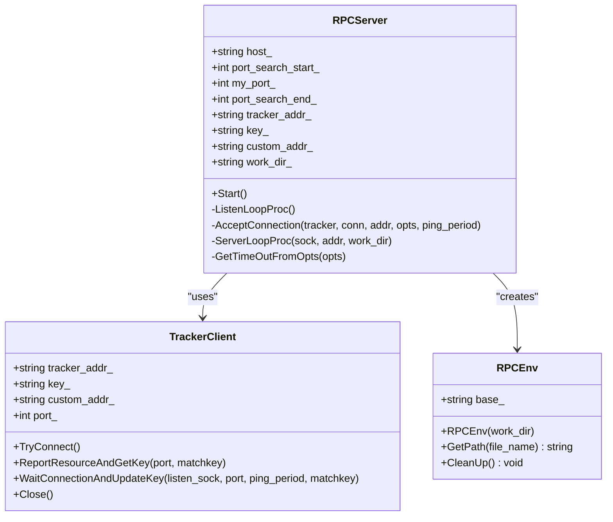
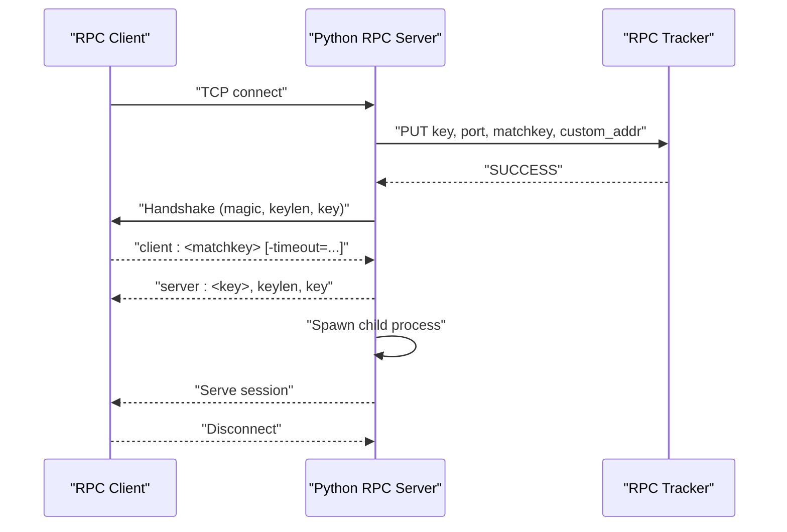
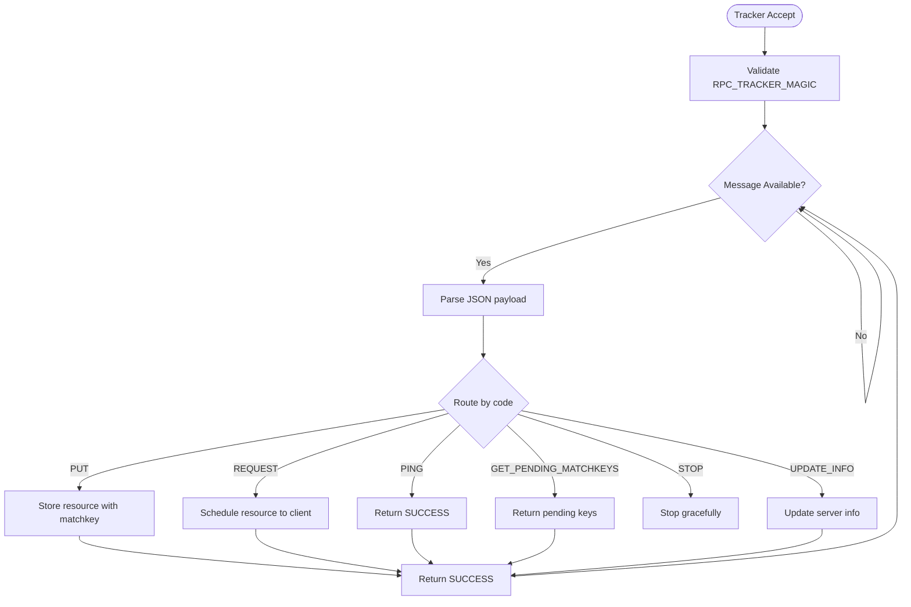
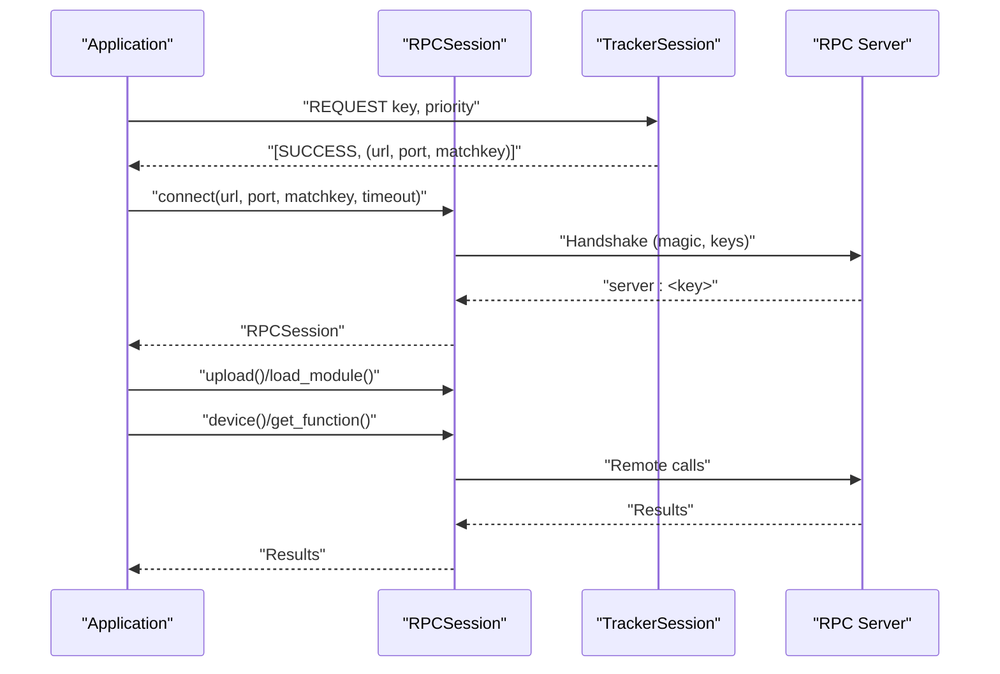
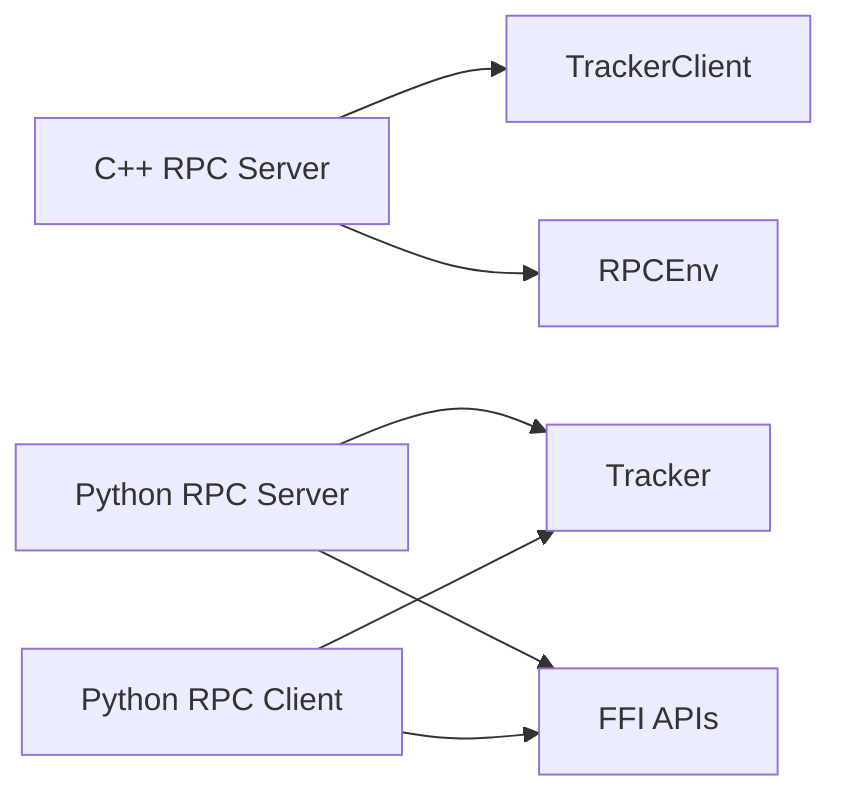

# RPC and Distributed Systems

<cite>
**Referenced Files in This Document**
- [apps/cpp_rpc/README.md](file://apps/cpp_rpc/README.md)
- [apps/cpp_rpc/main.cc](file://apps/cpp_rpc/main.cc)
- [apps/cpp_rpc/rpc_server.cc](file://apps/cpp_rpc/rpc_server.cc)
- [apps/cpp_rpc/rpc_server.h](file://apps/cpp_rpc/rpc_server.h)
- [apps/cpp_rpc/rpc_env.cc](file://apps/cpp_rpc/rpc_env.cc)
- [apps/cpp_rpc/rpc_env.h](file://apps/cpp_rpc/rpc_env.h)
- [apps/cpp_rpc/rpc_tracker_client.h](file://apps/cpp_rpc/rpc_tracker_client.h)
- [python/tvm/exec/rpc_server.py](file://python/tvm/exec/rpc_server.py)
- [python/tvm/exec/rpc_tracker.py](file://python/tvm/exec/rpc_tracker.py)
- [python/tvm/exec/query_rpc_tracker.py](file://python/tvm/exec/query_rpc_tracker.py)
- [python/tvm/rpc/__init__.py](file://python/tvm/rpc/__init__.py)
- [python/tvm/rpc/tracker.py](file://python/tvm/rpc/tracker.py)
- [python/tvm/rpc/server.py](file://python/tvm/rpc/server.py)
- [python/tvm/rpc/client.py](file://python/tvm/rpc/client.py)
</cite>

## Table of Contents
1. [Introduction](#introduction)
2. [Project Structure](#project-structure)
3. [Core Components](#core-components)
4. [Architecture Overview](#architecture-overview)
5. [Detailed Component Analysis](#detailed-component-analysis)
6. [Dependency Analysis](#dependency-analysis)
7. [Performance Considerations](#performance-considerations)
8. [Troubleshooting Guide](#troubleshooting-guide)
9. [Conclusion](#conclusion)
10. [Appendices](#appendices)

## Introduction
This document explains TVM’s RPC system for distributed compilation and inference. It covers the RPC server architecture, client–server communication protocols, and tracker-based resource management. It also documents distributed compilation workflows, remote device access, cluster management strategies, the C++ RPC client implementation, Python RPC utilities, cross-platform deployment considerations, practical examples, security configurations, authentication mechanisms, network optimization, performance monitoring, resource allocation strategies, and production best practices.

## Project Structure
TVM’s RPC system spans both C++ and Python layers:
- C++ RPC server and utilities for lightweight embedded or cross-compiled environments
- Python RPC server, tracker, and client utilities for flexible orchestration and development
- Executable entry points for starting servers and trackers

**Diagram sources**
- [apps/cpp_rpc/main.cc:1-312](file://apps/cpp_rpc/main.cc#L1-L312)
- [apps/cpp_rpc/rpc_server.cc:1-406](file://apps/cpp_rpc/rpc_server.cc#L1-L406)
- [apps/cpp_rpc/rpc_env.cc:1-355](file://apps/cpp_rpc/rpc_env.cc#L1-L355)
- [apps/cpp_rpc/rpc_tracker_client.h:1-249](file://apps/cpp_rpc/rpc_tracker_client.h#L1-L249)
- [python/tvm/rpc/server.py:1-554](file://python/tvm/rpc/server.py#L1-L554)
- [python/tvm/rpc/tracker.py:1-506](file://python/tvm/rpc/tracker.py#L1-L506)
- [python/tvm/rpc/client.py:1-570](file://python/tvm/rpc/client.py#L1-L570)
- [python/tvm/exec/rpc_server.py:1-105](file://python/tvm/exec/rpc_server.py#L1-L105)
- [python/tvm/exec/rpc_tracker.py:1-43](file://python/tvm/exec/rpc_tracker.py#L1-L43)
- [python/tvm/exec/query_rpc_tracker.py:1-49](file://python/tvm/exec/query_rpc_tracker.py#L1-L49)

**Section sources**
- [apps/cpp_rpc/README.md:18-84](file://apps/cpp_rpc/README.md#L18-L84)
- [python/tvm/exec/rpc_server.py:26-105](file://python/tvm/exec/rpc_server.py#L26-L105)
- [python/tvm/exec/rpc_tracker.py:26-43](file://python/tvm/exec/rpc_tracker.py#L26-L43)
- [python/tvm/exec/query_rpc_tracker.py:26-49](file://python/tvm/exec/query_rpc_tracker.py#L26-L49)

## Core Components
- C++ RPC server: A minimal, statically linked runtime server with tracker integration, port-range binding, and per-session isolation via child processes or Windows child-process spawning.
- Python RPC server: A process-based server with tracker registration, key-based matching, and timeout-aware serving loops.
- Python RPC tracker: An asynchronous TCP tracker implementing a JSON-over-TCP protocol for resource registration and request scheduling.
- Python RPC client: A session-based client supporting device construction, file upload/download, module loading, and tracker-driven resource acquisition.
- Executables: Command-line helpers to start servers, trackers, and query tracker status.

Key responsibilities:
- Resource registration and matching via tracker
- Secure handshake and key verification
- Per-session isolation and timeouts
- Cross-platform compatibility (POSIX and Windows)

**Section sources**
- [apps/cpp_rpc/rpc_server.cc:106-362](file://apps/cpp_rpc/rpc_server.cc#L106-L362)
- [apps/cpp_rpc/rpc_env.cc:97-169](file://apps/cpp_rpc/rpc_env.cc#L97-L169)
- [apps/cpp_rpc/rpc_tracker_client.h:46-245](file://apps/cpp_rpc/rpc_tracker_client.h#L46-L245)
- [python/tvm/rpc/server.py:181-282](file://python/tvm/rpc/server.py#L181-L282)
- [python/tvm/rpc/tracker.py:167-306](file://python/tvm/rpc/tracker.py#L167-L306)
- [python/tvm/rpc/client.py:37-256](file://python/tvm/rpc/client.py#L37-L256)

## Architecture Overview
The RPC system consists of three layers:
- Client layer: Python client APIs and executables
- Tracker layer: Asynchronous resource scheduler
- Server layer: Lightweight C++ server and Python server

**Diagram sources**
- [python/tvm/rpc/client.py:37-256](file://python/tvm/rpc/client.py#L37-L256)
- [python/tvm/rpc/tracker.py:167-306](file://python/tvm/rpc/tracker.py#L167-L306)
- [apps/cpp_rpc/rpc_server.cc:106-362](file://apps/cpp_rpc/rpc_server.cc#L106-L362)
- [python/tvm/rpc/server.py:181-282](file://python/tvm/rpc/server.py#L181-L282)
- [apps/cpp_rpc/rpc_env.cc:97-169](file://apps/cpp_rpc/rpc_env.cc#L97-L169)

## Detailed Component Analysis

### C++ RPC Server
The C++ RPC server provides a minimal runtime server with:
- Command-line argument parsing and validation
- Tracker client integration for resource registration and key rotation
- Listener loop with accept-and-handshake logic
- Per-connection serving with timeout support and child-process isolation

**Diagram sources**
- [apps/cpp_rpc/rpc_server.cc:106-362](file://apps/cpp_rpc/rpc_server.cc#L106-L362)
- [apps/cpp_rpc/rpc_tracker_client.h:46-245](file://apps/cpp_rpc/rpc_tracker_client.h#L46-L245)
- [apps/cpp_rpc/rpc_env.cc:97-169](file://apps/cpp_rpc/rpc_env.cc#L97-L169)

**Section sources**
- [apps/cpp_rpc/main.cc:49-246](file://apps/cpp_rpc/main.cc#L49-L246)
- [apps/cpp_rpc/rpc_server.cc:137-242](file://apps/cpp_rpc/rpc_server.cc#L137-L242)
- [apps/cpp_rpc/rpc_server.cc:252-320](file://apps/cpp_rpc/rpc_server.cc#L252-L320)
- [apps/cpp_rpc/rpc_env.cc:97-169](file://apps/cpp_rpc/rpc_env.cc#L97-L169)

### Python RPC Server
The Python RPC server implements:
- A listener loop that registers with the tracker and waits for clients
- Handshake validation with match keys and optional timeout options
- A serving loop that spawns a child process for session isolation
- Support for proxy mode and custom address reporting

**Diagram sources**
- [python/tvm/rpc/server.py:181-282](file://python/tvm/rpc/server.py#L181-L282)
- [python/tvm/rpc/tracker.py:247-298](file://python/tvm/rpc/tracker.py#L247-L298)

**Section sources**
- [python/tvm/rpc/server.py:181-282](file://python/tvm/rpc/server.py#L181-L282)
- [python/tvm/rpc/server.py:317-423](file://python/tvm/rpc/server.py#L317-L423)

### Python RPC Tracker
The tracker implements:
- A TCP handler that validates magic and parses JSON messages
- A priority-based scheduler per key
- Pending match-key rotation to prevent stale keys
- Summary and stop mechanisms

**Diagram sources**
- [python/tvm/rpc/tracker.py:167-306](file://python/tvm/rpc/tracker.py#L167-L306)
- [python/tvm/rpc/tracker.py:337-380](file://python/tvm/rpc/tracker.py#L337-L380)

**Section sources**
- [python/tvm/rpc/tracker.py:127-165](file://python/tvm/rpc/tracker.py#L127-L165)
- [python/tvm/rpc/tracker.py:167-306](file://python/tvm/rpc/tracker.py#L167-L306)

### Python RPC Client
The client provides:
- RPCSession for remote function/device access
- TrackerSession for resource requests and summaries
- Helpers for upload, download, listdir, and module loading
- Support for session timeouts and proxy chaining

**Diagram sources**
- [python/tvm/rpc/client.py:37-256](file://python/tvm/rpc/client.py#L37-L256)
- [python/tvm/rpc/client.py:303-480](file://python/tvm/rpc/client.py#L303-L480)
- [python/tvm/rpc/server.py:181-282](file://python/tvm/rpc/server.py#L181-L282)

**Section sources**
- [python/tvm/rpc/client.py:37-256](file://python/tvm/rpc/client.py#L37-L256)
- [python/tvm/rpc/client.py:303-480](file://python/tvm/rpc/client.py#L303-L480)

### Executables and CLI Tools
- rpc_server.py: Starts a Python RPC server with tracker support and options
- rpc_tracker.py: Starts a tracker with configurable ports and silent mode
- query_rpc_tracker.py: Prints tracker status and queue summaries

**Section sources**
- [python/tvm/exec/rpc_server.py:26-105](file://python/tvm/exec/rpc_server.py#L26-L105)
- [python/tvm/exec/rpc_tracker.py:26-43](file://python/tvm/exec/rpc_tracker.py#L26-L43)
- [python/tvm/exec/query_rpc_tracker.py:26-49](file://python/tvm/exec/query_rpc_tracker.py#L26-L49)

## Dependency Analysis
- C++ RPC server depends on:
  - Tracker client for registration and key rotation
  - RPC environment for module loading and work-path management
- Python RPC server depends on:
  - Tracker for resource registration and scheduling
  - FFI APIs for server loop and session handling
- Python RPC client depends on:
  - Tracker for resource requests
  - FFI APIs for connection and remote function dispatch

**Diagram sources**
- [apps/cpp_rpc/rpc_server.cc:106-362](file://apps/cpp_rpc/rpc_server.cc#L106-L362)
- [apps/cpp_rpc/rpc_tracker_client.h:46-245](file://apps/cpp_rpc/rpc_tracker_client.h#L46-L245)
- [apps/cpp_rpc/rpc_env.cc:97-169](file://apps/cpp_rpc/rpc_env.cc#L97-L169)
- [python/tvm/rpc/server.py:181-282](file://python/tvm/rpc/server.py#L181-L282)
- [python/tvm/rpc/tracker.py:167-306](file://python/tvm/rpc/tracker.py#L167-L306)
- [python/tvm/rpc/client.py:37-256](file://python/tvm/rpc/client.py#L37-L256)

**Section sources**
- [python/tvm/rpc/__init__.py:34-38](file://python/tvm/rpc/__init__.py#L34-L38)

## Performance Considerations
- Session timeouts: Use the -timeout option to bound per-session execution time and reclaim resources promptly.
- Fork vs spawn: On platforms where fork causes compiler issues (e.g., ROCm/Metal), prefer spawn mode to avoid compiler internal errors.
- Port-range binding: Search a port range to avoid conflicts in multi-server environments.
- Tracker polling: The tracker periodically checks pending match keys to rotate unused keys and reduce stale connections.
- Work-path isolation: Each session operates in a temporary work directory to avoid file conflicts and enable cleanup.

Practical tips:
- Prefer spawn mode when using ROCm/Metal compilers
- Use session timeouts to enforce SLAs and prevent resource starvation
- Monitor tracker queue status to balance load across servers

**Section sources**
- [apps/cpp_rpc/rpc_server.cc:340-350](file://apps/cpp_rpc/rpc_server.cc#L340-L350)
- [python/tvm/rpc/server.py:130-137](file://python/tvm/rpc/server.py#L130-L137)
- [python/tvm/exec/rpc_server.py:88-91](file://python/tvm/exec/rpc_server.py#L88-L91)
- [python/tvm/rpc/tracker.py:140-185](file://python/tvm/rpc/tracker.py#L140-L185)

## Troubleshooting Guide
Common issues and resolutions:
- Wrong tracker address format: Ensure host:port format and valid numeric port
- Mismatch key errors: Verify server key and client match key alignment
- Tracker connectivity failures: Confirm tracker is reachable and magic handshake succeeds
- Session timeouts: Increase session timeout or reduce workload duration
- Stale match keys: The tracker rotates keys when unused for extended periods

Operational commands:
- Query tracker status: Use the query tool to inspect server list and queue status
- Restart tracker safely: Use STOP code with the generated stop key

**Section sources**
- [apps/cpp_rpc/main.cc:159-168](file://apps/cpp_rpc/main.cc#L159-L168)
- [apps/cpp_rpc/rpc_server.cc:298-318](file://apps/cpp_rpc/rpc_server.cc#L298-L318)
- [python/tvm/rpc/tracker.py:279-286](file://python/tvm/rpc/tracker.py#L279-L286)
- [python/tvm/exec/query_rpc_tracker.py:41-44](file://python/tvm/exec/query_rpc_tracker.py#L41-L44)

## Conclusion
TVM’s RPC system provides a robust, cross-platform foundation for distributed compilation and inference. The combination of C++ and Python implementations offers flexibility for embedded targets and general-purpose orchestration. With tracker-based resource management, secure handshakes, and session isolation, it supports scalable and maintainable production deployments.

## Appendices

### Practical Setup Examples
- Start a tracker:
  - Use the tracker executable with host, port, and port-end options
- Start a Python RPC server:
  - Provide host, port, port-end, optional tracker address, and key
- Start a C++ RPC server:
  - Use the C++ server binary with host, port, port-end, tracker, and key options
- Query tracker status:
  - Run the query tool to print server list and queue metrics

**Section sources**
- [python/tvm/exec/rpc_tracker.py:26-43](file://python/tvm/exec/rpc_tracker.py#L26-L43)
- [python/tvm/exec/rpc_server.py:43-54](file://python/tvm/exec/rpc_server.py#L43-L54)
- [apps/cpp_rpc/README.md:69-80](file://apps/cpp_rpc/README.md#L69-L80)
- [python/tvm/exec/query_rpc_tracker.py:41-44](file://python/tvm/exec/query_rpc_tracker.py#L41-L44)

### Security and Authentication
- Trust model: The RPC server assumes a trusted network and does not implement built-in authentication
- Encryption: Use encrypted channels (e.g., TLS proxies) when exposing RPC across untrusted networks
- Access control: Restrict tracker and server endpoints to trusted networks; consider firewall rules and VPNs

**Section sources**
- [python/tvm/rpc/__init__.py:28-32](file://python/tvm/rpc/__init__.py#L28-L32)

### Network Optimization
- Use port ranges to avoid conflicts
- Enable spawn mode on platforms where fork is problematic
- Tune session timeouts to match workload characteristics
- Monitor tracker queue status to rebalance load

**Section sources**
- [python/tvm/exec/rpc_server.py:88-91](file://python/tvm/exec/rpc_server.py#L88-L91)
- [python/tvm/rpc/server.py:130-137](file://python/tvm/rpc/server.py#L130-L137)
- [python/tvm/exec/query_rpc_tracker.py:41-44](file://python/tvm/exec/query_rpc_tracker.py#L41-L44)

### Production Best Practices
- Deploy tracker behind a load balancer for high availability
- Use session timeouts to prevent resource exhaustion
- Monitor tracker queue depth and server counts to scale horizontally
- Prefer spawn mode on ROCm/Metal environments
- Use custom addresses to reflect NAT or proxy routing

**Section sources**
- [python/tvm/rpc/server.py:498-513](file://python/tvm/rpc/server.py#L498-L513)
- [python/tvm/exec/rpc_server.py:88-91](file://python/tvm/exec/rpc_server.py#L88-L91)
- [apps/cpp_rpc/README.md:78-80](file://apps/cpp_rpc/README.md#L78-L80)