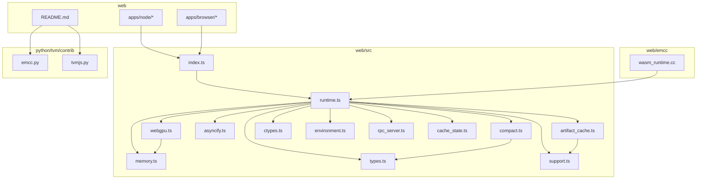
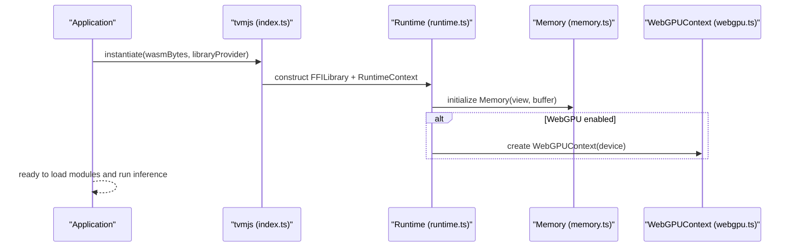
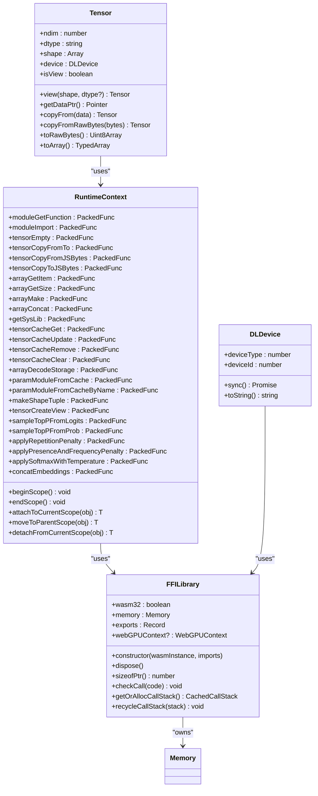
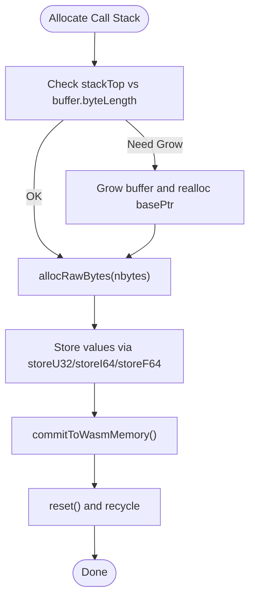
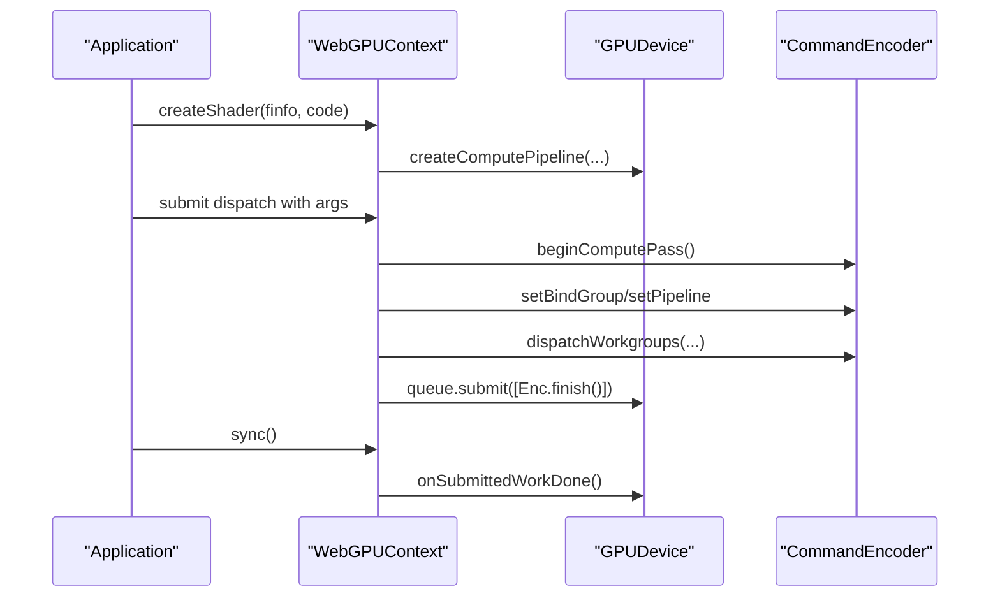
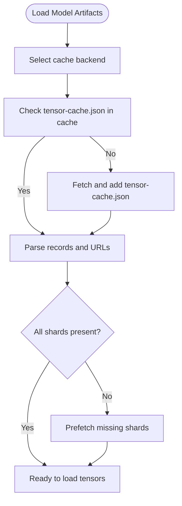
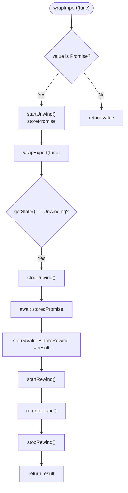
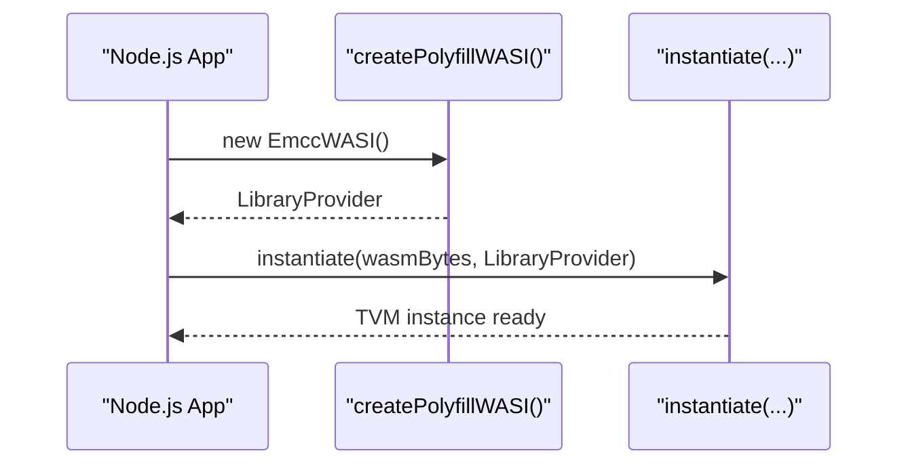
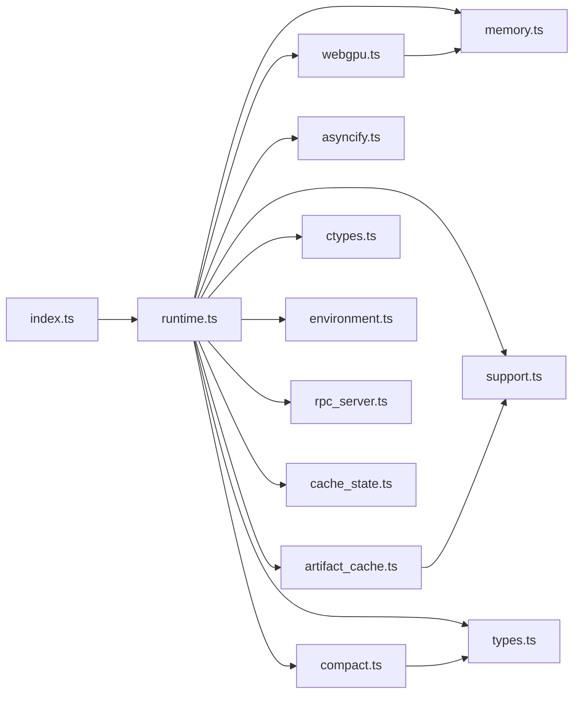

# Web Deployment

<cite>
**Referenced Files in This Document**
- [web/README.md](file://web/README.md)
- [web/src/index.ts](file://web/src/index.ts)
- [web/src/runtime.ts](file://web/src/runtime.ts)
- [web/src/memory.ts](file://web/src/memory.ts)
- [web/src/webgpu.ts](file://web/src/webgpu.ts)
- [web/src/artifact_cache.ts](file://web/src/artifact_cache.ts)
- [web/src/asyncify.ts](file://web/src/asyncify.ts)
- [web/src/compact.ts](file://web/src/compact.ts)
- [web/src/ctypes.ts](file://web/src/ctypes.ts)
- [web/src/types.ts](file://web/src/types.ts)
- [web/src/support.ts](file://web/src/support.ts)
- [web/src/environment.ts](file://web/src/environment.ts)
- [web/src/rpc_server.ts](file://web/src/rpc_server.ts)
- [web/src/cache_state.ts](file://web/src/cache_state.ts)
- [web/src/compact.ts](file://web/src/compact.ts)
- [web/emcc/wasm_runtime.cc](file://web/emcc/wasm_runtime.cc)
- [web/apps/node/example.js](file://web/apps/node/example.js)
- [web/apps/browser/rpc_plugin.html](file://web/apps/browser/rpc_plugin.html)
- [python/tvm/contrib/emcc.py](file://python/tvm/contrib/emcc.py)
- [python/tvm/contrib/tvmjs.py](file://python/tvm/contrib/tvmjs.py)
</cite>

## Table of Contents
1. [Introduction](#introduction)
2. [Project Structure](#project-structure)
3. [Core Components](#core-components)
4. [Architecture Overview](#architecture-overview)
5. [Detailed Component Analysis](#detailed-component-analysis)
6. [Dependency Analysis](#dependency-analysis)
7. [Performance Considerations](#performance-considerations)
8. [Troubleshooting Guide](#troubleshooting-guide)
9. [Conclusion](#conclusion)
10. [Appendices](#appendices)

## Introduction
This document explains how to deploy TVM models to the web using WebAssembly and the TVM Web runtime. It covers the runtime architecture, WASM compilation and linking, browser compatibility, tvmjs integration for browsers and Node.js, WebGPU acceleration, memory management, performance optimization, step-by-step deployment tutorials, asynchronous operation handling, model loading, security and sandboxing, debugging, and best practices for production web inference.

## Project Structure
The TVM web runtime is organized into:
- TypeScript runtime and utilities under web/src
- Emscripten-generated C++ runtime under web/emcc
- Bundling and packaging under web
- Example apps for browser and Node.js under web/apps
- Python helpers for building and exporting the runtime under python/tvm/contrib

**Diagram sources**
- [web/src/index.ts:20-44](file://web/src/index.ts#L20-L44)
- [web/src/runtime.ts:20-40](file://web/src/runtime.ts#L20-L40)
- [web/src/memory.ts:31-51](file://web/src/memory.ts#L31-L51)
- [web/src/webgpu.ts:401-444](file://web/src/webgpu.ts#L401-L444)
- [web/src/artifact_cache.ts:287-364](file://web/src/artifact_cache.ts#L287-L364)
- [web/src/asyncify.ts:44-61](file://web/src/asyncify.ts#L44-L61)
- [web/src/compact.ts:53-55](file://web/src/compact.ts#L53-L55)
- [web/src/ctypes.ts](file://web/src/ctypes.ts)
- [web/src/types.ts](file://web/src/types.ts)
- [web/src/support.ts](file://web/src/support.ts)
- [web/src/environment.ts](file://web/src/environment.ts)
- [web/src/rpc_server.ts](file://web/src/rpc_server.ts)
- [web/src/cache_state.ts](file://web/src/cache_state.ts)
- [web/emcc/wasm_runtime.cc:79-127](file://web/emcc/wasm_runtime.cc#L79-L127)
- [web/README.md:37-98](file://web/README.md#L37-L98)
- [python/tvm/contrib/emcc.py:39-108](file://python/tvm/contrib/emcc.py#L39-L108)
- [python/tvm/contrib/tvmjs.py:399-424](file://python/tvm/contrib/tvmjs.py#L399-L424)

**Section sources**
- [web/README.md:18-98](file://web/README.md#L18-L98)
- [web/src/index.ts:20-44](file://web/src/index.ts#L20-L44)

## Core Components
- TVM Web runtime entry and exports: exposes core types and APIs for browser and Node.js.
- Runtime core: manages WebAssembly instance, memory, FFI, device synchronization, and runtime context.
- Memory manager: typed access to WASM linear memory and call stacks.
- WebGPU integration: device detection, buffer management, shader creation, and rendering.
- Artifact cache: model artifact caching via Cache API, IndexedDB, and cross-origin storage.
- Asyncify handler: optional support for async/await in WASM via asyncify.
- Polyfill WASI: environment-agnostic provider for Node.js and browser.
- Emscripten runtime: C++ runtime linked into the WASM binary.

Key exports and capabilities are defined in the index module and implemented across runtime.ts, memory.ts, webgpu.ts, artifact_cache.ts, asyncify.ts, and compact.ts.

**Section sources**
- [web/src/index.ts:20-44](file://web/src/index.ts#L20-L44)
- [web/src/runtime.ts:58-151](file://web/src/runtime.ts#L58-L151)
- [web/src/memory.ts:31-51](file://web/src/memory.ts#L31-L51)
- [web/src/webgpu.ts:401-444](file://web/src/webgpu.ts#L401-L444)
- [web/src/artifact_cache.ts:287-364](file://web/src/artifact_cache.ts#L287-L364)
- [web/src/asyncify.ts:44-61](file://web/src/asyncify.ts#L44-L61)
- [web/src/compact.ts:53-55](file://web/src/compact.ts#L53-L55)
- [web/emcc/wasm_runtime.cc:79-127](file://web/emcc/wasm_runtime.cc#L79-L127)

## Architecture Overview
The TVM Web runtime architecture connects a JavaScript/TypeScript frontend to a compiled WebAssembly module. The runtime initializes a WebAssembly instance, sets up memory and typed access, binds device-specific capabilities (including WebGPU), and exposes a high-level API for model loading, tensor manipulation, and execution.

**Diagram sources**
- [web/src/index.ts:20-44](file://web/src/index.ts#L20-L44)
- [web/src/runtime.ts:58-151](file://web/src/runtime.ts#L58-L151)
- [web/src/memory.ts:31-51](file://web/src/memory.ts#L31-L51)
- [web/src/webgpu.ts:401-444](file://web/src/webgpu.ts#L401-L444)

## Detailed Component Analysis

### TVM Web Runtime Core
The runtime core encapsulates:
- FFILibrary: wraps the WebAssembly instance, validates exports, detects memory, and manages call stacks.
- RuntimeContext: binds global functions for arrays, tensors, VM initialization, and tensor cache operations.
- Device abstraction: DLDevice and DLDataType with device-type mapping and synchronization for WebGPU.
- Modules, Arrays, Objects: typed wrappers around FFI objects and packed functions.

**Diagram sources**
- [web/src/runtime.ts:58-151](file://web/src/runtime.ts#L58-L151)
- [web/src/runtime.ts:157-306](file://web/src/runtime.ts#L157-L306)
- [web/src/runtime.ts:345-384](file://web/src/runtime.ts#L345-L384)
- [web/src/runtime.ts:504-703](file://web/src/runtime.ts#L504-L703)

**Section sources**
- [web/src/runtime.ts:58-151](file://web/src/runtime.ts#L58-L151)
- [web/src/runtime.ts:157-306](file://web/src/runtime.ts#L157-L306)
- [web/src/runtime.ts:345-384](file://web/src/runtime.ts#L345-L384)
- [web/src/runtime.ts:504-703](file://web/src/runtime.ts#L504-L703)

### Memory Management
The memory manager provides:
- Typed accessors for U8/U16/U32/I32/F32/F64
- Raw byte and C-string loading
- Object header parsing and type info retrieval
- Call stack allocation and committing to WASM memory with pointer fixups

**Diagram sources**
- [web/src/memory.ts:279-499](file://web/src/memory.ts#L279-L499)

**Section sources**
- [web/src/memory.ts:31-51](file://web/src/memory.ts#L31-L51)
- [web/src/memory.ts:279-499](file://web/src/memory.ts#L279-L499)

### WebGPU Acceleration
WebGPU support includes:
- Device detection and capability checks
- Pipeline creation and dispatch batching
- Uniform buffer pools and staging buffers
- Canvas rendering and image drawing
- Synchronization and statistics

**Diagram sources**
- [web/src/webgpu.ts:401-444](file://web/src/webgpu.ts#L401-L444)
- [web/src/webgpu.ts:638-800](file://web/src/webgpu.ts#L638-L800)

**Section sources**
- [web/src/webgpu.ts:36-154](file://web/src/webgpu.ts#L36-L154)
- [web/src/webgpu.ts:401-444](file://web/src/webgpu.ts#L401-L444)
- [web/src/webgpu.ts:638-800](file://web/src/webgpu.ts#L638-L800)

### Artifact Cache and Model Loading
The artifact cache supports:
- Cache API-backed caching
- IndexedDB-backed caching
- Cross-origin storage-backed caching
- Tensor shard discovery and cache validation
- Deletion and existence checks

**Diagram sources**
- [web/src/artifact_cache.ts:287-364](file://web/src/artifact_cache.ts#L287-L364)
- [web/src/artifact_cache.ts:443-501](file://web/src/artifact_cache.ts#L443-L501)
- [web/src/artifact_cache.ts:707-734](file://web/src/artifact_cache.ts#L707-L734)

**Section sources**
- [web/src/artifact_cache.ts:287-364](file://web/src/artifact_cache.ts#L287-L364)
- [web/src/artifact_cache.ts:443-501](file://web/src/artifact_cache.ts#L443-L501)
- [web/src/artifact_cache.ts:707-734](file://web/src/artifact_cache.ts#L707-L734)

### Asynchronous Operations and Asyncify
Asyncify enables async/await inside the WASM runtime by unwinding and rewinding the stack. The handler:
- Wraps imports to detect Promise returns
- Wraps exports to resume execution after Promise resolution
- Manages state transitions and memory metadata

**Diagram sources**
- [web/src/asyncify.ts:97-192](file://web/src/asyncify.ts#L97-L192)
- [web/src/asyncify.ts:194-236](file://web/src/asyncify.ts#L194-L236)

**Section sources**
- [web/src/asyncify.ts:44-61](file://web/src/asyncify.ts#L44-L61)
- [web/src/asyncify.ts:97-192](file://web/src/asyncify.ts#L97-L192)
- [web/src/asyncify.ts:194-236](file://web/src/asyncify.ts#L194-L236)

### Polyfill WASI and Node.js Integration
The polyfill WASI provider bridges Node.js and browser environments:
- Performance measurement abstraction
- WebSocket creation abstraction
- WASI instantiation via the emscripten-generated JS

**Diagram sources**
- [web/src/compact.ts:53-55](file://web/src/compact.ts#L53-L55)
- [web/apps/node/example.js:22-40](file://web/apps/node/example.js#L22-L40)

**Section sources**
- [web/src/compact.ts:26-55](file://web/src/compact.ts#L26-L55)
- [web/apps/node/example.js:22-40](file://web/apps/node/example.js#L22-L40)

### Emscripten Runtime and Linking
The Emscripten runtime compiles TVM’s C++ runtime into a WASM module and links:
- Core runtime components
- VM and tensor cache support
- Testing and utility functions
- Optional WebGPU runtime

Build-time flags and linking are configured in the Python helper.

**Section sources**
- [web/emcc/wasm_runtime.cc:79-127](file://web/emcc/wasm_runtime.cc#L79-L127)
- [web/emcc/wasm_runtime.cc:129-238](file://web/emcc/wasm_runtime.cc#L129-L238)
- [python/tvm/contrib/emcc.py:39-108](file://python/tvm/contrib/emcc.py#L39-L108)

## Dependency Analysis
The runtime composes several modules with clear boundaries:
- web/src/index.ts exports the public API surface
- runtime.ts depends on memory.ts, webgpu.ts, artifact_cache.ts, asyncify.ts, ctypes.ts, types.ts, support.ts, environment.ts, rpc_server.ts, cache_state.ts
- webgpu.ts depends on memory.ts and uses GPUDevice APIs
- artifact_cache.ts depends on support.ts and browser APIs
- compact.ts provides environment polyfills
- emcc/wasm_runtime.cc provides the C++ runtime linked into WASM

**Diagram sources**
- [web/src/index.ts:20-44](file://web/src/index.ts#L20-L44)
- [web/src/runtime.ts:20-40](file://web/src/runtime.ts#L20-L40)
- [web/src/memory.ts:31-51](file://web/src/memory.ts#L31-L51)
- [web/src/webgpu.ts:401-444](file://web/src/webgpu.ts#L401-L444)
- [web/src/artifact_cache.ts:287-364](file://web/src/artifact_cache.ts#L287-L364)
- [web/src/asyncify.ts:44-61](file://web/src/asyncify.ts#L44-L61)
- [web/src/compact.ts:53-55](file://web/src/compact.ts#L53-L55)
- [web/src/ctypes.ts](file://web/src/ctypes.ts)
- [web/src/types.ts](file://web/src/types.ts)
- [web/src/support.ts](file://web/src/support.ts)
- [web/src/environment.ts](file://web/src/environment.ts)
- [web/src/rpc_server.ts](file://web/src/rpc_server.ts)
- [web/src/cache_state.ts](file://web/src/cache_state.ts)

**Section sources**
- [web/src/index.ts:20-44](file://web/src/index.ts#L20-L44)
- [web/src/runtime.ts:20-40](file://web/src/runtime.ts#L20-L40)

## Performance Considerations
- Prefer WebGPU acceleration for compute-heavy kernels; use batching and uniform buffer pools to minimize submissions.
- Use artifact caching to avoid repeated downloads and parsing of model artifacts.
- Reuse call stacks and memory views to reduce allocations.
- Limit shader submissions and synchronize only when necessary.
- Use pooled allocators for VM tensors and tensor views to reduce GC pressure.
- Minimize data transfers between CPU and GPU; keep data on GPU when possible.

[No sources needed since this section provides general guidance]

## Troubleshooting Guide
Common issues and remedies:
- Missing exports or invalid WASM: ensure the WASM module exports required functions and memory.
- WebGPU device limits exceeded: adjust buffer sizes and workgroup limits according to detected adapter limits.
- Cache misses or corrupted artifacts: clear cache entries and re-fetch; verify artifact URLs and formats.
- Asyncify not enabled: compile with asyncify flags if using async/await in WASM.
- Node.js WebSocket or performance APIs missing: use polyfills provided by compact.ts.

**Section sources**
- [web/src/runtime.ts:116-131](file://web/src/runtime.ts#L116-L131)
- [web/src/webgpu.ts:36-154](file://web/src/webgpu.ts#L36-L154)
- [web/src/artifact_cache.ts:744-774](file://web/src/artifact_cache.ts#L744-L774)
- [web/src/asyncify.ts:194-236](file://web/src/asyncify.ts#L194-L236)
- [web/src/compact.ts:26-55](file://web/src/compact.ts#L26-L55)

## Conclusion
The TVM Web runtime provides a robust foundation for deploying ML models in browsers and Node.js via WebAssembly. With WebGPU acceleration, efficient memory management, artifact caching, and environment polyfills, it supports production-grade web inference. Following the deployment steps and best practices outlined below will help you achieve reliable and performant web deployments.

[No sources needed since this section summarizes without analyzing specific files]

## Appendices

### Step-by-Step: Deploy a Model to the Web
- Build the TVM WASM runtime and JS bundle:
  - Build the WASM runtime and JS bundle as described in the web README.
- Prepare the model:
  - Compile and export your model to a format consumable by the TVM runtime.
- Load and run in the browser:
  - Instantiate the runtime with the WASM bytes and a library provider.
  - Load modules and tensors, set inputs, run inference, and read outputs.
- Optional: Enable WebGPU:
  - Detect and configure a WebGPU device; use WebGPUContext for accelerated execution.

**Section sources**
- [web/README.md:37-98](file://web/README.md#L37-L98)
- [web/apps/browser/rpc_plugin.html:18-20](file://web/apps/browser/rpc_plugin.html#L18-L20)
- [web/apps/node/example.js:22-40](file://web/apps/node/example.js#L22-L40)

### Handling Asynchronous Operations
- Use the asyncify handler to wrap imports and exports when your runtime needs to await Promises.
- Ensure proper state transitions and memory metadata initialization for asyncify.

**Section sources**
- [web/src/asyncify.ts:97-192](file://web/src/asyncify.ts#L97-L192)
- [web/src/asyncify.ts:194-236](file://web/src/asyncify.ts#L194-L236)

### Managing Model Loading and Caching
- Use the artifact cache to prefetch and cache model artifacts.
- Validate cache presence and delete entries when needed.

**Section sources**
- [web/src/artifact_cache.ts:287-364](file://web/src/artifact_cache.ts#L287-L364)
- [web/src/artifact_cache.ts:707-734](file://web/src/artifact_cache.ts#L707-L734)
- [web/src/artifact_cache.ts:744-774](file://web/src/artifact_cache.ts#L744-L774)

### Security and Sandboxing
- The runtime executes inside a WASM sandbox with limited host access.
- Avoid exposing sensitive host APIs; restrict network access to trusted endpoints.
- Validate and sanitize inputs; prefer typed arrays and views to minimize overhead.

[No sources needed since this section provides general guidance]

### Debugging Techniques
- Use runtime statistics and sync points to profile GPU workloads.
- Inspect device limits and capabilities during initialization.
- Leverage console logs and error messages from the runtime.

**Section sources**
- [web/src/webgpu.ts:493-503](file://web/src/webgpu.ts#L493-L503)
- [web/src/webgpu.ts:508-513](file://web/src/webgpu.ts#L508-L513)