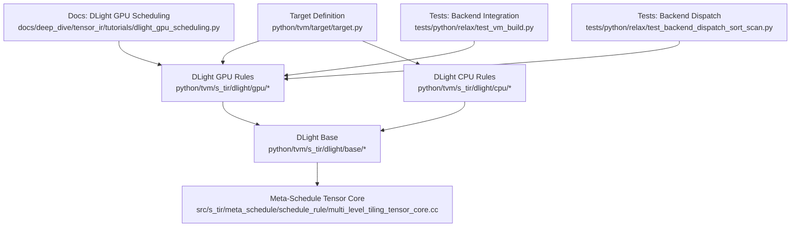
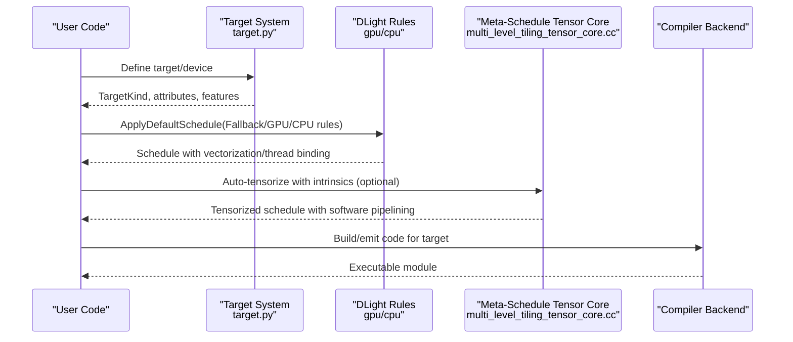
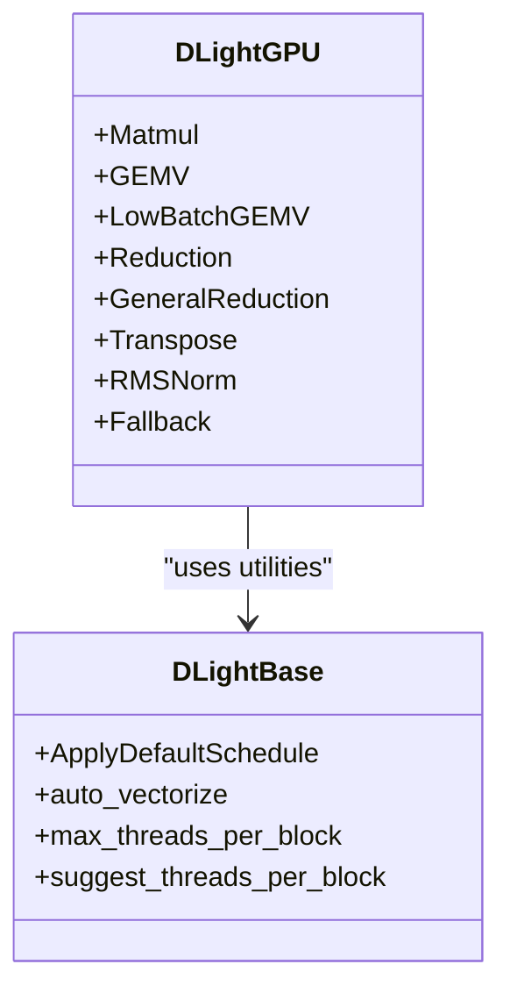
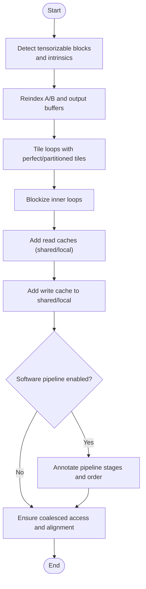
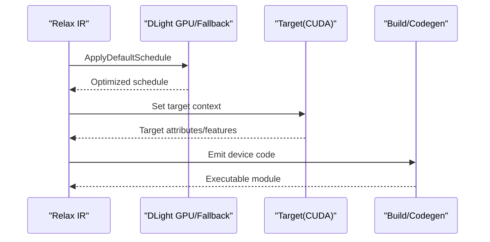
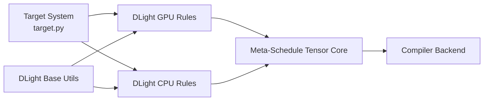

# Hardware-Specific Tuning

<cite>
**Referenced Files in This Document**
- [target.py](file://python/tvm/target/target.py)
- [dlight/__init__.py](file://python/tvm/s_tir/dlight/__init__.py)
- [dlight/gpu/__init__.py](file://python/tvm/s_tir/dlight/gpu/__init__.py)
- [dlight/cpu/__init__.py](file://python/tvm/s_tir/dlight/cpu/__init__.py)
- [dlight/base/__init__.py](file://python/tvm/s_tir/dlight/base/__init__.py)
- [multi_level_tiling_tensor_core.cc](file://src/s_tir/meta_schedule/schedule_rule/multi_level_tiling_tensor_core.cc)
- [dlight_gpu_scheduling.py](file://docs/deep_dive/tensor_ir/tutorials/dlight_gpu_scheduling.py)
- [test_vm_build.py](file://tests/python/relax/test_vm_build.py)
- [test_backend_dispatch_sort_scan.py](file://tests/python/relax/test_backend_dispatch_sort_scan.py)
</cite>

## Table of Contents
1. [Introduction](#introduction)
2. [Project Structure](#project-structure)
3. [Core Components](#core-components)
4. [Architecture Overview](#architecture-overview)
5. [Detailed Component Analysis](#detailed-component-analysis)
6. [Dependency Analysis](#dependency-analysis)
7. [Performance Considerations](#performance-considerations)
8. [Troubleshooting Guide](#troubleshooting-guide)
9. [Conclusion](#conclusion)
10. [Appendices](#appendices)

## Introduction
This document explains hardware-specific optimization techniques in TVM with a focus on target-aware scheduling, vectorization, memory access optimization, and automatic kernel optimization via the DLight scheduler. It covers:
- Target-aware scheduling strategies for CPU and GPU
- Vectorization patterns and SIMD/SIMT exploitation
- Memory access optimizations (coalesced access, shared memory reuse, software pipelining)
- DLight’s automatic GPU and CPU kernel optimization, including tensor core utilization, thread binding, and fallback strategies
- Platform-specific compiler flags and instruction selection
- Practical examples of custom scheduling passes and performance tuning workflows
- The relationship between hardware capabilities and optimization strategies, and how compiler backends integrate with target-specific code generation

## Project Structure
The relevant parts of the repository for hardware-specific tuning are organized around:
- Target definition and feature detection
- DLight scheduling rules for GPU and CPU
- Meta-schedule tensor core tiling for automatic tensorization
- Documentation and tests demonstrating end-to-end GPU scheduling and backend integration

**Diagram sources**
- [target.py:1-233](file://python/tvm/target/target.py#L1-L233)
- [dlight/gpu/__init__.py:1-31](file://python/tvm/s_tir/dlight/gpu/__init__.py#L1-L31)
- [dlight/cpu/__init__.py:1-24](file://python/tvm/s_tir/dlight/cpu/__init__.py#L1-L24)
- [dlight/base/__init__.py:1-30](file://python/tvm/s_tir/dlight/base/__init__.py#L1-L30)
- [multi_level_tiling_tensor_core.cc:1-961](file://src/s_tir/meta_schedule/schedule_rule/multi_level_tiling_tensor_core.cc#L1-L961)
- [dlight_gpu_scheduling.py:113-153](file://docs/deep_dive/tensor_ir/tutorials/dlight_gpu_scheduling.py#L113-L153)
- [test_vm_build.py:1280-1315](file://tests/python/relax/test_vm_build.py#L1280-L1315)
- [test_backend_dispatch_sort_scan.py:75-117](file://tests/python/relax/test_backend_dispatch_sort_scan.py#L75-L117)

**Section sources**
- [target.py:1-233](file://python/tvm/target/target.py#L1-L233)
- [dlight/__init__.py:18-34](file://python/tvm/s_tir/dlight/__init__.py#L18-L34)
- [dlight/gpu/__init__.py:18-31](file://python/tvm/s_tir/dlight/gpu/__init__.py#L18-L31)
- [dlight/cpu/__init__.py:18-24](file://python/tvm/s_tir/dlight/cpu/__init__.py#L18-L24)
- [dlight/base/__init__.py:18-30](file://python/tvm/s_tir/dlight/base/__init__.py#L18-L30)
- [multi_level_tiling_tensor_core.cc:1-961](file://src/s_tir/meta_schedule/schedule_rule/multi_level_tiling_tensor_core.cc#L1-L961)
- [dlight_gpu_scheduling.py:113-153](file://docs/deep_dive/tensor_ir/tutorials/dlight_gpu_scheduling.py#L113-L153)
- [test_vm_build.py:1280-1315](file://tests/python/relax/test_vm_build.py#L1280-L1315)
- [test_backend_dispatch_sort_scan.py:75-117](file://tests/python/relax/test_backend_dispatch_sort_scan.py#L75-L117)

## Core Components
- Target system: Provides target kinds, attributes, and feature detection used to guide scheduling and code generation.
- DLight GPU rules: Built-in scheduling rules for common kernels (Matmul, GEMV, Reduction, Transpose, RMSNorm, GeneralReduction, LowBatchGEMV) with target-aware defaults.
- DLight CPU rules: Generic CPU rules for GEMV and Reduction.
- DLight base infrastructure: Utilities for vectorization hints, thread sizing, and default schedule application.
- Meta-schedule tensor core tiling: Automatic tensorization with hardware-specific intrinsics (e.g., WMMA/MMA) and software pipelining.
- Documentation and tests: Demonstrate rule catalog, backend integration, and dispatch behavior.

**Section sources**
- [target.py:43-233](file://python/tvm/target/target.py#L43-L233)
- [dlight/__init__.py:18-34](file://python/tvm/s_tir/dlight/__init__.py#L18-L34)
- [dlight/gpu/__init__.py:18-31](file://python/tvm/s_tir/dlight/gpu/__init__.py#L18-L31)
- [dlight/cpu/__init__.py:18-24](file://python/tvm/s_tir/dlight/cpu/__init__.py#L18-L24)
- [dlight/base/__init__.py:18-30](file://python/tvm/s_tir/dlight/base/__init__.py#L18-L30)
- [multi_level_tiling_tensor_core.cc:41-302](file://src/s_tir/meta_schedule/schedule_rule/multi_level_tiling_tensor_core.cc#L41-L302)
- [dlight_gpu_scheduling.py:113-153](file://docs/deep_dive/tensor_ir/tutorials/dlight_gpu_scheduling.py#L113-L153)

## Architecture Overview
The hardware-specific tuning pipeline integrates target detection, rule-based scheduling, and backend code generation:

**Diagram sources**
- [target.py:52-233](file://python/tvm/target/target.py#L52-L233)
- [dlight/__init__.py:28-33](file://python/tvm/s_tir/dlight/__init__.py#L28-L33)
- [dlight/gpu/__init__.py:23-30](file://python/tvm/s_tir/dlight/gpu/__init__.py#L23-L30)
- [dlight/cpu/__init__.py:22-24](file://python/tvm/s_tir/dlight/cpu/__init__.py#L22-L24)
- [multi_level_tiling_tensor_core.cc:216-290](file://src/s_tir/meta_schedule/schedule_rule/multi_level_tiling_tensor_core.cc#L216-L290)

## Detailed Component Analysis

### Target-Aware Scheduling and Feature Detection
- TargetKind exposes available options and attributes for code generation paths.
- TargetFeatures provides hardware feature queries used to tailor schedules.
- Target.from_device detects device-specific targets and attributes.

Key responsibilities:
- Expose target attributes (e.g., device type, architecture, feature flags)
- Enable downstream schedulers to branch on target capabilities

**Section sources**
- [target.py:28-49](file://python/tvm/target/target.py#L28-L49)
- [target.py:197-218](file://python/tvm/target/target.py#L197-L218)
- [target.py:160-180](file://python/tvm/target/target.py#L160-L180)

### DLight GPU Scheduling Rules
DLight provides a catalog of GPU-specific rules that match common deep learning patterns and apply target-aware optimizations:
- Matmul: Matches GEMM-like patterns and applies multi-level tiling, cooperative fetch, and vectorization.
- GEMV/LowBatchGEMV: Optimized for vectorized reductions along one dimension.
- Reduction/GeneralReduction: Handles accumulation patterns with proper coalescing and layout.
- Transpose/RMSNorm: Applies layout transforms and vectorization for specialized ops.
- Fallback: A catch-all rule that applies safe defaults.

**Diagram sources**
- [dlight/gpu/__init__.py:23-30](file://python/tvm/s_tir/dlight/gpu/__init__.py#L23-L30)
- [dlight/base/__init__.py:20-29](file://python/tvm/s_tir/dlight/base/__init__.py#L20-L29)

**Section sources**
- [dlight/gpu/__init__.py:18-31](file://python/tvm/s_tir/dlight/gpu/__init__.py#L18-L31)
- [dlight_gpu_scheduling.py:113-153](file://docs/deep_dive/tensor_ir/tutorials/dlight_gpu_scheduling.py#L113-L153)

### DLight CPU Scheduling Rules
CPU rules mirror GPU rules for CPU-specific vectorization and threading:
- GEMV and Reduction tailored for SIMD and CPU thread binding.

**Section sources**
- [dlight/cpu/__init__.py:18-24](file://python/tvm/s_tir/dlight/cpu/__init__.py#L18-L24)

### Meta-Schedule Tensor Core Tiling (Automatic Tensorization)
The tensor core tiling rule enables automatic tensorization with hardware intrinsics:
- Detects auto-tensorize mappings and intrinsic groups
- Applies reindexing, tiling, blockization, and annotations for tensor cores
- Supports software pipelining and cooperative fetching
- Handles WMMA vs. other tensor intrinsics differently

**Diagram sources**
- [multi_level_tiling_tensor_core.cc:216-432](file://src/s_tir/meta_schedule/schedule_rule/multi_level_tiling_tensor_core.cc#L216-L432)
- [multi_level_tiling_tensor_core.cc:528-768](file://src/s_tir/meta_schedule/schedule_rule/multi_level_tiling_tensor_core.cc#L528-L768)

**Section sources**
- [multi_level_tiling_tensor_core.cc:41-135](file://src/s_tir/meta_schedule/schedule_rule/multi_level_tiling_tensor_core.cc#L41-L135)
- [multi_level_tiling_tensor_core.cc:216-290](file://src/s_tir/meta_schedule/schedule_rule/multi_level_tiling_tensor_core.cc#L216-L290)
- [multi_level_tiling_tensor_core.cc:304-432](file://src/s_tir/meta_schedule/schedule_rule/multi_level_tiling_tensor_core.cc#L304-L432)
- [multi_level_tiling_tensor_core.cc:528-768](file://src/s_tir/meta_schedule/schedule_rule/multi_level_tiling_tensor_core.cc#L528-L768)

### Backend Integration and Code Generation
- Tests demonstrate applying DLight schedules within Relax pipelines and building for CUDA targets.
- Backend dispatch ensures operators map to target-specific implementations (e.g., topi GPU ops).

**Diagram sources**
- [test_vm_build.py:1280-1315](file://tests/python/relax/test_vm_build.py#L1280-L1315)
- [test_backend_dispatch_sort_scan.py:88-117](file://tests/python/relax/test_backend_dispatch_sort_scan.py#L88-L117)

**Section sources**
- [test_vm_build.py:1280-1315](file://tests/python/relax/test_vm_build.py#L1280-L1315)
- [test_backend_dispatch_sort_scan.py:75-117](file://tests/python/relax/test_backend_dispatch_sort_scan.py#L75-L117)

## Dependency Analysis
- DLight GPU/CPU rules depend on DLight base utilities for vectorization and thread sizing.
- Meta-schedule tensor core tiling depends on S-IR scheduling APIs and tensor intrinsics.
- Target system informs both DLight and meta-schedule decisions via attributes and features.

**Diagram sources**
- [target.py:52-233](file://python/tvm/target/target.py#L52-L233)
- [dlight/base/__init__.py:20-29](file://python/tvm/s_tir/dlight/base/__init__.py#L20-L29)
- [dlight/gpu/__init__.py:23-30](file://python/tvm/s_tir/dlight/gpu/__init__.py#L23-L30)
- [dlight/cpu/__init__.py:22-24](file://python/tvm/s_tir/dlight/cpu/__init__.py#L22-L24)
- [multi_level_tiling_tensor_core.cc:216-290](file://src/s_tir/meta_schedule/schedule_rule/multi_level_tiling_tensor_core.cc#L216-L290)

**Section sources**
- [target.py:52-233](file://python/tvm/target/target.py#L52-L233)
- [dlight/base/__init__.py:18-30](file://python/tvm/s_tir/dlight/base/__init__.py#L18-L30)
- [dlight/gpu/__init__.py:18-31](file://python/tvm/s_tir/dlight/gpu/__init__.py#L18-L31)
- [dlight/cpu/__init__.py:18-24](file://python/tvm/s_tir/dlight/cpu/__init__.py#L18-L24)
- [multi_level_tiling_tensor_core.cc:216-290](file://src/s_tir/meta_schedule/schedule_rule/multi_level_tiling_tensor_core.cc#L216-L290)

## Performance Considerations
- Vectorization and SIMD/SIMT:
  - Use DLight’s vectorization utilities and annotations to exploit vector widths aligned to data types and memory access patterns.
  - Ensure coalesced access to global/shared memory to maximize bandwidth utilization.
- Thread binding and occupancy:
  - Choose threads per block and warps per block consistent with target capabilities and register usage.
  - Bind spatial loops to thread indices and reduction loops to synchronization-friendly patterns.
- Memory hierarchy:
  - Use read/write caches (“shared/local”) and cooperative fetching to hide latency.
  - Align buffers to vector bytes and fragment shapes for efficient transfers.
- Software pipelining:
  - Annotate pipeline stages and orders to overlap computation with data movement, especially for long reduction axes.
- Tensor core utilization:
  - Prefer WMMA/MMA intrinsics when available and supported by data types and shapes.
  - Reindex and permute layouts to match intrinsic fragment shapes and thread bindings.

[No sources needed since this section provides general guidance]

## Troubleshooting Guide
Common issues and remedies:
- Incorrect vectorization or misaligned loads:
  - Verify vector bytes and storage alignment annotations; adjust data types or buffer layouts.
- Poor occupancy or low SM efficiency:
  - Adjust threads per block and warp sizes; ensure sufficient parallelism and avoid excessive register pressure.
- Slow reduction kernels:
  - Introduce software pipelining and cooperative fetching; restructure reduction loops to improve locality.
- Tensor core mismatch:
  - Confirm auto-tensorize mapping exists for the target and data type; otherwise, fall back to general tiling.

**Section sources**
- [multi_level_tiling_tensor_core.cc:641-768](file://src/s_tir/meta_schedule/schedule_rule/multi_level_tiling_tensor_core.cc#L641-L768)
- [dlight/base/__init__.py:23-29](file://python/tvm/s_tir/dlight/base/__init__.py#L23-L29)

## Conclusion
TVM’s hardware-specific tuning combines target-aware scheduling, DLight’s rule-based optimization, and meta-schedule tensorization to deliver high-performance kernels across diverse architectures. By leveraging target features, vectorization, memory access patterns, and tensor core intrinsics, developers can achieve portable yet highly optimized code. Integration with Relax and backend code generation ensures seamless deployment across CPU and GPU targets.

[No sources needed since this section summarizes without analyzing specific files]

## Appendices

### Practical Workflows and Examples
- Applying DLight GPU rules in Relax:
  - Use the default schedule with GPU rules and build for CUDA targets.
- Backend dispatch verification:
  - Ensure operator dispatch maps to target-specific implementations (e.g., topi GPU ops) and that DLight schedules are applied.

**Section sources**
- [test_vm_build.py:1280-1315](file://tests/python/relax/test_vm_build.py#L1280-L1315)
- [test_backend_dispatch_sort_scan.py:88-117](file://tests/python/relax/test_backend_dispatch_sort_scan.py#L88-L117)