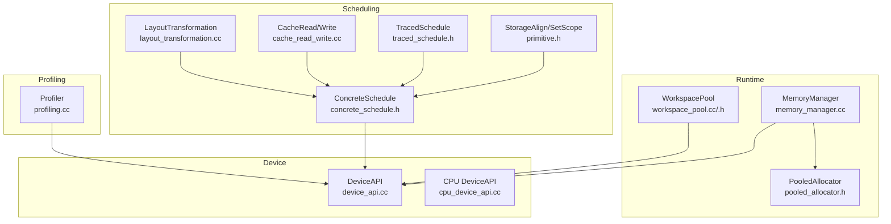
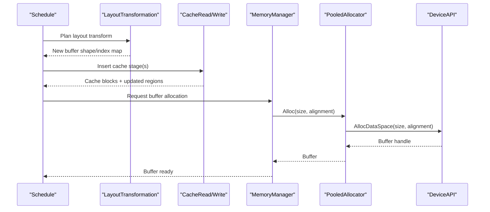
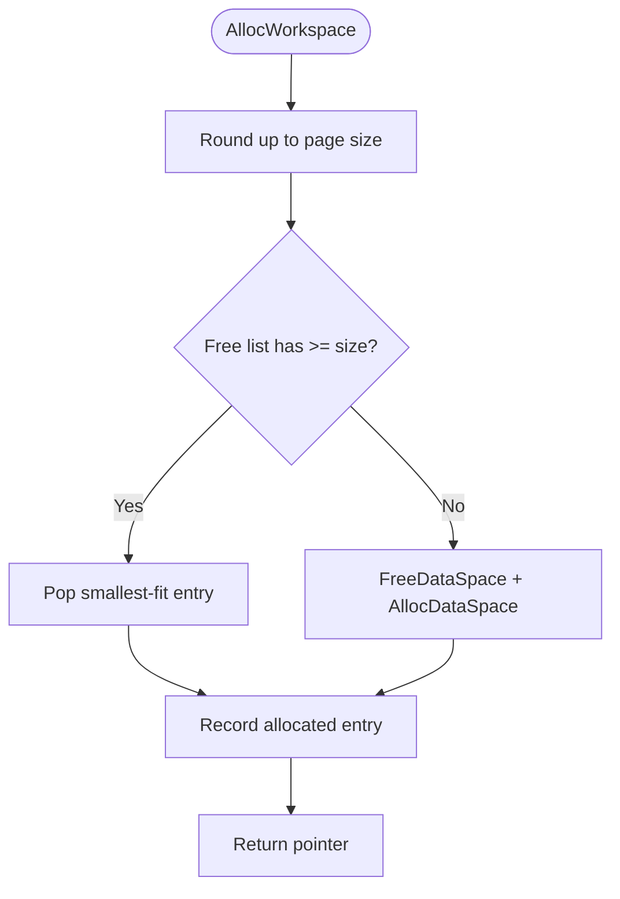
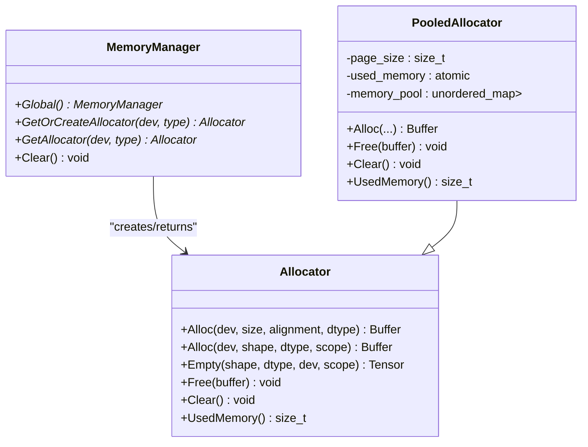
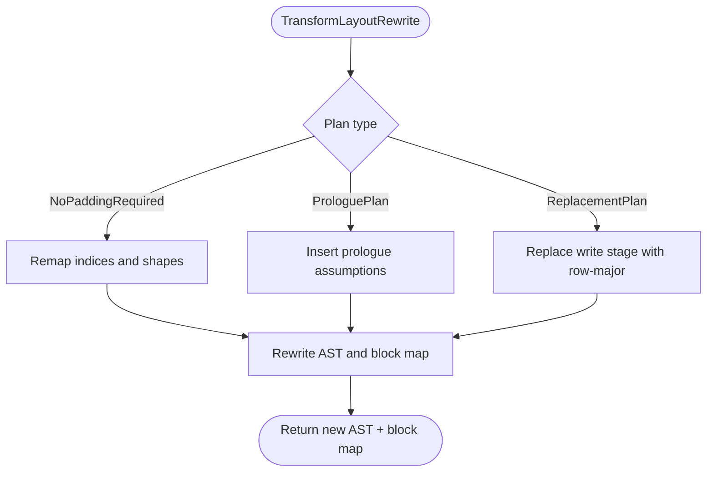
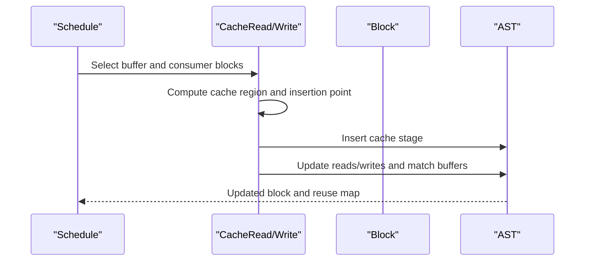
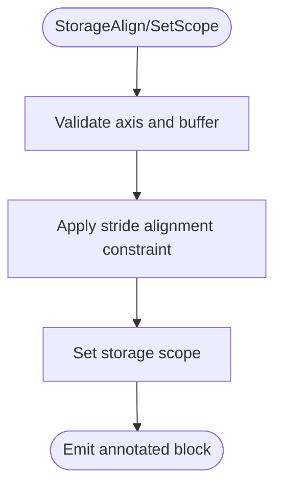
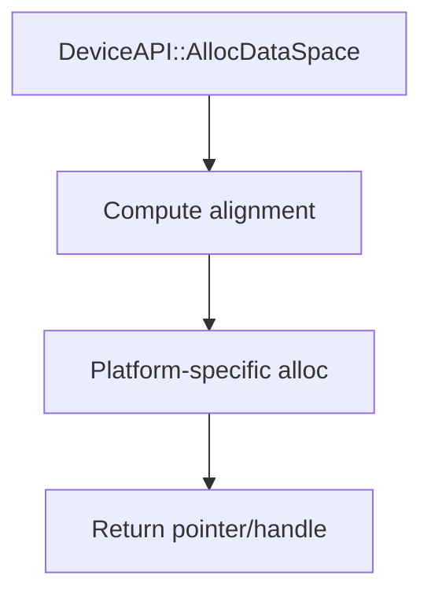
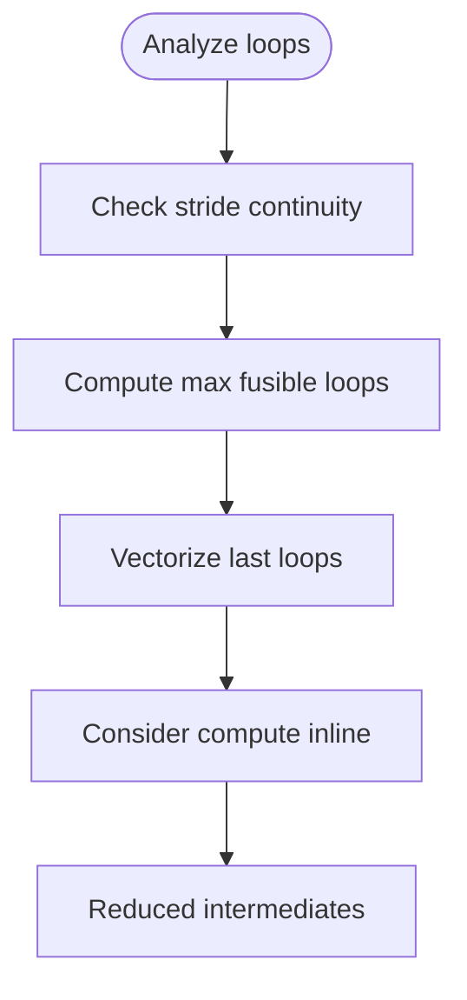
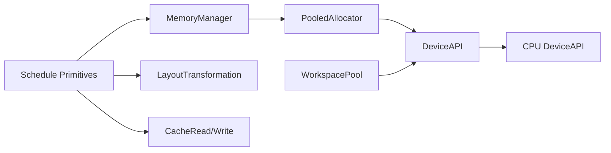

# Memory Optimization

<cite>
**Referenced Files in This Document**
- [workspace_pool.h](file://src/runtime/workspace_pool.h)
- [workspace_pool.cc](file://src/runtime/workspace_pool.cc)
- [memory_manager.cc](file://src/runtime/memory/memory_manager.cc)
- [pooled_allocator.h](file://src/runtime/memory/pooled_allocator.h)
- [layout_transformation.cc](file://src/s_tir/schedule/primitive/layout_transformation.cc)
- [cache_read_write.cc](file://src/s_tir/schedule/primitive/cache_read_write.cc)
- [concrete_schedule.h](file://src/s_tir/schedule/concrete_schedule.h)
- [traced_schedule.h](file://src/s_tir/schedule/traced_schedule.h)
- [device_target_interactions.rst](file://docs/arch/device_target_interactions.rst)
- [cpu_device_api.cc](file://src/runtime/cpu_device_api.cc)
- [device_api.cc](file://src/runtime/device_api.cc)
- [profiling.cc](file://src/runtime/profiling.cc)
- [memory_manager_tests.cc](file://tests/cpp/runtime/memory/memory_manager_tests.cc)
- [rewrite_parallel_vectorize_unroll.cc](file://src/s_tir/meta_schedule/postproc/rewrite_parallel_vectorize_unroll.cc)
- [compute_inline.cc](file://src/s_tir/schedule/primitive/compute_inline.cc)
- [primitive.h](file://src/s_tir/schedule/primitive.h)
</cite>

## Table of Contents
1. [Introduction](#introduction)
2. [Project Structure](#project-structure)
3. [Core Components](#core-components)
4. [Architecture Overview](#architecture-overview)
5. [Detailed Component Analysis](#detailed-component-analysis)
6. [Dependency Analysis](#dependency-analysis)
7. [Performance Considerations](#performance-considerations)
8. [Troubleshooting Guide](#troubleshooting-guide)
9. [Conclusion](#conclusion)

## Introduction
This document explains TVM’s memory optimization techniques and strategies across scheduling, runtime memory management, and device-specific behaviors. It covers memory allocation patterns, buffer management, storage optimization, memory layout transformations, workspace planning, memory-efficient scheduling, fused memory operations, cache-friendly data structures, memory profiling, bottleneck identification, and custom allocator development. Practical guidance is provided for unified memory access patterns and memory bandwidth optimization strategies.

## Project Structure
Key memory-related areas in the repository:
- Runtime workspace and memory management: workspace pools, memory manager, allocators
- Scheduling primitives for cache placement, layout transforms, and storage alignment
- Device API and CPU device memory helpers
- Profiling infrastructure for timing and metrics
- Tests validating memory manager behavior

**Diagram sources**
- [workspace_pool.cc:151-165](file://src/runtime/workspace_pool.cc#L151-L165)
- [memory_manager.cc:175-205](file://src/runtime/memory/memory_manager.cc#L175-L205)
- [pooled_allocator.h:39-126](file://src/runtime/memory/pooled_allocator.h#L39-L126)
- [layout_transformation.cc:752-774](file://src/s_tir/schedule/primitive/layout_transformation.cc#L752-L774)
- [cache_read_write.cc:935-1220](file://src/s_tir/schedule/primitive/cache_read_write.cc#L935-L1220)
- [concrete_schedule.h:123-141](file://src/s_tir/schedule/concrete_schedule.h#L123-L141)
- [traced_schedule.h:86-104](file://src/s_tir/schedule/traced_schedule.h#L86-L104)
- [primitive.h:553-578](file://src/s_tir/schedule/primitive.h#L553-L578)
- [device_api.cc:97-122](file://src/runtime/device_api.cc#L97-L122)
- [cpu_device_api.cc:60-109](file://src/runtime/cpu_device_api.cc#L60-L109)
- [profiling.cc:122-159](file://src/runtime/profiling.cc#L122-L159)

**Section sources**
- [workspace_pool.h:45-77](file://src/runtime/workspace_pool.h#L45-L77)
- [workspace_pool.cc:151-165](file://src/runtime/workspace_pool.cc#L151-L165)
- [memory_manager.cc:175-205](file://src/runtime/memory/memory_manager.cc#L175-L205)
- [pooled_allocator.h:39-126](file://src/runtime/memory/pooled_allocator.h#L39-L126)
- [layout_transformation.cc:752-774](file://src/s_tir/schedule/primitive/layout_transformation.cc#L752-L774)
- [cache_read_write.cc:935-1220](file://src/s_tir/schedule/primitive/cache_read_write.cc#L935-L1220)
- [concrete_schedule.h:123-141](file://src/s_tir/schedule/concrete_schedule.h#L123-L141)
- [traced_schedule.h:86-104](file://src/s_tir/schedule/traced_schedule.h#L86-L104)
- [primitive.h:553-578](file://src/s_tir/schedule/primitive.h#L553-L578)
- [device_api.cc:97-122](file://src/runtime/device_api.cc#L97-L122)
- [cpu_device_api.cc:60-109](file://src/runtime/cpu_device_api.cc#L60-L109)
- [profiling.cc:122-159](file://src/runtime/profiling.cc#L122-L159)

## Core Components
- WorkspacePool: Manages temporary workspace allocations per device ID with page-aligned allocation and LIFO-style reuse to reduce fragmentation and overhead.
- MemoryManager and Allocators: Provides device-specific allocator selection, scoped memory views, and buffer lifecycle management. Includes a pooled allocator that recycles device buffers by page size.
- LayoutTransformation: Rewrites buffer access indices and shapes to improve locality and reduce padding where possible, enabling cache-friendly layouts.
- CacheRead/Write and Reindex: Inserts cache stages and reindexes buffers to move hot data closer to compute, reducing global memory traffic.
- StorageAlign/SetScope: Aligns buffer strides to memory boundaries and sets storage scopes for device-local memory spaces.
- DeviceAPI and CPU DeviceAPI: Defines allocation/free semantics and platform-specific memory queries and alignment helpers.

**Section sources**
- [workspace_pool.h:45-77](file://src/runtime/workspace_pool.h#L45-L77)
- [workspace_pool.cc:46-122](file://src/runtime/workspace_pool.cc#L46-L122)
- [memory_manager.cc:175-205](file://src/runtime/memory/memory_manager.cc#L175-L205)
- [pooled_allocator.h:39-126](file://src/runtime/memory/pooled_allocator.h#L39-L126)
- [layout_transformation.cc:752-774](file://src/s_tir/schedule/primitive/layout_transformation.cc#L752-L774)
- [cache_read_write.cc:935-1220](file://src/s_tir/schedule/primitive/cache_read_write.cc#L935-L1220)
- [primitive.h:553-578](file://src/s_tir/schedule/primitive.h#L553-L578)
- [device_api.cc:97-122](file://src/runtime/device_api.cc#L97-L122)
- [cpu_device_api.cc:60-109](file://src/runtime/cpu_device_api.cc#L60-L109)

## Architecture Overview
The memory optimization pipeline integrates scheduling transformations with runtime memory management:
- Scheduling phase: Insert cache stages, transform layouts, and align storage to improve access patterns.
- Runtime phase: Allocate and recycle buffers via MemoryManager and PooledAllocator; use WorkspacePool for temporary workspaces.

**Diagram sources**
- [layout_transformation.cc:752-774](file://src/s_tir/schedule/primitive/layout_transformation.cc#L752-L774)
- [cache_read_write.cc:935-1220](file://src/s_tir/schedule/primitive/cache_read_write.cc#L935-L1220)
- [memory_manager.cc:175-205](file://src/runtime/memory/memory_manager.cc#L175-L205)
- [pooled_allocator.h:48-74](file://src/runtime/memory/pooled_allocator.h#L48-L74)
- [device_api.cc:97-122](file://src/runtime/device_api.cc#L97-L122)

## Detailed Component Analysis

### Workspace Pool
WorkspacePool amortizes temporary allocation costs by:
- Aligning requested sizes to a fixed page granularity
- Maintaining free lists and last-allocation fast-path
- Recycling pages across repeated allocation sizes

**Diagram sources**
- [workspace_pool.cc:46-86](file://src/runtime/workspace_pool.cc#L46-L86)

**Section sources**
- [workspace_pool.h:45-77](file://src/runtime/workspace_pool.h#L45-L77)
- [workspace_pool.cc:46-122](file://src/runtime/workspace_pool.cc#L46-L122)

### Memory Manager and Pooled Allocator
MemoryManager selects and caches device-specific allocators. PooledAllocator:
- Rounds up allocations to page size
- Keeps a per-size pool of reusable buffers
- Uses atomic counters for used memory and recursive mutex for thread safety
- Falls back to releasing all unused buffers on allocation failure

**Diagram sources**
- [memory_manager.cc:175-205](file://src/runtime/memory/memory_manager.cc#L175-L205)
- [pooled_allocator.h:39-126](file://src/runtime/memory/pooled_allocator.h#L39-L126)

**Section sources**
- [memory_manager.cc:175-205](file://src/runtime/memory/memory_manager.cc#L175-L205)
- [pooled_allocator.h:39-126](file://src/runtime/memory/pooled_allocator.h#L39-L126)
- [memory_manager_tests.cc:51-118](file://tests/cpp/runtime/memory/memory_manager_tests.cc#L51-L118)

### Layout Transformations
TransformLayoutRewriter updates buffer shapes and indices according to an index map. It supports plans:
- NoPaddingRequired: pure index remapping
- ProloguePlan: assumes caller pads inputs
- ReplacementPlan: replaces write stage with row-major traversal over new indices

**Diagram sources**
- [layout_transformation.cc:34-761](file://src/s_tir/schedule/primitive/layout_transformation.cc#L34-L761)
- [layout_transformation.cc:752-774](file://src/s_tir/schedule/primitive/layout_transformation.cc#L752-L774)

**Section sources**
- [layout_transformation.cc:34-761](file://src/s_tir/schedule/primitive/layout_transformation.cc#L34-L761)
- [layout_transformation.cc:1199-1220](file://src/s_tir/schedule/primitive/layout_transformation.cc#L1199-L1220)
- [layout_transformation.cc:1542-1566](file://src/s_tir/schedule/primitive/layout_transformation.cc#L1542-L1566)

### Cache Read/Write and Reindex
CacheRead/Write inserts dedicated cache stages to bring data closer to compute. It updates:
- BufferRegions for cache footprint
- MatchBufferRegions to reflect aliasing
- Block reads/writes and buffer_map accordingly

**Diagram sources**
- [cache_read_write.cc:935-1220](file://src/s_tir/schedule/primitive/cache_read_write.cc#L935-L1220)
- [concrete_schedule.h:123-141](file://src/s_tir/schedule/concrete_schedule.h#L123-L141)
- [traced_schedule.h:86-104](file://src/s_tir/schedule/traced_schedule.h#L86-L104)

**Section sources**
- [cache_read_write.cc:935-1220](file://src/s_tir/schedule/primitive/cache_read_write.cc#L935-L1220)
- [concrete_schedule.h:123-141](file://src/s_tir/schedule/concrete_schedule.h#L123-L141)
- [traced_schedule.h:86-104](file://src/s_tir/schedule/traced_schedule.h#L86-L104)

### Storage Alignment and Scope
StorageAlign enforces stride alignment along a specified axis to improve memory coalescing and avoid bank conflicts. SetScope assigns storage scope to leverage device-local memory spaces.

**Diagram sources**
- [primitive.h:553-578](file://src/s_tir/schedule/primitive.h#L553-L578)
- [concrete_schedule.h:158-162](file://src/s_tir/schedule/concrete_schedule.h#L158-L162)

**Section sources**
- [primitive.h:553-578](file://src/s_tir/schedule/primitive.h#L553-L578)
- [concrete_schedule.h:158-162](file://src/s_tir/schedule/concrete_schedule.h#L158-L162)

### Device Memory Management and Alignment
DeviceAPI provides:
- AllocWorkspace/AllocDataSpace
- Data size calculation and alignment helpers
CPU DeviceAPI demonstrates platform-specific total memory reporting and aligned allocation.

**Diagram sources**
- [device_api.cc:97-122](file://src/runtime/device_api.cc#L97-L122)
- [cpu_device_api.cc:60-109](file://src/runtime/cpu_device_api.cc#L60-L109)

**Section sources**
- [device_api.cc:97-122](file://src/runtime/device_api.cc#L97-L122)
- [cpu_device_api.cc:60-109](file://src/runtime/cpu_device_api.cc#L60-L109)
- [device_target_interactions.rst:78-98](file://docs/arch/device_target_interactions.rst#L78-L98)

### Memory-Efficient Scheduling Patterns and Fused Operations
- Loop fusion and vectorization: Postproc computes fusibility by stride continuity and loop extents to maximize vectorization and reduce memory traffic.
- ComputeInline: Removes intermediate buffers when safe, reducing memory footprint.

**Diagram sources**
- [rewrite_parallel_vectorize_unroll.cc:243-278](file://src/s_tir/meta_schedule/postproc/rewrite_parallel_vectorize_unroll.cc#L243-L278)
- [compute_inline.cc:355-1545](file://src/s_tir/schedule/primitive/compute_inline.cc#L355-L1545)

**Section sources**
- [rewrite_parallel_vectorize_unroll.cc:243-278](file://src/s_tir/meta_schedule/postproc/rewrite_parallel_vectorize_unroll.cc#L243-L278)
- [compute_inline.cc:355-1545](file://src/s_tir/schedule/primitive/compute_inline.cc#L355-L1545)

## Dependency Analysis
- Scheduling depends on runtime memory to materialize cache stages and transformed buffers.
- MemoryManager delegates to DeviceAPI for device memory operations.
- WorkspacePool relies on DeviceAPI for page-sized allocations.

**Diagram sources**
- [memory_manager.cc:175-205](file://src/runtime/memory/memory_manager.cc#L175-L205)
- [pooled_allocator.h:39-126](file://src/runtime/memory/pooled_allocator.h#L39-L126)
- [workspace_pool.cc:46-86](file://src/runtime/workspace_pool.cc#L46-L86)
- [layout_transformation.cc:752-774](file://src/s_tir/schedule/primitive/layout_transformation.cc#L752-L774)
- [cache_read_write.cc:935-1220](file://src/s_tir/schedule/primitive/cache_read_write.cc#L935-L1220)
- [device_api.cc:97-122](file://src/runtime/device_api.cc#L97-L122)
- [cpu_device_api.cc:60-109](file://src/runtime/cpu_device_api.cc#L60-L109)

**Section sources**
- [memory_manager.cc:175-205](file://src/runtime/memory/memory_manager.cc#L175-L205)
- [pooled_allocator.h:39-126](file://src/runtime/memory/pooled_allocator.h#L39-L126)
- [workspace_pool.cc:46-86](file://src/runtime/workspace_pool.cc#L46-L86)
- [layout_transformation.cc:752-774](file://src/s_tir/schedule/primitive/layout_transformation.cc#L752-L774)
- [cache_read_write.cc:935-1220](file://src/s_tir/schedule/primitive/cache_read_write.cc#L935-L1220)
- [device_api.cc:97-122](file://src/runtime/device_api.cc#L97-L122)
- [cpu_device_api.cc:60-109](file://src/runtime/cpu_device_api.cc#L60-L109)

## Performance Considerations
- Prefer page-aligned allocations to reduce fragmentation and improve reuse (WorkspacePool).
- Use PooledAllocator to recycle device buffers and lower allocation overhead.
- Apply StorageAlign to achieve coalesced access and avoid bank conflicts.
- Insert CacheRead/Write to localize frequently accessed data.
- Transform layouts to reduce padding and improve spatial locality.
- Fuse loops with contiguous strides and vectorize the innermost loops.
- Inline compute when buffer lifetimes permit to reduce memory footprint.

[No sources needed since this section provides general guidance]

## Troubleshooting Guide
- MemoryManager allocator not found: Ensure the allocator is created for the device and type before use.
- Allocation failures in PooledAllocator: The allocator attempts to release unused buffers and retry; if persistent, consider increasing device memory or reducing peak allocation sizes.
- Workspace leaks: Verify that temporary allocations follow LIFO semantics and are freed in reverse order.
- Profiling memory metrics: Use the Profiler to collect device-side metrics and correlate with scheduling transformations.

**Section sources**
- [memory_manager.cc:193-205](file://src/runtime/memory/memory_manager.cc#L193-L205)
- [pooled_allocator.h:62-74](file://src/runtime/memory/pooled_allocator.h#L62-L74)
- [workspace_pool.cc:88-122](file://src/runtime/workspace_pool.cc#L88-L122)
- [profiling.cc:122-159](file://src/runtime/profiling.cc#L122-L159)

## Conclusion
TVM’s memory optimization combines scheduling-driven transformations with robust runtime memory management. By aligning memory access patterns, inserting cache stages, transforming layouts, and leveraging pooled and workspace allocations, applications can achieve significant reductions in memory traffic and improved cache utilization. The provided primitives enable both high-level strategies and low-level tuning across diverse device targets.