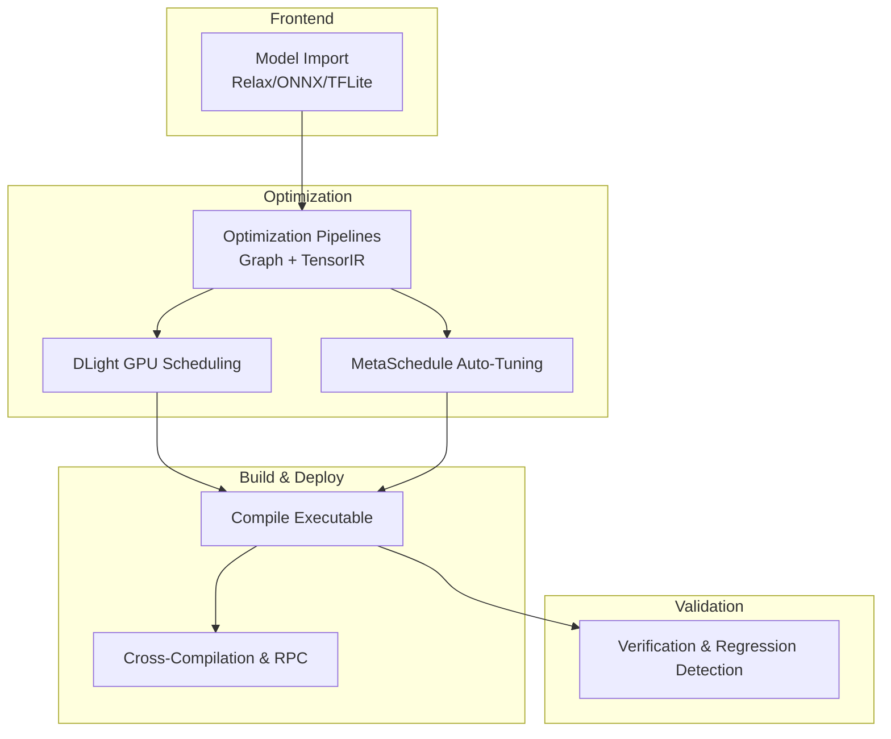
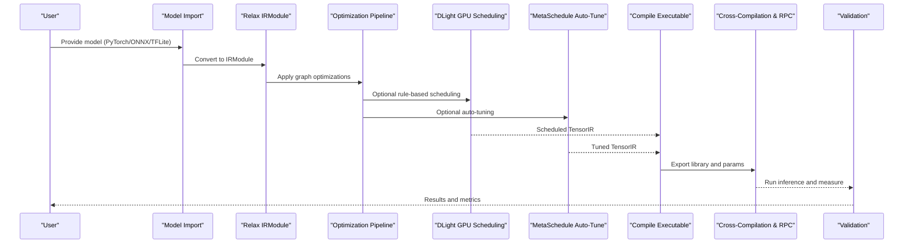
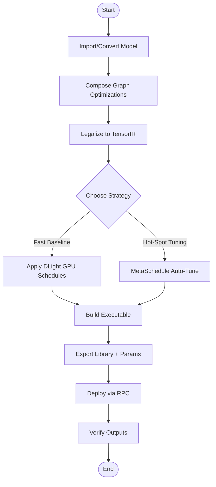
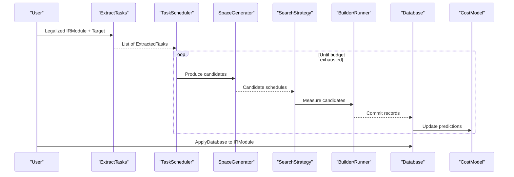
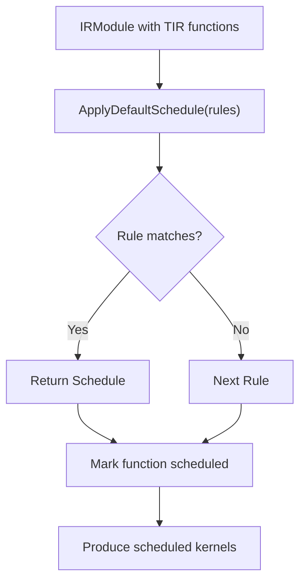
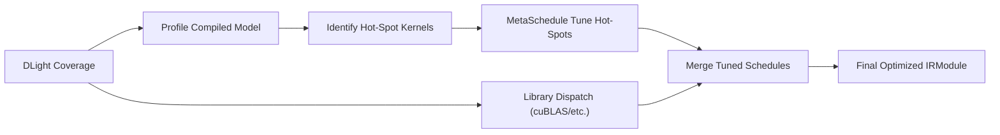
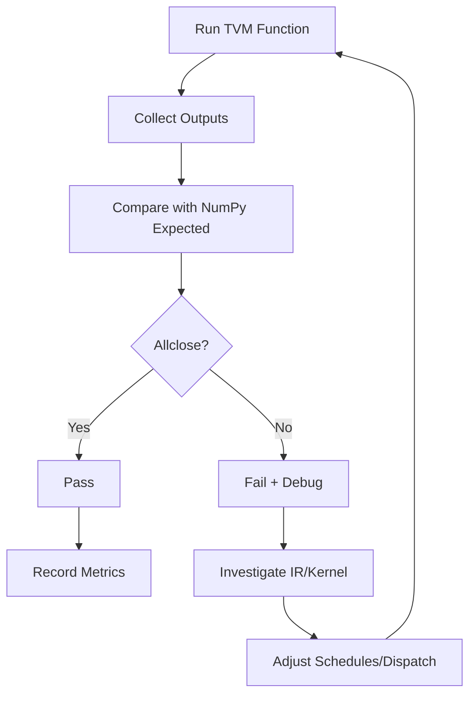
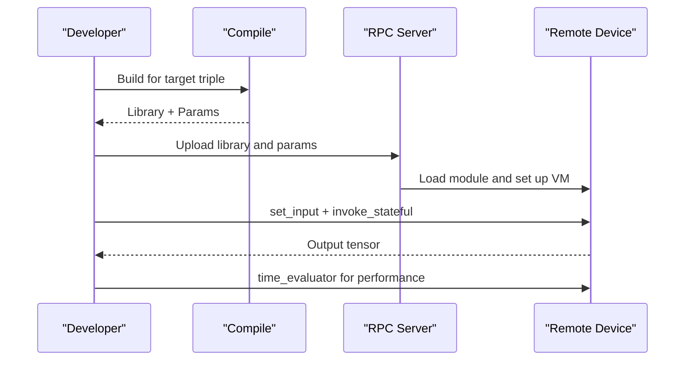
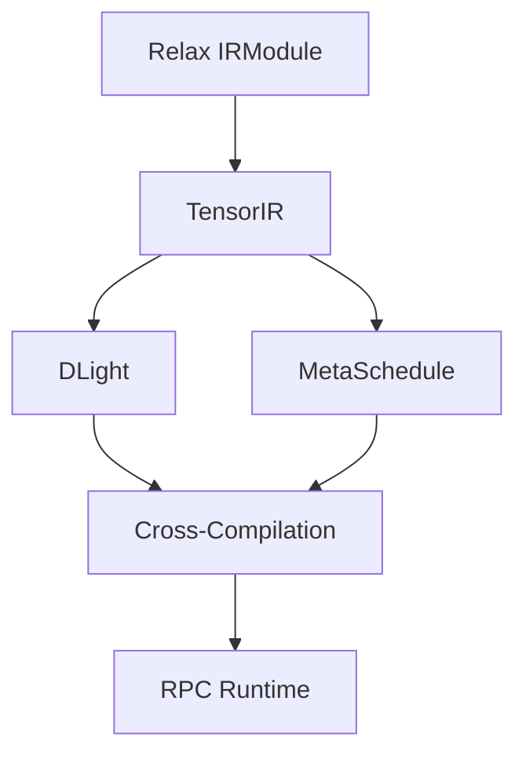

# Optimization Workflows and Best Practices

<cite>
**Referenced Files in This Document**
- [optimize_llm.py](file://docs/how_to/tutorials/optimize_llm.py)
- [e2e_opt_model.py](file://docs/how_to/tutorials/e2e_opt_model.py)
- [customize_opt.py](file://docs/how_to/tutorials/customize_opt.py)
- [cross_compilation_and_rpc.py](file://docs/how_to/tutorials/cross_compilation_and_rpc.py)
- [meta_schedule.py](file://docs/deep_dive/tensor_ir/tutorials/meta_schedule.py)
- [dlight_gpu_scheduling.py](file://docs/deep_dive/tensor_ir/tutorials/dlight_gpu_scheduling.py)
- [overview.rst](file://docs/get_started/overview.rst)
- [quick_start.py](file://docs/get_started/tutorials/quick_start.py)
- [import_model.py](file://docs/how_to/tutorials/import_model.py)
- [traced_schedule.cc](file://src/s_tir/schedule/traced_schedule.cc)
- [concrete_schedule.cc](file://src/s_tir/schedule/concrete_schedule.cc)
- [test_meta_schedule_task_scheduler.py](file://tests/python/s_tir/meta_schedule/test_meta_schedule_task_scheduler.py)
- [test_meta_schedule_search_strategy.py](file://tests/python/s_tir/meta_schedule/test_meta_schedule_search_strategy.py)
- [backend_adreno_utils.py](file://tests/python/relax/backend/adreno/utils.py)
- [relax_conftest.py](file://tests/python/relax/conftest.py)
- [training_optimizer_numeric.py](file://tests/python/relax/test_training_optimizer_numeric.py)
- [rpc_endpoint.cc](file://src/runtime/rpc/rpc_endpoint.cc)
- [rpc_socket_impl.cc](file://src/runtime/rpc/rpc_socket_impl.cc)
- [minrpc.py](file://python/tvm/rpc/minrpc.py)
- [cutlass_gen_tensor_op.py](file://python/tvm/contrib/cutlass/gen_tensor_op.py)
</cite>

## Table of Contents
1. [Introduction](#introduction)
2. [Project Structure](#project-structure)
3. [Core Components](#core-components)
4. [Architecture Overview](#architecture-overview)
5. [Detailed Component Analysis](#detailed-component-analysis)
6. [Dependency Analysis](#dependency-analysis)
7. [Performance Considerations](#performance-considerations)
8. [Troubleshooting Guide](#troubleshooting-guide)
9. [Conclusion](#conclusion)
10. [Appendices](#appendices)

## Introduction
This document presents systematic optimization workflows and best practices in TVM, covering end-to-end pipelines from model import through deployment optimization. It explains the meta-scheduling workflow for automatic kernel optimization, manual optimization techniques, and hybrid strategies combining rule-based and search-based tuning. It also documents validation, performance regression detection, and continuous optimization processes, with practical examples, tool integrations, and automated pipelines. Guidance is provided for different model types, hardware targets, and deployment scenarios, including trade-offs between performance and accuracy, and prioritization strategies.

## Project Structure
TVM’s optimization capabilities span:
- Frontend conversions (Relax, TVMScript, ONNX/TFLite)
- Graph-level optimizations (fusion, layout rewriting)
- TensorIR-level optimizations (scheduling, library dispatch)
- Auto-tuning (MetaSchedule) and rule-based scheduling (DLight)
- Cross-compilation and RPC deployment
- Validation and regression detection

**Section sources**
- [overview.rst:26-57](file://docs/get_started/overview.rst#L26-L57)
- [quick_start.py:105-148](file://docs/get_started/tutorials/quick_start.py#L105-L148)

## Core Components
- Relax IRModule: High-level representation of models and graph-level optimizations.
- TensorIR: Low-level representation for kernel scheduling and code generation.
- DLight: Rule-based GPU scheduling for rapid coverage of common patterns.
- MetaSchedule: Search-based auto-tuning to discover near-optimal schedules.
- Cross-compilation and RPC: Build for remote targets and run inference remotely.
- Validation utilities: Numeric checks, well-formedness instrumentation, and reference comparisons.

**Section sources**
- [customize_opt.py:62-238](file://docs/how_to/tutorials/customize_opt.py#L62-L238)
- [meta_schedule.py:19-308](file://docs/deep_dive/tensor_ir/tutorials/meta_schedule.py#L19-L308)
- [dlight_gpu_scheduling.py:19-317](file://docs/deep_dive/tensor_ir/tutorials/dlight_gpu_scheduling.py#L19-L317)
- [cross_compilation_and_rpc.py:18-601](file://docs/how_to/tutorials/cross_compilation_and_rpc.py#L18-L601)

## Architecture Overview
The end-to-end optimization pipeline integrates model import, composable graph and tensor optimizations, optional auto-tuning, and deployment with validation.

**Diagram sources**
- [import_model.py:396-407](file://docs/how_to/tutorials/import_model.py#L396-L407)
- [customize_opt.py:150-238](file://docs/how_to/tutorials/customize_opt.py#L150-L238)
- [cross_compilation_and_rpc.py:380-408](file://docs/how_to/tutorials/cross_compilation_and_rpc.py#L380-L408)

## Detailed Component Analysis

### End-to-End Optimization Pipeline
- Import models from PyTorch/ONNX/TFLite into Relax IRModule.
- Compose graph optimizations (e.g., fusion, layout rewriting).
- Lower to TensorIR and apply DLight or MetaSchedule.
- Build executable and export artifacts.
- Deploy via RPC to remote devices and validate outputs.

**Section sources**
- [e2e_opt_model.py:29-154](file://docs/how_to/tutorials/e2e_opt_model.py#L29-L154)
- [optimize_llm.py:354-622](file://docs/how_to/tutorials/optimize_llm.py#L354-L622)
- [customize_opt.py:150-238](file://docs/how_to/tutorials/customize_opt.py#L150-L238)

### Meta-Scheduling Workflow
MetaSchedule explores design spaces for TIR schedules using evolutionary search, guided by a cost model and measured on real hardware. It supports full-module tuning and selective operator tuning, persists tuning logs, and can resume tuning sessions.

**Diagram sources**
- [meta_schedule.py:38-308](file://docs/deep_dive/tensor_ir/tutorials/meta_schedule.py#L38-L308)
- [test_meta_schedule_task_scheduler.py:288-304](file://tests/python/s_tir/meta_schedule/test_meta_schedule_task_scheduler.py#L288-L304)
- [test_meta_schedule_search_strategy.py:340-346](file://tests/python/s_tir/meta_schedule/test_meta_schedule_search_strategy.py#L340-L346)

**Section sources**
- [meta_schedule.py:19-308](file://docs/deep_dive/tensor_ir/tutorials/meta_schedule.py#L19-L308)
- [test_meta_schedule_task_scheduler.py:434-447](file://tests/python/s_tir/meta_schedule/test_meta_schedule_task_scheduler.py#L434-L447)

### DLight GPU Scheduling
DLight applies deterministic rule-based scheduling for GPU kernels. It is fast and effective for known patterns (e.g., GEMM, GEMV, reductions) and complements MetaSchedule by covering broad kernel families quickly.

**Diagram sources**
- [dlight_gpu_scheduling.py:86-108](file://docs/deep_dive/tensor_ir/tutorials/dlight_gpu_scheduling.py#L86-L108)
- [traced_schedule.cc:25-55](file://src/s_tir/schedule/traced_schedule.cc#L25-L55)
- [concrete_schedule.cc:27-43](file://src/s_tir/schedule/concrete_schedule.cc#L27-L43)

**Section sources**
- [dlight_gpu_scheduling.py:19-317](file://docs/deep_dive/tensor_ir/tutorials/dlight_gpu_scheduling.py#L19-L317)
- [traced_schedule.cc:1-55](file://src/s_tir/schedule/traced_schedule.cc#L1-L55)
- [concrete_schedule.cc:1-53](file://src/s_tir/schedule/concrete_schedule.cc#L1-L53)

### Hybrid Optimization Strategies
- Use DLight for broad, fast coverage of common kernels.
- Profile compiled models to identify hot-spot kernels.
- Apply MetaSchedule to auto-tune only those hot-spot kernels.
- Optionally combine with library dispatch (e.g., cuBLAS) for specific operator patterns.

**Section sources**
- [dlight_gpu_scheduling.py:217-252](file://docs/deep_dive/tensor_ir/tutorials/dlight_gpu_scheduling.py#L217-L252)
- [customize_opt.py:150-180](file://docs/how_to/tutorials/customize_opt.py#L150-L180)

### Validation and Regression Detection
- Numeric verification: Compare TVM outputs with NumPy equivalents using tolerance thresholds.
- Well-formedness instrumentation: Enforce pre/post transform well-formed checks in tests.
- Reference comparison: Build and run reference implementations on a reference target for validation.
- Continuous optimization: Persist tuning logs and reuse across runs/models with shared databases.

**Section sources**
- [training_optimizer_numeric.py:44-78](file://tests/python/relax/test_training_optimizer_numeric.py#L44-L78)
- [relax_conftest.py:35-85](file://tests/python/relax/conftest.py#L35-L85)
- [backend_adreno_utils.py:228-249](file://tests/python/relax/backend/adreno/utils.py#L228-L249)

### Deployment Optimization and RPC
- Cross-compile for target triple and feature sets (e.g., ARM NEON, x86 AVX-512, RISC-V vector).
- Export compiled library and parameters; upload to remote device via RPC.
- Run inference remotely and measure performance excluding network overhead.
- Use time_evaluator with invoke_stateful for accurate timing over RPC.

**Diagram sources**
- [cross_compilation_and_rpc.py:380-408](file://docs/how_to/tutorials/cross_compilation_and_rpc.py#L380-L408)
- [cross_compilation_and_rpc.py:513-557](file://docs/how_to/tutorials/cross_compilation_and_rpc.py#L513-L557)
- [rpc_endpoint.cc:794-823](file://src/runtime/rpc/rpc_endpoint.cc#L794-L823)
- [rpc_socket_impl.cc:105-127](file://src/runtime/rpc/rpc_socket_impl.cc#L105-L127)
- [minrpc.py:51-89](file://python/tvm/rpc/minrpc.py#L51-L89)

**Section sources**
- [cross_compilation_and_rpc.py:18-601](file://docs/how_to/tutorials/cross_compilation_and_rpc.py#L18-L601)
- [rpc_endpoint.cc:1-823](file://src/runtime/rpc/rpc_endpoint.cc#L1-L823)
- [rpc_socket_impl.cc:105-127](file://src/runtime/rpc/rpc_socket_impl.cc#L105-L127)
- [minrpc.py:51-89](file://python/tvm/rpc/minrpc.py#L51-L89)

### Practical Examples and Automated Pipelines
- End-to-end optimization with auto-tuning for ResNet-18 and GPU targets.
- LLM-specific pipeline with DLight schedules and KV cache integration.
- Customizable optimization pipeline with library dispatch and MetaSchedule tuning.
- Cross-compilation and RPC deployment for ARM/x86/RISC-V targets.

**Section sources**
- [e2e_opt_model.py:90-154](file://docs/how_to/tutorials/e2e_opt_model.py#L90-L154)
- [optimize_llm.py:371-431](file://docs/how_to/tutorials/optimize_llm.py#L371-L431)
- [customize_opt.py:150-238](file://docs/how_to/tutorials/customize_opt.py#L150-L238)
- [cross_compilation_and_rpc.py:262-557](file://docs/how_to/tutorials/cross_compilation_and_rpc.py#L262-L557)

## Dependency Analysis
- DLight and MetaSchedule operate on TensorIR; they complement each other in the pipeline.
- Relax IRModule serves as the interface between graph-level optimizations and tensor-level scheduling.
- Cross-compilation and RPC rely on target configuration and runtime libraries.
- Validation relies on numeric assertions and well-formedness checks.

**Diagram sources**
- [dlight_gpu_scheduling.py:86-108](file://docs/deep_dive/tensor_ir/tutorials/dlight_gpu_scheduling.py#L86-L108)
- [meta_schedule.py:38-72](file://docs/deep_dive/tensor_ir/tutorials/meta_schedule.py#L38-L72)
- [cross_compilation_and_rpc.py:380-408](file://docs/how_to/tutorials/cross_compilation_and_rpc.py#L380-L408)

**Section sources**
- [dlight_gpu_scheduling.py:19-317](file://docs/deep_dive/tensor_ir/tutorials/dlight_gpu_scheduling.py#L19-L317)
- [meta_schedule.py:19-308](file://docs/deep_dive/tensor_ir/tutorials/meta_schedule.py#L19-L308)
- [cross_compilation_and_rpc.py:18-601](file://docs/how_to/tutorials/cross_compilation_and_rpc.py#L18-L601)

## Performance Considerations
- Rule-based vs. search-based: DLight offers fast coverage; MetaSchedule improves performance at higher compile-time cost.
- Trial budgets: Allocate per-task and global trials proportionally to task counts and weights.
- Database reuse: Structural hashing enables cross-model reuse; anchor-block matching increases flexibility.
- Hardware-specific tuning: Use target feature flags (e.g., NEON, AVX-512, RISC-V vector) to maximize performance.
- Validation overhead: Prefer time_evaluator with invoke_stateful to exclude network overhead in RPC scenarios.

[No sources needed since this section provides general guidance]

## Troubleshooting Guide
- Numeric mismatches: Use tolerance-based assertions and verify with reference implementations.
- IR well-formedness: Enable pre/post transform checks via well-formed instruments in tests.
- RPC timing: Use time_evaluator with invoke_stateful to avoid network overhead in performance measurements.
- Tuning convergence: Increase max_trials_global and max_trials_per_task; use selective tuning by op_names to reduce search space.

**Section sources**
- [training_optimizer_numeric.py:44-78](file://tests/python/relax/test_training_optimizer_numeric.py#L44-L78)
- [relax_conftest.py:35-85](file://tests/python/relax/conftest.py#L35-L85)
- [cross_compilation_and_rpc.py:504-512](file://docs/how_to/tutorials/cross_compilation_and_rpc.py#L504-L512)
- [meta_schedule.py:267-296](file://docs/deep_dive/tensor_ir/tutorials/meta_schedule.py#L267-L296)

## Conclusion
TVM’s optimization ecosystem combines composable graph and tensor optimizations, rule-based scheduling, and search-based auto-tuning. A hybrid workflow—DLight for broad coverage and MetaSchedule for hot-spot kernels—provides strong performance with controllable compile costs. Cross-compilation and RPC streamline deployment across diverse hardware targets. Validation and regression detection ensure correctness and reliability. By tuning trial budgets, leveraging database reuse, and integrating hardware-specific optimizations, teams can continuously improve deployment pipelines for varied model types and scenarios.

[No sources needed since this section summarizes without analyzing specific files]

## Appendices

### Best Practices by Model Type and Hardware
- CNNs and CV models: Combine DLight for common conv/batchnorm/matmul patterns; use MetaSchedule for residual bottlenecks.
- Transformers and LLMs: Use DLight schedules for attention and MLP kernels; integrate KV caches; tune decode and prefill stages separately.
- Mobile/embedded (ARM/RISC-V): Favor NEON/NEON-V and vector extensions; prefer DLight for quick wins; selectively tune heavy kernels.
- x86 servers: Use AVX-512 and modern instruction sets; leverage library dispatch for BLAS-heavy layers.

[No sources needed since this section provides general guidance]

### Optimization Trade-offs and Prioritization
- Performance vs. accuracy: Prefer accuracy-preserving optimizations first; use quantization-aware passes judiciously; validate numerics rigorously.
- Compile time vs. runtime: Use DLight for rapid iteration; reserve MetaSchedule for hot-spots; automate tuning with persistent databases.
- Coverage vs. precision: DLight covers many kernels quickly; MetaSchedule refines performance for critical paths.

[No sources needed since this section provides general guidance]