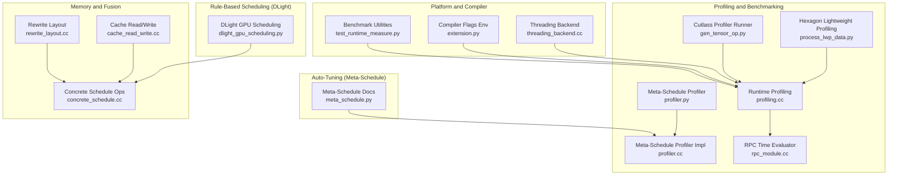
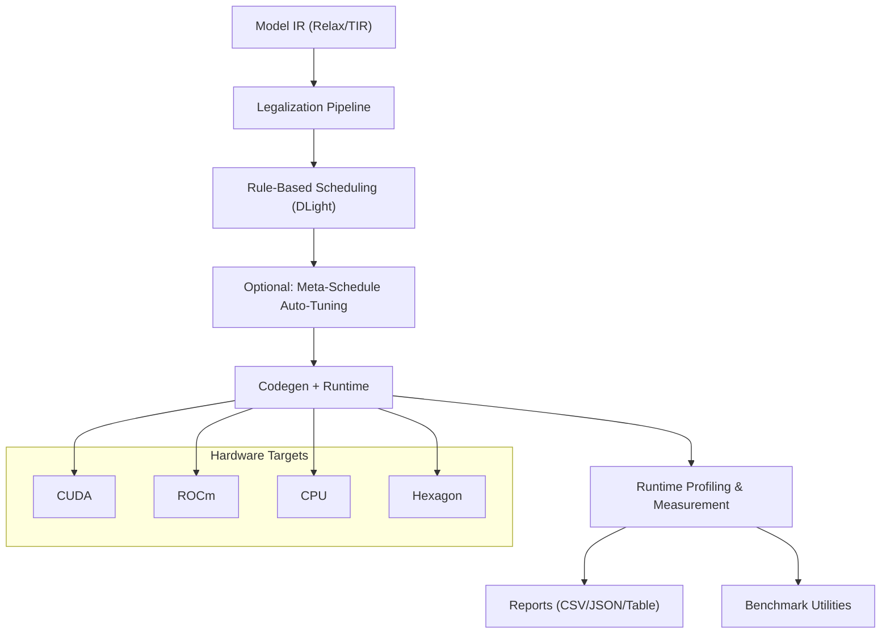
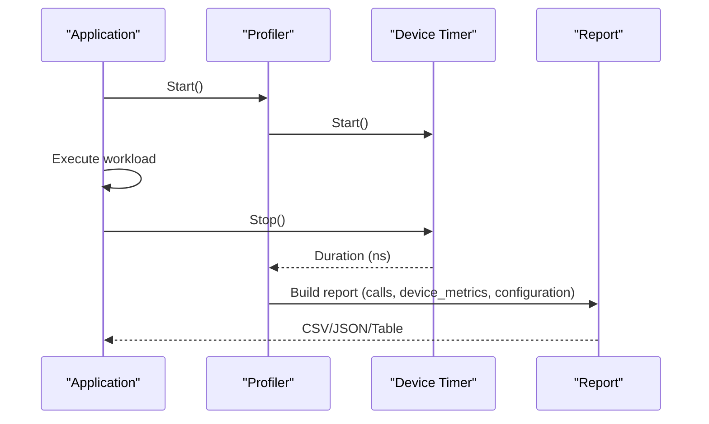
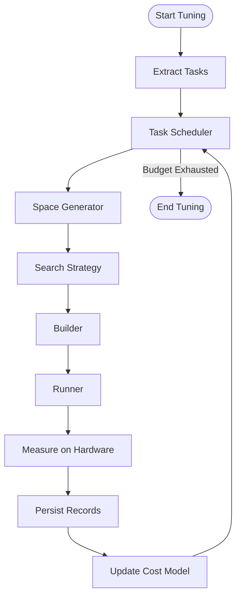
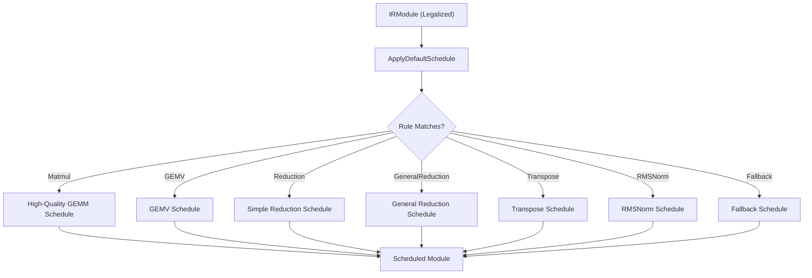
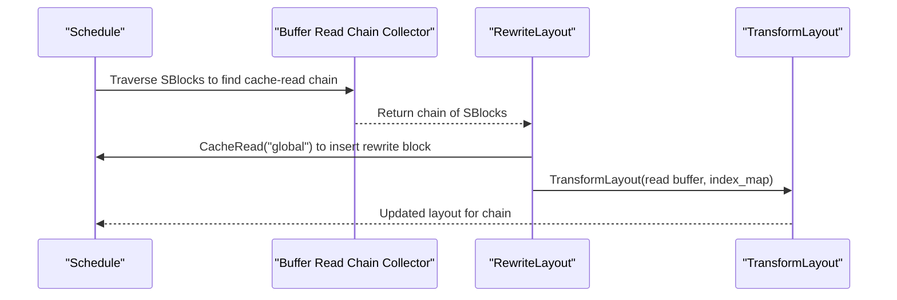
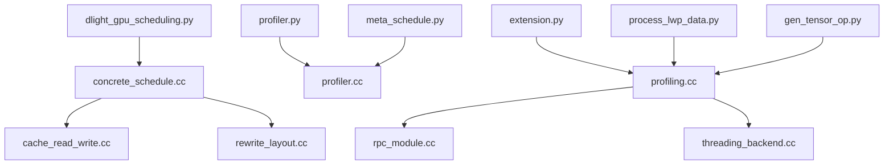

# Performance Optimization

<cite>
**Referenced Files in This Document**
- [profiling.cc](file://src/runtime/profiling.cc)
- [profiler.py](file://python/tvm/s_tir/meta_schedule/profiler.py)
- [profiler.cc](file://src/s_tir/meta_schedule/profiler.cc)
- [meta_schedule.py](file://docs/deep_dive/tensor_ir/tutorials/meta_schedule.py)
- [dlight_gpu_scheduling.py](file://docs/deep_dive/tensor_ir/tutorials/dlight_gpu_scheduling.py)
- [cache_read_write.cc](file://src/s_tir/schedule/primitive/cache_read_write.cc)
- [concrete_schedule.cc](file://src/s_tir/schedule/concrete_schedule.cc)
- [rewrite_layout.cc](file://src/s_tir/meta_schedule/postproc/rewrite_layout.cc)
- [rpc_module.cc](file://src/runtime/rpc/rpc_module.cc)
- [process_lwp_data.py](file://python/tvm/contrib/hexagon/profiling/process_lwp_data.py)
- [gen_tensor_op.py](file://python/tvm/contrib/cutlass/gen_tensor_op.py)
- [threading_backend.cc](file://src/runtime/threading_backend.cc)
- [test_runtime_measure.py](file://tests/python/runtime/test_runtime_measure.py)
- [extension.py](file://3rdparty/tvm-ffi/python/tvm_ffi/cpp/extension.py)
</cite>

## Table of Contents
1. [Introduction](#introduction)
2. [Project Structure](#project-structure)
3. [Core Components](#core-components)
4. [Architecture Overview](#architecture-overview)
5. [Detailed Component Analysis](#detailed-component-analysis)
6. [Dependency Analysis](#dependency-analysis)
7. [Performance Considerations](#performance-considerations)
8. [Troubleshooting Guide](#troubleshooting-guide)
9. [Conclusion](#conclusion)
10. [Appendices](#appendices)

## Introduction
This document provides a comprehensive guide to performance optimization in TVM, covering profiling and benchmarking methodologies, memory optimization techniques, and hardware-specific tuning strategies. It explains the meta-scheduling system for automatic kernel optimization, quantization benefits, and mixed precision techniques. It also covers memory layout optimization, fusion strategies, and cache-friendly scheduling patterns. Practical examples of performance analysis, bottleneck identification, and optimization implementation are included, along with guidance on profiling tools, performance counters, measurement techniques, platform-specific optimizations, compiler flags, and runtime configuration options.

## Project Structure
The performance optimization capabilities in TVM span multiple subsystems:
- Runtime profiling and benchmarking: timers, device synchronization, and measurement wrappers
- Meta-scheduling: automated search-based tuning with design space exploration and hardware measurement
- Rule-based scheduling (DLight): fast, deterministic GPU scheduling for common patterns
- Memory optimization primitives: cache stages, layout rewriting, and fusion
- Platform-specific integrations: CUDA/ROCm architecture detection, CPU thread affinity, and RPC-based measurement

**Diagram sources**
- [profiling.cc:122-937](file://src/runtime/profiling.cc#L122-L937)
- [profiler.py:30-75](file://python/tvm/s_tir/meta_schedule/profiler.py#L30-L75)
- [profiler.cc:30-144](file://src/s_tir/meta_schedule/profiler.cc#L30-L144)
- [meta_schedule.py:19-308](file://docs/deep_dive/tensor_ir/tutorials/meta_schedule.py#L19-L308)
- [dlight_gpu_scheduling.py:19-317](file://docs/deep_dive/tensor_ir/tutorials/dlight_gpu_scheduling.py#L19-L317)
- [cache_read_write.cc:59-87](file://src/s_tir/schedule/primitive/cache_read_write.cc#L59-L87)
- [concrete_schedule.cc:660-732](file://src/s_tir/schedule/concrete_schedule.cc#L660-L732)
- [rewrite_layout.cc:186-245](file://src/s_tir/meta_schedule/postproc/rewrite_layout.cc#L186-L245)
- [rpc_module.cc:428-457](file://src/runtime/rpc/rpc_module.cc#L428-L457)
- [process_lwp_data.py:101-131](file://python/tvm/contrib/hexagon/profiling/process_lwp_data.py#L101-L131)
- [gen_tensor_op.py:419-454](file://python/tvm/contrib/cutlass/gen_tensor_op.py#L419-L454)
- [threading_backend.cc:297-328](file://src/runtime/threading_backend.cc#L297-L328)
- [test_runtime_measure.py:38-71](file://tests/python/runtime/test_runtime_measure.py#L38-L71)
- [extension.py:188-429](file://3rdparty/tvm-ffi/python/tvm_ffi/cpp/extension.py#L188-L429)

**Section sources**
- [profiling.cc:122-937](file://src/runtime/profiling.cc#L122-L937)
- [profiler.py:30-75](file://python/tvm/s_tir/meta_schedule/profiler.py#L30-L75)
- [profiler.cc:30-144](file://src/s_tir/meta_schedule/profiler.cc#L30-L144)
- [meta_schedule.py:19-308](file://docs/deep_dive/tensor_ir/tutorials/meta_schedule.py#L19-L308)
- [dlight_gpu_scheduling.py:19-317](file://docs/deep_dive/tensor_ir/tutorials/dlight_gpu_scheduling.py#L19-L317)
- [cache_read_write.cc:59-87](file://src/s_tir/schedule/primitive/cache_read_write.cc#L59-L87)
- [concrete_schedule.cc:660-732](file://src/s_tir/schedule/concrete_schedule.cc#L660-L732)
- [rewrite_layout.cc:186-245](file://src/s_tir/meta_schedule/postproc/rewrite_layout.cc#L186-L245)
- [rpc_module.cc:428-457](file://src/runtime/rpc/rpc_module.cc#L428-L457)
- [process_lwp_data.py:101-131](file://python/tvm/contrib/hexagon/profiling/process_lwp_data.py#L101-L131)
- [gen_tensor_op.py:419-454](file://python/tvm/contrib/cutlass/gen_tensor_op.py#L419-L454)
- [threading_backend.cc:297-328](file://src/runtime/threading_backend.cc#L297-L328)
- [test_runtime_measure.py:38-71](file://tests/python/runtime/test_runtime_measure.py#L38-L71)
- [extension.py:188-429](file://3rdparty/tvm-ffi/python/tvm_ffi/cpp/extension.py#L188-L429)

## Core Components
- Runtime Profiling and Measurement
  - Device-aware timers and synchronization, with a default timer fallback and per-device timer registration
  - Profiler collects per-call durations, counts, device metrics, and supports CSV/JSON/table report generation
  - Provides a time evaluator wrapper for benchmarking with warmup, repeat, and min-repeat controls
- Meta-Schedule Profiling
  - A context-managed profiler for tuning-time cost breakdown across parts of the tuning pipeline
- Rule-Based Scheduling (DLight)
  - Deterministic GPU scheduling rules for common kernels (GEMM, GEMV, Reduction, GeneralReduction, Transpose, RMSNorm, Fallback)
  - Workflow combining DLight coverage with targeted MetaSchedule tuning for hotspots
- Memory Optimization Primitives
  - Cache read/write insertion and inplace caching to improve locality and reduce memory traffic
  - Layout rewriting to transform memory layouts and propagate transformations across cache-read chains
- Platform and Compiler Integration
  - Automatic CUDA/ROCm architecture detection and compiler flags injection
  - CPU thread affinity and frequency-aware thread ordering
  - RPC-based measurement for remote devices

**Section sources**
- [profiling.cc:94-120](file://src/runtime/profiling.cc#L94-L120)
- [profiling.cc:122-703](file://src/runtime/profiling.cc#L122-L703)
- [profiler.py:30-75](file://python/tvm/s_tir/meta_schedule/profiler.py#L30-L75)
- [profiler.cc:30-144](file://src/s_tir/meta_schedule/profiler.cc#L30-L144)
- [dlight_gpu_scheduling.py:86-107](file://docs/deep_dive/tensor_ir/tutorials/dlight_gpu_scheduling.py#L86-L107)
- [cache_read_write.cc:59-87](file://src/s_tir/schedule/primitive/cache_read_write.cc#L59-L87)
- [concrete_schedule.cc:660-732](file://src/s_tir/schedule/concrete_schedule.cc#L660-L732)
- [rewrite_layout.cc:186-245](file://src/s_tir/meta_schedule/postproc/rewrite_layout.cc#L186-L245)
- [extension.py:188-429](file://3rdparty/tvm-ffi/python/tvm_ffi/cpp/extension.py#L188-L429)
- [threading_backend.cc:297-328](file://src/runtime/threading_backend.cc#L297-L328)
- [rpc_module.cc:428-457](file://src/runtime/rpc/rpc_module.cc#L428-L457)

## Architecture Overview
The performance optimization stack integrates rule-based scheduling, automated search-based tuning, and runtime measurement to achieve high performance across diverse hardware targets.

**Diagram sources**
- [meta_schedule.py:106-143](file://docs/deep_dive/tensor_ir/tutorials/meta_schedule.py#L106-L143)
- [dlight_gpu_scheduling.py:86-107](file://docs/deep_dive/tensor_ir/tutorials/dlight_gpu_scheduling.py#L86-L107)
- [profiling.cc:122-703](file://src/runtime/profiling.cc#L122-L703)
- [rpc_module.cc:428-457](file://src/runtime/rpc/rpc_module.cc#L428-L457)

## Detailed Component Analysis

### Profiling and Benchmarking
- Device-Aware Timers and Synchronization
  - A global timer registry selects per-device timers; falls back to a default timer if none is registered
  - Device synchronization is performed around timer start/stop to ensure accurate measurements
- Profiler
  - Collects per-call durations, counts, and device totals; computes percentages relative to overall time
  - Produces CSV, JSON, and formatted table reports; supports aggregation and column sums
- Time Evaluator Wrapper
  - Supports warmup iterations, repeat and number controls, minimum repeat milliseconds, and optional cache flush
  - Returns raw timing blobs for statistical analysis

**Diagram sources**
- [profiling.cc:142-183](file://src/runtime/profiling.cc#L142-L183)
- [profiling.cc:663-703](file://src/runtime/profiling.cc#L663-L703)
- [profiling.cc:777-937](file://src/runtime/profiling.cc#L777-L937)

**Section sources**
- [profiling.cc:94-120](file://src/runtime/profiling.cc#L94-L120)
- [profiling.cc:122-703](file://src/runtime/profiling.cc#L122-L703)
- [profiling.cc:777-937](file://src/runtime/profiling.cc#L777-L937)
- [rpc_module.cc:428-457](file://src/runtime/rpc/rpc_module.cc#L428-L457)
- [test_runtime_measure.py:38-71](file://tests/python/runtime/test_runtime_measure.py#L38-L71)

### Meta-Scheduling System for Automatic Kernel Optimization
- Design Space Exploration
  - Extracted tasks derived from Relax IRModules; each task carries a weight reflecting invocation frequency
  - Space generators and search strategies explore schedule candidates; cost models predict performance to reduce measurement overhead
- Tuning Loop
  - Task scheduler allocates budget across tasks; builder/runner compile and execute candidates on real hardware
  - Database persists records for reuse and resumption; supports union databases for cross-model sharing
- Practical Workflow
  - Apply rule-based scheduling first, profile to identify hotspots, then selectively tune hotspots with meta-scheduling

**Diagram sources**
- [meta_schedule.py:38-71](file://docs/deep_dive/tensor_ir/tutorials/meta_schedule.py#L38-L71)
- [meta_schedule.py:145-158](file://docs/deep_dive/tensor_ir/tutorials/meta_schedule.py#L145-L158)
- [meta_schedule.py:194-214](file://docs/deep_dive/tensor_ir/tutorials/meta_schedule.py#L194-L214)

**Section sources**
- [meta_schedule.py:19-308](file://docs/deep_dive/tensor_ir/tutorials/meta_schedule.py#L19-L308)

### Rule-Based GPU Scheduling (DLight)
- Deterministic Coverage
  - Applies GPU-specific rules in order: Matmul, GEMV, Reduction, GeneralReduction, Transpose, RMSNorm, Fallback
  - Specialized rules produce high-quality schedules; Fallback handles remaining functions
- Diagnosis and Extension
  - Single-rule probing helps identify which rule scheduled which function
  - Custom rules can be written using callable wrappers or by subclassing the rule base

**Diagram sources**
- [dlight_gpu_scheduling.py:86-107](file://docs/deep_dive/tensor_ir/tutorials/dlight_gpu_scheduling.py#L86-L107)
- [dlight_gpu_scheduling.py:114-162](file://docs/deep_dive/tensor_ir/tutorials/dlight_gpu_scheduling.py#L114-L162)

**Section sources**
- [dlight_gpu_scheduling.py:86-107](file://docs/deep_dive/tensor_ir/tutorials/dlight_gpu_scheduling.py#L86-L107)
- [dlight_gpu_scheduling.py:164-216](file://docs/deep_dive/tensor_ir/tutorials/dlight_gpu_scheduling.py#L164-L216)

### Memory Optimization Techniques
- Cache Stages
  - Insert cache reads/writes to improve data locality and reduce DRAM bandwidth pressure
  - Supports inplace caching to reuse buffers when safe
- Layout Rewriting
  - Detects cache-read chains and inserts layout-rewrite blocks to transform memory layouts
  - Propagates layout transformations across the chain to maintain correctness and improve throughput

**Diagram sources**
- [rewrite_layout.cc:181-245](file://src/s_tir/meta_schedule/postproc/rewrite_layout.cc#L181-L245)

**Section sources**
- [cache_read_write.cc:59-87](file://src/s_tir/schedule/primitive/cache_read_write.cc#L59-L87)
- [concrete_schedule.cc:660-732](file://src/s_tir/schedule/concrete_schedule.cc#L660-L732)
- [rewrite_layout.cc:186-245](file://src/s_tir/meta_schedule/postproc/rewrite_layout.cc#L186-L245)

### Quantization and Mixed Precision
- Quantization Benefits
  - Quantized operators can reduce memory bandwidth and increase arithmetic intensity
  - Legalization and lowering steps convert quantized ops into optimized compute kernels
- Mixed Precision Techniques
  - Use lower precision for compute-intensive stages while preserving higher precision for accumulation where needed
  - Combine with layout rewriting and cache stages to maximize throughput

[No sources needed since this section provides general guidance]

### Memory Layout Optimization and Fusion Strategies
- Layout Optimization
  - Use layout rewriting to align data with hardware access patterns (e.g., contiguous, blocked)
  - Propagate transformations across consumers to minimize recomputation and redundant copies
- Fusion Strategies
  - Fuse adjacent loops to improve cache locality and reduce kernel launch overhead
  - Combine elementwise and reduction operations into larger blocks where beneficial

**Section sources**
- [rewrite_layout.cc:186-245](file://src/s_tir/meta_schedule/postproc/rewrite_layout.cc#L186-L245)
- [concrete_schedule.cc:660-732](file://src/s_tir/schedule/concrete_schedule.cc#L660-L732)

### Cache-Friendly Scheduling Patterns
- Loop Transformation
  - Tile loops to improve spatial locality; vectorize innermost dimensions for SIMD utilization
  - Unroll small loops to reduce control overhead; parallelize outer loops for concurrency
- Storage Scope Management
  - Use appropriate storage scopes (e.g., global, shared) to balance bandwidth and latency
  - Insert cache stages strategically to bridge producer-consumer gaps

**Section sources**
- [concrete_schedule.cc:660-732](file://src/s_tir/schedule/concrete_schedule.cc#L660-L732)
- [cache_read_write.cc:59-87](file://src/s_tir/schedule/primitive/cache_read_write.cc#L59-L87)

### Practical Examples
- Performance Analysis
  - Use runtime profiling to collect per-call durations and device totals; generate CSV/JSON/table reports
  - Identify bottlenecks by sorting calls by duration and computing percentages
- Bottleneck Identification
  - Focus on high-percentage calls and device totals; correlate with kernel characteristics
- Optimization Implementation
  - Apply DLight for baseline coverage; profile to locate hotspots; use MetaSchedule to tune hotspots
  - Insert cache stages and layout transformations; iterate with profiling feedback

**Section sources**
- [profiling.cc:579-657](file://src/runtime/profiling.cc#L579-L657)
- [dlight_gpu_scheduling.py:217-252](file://docs/deep_dive/tensor_ir/tutorials/dlight_gpu_scheduling.py#L217-L252)
- [meta_schedule.py:297-308](file://docs/deep_dive/tensor_ir/tutorials/meta_schedule.py#L297-L308)

## Dependency Analysis
The performance optimization stack exhibits clear separation of concerns:
- Profiling depends on device APIs and threading backends
- Meta-scheduling orchestrates space generation, search, and database persistence
- Rule-based scheduling depends on schedule primitives and block analysis
- Platform integrations provide compiler flags and thread affinity

**Diagram sources**
- [profiling.cc:122-937](file://src/runtime/profiling.cc#L122-L937)
- [rpc_module.cc:428-457](file://src/runtime/rpc/rpc_module.cc#L428-L457)
- [threading_backend.cc:297-328](file://src/runtime/threading_backend.cc#L297-L328)
- [profiler.py:30-75](file://python/tvm/s_tir/meta_schedule/profiler.py#L30-L75)
- [profiler.cc:30-144](file://src/s_tir/meta_schedule/profiler.cc#L30-L144)
- [meta_schedule.py:19-308](file://docs/deep_dive/tensor_ir/tutorials/meta_schedule.py#L19-L308)
- [dlight_gpu_scheduling.py:19-317](file://docs/deep_dive/tensor_ir/tutorials/dlight_gpu_scheduling.py#L19-L317)
- [concrete_schedule.cc:660-732](file://src/s_tir/schedule/concrete_schedule.cc#L660-L732)
- [cache_read_write.cc:59-87](file://src/s_tir/schedule/primitive/cache_read_write.cc#L59-L87)
- [rewrite_layout.cc:186-245](file://src/s_tir/meta_schedule/postproc/rewrite_layout.cc#L186-L245)
- [extension.py:188-429](file://3rdparty/tvm-ffi/python/tvm_ffi/cpp/extension.py#L188-L429)
- [process_lwp_data.py:101-131](file://python/tvm/contrib/hexagon/profiling/process_lwp_data.py#L101-L131)
- [gen_tensor_op.py:419-454](file://python/tvm/contrib/cutlass/gen_tensor_op.py#L419-L454)

**Section sources**
- [profiling.cc:122-937](file://src/runtime/profiling.cc#L122-L937)
- [profiler.py:30-75](file://python/tvm/s_tir/meta_schedule/profiler.py#L30-L75)
- [profiler.cc:30-144](file://src/s_tir/meta_schedule/profiler.cc#L30-L144)
- [meta_schedule.py:19-308](file://docs/deep_dive/tensor_ir/tutorials/meta_schedule.py#L19-L308)
- [dlight_gpu_scheduling.py:19-317](file://docs/deep_dive/tensor_ir/tutorials/dlight_gpu_scheduling.py#L19-L317)
- [concrete_schedule.cc:660-732](file://src/s_tir/schedule/concrete_schedule.cc#L660-L732)
- [cache_read_write.cc:59-87](file://src/s_tir/schedule/primitive/cache_read_write.cc#L59-L87)
- [rewrite_layout.cc:186-245](file://src/s_tir/meta_schedule/postproc/rewrite_layout.cc#L186-L245)
- [rpc_module.cc:428-457](file://src/runtime/rpc/rpc_module.cc#L428-L457)
- [process_lwp_data.py:101-131](file://python/tvm/contrib/hexagon/profiling/process_lwp_data.py#L101-L131)
- [gen_tensor_op.py:419-454](file://python/tvm/contrib/cutlass/gen_tensor_op.py#L419-L454)
- [threading_backend.cc:297-328](file://src/runtime/threading_backend.cc#L297-L328)
- [extension.py:188-429](file://3rdparty/tvm-ffi/python/tvm_ffi/cpp/extension.py#L188-L429)

## Performance Considerations
- Choose the right scheduling approach:
  - Use DLight for rapid baseline coverage on common patterns
  - Use MetaSchedule for hotspot tuning with sufficient search budget
- Optimize memory access:
  - Insert cache stages and rewrite layouts to improve locality
  - Fuse loops thoughtfully to reduce kernel launch overhead while maintaining cache efficiency
- Leverage hardware-specific tuning:
  - Use automatic architecture detection and compiler flags for CUDA/ROCm
  - Configure CPU thread affinity and frequency-aware ordering for CPU targets
- Measurement and reporting:
  - Use warmup, repeat, and min-repeat controls to stabilize measurements
  - Aggregate and report results in CSV/JSON/table formats for analysis

[No sources needed since this section provides general guidance]

## Troubleshooting Guide
- Missing Timer Implementation for Device
  - The system logs a warning and falls back to a default timer; accuracy may be affected
- Zero Duration Measurements
  - The time evaluator retries with increased repetition if durations are zero, up to a configured limit
- RPC Measurement Issues
  - Ensure the target function exists in the global registry; verify preprocessor function availability when required
- Hexagon Lightweight Profiling
  - Accumulate cycles and adjust per-loop counts using provided utilities; ensure offsets and counts match expectations

**Section sources**
- [profiling.cc:94-115](file://src/runtime/profiling.cc#L94-L115)
- [profiling.cc:872-907](file://src/runtime/profiling.cc#L872-L907)
- [rpc_module.cc:428-457](file://src/runtime/rpc/rpc_module.cc#L428-L457)
- [process_lwp_data.py:101-131](file://python/tvm/contrib/hexagon/profiling/process_lwp_data.py#L101-L131)

## Conclusion
TVM’s performance optimization ecosystem combines rule-based scheduling for fast coverage, automated search-based tuning for near-optimal results, and robust profiling/measurement infrastructure. By leveraging DLight for baseline coverage, MetaSchedule for hotspot refinement, and memory optimization primitives, developers can achieve significant performance gains across diverse hardware targets. Proper use of profiling tools, performance counters, and platform-specific compiler/runtime configurations ensures reliable and reproducible results.

[No sources needed since this section summarizes without analyzing specific files]

## Appendices
- Platform-Specific Optimizations
  - CUDA/ROCm architecture detection and compiler flags injection
  - CPU thread affinity and frequency-aware thread ordering
- Compiler Flags and Environment Variables
  - Automatic detection of CUDA compute capability and ROCm offload architectures
  - Thread pool reset to initialize performance event hooks across threads

**Section sources**
- [extension.py:188-429](file://3rdparty/tvm-ffi/python/tvm_ffi/cpp/extension.py#L188-L429)
- [threading_backend.cc:297-328](file://src/runtime/threading_backend.cc#L297-L328)