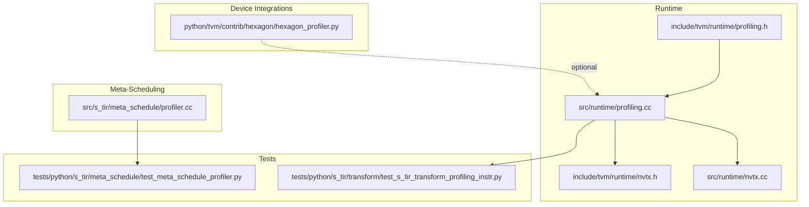
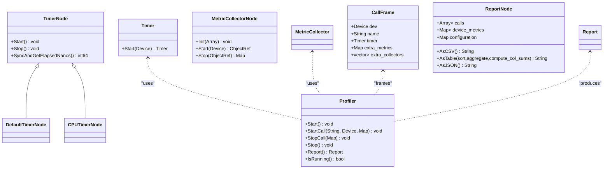
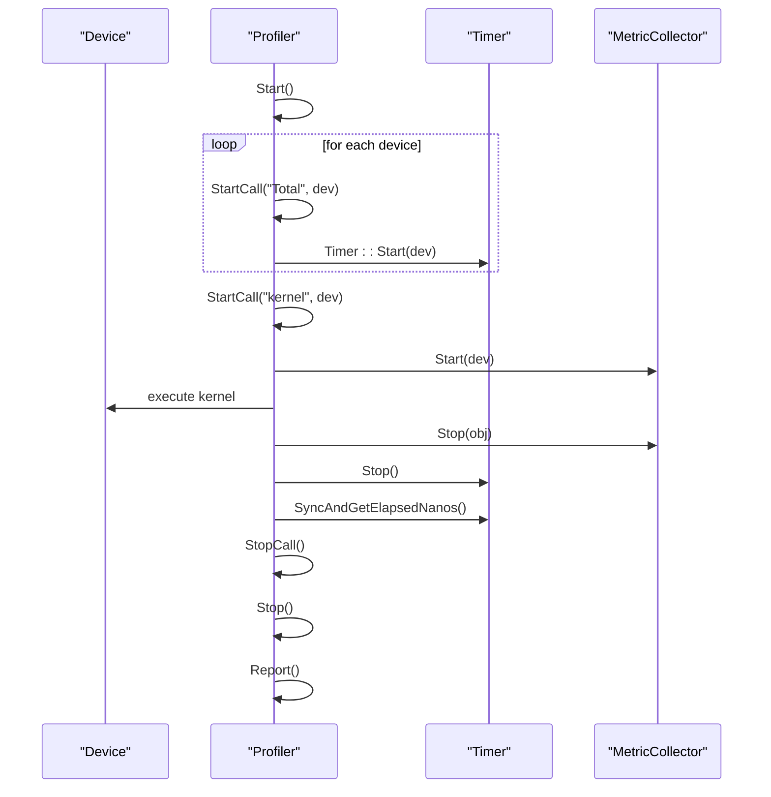
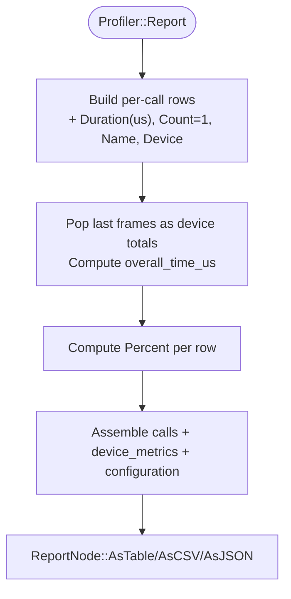
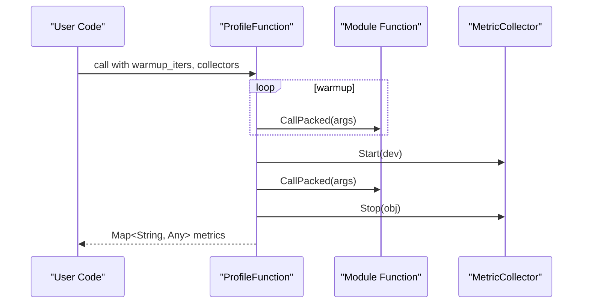
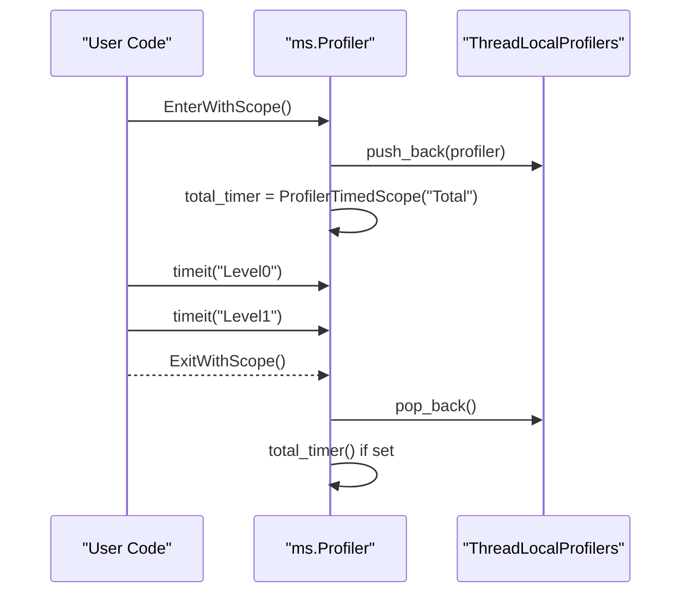
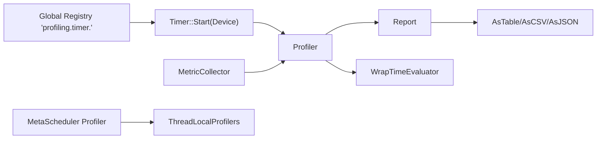

# Profiling and Benchmarking

<cite>
**Referenced Files in This Document**
- [profiling.h](file://include/tvm/runtime/profiling.h)
- [profiling.cc](file://src/runtime/profiling.cc)
- [profiler.cc](file://src/s_tir/meta_schedule/profiler.cc)
- [nvtx.h](file://include/tvm/runtime/nvtx.h)
- [nvtx.cc](file://src/runtime/nvtx.cc)
- [hexagon_profiler.py](file://python/tvm/contrib/hexagon/hexagon_profiler.py)
- [test_meta_schedule_profiler.py](file://tests/python/s_tir/meta_schedule/test_meta_schedule_profiler.py)
- [test_s_tir_transform_profiling_instr.py](file://tests/python/s_tir/transform/test_s_tir_transform_profiling_instr.py)
</cite>

## Table of Contents
1. [Introduction](#introduction)
2. [Project Structure](#project-structure)
3. [Core Components](#core-components)
4. [Architecture Overview](#architecture-overview)
5. [Detailed Component Analysis](#detailed-component-analysis)
6. [Dependency Analysis](#dependency-analysis)
7. [Performance Considerations](#performance-considerations)
8. [Troubleshooting Guide](#troubleshooting-guide)
9. [Conclusion](#conclusion)
10. [Appendices](#appendices)

## Introduction
This document explains TVM’s profiling and benchmarking systems with a focus on:
- Runtime profiling infrastructure: the Profiler class, metric collectors, and timing mechanisms
- Meta-scheduling profiler for automated kernel optimization analysis
- Function-level profiling with warmup iterations, device-specific metrics collection, and performance report generation
- Practical examples for setting up profiling sessions, interpreting results, and identifying bottlenecks
- Profiling API usage patterns, custom metric collectors, and integration with performance analysis workflows
- Multi-device profiling, thread-safe operations, and performance counter utilization across hardware targets

## Project Structure
TVM’s profiling capabilities span several layers:
- Runtime profiling APIs and implementations live under include/tvm/runtime and src/runtime
- Meta-scheduling profiler resides under src/s_tir/meta_schedule
- Device-specific integrations (e.g., Hexagon) are available via Python contributions
- Tests demonstrate usage patterns and validate behavior

**Diagram sources**
- [profiling.h](file://include/tvm/runtime/profiling.h)
- [profiling.cc](file://src/runtime/profiling.cc)
- [profiler.cc](file://src/s_tir/meta_schedule/profiler.cc)
- [nvtx.h](file://include/tvm/runtime/nvtx.h)
- [nvtx.cc](file://src/runtime/nvtx.cc)
- [hexagon_profiler.py](file://python/tvm/contrib/hexagon/hexagon_profiler.py)
- [test_meta_schedule_profiler.py](file://tests/python/s_tir/meta_schedule/test_meta_schedule_profiler.py)
- [test_s_tir_transform_profiling_instr.py](file://tests/python/s_tir/transform/test_s_tir_transform_profiling_instr.py)

**Section sources**
- [profiling.h:1-591](file://include/tvm/runtime/profiling.h#L1-L591)
- [profiling.cc:1-938](file://src/runtime/profiling.cc#L1-L938)
- [profiler.cc:1-144](file://src/s_tir/meta_schedule/profiler.cc#L1-L144)

## Core Components
- Timer and TimerNode: Lightweight device-specific timing with synchronized stop-and-accumulate semantics
- DefaultTimer: Cross-device fallback with CPU-device synchronization
- Profiler: Function/operator-level profiler with call stack, device metrics, and report generation
- MetricCollector: Pluggable interface for custom metrics (e.g., performance counters)
- Report: Structured profiling results with CSV/JSON/table rendering
- Meta-scheduling Profiler: Lightweight hierarchical timing profiler for search-time analysis
- TimeEvaluator: Repeated measurement with adaptive repetition and warmups
- NVTX integration: Optional GPU-side markers for timeline correlation

**Section sources**
- [profiling.h:46-148](file://include/tvm/runtime/profiling.h#L46-L148)
- [profiling.h:159-427](file://include/tvm/runtime/profiling.h#L159-L427)
- [profiling.h:429-585](file://include/tvm/runtime/profiling.h#L429-L585)
- [profiling.cc:47-120](file://src/runtime/profiling.cc#L47-L120)
- [profiling.cc:122-183](file://src/runtime/profiling.cc#L122-L183)
- [profiling.cc:663-703](file://src/runtime/profiling.cc#L663-L703)
- [profiler.cc:30-139](file://src/s_tir/meta_schedule/profiler.cc#L30-L139)

## Architecture Overview
The runtime profiler orchestrates device-specific timers, optional metric collectors, and produces structured reports. The meta-scheduling profiler complements compile-time analysis with hierarchical timing.

**Diagram sources**
- [profiling.h:52-148](file://include/tvm/runtime/profiling.h#L52-L148)
- [profiling.h:297-328](file://include/tvm/runtime/profiling.h#L297-L328)
- [profiling.h:330-427](file://include/tvm/runtime/profiling.h#L330-L427)
- [profiling.h:181-277](file://include/tvm/runtime/profiling.h#L181-L277)

## Detailed Component Analysis

### Runtime Profiler and Timing
- Device-specific timers are resolved via a global registry keyed by device type. If unavailable, a default timer is used with a warning.
- Timers encapsulate start/stop semantics and defer synchronization to a single point to minimize measurement overhead.
- Profiler maintains a stack of call frames, collects extra metrics from registered collectors, and computes percentages against total device time.

**Diagram sources**
- [profiling.cc:94-115](file://src/runtime/profiling.cc#L94-L115)
- [profiling.cc:142-183](file://src/runtime/profiling.cc#L142-L183)
- [profiling.cc:663-703](file://src/runtime/profiling.cc#L663-L703)

**Section sources**
- [profiling.cc:47-120](file://src/runtime/profiling.cc#L47-L120)
- [profiling.cc:122-183](file://src/runtime/profiling.cc#L122-L183)
- [profiling.cc:663-703](file://src/runtime/profiling.cc#L663-L703)

### Metric Collectors and Reports
- MetricCollector defines Init/Start/Stop to gather device-specific metrics (e.g., performance counters).
- Report supports CSV, table, and JSON output; percentages are computed relative to total device time.
- Aggregation logic combines metrics across repeated calls and supports counts, durations, percentages, ratios, and strings.

**Diagram sources**
- [profiling.cc:663-703](file://src/runtime/profiling.cc#L663-L703)
- [profiling.cc:251-301](file://src/runtime/profiling.cc#L251-L301)
- [profiling.cc:326-387](file://src/runtime/profiling.cc#L326-L387)

**Section sources**
- [profiling.h:297-328](file://include/tvm/runtime/profiling.h#L297-L328)
- [profiling.h:181-277](file://include/tvm/runtime/profiling.h#L181-L277)
- [profiling.cc:389-433](file://src/runtime/profiling.cc#L389-L433)
- [profiling.cc:476-657](file://src/runtime/profiling.cc#L476-L657)

### Function-Level Profiling and Warmups
- ProfileFunction wraps a module function with warmup iterations and returns a packed function that gathers metrics from collectors.
- WrapTimeEvaluator provides robust repeated benchmarking with dynamic repetition adjustment, cooldowns, and optional cache flushing.

**Diagram sources**
- [profiling.cc:785-832](file://src/runtime/profiling.cc#L785-L832)

**Section sources**
- [profiling.h:529-533](file://include/tvm/runtime/profiling.h#L529-L533)
- [profiling.cc:785-832](file://src/runtime/profiling.cc#L785-L832)
- [profiling.h:581-584](file://include/tvm/runtime/profiling.h#L581-L584)
- [profiling.cc:851-914](file://src/runtime/profiling.cc#L851-L914)

### Meta-Scheduling Profiler
- Provides lightweight hierarchical timing for meta-schedule search loops.
- Supports context manager and scoped timers; exposes current profiler and prints a tabular summary.

**Diagram sources**
- [profiler.cc:105-116](file://src/s_tir/meta_schedule/profiler.cc#L105-L116)
- [profiler.cc:82-96](file://src/s_tir/meta_schedule/profiler.cc#L82-L96)

**Section sources**
- [profiler.cc:30-139](file://src/s_tir/meta_schedule/profiler.cc#L30-L139)
- [test_meta_schedule_profiler.py:24-47](file://tests/python/s_tir/meta_schedule/test_meta_schedule_profiler.py#L24-L47)

### NVTX Integration
- Optional GPU-side markers can be integrated to correlate runtime events with profiling timelines.

**Section sources**
- [nvtx.h:1-200](file://include/tvm/runtime/nvtx.h)
- [nvtx.cc:1-200](file://src/runtime/nvtx.cc)

### Device-Specific Profiling (Hexagon)
- Hexagon Python utilities provide profiling helpers for Hexagon targets.

**Section sources**
- [hexagon_profiler.py:1-200](file://python/tvm/contrib/hexagon/hexagon_profiler.py)

## Dependency Analysis
- Profiler depends on Timer resolution via a global registry and optionally on MetricCollector implementations.
- Report depends on typed nodes (DurationNode, PercentNode, CountNode, RatioNode) for consistent serialization and formatting.
- Meta-scheduling profiler is independent and uses thread-local storage for context management.

**Diagram sources**
- [profiling.cc:94-120](file://src/runtime/profiling.cc#L94-L120)
- [profiling.cc:122-183](file://src/runtime/profiling.cc#L122-L183)
- [profiling.cc:663-703](file://src/runtime/profiling.cc#L663-L703)
- [profiler.cc:100-125](file://src/s_tir/meta_schedule/profiler.cc#L100-L125)

**Section sources**
- [profiling.cc:772-783](file://src/runtime/profiling.cc#L772-L783)
- [profiler.cc:129-139](file://src/s_tir/meta_schedule/profiler.cc#L129-L139)

## Performance Considerations
- Prefer device-specific timers when available to avoid CPU-device synchronization overhead.
- Use warmup iterations to stabilize caches and JIT compilation artifacts.
- Minimize collector overhead; heavy initialization should occur in Init, not Start/Stop.
- Use aggregation and reporting features to reduce per-call overhead and improve interpretability.
- For GPU workloads, consider NVTX markers to correlate timeline events with measured durations.

[No sources needed since this section provides general guidance]

## Troubleshooting Guide
- Missing device timer: A warning is logged when a device-specific timer is not registered; a default timer is used with potential overhead.
- Empty or incomplete reports: Ensure Start/Stop pairs are balanced and that the “Total” device frames are present before generating reports.
- RPC modules: Profiling over RPC is not supported due to collector serialization constraints.
- Meta-scheduling profiler: Requires entering a with-scope to record totals; accessing results outside a scope yields empty stats.

**Section sources**
- [profiling.cc:94-115](file://src/runtime/profiling.cc#L94-L115)
- [profiling.cc:834-849](file://src/runtime/profiling.cc#L834-L849)
- [profiler.cc:40-46](file://src/s_tir/meta_schedule/profiler.cc#L40-L46)
- [profiler.cc:105-116](file://src/s_tir/meta_schedule/profiler.cc#L105-L116)

## Conclusion
TVM’s profiling and benchmarking systems combine flexible device-specific timing, pluggable metric collectors, and structured reporting to enable accurate performance analysis across heterogeneous hardware. The runtime profiler supports function-level analysis with warmups and device totals, while the meta-scheduling profiler offers lightweight hierarchical timing for search-time workflows. Together, they provide a robust foundation for identifying bottlenecks, validating optimizations, and integrating performance insights into development pipelines.

[No sources needed since this section summarizes without analyzing specific files]

## Appendices

### Practical Examples and Workflows
- Setting up a runtime profiling session:
  - Initialize Profiler with target devices and optional collectors
  - Perform warmup iterations
  - Start profiling, wrap function calls with StartCall/StopCall, and generate a Report
- Interpreting results:
  - Use AsTable to sort by duration and compute percentages
  - Use AsCSV or AsJSON for downstream analysis
- Identifying bottlenecks:
  - Focus on high-percent rows and device totals
  - Use ShapeString helpers to annotate input sizes
- Meta-scheduling profiling:
  - Use context managers and scoped timers to analyze search-time behavior

**Section sources**
- [profiling.h:365-427](file://include/tvm/runtime/profiling.h#L365-L427)
- [profiling.cc:476-657](file://src/runtime/profiling.cc#L476-L657)
- [profiler.cc:82-96](file://src/s_tir/meta_schedule/profiler.cc#L82-L96)

### API Usage Patterns
- Register device-specific timers via the global registry
- Implement MetricCollector to capture performance counters or custom metrics
- Use WrapTimeEvaluator for robust repeated benchmarks with adaptive repetition
- Serialize/deserialize reports via AsJSON and Report::FromJSON

**Section sources**
- [profiling.h:114-148](file://include/tvm/runtime/profiling.h#L114-L148)
- [profiling.h:297-328](file://include/tvm/runtime/profiling.h#L297-L328)
- [profiling.h:581-584](file://include/tvm/runtime/profiling.h#L581-L584)
- [profiling.cc:772-783](file://src/runtime/profiling.cc#L772-L783)
- [profiling.cc:746-770](file://src/runtime/profiling.cc#L746-L770)

### Validation and Testing
- Meta-scheduling profiler tests validate context manager behavior and timing ranges
- S-TIR transform profiling instrumentation tests ensure correct call-site recording

**Section sources**
- [test_meta_schedule_profiler.py:24-47](file://tests/python/s_tir/meta_schedule/test_meta_schedule_profiler.py#L24-L47)
- [test_s_tir_transform_profiling_instr.py:1-200](file://tests/python/s_tir/transform/test_s_tir_transform_profiling_instr.py)