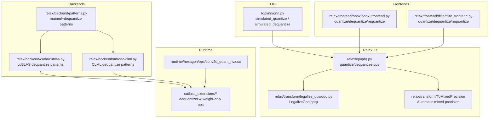
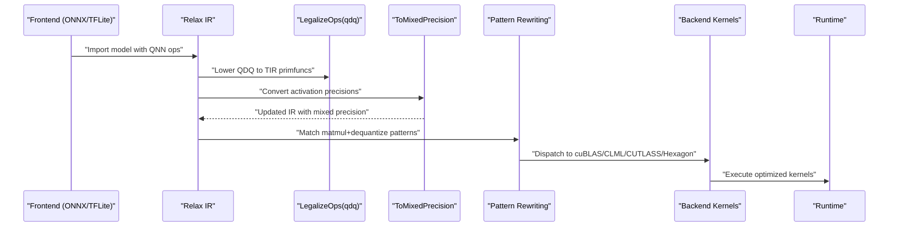
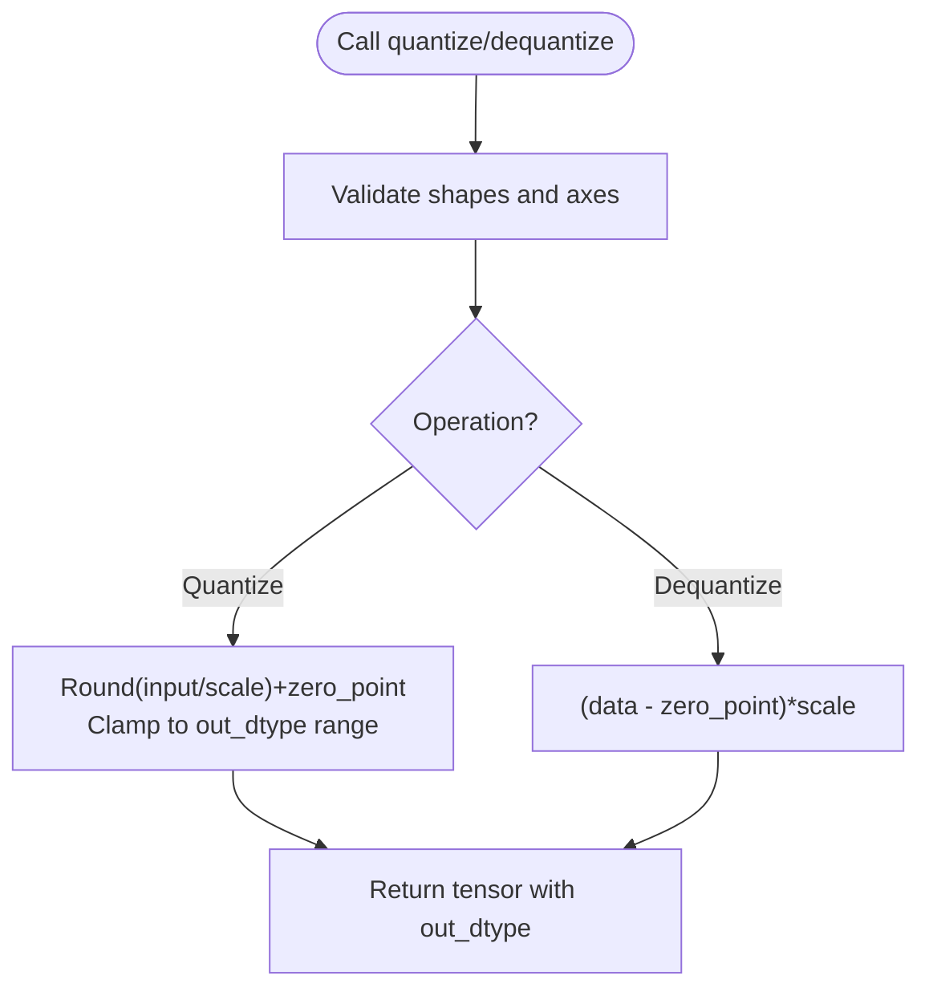
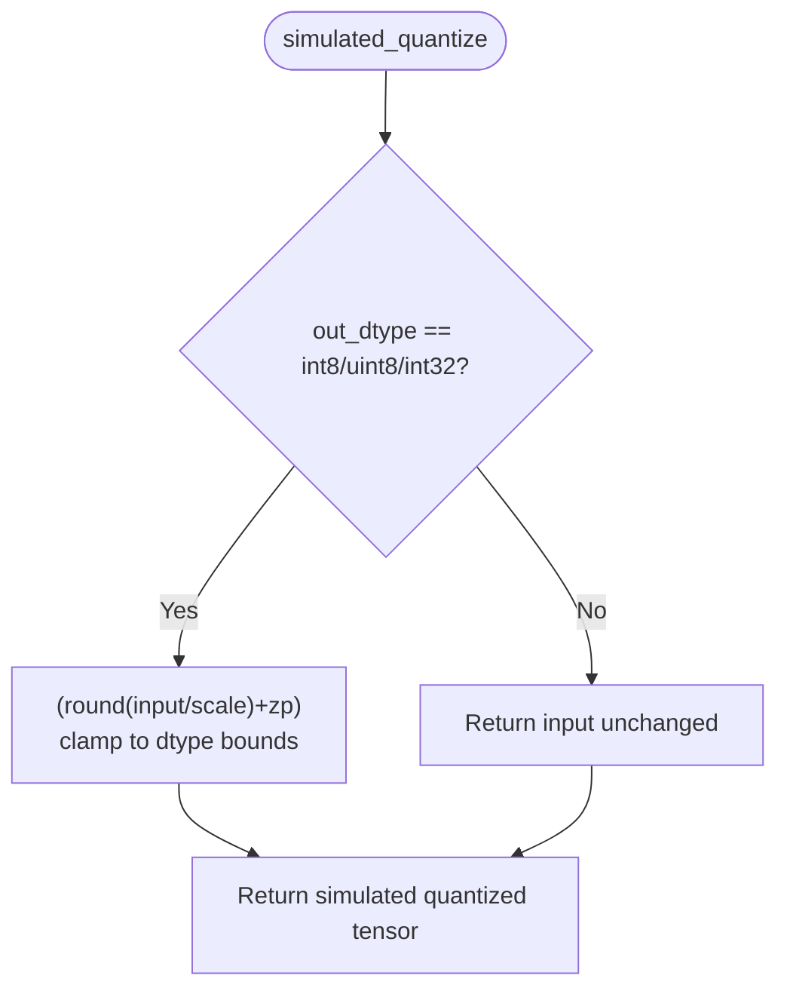
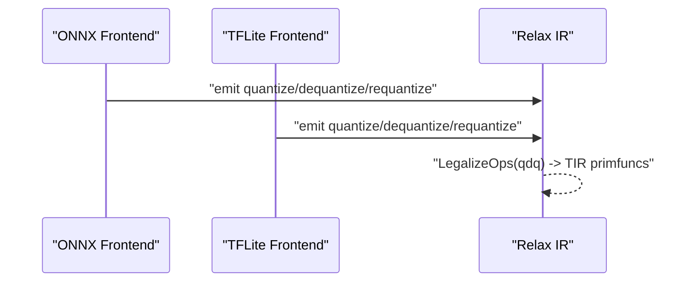
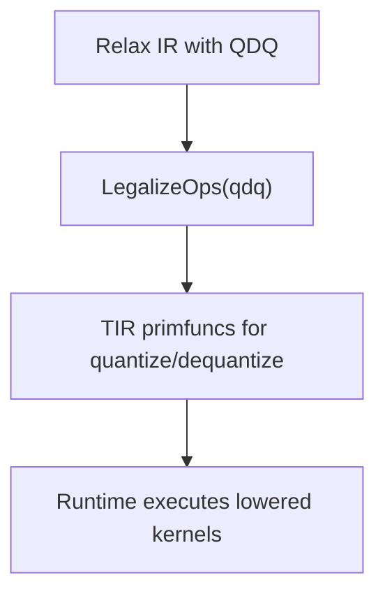
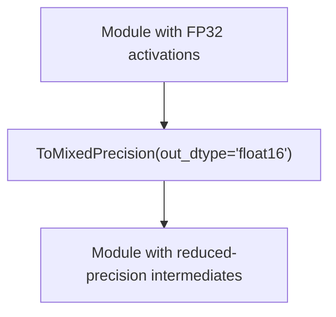
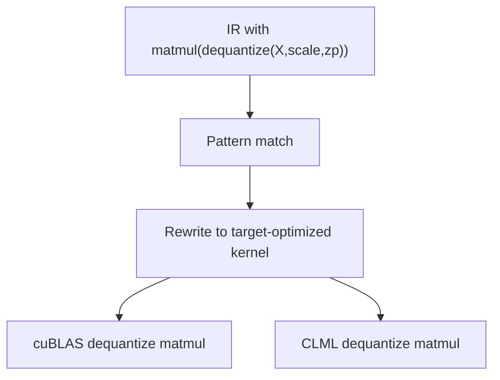
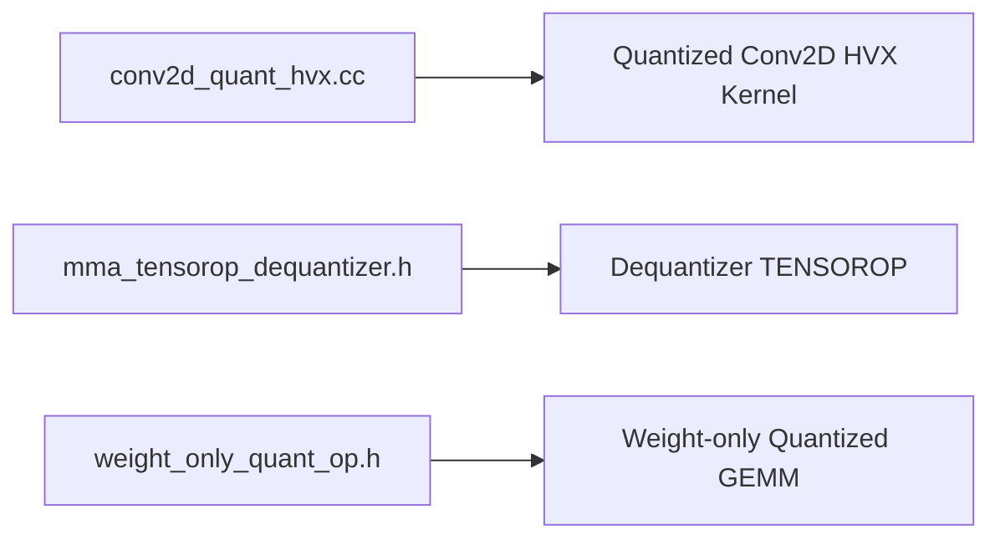
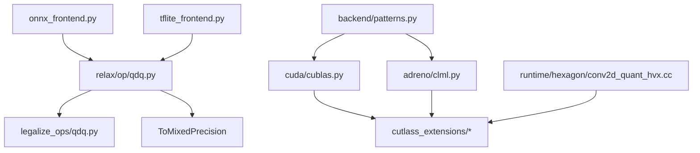

# Quantization and Mixed Precision

<cite>
**Referenced Files in This Document**
- [python/tvm/relax/op/qdq.py](file://python/tvm/relax/op/qdq.py)
- [python/tvm/topi/nn/qnn.py](file://python/tvm/topi/nn/qnn.py)
- [python/tvm/relax/frontend/onnx/onnx_frontend.py](file://python/tvm/relax/frontend/onnx/onnx_frontend.py)
- [python/tvm/relax/frontend/tflite/tflite_frontend.py](file://python/tvm/relax/frontend/tflite/tflite_frontend.py)
- [python/tvm/relax/backend/patterns.py](file://python/tvm/relax/backend/patterns.py)
- [python/tvm/relax/backend/cuda/cublas.py](file://python/tvm/relax/backend/cuda/cublas.py)
- [python/tvm/relax/backend/adreno/clml.py](file://python/tvm/relax/backend/adreno/clml.py)
- [src/runtime/hexagon/ops/conv2d_quant_hvx.cc](file://src/runtime/hexagon/ops/conv2d_quant_hvx.cc)
- [tests/python/relax/test_transform_legalize_ops_qdq.py](file://tests/python/relax/test_transform_legalize_ops_qdq.py)
- [tests/python/relax/test_transform_to_mixed_precision.py](file://tests/python/relax/test_transform_to_mixed_precision.py)
- [tests/python/relax/test_op_qdq.py](file://tests/python/relax/test_op_qdq.py)
- [tests/python/relax/backend/adreno/mod_utils.py](file://tests/python/relax/backend/adreno/mod_utils.py)
- [3rdparty/cutlass_fpA_intB_gemm/cutlass_extensions/include/cutlass_extensions/gemm/warp/mma_tensorop_dequantizer.h](file://3rdparty/cutlass_fpA_intB_gemm/cutlass_extensions/include/cutlass_extensions/gemm/warp/mma_tensorop_dequantizer.h)
- [3rdparty/cutlass_fpA_intB_gemm/cutlass_extensions/include/cutlass_extensions/weight_only_quant_op.h](file://3rdparty/cutlass_fpA_intB_gemm/cutlass_extensions/include/cutlass_extensions/weight_only_quant_op.h)
</cite>

## Table of Contents
1. [Introduction](#introduction)
2. [Project Structure](#project-structure)
3. [Core Components](#core-components)
4. [Architecture Overview](#architecture-overview)
5. [Detailed Component Analysis](#detailed-component-analysis)
6. [Dependency Analysis](#dependency-analysis)
7. [Performance Considerations](#performance-considerations)
8. [Troubleshooting Guide](#troubleshooting-guide)
9. [Conclusion](#conclusion)
10. [Appendices](#appendices)

## Introduction
This document explains quantization and mixed precision optimization in TVM with a focus on:
- Post-training quantization, quantization-aware training, and dynamic quantization strategies
- Mixed precision execution and automatic mixed precision conversion
- Quantization-aware operators, calibration and accuracy preservation
- Practical examples for implementing quantized models, configuring mixed precision schedules, and evaluating quantization impact
- Pipeline integration, custom quantization schemes, and deployment across hardware targets

It synthesizes the Relax operator stack, frontend importers, backend patterns, and runtime specializations present in the repository to guide both newcomers and advanced users.

## Project Structure
Relevant areas for quantization and mixed precision in TVM include:
- Relax quantize/dequantize operators and inference/type checking
- TOP-K quantized neural network helpers for simulated quantization
- Frontends for ONNX and TFLite that expose QNN-style ops and requantization
- Backend patterns for dequantized matmul and target-specific kernels
- Runtime specializations for Hexagon and CUTLASS-based dequantization

**Diagram sources**
- [python/tvm/relax/op/qdq.py:1-89](file://python/tvm/relax/op/qdq.py#L1-L89)
- [python/tvm/topi/nn/qnn.py:1-194](file://python/tvm/topi/nn/qnn.py#L1-L194)
- [python/tvm/relax/frontend/onnx/onnx_frontend.py:324-349](file://python/tvm/relax/frontend/onnx/onnx_frontend.py#L324-L349)
- [python/tvm/relax/frontend/tflite/tflite_frontend.py:547-569](file://python/tvm/relax/frontend/tflite/tflite_frontend.py#L547-L569)
- [python/tvm/relax/backend/patterns.py:364-399](file://python/tvm/relax/backend/patterns.py#L364-L399)
- [python/tvm/relax/backend/cuda/cublas.py:30-210](file://python/tvm/relax/backend/cuda/cublas.py#L30-L210)
- [python/tvm/relax/backend/adreno/clml.py:617-679](file://python/tvm/relax/backend/adreno/clml.py#L617-L679)
- [src/runtime/hexagon/ops/conv2d_quant_hvx.cc](file://src/runtime/hexagon/ops/conv2d_quant_hvx.cc)
- [3rdparty/cutlass_fpA_intB_gemm/cutlass_extensions/include/cutlass_extensions/gemm/warp/mma_tensorop_dequantizer.h](file://3rdparty/cutlass_fpA_intB_gemm/cutlass_extensions/include/cutlass_extensions/gemm/warp/mma_tensorop_dequantizer.h)
- [3rdparty/cutlass_fpA_intB_gemm/cutlass_extensions/include/cutlass_extensions/weight_only_quant_op.h](file://3rdparty/cutlass_fpA_intB_gemm/cutlass_extensions/include/cutlass_extensions/weight_only_quant_op.h)

**Section sources**
- [python/tvm/relax/op/qdq.py:1-89](file://python/tvm/relax/op/qdq.py#L1-L89)
- [python/tvm/topi/nn/qnn.py:1-194](file://python/tvm/topi/nn/qnn.py#L1-L194)
- [python/tvm/relax/frontend/onnx/onnx_frontend.py:324-349](file://python/tvm/relax/frontend/onnx/onnx_frontend.py#L324-L349)
- [python/tvm/relax/frontend/tflite/tflite_frontend.py:547-569](file://python/tvm/relax/frontend/tflite/tflite_frontend.py#L547-L569)
- [python/tvm/relax/backend/patterns.py:364-399](file://python/tvm/relax/backend/patterns.py#L364-L399)
- [python/tvm/relax/backend/cuda/cublas.py:30-210](file://python/tvm/relax/backend/cuda/cublas.py#L30-L210)
- [python/tvm/relax/backend/adreno/clml.py:617-679](file://python/tvm/relax/backend/adreno/clml.py#L617-L679)
- [src/runtime/hexagon/ops/conv2d_quant_hvx.cc](file://src/runtime/hexagon/ops/conv2d_quant_hvx.cc)
- [3rdparty/cutlass_fpA_intB_gemm/cutlass_extensions/include/cutlass_extensions/gemm/warp/mma_tensorop_dequantizer.h](file://3rdparty/cutlass_fpA_intB_gemm/cutlass_extensions/include/cutlass_extensions/gemm/warp/mma_tensorop_dequantizer.h)
- [3rdparty/cutlass_fpA_intB_gemm/cutlass_extensions/include/cutlass_extensions/weight_only_quant_op.h](file://3rdparty/cutlass_fpA_intB_gemm/cutlass_extensions/include/cutlass_extensions/weight_only_quant_op.h)

## Core Components
- Quantize/Dequantize operators in Relax: expose quantization primitives with scale, zero_point, axis, and out_dtype semantics.
- Simulated quantization in TOP-I: enable dynamic dtype selection and per-channel parameters without changing runtime dtypes.
- Frontend importers: translate ONNX/TFLite QNN ops into Relax quantize/dequantize/requantize calls.
- Backend patterns: recognize matmul + dequantize sequences and map to optimized kernels (cuBLAS, CLML).
- Runtime specializations: Hexagon HVX conv2d quantization and CUTLASS dequantizer/weight-only GEMM.

**Section sources**
- [python/tvm/relax/op/qdq.py:23-88](file://python/tvm/relax/op/qdq.py#L23-L88)
- [python/tvm/topi/nn/qnn.py:37-124](file://python/tvm/topi/nn/qnn.py#L37-L124)
- [python/tvm/relax/frontend/onnx/onnx_frontend.py:324-349](file://python/tvm/relax/frontend/onnx/onnx_frontend.py#L324-L349)
- [python/tvm/relax/frontend/tflite/tflite_frontend.py:547-569](file://python/tvm/relax/frontend/tflite/tflite_frontend.py#L547-L569)
- [python/tvm/relax/backend/patterns.py:364-399](file://python/tvm/relax/backend/patterns.py#L364-L399)
- [python/tvm/relax/backend/cuda/cublas.py:30-210](file://python/tvm/relax/backend/cuda/cublas.py#L30-L210)
- [python/tvm/relax/backend/adreno/clml.py:617-679](file://python/tvm/relax/backend/adreno/clml.py#L617-L679)
- [src/runtime/hexagon/ops/conv2d_quant_hvx.cc](file://src/runtime/hexagon/ops/conv2d_quant_hvx.cc)
- [3rdparty/cutlass_fpA_intB_gemm/cutlass_extensions/include/cutlass_extensions/gemm/warp/mma_tensorop_dequantizer.h](file://3rdparty/cutlass_fpA_intB_gemm/cutlass_extensions/include/cutlass_extensions/gemm/warp/mma_tensorop_dequantizer.h)
- [3rdparty/cutlass_fpA_intB_gemm/cutlass_extensions/include/cutlass_extensions/weight_only_quant_op.h](file://3rdparty/cutlass_fpA_intB_gemm/cutlass_extensions/include/cutlass_extensions/weight_only_quant_op.h)

## Architecture Overview
End-to-end quantization and mixed precision pipeline:
- Import model via ONNX/TFLite frontends, emitting Relax IR with quantize/dequantize/requantize nodes.
- LegalizeOps transforms QDQ ops into TIR primfuncs for concrete execution.
- ToMixedPrecision lowers intermediate activations to reduced precision (e.g., float16) where safe.
- Pattern-based rewritings map matmul + dequantize to target-optimized kernels.
- Runtime backends execute specialized kernels (Hexagon HVX, CUTLASS) for performance.

**Diagram sources**
- [python/tvm/relax/frontend/onnx/onnx_frontend.py:324-349](file://python/tvm/relax/frontend/onnx/onnx_frontend.py#L324-L349)
- [python/tvm/relax/frontend/tflite/tflite_frontend.py:547-569](file://python/tvm/relax/frontend/tflite/tflite_frontend.py#L547-L569)
- [tests/python/relax/test_transform_legalize_ops_qdq.py:375-414](file://tests/python/relax/test_transform_legalize_ops_qdq.py#L375-L414)
- [tests/python/relax/test_transform_to_mixed_precision.py:29-36](file://tests/python/relax/test_transform_to_mixed_precision.py#L29-L36)
- [python/tvm/relax/backend/patterns.py:364-399](file://python/tvm/relax/backend/patterns.py#L364-L399)
- [python/tvm/relax/backend/cuda/cublas.py:30-210](file://python/tvm/relax/backend/cuda/cublas.py#L30-L210)
- [python/tvm/relax/backend/adreno/clml.py:617-679](file://python/tvm/relax/backend/adreno/clml.py#L617-L679)
- [src/runtime/hexagon/ops/conv2d_quant_hvx.cc](file://src/runtime/hexagon/ops/conv2d_quant_hvx.cc)

## Detailed Component Analysis

### Quantize/Dequantize Operators (Relax)
- Purpose: Provide explicit quantization and dequantization with per-tensor or per-channel parameters.
- Key parameters: scale, zero_point, axis, out_dtype.
- Behavior: quantize applies rounding, clipping to output dtype bounds; dequantize reconstructs floating-point values.

**Diagram sources**
- [python/tvm/relax/op/qdq.py:23-88](file://python/tvm/relax/op/qdq.py#L23-L88)

**Section sources**
- [python/tvm/relax/op/qdq.py:23-88](file://python/tvm/relax/op/qdq.py#L23-L88)
- [tests/python/relax/test_op_qdq.py:24-35](file://tests/python/relax/test_op_qdq.py#L24-L35)

### Simulated Quantization (TOP-I)
- Purpose: Enable dynamic dtype selection and per-channel parameters at runtime without changing compiled dtypes.
- Mechanism: Dispatch to simulated quantize/dequantize based on a variable dtype selector.

**Diagram sources**
- [python/tvm/topi/nn/qnn.py:37-124](file://python/tvm/topi/nn/qnn.py#L37-L124)

**Section sources**
- [python/tvm/topi/nn/qnn.py:37-124](file://python/tvm/topi/nn/qnn.py#L37-L124)

### Frontend Importers: ONNX and TFLite
- ONNX importer exposes quantize/dequantize/requantize ops with axis and dtype handling.
- TFLite importer supports quantize/dequantize and computes requantize scales from inputs and weights.

**Diagram sources**
- [python/tvm/relax/frontend/onnx/onnx_frontend.py:324-349](file://python/tvm/relax/frontend/onnx/onnx_frontend.py#L324-L349)
- [python/tvm/relax/frontend/tflite/tflite_frontend.py:547-569](file://python/tvm/relax/frontend/tflite/tflite_frontend.py#L547-L569)

**Section sources**
- [python/tvm/relax/frontend/onnx/onnx_frontend.py:324-349](file://python/tvm/relax/frontend/onnx/onnx_frontend.py#L324-L349)
- [python/tvm/relax/frontend/tflite/tflite_frontend.py:547-569](file://python/tvm/relax/frontend/tflite/tflite_frontend.py#L547-L569)

### LegalizeOps and QDQ Lowering
- LegalizeOps transforms Relax quantize/dequantize calls into TIR primfuncs for execution.
- Tests demonstrate lowering correctness for various dtypes and shapes.

**Diagram sources**
- [tests/python/relax/test_transform_legalize_ops_qdq.py:375-414](file://tests/python/relax/test_transform_legalize_ops_qdq.py#L375-L414)
- [tests/python/relax/test_transform_legalize_ops_qdq.py:417-465](file://tests/python/relax/test_transform_legalize_ops_qdq.py#L417-L465)
- [tests/python/relax/test_transform_legalize_ops_qdq.py:468-509](file://tests/python/relax/test_transform_legalize_ops_qdq.py#L468-L509)

**Section sources**
- [tests/python/relax/test_transform_legalize_ops_qdq.py:375-414](file://tests/python/relax/test_transform_legalize_ops_qdq.py#L375-L414)
- [tests/python/relax/test_transform_legalize_ops_qdq.py:417-465](file://tests/python/relax/test_transform_legalize_ops_qdq.py#L417-L465)
- [tests/python/relax/test_transform_legalize_ops_qdq.py:468-509](file://tests/python/relax/test_transform_legalize_ops_qdq.py#L468-L509)

### Automatic Mixed Precision Conversion
- ToMixedPrecision lowers intermediate activations to a chosen precision (e.g., float16) to improve throughput.
- Tests validate structural equality against expected lowered modules.

**Diagram sources**
- [tests/python/relax/test_transform_to_mixed_precision.py:29-36](file://tests/python/relax/test_transform_to_mixed_precision.py#L29-L36)

**Section sources**
- [tests/python/relax/test_transform_to_mixed_precision.py:29-36](file://tests/python/relax/test_transform_to_mixed_precision.py#L29-L36)

### Backend Patterns: Matmul + Dequantize
- Pattern registry defines matmul followed by dequantize as a rewrite target.
- cuBLAS and CLML backends register specialized patterns for GPU and mobile accelerators.

**Diagram sources**
- [python/tvm/relax/backend/patterns.py:364-399](file://python/tvm/relax/backend/patterns.py#L364-L399)
- [python/tvm/relax/backend/cuda/cublas.py:30-210](file://python/tvm/relax/backend/cuda/cublas.py#L30-L210)
- [python/tvm/relax/backend/adreno/clml.py:617-679](file://python/tvm/relax/backend/adreno/clml.py#L617-L679)

**Section sources**
- [python/tvm/relax/backend/patterns.py:364-399](file://python/tvm/relax/backend/patterns.py#L364-L399)
- [python/tvm/relax/backend/cuda/cublas.py:30-210](file://python/tvm/relax/backend/cuda/cublas.py#L30-L210)
- [python/tvm/relax/backend/adreno/clml.py:617-679](file://python/tvm/relax/backend/adreno/clml.py#L617-L679)

### Runtime Specializations
- Hexagon HVX convolution kernel for quantized models.
- CUTLASS extensions for dequantization and weight-only quantized GEMM.

**Diagram sources**
- [src/runtime/hexagon/ops/conv2d_quant_hvx.cc](file://src/runtime/hexagon/ops/conv2d_quant_hvx.cc)
- [3rdparty/cutlass_fpA_intB_gemm/cutlass_extensions/include/cutlass_extensions/gemm/warp/mma_tensorop_dequantizer.h](file://3rdparty/cutlass_fpA_intB_gemm/cutlass_extensions/include/cutlass_extensions/gemm/warp/mma_tensorop_dequantizer.h)
- [3rdparty/cutlass_fpA_intB_gemm/cutlass_extensions/include/cutlass_extensions/weight_only_quant_op.h](file://3rdparty/cutlass_fpA_intB_gemm/cutlass_extensions/include/cutlass_extensions/weight_only_quant_op.h)

**Section sources**
- [src/runtime/hexagon/ops/conv2d_quant_hvx.cc](file://src/runtime/hexagon/ops/conv2d_quant_hvx.cc)
- [3rdparty/cutlass_fpA_intB_gemm/cutlass_extensions/include/cutlass_extensions/gemm/warp/mma_tensorop_dequantizer.h](file://3rdparty/cutlass_fpA_intB_gemm/cutlass_extensions/include/cutlass_extensions/gemm/warp/mma_tensorop_dequantizer.h)
- [3rdparty/cutlass_fpA_intB_gemm/cutlass_extensions/include/cutlass_extensions/weight_only_quant_op.h](file://3rdparty/cutlass_fpA_intB_gemm/cutlass_extensions/include/cutlass_extensions/weight_only_quant_op.h)

### Dynamic Quantization Strategies
- Per-channel scales/zeros via axis parameter.
- Simulated quantization enables runtime dtype selection and per-channel parameters without changing compiled dtypes.

**Section sources**
- [python/tvm/relax/op/qdq.py:23-88](file://python/tvm/relax/op/qdq.py#L23-L88)
- [python/tvm/topi/nn/qnn.py:37-124](file://python/tvm/topi/nn/qnn.py#L37-L124)

### Calibration and Accuracy Preservation
- Frontends compute requantize scales from input and weight scales.
- LegalizeOps tests confirm correct lowering of dequantize across dtypes and shapes.

**Section sources**
- [python/tvm/relax/frontend/tflite/tflite_frontend.py:2187-2207](file://python/tvm/relax/frontend/tflite/tflite_frontend.py#L2187-L2207)
- [tests/python/relax/test_transform_legalize_ops_qdq.py:375-414](file://tests/python/relax/test_transform_legalize_ops_qdq.py#L375-L414)

### Practical Examples
- Implementing quantized models: import via ONNX/TFLite, rely on Relax QDQ ops, and lower via LegalizeOps.
- Configuring mixed precision: apply ToMixedPrecision to reduce activation precision.
- Evaluating impact: compare latency and accuracy on target hardware after backend dispatch.

**Section sources**
- [python/tvm/relax/frontend/onnx/onnx_frontend.py:324-349](file://python/tvm/relax/frontend/onnx/onnx_frontend.py#L324-L349)
- [python/tvm/relax/frontend/tflite/tflite_frontend.py:547-569](file://python/tvm/relax/frontend/tflite/tflite_frontend.py#L547-L569)
- [tests/python/relax/test_transform_to_mixed_precision.py:29-36](file://tests/python/relax/test_transform_to_mixed_precision.py#L29-L36)
- [tests/python/relax/test_transform_legalize_ops_qdq.py:375-414](file://tests/python/relax/test_transform_legalize_ops_qdq.py#L375-L414)

### Deployment Considerations
- Target-specific kernels: cuBLAS, CLML, Hexagon HVX, and CUTLASS.
- Pattern-driven dispatch ensures optimal execution paths for matmul + dequantize.

**Section sources**
- [python/tvm/relax/backend/cuda/cublas.py:30-210](file://python/tvm/relax/backend/cuda/cublas.py#L30-L210)
- [python/tvm/relax/backend/adreno/clml.py:617-679](file://python/tvm/relax/backend/adreno/clml.py#L617-L679)
- [src/runtime/hexagon/ops/conv2d_quant_hvx.cc](file://src/runtime/hexagon/ops/conv2d_quant_hvx.cc)
- [3rdparty/cutlass_fpA_intB_gemm/cutlass_extensions/include/cutlass_extensions/weight_only_quant_op.h](file://3rdparty/cutlass_fpA_intB_gemm/cutlass_extensions/include/cutlass_extensions/weight_only_quant_op.h)

## Dependency Analysis
Key dependencies among quantization components:
- Frontends depend on Relax QDQ ops.
- LegalizeOps depends on QDQ ops to produce TIR primfuncs.
- ToMixedPrecision depends on Relax IR transformations.
- Backend patterns depend on pattern registry and target backends.
- Runtime kernels depend on CUTLASS and Hexagon libraries.

**Diagram sources**
- [python/tvm/relax/frontend/onnx/onnx_frontend.py:324-349](file://python/tvm/relax/frontend/onnx/onnx_frontend.py#L324-L349)
- [python/tvm/relax/frontend/tflite/tflite_frontend.py:547-569](file://python/tvm/relax/frontend/tflite/tflite_frontend.py#L547-L569)
- [python/tvm/relax/op/qdq.py:23-88](file://python/tvm/relax/op/qdq.py#L23-L88)
- [tests/python/relax/test_transform_legalize_ops_qdq.py:375-414](file://tests/python/relax/test_transform_legalize_ops_qdq.py#L375-L414)
- [tests/python/relax/test_transform_to_mixed_precision.py:29-36](file://tests/python/relax/test_transform_to_mixed_precision.py#L29-L36)
- [python/tvm/relax/backend/patterns.py:364-399](file://python/tvm/relax/backend/patterns.py#L364-L399)
- [python/tvm/relax/backend/cuda/cublas.py:30-210](file://python/tvm/relax/backend/cuda/cublas.py#L30-L210)
- [python/tvm/relax/backend/adreno/clml.py:617-679](file://python/tvm/relax/backend/adreno/clml.py#L617-L679)
- [src/runtime/hexagon/ops/conv2d_quant_hvx.cc](file://src/runtime/hexagon/ops/conv2d_quant_hvx.cc)
- [3rdparty/cutlass_fpA_intB_gemm/cutlass_extensions/include/cutlass_extensions/weight_only_quant_op.h](file://3rdparty/cutlass_fpA_intB_gemm/cutlass_extensions/include/cutlass_extensions/weight_only_quant_op.h)

**Section sources**
- [python/tvm/relax/frontend/onnx/onnx_frontend.py:324-349](file://python/tvm/relax/frontend/onnx/onnx_frontend.py#L324-L349)
- [python/tvm/relax/frontend/tflite/tflite_frontend.py:547-569](file://python/tvm/relax/frontend/tflite/tflite_frontend.py#L547-L569)
- [python/tvm/relax/op/qdq.py:23-88](file://python/tvm/relax/op/qdq.py#L23-L88)
- [tests/python/relax/test_transform_legalize_ops_qdq.py:375-414](file://tests/python/relax/test_transform_legalize_ops_qdq.py#L375-L414)
- [tests/python/relax/test_transform_to_mixed_precision.py:29-36](file://tests/python/relax/test_transform_to_mixed_precision.py#L29-L36)
- [python/tvm/relax/backend/patterns.py:364-399](file://python/tvm/relax/backend/patterns.py#L364-L399)
- [python/tvm/relax/backend/cuda/cublas.py:30-210](file://python/tvm/relax/backend/cuda/cublas.py#L30-L210)
- [python/tvm/relax/backend/adreno/clml.py:617-679](file://python/tvm/relax/backend/adreno/clml.py#L617-L679)
- [src/runtime/hexagon/ops/conv2d_quant_hvx.cc](file://src/runtime/hexagon/ops/conv2d_quant_hvx.cc)
- [3rdparty/cutlass_fpA_intB_gemm/cutlass_extensions/include/cutlass_extensions/weight_only_quant_op.h](file://3rdparty/cutlass_fpA_intB_gemm/cutlass_extensions/include/cutlass_extensions/weight_only_quant_op.h)

## Performance Considerations
- Mixed precision reduces memory bandwidth and improves arithmetic intensity; use ToMixedPrecision carefully to preserve accuracy.
- Pattern-based dispatch to cuBLAS/CLML/CUTLASS/Hexagon maximizes utilization of specialized hardware.
- Simulated quantization avoids costly dtype changes at runtime while enabling flexible parameterization.

[No sources needed since this section provides general guidance]

## Troubleshooting Guide
- Shape mismatches in axis parameter: ensure per-channel scales/zeros align with the specified axis.
- Legalization failures: verify QDQ ops are lowered via LegalizeOps(qdq) to TIR primfuncs.
- Backend dispatch issues: confirm pattern registration and target availability for matmul+dequantize.

**Section sources**
- [tests/python/relax/test_transform_legalize_ops_qdq.py:375-414](file://tests/python/relax/test_transform_legalize_ops_qdq.py#L375-L414)
- [tests/python/relax/test_transform_legalize_ops_qdq.py:417-465](file://tests/python/relax/test_transform_legalize_ops_qdq.py#L417-L465)
- [tests/python/relax/test_transform_legalize_ops_qdq.py:468-509](file://tests/python/relax/test_transform_legalize_ops_qdq.py#L468-L509)

## Conclusion
TVM’s quantization and mixed precision stack integrates frontends, Relax IR, legalizations, and backend patterns to deliver efficient, portable quantized models. By leveraging QDQ ops, simulated quantization, automatic mixed precision, and target-specialized kernels, developers can achieve significant performance gains with controlled accuracy trade-offs.

[No sources needed since this section summarizes without analyzing specific files]

## Appendices
- Example references for verification:
  - LegalizeOps lowering of quantize/dequantize: [tests/python/relax/test_transform_legalize_ops_qdq.py:375-414](file://tests/python/relax/test_transform_legalize_ops_qdq.py#L375-L414)
  - Mixed precision conversion: [tests/python/relax/test_transform_to_mixed_precision.py:29-36](file://tests/python/relax/test_transform_to_mixed_precision.py#L29-L36)
  - QDQ operator inference: [tests/python/relax/test_op_qdq.py:24-35](file://tests/python/relax/test_op_qdq.py#L24-L35)
  - Adreno dequantize kernels: [tests/python/relax/backend/adreno/mod_utils.py:751-834](file://tests/python/relax/backend/adreno/mod_utils.py#L751-L834)

[No sources needed since this section aggregates references without analyzing specific files]