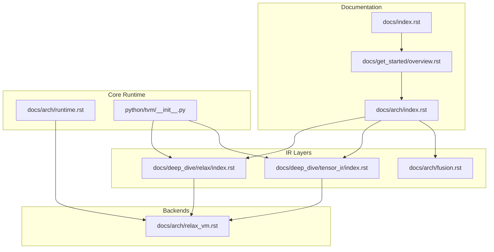
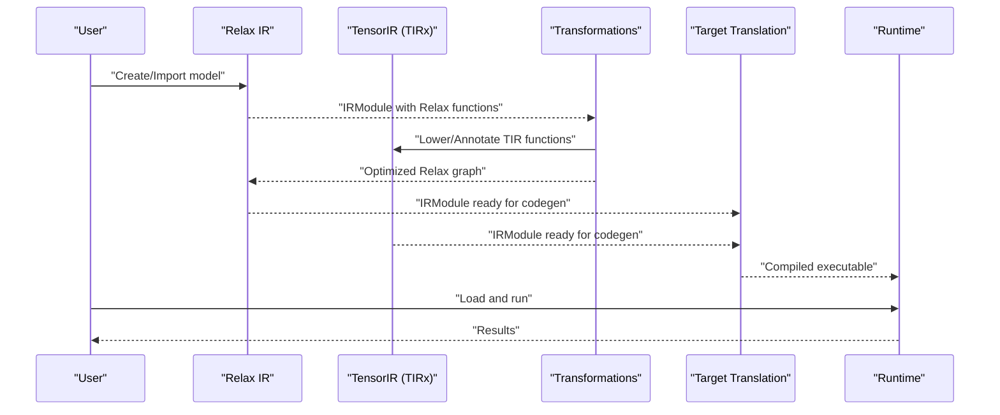
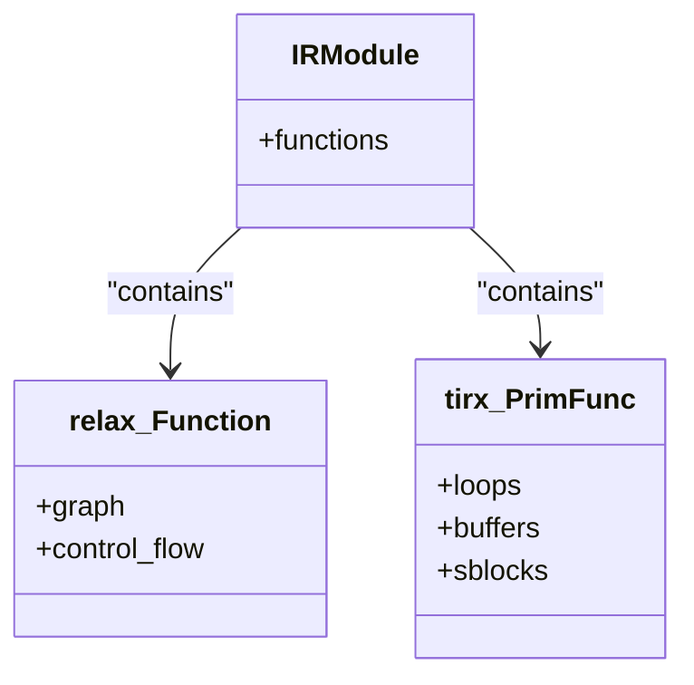
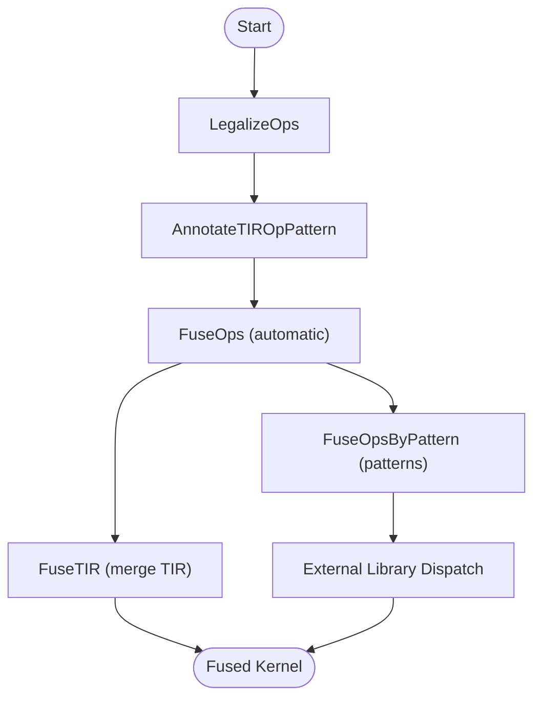
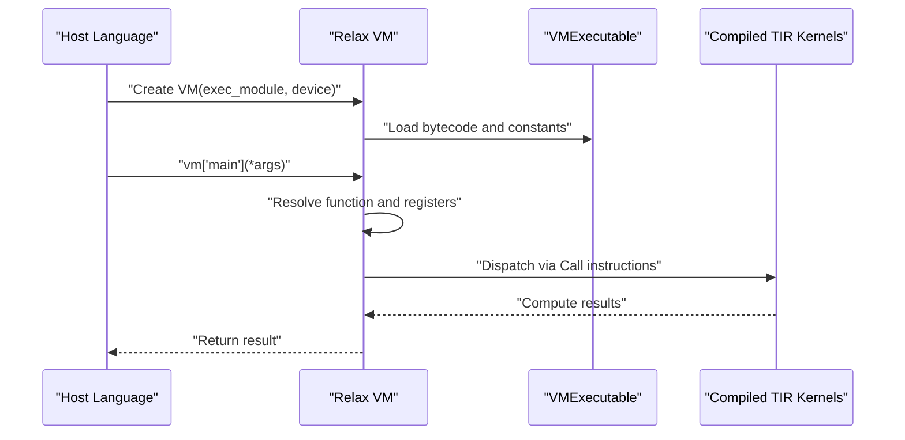
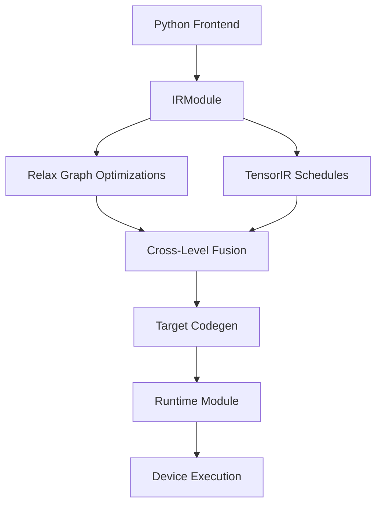
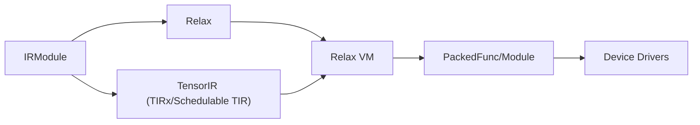

# Project Overview

<cite>
**Referenced Files in This Document**
- [README.md](file://README.md)
- [CONTRIBUTORS.md](file://CONTRIBUTORS.md)
- [docs/index.rst](file://docs/index.rst)
- [docs/get_started/overview.rst](file://docs/get_started/overview.rst)
- [docs/arch/index.rst](file://docs/arch/index.rst)
- [docs/arch/runtime.rst](file://docs/arch/runtime.rst)
- [docs/arch/relax_vm.rst](file://docs/arch/relax_vm.rst)
- [docs/arch/fusion.rst](file://docs/arch/fusion.rst)
- [docs/deep_dive/tensor_ir/index.rst](file://docs/deep_dive/tensor_ir/index.rst)
- [docs/deep_dive/relax/index.rst](file://docs/deep_dive/relax/index.rst)
- [docs/contribute/community.rst](file://docs/contribute/community.rst)
- [docs/contribute/code_guide.rst](file://docs/contribute/code_guide.rst)
- [docs/reference/publications.rst](file://docs/reference/publications.rst)
- [python/tvm/__init__.py](file://python/tvm/__init__.py)
</cite>

## Table of Contents
1. [Introduction](#introduction)
2. [Project Structure](#project-structure)
3. [Core Components](#core-components)
4. [Architecture Overview](#architecture-overview)
5. [Detailed Component Analysis](#detailed-component-analysis)
6. [Dependency Analysis](#dependency-analysis)
7. [Performance Considerations](#performance-considerations)
8. [Troubleshooting Guide](#troubleshooting-guide)
9. [Conclusion](#conclusion)
10. [Appendices](#appendices)

## Introduction
Apache TVM is an open machine learning compilation framework designed to bridge high-level neural network models with optimized, deployable code across diverse hardware platforms. Its purpose is to make machine learning deployment efficient, portable, and accessible by enabling:
- Python-first development for rapid customization of compiler pipelines.
- Universal deployment to bring models into minimal, embeddable modules that run across languages and devices.

TVM’s philosophy centers on composability and cross-level optimization. It enables transformations to be defined and executed in Python, while leveraging a layered IR stack to jointly optimize graph-level Relax programs and tensor-level TIR programs. This dual focus allows TVM to deliver high performance on CPUs, GPUs, accelerators, and edge/embedded devices, while maintaining a lightweight runtime suitable for constrained environments.

**Section sources**
- [README.md:25-33](file://README.md#L25-L33)
- [docs/get_started/overview.rst:21-40](file://docs/get_started/overview.rst#L21-L40)

## Project Structure
At a high level, TVM is organized into:
- Documentation and guides for getting started, deep dives, and architecture.
- Core runtime and FFI for cross-language interoperability.
- IR layers (Relax and TensorIR) with transformation and lowering infrastructure.
- Backend and code generation modules for multiple targets.
- Utilities for arithmetic analysis, scheduling, and top-level APIs.

**Diagram sources**
- [docs/index.rst:18-84](file://docs/index.rst#L18-L84)
- [docs/get_started/overview.rst:18-67](file://docs/get_started/overview.rst#L18-L67)
- [docs/arch/index.rst:18-438](file://docs/arch/index.rst#L18-L438)
- [docs/arch/runtime.rst:18-282](file://docs/arch/runtime.rst#L18-L282)
- [docs/arch/relax_vm.rst:18-440](file://docs/arch/relax_vm.rst#L18-L440)
- [docs/arch/fusion.rst:18-389](file://docs/arch/fusion.rst#L18-L389)
- [docs/deep_dive/relax/index.rst:18-36](file://docs/deep_dive/relax/index.rst#L18-L36)
- [docs/deep_dive/tensor_ir/index.rst:18-44](file://docs/deep_dive/tensor_ir/index.rst#L18-L44)
- [python/tvm/__init__.py:19-114](file://python/tvm/__init__.py#L19-L114)

**Section sources**
- [docs/index.rst:18-84](file://docs/index.rst#L18-L84)
- [python/tvm/__init__.py:19-114](file://python/tvm/__init__.py#L19-L114)

## Core Components
- IRModule: The primary data structure holding collections of functions across IR layers.
- Relax: High-level graph-level IR for representing models and transformations.
- TensorIR (TIRx/Schedulable TIR): Low-level IR for tensor programs and scheduling.
- PackedFunc and Module: Cross-language runtime primitives enabling flexible deployment and device drivers.
- Operator Fusion: Mechanisms to merge operators into fused kernels for performance.

Key design decisions:
- Python-first transformations: Most compiler passes and optimizations are customizable in Python.
- Cross-level optimization: Jointly optimize Relax graphs and TIR programs for end-to-end performance.
- Lightweight runtime: Minimal footprint for deployment on embedded and edge devices.

**Section sources**
- [docs/arch/index.rst:54-112](file://docs/arch/index.rst#L54-L112)
- [docs/arch/runtime.rst:40-156](file://docs/arch/runtime.rst#L40-L156)
- [docs/arch/fusion.rst:20-66](file://docs/arch/fusion.rst#L20-L66)
- [docs/get_started/overview.rst:21-40](file://docs/get_started/overview.rst#L21-L40)

## Architecture Overview
The end-to-end compilation and execution flow in TVM:
1. Model creation: Build or import a model as an IRModule containing Relax and TIR functions.
2. Transformations: Apply graph-level and tensor-level passes (including fusion and legalizations).
3. Target translation: Lower to target-specific executables via code generation.
4. Runtime execution: Load and run compiled modules via the TVM runtime.

**Diagram sources**
- [docs/arch/index.rst:34-46](file://docs/arch/index.rst#L34-L46)
- [docs/arch/runtime.rst:146-181](file://docs/arch/runtime.rst#L146-L181)

**Section sources**
- [docs/arch/index.rst:34-46](file://docs/arch/index.rst#L34-L46)
- [docs/arch/runtime.rst:146-181](file://docs/arch/runtime.rst#L146-L181)

## Detailed Component Analysis

### IR Layers: Relax and TensorIR
- Relax: High-level functional program representation capturing model graphs, control flow, and complex data structures. It coordinates with TIR during lowering and fusion.
- TensorIR (TIRx/Schedulable TIR): Low-level IR for tensor programs with loops, buffers, and scheduling constructs. It supports both hand-written and auto-generated kernels.

**Diagram sources**
- [docs/arch/index.rst:61-72](file://docs/arch/index.rst#L61-L72)
- [docs/deep_dive/relax/index.rst:20-26](file://docs/deep_dive/relax/index.rst#L20-L26)
- [docs/deep_dive/tensor_ir/index.rst:20-31](file://docs/deep_dive/tensor_ir/index.rst#L20-L31)

**Section sources**
- [docs/arch/index.rst:61-72](file://docs/arch/index.rst#L61-L72)
- [docs/deep_dive/relax/index.rst:20-26](file://docs/deep_dive/relax/index.rst#L20-L26)
- [docs/deep_dive/tensor_ir/index.rst:20-31](file://docs/deep_dive/tensor_ir/index.rst#L20-L31)

### Operator Fusion Pipeline
Fusion reduces kernel launch overhead and memory traffic by merging operators into fused kernels. TVM provides:
- Automatic fusion (FuseOps + FuseTIR) guided by operator pattern kinds.
- Pattern-based fusion (FuseOpsByPattern) for dispatching to external libraries (e.g., cuBLAS, CUTLASS).

**Diagram sources**
- [docs/arch/fusion.rst:40-66](file://docs/arch/fusion.rst#L40-L66)
- [docs/arch/fusion.rst:112-177](file://docs/arch/fusion.rst#L112-L177)
- [docs/arch/fusion.rst:256-328](file://docs/arch/fusion.rst#L256-L328)

**Section sources**
- [docs/arch/fusion.rst:40-66](file://docs/arch/fusion.rst#L40-L66)
- [docs/arch/fusion.rst:112-177](file://docs/arch/fusion.rst#L112-L177)
- [docs/arch/fusion.rst:256-328](file://docs/arch/fusion.rst#L256-L328)

### Runtime and Virtual Machine
- PackedFunc and Module provide a minimal, cross-language runtime interface for invoking compiled functions and linking device drivers.
- Relax Virtual Machine interprets bytecode for Relax functions or compiles them to TIR for direct execution, enabling flexible execution modes.

**Diagram sources**
- [docs/arch/runtime.rst:158-181](file://docs/arch/runtime.rst#L158-L181)
- [docs/arch/relax_vm.rst:60-101](file://docs/arch/relax_vm.rst#L60-L101)
- [docs/arch/relax_vm.rst:221-273](file://docs/arch/relax_vm.rst#L221-L273)

**Section sources**
- [docs/arch/runtime.rst:158-181](file://docs/arch/runtime.rst#L158-L181)
- [docs/arch/relax_vm.rst:60-101](file://docs/arch/relax_vm.rst#L60-L101)
- [docs/arch/relax_vm.rst:221-273](file://docs/arch/relax_vm.rst#L221-L273)

### Conceptual Overview
TVM’s architecture balances flexibility and performance:
- Python-first transformations enable rapid experimentation and customization.
- Cross-level IRs (Relax and TensorIR) allow joint optimization across graph and tensor levels.
- Lightweight runtime and modular backends support deployment across diverse hardware.

[No sources needed since this diagram shows conceptual workflow, not actual code structure]

[No sources needed since this section doesn't analyze specific files]

## Dependency Analysis
TVM’s design emphasizes decoupling of concerns:
- IR layers share common data structures (IRModule, types, passes) to enable cross-layer transformations.
- Runtime provides a stable ABI across languages and devices.
- Backends plug in via target-specific code generators and device drivers.

**Diagram sources**
- [docs/arch/index.rst:301-334](file://docs/arch/index.rst#L301-L334)
- [docs/arch/runtime.rst:158-181](file://docs/arch/runtime.rst#L158-L181)

**Section sources**
- [docs/arch/index.rst:301-334](file://docs/arch/index.rst#L301-L334)
- [docs/arch/runtime.rst:158-181](file://docs/arch/runtime.rst#L158-L181)

## Performance Considerations
- Operator fusion minimizes intermediate allocations and kernel launches.
- Scheduling and meta-scheduling in TensorIR tailor code generation to target architectures.
- Cross-level optimizations coordinate graph and tensor optimizations for end-to-end gains.
- Lightweight runtime reduces overhead for deployment on constrained devices.

[No sources needed since this section provides general guidance]

## Troubleshooting Guide
Common areas to investigate:
- Transformation configuration via PassContext and pass pipelines.
- Device and target setup using the Target API.
- Runtime diagnostics and profiling through the VM and built-in instrumentation.

**Section sources**
- [docs/arch/index.rst:317-325](file://docs/arch/index.rst#L317-L325)
- [docs/arch/relax_vm.rst:363-393](file://docs/arch/relax_vm.rst#L363-L393)

## Conclusion
Apache TVM is a foundational machine learning compilation framework that brings high-level models into optimized, portable executables. Its Python-first design, cross-level IR stack, and flexible runtime make it a cornerstone of modern AI infrastructure, enabling efficient deployment across diverse hardware and ecosystems.

[No sources needed since this section summarizes without analyzing specific files]

## Appendices

### History and Evolution
- Origins in research for deep learning compilation, influenced by projects such as Halide, Loopy, and Theano.
- Evolution toward a cross-level design with TensorIR and Relax, emphasizing Python-first transformations and universal deployment.

**Section sources**
- [README.md:46-66](file://README.md#L46-L66)

### Licensing and Community Model
- Licensed under Apache-2.0.
- Governed by merit with an inclusive community structure, encouraging participation and transparent decision-making.

**Section sources**
- [README.md:31-33](file://README.md#L31-L33)
- [CONTRIBUTORS.md:18-24](file://CONTRIBUTORS.md#L18-L24)
- [docs/contribute/community.rst:20-36](file://docs/contribute/community.rst#L20-L36)

### Contribution Guidelines
- General development process, code review expectations, and community participation practices.
- Coding standards for C++ and Python, testing practices, and resource management in CI.

**Section sources**
- [docs/contribute/community.rst:30-65](file://docs/contribute/community.rst#L30-L65)
- [docs/contribute/code_guide.rst:20-176](file://docs/contribute/code_guide.rst#L20-L176)

### Publications and Research
- Academic publications describing TVM’s compiler design, optimization techniques, and practical deployments.

**Section sources**
- [docs/reference/publications.rst:18-85](file://docs/reference/publications.rst#L18-L85)