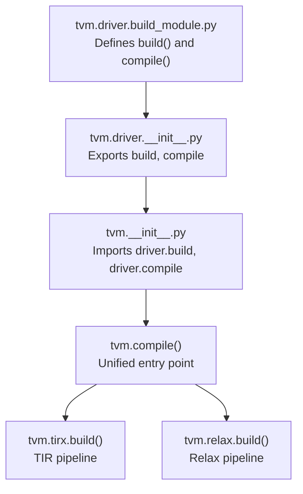
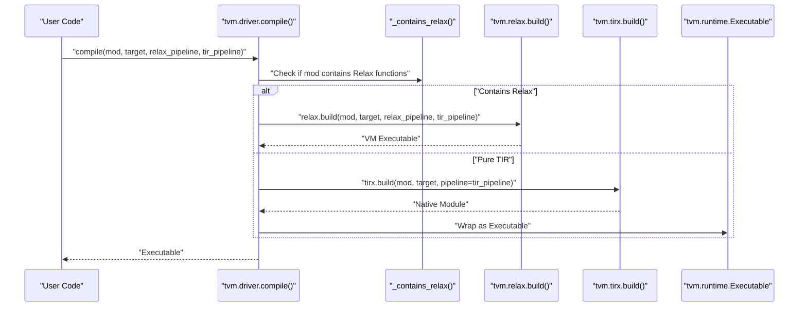
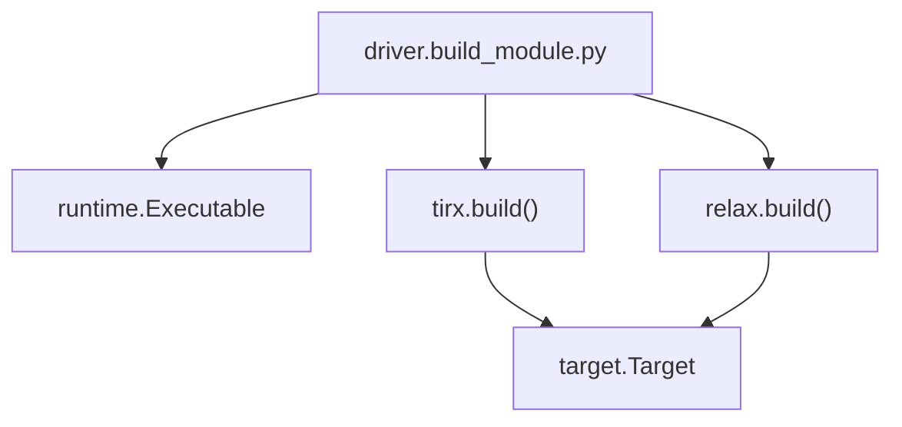

# Driver API

<cite>
**Referenced Files in This Document**
- [__init__.py](file://python/tvm/__init__.py)
- [__init__.py](file://python/tvm/driver/__init__.py)
- [build_module.py](file://python/tvm/driver/build_module.py)
- [_ffi_api.py](file://python/tvm/driver/_ffi_api.py)
- [__init__.py](file://python/tvm/tirx/__init__.py)
- [__init__.py](file://python/tvm/target/__init__.py)
- [vm_build.py](file://python/tvm/relax/vm_build.py)
- [relax_to_pyfunc_converter.py](file://python/tvm/relax/relax_to_pyfunc_converter.py)
- [base_py_module.py](file://python/tvm/relax/base_py_module.py)
- [relax_vm.rst](file://docs/arch/relax_vm.rst)
</cite>

## Table of Contents
1. [Introduction](#introduction)
2. [Project Structure](#project-structure)
3. [Core Components](#core-components)
4. [Architecture Overview](#architecture-overview)
5. [Detailed Component Analysis](#detailed-component-analysis)
6. [Dependency Analysis](#dependency-analysis)
7. [Performance Considerations](#performance-considerations)
8. [Troubleshooting Guide](#troubleshooting-guide)
9. [Conclusion](#conclusion)
10. [Appendices](#appendices)

## Introduction
This document provides comprehensive API documentation for TVM’s driver interface focused on unified compilation. It explains the primary entry points for compilation, including the unified tvm.compile() and the legacy tvm.driver.build(). It covers function signatures, parameter types, return values, target specification, pipeline selection, and output formats. Practical examples demonstrate basic and advanced compilation workflows, cross-compilation scenarios, and custom configurations. Guidance on error handling, diagnostics, and performance optimization is included for both beginners and advanced users.

## Project Structure
The driver API surface is exposed through the Python package tvm.driver and the top-level tvm.compile() function. The driver module exposes build() and compile() aliases, while tvm.compile() dispatches to the appropriate internal build pipeline depending on the input IR module type.

**Diagram sources**
- [build_module.py:31-112](file://python/tvm/driver/build_module.py#L31-L112)
- [__init__.py:22-22](file://python/tvm/driver/__init__.py#L22-L22)
- [__init__.py:61-61](file://python/tvm/__init__.py#L61-L61)

**Section sources**
- [__init__.py:20-22](file://python/tvm/driver/__init__.py#L20-L22)
- [__init__.py:60-61](file://python/tvm/__init__.py#L60-L61)
- [build_module.py:31-112](file://python/tvm/driver/build_module.py#L31-L112)

## Core Components
- tvm.driver.build(): Legacy function that is deprecated in favor of tvm.compile() or tvm.tirx.build(). It forwards to tvm.tirx.build().
- tvm.driver.compile(): Unified compilation entry point that detects whether the input module contains Relax functions and routes accordingly.
- tvm.compile(): Top-level alias that delegates to tvm.driver.compile().

Key behaviors:
- Input types: Accepts either a single TIR PrimFunc or an IRModule containing TIR/Relax functions.
- Target specification: Supports string, Target, or None (auto-detect).
- Pipeline selection: For Relax modules, supports separate relax_pipeline and tir_pipeline parameters. For TIR-only modules, a single pipeline parameter is used.
- Output: Returns a runtime Executable for loading and execution.

**Section sources**
- [build_module.py:31-112](file://python/tvm/driver/build_module.py#L31-L112)
- [__init__.py:60-61](file://python/tvm/__init__.py#L60-L61)

## Architecture Overview
The unified compilation flow inspects the input IRModule to decide whether to use the Relax build path or the TIR build path. The Relax path compiles Relax functions to bytecode and links with TIR-generated native code. The TIR path compiles PrimFunc/TIR functions directly to native code.

**Diagram sources**
- [build_module.py:72-112](file://python/tvm/driver/build_module.py#L72-L112)
- [vm_build.py:172-247](file://python/tvm/relax/vm_build.py#L172-L247)
- [__init__.py:121-121](file://python/tvm/tirx/__init__.py#L121-L121)

## Detailed Component Analysis

### tvm.driver.compile()
- Purpose: Unified compilation entry point for both TIR and Relax modules.
- Parameters:
  - mod: Union[PrimFunc, IRModule]
  - target: Optional[Target]
  - relax_pipeline: Optional[Union[tvm.transform.Pass, Callable, str]] (used when module contains Relax)
  - tir_pipeline: Optional[Union[tvm.transform.Pass, Callable, str]] (used for TIR functions)
- Behavior:
  - Detects presence of Relax functions in the IRModule.
  - Routes to tvm.relax.build() if Relax functions are present.
  - Routes to tvm.tirx.build() otherwise and wraps the result in a runtime Executable.
- Returns: tvm.runtime.Executable

Usage notes:
- For mixed modules (Relax + TIR), both relax_pipeline and tir_pipeline are applied.
- For pure TIR modules, only tir_pipeline is used.

**Section sources**
- [build_module.py:72-112](file://python/tvm/driver/build_module.py#L72-L112)

### tvm.driver.build() (Deprecated)
- Purpose: Legacy function that is deprecated in favor of tvm.compile() or tvm.tirx.build().
- Behavior: Issues a deprecation warning and forwards to tvm.tirx.build().
- Parameters: Same as tvm.tirx.build().

Recommendation: Prefer tvm.compile() or tvm.tirx.build() directly.

**Section sources**
- [build_module.py:31-60](file://python/tvm/driver/build_module.py#L31-L60)

### tvm.tirx.build()
- Purpose: Compiles TIR/PrimFunc modules to native code for a given target.
- Parameters:
  - mod: Union[PrimFunc, IRModule]
  - target: Union[str, Target, None]
  - pipeline: Union[str, tvm.transform.Pass, None]
- Returns: Native module suitable for wrapping into a runtime Executable.

Integration:
- Used internally by tvm.driver.compile() for TIR-only modules.
- Exposed via tvm.tirx.__init__ as a public API.

**Section sources**
- [__init__.py:121-121](file://python/tvm/tirx/__init__.py#L121-L121)
- [build_module.py:111-112](file://python/tvm/driver/build_module.py#L111-L112)

### tvm.relax.build()
- Purpose: Builds Relax IR modules to a VM executable, optionally linking with TIR code.
- Parameters:
  - mod: IRModule
  - target: Optional[Union[str, Target]]
  - params: Optional[Dict[str, list]]
  - relax_pipeline: Optional[Union[str, tvm.transform.Pass]]
  - tir_pipeline: Optional[Union[str, tvm.transform.Pass]]
  - exec_mode: {"bytecode", "compiled"}
  - system_lib: Optional[bool]
- Returns: tvm.relax.Executable

Notes:
- Supports host/target dual-targeting for device code generation with host-side glue code.
- Uses VM bytecode emission and linking with native TIR code.

**Section sources**
- [vm_build.py:172-247](file://python/tvm/relax/vm_build.py#L172-L247)

### Target Specification and Pipelines
- Target:
  - Accepts string tags, Target instances, or None.
  - Supports host/target composition for cross-compilation scenarios.
- Pipelines:
  - relax_pipeline: Controls Relax-level transformations and VM code emission.
  - tir_pipeline: Controls TIR-level transformations and native code generation.
- Dual-targeting:
  - When targeting device-specific code, a host target is often required for runtime glue.

**Section sources**
- [__init__.py:20-31](file://python/tvm/target/__init__.py#L20-L31)
- [vm_build.py:190-210](file://python/tvm/relax/vm_build.py#L190-L210)

### Compilation Diagnostics and Error Handling
- Deprecation warnings:
  - tvm.driver.build() warns that it is deprecated and suggests alternatives.
- Runtime exceptions:
  - Compilation failures in JIT wrappers and converters are caught and surfaced as warnings or raised exceptions depending on context.
- Backtraces:
  - TVM supports environment-controlled backtraces for diagnostics.

Practical guidance:
- Capture and inspect exceptions during compilation to diagnose IR mismatches or unsupported targets.
- Enable TVM_BACKTRACE for detailed stack traces in development environments.

**Section sources**
- [build_module.py:56-59](file://python/tvm/driver/build_module.py#L56-L59)
- [base_py_module.py:142-156](file://python/tvm/relax/base_py_module.py#L142-L156)
- [relax_to_pyfunc_converter.py:617-634](file://python/tvm/relax/relax_to_pyfunc_converter.py#L617-L634)
- [__init__.py:82-110](file://python/tvm/__init__.py#L82-L110)

## Dependency Analysis
The driver API depends on:
- tvm.driver.compile() to route compilation decisions.
- tvm.tirx.build() for TIR-only modules.
- tvm.relax.build() for modules containing Relax functions.
- tvm.target for target configuration and dual-targeting.

**Diagram sources**
- [build_module.py:72-112](file://python/tvm/driver/build_module.py#L72-L112)
- [__init__.py:121-121](file://python/tvm/tirx/__init__.py#L121-L121)
- [vm_build.py:172-247](file://python/tvm/relax/vm_build.py#L172-L247)

**Section sources**
- [build_module.py:72-112](file://python/tvm/driver/build_module.py#L72-L112)
- [__init__.py:121-121](file://python/tvm/tirx/__init__.py#L121-L121)
- [vm_build.py:172-247](file://python/tvm/relax/vm_build.py#L172-L247)

## Performance Considerations
- Pipeline selection:
  - Choose appropriate relax_pipeline and tir_pipeline to balance compilation time and runtime performance.
- Host/target separation:
  - Use host/target dual-targeting to minimize host overhead for device kernels.
- System library:
  - Consider enabling system_lib for static packaging and automatic registration of functions.
- Execution mode:
  - For Relax modules, bytecode mode offers flexibility; compiled mode may reduce startup overhead.

[No sources needed since this section provides general guidance]

## Troubleshooting Guide
Common issues and resolutions:
- Deprecated API usage:
  - Replace tvm.driver.build() with tvm.compile() or tvm.tirx.build().
- Mixed IR modules:
  - Ensure both relax_pipeline and tir_pipeline are configured when compiling modules containing both Relax and TIR functions.
- Cross-compilation:
  - Verify target tags and host/target combinations align with available toolchains.
- Diagnostics:
  - Set TVM_BACKTRACE=1 to enable detailed backtraces for compilation errors.

**Section sources**
- [build_module.py:56-59](file://python/tvm/driver/build_module.py#L56-L59)
- [__init__.py:82-110](file://python/tvm/__init__.py#L82-L110)

## Conclusion
The unified driver API simplifies TVM compilation by automatically detecting module types and applying appropriate pipelines. Beginners can rely on tvm.compile() with minimal configuration, while advanced users can fine-tune relax_pipeline and tir_pipeline for specialized scenarios. Proper target specification, pipeline selection, and diagnostics are essential for robust and efficient compilation workflows.

[No sources needed since this section summarizes without analyzing specific files]

## Appendices

### API Reference Summary

- tvm.driver.compile(mod, target=None, *, relax_pipeline="default", tir_pipeline="default") -> Executable
  - Compiles either TIR-only or mixed Relax/TIR modules to a runtime Executable.
- tvm.driver.build(mod, target=None, pipeline="default") -> Deprecated
  - Legacy function forwarding to tvm.tirx.build().
- tvm.tirx.build(mod, target, pipeline="default")
  - Compiles TIR/PrimFunc modules to native code.
- tvm.relax.build(mod, target=None, params=None, relax_pipeline="default", tir_pipeline="default", exec_mode="bytecode", system_lib=None) -> Executable
  - Builds Relax modules to VM executable with optional system library packaging.

Target specification:
- Accepts string tags, Target instances, or None. Supports host/target dual-targeting for cross-compilation.

**Section sources**
- [build_module.py:31-112](file://python/tvm/driver/build_module.py#L31-L112)
- [__init__.py:121-121](file://python/tvm/tirx/__init__.py#L121-L121)
- [vm_build.py:172-247](file://python/tvm/relax/vm_build.py#L172-L247)
- [__init__.py:20-31](file://python/tvm/target/__init__.py#L20-L31)

### Practical Workflows

- Basic compilation (TIR-only):
  - Prepare a TIR PrimFunc or IRModule.
  - Call tvm.compile(mod, target) with a valid target string or Target.
  - Load and run the resulting Executable.

- Basic compilation (Relax-only):
  - Prepare a Relax IRModule.
  - Call tvm.compile(mod, target) to produce a VM Executable.
  - Optionally set exec_mode and system_lib for packaging.

- Cross-compilation:
  - Define a target with a device kind and a host kind (e.g., device kind plus host="llvm").
  - Pass the target to tvm.compile() to generate device code with host-side glue.

- Advanced customization:
  - Provide custom relax_pipeline and tir_pipeline to control Relax and TIR transformations.
  - For Relax modules, tune relax_pipeline for operator legalization and fusion; tune tir_pipeline for vectorization and lowering.

**Section sources**
- [vm_build.py:190-210](file://python/tvm/relax/vm_build.py#L190-L210)
- [relax_vm.rst:60-94](file://docs/arch/relax_vm.rst#L60-L94)