# IR API

<cite>
**Referenced Files in This Document**
- [module.h](file://include/tvm/ir/module.h)
- [expr.h](file://include/tvm/ir/expr.h)
- [type.h](file://include/tvm/ir/type.h)
- [function.h](file://include/tvm/ir/function.h)
- [transform.h](file://include/tvm/ir/transform.h)
- [analysis.h](file://include/tvm/ir/analysis.h)
- [stmt.h](file://include/tvm/tirx/stmt.h)
- [functor.h](file://include/tvm/node/functor.h)
- [type_functor.h](file://include/tvm/ir/type_functor.h)
- [expr_functor.h](file://include/tvm/tirx/expr_functor.h)
- [relax_expr_functor.h](file://include/tvm/relax/expr_functor.h)
- [module.cc](file://src/ir/module.cc)
- [expr.cc](file://src/ir/expr.cc)
</cite>

## Table of Contents
1. [Introduction](#introduction)
2. [Project Structure](#project-structure)
3. [Core Components](#core-components)
4. [Architecture Overview](#architecture-overview)
5. [Detailed Component Analysis](#detailed-component-analysis)
6. [Dependency Analysis](#dependency-analysis)
7. [Performance Considerations](#performance-considerations)
8. [Troubleshooting Guide](#troubleshooting-guide)
9. [Conclusion](#conclusion)
10. [Appendices](#appendices)

## Introduction
This document provides comprehensive API documentation for TVM’s IR manipulation system. It focuses on:
- IRModule construction and lifecycle
- Function definition and attributes
- Expression and statement types across IR variants
- Type system APIs
- IR visitor and mutator patterns
- IR analysis utilities
- Pass infrastructure integration
- Serialization, deserialization, and round-tripping
- Validation, well-formedness checks, and debugging techniques

The goal is to enable both newcomers and experienced developers to construct, inspect, transform, and validate TVM IR with confidence.

## Project Structure
At the core of TVM’s IR system are:
- IRModule: the top-level container for functions and metadata
- Expressions and Statements: typed AST nodes for computation and control flow
- Types: unified type system across IR variants
- Visitors and Mutators: composable traversal and transformation patterns
- Pass Infrastructure: orchestration of IRModule transformations
- Analysis Utilities: call graph and dependency analysis helpers

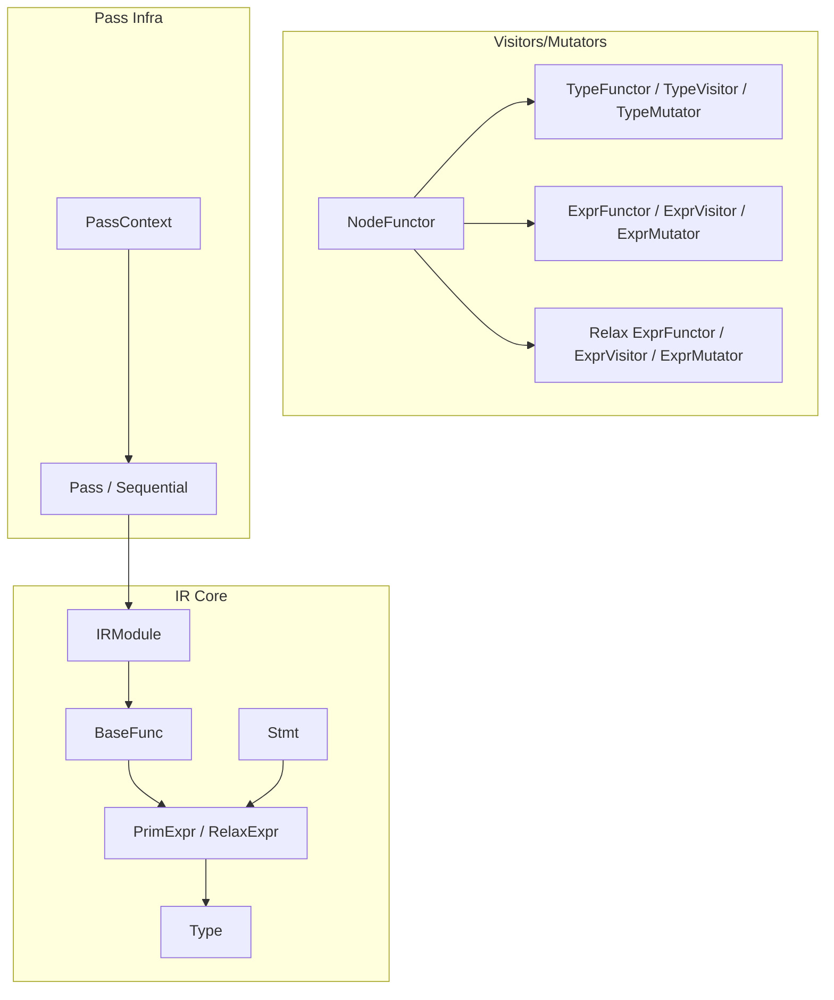

**Diagram sources**
- [module.h:58-251](file://include/tvm/ir/module.h#L58-L251)
- [function.h:139-236](file://include/tvm/ir/function.h#L139-L236)
- [expr.h:418-488](file://include/tvm/ir/expr.h#L418-L488)
- [type.h:74-310](file://include/tvm/ir/type.h#L74-L310)
- [stmt.h:39-687](file://include/tvm/tirx/stmt.h#L39-L687)
- [functor.h:64-155](file://include/tvm/node/functor.h#L64-L155)
- [type_functor.h:50-130](file://include/tvm/ir/type_functor.h#L50-L130)
- [expr_functor.h:88-293](file://include/tvm/tirx/expr_functor.h#L88-L293)
- [relax_expr_functor.h:106-567](file://include/tvm/relax/expr_functor.h#L106-L567)
- [transform.h:370-564](file://include/tvm/ir/transform.h#L370-L564)

**Section sources**
- [module.h:44-251](file://include/tvm/ir/module.h#L44-L251)
- [function.h:36-236](file://include/tvm/ir/function.h#L36-L236)
- [expr.h:418-488](file://include/tvm/ir/expr.h#L418-L488)
- [type.h:60-310](file://include/tvm/ir/type.h#L60-L310)
- [stmt.h:39-687](file://include/tvm/tirx/stmt.h#L39-L687)
- [functor.h:64-155](file://include/tvm/node/functor.h#L64-L155)
- [type_functor.h:50-130](file://include/tvm/ir/type_functor.h#L50-L130)
- [expr_functor.h:88-293](file://include/tvm/tirx/expr_functor.h#L88-L293)
- [relax_expr_functor.h:106-567](file://include/tvm/relax/expr_functor.h#L106-L567)
- [transform.h:71-564](file://include/tvm/ir/transform.h#L71-L564)

## Core Components
- IRModule: Holds functions, attributes, source map, and global info. Provides add/update/remove/lookup and shallow copy.
- BaseFunc: Base for function variants; carries attributes and linkage type detection.
- Expressions: BaseExpr, PrimExpr, RelaxExpr; constants, ranges, global variables; conversions and arithmetic operators.
- Types: PrimType, PointerType, TupleType, FuncType, TensorMapType; unified typing bridge across IRs.
- Statements: Bind, AttrStmt, AssertStmt, BufferStore, DeclBuffer, AllocBuffer, SeqStmt, Evaluate, IfThenElse, For, While, BufferRegion, MatchBufferRegion, SBlockNode.
- Visitors/Mutators: NodeFunctor for dynamic dispatch; TypeFunctor/TypeVisitor/TypeMutator; ExprFunctor/ExprVisitor/ExprMutator; Relax variants.
- Pass Infrastructure: Pass, Sequential, PassContext, PassInfo; module-level passes and function-scoped application.

**Section sources**
- [module.h:58-251](file://include/tvm/ir/module.h#L58-L251)
- [function.h:139-236](file://include/tvm/ir/function.h#L139-L236)
- [expr.h:418-773](file://include/tvm/ir/expr.h#L418-L773)
- [type.h:74-310](file://include/tvm/ir/type.h#L74-L310)
- [stmt.h:39-798](file://include/tvm/tirx/stmt.h#L39-L798)
- [type_functor.h:50-130](file://include/tvm/ir/type_functor.h#L50-L130)
- [expr_functor.h:88-293](file://include/tvm/tirx/expr_functor.h#L88-L293)
- [relax_expr_functor.h:106-567](file://include/tvm/relax/expr_functor.h#L106-L567)
- [transform.h:370-564](file://include/tvm/ir/transform.h#L370-L564)

## Architecture Overview
The IR manipulation architecture centers on IRModule as the unit of transformation. Passes operate on IRModule, using visitors/mutators to traverse and rewrite expressions and statements. The type system provides a unified foundation across dialects.

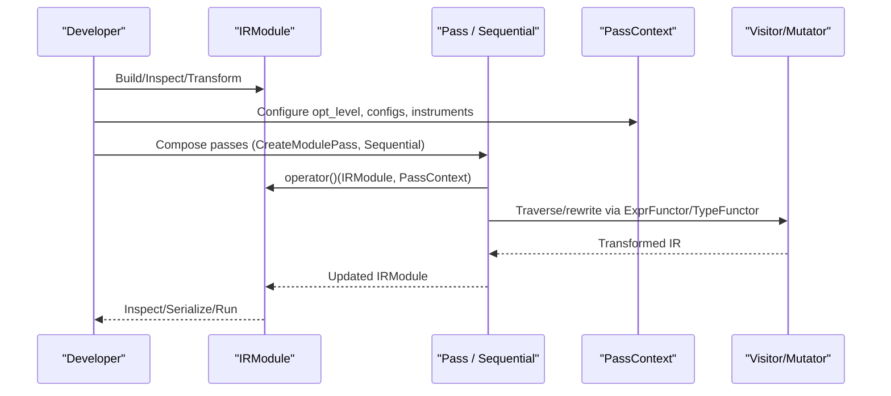

**Diagram sources**
- [transform.h:370-564](file://include/tvm/ir/transform.h#L370-L564)
- [expr_functor.h:88-293](file://include/tvm/tirx/expr_functor.h#L88-L293)
- [type_functor.h:50-130](file://include/tvm/ir/type_functor.h#L50-L130)

## Detailed Component Analysis

### IRModule Construction and Lifecycle
- Construction: IRModule takes functions map, optional source map, attributes, and global info. It enforces unique global function names and maintains a reverse lookup map.
- Mutation: Add/AddUnchecked/Update/Remove; Update merges another module’s functions.
- Lookup: By GlobalVar or by string name; shallow copy for immutable snapshots.
- Attributes: Typed attribute accessors and nonzero checks; module-level metadata and linkage hints.

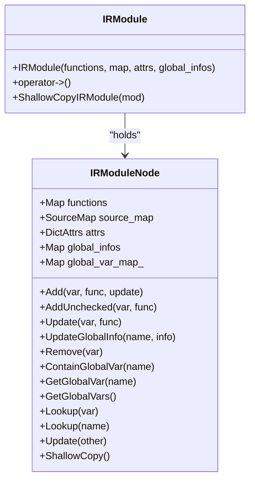

**Diagram sources**
- [module.h:58-251](file://include/tvm/ir/module.h#L58-L251)
- [module.cc:41-200](file://src/ir/module.cc#L41-L200)

**Section sources**
- [module.h:58-251](file://include/tvm/ir/module.h#L58-L251)
- [module.cc:41-200](file://src/ir/module.cc#L41-L200)

### Function Definition and Attributes
- BaseFunc: Carries DictAttrs and provides typed GetAttr and HasNonzeroAttr helpers; determines linkage type from presence of global symbol.
- Calling conventions and linkage: enums and attributes define calling convention and global symbol placement.

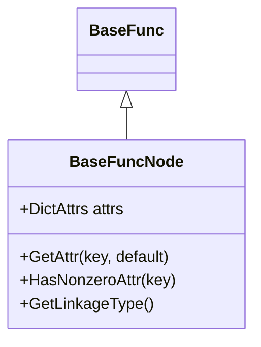

**Diagram sources**
- [function.h:139-236](file://include/tvm/ir/function.h#L139-L236)

**Section sources**
- [function.h:36-236](file://include/tvm/ir/function.h#L36-L236)

### Expression Types and Arithmetic
- BaseExpr/PrimExpr/RelaxExpr: hierarchy for expressions; PrimExpr carries dtype; RelaxExpr carries struct_info.
- Constants: IntImm, FloatImm, Bool, Integer; Range containers; conversions and arithmetic operators.
- Operators: arithmetic, logical/bitwise, relational; eager constant folding for index types.

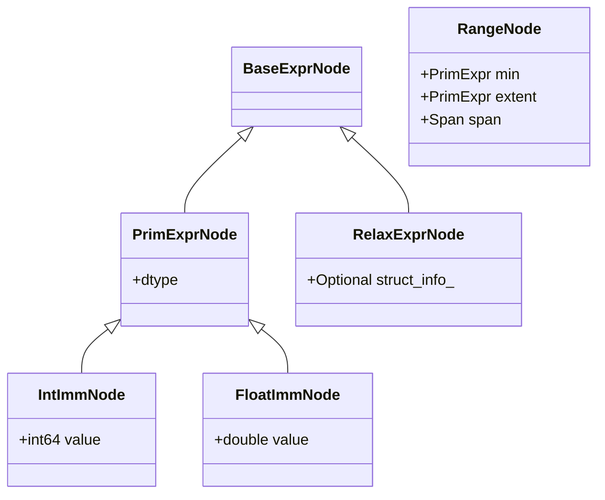

**Diagram sources**
- [expr.h:418-773](file://include/tvm/ir/expr.h#L418-L773)

**Section sources**
- [expr.h:418-773](file://include/tvm/ir/expr.h#L418-L773)
- [expr.cc:53-183](file://src/ir/expr.cc#L53-L183)

### Statement Types (TIR)
- Control flow and memory: Bind, AttrStmt, AssertStmt, IfThenElse, For, While.
- Buffer operations: BufferStore, DeclBuffer, AllocBuffer; BufferRegion and MatchBufferRegion for layout constraints.
- Sequencing: SeqStmt and Evaluate; Flatten utility for building sequences.
- SBlockNode: block-level scheduling unit with reads/writes, predicates, allocations, and attributes.

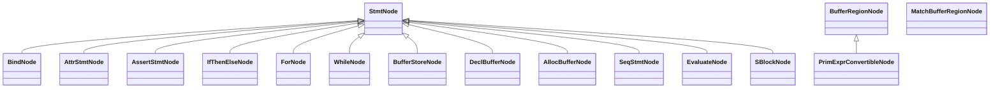

**Diagram sources**
- [stmt.h:39-798](file://include/tvm/tirx/stmt.h#L39-L798)

**Section sources**
- [stmt.h:39-798](file://include/tvm/tirx/stmt.h#L39-L798)

### Type System APIs
- Unified typing across IR variants: PrimType, PointerType, TupleType, FuncType, TensorMapType.
- TypeFunctor/TypeVisitor/TypeMutator: dispatch-based traversal and transformation of types.

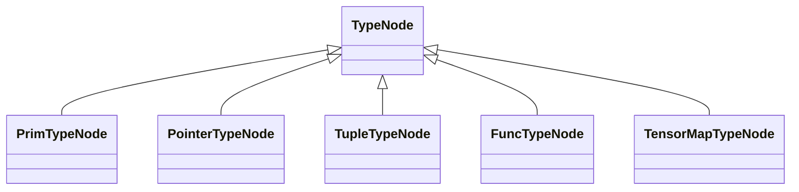

**Diagram sources**
- [type.h:74-310](file://include/tvm/ir/type.h#L74-L310)
- [type_functor.h:50-130](file://include/tvm/ir/type_functor.h#L50-L130)

**Section sources**
- [type.h:60-310](file://include/tvm/ir/type.h#L60-L310)
- [type_functor.h:50-130](file://include/tvm/ir/type_functor.h#L50-L130)

### IR Visitor and Mutator Patterns
- NodeFunctor: dynamic dispatch on ObjectRef type; set_dispatch/clear_dispatch/Finalize.
- TypeFunctor: dispatch on Type; TypeVisitor/TypeMutator recurse into type substructures.
- ExprFunctor (TIR): dispatch on PrimExpr; ExprVisitor/ExprMutator recurse into expression subgraphs.
- Relax ExprFunctor: dispatch on Relax expressions; ExprVisitor/ExprMutator for ANF and unnormalized forms.

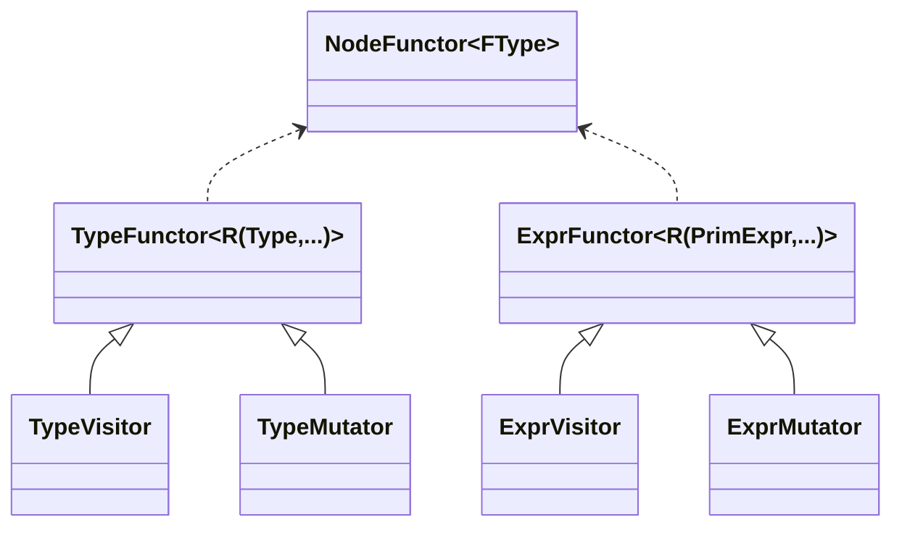

**Diagram sources**
- [functor.h:64-155](file://include/tvm/node/functor.h#L64-L155)
- [type_functor.h:50-130](file://include/tvm/ir/type_functor.h#L50-L130)
- [expr_functor.h:88-293](file://include/tvm/tirx/expr_functor.h#L88-L293)
- [relax_expr_functor.h:106-567](file://include/tvm/relax/expr_functor.h#L106-L567)

**Section sources**
- [functor.h:64-155](file://include/tvm/node/functor.h#L64-L155)
- [type_functor.h:50-130](file://include/tvm/ir/type_functor.h#L50-L130)
- [expr_functor.h:88-293](file://include/tvm/tirx/expr_functor.h#L88-L293)
- [relax_expr_functor.h:106-567](file://include/tvm/relax/expr_functor.h#L106-L567)

### IR Analysis Utilities
- Call map collection: CalleeCollector and CollectCallMap to analyze inter-function dependencies.

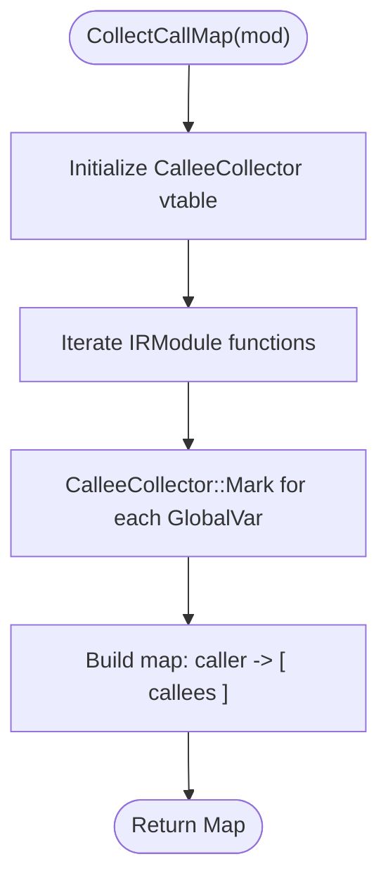

**Diagram sources**
- [analysis.h:38-59](file://include/tvm/ir/analysis.h#L38-L59)

**Section sources**
- [analysis.h:38-59](file://include/tvm/ir/analysis.h#L38-L59)

### Pass Infrastructure Integration
- Pass: base class for IRModule transformations; operator()(IRModule) and operator()(IRModule, PassContext).
- Sequential: composes multiple passes with metadata and dependency resolution.
- PassContext: configuration, diagnostics, instrumentation hooks, and pass filtering.
- Helpers: CreateModulePass, ApplyPassToFunction, PrintIR tracing pass.

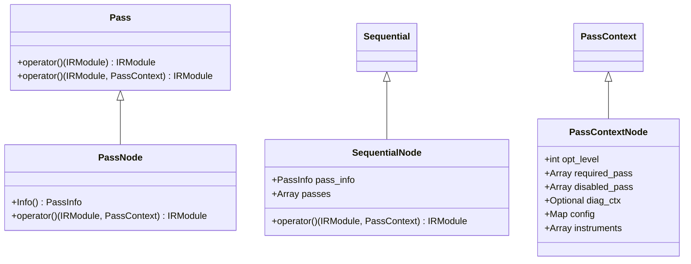

**Diagram sources**
- [transform.h:370-564](file://include/tvm/ir/transform.h#L370-L564)

**Section sources**
- [transform.h:71-564](file://include/tvm/ir/transform.h#L71-L564)

### Practical Workflows

#### IR Construction
- Build expressions/constants and compose PrimExpr trees.
- Create statements (e.g., For, IfThenElse, SeqStmt) and buffer operations (BufferStore, AllocBuffer).
- Wrap into a function (BaseFunc) and attach attributes (e.g., linkage, calling convention).
- Insert into IRModule via Add/AddUnchecked; enforce uniqueness.

**Section sources**
- [expr.h:418-773](file://include/tvm/ir/expr.h#L418-L773)
- [stmt.h:39-798](file://include/tvm/tirx/stmt.h#L39-L798)
- [function.h:139-236](file://include/tvm/ir/function.h#L139-L236)
- [module.h:147-168](file://include/tvm/ir/module.h#L147-L168)

#### IR Inspection
- Use visitors to traverse expressions and statements; collect statistics, validate shapes, or extract metadata.
- Use CollectCallMap to analyze inter-function dependencies.

**Section sources**
- [expr_functor.h:205-293](file://include/tvm/tirx/expr_functor.h#L205-L293)
- [stmt.h:39-798](file://include/tvm/tirx/stmt.h#L39-L798)
- [analysis.h:38-59](file://include/tvm/ir/analysis.h#L38-L59)

#### IR Transformation
- Compose passes with Sequential; configure via PassContext.
- Apply pass to specific functions using ApplyPassToFunction with regex selection.
- Use ExprMutator/TypeMutator to rewrite subgraphs; leverage Flatten for statement sequencing.

**Section sources**
- [transform.h:444-564](file://include/tvm/ir/transform.h#L444-L564)
- [expr_functor.h:250-293](file://include/tvm/tirx/expr_functor.h#L250-L293)
- [stmt.h:362-434](file://include/tvm/tirx/stmt.h#L362-L434)

### Serialization, Deserialization, and Round-tripping
- IRModule supports structural equality and hashing; these are foundational for round-trip validation.
- Serialization facilities exist in the IR layer to persist and restore IR structures.

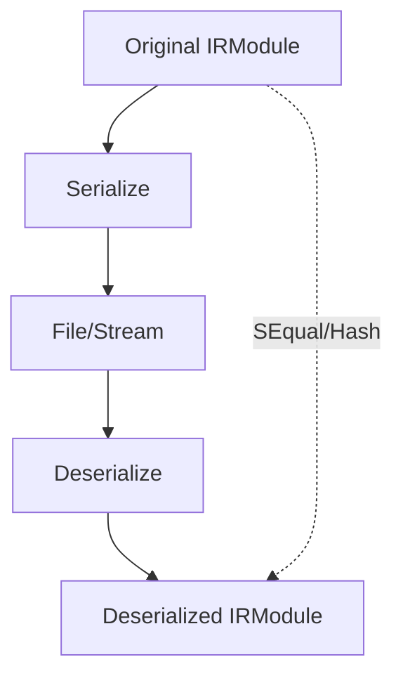

**Diagram sources**
- [module.cc:60-111](file://src/ir/module.cc#L60-L111)

**Section sources**
- [module.cc:60-111](file://src/ir/module.cc#L60-L111)

### Validation, Well-formedness, and Debugging
- Structural equality and hashing: ensure IR equivalence across transformations.
- Attribute accessors: typed GetAttr and HasNonzeroAttr guard assumptions.
- Span fields: retain source locations for diagnostics.
- PassContext instrumentation: enter/exit hooks and per-pass callbacks.
- Assertions and error kinds: structured error reporting in statements.

**Section sources**
- [module.cc:60-111](file://src/ir/module.cc#L60-L111)
- [expr.h:51-86](file://include/tvm/ir/expr.h#L51-L86)
- [stmt.h:159-189](file://include/tvm/tirx/stmt.h#L159-L189)
- [transform.h:185-240](file://include/tvm/ir/transform.h#L185-L240)

## Dependency Analysis
- IRModule depends on BaseFunc, GlobalVar, SourceMap, DictAttrs, and GlobalInfo.
- Expressions depend on types and spans; arithmetic operators are defined in the expression layer.
- Visitors/mutators depend on NodeFunctor and variant-specific functors.
- Pass infrastructure orchestrates IRModule transformations and integrates with instrumentation and diagnostics.

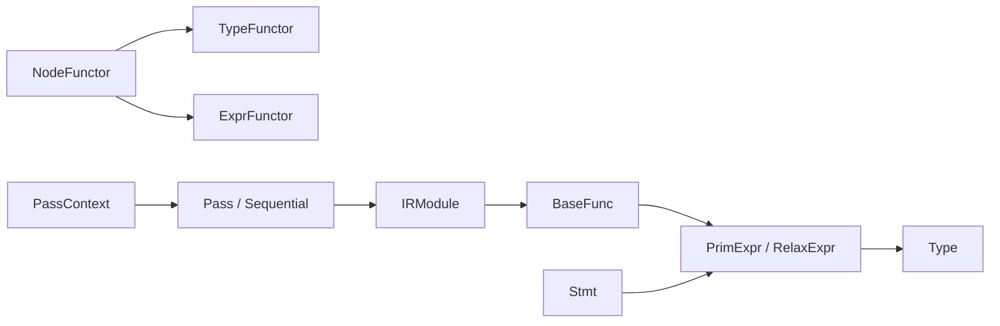

**Diagram sources**
- [module.h:58-251](file://include/tvm/ir/module.h#L58-L251)
- [function.h:139-236](file://include/tvm/ir/function.h#L139-L236)
- [expr.h:418-488](file://include/tvm/ir/expr.h#L418-L488)
- [type.h:74-310](file://include/tvm/ir/type.h#L74-L310)
- [stmt.h:39-687](file://include/tvm/tirx/stmt.h#L39-L687)
- [functor.h:64-155](file://include/tvm/node/functor.h#L64-L155)
- [type_functor.h:50-130](file://include/tvm/ir/type_functor.h#L50-L130)
- [expr_functor.h:88-293](file://include/tvm/tirx/expr_functor.h#L88-L293)
- [transform.h:370-564](file://include/tvm/ir/transform.h#L370-L564)

**Section sources**
- [module.h:58-251](file://include/tvm/ir/module.h#L58-L251)
- [function.h:139-236](file://include/tvm/ir/function.h#L139-L236)
- [expr.h:418-488](file://include/tvm/ir/expr.h#L418-L488)
- [type.h:74-310](file://include/tvm/ir/type.h#L74-L310)
- [stmt.h:39-687](file://include/tvm/tirx/stmt.h#L39-L687)
- [functor.h:64-155](file://include/tvm/node/functor.h#L64-L155)
- [type_functor.h:50-130](file://include/tvm/ir/type_functor.h#L50-L130)
- [expr_functor.h:88-293](file://include/tvm/tirx/expr_functor.h#L88-L293)
- [transform.h:370-564](file://include/tvm/ir/transform.h#L370-L564)

## Performance Considerations
- Prefer immutable IRModule copies when sharing across passes to avoid unnecessary mutations.
- Use structural equality and hashing judiciously; they are O(depth) and can be expensive on large graphs.
- Limit pass scope to targeted functions using ApplyPassToFunction to reduce overhead.
- Flatten sequences with SeqStmt::Flatten to minimize nested structures and improve traversal locality.

## Troubleshooting Guide
- Attribute access failures: ensure keys exist or provide defaults; use HasNonzeroAttr for optional flags.
- Duplicate global function names: IRModule enforces uniqueness; resolve conflicts by renaming or merging carefully.
- Invalid literal ranges: IntImm/FloatImm constructors validate ranges; adjust dtype or value to satisfy constraints.
- Assertion failures: use AssertStmt with structured error kinds and message parts for precise diagnostics.
- Pass filtering: configure PassContext required/disabled lists and opt levels to control pass execution.

**Section sources**
- [module.cc:113-145](file://src/ir/module.cc#L113-L145)
- [expr.cc:53-183](file://src/ir/expr.cc#L53-L183)
- [stmt.h:159-189](file://include/tvm/tirx/stmt.h#L159-L189)
- [transform.h:185-240](file://include/tvm/ir/transform.h#L185-L240)

## Conclusion
TVM’s IR manipulation system provides a robust, unified framework for constructing, inspecting, transforming, and validating IR across dialects. With IRModule as the central container, rich expression and statement types, a flexible visitor/mutator architecture, and a configurable pass infrastructure, developers can implement sophisticated optimizations and analyses. Proper use of attributes, structural equality, and instrumentation ensures correctness and maintainability.

## Appendices
- Practical examples are provided conceptually in the “Practical Workflows” section; concrete code references are omitted per policy and can be found in the cited files above.