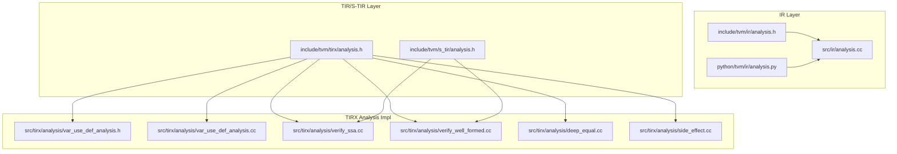
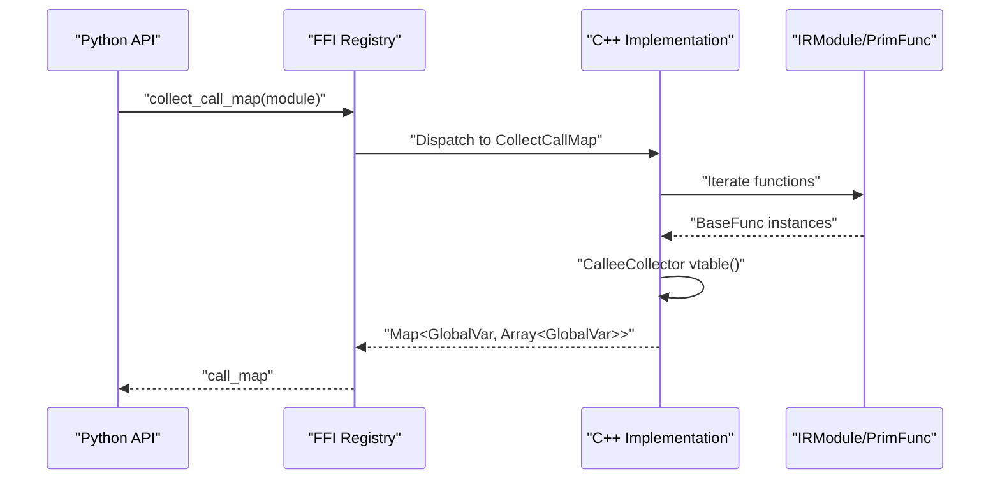
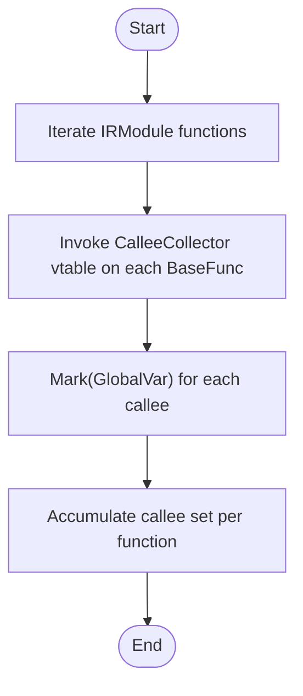
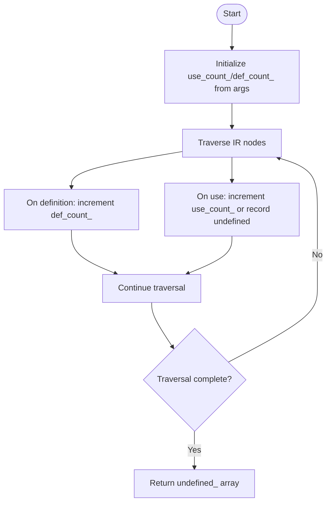
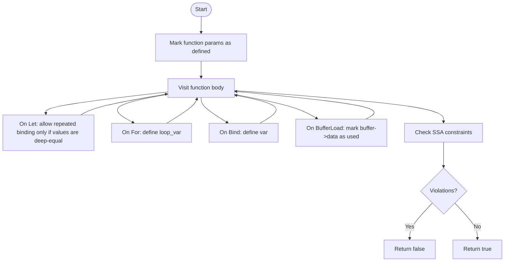
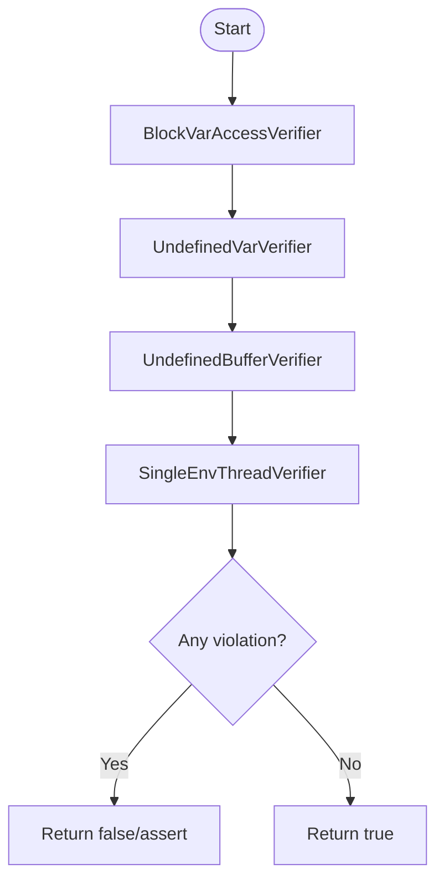
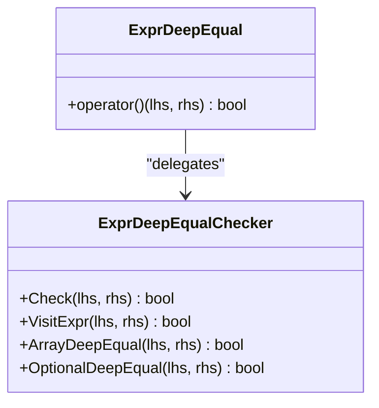
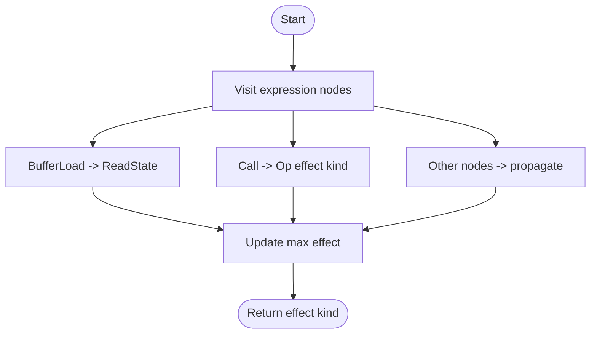
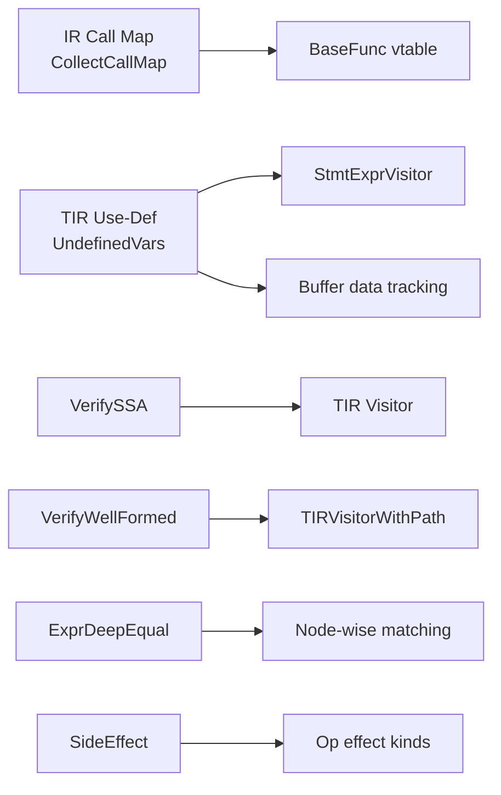

# IR Analysis API

<cite>
**Referenced Files in This Document**
- [analysis.h](file://include/tvm/ir/analysis.h)
- [analysis.cc](file://src/ir/analysis.cc)
- [analysis.py](file://python/tvm/ir/analysis.py)
- [tirx/analysis.h](file://include/tvm/tirx/analysis.h)
- [s_tir/analysis.h](file://include/tvm/s_tir/analysis.h)
- [var_use_def_analysis.h](file://src/tirx/analysis/var_use_def_analysis.h)
- [var_use_def_analysis.cc](file://src/tirx/analysis/var_use_def_analysis.cc)
- [verify_ssa.cc](file://src/tirx/analysis/verify_ssa.cc)
- [verify_well_formed.cc](file://src/tirx/analysis/verify_well_formed.cc)
- [deep_equal.cc](file://src/tirx/analysis/deep_equal.cc)
- [side_effect.cc](file://src/tirx/analysis/side_effect.cc)
</cite>

## Table of Contents
1. [Introduction](#introduction)
2. [Project Structure](#project-structure)
3. [Core Components](#core-components)
4. [Architecture Overview](#architecture-overview)
5. [Detailed Component Analysis](#detailed-component-analysis)
6. [Dependency Analysis](#dependency-analysis)
7. [Performance Considerations](#performance-considerations)
8. [Troubleshooting Guide](#troubleshooting-guide)
9. [Conclusion](#conclusion)
10. [Appendices](#appendices)

## Introduction
This document describes the IR Analysis API in TVM, focusing on utilities for free variable detection, bound variable analysis, occurrence analysis, expression and statement analysis patterns, dependency analysis, and control flow analysis. It also covers IR instrumentation for profiling and debugging, pass instrumentation hooks, and analysis pass integration. Practical examples demonstrate how to implement custom analysis passes, query IR properties, and perform static analysis. Guidance is included on performance optimization, caching strategies, and integration with the pass infrastructure, along with debugging techniques and common pitfalls.

## Project Structure
The IR Analysis system spans several header and implementation files:
- IR-level analysis registry and call map collection
- TIR/S-TIR analysis utilities and passes
- TIR variable use-def analysis
- SSA verification and well-formedness checks
- Expression deep equality and side-effect analysis

**Diagram sources**
- [analysis.h:38-61](file://include/tvm/ir/analysis.h#L38-L61)
- [analysis.cc:32-45](file://src/ir/analysis.cc#L32-L45)
- [analysis.py:27-44](file://python/tvm/ir/analysis.py#L27-L44)
- [tirx/analysis.h:39-246](file://include/tvm/tirx/analysis.h#L39-L246)
- [s_tir/analysis.h:96-209](file://include/tvm/s_tir/analysis.h#L96-L209)
- [var_use_def_analysis.h:1-226](file://src/tirx/analysis/var_use_def_analysis.h#L1-L226)
- [var_use_def_analysis.cc:30-226](file://src/tirx/analysis/var_use_def_analysis.cc#L30-L226)
- [verify_ssa.cc:39-172](file://src/tirx/analysis/verify_ssa.cc#L39-L172)
- [verify_well_formed.cc:44-464](file://src/tirx/analysis/verify_well_formed.cc#L44-L464)
- [deep_equal.cc:45-208](file://src/tirx/analysis/deep_equal.cc#L45-L208)
- [side_effect.cc:33-76](file://src/tirx/analysis/side_effect.cc#L33-L76)

**Section sources**
- [analysis.h:38-61](file://include/tvm/ir/analysis.h#L38-L61)
- [analysis.cc:32-45](file://src/ir/analysis.cc#L32-L45)
- [analysis.py:27-44](file://python/tvm/ir/analysis.py#L27-L44)
- [tirx/analysis.h:39-246](file://include/tvm/tirx/analysis.h#L39-L246)
- [s_tir/analysis.h:96-209](file://include/tvm/s_tir/analysis.h#L96-L209)
- [var_use_def_analysis.h:1-226](file://src/tirx/analysis/var_use_def_analysis.h#L1-L226)
- [var_use_def_analysis.cc:30-226](file://src/tirx/analysis/var_use_def_analysis.cc#L30-L226)
- [verify_ssa.cc:39-172](file://src/tirx/analysis/verify_ssa.cc#L39-L172)
- [verify_well_formed.cc:44-464](file://src/tirx/analysis/verify_well_formed.cc#L44-L464)
- [deep_equal.cc:45-208](file://src/tirx/analysis/deep_equal.cc#L45-L208)
- [side_effect.cc:33-76](file://src/tirx/analysis/side_effect.cc#L33-L76)

## Core Components
- Call map collection across IR types
- Free variable detection (expression and statement)
- Bound variable analysis (SSA verification)
- Well-formedness checks for TIR/S-TIR
- Expression deep equality
- Side-effect classification for expressions
- FLOPs estimation and memory footprint analysis (S-TIR)
- Pure function detection and OOB checker (S-TIR)

Key APIs:
- Call map collection: [CollectCallMap:32-45](file://src/ir/analysis.cc#L32-L45)
- Free variables: [UndefinedVars:192-208](file://src/tirx/analysis/var_use_def_analysis.cc#L192-L208)
- SSA verification: [VerifySSA:137-141](file://src/tirx/analysis/verify_ssa.cc#L137-L141)
- Well-formedness: [VerifyWellFormed:416-444](file://src/tirx/analysis/verify_well_formed.cc#L416-L444)
- Deep equality: [ExprDeepEqual:45-197](file://src/tirx/analysis/deep_equal.cc#L45-L197)
- Side effects: [SideEffect:68-72](file://src/tirx/analysis/side_effect.cc#L68-L72)
- S-TIR analysis: [EstimateTIRFlops:104-112](file://include/tvm/s_tir/analysis.h#L104-L112), [CalculateAllocatedBytes:148-157](file://include/tvm/s_tir/analysis.h#L148-L157)

**Section sources**
- [analysis.cc:32-45](file://src/ir/analysis.cc#L32-L45)
- [var_use_def_analysis.cc:192-208](file://src/tirx/analysis/var_use_def_analysis.cc#L192-L208)
- [verify_ssa.cc:137-141](file://src/tirx/analysis/verify_ssa.cc#L137-L141)
- [verify_well_formed.cc:416-444](file://src/tirx/analysis/verify_well_formed.cc#L416-L444)
- [deep_equal.cc:45-197](file://src/tirx/analysis/deep_equal.cc#L45-L197)
- [side_effect.cc:68-72](file://src/tirx/analysis/side_effect.cc#L68-L72)
- [s_tir/analysis.h:104-157](file://include/tvm/s_tir/analysis.h#L104-L157)

## Architecture Overview
The IR Analysis API integrates:
- A Python-facing API that exposes FFI-backed analysis functions
- C++ implementations that traverse IR nodes and maintain analysis state
- Pass infrastructure for module-level verification and transformations

**Diagram sources**
- [analysis.py:27-44](file://python/tvm/ir/analysis.py#L27-L44)
- [analysis.cc:32-45](file://src/ir/analysis.cc#L32-L45)
- [analysis.h:38-61](file://include/tvm/ir/analysis.h#L38-L61)

## Detailed Component Analysis

### Call Map Collection (IR-level)
- Purpose: Build a map from each function to the set of functions it calls.
- Mechanism: Visitor pattern via a vtable for BaseFunc subclasses; collects GlobalVar targets of calls.
- API: [CollectCallMap:32-45](file://src/ir/analysis.cc#L32-L45), exposed to Python via [collect_call_map:27-44](file://python/tvm/ir/analysis.py#L27-L44).

**Diagram sources**
- [analysis.cc:32-45](file://src/ir/analysis.cc#L32-L45)
- [analysis.h:38-61](file://include/tvm/ir/analysis.h#L38-L61)

**Section sources**
- [analysis.h:38-61](file://include/tvm/ir/analysis.h#L38-L61)
- [analysis.cc:32-45](file://src/ir/analysis.cc#L32-L45)
- [analysis.py:27-44](file://python/tvm/ir/analysis.py#L27-L44)

### Free Variable Detection (TIR/S-TIR)
- Purpose: Identify variables used but not defined in an expression or statement.
- Mechanism: Traverses statements and expressions, tracking definitions and uses; supports scoped arguments and buffer data pointers.
- Overloads:
  - [UndefinedVars(Stmt, args):192-196](file://src/tirx/analysis/var_use_def_analysis.cc#L192-L196)
  - [UndefinedVars(Expr):198-202](file://src/tirx/analysis/var_use_def_analysis.cc#L198-L202)
  - [UndefinedVars(Expr, args):204-208](file://src/tirx/analysis/var_use_def_analysis.cc#L204-L208)

**Diagram sources**
- [var_use_def_analysis.cc:30-226](file://src/tirx/analysis/var_use_def_analysis.cc#L30-L226)

**Section sources**
- [var_use_def_analysis.h:1-226](file://src/tirx/analysis/var_use_def_analysis.h#L1-L226)
- [var_use_def_analysis.cc:30-226](file://src/tirx/analysis/var_use_def_analysis.cc#L30-L226)

### Bound Variable Analysis and SSA Verification
- Purpose: Verify SSA conditions and report violations.
- Mechanism: Walks the function body, tracks definitions and uses, enforces single-assignment constraints and scope rules.
- API: [VerifySSA:137-141](file://src/tirx/analysis/verify_ssa.cc#L137-L141)
- Pass variant: [tirx.transform.VerifySSA:233-233](file://include/tvm/tirx/analysis.h#L233-L233)

**Diagram sources**
- [verify_ssa.cc:39-141](file://src/tirx/analysis/verify_ssa.cc#L39-L141)
- [tirx/analysis.h:233-233](file://include/tvm/tirx/analysis.h#L233-L233)

**Section sources**
- [verify_ssa.cc:39-141](file://src/tirx/analysis/verify_ssa.cc#L39-L141)
- [tirx/analysis.h:233-233](file://include/tvm/tirx/analysis.h#L233-L233)

### Well-Formedness Checks (TIR/S-TIR)
- Purpose: Enforce well-formedness across variables, buffers, and block scopes.
- Mechanisms:
  - Block variable access verifier: disallow loop/block variable misuse
  - Undefined variable verifier: enforce definition-before-use and single-assignment
  - Undefined buffer verifier: enforce buffer declaration scoping
  - Single environment thread verifier: ensure consistent thread variable bindings
- APIs:
  - [VerifyWellFormed(PrimFunc):416-427](file://src/tirx/analysis/verify_well_formed.cc#L416-L427)
  - [VerifyWellFormed(IRModule):429-444](file://src/tirx/analysis/verify_well_formed.cc#L429-L444)

**Diagram sources**
- [verify_well_formed.cc:127-444](file://src/tirx/analysis/verify_well_formed.cc#L127-L444)

**Section sources**
- [verify_well_formed.cc:127-444](file://src/tirx/analysis/verify_well_formed.cc#L127-L444)

### Expression Deep Equality
- Purpose: Recursively compare expressions for equality without variable remapping.
- Mechanism: Structured visitor that compares node types, dtypes, and fields; requires pointer equality for variables and buffers.
- API: [ExprDeepEqual:45-197](file://src/tirx/analysis/deep_equal.cc#L45-L197)

**Diagram sources**
- [deep_equal.cc:45-197](file://src/tirx/analysis/deep_equal.cc#L45-L197)

**Section sources**
- [deep_equal.cc:45-197](file://src/tirx/analysis/deep_equal.cc#L45-L197)

### Side-Effect Analysis
- Purpose: Classify expression side-effects (pure, read-state, update-state).
- Mechanism: Visitor that inspects calls and buffer loads; consults Op effect kinds.
- API: [SideEffect:68-72](file://src/tirx/analysis/side_effect.cc#L68-L72)

**Diagram sources**
- [side_effect.cc:33-72](file://src/tirx/analysis/side_effect.cc#L33-L72)

**Section sources**
- [side_effect.cc:33-72](file://src/tirx/analysis/side_effect.cc#L33-L72)

### S-TIR Analysis Utilities
- FLOPs estimation: [EstimateTIRFlops:104-112](file://include/tvm/s_tir/analysis.h#L104-L112)
- Allocated memory calculation: [CalculateAllocatedBytes:148-157](file://include/tvm/s_tir/analysis.h#L148-L157)
- Pure function detection: [IsPureFunction:120-120](file://include/tvm/s_tir/analysis.h#L120-L120)
- OOB checker pass: [OOBChecker:204-204](file://include/tvm/s_tir/analysis.h#L204-L204)

**Section sources**
- [s_tir/analysis.h:104-157](file://include/tvm/s_tir/analysis.h#L104-L157)
- [s_tir/analysis.h:120-120](file://include/tvm/s_tir/analysis.h#L120-L120)
- [s_tir/analysis.h:204-204](file://include/tvm/s_tir/analysis.h#L204-L204)

## Dependency Analysis
- IR-level call map depends on a vtable for BaseFunc subclasses to collect callees.
- TIR variable analysis depends on StmtExprVisitor and buffer data tracking.
- SSA and well-formedness verifiers depend on TIR visitor infrastructure and path-aware checks.
- Expression deep equality depends on node-wise structural matching and pointer equality semantics.
- Side-effect analysis depends on Op effect kind attributes.

**Diagram sources**
- [analysis.cc:32-45](file://src/ir/analysis.cc#L32-L45)
- [var_use_def_analysis.cc:30-226](file://src/tirx/analysis/var_use_def_analysis.cc#L30-L226)
- [verify_ssa.cc:39-141](file://src/tirx/analysis/verify_ssa.cc#L39-L141)
- [verify_well_formed.cc:44-121](file://src/tirx/analysis/verify_well_formed.cc#L44-L121)
- [deep_equal.cc:45-197](file://src/tirx/analysis/deep_equal.cc#L45-L197)
- [side_effect.cc:33-72](file://src/tirx/analysis/side_effect.cc#L33-L72)

**Section sources**
- [analysis.cc:32-45](file://src/ir/analysis.cc#L32-L45)
- [var_use_def_analysis.cc:30-226](file://src/tirx/analysis/var_use_def_analysis.cc#L30-L226)
- [verify_ssa.cc:39-141](file://src/tirx/analysis/verify_ssa.cc#L39-L141)
- [verify_well_formed.cc:44-121](file://src/tirx/analysis/verify_well_formed.cc#L44-L121)
- [deep_equal.cc:45-197](file://src/tirx/analysis/deep_equal.cc#L45-L197)
- [side_effect.cc:33-72](file://src/tirx/analysis/side_effect.cc#L33-L72)

## Performance Considerations
- Prefer targeted analysis over full module traversal when only specific functions are needed.
- Use cached visitor state for repeated queries on similar IR fragments.
- Limit traversal depth for large expressions by short-circuiting on worst-case effect kinds.
- Avoid redundant structural comparisons; leverage pointer equality for variables and buffers in deep equality checks.
- Batch analysis operations (e.g., collect call map) to minimize FFI overhead.

[No sources needed since this section provides general guidance]

## Troubleshooting Guide
Common issues and resolutions:
- Ill-formed IR errors:
  - Undefined variable use: ensure variables are defined before use and in-scope; see [UndefinedVarVerifier:227-308](file://src/tirx/analysis/verify_well_formed.cc#L227-L308).
  - Buffer out-of-scope usage: declare buffers before use and respect declaration scoping; see [UndefinedBufferVerifier:323-374](file://src/tirx/analysis/verify_well_formed.cc#L323-L374).
  - Block variable misuse: avoid referencing loop/block variables outside their intended scope; see [BlockVarAccessVerifier:127-225](file://src/tirx/analysis/verify_well_formed.cc#L127-L225).
- SSA violations:
  - Multiple definitions or uses before definition; see [SSAVerifier:39-135](file://src/tirx/analysis/verify_ssa.cc#L39-L135).
- Side-effect misclassification:
  - Ensure Op effect kinds are correctly annotated; see [SideEffect:33-72](file://src/tirx/analysis/side_effect.cc#L33-L72).
- Deep equality pitfalls:
  - Expect pointer equality for variables/buffers; see [ExprDeepEqualChecker:45-197](file://src/tirx/analysis/deep_equal.cc#L45-L197).

**Section sources**
- [verify_well_formed.cc:127-374](file://src/tirx/analysis/verify_well_formed.cc#L127-L374)
- [verify_ssa.cc:39-135](file://src/tirx/analysis/verify_ssa.cc#L39-L135)
- [side_effect.cc:33-72](file://src/tirx/analysis/side_effect.cc#L33-L72)
- [deep_equal.cc:45-197](file://src/tirx/analysis/deep_equal.cc#L45-L197)

## Conclusion
The IR Analysis API provides robust primitives for static analysis across IR variants. By combining IR-level call maps, TIR variable use-def analysis, SSA and well-formedness checks, expression deep equality, and side-effect classification, developers can implement custom analysis passes and integrate them into the pass pipeline. Proper use of these utilities ensures correctness, improves debuggability, and enables performance optimizations.

[No sources needed since this section summarizes without analyzing specific files]

## Appendices

### Practical Examples and Patterns
- Implementing a custom analysis pass:
  - Use module-level visitors to iterate functions and apply analysis utilities; see [VisitPrimFuncs:73-81](file://include/tvm/tirx/analysis.h#L73-L81).
  - Integrate with pass infrastructure using module passes; see [VerifySSA pass:150-161](file://src/tirx/analysis/verify_ssa.cc#L150-L161).
- Querying IR properties:
  - Compute call maps for dependency analysis; see [CollectCallMap:32-45](file://src/ir/analysis.cc#L32-L45).
  - Detect undefined variables for safety checks; see [UndefinedVars:192-208](file://src/tirx/analysis/var_use_def_analysis.cc#L192-L208).
- Static analysis:
  - Verify SSA and well-formedness; see [VerifySSA:137-141](file://src/tirx/analysis/verify_ssa.cc#L137-L141), [VerifyWellFormed:416-444](file://src/tirx/analysis/verify_well_formed.cc#L416-L444).
  - Classify side effects; see [SideEffect:68-72](file://src/tirx/analysis/side_effect.cc#L68-L72).
  - Estimate FLOPs and memory; see [EstimateTIRFlops:104-112](file://include/tvm/s_tir/analysis.h#L104-L112), [CalculateAllocatedBytes:148-157](file://include/tvm/s_tir/analysis.h#L148-L157).

**Section sources**
- [tirx/analysis.h:73-81](file://include/tvm/tirx/analysis.h#L73-L81)
- [verify_ssa.cc:150-161](file://src/tirx/analysis/verify_ssa.cc#L150-L161)
- [analysis.cc:32-45](file://src/ir/analysis.cc#L32-L45)
- [var_use_def_analysis.cc:192-208](file://src/tirx/analysis/var_use_def_analysis.cc#L192-L208)
- [s_tir/analysis.h:104-157](file://include/tvm/s_tir/analysis.h#L104-L157)