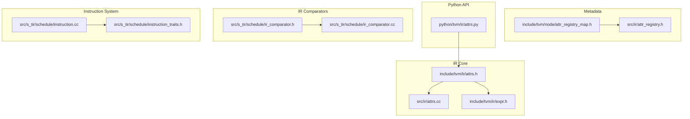
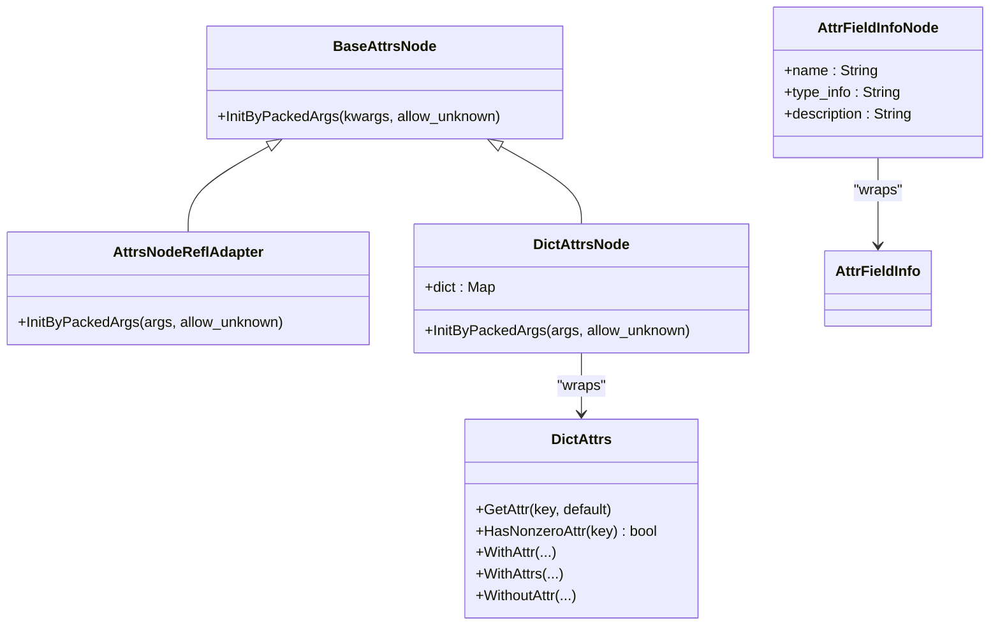
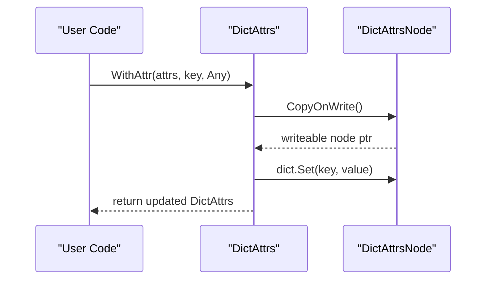
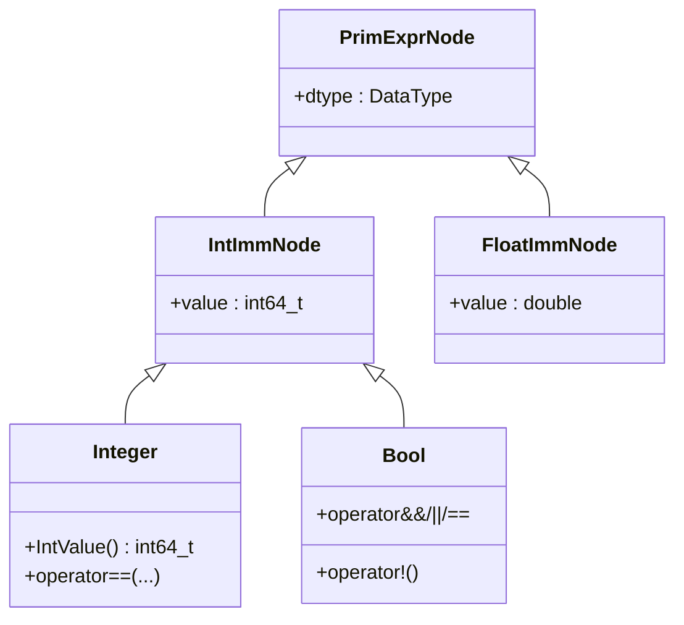
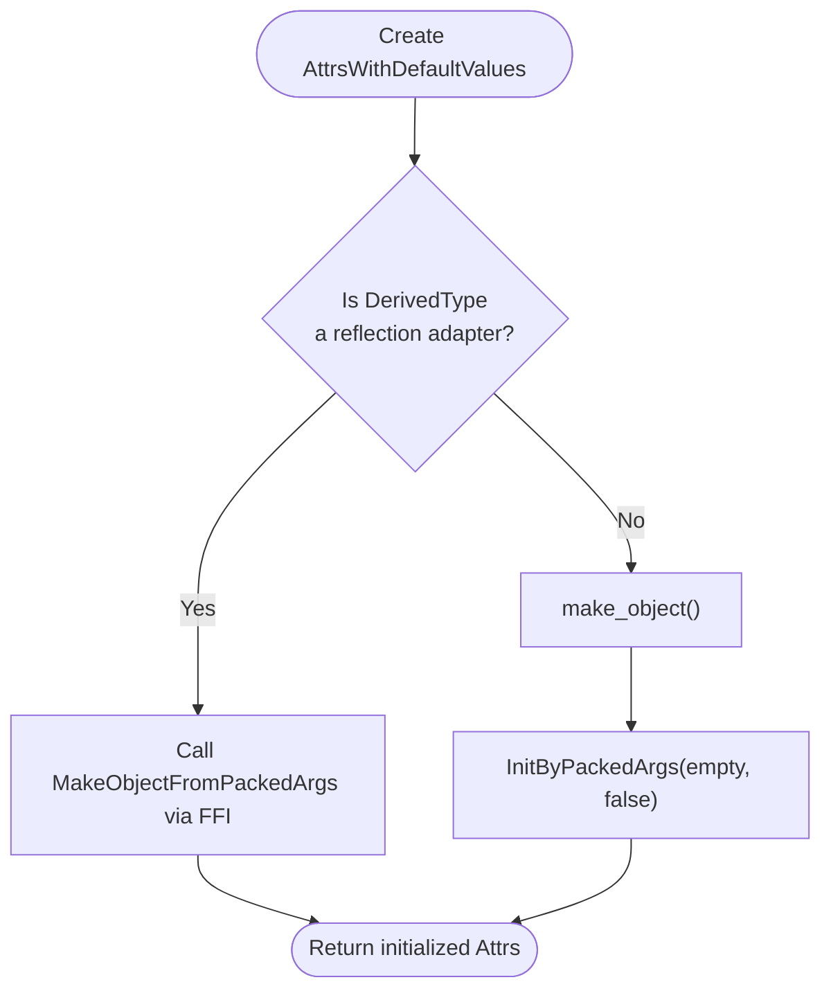
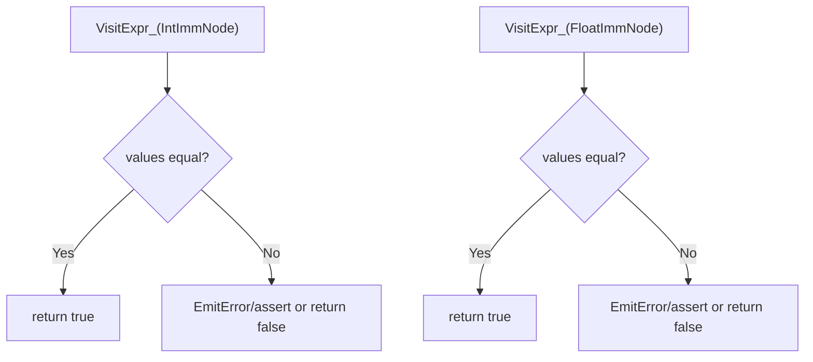
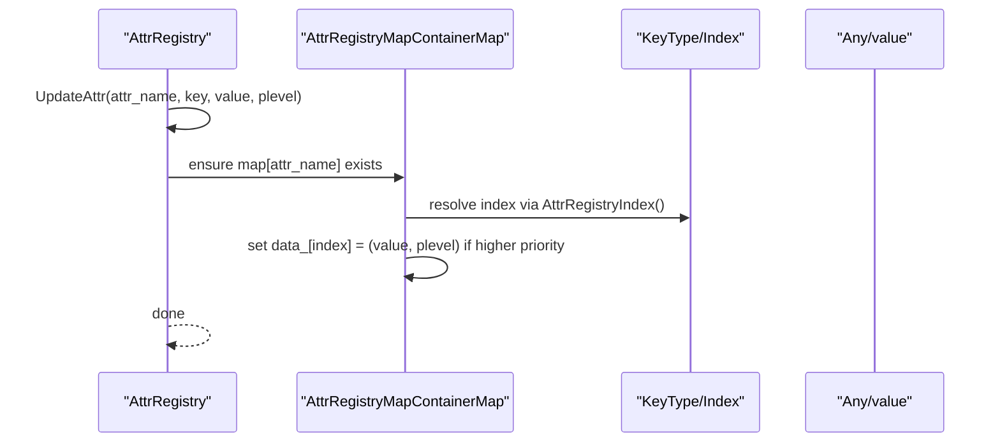
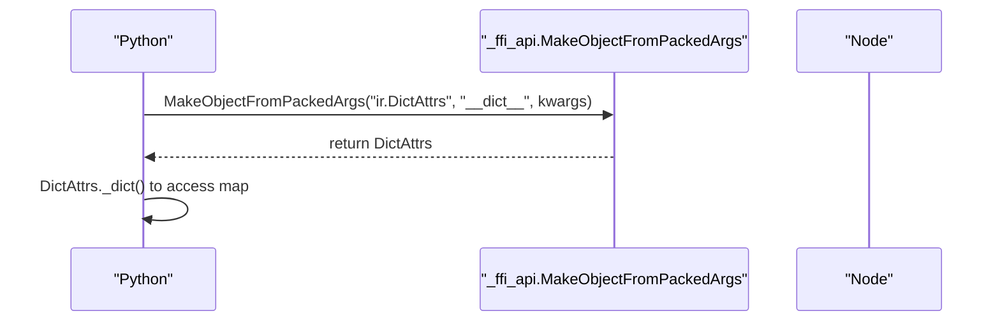
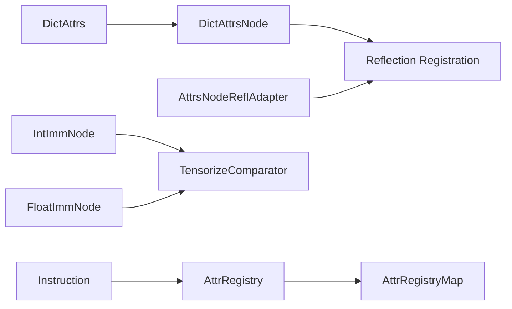

# IR Attributes API

<cite>
**Referenced Files in This Document**
- [attrs.h](file://include/tvm/ir/attrs.h)
- [attrs.cc](file://src/ir/attrs.cc)
- [expr.h](file://include/tvm/ir/expr.h)
- [attr_registry_map.h](file://include/tvm/node/attr_registry_map.h)
- [attr_registry.h](file://src/ir/attr_registry.h)
- [attrs.py](file://python/tvm/ir/attrs.py)
- [ir_comparator.h](file://src/s_tir/schedule/ir_comparator.h)
- [ir_comparator.cc](file://src/s_tir/schedule/ir_comparator.cc)
- [instruction.cc](file://src/s_tir/schedule/instruction.cc)
- [instruction_traits.h](file://src/s_tir/schedule/instruction_traits.h)
- [target_test.cc](file://tests/cpp/target_test.cc)
</cite>

## Table of Contents
1. [Introduction](#introduction)
2. [Project Structure](#project-structure)
3. [Core Components](#core-components)
4. [Architecture Overview](#architecture-overview)
5. [Detailed Component Analysis](#detailed-component-analysis)
6. [Dependency Analysis](#dependency-analysis)
7. [Performance Considerations](#performance-considerations)
8. [Troubleshooting Guide](#troubleshooting-guide)
9. [Conclusion](#conclusion)
10. [Appendices](#appendices)

## Introduction
This document provides comprehensive API documentation for TVM’s IR Attribute system. It focuses on constructing and manipulating attributes for IR nodes, including PrimExprAttr, IntImmAttr, FloatImmAttr, and StringImmAttr. It covers attribute validation, casting, comparison, usage within IR nodes, serialization, and metadata handling. Practical examples illustrate attribute construction, manipulation, and filtering via attributes. Debugging techniques and common attribute patterns are included to help developers integrate attributes effectively across TVM’s IR layers.

## Project Structure
The IR attribute system spans several core areas:
- Attribute containers and helpers in the IR header
- Reflection and initialization mechanisms
- Primitive expression constants (IntImm, FloatImm) and their relationship to attributes
- Registry-backed metadata maps for operator and instruction attributes
- Python bindings for attribute creation and inspection
- Serialization and comparison utilities for IR nodes

**Diagram sources**
- [attrs.h:1-422](file://include/tvm/ir/attrs.h#L1-L422)
- [attrs.cc:1-80](file://src/ir/attrs.cc#L1-L80)
- [expr.h:1-803](file://include/tvm/ir/expr.h#L1-L803)
- [attr_registry_map.h:1-145](file://include/tvm/node/attr_registry_map.h#L1-L145)
- [attr_registry.h:1-173](file://src/ir/attr_registry.h#L1-L173)
- [attrs.py:1-160](file://python/tvm/ir/attrs.py#L1-L160)
- [ir_comparator.h:57-79](file://src/s_tir/schedule/ir_comparator.h#L57-L79)
- [ir_comparator.cc:278-309](file://src/s_tir/schedule/ir_comparator.cc#L278-L309)
- [instruction.cc:37-104](file://src/s_tir/schedule/instruction.cc#L37-L104)
- [instruction_traits.h:376-399](file://src/s_tir/schedule/instruction_traits.h#L376-L399)

**Section sources**
- [attrs.h:1-422](file://include/tvm/ir/attrs.h#L1-L422)
- [attrs.cc:1-80](file://src/ir/attrs.cc#L1-L80)
- [expr.h:1-803](file://include/tvm/ir/expr.h#L1-L803)
- [attr_registry_map.h:1-145](file://include/tvm/node/attr_registry_map.h#L1-L145)
- [attr_registry.h:1-173](file://src/ir/attr_registry.h#L1-L173)
- [attrs.py:1-160](file://python/tvm/ir/attrs.py#L1-L160)
- [ir_comparator.h:57-79](file://src/s_tir/schedule/ir_comparator.h#L57-L79)
- [ir_comparator.cc:278-309](file://src/s_tir/schedule/ir_comparator.cc#L278-L309)
- [instruction.cc:37-104](file://src/s_tir/schedule/instruction.cc#L37-L104)
- [instruction_traits.h:376-399](file://src/s_tir/schedule/instruction_traits.h#L376-L399)

## Core Components
- Attrs and DictAttrs: Managed attribute containers supporting default values, initialization, and mutation via copy-on-write helpers.
- AttrFieldInfo: Metadata describing attribute fields for documentation and reflection.
- BaseAttrsNode and AttrsNodeReflAdapter: Base classes and reflection adapter for attribute initialization and migration.
- Primitive constants (IntImm, FloatImm): IR constants that can be used as attribute values and support comparison and casting.
- AttrRegistry and AttrRegistryMap: Mechanisms for attaching metadata to keyed entries (e.g., operators, instruction kinds).
- Python bindings: Helpers for constructing IR nodes and accessing attributes.

Key APIs and capabilities:
- Attribute construction and initialization
- Attribute casting and retrieval
- Attribute comparison for IR nodes
- Attribute mutation with copy-on-write semantics
- Attribute metadata maps and registry updates

**Section sources**
- [attrs.h:67-160](file://include/tvm/ir/attrs.h#L67-L160)
- [attrs.cc:36-77](file://src/ir/attrs.cc#L36-L77)
- [expr.h:494-558](file://include/tvm/ir/expr.h#L494-L558)
- [attr_registry_map.h:38-141](file://include/tvm/node/attr_registry_map.h#L38-L141)
- [attr_registry.h:44-169](file://src/ir/attr_registry.h#L44-L169)
- [attrs.py:27-160](file://python/tvm/ir/attrs.py#L27-L160)

## Architecture Overview
The attribute system integrates:
- Attribute containers (DictAttrs) for storing arbitrary key-value metadata
- Reflection-based initialization for structured attributes
- Primitive constants (IntImm, FloatImm) as first-class attribute values
- Registry-backed metadata maps for operator/instruction attributes
- Python-side helpers for constructing and inspecting attributes

**Diagram sources**
- [attrs.h:101-160](file://include/tvm/ir/attrs.h#L101-L160)
- [attrs.cc:58-77](file://src/ir/attrs.cc#L58-L77)

**Section sources**
- [attrs.h:101-160](file://include/tvm/ir/attrs.h#L101-L160)
- [attrs.cc:58-77](file://src/ir/attrs.cc#L58-L77)

## Detailed Component Analysis

### Attribute Containers and Mutation
- DictAttrsNode stores attributes as a map and initializes from packed arguments.
- DictAttrs exposes helpers for getting attributes with casting, checking nonzero attributes, and mutating attributes via copy-on-write:
  - WithAttr, WithAttrs, WithoutAttr for single/multiple/none attribute updates
  - GetAttr with default values and casting
  - HasNonzeroAttr for optional flags

**Diagram sources**
- [attrs.h:308-336](file://include/tvm/ir/attrs.h#L308-L336)
- [attrs.cc:48-51](file://src/ir/attrs.cc#L48-L51)

Practical usage patterns:
- Annotating functions or modules with attributes using WithAttr/WithAttrs
- Retrieving typed attributes via GetAttr with defaults
- Checking optional flags via HasNonzeroAttr

**Section sources**
- [attrs.h:195-239](file://include/tvm/ir/attrs.h#L195-L239)
- [attrs.h:308-373](file://include/tvm/ir/attrs.h#L308-L373)
- [attrs.cc:36-56](file://src/ir/attrs.cc#L36-L56)

### Primitive Constants as Attributes (IntImm, FloatImm)
- IntImm and FloatImm are IR constants with numeric values and dtypes.
- They support comparison and can be used as attribute values.
- Integer and Bool wrappers provide convenient conversions and comparisons.

**Diagram sources**
- [expr.h:494-558](file://include/tvm/ir/expr.h#L494-L558)
- [expr.h:601-660](file://include/tvm/ir/expr.h#L601-L660)

Common attribute patterns:
- Using IntImm/FloatImm as attribute values for sizes, strides, or coefficients
- Casting and comparison via Integer and Bool helpers
- Constructing constants from Python via make_node

**Section sources**
- [expr.h:494-558](file://include/tvm/ir/expr.h#L494-L558)
- [expr.h:601-660](file://include/tvm/ir/expr.h#L601-L660)
- [attrs.py:120-160](file://python/tvm/ir/attrs.py#L120-L160)

### Attribute Validation and Initialization
- AttrsNodeReflAdapter enforces the use of reflection-based initialization for derived attribute types.
- AttrsWithDefaultValues creates initialized attribute instances using reflection or packed args depending on the type.

**Diagram sources**
- [attrs.h:384-418](file://include/tvm/ir/attrs.h#L384-L418)

**Section sources**
- [attrs.h:384-418](file://include/tvm/ir/attrs.h#L384-L418)

### Attribute Comparison Operations
- IR comparators compare IntImm and FloatImm nodes by value.
- This ensures attribute-based IR filtering and equivalence checks rely on semantic equality.

**Diagram sources**
- [ir_comparator.h:74-75](file://src/s_tir/schedule/ir_comparator.h#L74-L75)
- [ir_comparator.cc:278-304](file://src/s_tir/schedule/ir_comparator.cc#L278-L304)

**Section sources**
- [ir_comparator.h:74-75](file://src/s_tir/schedule/ir_comparator.h#L74-L75)
- [ir_comparator.cc:278-304](file://src/s_tir/schedule/ir_comparator.cc#L278-L304)

### Attribute Metadata and Registry
- AttrRegistry maintains per-entry attribute maps with priority levels.
- AttrRegistryMap provides safe access with default fallbacks and casting.
- InstructionKind registry demonstrates how instruction attributes are attached and accessed.

**Diagram sources**
- [attr_registry.h:95-116](file://src/ir/attr_registry.h#L95-L116)
- [attr_registry_map.h:58-85](file://include/tvm/node/attr_registry_map.h#L58-L85)

**Section sources**
- [attr_registry.h:95-116](file://src/ir/attr_registry.h#L95-L116)
- [attr_registry_map.h:58-85](file://include/tvm/node/attr_registry_map.h#L58-L85)
- [instruction.cc:47-62](file://src/s_tir/schedule/instruction.cc#L47-L62)
- [instruction_traits.h:376-399](file://src/s_tir/schedule/instruction_traits.h#L376-L399)

### Attribute Serialization and Python Bindings
- Python make_node supports constructing IR nodes by type key and fields, including DictAttrs.
- DictAttrs exposes a getter for the underlying dictionary and Pythonic iteration.

**Diagram sources**
- [attrs.py:120-160](file://python/tvm/ir/attrs.py#L120-L160)
- [attrs.cc:74-77](file://src/ir/attrs.cc#L74-L77)

**Section sources**
- [attrs.py:78-118](file://python/tvm/ir/attrs.py#L78-L118)
- [attrs.py:120-160](file://python/tvm/ir/attrs.py#L120-L160)
- [attrs.cc:74-77](file://src/ir/attrs.cc#L74-L77)

## Dependency Analysis
- DictAttrs depends on reflection registration for DictAttrsNode and DictAttrsGetDict FFI helper.
- AttrsNodeReflAdapter depends on reflection-based initialization via FFI.
- IR comparators depend on IntImmNode and FloatImmNode for value equality.
- Instruction system depends on AttrRegistry for instruction-kind metadata and attributes.

**Diagram sources**
- [attrs.cc:31-34](file://src/ir/attrs.cc#L31-L34)
- [attrs.cc:74-77](file://src/ir/attrs.cc#L74-L77)
- [ir_comparator.h:74-75](file://src/s_tir/schedule/ir_comparator.h#L74-L75)
- [attr_registry.h:95-116](file://src/ir/attr_registry.h#L95-L116)
- [instruction.cc:47-62](file://src/s_tir/schedule/instruction.cc#L47-L62)

**Section sources**
- [attrs.cc:31-34](file://src/ir/attrs.cc#L31-L34)
- [attrs.cc:74-77](file://src/ir/attrs.cc#L74-L77)
- [ir_comparator.h:74-75](file://src/s_tir/schedule/ir_comparator.h#L74-L75)
- [attr_registry.h:95-116](file://src/ir/attr_registry.h#L95-L116)
- [instruction.cc:47-62](file://src/s_tir/schedule/instruction.cc#L47-L62)

## Performance Considerations
- Copy-on-write: WithAttr/WithAttrs/WithoutAttr minimize allocations by sharing immutable state until mutation occurs.
- Reflection-based initialization: Prefer AttrsWithDefaultValues for efficient default construction when using reflection adapters.
- Registry maps: Access via AttrRegistryMap avoids repeated lookups and supports fast key-to-index resolution.

[No sources needed since this section provides general guidance]

## Troubleshooting Guide
Common issues and resolutions:
- Attribute not found: Use GetAttr with a default value or Optional to avoid exceptions.
- Nonzero attribute checks: Use HasNonzeroAttr for optional flags.
- Registry attribute not found: Ensure UpdateAttr was called with the correct attribute name and priority level.
- Instruction attributes parsing: Verify f_attrs_from_json and f_apply_to_schedule are provided for instruction kinds.

**Section sources**
- [attrs.h:195-239](file://include/tvm/ir/attrs.h#L195-L239)
- [attr_registry.h:139-152](file://src/ir/attr_registry.h#L139-L152)
- [instruction.cc:445-460](file://src/s_tir/schedule/instruction.cc#L445-L460)

## Conclusion
TVM’s IR Attribute system provides robust mechanisms for constructing, validating, comparing, and managing attributes across IR nodes. DictAttrs offers flexible metadata storage with copy-on-write mutation, while primitive constants (IntImm, FloatImm) serve as reliable attribute values. Reflection-based initialization and registry-backed metadata maps enable scalable extension and introspection. The provided APIs and patterns support efficient attribute-based IR filtering and transformations.

[No sources needed since this section summarizes without analyzing specific files]

## Appendices

### Practical Examples Index
- Constructing attributes via Python make_node
  - [attrs.py:120-160](file://python/tvm/ir/attrs.py#L120-L160)
- Mutating attributes with copy-on-write
  - [attrs.h:308-373](file://include/tvm/ir/attrs.h#L308-L373)
- Retrieving typed attributes with defaults
  - [attrs.h:195-239](file://include/tvm/ir/attrs.h#L195-L239)
- Checking optional flags
  - [attrs.h:232-234](file://include/tvm/ir/attrs.h#L232-L234)
- Using primitive constants as attributes
  - [expr.h:494-558](file://include/tvm/ir/expr.h#L494-L558)
  - [expr.h:601-660](file://include/tvm/ir/expr.h#L601-L660)
- Attribute comparison for IR nodes
  - [ir_comparator.h:74-75](file://src/s_tir/schedule/ir_comparator.h#L74-L75)
  - [ir_comparator.cc:278-304](file://src/s_tir/schedule/ir_comparator.cc#L278-L304)
- Registry-backed metadata
  - [attr_registry.h:95-116](file://src/ir/attr_registry.h#L95-L116)
  - [attr_registry_map.h:58-85](file://include/tvm/node/attr_registry_map.h#L58-L85)
- Instruction attributes and JSON parsing
  - [instruction.cc:445-460](file://src/s_tir/schedule/instruction.cc#L445-L460)
  - [instruction_traits.h:376-399](file://src/s_tir/schedule/instruction_traits.h#L376-L399)
- Attribute usage in tests (examples of string attributes)
  - [target_test.cc:288-307](file://tests/cpp/target_test.cc#L288-L307)