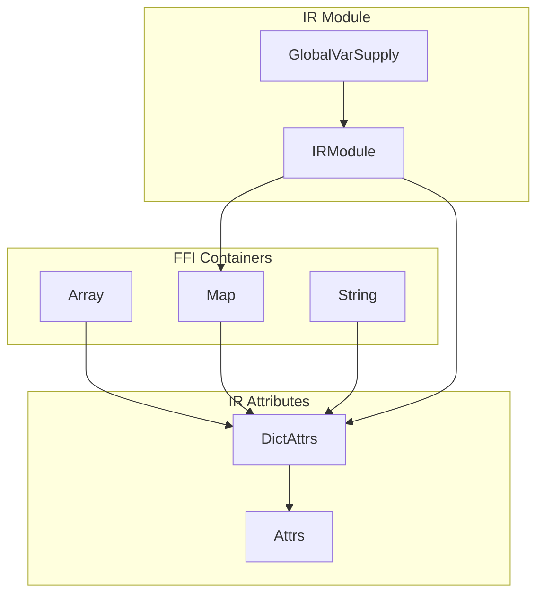
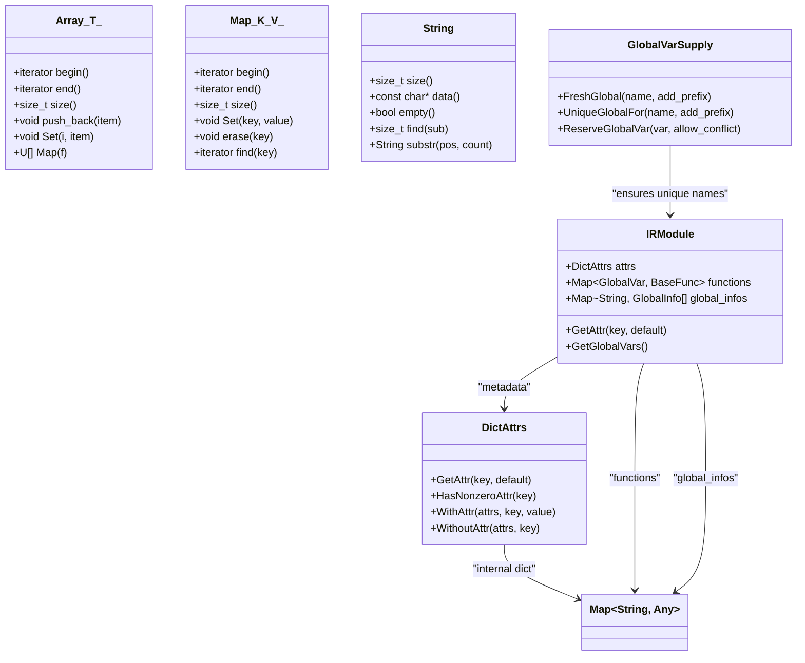
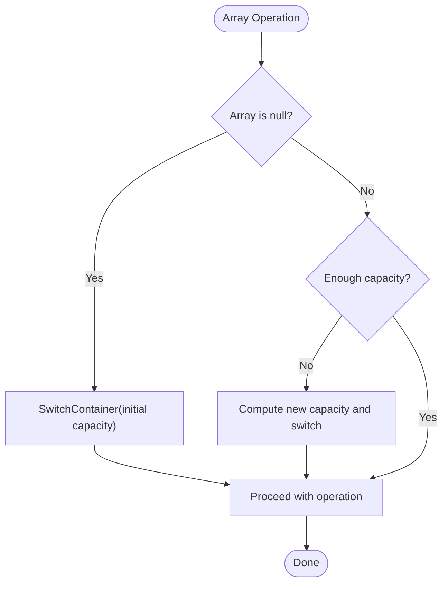
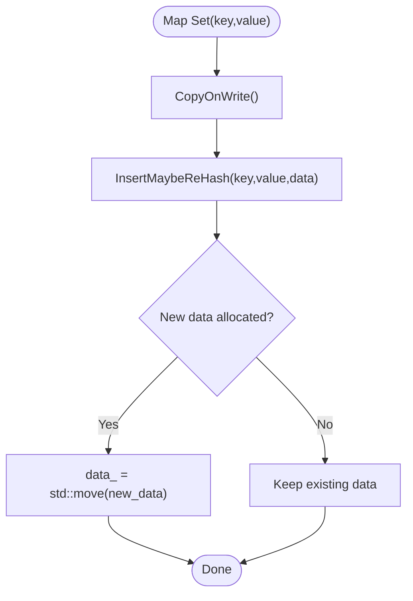
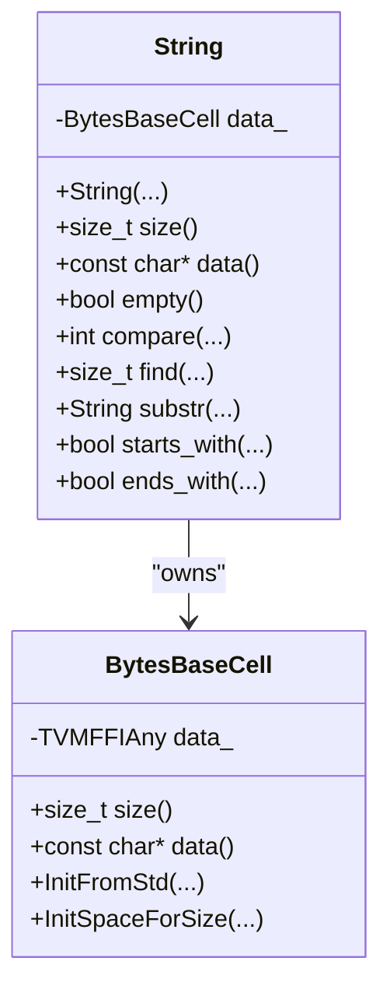
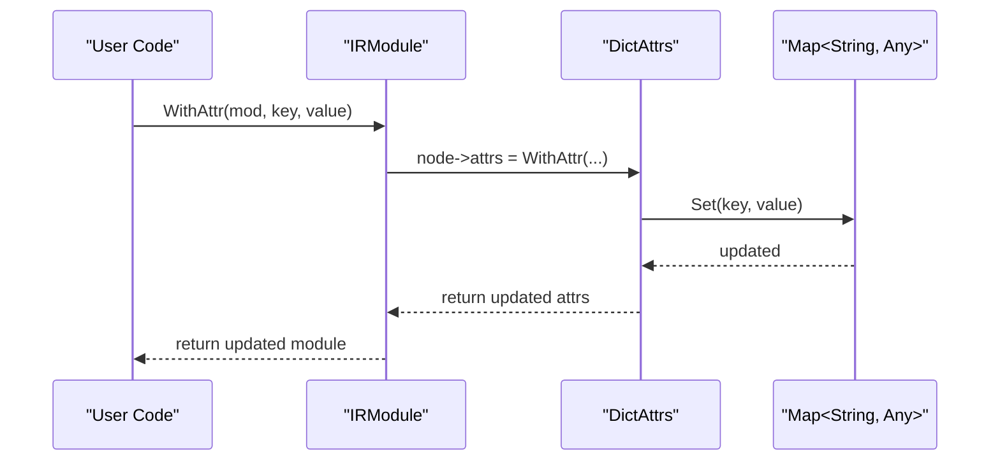
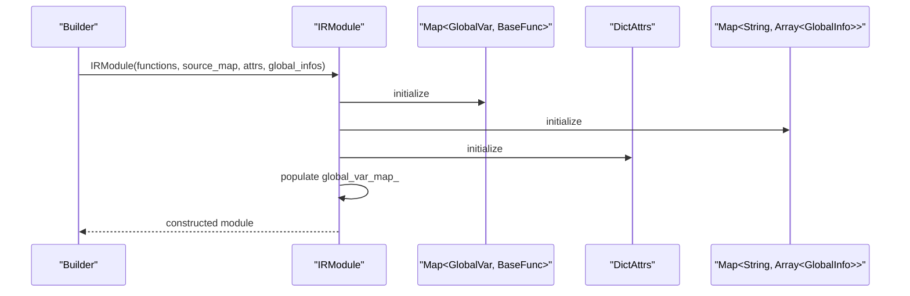
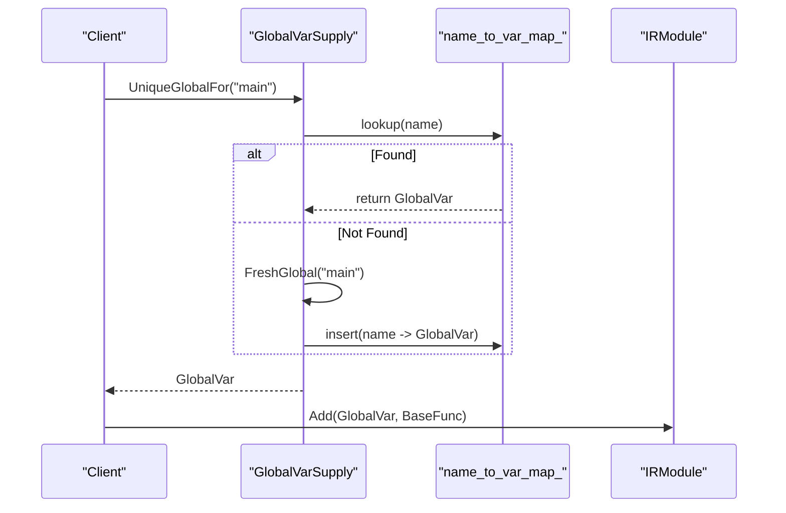
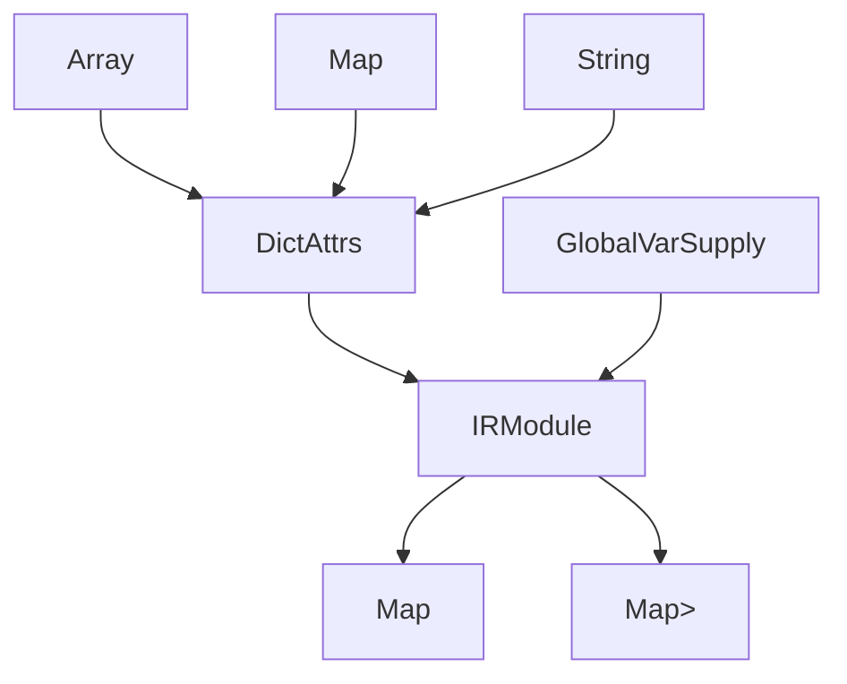

# IR Container API

<cite>
**Referenced Files in This Document**
- [attrs.h](file://include/tvm/ir/attrs.h)
- [attrs.cc](file://src/ir/attrs.cc)
- [container.cc](file://3rdparty/tvm-ffi/src/ffi/container.cc)
- [array.h](file://3rdparty/tvm-ffi/include/tvm/ffi/container/array.h)
- [map.h](file://3rdparty/tvm-ffi/include/tvm/ffi/container/map.h)
- [string.h](file://3rdparty/tvm-ffi/include/tvm/ffi/string.h)
- [module.h](file://include/tvm/ir/module.h)
- [module.cc](file://src/ir/module.cc)
- [global_var_supply.h](file://include/tvm/ir/global_var_supply.h)
</cite>

## Table of Contents
1. [Introduction](#introduction)
2. [Project Structure](#project-structure)
3. [Core Components](#core-components)
4. [Architecture Overview](#architecture-overview)
5. [Detailed Component Analysis](#detailed-component-analysis)
6. [Dependency Analysis](#dependency-analysis)
7. [Performance Considerations](#performance-considerations)
8. [Troubleshooting Guide](#troubleshooting-guide)
9. [Conclusion](#conclusion)
10. [Appendices](#appendices)

## Introduction
This document provides comprehensive API documentation for TVM’s IR Container system with a focus on constructing and manipulating containers used in IR attributes and metadata. It covers:
- Construction of Array, Map, and String containers
- Attribute manipulation via DictAttrs
- Iteration patterns and validation
- Global variable supply mechanisms and symbol management
- IR module metadata and container serialization
- Practical examples, debugging techniques, and performance considerations for large IR structures

## Project Structure
The IR container APIs are implemented across several layers:
- FFI containers (Array, Map, String) in the tvm-ffi library
- IR attribute system (DictAttrs) in the IR layer
- IR module metadata and global info storage
- Global variable supply for unique symbol generation

**Diagram sources**
- [array.h:198-800](file://3rdparty/tvm-ffi/include/tvm/ffi/container/array.h#L198-L800)
- [map.h:54-390](file://3rdparty/tvm-ffi/include/tvm/ffi/container/map.h#L54-L390)
- [string.h:399-800](file://3rdparty/tvm-ffi/include/tvm/ffi/string.h#L399-L800)
- [attrs.h:141-239](file://include/tvm/ir/attrs.h#L141-L239)
- [module.h:58-251](file://include/tvm/ir/module.h#L58-L251)
- [global_var_supply.h:40-123](file://include/tvm/ir/global_var_supply.h#L40-L123)

**Section sources**
- [array.h:198-800](file://3rdparty/tvm-ffi/include/tvm/ffi/container/array.h#L198-L800)
- [map.h:54-390](file://3rdparty/tvm-ffi/include/tvm/ffi/container/map.h#L54-L390)
- [string.h:399-800](file://3rdparty/tvm-ffi/include/tvm/ffi/string.h#L399-L800)
- [attrs.h:141-239](file://include/tvm/ir/attrs.h#L141-L239)
- [module.h:58-251](file://include/tvm/ir/module.h#L58-L251)
- [global_var_supply.h:40-123](file://include/tvm/ir/global_var_supply.h#L40-L123)

## Core Components
- Array<T>: A contiguous sequence container with copy-on-write semantics, supporting iteration, mutation, and efficient resizing.
- Map<K,V>: An immutable map container implementing copy-on-write semantics, with iterator support and safe mutation via CopyOnWrite.
- String: A compact string container with small-string optimization and large-object fallback, enabling efficient metadata storage.
- DictAttrs: A dictionary-backed attribute container used for IR metadata, exposing GetAttr/WithAttr/WithoutAttr helpers.
- IRModule: Holds functions, source maps, attributes, and global info; integrates containers for metadata and global symbol management.
- GlobalVarSupply: Supplies unique GlobalVar instances and manages name-to-symbol caches to prevent conflicts.

**Section sources**
- [array.h:198-800](file://3rdparty/tvm-ffi/include/tvm/ffi/container/array.h#L198-L800)
- [map.h:54-390](file://3rdparty/tvm-ffi/include/tvm/ffi/container/map.h#L54-L390)
- [string.h:399-800](file://3rdparty/tvm-ffi/include/tvm/ffi/string.h#L399-L800)
- [attrs.h:141-239](file://include/tvm/ir/attrs.h#L141-L239)
- [module.h:58-251](file://include/tvm/ir/module.h#L58-L251)
- [global_var_supply.h:40-123](file://include/tvm/ir/global_var_supply.h#L40-L123)

## Architecture Overview
The IR container system is layered:
- Low-level containers (Array, Map, String) provide the foundation for heterogeneous data representation.
- DictAttrs encapsulates attribute dictionaries for IR nodes and modules.
- IRModule aggregates functions, source maps, attributes, and global info using containers.
- GlobalVarSupply ensures unique symbol names across modules.

**Diagram sources**
- [array.h:198-800](file://3rdparty/tvm-ffi/include/tvm/ffi/container/array.h#L198-L800)
- [map.h:54-390](file://3rdparty/tvm-ffi/include/tvm/ffi/container/map.h#L54-L390)
- [string.h:399-800](file://3rdparty/tvm-ffi/include/tvm/ffi/string.h#L399-L800)
- [attrs.h:141-239](file://include/tvm/ir/attrs.h#L141-L239)
- [module.h:58-251](file://include/tvm/ir/module.h#L58-L251)
- [global_var_supply.h:40-123](file://include/tvm/ir/global_var_supply.h#L40-L123)

## Detailed Component Analysis

### Array<T> API
- Construction
  - Default, initializer list, vector, repeated-element constructors.
  - Iterator-based construction from any valid range.
- Access and iteration
  - Const indexing and front/back accessors.
  - Bidirectional iterators for traversal.
- Mutation (copy-on-write)
  - push_back/emplace_back, insert, erase, resize, reserve, clear.
  - CopyOnWrite ensures mutation occurs on a unique copy.
- Transformation
  - Map(f) applies a function to each element and returns a new Array.
  - MutateByApply(f) mutates in place when types permit.

**Diagram sources**
- [array.h:653-721](file://3rdparty/tvm-ffi/include/tvm/ffi/container/array.h#L653-L721)

**Section sources**
- [array.h:198-800](file://3rdparty/tvm-ffi/include/tvm/ffi/container/array.h#L198-L800)

### Map<K,V> API
- Construction
  - Default, initializer list, iterator-based, and unordered_map-based.
- Access and iteration
  - at[], count, find, iterators, Get(key) returning optional.
- Mutation (copy-on-write)
  - Set(key, value) inserts or updates; uses rehashing when needed.
  - erase(key) removes entries.
- Utilities
  - Merge(lhs, rhs) combines two maps.

**Diagram sources**
- [map.h:230-274](file://3rdparty/tvm-ffi/include/tvm/ffi/container/map.h#L230-L274)

**Section sources**
- [map.h:54-390](file://3rdparty/tvm-ffi/include/tvm/ffi/container/map.h#L54-L390)

### String API
- Construction
  - From char*, std::string, TVMFFIByteArray, with small-string optimization.
- Access and inspection
  - data(), size(), empty(), compare, find, substr, starts_with, ends_with.
- Memory model
  - Small string optimization with fallback to heap-allocated object.

**Diagram sources**
- [string.h:399-800](file://3rdparty/tvm-ffi/include/tvm/ffi/string.h#L399-L800)

**Section sources**
- [string.h:399-800](file://3rdparty/tvm-ffi/include/tvm/ffi/string.h#L399-L800)

### DictAttrs and Attribute Manipulation
- DictAttrsNode stores a Map<String, Any> and exposes InitByPackedArgs for construction.
- DictAttrs provides:
  - GetAttr(key, default) with typed retrieval
  - HasNonzeroAttr(key) for integer flags
  - WithAttr, WithAttrs, WithoutAttr for functional updates
- WithAttr/WithAttrs/WithoutAttr are also exposed for IRModule and BaseFunc via templated helpers.

**Diagram sources**
- [attrs.h:251-373](file://include/tvm/ir/attrs.h#L251-L373)
- [attrs.cc:36-56](file://src/ir/attrs.cc#L36-L56)
- [module.cc:302-315](file://src/ir/module.cc#L302-L315)

**Section sources**
- [attrs.h:141-239](file://include/tvm/ir/attrs.h#L141-L239)
- [attrs.cc:36-79](file://src/ir/attrs.cc#L36-L79)
- [module.cc:302-315](file://src/ir/module.cc#L302-L315)

### IRModule Metadata and Serialization
- IRModuleNode fields:
  - functions: Map<GlobalVar, BaseFunc>
  - source_map: SourceMap
  - attrs: DictAttrs
  - global_infos: Map<String, Array<GlobalInfo>>
  - global_var_map_: Map<String, GlobalVar>
- Methods:
  - GetAttr/HasNonzeroAttr delegate to DictAttrs
  - Add/AddUnchecked/Update/Remove manage functions and global var map
  - UpdateGlobalInfo updates global_infos
  - Structural equality/hash registration
- Reflection registration exposes module operations and attribute accessors.

**Diagram sources**
- [module.h:58-251](file://include/tvm/ir/module.h#L58-L251)
- [module.cc:41-58](file://src/ir/module.cc#L41-L58)

**Section sources**
- [module.h:58-251](file://include/tvm/ir/module.h#L58-L251)
- [module.cc:41-58](file://src/ir/module.cc#L41-L58)

### Global Variable Supply and Symbol Management
- GlobalVarSupplyNode:
  - FreshGlobal(name, add_prefix): generates a unique GlobalVar
  - UniqueGlobalFor(name, add_prefix): returns cached or newly created GlobalVar
  - ReserveGlobalVar(var, allow_conflict): registers existing GlobalVar
- GlobalVarSupply:
  - Constructors from NameSupply, Array<IRModule>, or IRModule
  - Integrates with IRModule construction and lookup

**Diagram sources**
- [global_var_supply.h:40-123](file://include/tvm/ir/global_var_supply.h#L40-L123)
- [module.cc:203-228](file://src/ir/module.cc#L203-L228)

**Section sources**
- [global_var_supply.h:40-123](file://include/tvm/ir/global_var_supply.h#L40-L123)
- [module.cc:203-228](file://src/ir/module.cc#L203-L228)

## Dependency Analysis
- Array, Map, String are core FFI containers used by DictAttrs and IRModule.
- DictAttrs depends on Map<String, Any> and Any for heterogeneous values.
- IRModule depends on DictAttrs for metadata, Map<GlobalVar, BaseFunc> for functions, and Map<String, Array<GlobalInfo>> for global info.
- GlobalVarSupply depends on NameSupply and IRModule to avoid conflicts.

**Diagram sources**
- [array.h:198-800](file://3rdparty/tvm-ffi/include/tvm/ffi/container/array.h#L198-L800)
- [map.h:54-390](file://3rdparty/tvm-ffi/include/tvm/ffi/container/map.h#L54-L390)
- [string.h:399-800](file://3rdparty/tvm-ffi/include/tvm/ffi/string.h#L399-L800)
- [attrs.h:141-239](file://include/tvm/ir/attrs.h#L141-L239)
- [module.h:58-251](file://include/tvm/ir/module.h#L58-L251)
- [global_var_supply.h:40-123](file://include/tvm/ir/global_var_supply.h#L40-L123)

**Section sources**
- [attrs.h:141-239](file://include/tvm/ir/attrs.h#L141-L239)
- [module.h:58-251](file://include/tvm/ir/module.h#L58-L251)
- [global_var_supply.h:40-123](file://include/tvm/ir/global_var_supply.h#L40-L123)

## Performance Considerations
- Copy-on-write semantics
  - Array<T> and Map<K,V> minimize unnecessary copies by duplicating only when mutation requires exclusive access.
  - Prefer functional updates (WithAttr/WithAttrs/WithoutAttr) to leverage copy-on-write optimizations.
- Capacity growth
  - Array<T> grows by a multiplicative factor; pre-reserve when building large arrays to reduce reallocations.
- Hash maps
  - Map<K,V> may rehash on insert; batch Set operations or construct from initializer lists for bulk loads.
- String storage
  - String uses small-string optimization; large strings are heap-allocated objects. Avoid frequent conversions between std::string and String for hot paths.
- IRModule operations
  - Use shallow copies and functional updates to avoid deep cloning during transformations.
- Serialization
  - Reflection-based registration supports efficient serialization of containers and objects.

[No sources needed since this section provides general guidance]

## Troubleshooting Guide
- Indexing and iteration
  - Null containers throw IndexError when indexed; ensure containers are initialized before access.
  - Iterators are invalidated after mutations; reacquire iterators after CopyOnWrite operations.
- Attribute access
  - DictAttrs::GetAttr returns default if key absent; use HasNonzeroAttr for integer flags.
  - WithAttr/WithAttrs/WithoutAttr perform copy-on-write; ensure inputs are moved to avoid extra copies.
- IRModule lookup
  - Use GetGlobalVar/ContainGlobalVar to validate names; missing names raise ValueError with candidate suggestions.
- Global symbol conflicts
  - Use GlobalVarSupply.UniqueGlobalFor to ensure unique names; avoid manual duplication of GlobalVar names.

**Section sources**
- [array.h:379-418](file://3rdparty/tvm-ffi/include/tvm/ffi/container/array.h#L379-L418)
- [map.h:197-251](file://3rdparty/tvm-ffi/include/tvm/ffi/container/map.h#L197-L251)
- [attrs.h:195-239](file://include/tvm/ir/attrs.h#L195-L239)
- [module.cc:117-134](file://src/ir/module.cc#L117-L134)
- [global_var_supply.h:61-77](file://include/tvm/ir/global_var_supply.h#L61-L77)

## Conclusion
TVM’s IR Container system provides robust, efficient, and ergonomic APIs for building and manipulating IR metadata and structures. By leveraging copy-on-write semantics, heterogeneous containers, and reflection-based serialization, developers can compose complex IR modules with confidence. Use DictAttrs for metadata, Array/Map/String for heterogeneous data, and GlobalVarSupply for unique symbol management to ensure correctness and performance at scale.

[No sources needed since this section summarizes without analyzing specific files]

## Appendices

### Practical Examples (by reference)
- Constructing Array and Map
  - [Array<T> constructors and iterators:227-370](file://3rdparty/tvm-ffi/include/tvm/ffi/container/array.h#L227-L370)
  - [Map<K,V> constructors and iterators:80-241](file://3rdparty/tvm-ffi/include/tvm/ffi/container/map.h#L80-L241)
- Attribute manipulation
  - [DictAttrs GetAttr/WithAttr/WithoutAttr:195-279](file://include/tvm/ir/attrs.h#L195-L279)
  - [IRModule attribute helpers:302-315](file://src/ir/module.cc#L302-L315)
- Metadata extraction
  - [IRModule GetAttr/GetAttrs:93-109](file://include/tvm/ir/module.h#L93-L109)
- Symbol management
  - [GlobalVarSupply UniqueGlobalFor/FreshGlobal:70-61](file://include/tvm/ir/global_var_supply.h#L70-L61)
- Container serialization
  - [FFI container registration:61-194](file://3rdparty/tvm-ffi/src/ffi/container.cc#L61-L194)

[No sources needed since this section lists references without analyzing specific files]