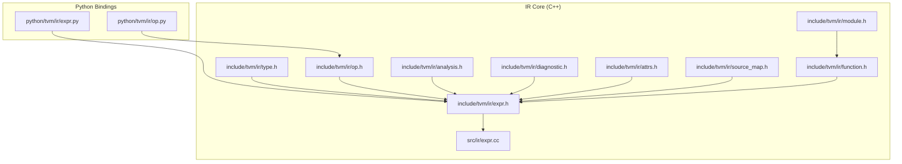
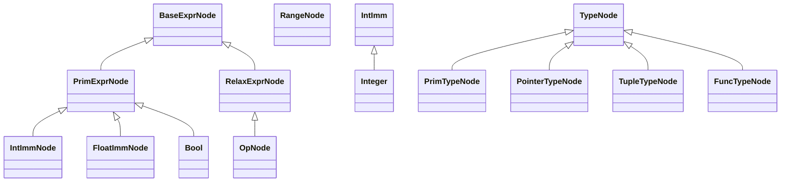
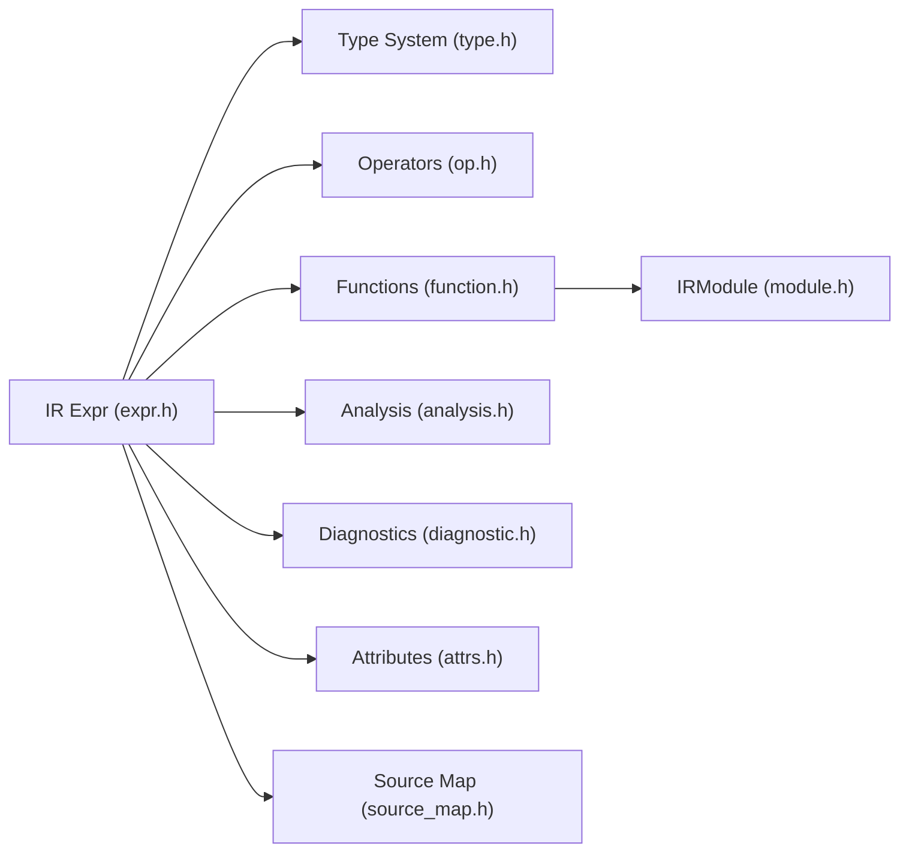

# IR Expressions API

<cite>
**Referenced Files in This Document**
- [expr.h](file://include/tvm/ir/expr.h)
- [op.h](file://include/tvm/ir/op.h)
- [type.h](file://include/tvm/ir/type.h)
- [expr.cc](file://src/ir/expr.cc)
- [function.h](file://include/tvm/ir/function.h)
- [module.h](file://include/tvm/ir/module.h)
- [analysis.h](file://include/tvm/ir/analysis.h)
- [diagnostic.h](file://include/tvm/ir/diagnostic.h)
- [attrs.h](file://include/tvm/ir/attrs.h)
- [source_map.h](file://include/tvm/ir/source_map.h)
- [expr.py](file://python/tvm/ir/expr.py)
- [op.py](file://python/tvm/ir/op.py)
</cite>

## Table of Contents
1. [Introduction](#introduction)
2. [Project Structure](#project-structure)
3. [Core Components](#core-components)
4. [Architecture Overview](#architecture-overview)
5. [Detailed Component Analysis](#detailed-component-analysis)
6. [Dependency Analysis](#dependency-analysis)
7. [Performance Considerations](#performance-considerations)
8. [Troubleshooting Guide](#troubleshooting-guide)
9. [Conclusion](#conclusion)

## Introduction
This document provides comprehensive API documentation for TVM’s IR Expression system. It focuses on constructing and manipulating expressions across arithmetic, logical, comparison, bitwise, type conversion, casting, data movement, function calls, memory operations, and variable binding. It also covers expression simplification, analysis, validation, type checking, and debugging techniques for expression-level IR operations.

## Project Structure
The IR Expression system spans header-only definitions in the C++ include tree and runtime implementations in source files. Python bindings expose convenient APIs for building and inspecting expressions.

**Diagram sources**
- [expr.h:42-120](file://include/tvm/ir/expr.h#L42-L120)
- [op.h:47-125](file://include/tvm/ir/op.h#L47-L125)
- [type.h:74-140](file://include/tvm/ir/type.h#L74-L140)
- [expr.cc:36-86](file://src/ir/expr.cc#L36-L86)
- [function.h:139-226](file://include/tvm/ir/function.h#L139-L226)
- [module.h:58-151](file://include/tvm/ir/module.h#L58-L151)
- [analysis.h](file://include/tvm/ir/analysis.h)
- [diagnostic.h](file://include/tvm/ir/diagnostic.h)
- [attrs.h](file://include/tvm/ir/attrs.h)
- [source_map.h](file://include/tvm/ir/source_map.h)
- [expr.py](file://python/tvm/ir/expr.py)
- [op.py](file://python/tvm/ir/op.py)

**Section sources**
- [expr.h:42-120](file://include/tvm/ir/expr.h#L42-L120)
- [op.h:47-125](file://include/tvm/ir/op.h#L47-L125)
- [type.h:74-140](file://include/tvm/ir/type.h#L74-L140)
- [expr.cc:36-86](file://src/ir/expr.cc#L36-L86)
- [function.h:139-226](file://include/tvm/ir/function.h#L139-L226)
- [module.h:58-151](file://include/tvm/ir/module.h#L58-L151)

## Core Components
- Base expression hierarchy: BaseExprNode, PrimExprNode, RelaxExprNode
- Primitive constants: IntImm, FloatImm, Bool, Integer
- Range containers for indexing
- Operators and Call expressions for function invocation
- Types and type relations for validation
- Modules and functions for scoping and attributes

Key capabilities:
- Arithmetic/logical/comparison/bitwise operators on PrimExpr
- Automatic conversions from scalars and strings to expressions
- Operator registration and metadata for intrinsics
- Type system bridging between runtime dtype and structured Type
- Debug spans and diagnostics

**Section sources**
- [expr.h:48-120](file://include/tvm/ir/expr.h#L48-L120)
- [expr.h:494-558](file://include/tvm/ir/expr.h#L494-L558)
- [expr.h:566-591](file://include/tvm/ir/expr.h#L566-L591)
- [expr.h:662-712](file://include/tvm/ir/expr.h#L662-L712)
- [op.h:59-125](file://include/tvm/ir/op.h#L59-L125)
- [type.h:74-140](file://include/tvm/ir/type.h#L74-L140)

## Architecture Overview
The IR expression system centers around a typed node hierarchy with reflection and structural equality/hash support. Operators are represented as Op instances and invoked via Call expressions. Type checking and validation leverage runtime dtype for primitives and structured Type for tensors/functions.

**Diagram sources**
- [expr.h:51-120](file://include/tvm/ir/expr.h#L51-L120)
- [expr.h:494-558](file://include/tvm/ir/expr.h#L494-L558)
- [expr.h:566-591](file://include/tvm/ir/expr.h#L566-L591)
- [expr.h:662-712](file://include/tvm/ir/expr.h#L662-L712)
- [op.h:59-125](file://include/tvm/ir/op.h#L59-L125)
- [type.h:74-140](file://include/tvm/ir/type.h#L74-L140)
- [type.h:112-186](file://include/tvm/ir/type.h#L112-L186)
- [type.h:192-228](file://include/tvm/ir/type.h#L192-L228)
- [type.h:252-285](file://include/tvm/ir/type.h#L252-L285)

## Detailed Component Analysis

### Arithmetic Operations (Add, Sub, Mul, Div)
- Operators are defined for PrimExpr and perform eager constant folding for index types when possible.
- Construction uses operator overloads and automatic conversion traits.

Practical usage patterns:
- Combine constants and variables to form index expressions.
- Leverage constant folding to simplify known subexpressions.

Validation:
- Runtime dtype is checked during construction of constants; arithmetic preserves dtype semantics.

**Section sources**
- [expr.h:196-247](file://include/tvm/ir/expr.h#L196-L247)
- [expr.cc:53-79](file://src/ir/expr.cc#L53-L79)

### Logical Operations (And, Or, Not)
- Logical &&, ||, and unary ! are supported on PrimExpr and perform eager constant folding.

Validation:
- Boolean context enforced via Bool wrapper and automatic conversions.

**Section sources**
- [expr.h:338-364](file://include/tvm/ir/expr.h#L338-L364)
- [expr.h:566-591](file://include/tvm/ir/expr.h#L566-L591)

### Comparison Operations (EQ, NE, LT, GT, LE, GE)
- Comparison operators return PrimExpr and participate in constant folding for index types.

Validation:
- Dtype compatibility is ensured by operator semantics and constant construction checks.

**Section sources**
- [expr.h:272-335](file://include/tvm/ir/expr.h#L272-L335)

### Bitwise Operations (And, Or, Xor, Negation, Shifts)
- Bitwise &, |, ^, ~ and shifts <<, >> are defined for PrimExpr with eager constant folding for index types.

Validation:
- Unsigned and signed bounds enforced during IntImm construction.

**Section sources**
- [expr.h:367-407](file://include/tvm/ir/expr.h#L367-L407)
- [expr.cc:53-79](file://src/ir/expr.cc#L53-L79)

### Type Conversion and Cast Operations
- Type conversion is performed via explicit casts and constants. FloatImm enforces floating-point range constraints per dtype.
- Integer constants enforce signedness and bit-width constraints.

Workflow:
- Build constants with appropriate dtype, then cast to desired target dtype when needed.

**Section sources**
- [expr.cc:88-183](file://src/ir/expr.cc#L88-L183)

### Data Movement Expressions
- Range represents a 1D range with min and extent; convenience constructors support begin/end or min/extent forms.
- Span is attached to expressions for debugging and diagnostics.

Usage:
- Indexing and bounds computation commonly use Range and PrimExpr arithmetic.

**Section sources**
- [expr.h:662-712](file://include/tvm/ir/expr.h#L662-L712)
- [expr.cc:192-210](file://src/ir/expr.cc#L192-L210)

### Call Expressions for Function Invocations
- Op represents primitive operators/intrinsics with metadata (name, description, arguments, attrs).
- Call invokes an Op with arguments; operators are registered and retrieved by name.

Registration and retrieval:
- Use OpRegEntry to describe operators, add arguments, and set attributes.
- Retrieve via Op::Get and use in Call expressions.

**Section sources**
- [op.h:59-125](file://include/tvm/ir/op.h#L59-L125)
- [op.h:171-266](file://include/tvm/ir/op.h#L171-L266)
- [op.h:319-383](file://include/tvm/ir/op.h#L319-L383)

### BufferLoad/BufferStore for Memory Operations
- BufferLoad and BufferStore are used in TIR-like contexts to represent memory reads/writes.
- They operate over buffers with index expressions and are manipulated by schedulers and transformations.

Typical usage:
- Build BufferLoad with a buffer and index expressions.
- Replace or rewrite BufferStore/BufferLoad pairs during optimization passes.

**Section sources**
- [expr.h:494-558](file://include/tvm/ir/expr.h#L494-L558)
- [expr.h:566-591](file://include/tvm/ir/expr.h#L566-L591)

### Let Expressions for Variable Binding
- Let binds a variable to a value within a scope; used to introduce scoped aliases for complex expressions.
- Useful for readability and simplification.

Note: The Let construct is part of higher-level dialects; consult dialect-specific headers for exact APIs.

[No sources needed since this subsection describes a concept without analyzing specific files]

### Practical Examples for Building Complex Expressions
- Construct constants with IntImm/FloatImm and compose with arithmetic/logical operators.
- Build ranges for indexing and combine with comparisons.
- Compose Call expressions using Op instances for intrinsics.

[No sources needed since this subsection provides general guidance]

### Expression Simplification and Analysis Workflows
- Structural equality and hashing are supported for IR nodes.
- Reflection enables introspection and pretty-printing.
- Analysis utilities provide traversal and transformation hooks.

**Section sources**
- [expr.h:59-70](file://include/tvm/ir/expr.h#L59-L70)
- [expr.h:111-114](file://include/tvm/ir/expr.h#L111-L114)
- [analysis.h](file://include/tvm/ir/analysis.h)

### Validation, Type Checking, and Debugging Techniques
- Type checking leverages runtime::DataType for primitives and structured Type for tensors/functions.
- Diagnostics attach Span to nodes for source-mapped errors.
- Attributes and metadata support operator behavior customization.

**Section sources**
- [type.h:31-47](file://include/tvm/ir/type.h#L31-L47)
- [diagnostic.h](file://include/tvm/ir/diagnostic.h)
- [attrs.h](file://include/tvm/ir/attrs.h)
- [source_map.h](file://include/tvm/ir/source_map.h)

## Dependency Analysis
The IR expression system integrates tightly with types, functions, modules, and analysis utilities. Operators depend on structured metadata, while expressions rely on type and diagnostic infrastructure.

**Diagram sources**
- [expr.h:42-120](file://include/tvm/ir/expr.h#L42-L120)
- [type.h:74-140](file://include/tvm/ir/type.h#L74-L140)
- [op.h:47-125](file://include/tvm/ir/op.h#L47-L125)
- [function.h:139-226](file://include/tvm/ir/function.h#L139-L226)
- [module.h:58-151](file://include/tvm/ir/module.h#L58-L151)
- [analysis.h](file://include/tvm/ir/analysis.h)
- [diagnostic.h](file://include/tvm/ir/diagnostic.h)
- [attrs.h](file://include/tvm/ir/attrs.h)
- [source_map.h](file://include/tvm/ir/source_map.h)

**Section sources**
- [expr.h:42-120](file://include/tvm/ir/expr.h#L42-L120)
- [type.h:74-140](file://include/tvm/ir/type.h#L74-L140)
- [op.h:47-125](file://include/tvm/ir/op.h#L47-L125)
- [function.h:139-226](file://include/tvm/ir/function.h#L139-L226)
- [module.h:58-151](file://include/tvm/ir/module.h#L58-L151)

## Performance Considerations
- Eager constant folding reduces redundant computations for index types in arithmetic, logical, comparison, and bitwise operations.
- Prefer constructing constants with minimal bit-widths when possible to reduce downstream type inference overhead.
- Use structural equality and hashing judiciously in large expression graphs to avoid expensive recomputation.

[No sources needed since this section provides general guidance]

## Troubleshooting Guide
Common issues and remedies:
- Invalid literal ranges for IntImm/FloatImm cause validation errors during construction. Ensure values fit the target dtype.
- Mismatched dtypes in arithmetic/logical operations should be resolved by explicit casts or compatible construction.
- Use spans to locate problematic nodes in diagnostics.
- For operator-related failures, verify Op registration and argument counts.

**Section sources**
- [expr.cc:53-79](file://src/ir/expr.cc#L53-L79)
- [expr.cc:88-183](file://src/ir/expr.cc#L88-L183)
- [diagnostic.h](file://include/tvm/ir/diagnostic.h)
- [source_map.h](file://include/tvm/ir/source_map.h)

## Conclusion
TVM’s IR Expression system provides a robust, typed foundation for building, validating, and transforming expressions across arithmetic, logic, comparisons, bitwise operations, type conversions, memory operations, and function calls. With operator metadata, structured types, and diagnostics, developers can construct complex IR while maintaining correctness and debuggability.