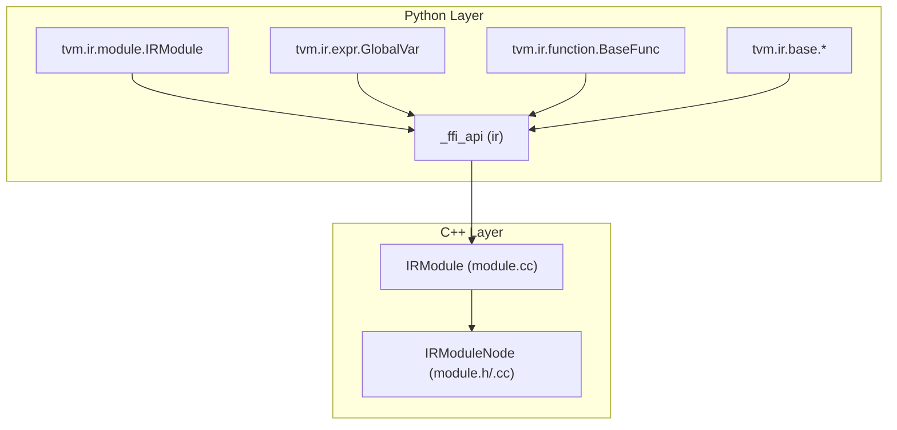
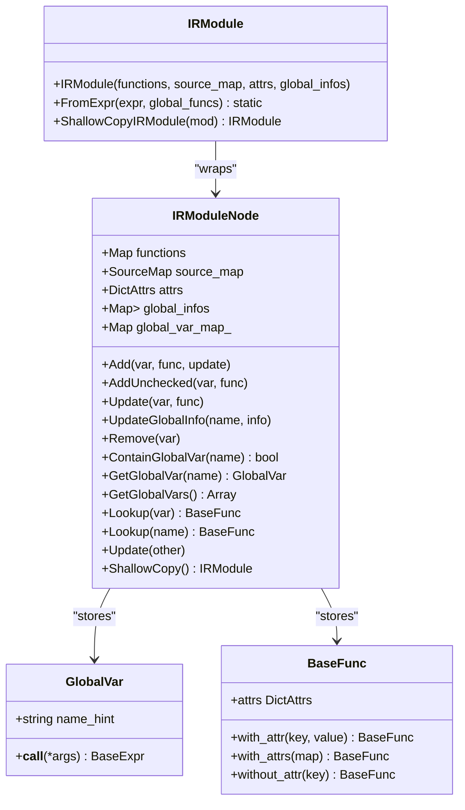
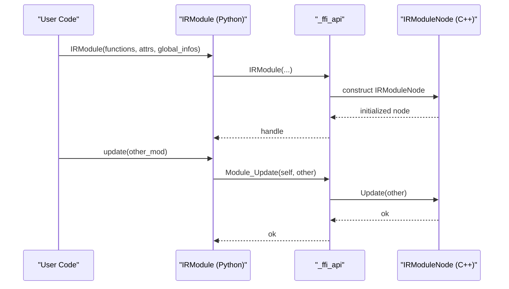
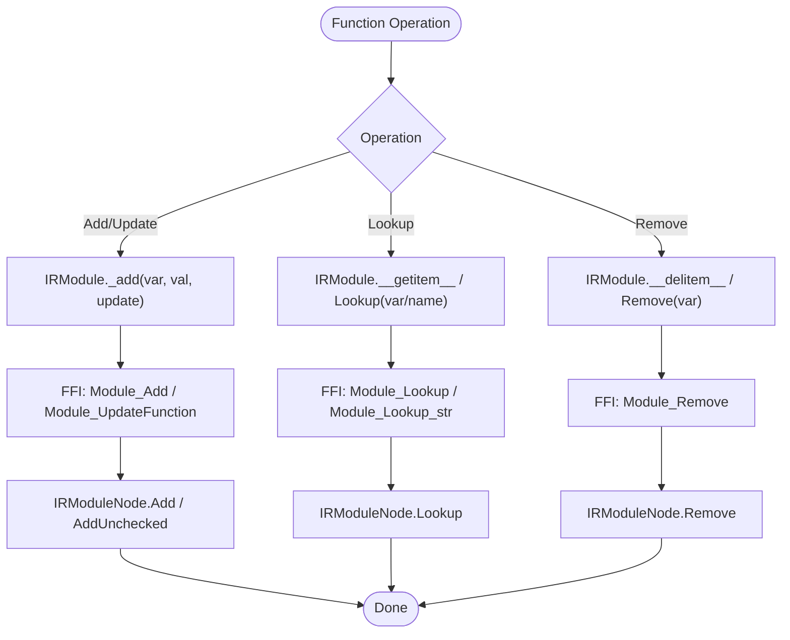
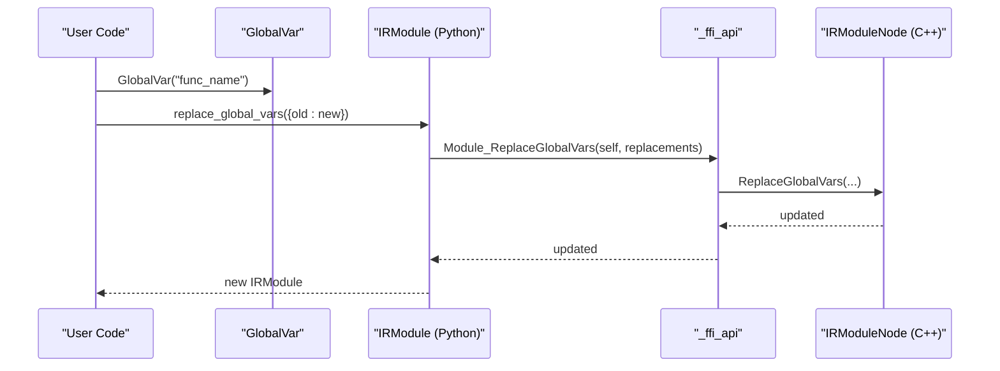
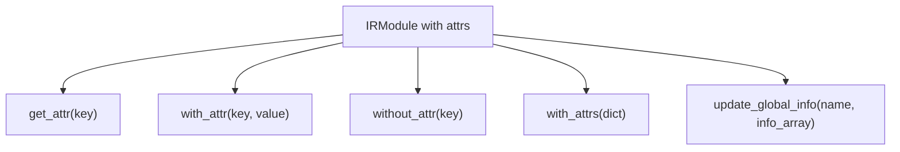
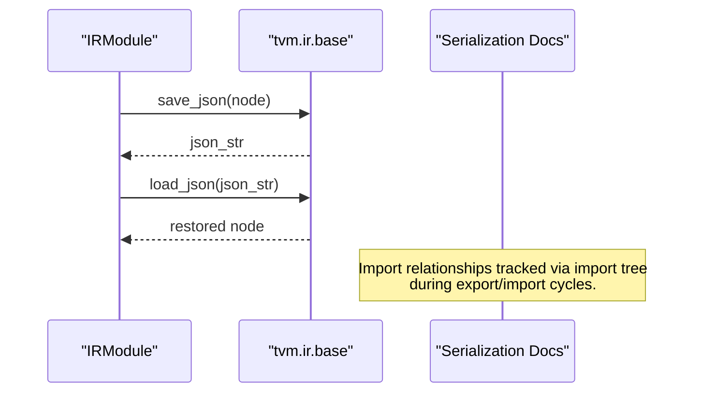
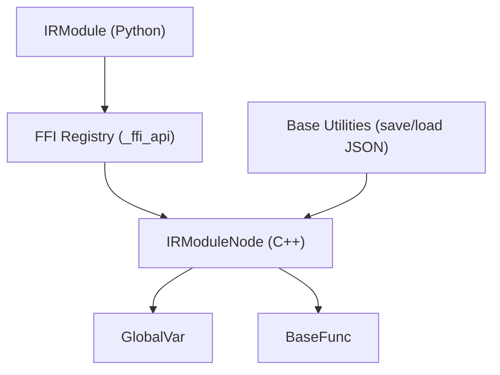

# IR Module API

<cite>
**Referenced Files in This Document**
- [module.py](file://python/tvm/ir/module.py)
- [module.cc](file://src/ir/module.cc)
- [module.h](file://include/tvm/ir/module.h)
- [expr.py](file://python/tvm/ir/expr.py)
- [function.py](file://python/tvm/ir/function.py)
- [base.py](file://python/tvm/ir/base.py)
- [_ffi_api.py](file://python/tvm/ir/_ffi_api.py)
- [ir.rst](file://docs/reference/api/python/ir.rst)
- [introduction_to_module_serialization.rst](file://docs/arch/introduction_to_module_serialization.rst)
- [index.rst](file://docs/arch/index.rst)
</cite>

## Table of Contents
1. [Introduction](#introduction)
2. [Project Structure](#project-structure)
3. [Core Components](#core-components)
4. [Architecture Overview](#architecture-overview)
5. [Detailed Component Analysis](#detailed-component-analysis)
6. [Dependency Analysis](#dependency-analysis)
7. [Performance Considerations](#performance-considerations)
8. [Troubleshooting Guide](#troubleshooting-guide)
9. [Conclusion](#conclusion)
10. [Appendices](#appendices)

## Introduction
This document provides comprehensive API documentation for TVM’s IR Module system. It focuses on IRModule construction, function definition and registration, symbol management, module manipulation, and serialization. It explains how to build modules from scratch, import existing functions, compose modules, and manage attributes and global information. Practical examples are provided via code snippet paths to guide developers in constructing, transforming, and validating IR modules.

## Project Structure
The IR Module system spans both Python and C++ layers:
- Python API surface exposes IRModule and related helpers for user-friendly construction and manipulation.
- C++ implementation defines the core IRModuleNode and FFI reflection for module operations.
- Supporting modules include expression types (GlobalVar), function types (BaseFunc), and base utilities (structural equality, JSON serialization).

**Diagram sources**
- [module.py:31-32](file://python/tvm/ir/module.py#L31-L32)
- [expr.py:65-82](file://python/tvm/ir/expr.py#L65-L82)
- [function.py:40-42](file://python/tvm/ir/function.py#L40-L42)
- [base.py:27-37](file://python/tvm/ir/base.py#L27-L37)
- [module.h:58-251](file://include/tvm/ir/module.h#L58-L251)
- [module.cc:41-58](file://src/ir/module.cc#L41-L58)

**Section sources**
- [module.py:31-32](file://python/tvm/ir/module.py#L31-L32)
- [module.h:58-251](file://include/tvm/ir/module.h#L58-L251)
- [module.cc:41-58](file://src/ir/module.cc#L41-L58)

## Core Components
- IRModule (Python): High-level interface for module construction, function insertion/update/removal, attribute management, and symbol lookup.
- IRModuleNode (C++): Core implementation of module operations, structural equality/hash, and FFI registration.
- GlobalVar (Python/C++): Symbolic reference to global functions/types stored in IRModule.
- BaseFunc (Python/C++): Base class for function types (Relax/TIR) with attribute management.
- Base utilities: Structural equality/hash, JSON serialization, and source map support.

Key capabilities:
- Construct modules from scratch or from expressions.
- Import and merge functions from other modules.
- Manage module attributes and global info arrays.
- Replace/rename GlobalVar references safely.
- Serialize/deserialize modules and track import relationships.

**Section sources**
- [module.py:43-67](file://python/tvm/ir/module.py#L43-L67)
- [module.h:58-251](file://include/tvm/ir/module.h#L58-L251)
- [module.cc:147-164](file://src/ir/module.cc#L147-L164)
- [expr.py:65-82](file://python/tvm/ir/expr.py#L65-L82)
- [function.py:40-42](file://python/tvm/ir/function.py#L40-L42)
- [base.py:129-161](file://python/tvm/ir/base.py#L129-L161)

## Architecture Overview
The IR Module architecture integrates Python convenience with C++ performance and reflection. Python wrappers delegate to FFI functions registered in C++, which operate on IRModuleNode internals.

**Diagram sources**
- [module.h:58-251](file://include/tvm/ir/module.h#L58-L251)
- [module.cc:147-164](file://src/ir/module.cc#L147-L164)
- [expr.py:65-109](file://python/tvm/ir/expr.py#L65-L109)
- [function.py:40-109](file://python/tvm/ir/function.py#L40-L109)

## Detailed Component Analysis

### IRModule Construction and Manipulation
- Construction from scratch:
  - Accepts a dict-like mapping of GlobalVar to BaseFunc, optional attributes, and global info map.
  - Converts string keys to GlobalVar and validates uniqueness.
- From expression:
  - Builds a module with a main entry point derived from a RelaxExpr, optionally using a supplied global function map.
- Update and merge:
  - Merge another module’s functions into the current module.
  - Update a single function by GlobalVar.
- Attribute management:
  - Get/set/remove attributes and attribute maps.
- Global info management:
  - Update arrays of GlobalInfo entries keyed by string.

**Diagram sources**
- [module.py:43-67](file://python/tvm/ir/module.py#L43-L67)
- [module.cc:192-197](file://src/ir/module.cc#L192-L197)
- [_ffi_api.py:21-22](file://python/tvm/ir/_ffi_api.py#L21-L22)

**Section sources**
- [module.py:43-67](file://python/tvm/ir/module.py#L43-L67)
- [module.py:130-142](file://python/tvm/ir/module.py#L130-L142)
- [module.py:143-156](file://python/tvm/ir/module.py#L143-L156)
- [module.py:157-168](file://python/tvm/ir/module.py#L157-L168)
- [module.py:227-247](file://python/tvm/ir/module.py#L227-L247)

### Function Definition and Registration
- Insert/update/remove functions:
  - Add or update a function with a GlobalVar key.
  - Remove by GlobalVar or string name.
- Lookup by name or GlobalVar:
  - Retrieve a function by its unique identifier.
- Attribute management on functions:
  - Copy-on-write attribute updates for BaseFunc.

**Diagram sources**
- [module.py:84-129](file://python/tvm/ir/module.py#L84-L129)
- [module.py:143-156](file://python/tvm/ir/module.py#L143-L156)
- [module.cc:147-197](file://src/ir/module.cc#L147-L197)
- [_ffi_api.py:21-22](file://python/tvm/ir/_ffi_api.py#L21-L22)

**Section sources**
- [module.py:84-129](file://python/tvm/ir/module.py#L84-L129)
- [module.py:143-156](file://python/tvm/ir/module.py#L143-L156)
- [module.cc:147-197](file://src/ir/module.cc#L147-L197)

### Symbol Management and GlobalVar Replacement
- GlobalVar creation and calling:
  - GlobalVar stores a name hint and supports function-style calling with arguments.
- Safe replacement:
  - Replace or rename GlobalVar references across the module to maintain internal consistency.

**Diagram sources**
- [expr.py:65-109](file://python/tvm/ir/expr.py#L65-L109)
- [module.py:199-224](file://python/tvm/ir/module.py#L199-L224)
- [module.cc:147-164](file://src/ir/module.cc#L147-L164)

**Section sources**
- [expr.py:65-109](file://python/tvm/ir/expr.py#L65-L109)
- [module.py:199-224](file://python/tvm/ir/module.py#L199-L224)

### Module Attributes and Global Info
- Attributes:
  - Get/set/remove single attributes and bulk attribute maps.
- Global info:
  - Update arrays of GlobalInfo entries keyed by string identifiers.

**Diagram sources**
- [module.py:248-312](file://python/tvm/ir/module.py#L248-L312)
- [module.h:93-131](file://include/tvm/ir/module.h#L93-L131)
- [module.cc:170-172](file://src/ir/module.cc#L170-L172)

**Section sources**
- [module.py:248-312](file://python/tvm/ir/module.py#L248-L312)
- [module.h:93-131](file://include/tvm/ir/module.h#L93-L131)
- [module.cc:170-172](file://src/ir/module.cc#L170-L172)

### Serialization and Import Tracking
- JSON serialization:
  - Save and load TVM objects (including IRModule) to/from JSON strings.
- Module serialization and import tree:
  - Modules can be serialized with import relationships tracked using an import tree (CSR-like structure) for restoration.

**Diagram sources**
- [base.py:147-161](file://python/tvm/ir/base.py#L147-L161)
- [introduction_to_module_serialization.rst:61-106](file://docs/arch/introduction_to_module_serialization.rst#L61-L106)

**Section sources**
- [base.py:147-161](file://python/tvm/ir/base.py#L147-L161)
- [introduction_to_module_serialization.rst:61-106](file://docs/arch/introduction_to_module_serialization.rst#L61-L106)

### Practical Examples (via code paths)
- Build an IR module from scratch:
  - [module.py:43-67](file://python/tvm/ir/module.py#L43-L67)
- Import and merge modules:
  - [module.py:130-142](file://python/tvm/ir/module.py#L130-L142)
- Update a function by GlobalVar:
  - [module.py:143-156](file://python/tvm/ir/module.py#L143-L156)
- Manage attributes and global info:
  - [module.py:248-312](file://python/tvm/ir/module.py#L248-L312)
- Construct module from expression:
  - [module.py:227-247](file://python/tvm/ir/module.py#L227-L247)
- Replace GlobalVar references:
  - [module.py:199-224](file://python/tvm/ir/module.py#L199-L224)

**Section sources**
- [module.py:43-67](file://python/tvm/ir/module.py#L43-L67)
- [module.py:130-142](file://python/tvm/ir/module.py#L130-L142)
- [module.py:143-156](file://python/tvm/ir/module.py#L143-L156)
- [module.py:227-247](file://python/tvm/ir/module.py#L227-L247)
- [module.py:248-312](file://python/tvm/ir/module.py#L248-L312)
- [module.py:199-224](file://python/tvm/ir/module.py#L199-L224)

## Dependency Analysis
- Python IRModule depends on FFI functions registered in C++.
- FFI functions delegate to IRModuleNode methods for core operations.
- GlobalVar and BaseFunc are tightly coupled with IRModule for symbol/function resolution.
- Structural equality and hashing are defined at the IRModuleNode level and exposed via base utilities.

**Diagram sources**
- [module.py:31-32](file://python/tvm/ir/module.py#L31-L32)
- [_ffi_api.py:21-22](file://python/tvm/ir/_ffi_api.py#L21-L22)
- [module.h:58-251](file://include/tvm/ir/module.h#L58-L251)
- [base.py:147-161](file://python/tvm/ir/base.py#L147-L161)

**Section sources**
- [module.py:31-32](file://python/tvm/ir/module.py#L31-L32)
- [_ffi_api.py:21-22](file://python/tvm/ir/_ffi_api.py#L21-L22)
- [module.h:58-251](file://include/tvm/ir/module.h#L58-L251)
- [base.py:147-161](file://python/tvm/ir/base.py#L147-L161)

## Performance Considerations
- Structural equality and hashing:
  - IRModuleNode computes hashes and equality considering attributes, global_infos, and functions, with deterministic ordering to ensure consistent results.
- Copy-on-write semantics:
  - Operations like cloning and attribute updates leverage copy-on-write to minimize unnecessary allocations.
- GlobalVar uniqueness:
  - Maintains a map from name to GlobalVar to prevent duplicates and enable fast lookup.

[No sources needed since this section provides general guidance]

## Troubleshooting Guide
- Duplicate global function name:
  - Attempting to add a function with a conflicting GlobalVar name triggers an error; ensure unique names or use GlobalVarSupply to generate fresh names.
- Missing GlobalVar:
  - Looking up a non-existent GlobalVar raises an error with candidate suggestions; verify the var name or retrieve via GetGlobalVar.
- Attribute access:
  - Use get_attr/with_attr/without_attr to manage module attributes safely; invalid types will raise errors.
- Structural validation:
  - Use structural_equal/assert_structural_equal to compare modules and debug differences.

**Section sources**
- [module.cc:52-55](file://src/ir/module.cc#L52-L55)
- [module.cc:117-134](file://src/ir/module.cc#L117-L134)
- [module.py:248-312](file://python/tvm/ir/module.py#L248-L312)
- [base.py:163-268](file://python/tvm/ir/base.py#L163-L268)

## Conclusion
The IR Module system provides a robust foundation for building, composing, and transforming TVM IR across Relax and TIR variants. Its Python-facing API simplifies common tasks like module construction, function insertion, and attribute management, while the underlying C++ implementation ensures correctness, performance, and extensibility. By leveraging GlobalVar for symbol management and BaseFunc for function attributes, developers can construct complex module compositions and reliably serialize/deserialize them for deployment.

[No sources needed since this section summarizes without analyzing specific files]

## Appendices

### API Reference Index
- IRModule Python API: [module.py:31-312](file://python/tvm/ir/module.py#L31-L312)
- IRModuleNode C++ API: [module.h:58-251](file://include/tvm/ir/module.h#L58-L251)
- IRModule C++ implementation: [module.cc:41-319](file://src/ir/module.cc#L41-L319)
- GlobalVar: [expr.py:65-109](file://python/tvm/ir/expr.py#L65-L109)
- BaseFunc: [function.py:40-109](file://python/tvm/ir/function.py#L40-L109)
- Base utilities (JSON, structural equality): [base.py:129-310](file://python/tvm/ir/base.py#L129-L310)
- IR API documentation index: [ir.rst:18-30](file://docs/reference/api/python/ir.rst#L18-L30)
- Module serialization overview: [introduction_to_module_serialization.rst:61-106](file://docs/arch/introduction_to_module_serialization.rst#L61-L106)
- IR stack overview: [index.rst:54-68](file://docs/arch/index.rst#L54-L68)