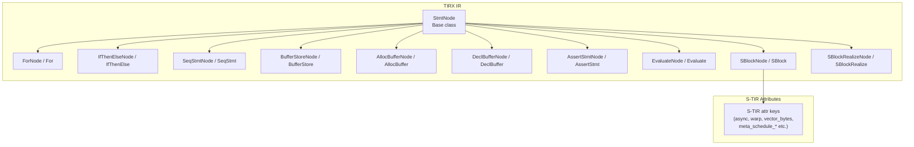
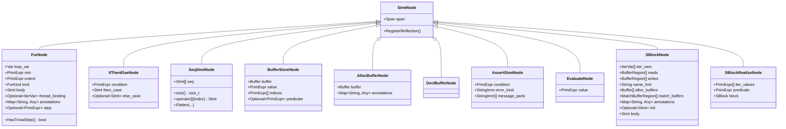
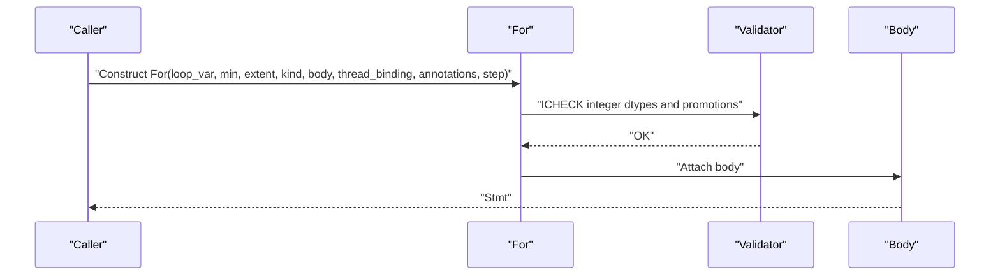
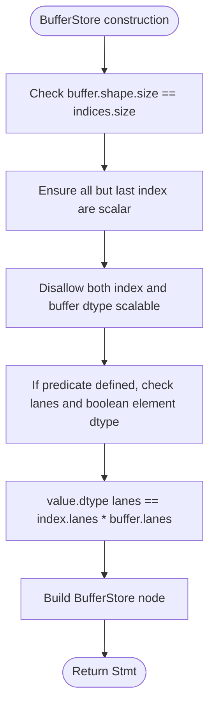
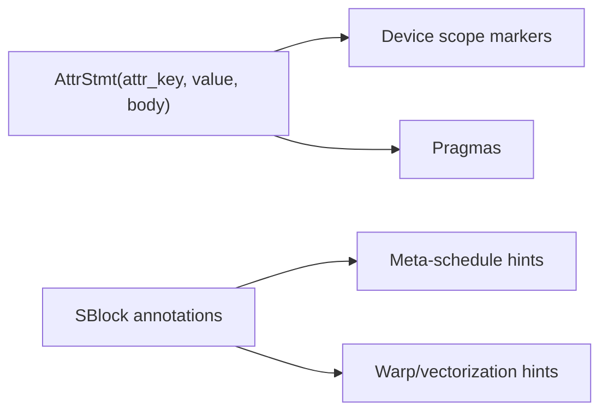
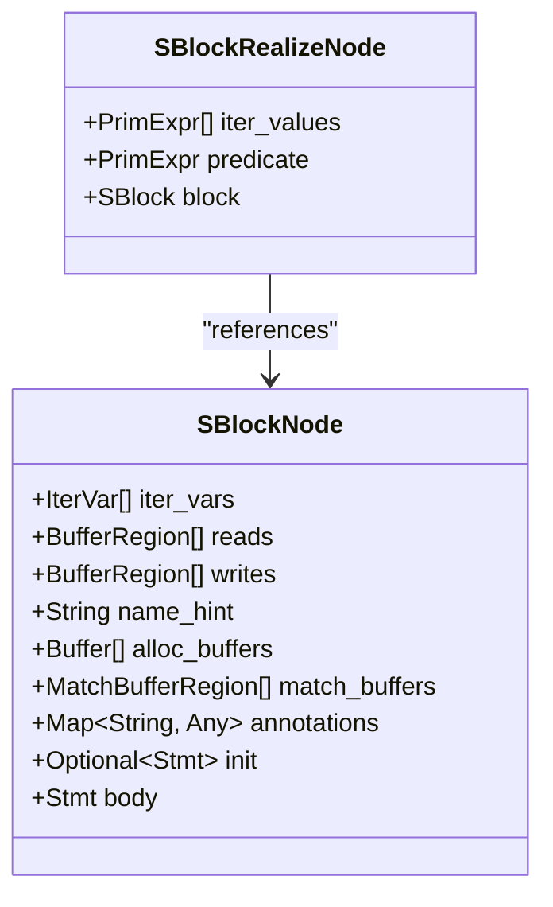
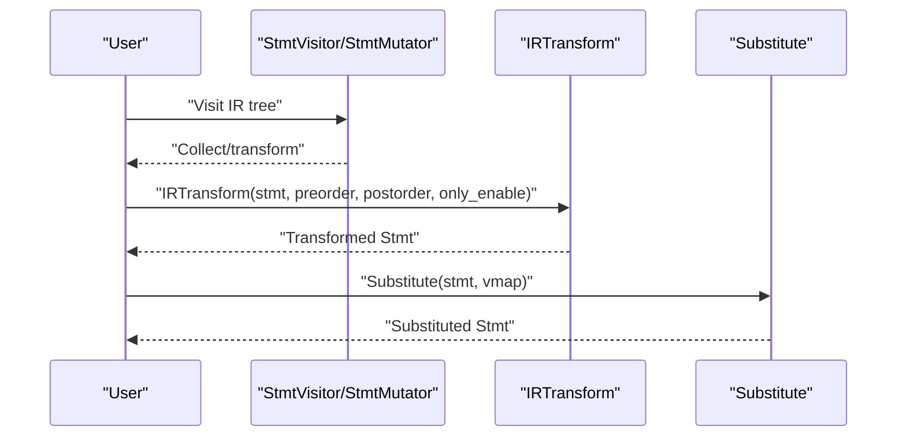
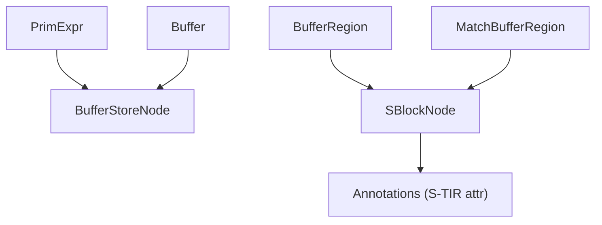

# IR Statements API

<cite>
**Referenced Files in This Document**
- [stmt.h](file://include/tvm/tirx/stmt.h)
- [stmt.cc](file://src/tirx/ir/stmt.cc)
- [stmt_functor.h](file://include/tvm/tirx/stmt_functor.h)
- [stmt_functor.cc](file://src/tirx/ir/stmt_functor.cc)
- [stmt.h](file://include/tvm/s_tir/stmt.h)
- [stmt.h](file://include/tvm/tirx/expr.h)
- [stmt.h](file://include/tvm/tirx/function.h)
</cite>

## Table of Contents
1. [Introduction](#introduction)
2. [Project Structure](#project-structure)
3. [Core Components](#core-components)
4. [Architecture Overview](#architecture-overview)
5. [Detailed Component Analysis](#detailed-component-analysis)
6. [Dependency Analysis](#dependency-analysis)
7. [Performance Considerations](#performance-considerations)
8. [Troubleshooting Guide](#troubleshooting-guide)
9. [Conclusion](#conclusion)

## Introduction
This document describes TVM’s IR Statement system for Tensor IR (TIR) and Structured TIR (S-TIR). It focuses on statement construction for control flow (For, IfThenElse, SeqStmt), memory management (Allocate, Free via buffer allocation), and computational operations (Evaluate, Assert). It also covers buffer allocation statements, store operations, device scope statements, loop nest construction, parallel loop annotations, and thread binding specifications. Practical examples show how to build statement sequences, construct complex control flow graphs, and perform statement transformations. Finally, it documents statement validation, well-formedness checks, and debugging techniques for statement-level IR operations.

## Project Structure
The IR Statement system is primarily defined in the TIR/TIRX layer and augmented by S-TIR annotations for scheduling. The core files include:
- Statement definitions and constructors for TIR/S-TIR statements
- Statement visitors and mutators for traversal and transformation
- Attribute keys for device scopes, pragmas, and scheduling hints

**Diagram sources**
- [stmt.h:39-981](file://include/tvm/tirx/stmt.h#L39-L981)
- [stmt.h:30-244](file://include/tvm/s_tir/stmt.h#L30-L244)

**Section sources**
- [stmt.h:39-981](file://include/tvm/tirx/stmt.h#L39-L981)
- [stmt.h:30-244](file://include/tvm/s_tir/stmt.h#L30-L244)

## Core Components
This section summarizes the primary statement kinds and their roles in IR construction and transformation.

- Control flow
  - For: Loop with kind (serial, parallel, vectorized, unrolled, thread binding), optional step, annotations, and optional thread binding.
  - IfThenElse: Conditional with optional else branch.
  - SeqStmt: Flat sequence of statements with flattening helpers.
- Memory and buffers
  - AllocBuffer: Allocates and declares a buffer in-scope with optional annotations.
  - DeclBuffer: Declares an existing buffer in-scope.
  - BufferStore: Stores a value to a buffer at indices, with optional predicate and lane checks.
  - BufferRegion and MatchBufferRegion: Express buffer region access and layout/data-type compatibility constraints.
- Computational and side effects
  - Evaluate: Expression evaluation for side-effect-free calls.
  - AssertStmt: Assertion with error kind and message parts.
- Structured blocks (S-Blocks)
  - SBlock: Basic scheduling unit with iter vars, reads/writes regions, optional init, allocations, matches, and annotations.
  - SBlockRealize: Realization of a block at specific iter values with a predicate.

Validation and reflection registration are provided for all statement nodes, enabling consistent printing and equality hashing.

**Section sources**
- [stmt.h:586-981](file://include/tvm/tirx/stmt.h#L586-L981)
- [stmt.cc:35-613](file://src/tirx/ir/stmt.cc#L35-L613)

## Architecture Overview
The statement system is object-oriented with a base node type and concrete statement subclasses. Visitors and mutators traverse and transform IR trees. S-TIR adds scheduling annotations and attributes that influence lowering and code generation.

**Diagram sources**
- [stmt.h:39-981](file://include/tvm/tirx/stmt.h#L39-L981)

## Detailed Component Analysis

### Control Flow Statements
- For
  - Construction validates integer dtypes and promotes constants to match loop variable width.
  - Supports trivial step detection and optional step field.
  - Thread binding and annotations are optional; annotations can carry scheduling hints.
- IfThenElse
  - Condition must be a scalar predicate; else branch is optional.
- SeqStmt
  - Enforces non-empty and non-length-one sequences; provides Flatten(...) to normalize nested sequences and remove no-op Evaluate(0).

**Diagram sources**
- [stmt.cc:129-186](file://src/tirx/ir/stmt.cc#L129-L186)

**Section sources**
- [stmt.h:586-649](file://include/tvm/tirx/stmt.h#L586-L649)
- [stmt.cc:129-186](file://src/tirx/ir/stmt.cc#L129-L186)

### Memory Management and Buffer Allocation
- AllocBuffer
  - Allocates a buffer and declares it in-scope; exposes ConstantAllocationSize() for constant-sized buffers.
- DeclBuffer
  - Declares an existing buffer in-scope without allocation.
- BufferStore
  - Validates dimensionality, lane/scalable vector compatibility, and predicate dtype/lane requirements.
  - Ensures value dtype matches combined index and buffer lanes.

**Diagram sources**
- [stmt.cc:347-420](file://src/tirx/ir/stmt.cc#L347-L420)

**Section sources**
- [stmt.h:259-305](file://include/tvm/tirx/stmt.h#L259-L305)
- [stmt.cc:257-272](file://src/tirx/ir/stmt.cc#L257-L272)
- [stmt.h:238-256](file://include/tvm/tirx/stmt.h#L238-L256)
- [stmt.cc:243-254](file://src/tirx/ir/stmt.cc#L243-L254)
- [stmt.cc:347-420](file://src/tirx/ir/stmt.cc#L347-L420)

### Device Scope and Attributes
- AttrStmt and attr namespace
  - Used to mark device scopes, compute scopes, extern scopes, storage alignment, thread extents, and pragmas.
  - Pragmas include auto-unroll, import C/LLVM, and Tensor Core hints.
- S-TIR attributes
  - Provide scheduling annotations such as meta_schedule_parallel, meta_schedule_vectorize, meta_schedule_unroll_*,
  - Warp execution, vector_bytes, layout transforms, axis separators, and more.

**Diagram sources**
- [stmt.h:900-948](file://include/tvm/tirx/stmt.h#L900-L948)
- [stmt.h:30-244](file://include/tvm/s_tir/stmt.h#L30-L244)

**Section sources**
- [stmt.h:900-948](file://include/tvm/tirx/stmt.h#L900-L948)
- [stmt.h:30-244](file://include/tvm/s_tir/stmt.h#L30-L244)

### Computational Operations
- Evaluate
  - Wraps an expression for side-effect evaluation; used to embed calls in statement context.
- AssertStmt
  - Validates boolean condition and constructs error-kind/message parts; useful for runtime checks.

**Section sources**
- [stmt.h:336-360](file://include/tvm/tirx/stmt.h#L336-L360)
- [stmt.cc:104-126](file://src/tirx/ir/stmt.cc#L104-L126)
- [stmt.h:159-189](file://include/tvm/tirx/stmt.h#L159-L189)
- [stmt.cc:104-126](file://src/tirx/ir/stmt.cc#L104-L126)

### Structured Blocks (S-Blocks)
- SBlock
  - Encapsulates scheduling units with iter vars, read/write regions, optional init, allocations, matches, and annotations.
- SBlockRealize
  - Realizes a block at specific iter values with a predicate.

**Diagram sources**
- [stmt.h:799-897](file://include/tvm/tirx/stmt.h#L799-L897)

**Section sources**
- [stmt.h:799-897](file://include/tvm/tirx/stmt.h#L799-L897)

### Statement Transformation Workflows
- Visitors and Mutators
  - StmtVisitor/StmtMutator traverse statements and buffers, visiting expressions and buffer shapes/strides at definition sites.
  - StmtExprVisitor/StmtExprMutator combine statement and expression traversal/mutation.
- IRTransform
  - Performs post-order traversal with optional pre/post hooks and selective type filtering.
- Substitute/SubstituteWithDataTypeLegalization
  - Variable substitution with optional data type legalization; supports maps and lambdas.

**Diagram sources**
- [stmt_functor.h:133-340](file://include/tvm/tirx/stmt_functor.h#L133-L340)
- [stmt_functor.cc:542-632](file://src/tirx/ir/stmt_functor.cc#L542-L632)
- [stmt_functor.h:357-383](file://include/tvm/tirx/stmt_functor.h#L357-L383)
- [stmt_functor.cc:634-697](file://src/tirx/ir/stmt_functor.cc#L634-L697)

**Section sources**
- [stmt_functor.h:133-340](file://include/tvm/tirx/stmt_functor.h#L133-L340)
- [stmt_functor.cc:542-632](file://src/tirx/ir/stmt_functor.cc#L542-L632)
- [stmt_functor.h:357-383](file://include/tvm/tirx/stmt_functor.h#L357-L383)
- [stmt_functor.cc:634-697](file://src/tirx/ir/stmt_functor.cc#L634-L697)

### Practical Examples and Patterns
- Building statement sequences
  - Use SeqStmt::Flatten to merge nested sequences and remove no-op Evaluate(0).
- Constructing complex control flow graphs
  - Nest For/IfThenElse/SeqStmt to encode loop nests, conditional branches, and compound bodies.
- Statement transformation workflows
  - Use StmtExprMutator to mutate expressions within statements, then rebuild statements with updated buffer definitions or expressions.
- Device scope and pragmas
  - Wrap device-specific code with AttrStmt using device_scope/device_id/device_type or extern_scope keys.
- Loop nest construction and annotations
  - For loops with annotations and thread_binding fields; S-TIR meta_schedule_* attributes guide auto-scheduling.

Note: This section provides conceptual guidance. Refer to the “Section sources” for precise APIs and validation logic.

[No sources needed since this section provides conceptual guidance]

## Dependency Analysis
- Statement nodes depend on PrimExpr and Buffer types for indices and data.
- SBlock depends on BufferRegion and MatchBufferRegion for access-region and layout constraints.
- S-TIR attributes augment scheduling decisions and lowering behavior.

**Diagram sources**
- [stmt.h:201-235](file://include/tvm/tirx/stmt.h#L201-L235)
- [stmt.h:692-737](file://include/tvm/tirx/stmt.h#L692-L737)
- [stmt.h:748-776](file://include/tvm/tirx/stmt.h#L748-L776)
- [stmt.h:30-244](file://include/tvm/s_tir/stmt.h#L30-L244)

**Section sources**
- [stmt.h:201-235](file://include/tvm/tirx/stmt.h#L201-L235)
- [stmt.h:692-737](file://include/tvm/tirx/stmt.h#L692-L737)
- [stmt.h:748-776](file://include/tvm/tirx/stmt.h#L748-L776)
- [stmt.h:30-244](file://include/tvm/s_tir/stmt.h#L30-L244)

## Performance Considerations
- Prefer flattening sequences with SeqStmt::Flatten to avoid deeply nested structures.
- Use S-TIR annotations to guide vectorization and parallelization early, reducing downstream transformations.
- Avoid unnecessary buffer copies by leveraging MatchBufferRegion and buffer sharing where semantics permit.
- Keep loop steps trivial when possible to enable vectorization and simplifications.

[No sources needed since this section provides general guidance]

## Troubleshooting Guide
- Validation failures
  - For: integer dtype mismatches, step promotion, and trivial step checks.
  - BufferStore: dimension mismatch, lane/scalable vector constraints, predicate dtype/lane requirements.
  - SBlock/SBlockRealize: iter_vars/values count mismatch, predicate boolean dtype.
- Debugging techniques
  - Use PostOrderVisit to print or inspect IR nodes.
  - Use Substitute to replace variables and validate transformations.
  - Use StmtVisitor/StmtMutator to instrument and record traversals.
  - For device scope issues, verify attr keys and values (device_scope, device_id, device_type, extern_scope).

**Section sources**
- [stmt.cc:129-186](file://src/tirx/ir/stmt.cc#L129-L186)
- [stmt.cc:347-420](file://src/tirx/ir/stmt.cc#L347-L420)
- [stmt.cc:579-591](file://src/tirx/ir/stmt.cc#L579-L591)
- [stmt_functor.h:366-367](file://include/tvm/tirx/stmt_functor.h#L366-L367)
- [stmt_functor.h:374-383](file://include/tvm/tirx/stmt_functor.h#L374-L383)

## Conclusion
TVM’s IR Statement system provides a robust foundation for expressing control flow, memory operations, and structured blocks. With validation, reflection, and powerful visitor/mutator infrastructure, developers can construct, analyze, and transform statement-level IR effectively. S-TIR attributes enable scheduling-aware optimizations, while device scope and pragma attributes integrate with code generation targets.