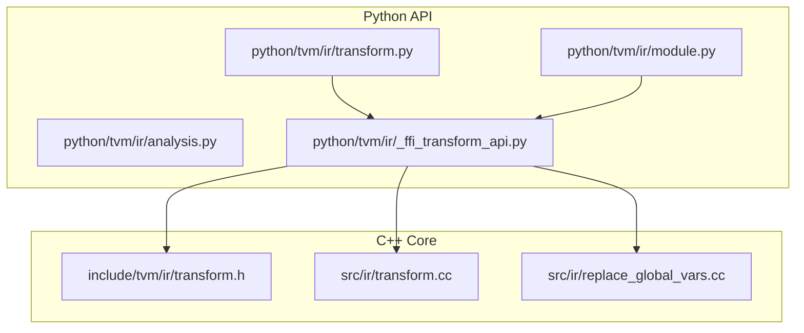
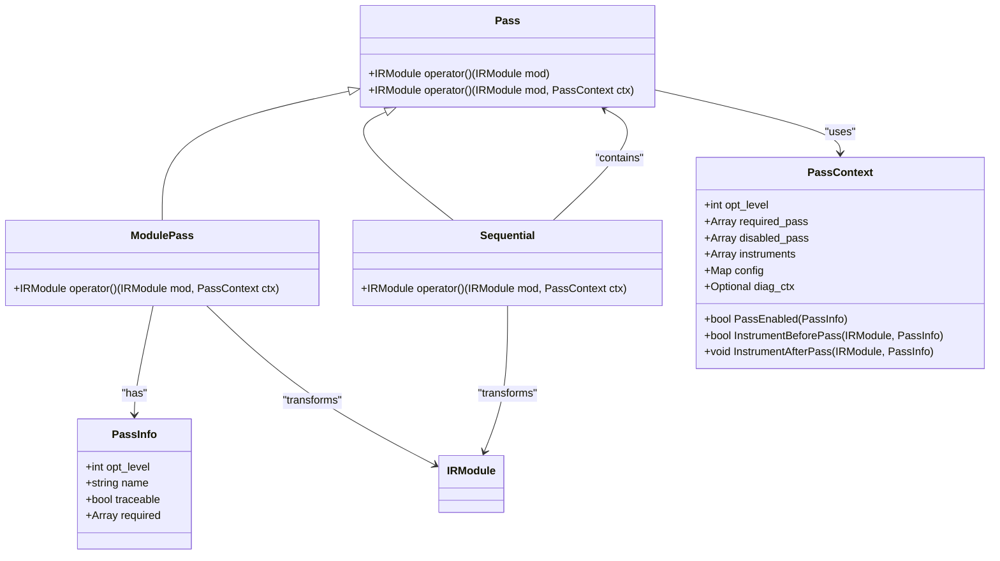
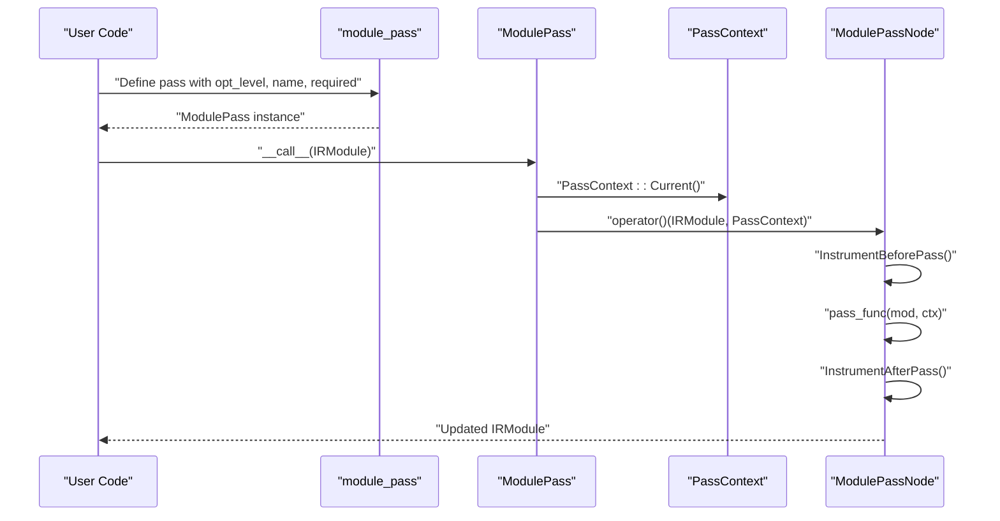
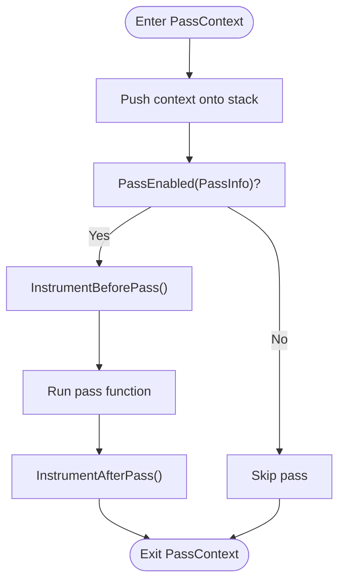
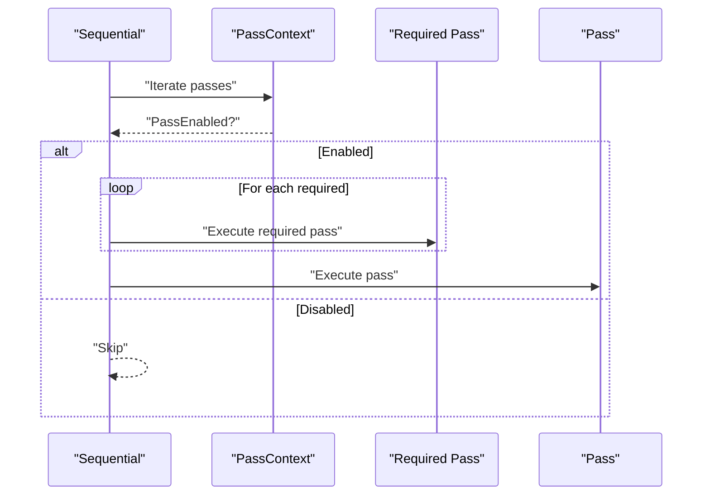
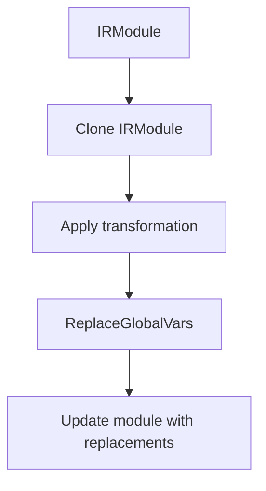
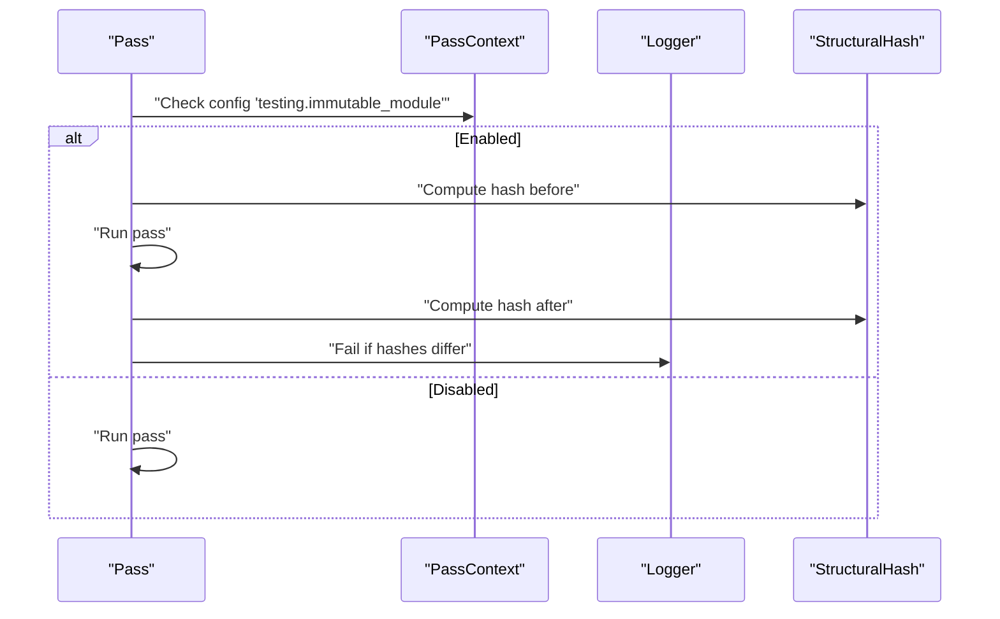
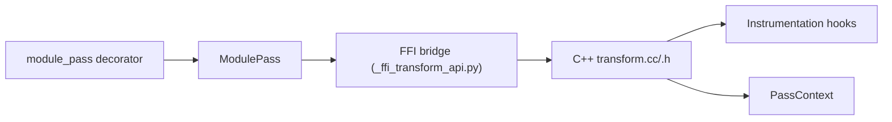

# IR Transformation API

<cite>
**Referenced Files in This Document**
- [transform.py](file://python/tvm/ir/transform.py)
- [transform.h](file://include/tvm/ir/transform.h)
- [transform.cc](file://src/ir/transform.cc)
- [_ffi_transform_api.py](file://python/tvm/ir/_ffi_transform_api.py)
- [module.py](file://python/tvm/ir/module.py)
- [replace_global_vars.cc](file://src/ir/replace_global_vars.cc)
- [analysis.py](file://python/tvm/ir/analysis.py)
</cite>

## Table of Contents
1. [Introduction](#introduction)
2. [Project Structure](#project-structure)
3. [Core Components](#core-components)
4. [Architecture Overview](#architecture-overview)
5. [Detailed Component Analysis](#detailed-component-analysis)
6. [Dependency Analysis](#dependency-analysis)
7. [Performance Considerations](#performance-considerations)
8. [Troubleshooting Guide](#troubleshooting-guide)
9. [Conclusion](#conclusion)
10. [Appendices](#appendices)

## Introduction
This document describes TVM’s IR Transformation system with a focus on the IR pass infrastructure, pass registration and execution, pass context management, and pass configuration. It explains how to implement custom IR transformations, compose passes into pipelines, and integrate transformations into the broader compilation pipeline. It also covers transformation utilities for IR rewriting, substitution, and cloning, along with debugging, profiling, validation, pass isolation, and common transformation patterns used in optimization passes.

## Project Structure
The IR transformation system spans Python bindings and C++ core:
- Python API exposes pass decorators, pass containers, and utilities for constructing and running transformations.
- C++ core implements pass execution, pass context lifecycle, instrumentation hooks, and pass composition.
- FFI bridges connect Python constructs to C++ implementations.
- IRModule is the central data structure transformed by passes.

**Diagram sources**
- [transform.py:1-411](file://python/tvm/ir/transform.py#L1-L411)
- [module.py:1-312](file://python/tvm/ir/module.py#L1-L312)
- [_ffi_transform_api.py:1-22](file://python/tvm/ir/_ffi_transform_api.py#L1-L22)
- [transform.h:1-568](file://include/tvm/ir/transform.h#L1-L568)
- [transform.cc:1-657](file://src/ir/transform.cc#L1-L657)
- [replace_global_vars.cc:1-111](file://src/ir/replace_global_vars.cc#L1-L111)

**Section sources**
- [transform.py:1-411](file://python/tvm/ir/transform.py#L1-L411)
- [transform.h:1-568](file://include/tvm/ir/transform.h#L1-L568)
- [transform.cc:1-657](file://src/ir/transform.cc#L1-L657)
- [_ffi_transform_api.py:1-22](file://python/tvm/ir/_ffi_transform_api.py#L1-L22)
- [module.py:1-312](file://python/tvm/ir/module.py#L1-L312)
- [replace_global_vars.cc:1-111](file://src/ir/replace_global_vars.cc#L1-L111)

## Core Components
- Pass: Base class representing a transformation that operates on an IRModule. It supports default pass context resolution and explicit pass context execution.
- ModulePass: A specialization of Pass operating on IRModule. Created via decorators or constructors.
- Sequential: A composite pass that runs a list of passes in sequence, honoring opt levels and required/disabled lists.
- PassInfo: Metadata describing a pass, including opt level, name, required dependencies, and traceability.
- PassContext: Runtime context controlling pass execution, including opt level, required/disabled pass lists, instrumentation hooks, configuration, and diagnostic context.
- IRModule: The primary IR container transformed by passes.

Key responsibilities:
- Pass registration and discovery via decorators and constructors.
- Pass execution orchestration with dependency resolution and instrumentation.
- Pass configuration and validation via a typed config registry.
- Immutable module enforcement for pass isolation and validation.

**Section sources**
- [transform.py:143-411](file://python/tvm/ir/transform.py#L143-L411)
- [transform.h:364-563](file://include/tvm/ir/transform.h#L364-L563)
- [transform.cc:290-488](file://src/ir/transform.cc#L290-L488)

## Architecture Overview
The IR transformation architecture centers on a pass manager that:
- Accepts IRModule inputs and applies ModulePass transformations.
- Resolves pass dependencies and respects opt levels and required/disabled lists.
- Invokes instrumentation hooks before/after pass execution.
- Supports pass composition via Sequential and pass-specific utilities.

**Diagram sources**
- [transform.h:364-563](file://include/tvm/ir/transform.h#L364-L563)
- [transform.cc:290-488](file://src/ir/transform.cc#L290-L488)

## Detailed Component Analysis

### Pass Registration and Execution
- Decorators and constructors:
  - module_pass decorator constructs ModulePass with PassInfo metadata and wraps a callable or class with transform_module.
  - Sequential composes multiple passes with optional opt level and required dependencies.
- Execution:
  - Pass::operator() resolves the current PassContext and invokes instrumentation hooks.
  - ModulePassNode::operator() sets up diagnostic context, runs the pass function, and renders diagnostics.
  - SequentialNode::operator() iterates enabled passes, resolves required dependencies, and applies each pass.

**Diagram sources**
- [transform.py:256-352](file://python/tvm/ir/transform.py#L256-L352)
- [transform.cc:290-426](file://src/ir/transform.cc#L290-L426)

**Section sources**
- [transform.py:256-352](file://python/tvm/ir/transform.py#L256-L352)
- [transform.cc:394-426](file://src/ir/transform.cc#L394-L426)

### Pass Context Management
- Creation and scoping:
  - PassContext::Create builds a context with default opt level and empty required/disabled lists.
  - PassContext::Current returns the top-of-stack context or default context.
  - Python context manager enters/exits pass contexts and triggers instrumentation hooks.
- Configuration:
  - Config keys are registered with type validators and legalizers.
  - PassContext::GetConfig retrieves typed configuration values with defaults.
  - ListConfigs enumerates registered configuration names and metadata.

**Diagram sources**
- [transform.cc:61-84](file://src/ir/transform.cc#L61-L84)
- [transform.cc:94-104](file://src/ir/transform.cc#L94-L104)
- [transform.cc:259-288](file://src/ir/transform.cc#L259-L288)

**Section sources**
- [transform.h:79-138](file://include/tvm/ir/transform.h#L79-L138)
- [transform.cc:173-180](file://src/ir/transform.cc#L173-L180)
- [transform.cc:259-288](file://src/ir/transform.cc#L259-L288)

### Pass Composition and Chaining
- Sequential composes passes and enforces opt-level gating and required/disabled lists.
- Dependency resolution:
  - Required passes are executed prior to the dependent pass.
  - Disabled passes are skipped regardless of opt level.
- Practical chaining patterns:
  - Build a list of ModulePass instances and wrap with Sequential.
  - Use module_pass decorator to define reusable passes with opt levels and required dependencies.

**Diagram sources**
- [transform.cc:470-488](file://src/ir/transform.cc#L470-L488)

**Section sources**
- [transform.py:185-224](file://python/tvm/ir/transform.py#L185-L224)
- [transform.cc:470-488](file://src/ir/transform.cc#L470-L488)

### Transformation Utilities: IR Rewriting, Substitution, and Cloning
- IRModule cloning:
  - IRModule.clone returns a copy of the module for safe transformations.
- GlobalVar replacement:
  - ReplaceGlobalVars replaces GlobalVar instances across functions and updates the module.
  - ModuleReplaceGlobalVars accepts string or GlobalVar keys and values, resolving names to GlobalVar.
- Applying a pass to specific functions:
  - ApplyPassToFunction restricts a pass to functions matched by a regex, leaving others unchanged.

**Diagram sources**
- [module.py:69-70](file://python/tvm/ir/module.py#L69-L70)
- [replace_global_vars.cc:34-64](file://src/ir/replace_global_vars.cc#L34-L64)
- [replace_global_vars.cc:71-102](file://src/ir/replace_global_vars.cc#L71-L102)

**Section sources**
- [module.py:69-70](file://python/tvm/ir/module.py#L69-L70)
- [replace_global_vars.cc:34-64](file://src/ir/replace_global_vars.cc#L34-L64)
- [replace_global_vars.cc:71-102](file://src/ir/replace_global_vars.cc#L71-L102)
- [transform.py:370-411](file://python/tvm/ir/transform.py#L370-L411)

### Pass Debugging and Validation
- PrintIR pass:
  - Emits IR to logs with a configurable header for inspection.
- Immutable module enforcement:
  - When a specific config is enabled, the pass asserts that the input module hash equals the output module hash after transformation, preventing unintended mutations.
- Diagnostics:
  - ModulePassNode sets up a diagnostic context before and restores it after pass execution.

**Diagram sources**
- [transform.cc:313-325](file://src/ir/transform.cc#L313-L325)
- [transform.cc:640-646](file://src/ir/transform.cc#L640-L646)

**Section sources**
- [transform.py:355-368](file://python/tvm/ir/transform.py#L355-L368)
- [transform.cc:313-325](file://src/ir/transform.cc#L313-L325)
- [transform.cc:640-646](file://src/ir/transform.cc#L640-L646)

### Practical Examples and Patterns
- Implementing a custom IR transformation:
  - Define a function or class with a transform_module method.
  - Decorate with module_pass specifying opt_level, name, and required dependencies.
  - Invoke the resulting ModulePass on an IRModule.
- Pass composition:
  - Compose multiple ModulePass instances into a Sequential with appropriate opt levels.
- Transformation pipeline construction:
  - Chain passes in a logical order, ensuring required passes run before dependents.
- Applying passes to specific functions:
  - Wrap an existing pass with ApplyPassToFunction and provide a regex to select target functions.

**Section sources**
- [transform.py:256-352](file://python/tvm/ir/transform.py#L256-L352)
- [transform.py:370-411](file://python/tvm/ir/transform.py#L370-L411)

## Dependency Analysis
- Python to C++ boundary:
  - Python transform.py constructs pass objects and delegates execution to C++ via FFI.
  - _ffi_transform_api.py initializes the transform FFI namespace.
- Pass context dependency:
  - Pass::operator() relies on PassContext::Current for default context resolution.
  - SequentialNode::operator() depends on PassContext::PassEnabled to filter passes.
- Instrumentation dependency:
  - PassContext::InstrumentBeforePass and InstrumentAfterPass gate and notify instrumentation implementations.

**Diagram sources**
- [transform.py:256-352](file://python/tvm/ir/transform.py#L256-L352)
- [_ffi_transform_api.py:19-22](file://python/tvm/ir/_ffi_transform_api.py#L19-L22)
- [transform.cc:290-488](file://src/ir/transform.cc#L290-L488)

**Section sources**
- [transform.py:256-352](file://python/tvm/ir/transform.py#L256-L352)
- [_ffi_transform_api.py:19-22](file://python/tvm/ir/_ffi_transform_api.py#L19-L22)
- [transform.cc:290-488](file://src/ir/transform.cc#L290-L488)

## Performance Considerations
- Opt level gating:
  - Use opt_level in PassInfo to conditionally enable passes, reducing overhead in lower optimization tiers.
- Pass filtering:
  - disabled_pass and required_pass lists minimize unnecessary transformations.
- Immutable checks:
  - Enabling immutable module validation helps catch unintended mutations early, potentially saving downstream recomputation costs.
- Diagnostic overhead:
  - Excessive logging or diagnostics can slow execution; use selectively during debugging.

## Troubleshooting Guide
- Pass not running:
  - Verify opt_level vs. PassContext opt_level and required/disabled lists.
  - Confirm instrumentation ShouldRun decisions if present.
- Configuration errors:
  - Ensure config keys are registered and values match expected types; use ListConfigs to enumerate valid keys.
- IR mutation concerns:
  - Enable immutable module enforcement to detect unintended modifications.
- Function-scoped transformations:
  - Use ApplyPassToFunction with a precise regex to limit scope and reduce side effects.

**Section sources**
- [transform.cc:94-104](file://src/ir/transform.cc#L94-L104)
- [transform.cc:178-180](file://src/ir/transform.cc#L178-L180)
- [transform.cc:313-325](file://src/ir/transform.cc#L313-L325)
- [transform.py:370-411](file://python/tvm/ir/transform.py#L370-L411)

## Conclusion
TVM’s IR Transformation system provides a robust, extensible framework for building and composing IR passes. The Python API offers intuitive decorators and utilities, while the C++ core ensures efficient execution, instrumentation, and pass isolation. By leveraging pass contexts, configuration, and composition patterns, developers can construct reliable transformation pipelines tailored to their optimization needs.

## Appendices

### API Reference Highlights
- PassInfo: opt_level, name, required, traceable.
- PassContext: opt_level, required_pass, disabled_pass, instruments, config, diag_ctx, PassEnabled, Instrument hooks.
- Pass: operator() with default and explicit contexts.
- ModulePass: transform IRModule with diagnostics and instrumentation.
- Sequential: compose passes with dependency and opt-level gating.
- Utilities: PrintIR, ApplyPassToFunction, IRModule.clone, ReplaceGlobalVars.

**Section sources**
- [transform.h:319-563](file://include/tvm/ir/transform.h#L319-L563)
- [transform.cc:290-488](file://src/ir/transform.cc#L290-L488)
- [module.py:69-70](file://python/tvm/ir/module.py#L69-L70)
- [replace_global_vars.cc:34-64](file://src/ir/replace_global_vars.cc#L34-L64)
- [transform.py:355-411](file://python/tvm/ir/transform.py#L355-L411)