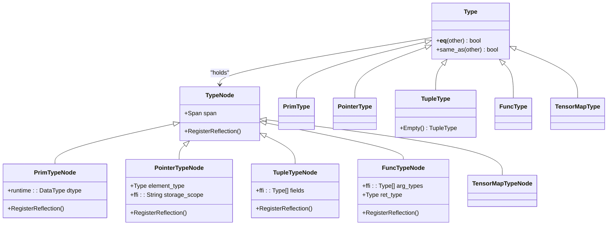
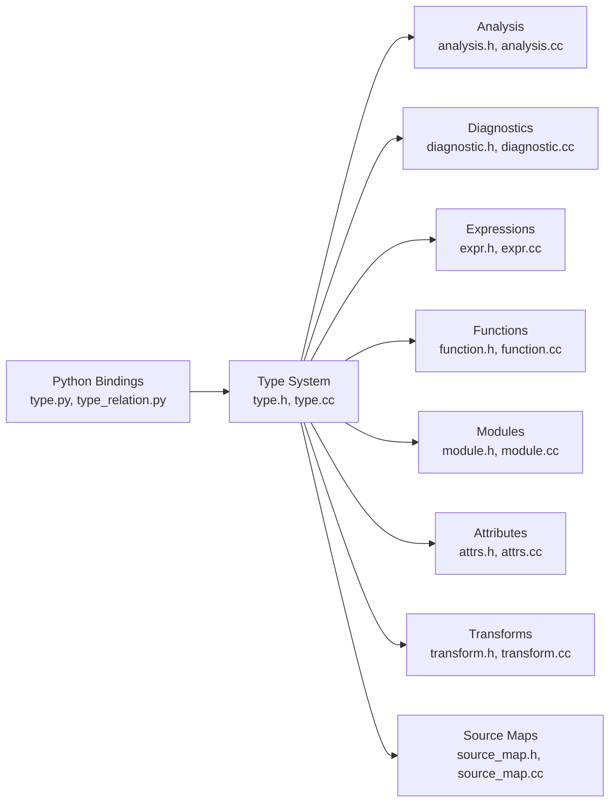
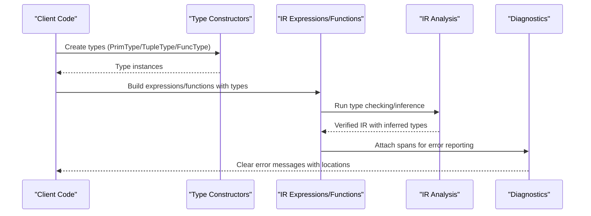

# IR Types API

<cite>
**Referenced Files in This Document**
- [type.h](file://include/tvm/ir/type.h)
- [type.cc](file://src/ir/type.cc)
- [type.py](file://python/tvm/ir/type.py)
- [type_relation.py](file://python/tvm/ir/type_relation.py)
- [structural_equal.cc](file://src/ir/structural_equal.cc)
- [structural_hash.cc](file://src/ir/structural_hash.cc)
- [analysis.h](file://include/tvm/ir/analysis.h)
- [analysis.cc](file://src/ir/analysis.cc)
- [diagnostic.h](file://include/tvm/ir/diagnostic.h)
- [diagnostic.cc](file://src/ir/diagnostic.cc)
- [expr.h](file://include/tvm/ir/expr.h)
- [expr.cc](file://src/ir/expr.cc)
- [function.h](file://include/tvm/ir/function.h)
- [function.cc](file://src/ir/function.cc)
- [module.h](file://include/tvm/ir/module.h)
- [module.cc](file://src/ir/module.cc)
- [attrs.h](file://include/tvm/ir/attrs.h)
- [attrs.cc](file://src/ir/attrs.cc)
- [transform.h](file://include/tvm/ir/transform.h)
- [transform.cc](file://src/ir/transform.cc)
- [source_map.h](file://include/tvm/ir/source_map.h)
- [source_map.cc](file://src/ir/source_map.cc)
- [runtime/data_type.h](file://include/tvm/runtime/data_type.h)
</cite>

## Table of Contents
1. [Introduction](#introduction)
2. [Project Structure](#project-structure)
3. [Core Components](#core-components)
4. [Architecture Overview](#architecture-overview)
5. [Detailed Component Analysis](#detailed-component-analysis)
6. [Dependency Analysis](#dependency-analysis)
7. [Performance Considerations](#performance-considerations)
8. [Troubleshooting Guide](#troubleshooting-guide)
9. [Conclusion](#conclusion)
10. [Appendices](#appendices)

## Introduction
This document provides comprehensive API documentation for TVM’s IR Type system. It covers the construction and semantics of core types (PrimType, PointerType, TensorType, TupleType, FuncType, TensorMapType), type relations and constraints, type equality and hashing, shape inference and type promotion, and integration with IR analysis and optimization passes. Practical examples illustrate type construction, type checking workflows, and type relation queries. Guidance is included for type debugging, error reporting, and performance considerations.

## Project Structure
The IR type system spans C++ headers and implementations, Python bindings, and supporting infrastructure for structural equality, hashing, diagnostics, and analysis.

```mermaid
graph TB
subgraph "C++ Core"
TH["include/tvm/ir/type.h"]
TC["src/ir/type.cc"]
SE["src/ir/structural_equal.cc"]
SH["src/ir/structural_hash.cc"]
AH["include/tvm/ir/analysis.h"]
AC["src/ir/analysis.cc"]
DH["include/tvm/ir/diagnostic.h"]
DC["src/ir/diagnostic.cc"]
EXH["include/tvm/ir/expr.h"]
EXC["src/ir/expr.cc"]
FUH["include/tvm/ir/function.h"]
FUC["src/ir/function.cc"]
MUH["include/tvm/ir/module.h"]
MUC["src/ir/module.cc"]
AUH["include/tvm/ir/attrs.h"]
AUC["src/ir/attrs.cc"]
TRH["include/tvm/ir/transform.h"]
TRC["src/ir/transform.cc"]
SMH["include/tvm/ir/source_map.h"]
SMC["src/ir/source_map.cc"]
end
subgraph "Python Bindings"
PYT["python/tvm/ir/type.py"]
PYR["python/tvm/ir/type_relation.py"]
end
TH --> TC
PYT --> TH
PYR --> TH
SE --> TH
SH --> TH
AH --> TH
AC --> TH
DH --> TH
DC --> TH
EXH --> TH
EXC --> TH
FUH --> TH
FUC --> TH
MUH --> TH
MUC --> TH
AUH --> TH
AUC --> TH
TRH --> TH
TRC --> TH
SMH --> TH
SMC --> TH
```

**Diagram sources**
- [type.h:60-314](file://include/tvm/ir/type.h#L60-L314)
- [type.cc:24-106](file://src/ir/type.cc#L24-L106)
- [structural_equal.cc:22-84](file://src/ir/structural_equal.cc#L22-L84)
- [structural_hash.cc:22-171](file://src/ir/structural_hash.cc#L22-L171)
- [analysis.h](file://include/tvm/ir/analysis.h)
- [analysis.cc](file://src/ir/analysis.cc)
- [diagnostic.h](file://include/tvm/ir/diagnostic.h)
- [diagnostic.cc](file://src/ir/diagnostic.cc)
- [expr.h](file://include/tvm/ir/expr.h)
- [expr.cc](file://src/ir/expr.cc)
- [function.h](file://include/tvm/ir/function.h)
- [function.cc](file://src/ir/function.cc)
- [module.h](file://include/tvm/ir/module.h)
- [module.cc](file://src/ir/module.cc)
- [attrs.h](file://include/tvm/ir/attrs.h)
- [attrs.cc](file://src/ir/attrs.cc)
- [transform.h](file://include/tvm/ir/transform.h)
- [transform.cc](file://src/ir/transform.cc)
- [source_map.h](file://include/tvm/ir/source_map.h)
- [source_map.cc](file://src/ir/source_map.cc)
- [type.py:28-130](file://python/tvm/ir/type.py#L28-L130)
- [type_relation.py:25-77](file://python/tvm/ir/type_relation.py#L25-L77)

**Section sources**
- [type.h:60-314](file://include/tvm/ir/type.h#L60-L314)
- [type.cc:24-106](file://src/ir/type.cc#L24-L106)
- [type.py:28-130](file://python/tvm/ir/type.py#L28-L130)
- [type_relation.py:25-77](file://python/tvm/ir/type_relation.py#L25-L77)

## Core Components
This section documents the primary type classes and their roles in the IR type system.

- TypeNode and Type: The base class hierarchy for all types. Types carry optional source spans for diagnostics.
- PrimType: Primitive scalar types used in low-level IR, backed by runtime::DataType.
- PointerType: Low-level pointer types with element type and storage scope.
- TupleType: Composite types representing ordered collections of fields.
- FuncType: Function signatures composed of argument types and a return type.
- TensorMapType: Specialized tensor map type used in low-level TIR.

Key capabilities:
- Construction APIs expose constructors for each type variant.
- Python bindings provide convenient constructors and equality semantics.
- Structural equality and hashing are provided via the node system.

Practical examples (paths only):
- Construct a primitive type: [PrimType constructor:38-48](file://src/ir/type.cc#L38-L48)
- Construct a pointer type: [PointerType constructor:50-66](file://src/ir/type.cc#L50-L66)
- Construct a tuple type: [TupleType constructor:83-97](file://src/ir/type.cc#L83-L97)
- Construct a function type: [FuncType constructor:68-81](file://src/ir/type.cc#L68-L81)
- Python convenience: [Type, PrimType, TupleType, FuncType, TensorMapType:28-130](file://python/tvm/ir/type.py#L28-L130)

**Section sources**
- [type.h:74-314](file://include/tvm/ir/type.h#L74-L314)
- [type.cc:38-106](file://src/ir/type.cc#L38-L106)
- [type.py:28-130](file://python/tvm/ir/type.py#L28-L130)

## Architecture Overview
The type system integrates tightly with IR analysis, diagnostics, and transformations. Types are used pervasively in expressions, functions, and modules. Structural equality and hashing enable efficient caching and comparison. Diagnostics attach spans to types to improve error messages.

**Diagram sources**
- [type.h:74-314](file://include/tvm/ir/type.h#L74-L314)

## Detailed Component Analysis

### PrimType: Primitive Scalar Types
PrimType represents scalar primitives in low-level IR. It stores a runtime::DataType and supports reflection registration.

- Construction: [PrimType constructor:38-48](file://src/ir/type.cc#L38-L48)
- Python binding: [PrimType:44-56](file://python/tvm/ir/type.py#L44-L56)
- Equality: Structural equality via node system; see [Type.__eq__:32-42](file://python/tvm/ir/type.py#L32-L42)

Common use cases:
- Representing int/float/bool/handle scalars in TIR expressions.
- Backing dtype for low-level PrimExpr.

**Section sources**
- [type.h:112-140](file://include/tvm/ir/type.h#L112-L140)
- [type.cc:38-48](file://src/ir/type.cc#L38-L48)
- [type.py:44-56](file://python/tvm/ir/type.py#L44-L56)

### PointerType: Low-Level Pointers
PointerType encodes pointer types with element type and storage scope. Storage scope defaults to “global” if unspecified.

- Construction: [PointerType constructor:50-66](file://src/ir/type.cc#L50-L66)
- Python binding: [PointerType:58-73](file://python/tvm/ir/type.py#L58-L73)

Typical scenarios:
- Passing raw pointers to code generators.
- Expressing memory addressing with storage scopes.

**Section sources**
- [type.h:152-186](file://include/tvm/ir/type.h#L152-L186)
- [type.cc:50-66](file://src/ir/type.cc#L50-L66)
- [type.py:58-73](file://python/tvm/ir/type.py#L58-L73)

### TupleType: Composite Types
TupleType represents ordered collections of fields. An empty tuple corresponds to void.

- Construction: [TupleType constructor:83-97](file://src/ir/type.cc#L83-L97)
- Python binding: [TupleType:75-87](file://python/tvm/ir/type.py#L75-L87)
- Convenience: [VoidType and IsVoidType helpers:233-242](file://include/tvm/ir/type.h#L233-L242)

Use cases:
- Returning multiple values from functions.
- Modeling composite shapes and structures.

**Section sources**
- [type.h:192-242](file://include/tvm/ir/type.h#L192-L242)
- [type.cc:83-97](file://src/ir/type.cc#L83-L97)
- [type.py:75-87](file://python/tvm/ir/type.py#L75-L87)

### FuncType: Function Signatures
FuncType captures function type signatures with argument types and a return type.

- Construction: [FuncType constructor:68-81](file://src/ir/type.cc#L68-L81)
- Python binding: [FuncType:89-113](file://python/tvm/ir/type.py#L89-L113)

Integration:
- Functions in IR modules carry a FuncType signature.
- Used to validate call sites and enforce polymorphism.

**Section sources**
- [type.h:252-285](file://include/tvm/ir/type.h#L252-L285)
- [type.cc:68-81](file://src/ir/type.cc#L68-L81)
- [type.py:89-113](file://python/tvm/ir/type.py#L89-L113)

### TensorMapType: Tensor Map Types
TensorMapType is a specialized type used in low-level TIR.

- Construction: [TensorMapType constructor:99-106](file://src/ir/type.cc#L99-L106)
- Python binding: [TensorMapType:115-130](file://python/tvm/ir/type.py#L115-L130)

**Section sources**
- [type.h:291-310](file://include/tvm/ir/type.h#L291-L310)
- [type.cc:99-106](file://src/ir/type.cc#L99-L106)
- [type.py:115-130](file://python/tvm/ir/type.py#L115-L130)

### Type Relations and Constraints
Type relations define input-output relationships among types for inference. Two key constructs are available:

- TypeCall: Application of a type-level function to arguments.
- TypeRelation: Generalized user-defined relations that can infer inputs and outputs.

- Python bindings: [TypeCall:25-45](file://python/tvm/ir/type_relation.py#L25-L45), [TypeRelation:47-77](file://python/tvm/ir/type_relation.py#L47-L77)

These are commonly used in IR analysis and transformations to encode shape and type inference rules.

**Section sources**
- [type_relation.py:25-77](file://python/tvm/ir/type_relation.py#L25-L77)

## Dependency Analysis
The type system interacts with analysis, diagnostics, expressions, functions, modules, attributes, transforms, and source maps.

**Diagram sources**
- [type.h:60-314](file://include/tvm/ir/type.h#L60-L314)
- [type.cc:24-106](file://src/ir/type.cc#L24-L106)
- [analysis.h](file://include/tvm/ir/analysis.h)
- [analysis.cc](file://src/ir/analysis.cc)
- [diagnostic.h](file://include/tvm/ir/diagnostic.h)
- [diagnostic.cc](file://src/ir/diagnostic.cc)
- [expr.h](file://include/tvm/ir/expr.h)
- [expr.cc](file://src/ir/expr.cc)
- [function.h](file://include/tvm/ir/function.h)
- [function.cc](file://src/ir/function.cc)
- [module.h](file://include/tvm/ir/module.h)
- [module.cc](file://src/ir/module.cc)
- [attrs.h](file://include/tvm/ir/attrs.h)
- [attrs.cc](file://src/ir/attrs.cc)
- [transform.h](file://include/tvm/ir/transform.h)
- [transform.cc](file://src/ir/transform.cc)
- [source_map.h](file://include/tvm/ir/source_map.h)
- [source_map.cc](file://src/ir/source_map.cc)
- [type.py:28-130](file://python/tvm/ir/type.py#L28-L130)
- [type_relation.py:25-77](file://python/tvm/ir/type_relation.py#L25-L77)

**Section sources**
- [type.h:60-314](file://include/tvm/ir/type.h#L60-L314)
- [type.cc:24-106](file://src/ir/type.cc#L24-L106)
- [analysis.h](file://include/tvm/ir/analysis.h)
- [analysis.cc](file://src/ir/analysis.cc)
- [diagnostic.h](file://include/tvm/ir/diagnostic.h)
- [diagnostic.cc](file://src/ir/diagnostic.cc)
- [expr.h](file://include/tvm/ir/expr.h)
- [expr.cc](file://src/ir/expr.cc)
- [function.h](file://include/tvm/ir/function.h)
- [function.cc](file://src/ir/function.cc)
- [module.h](file://include/tvm/ir/module.h)
- [module.cc](file://src/ir/module.cc)
- [attrs.h](file://include/tvm/ir/attrs.h)
- [attrs.cc](file://src/ir/attrs.cc)
- [transform.h](file://include/tvm/ir/transform.h)
- [transform.cc](file://src/ir/transform.cc)
- [source_map.h](file://include/tvm/ir/source_map.h)
- [source_map.cc](file://src/ir/source_map.cc)
- [type.py:28-130](file://python/tvm/ir/type.py#L28-L130)
- [type_relation.py:25-77](file://python/tvm/ir/type_relation.py#L25-L77)

## Performance Considerations
- Structural equality and hashing: Implemented via node-level adapters, enabling fast comparisons and caches. See [structural_equal.cc:36-81](file://src/ir/structural_equal.cc#L36-L81) and [structural_hash.cc:43-80](file://src/ir/structural_hash.cc#L43-L80).
- Span handling: Spans are stored in TypeNode but excluded from structural equality/hash to avoid perturbing caches unintentionally. See [TypeNode registration:82-92](file://include/tvm/ir/type.h#L82-L92).
- Lazy type construction: Types are often constructed during type checking rather than at IR construction time, reducing upfront overhead. See [type.h comment block:29-48](file://include/tvm/ir/type.h#L29-L48).
- Dtype vs Type: runtime::DataType provides coarse-grained information early in IR construction; Types provide fine-grained information later. See [type.h comment block:29-48](file://include/tvm/ir/type.h#L29-L48).

[No sources needed since this section provides general guidance]

## Troubleshooting Guide
- Type equality checks: Use structural equality via the node system. The adapter reports first mismatch with detailed diagnostics. See [NodeStructuralEqualAdapter:36-74](file://src/ir/structural_equal.cc#L36-L74).
- Getting first structural mismatch: The adapter exposes a function to retrieve the first mismatch path. See [GetFirstStructuralMismatch:76-81](file://src/ir/structural_equal.cc#L76-L81).
- Hashing types: Structural hashing is available for caching and indexing. See [node.StructuralHash:43-48](file://src/ir/structural_hash.cc#L43-L48).
- Debugging spans: Attach spans to types to improve diagnostics. Spans are part of TypeNode and are reflected but ignored for equality/hash. See [TypeNode span:80-87](file://include/tvm/ir/type.h#L80-L87).
- Python equality: Python Type.__eq__ delegates to structural equality. See [Type.__eq__:32-42](file://python/tvm/ir/type.py#L32-L42).

**Section sources**
- [structural_equal.cc:36-81](file://src/ir/structural_equal.cc#L36-L81)
- [structural_hash.cc:43-48](file://src/ir/structural_hash.cc#L43-L48)
- [type.h:80-92](file://include/tvm/ir/type.h#L80-L92)
- [type.py:32-42](file://python/tvm/ir/type.py#L32-L42)

## Conclusion
TVM’s IR Type system provides a unified, extensible foundation across IR variants. It supports precise type modeling for primitives, pointers, tuples, functions, and tensor maps, with robust structural equality, hashing, and diagnostics. Integration with analysis and transformations enables powerful shape inference and type promotion workflows while maintaining performance and usability.

[No sources needed since this section summarizes without analyzing specific files]

## Appendices

### Practical Examples (Paths Only)
- Construct a primitive type: [PrimType constructor:38-48](file://src/ir/type.cc#L38-L48)
- Construct a pointer type: [PointerType constructor:50-66](file://src/ir/type.cc#L50-L66)
- Construct a tuple type: [TupleType constructor:83-97](file://src/ir/type.cc#L83-L97)
- Construct a function type: [FuncType constructor:68-81](file://src/ir/type.cc#L68-L81)
- Python convenience constructors: [Type, PrimType, TupleType, FuncType, TensorMapType:28-130](file://python/tvm/ir/type.py#L28-L130)
- Type equality and hashing: [structural_equal.cc:36-81](file://src/ir/structural_equal.cc#L36-L81), [structural_hash.cc:43-48](file://src/ir/structural_hash.cc#L43-L48)
- Type relations: [TypeCall, TypeRelation:25-77](file://python/tvm/ir/type_relation.py#L25-L77)

### Type Checking Workflow (Sequence)

[No sources needed since this diagram shows conceptual workflow, not actual code structure]