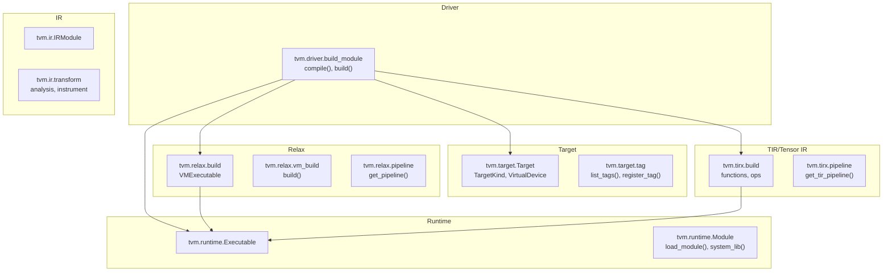
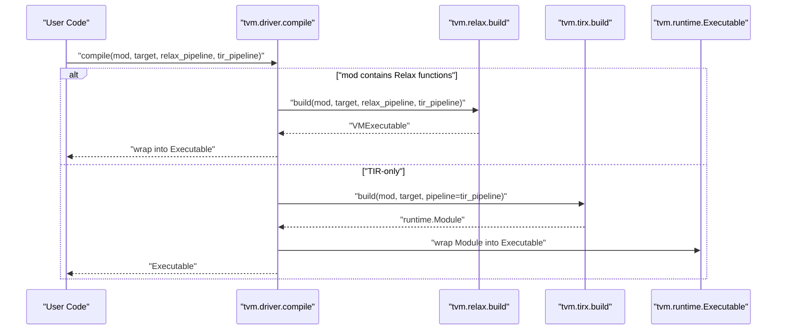
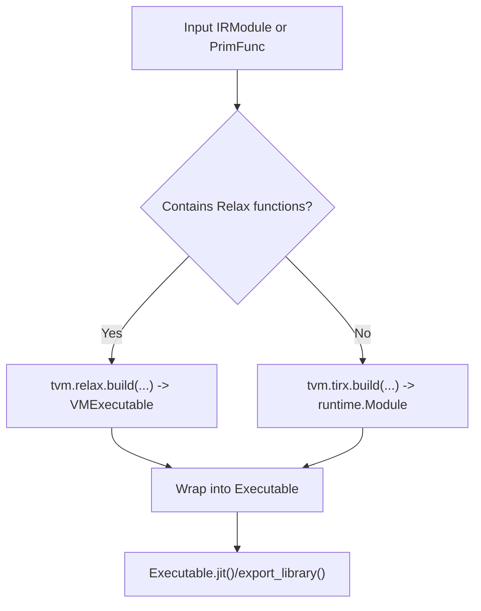
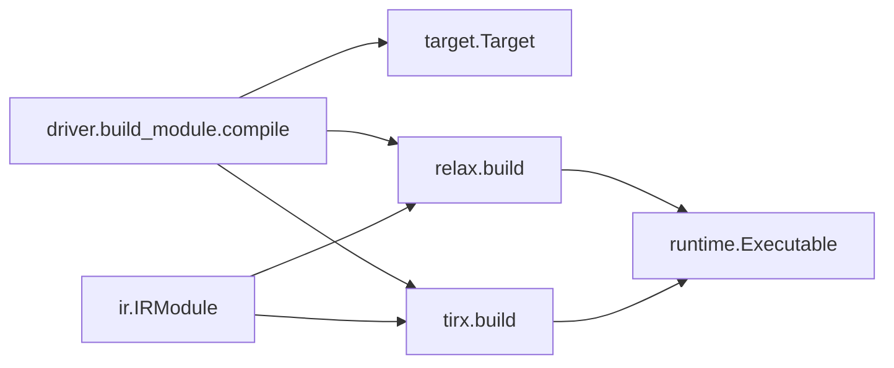

# Python API Reference

<cite>
**Referenced Files in This Document**
- [python/tvm/__init__.py](file://python/tvm/__init__.py)
- [python/tvm/driver/build_module.py](file://python/tvm/driver/build_module.py)
- [python/tvm/target/__init__.py](file://python/tvm/target/__init__.py)
- [python/tvm/target/target.py](file://python/tvm/target/target.py)
- [python/tvm/ir/__init__.py](file://python/tvm/ir/__init__.py)
- [python/tvm/ir/module.py](file://python/tvm/ir/module.py)
- [python/tvm/tirx/__init__.py](file://python/tvm/tirx/__init__.py)
- [python/tvm/relax/__init__.py](file://python/tvm/relax/__init__.py)
- [python/tvm/runtime/__init__.py](file://python/tvm/runtime/__init__.py)
- [python/tvm/runtime/executable.py](file://python/tvm/runtime/executable.py)
</cite>

## Table of Contents
1. [Introduction](#introduction)
2. [Project Structure](#project-structure)
3. [Core Components](#core-components)
4. [Architecture Overview](#architecture-overview)
5. [Detailed Component Analysis](#detailed-component-analysis)
6. [Dependency Analysis](#dependency-analysis)
7. [Performance Considerations](#performance-considerations)
8. [Troubleshooting Guide](#troubleshooting-guide)
9. [Conclusion](#conclusion)
10. [Appendices](#appendices)

## Introduction
This document provides a comprehensive Python API reference for TVM’s public interfaces. It focuses on:
- Unified compilation interface via tvm.compile
- Target configuration system
- IR manipulation APIs
- Relax frontend operations
- Runtime system for deployment

It includes function signatures, parameter descriptions, return values, usage examples, error handling, and best practices for both beginners and advanced users.

## Project Structure
The TVM Python package exposes high-level namespaces:
- Driver: unified compilation entry points
- Target: target configuration and detection
- IR: IRModule and related IR APIs
- TIR/Tensor IR (tirx): tensor-level IR constructs and ops
- Relax: graph-level IR, VM, and frontend
- Runtime: Executable, JIT, and runtime module loading

**Diagram sources**
- [python/tvm/driver/build_module.py:31-113](file://python/tvm/driver/build_module.py#L31-L113)
- [python/tvm/target/target.py:51-233](file://python/tvm/target/target.py#L51-L233)
- [python/tvm/target/__init__.py:34-40](file://python/tvm/target/__init__.py#L34-L40)
- [python/tvm/ir/module.py:31-312](file://python/tvm/ir/module.py#L31-L312)
- [python/tvm/tirx/__init__.py:117-124](file://python/tvm/tirx/__init__.py#L117-L124)
- [python/tvm/relax/__init__.py:94-123](file://python/tvm/relax/__init__.py#L94-L123)
- [python/tvm/runtime/executable.py:30-174](file://python/tvm/runtime/executable.py#L30-L174)
- [python/tvm/runtime/__init__.py:20-50](file://python/tvm/runtime/__init__.py#L20-L50)

**Section sources**
- [python/tvm/__init__.py:60-76](file://python/tvm/__init__.py#L60-L76)
- [python/tvm/driver/build_module.py:31-113](file://python/tvm/driver/build_module.py#L31-L113)
- [python/tvm/target/__init__.py:18-40](file://python/tvm/target/__init__.py#L18-L40)
- [python/tvm/ir/__init__.py:18-50](file://python/tvm/ir/__init__.py#L18-L50)
- [python/tvm/tirx/__init__.py:18-124](file://python/tvm/tirx/__init__.py#L18-L124)
- [python/tvm/relax/__init__.py:18-123](file://python/tvm/relax/__init__.py#L18-L123)
- [python/tvm/runtime/__init__.py:18-50](file://python/tvm/runtime/__init__.py#L18-L50)

## Core Components
- Unified compilation: tvm.compile
  - Purpose: Compile either TIR (PrimFunc) or Relax IRModule to a runtime Executable
  - Parameters:
    - mod: PrimFunc or IRModule
    - target: Target
    - relax_pipeline: Pass or str or callable (Relax-only)
    - tir_pipeline: Pass or str or callable
  - Returns: Executable
  - Notes: Automatically dispatches to Relax build or TIR build depending on module content
  - Example usage: See “Usage examples” in Detailed Component Analysis

- Target configuration: tvm.target.Target
  - Purpose: Describe device and host configuration for compilation
  - Construction forms: tag string, tag with overrides, JSON-like dict, kind string
  - Attributes: attrs, host, device_type, features
  - Methods: from_device(), current(), list_kinds(), with_host(), export()
  - Example usage: See “Usage examples” in Detailed Component Analysis

- IRModule: tvm.ir.IRModule
  - Purpose: Container for functions and type definitions across IR variants
  - Operations: add/update/remove/rename functions, get/set attributes, clone, update
  - Example usage: See “Usage examples” in Detailed Component Analysis

- Runtime Executable: tvm.runtime.Executable
  - Purpose: Wrapper around a runtime Module for JIT and export
  - Methods: jit(), export_library(), __getitem__(), __call__()
  - Example usage: See “Usage examples” in Detailed Component Analysis

**Section sources**
- [python/tvm/driver/build_module.py:72-113](file://python/tvm/driver/build_module.py#L72-L113)
- [python/tvm/target/target.py:51-233](file://python/tvm/target/target.py#L51-L233)
- [python/tvm/ir/module.py:31-312](file://python/tvm/ir/module.py#L31-L312)
- [python/tvm/runtime/executable.py:30-174](file://python/tvm/runtime/executable.py#L30-L174)

## Architecture Overview
The unified compilation flow routes IRModules to the appropriate backend:
- If the module contains Relax functions, route to Relax build
- Else route to TIR build
- Wrap TIR build result into Executable for runtime usage

**Diagram sources**
- [python/tvm/driver/build_module.py:72-113](file://python/tvm/driver/build_module.py#L72-L113)
- [python/tvm/relax/__init__.py:120-123](file://python/tvm/relax/__init__.py#L120-L123)
- [python/tvm/tirx/__init__.py:121-121](file://python/tvm/tirx/__init__.py#L121-L121)
- [python/tvm/runtime/executable.py:30-37](file://python/tvm/runtime/executable.py#L30-L37)

## Detailed Component Analysis

### Driver APIs: Unified Compilation
- Function: tvm.compile
  - Signature: compile(mod, target=None, *, relax_pipeline="default", tir_pipeline="default") -> Executable
  - Parameters:
    - mod: PrimFunc or IRModule
    - target: Target
    - relax_pipeline: Pass or str or callable (Relax-only)
    - tir_pipeline: Pass or str or callable
  - Returns: Executable
  - Behavior:
    - Detects Relax content; if present, delegates to Relax build
    - Otherwise, delegates to TIR build and wraps result into Executable
  - Exceptions:
    - ValueError if mod type is unsupported
  - Best practices:
    - Prefer passing Target objects over strings for clarity
    - Use explicit pipeline selection for reproducible builds

- Function: tvm.driver.build (deprecated)
  - Signature: build(mod, target=None, pipeline="default") -> runtime.Module
  - Notes: Deprecated; use tvm.compile or tvm.tirx.build

**Section sources**
- [python/tvm/driver/build_module.py:31-113](file://python/tvm/driver/build_module.py#L31-L113)

### Target APIs: Hardware Configuration
- Class: tvm.target.Target
  - Constructor: Target(target, host=None)
    - target: str or dict or tag; host: str or dict
  - Methods:
    - from_device(device): auto-detect Target from a device identifier or Device
    - current(allow_none=True): get current target in scope
    - list_kinds(): list available target kinds
    - with_host(host): set host target
    - export(): serialize target configuration
    - get_kind_attr(attr_name): get attributes of the target kind
    - get_target_device_type(): device type of the target
    - target_or_current(target): resolve None to current target
  - Properties:
    - features: dynamic feature access via TargetFeatures
  - Exceptions:
    - ValueError for invalid target/host types
  - Best practices:
    - Use tags for known platforms; override selectively via dict
    - Use Target.current() inside compilation scopes

- Module: tvm.target
  - Exposes: Target, TargetKind, VirtualDevice, list_tags(), register_tag()

**Section sources**
- [python/tvm/target/target.py:51-233](file://python/tvm/target/target.py#L51-L233)
- [python/tvm/target/__init__.py:18-40](file://python/tvm/target/__init__.py#L18-L40)

### IR APIs: Program Manipulation
- Class: tvm.ir.IRModule
  - Constructor: IRModule(functions=None, attrs=None, global_infos=None)
  - Key operations:
    - __setitem__, __getitem__, __delitem__, __contains__
    - update(other), update_func(var, func), replace_global_vars(replacements)
    - get_global_var(name), get_global_vars()
    - get_attr(key), with_attr(key, value), with_attrs(map), without_attr(key)
    - clone()
  - Notes: Supports both TIR and Relax functions; maintains global info and attributes
  - Best practices:
    - Use GlobalVar keys consistently
    - Use with_attr/without_attr for metadata
    - Use replace_global_vars when renaming or substituting symbols

**Section sources**
- [python/tvm/ir/module.py:31-312](file://python/tvm/ir/module.py#L31-L312)
- [python/tvm/ir/__init__.py:18-50](file://python/tvm/ir/__init__.py#L18-L50)

### Relax APIs: Graph-Level Operations
- Namespace: tvm.relax
  - Exposed: Expr types, Type system, VM, operators, BlockBuilder, StructInfo, pipeline helpers
  - VM:
    - VirtualMachine, VMInstrumentReturnKind
    - VMExecutable (from relax build)
  - Pipelines:
    - get_default_pipeline(), get_pipeline(name), register_pipeline(name, fn)
  - Build:
    - build(mod, target, relax_pipeline="default", tir_pipeline="default") -> VMExecutable
  - Best practices:
    - Use get_default_pipeline() for standard builds
    - Combine relax_pipeline and tir_pipeline for mixed IR

**Section sources**
- [python/tvm/relax/__init__.py:18-123](file://python/tvm/relax/__init__.py#L18-L123)

### Runtime APIs: Deployment
- Class: tvm.runtime.Executable
  - Constructor: Executable(mod: Module)
  - Methods:
    - __getitem__(name) -> PackedFunc
    - __call__(*args, **kwargs) -> Any
    - jit(fcompile=None, addons=None, force_recompile=False, **kwargs) -> Module
    - export_library(file_name, fcompile=None, addons=None, workspace_dir=None, **kwargs)
  - Behavior:
    - jit() compiles and links non-runnable modules (e.g., CUDA sources) into a runnable Module
    - export_library() packages the module and imports into a single shared library
  - Best practices:
    - Cache jitted modules when possible
    - Use export_library() for packaging artifacts

- Module loading and system libraries:
  - Functions: load_module(), system_lib(), load_static_library(), num_threads()
  - Best practices:
    - Use system_lib() for environments without dynamic loading
    - Set num_threads() to control parallelism

**Section sources**
- [python/tvm/runtime/executable.py:30-174](file://python/tvm/runtime/executable.py#L30-L174)
- [python/tvm/runtime/__init__.py:18-50](file://python/tvm/runtime/__init__.py#L18-L50)

### TIR/Tensor IR APIs: Low-Level Constructs
- Namespace: tvm.tirx
  - Exposed: Buffer, Var, expressions, statements, PrimFunc, ops, transform, analysis, backend
  - Build: build(mod, target, pipeline="default")
  - Pipelines: get_tir_pipeline(name), get_default_tir_pipeline()
  - Best practices:
    - Use pipeline helpers for consistent passes
    - Combine with Relax pipeline for hybrid workloads

**Section sources**
- [python/tvm/tirx/__init__.py:18-124](file://python/tvm/tirx/__init__.py#L18-L124)

## Architecture Overview
Unified compilation routes IRModules to the correct backend and produces a runtime Executable.

**Diagram sources**
- [python/tvm/driver/build_module.py:104-112](file://python/tvm/driver/build_module.py#L104-L112)
- [python/tvm/relax/__init__.py:120-123](file://python/tvm/relax/__init__.py#L120-L123)
- [python/tvm/tirx/__init__.py:121-121](file://python/tvm/tirx/__init__.py#L121-L121)
- [python/tvm/runtime/executable.py:30-37](file://python/tvm/runtime/executable.py#L30-L37)

## Detailed Component Analysis

### Driver API: tvm.compile
- Purpose: Unified entry point for building TIR and Relax modules
- Parameters:
  - mod: PrimFunc or IRModule
  - target: Target
  - relax_pipeline: Pass or str or callable (Relax-only)
  - tir_pipeline: Pass or str or callable
- Returns: Executable
- Usage examples:
  - Build a Relax module targeting CUDA
  - Build a TIR-only module with a specific pipeline
- Error handling:
  - ValueError for unsupported mod types
- Best practices:
  - Use Target objects; set host via Target.with_host()
  - Choose pipelines explicitly for reproducibility

**Section sources**
- [python/tvm/driver/build_module.py:72-113](file://python/tvm/driver/build_module.py#L72-L113)

### Target API: tvm.target.Target
- Purpose: Describe compilation targets and hosts
- Construction:
  - Tag: Target("nvidia/nvidia-a100")
  - Overrides: Target({"tag": "...", "l2_cache_size_bytes": 12345})
  - Dict: Target({"kind": "cuda", "arch": "sm_80"})
  - Kind: Target("cuda")
- Methods and properties:
  - from_device(), current(), list_kinds(), with_host(), export(), features
- Usage examples:
  - Detect target from a device string
  - Serialize target configuration
- Error handling:
  - ValueError for invalid types
- Best practices:
  - Prefer tags for known platforms
  - Use Target.current() inside compilation contexts

**Section sources**
- [python/tvm/target/target.py:51-233](file://python/tvm/target/target.py#L51-L233)
- [python/tvm/target/__init__.py:18-40](file://python/tvm/target/__init__.py#L18-L40)

### IR API: tvm.ir.IRModule
- Purpose: Container for functions and attributes across IR variants
- Key operations:
  - Add/update/remove/rename functions
  - Get/set attributes
  - Clone and update from other modules
- Usage examples:
  - Construct IRModule from dict of functions
  - Update attributes for metadata
- Error handling:
  - Assertion errors for invalid keys/types
- Best practices:
  - Use GlobalVar keys
  - Use replace_global_vars when renaming

**Section sources**
- [python/tvm/ir/module.py:31-312](file://python/tvm/ir/module.py#L31-L312)

### Relax API: tvm.relax.build and VM
- Purpose: Build Relax modules to VM executables and manage pipelines
- Functions:
  - build(mod, target, relax_pipeline="default", tir_pipeline="default") -> VMExecutable
  - get_default_pipeline(), get_pipeline(name), register_pipeline(name, fn)
- Usage examples:
  - Build a Relax module with default pipeline
  - Register a custom pipeline
- Best practices:
  - Use default pipelines for standard builds
  - Combine with TIR pipeline for mixed IR

**Section sources**
- [python/tvm/relax/__init__.py:94-123](file://python/tvm/relax/__init__.py#L94-L123)

### Runtime API: tvm.runtime.Executable
- Purpose: Wrap runtime modules for JIT and export
- Methods:
  - jit(fcompile=None, addons=None, force_recompile=False)
  - export_library(file_name, fcompile=None, addons=None, workspace_dir=None)
  - __getitem__(name), __call__(*args, **kwargs)
- Usage examples:
  - JIT and call main function
  - Export to a shared library for deployment
- Best practices:
  - Cache jitted modules
  - Use export_library() for packaging

**Section sources**
- [python/tvm/runtime/executable.py:30-174](file://python/tvm/runtime/executable.py#L30-L174)

### TIR/Tensor IR API: tvm.tirx.build and pipelines
- Purpose: Build TIR PrimFuncs and apply transformation pipelines
- Functions:
  - build(mod, target, pipeline="default")
  - get_tir_pipeline(name), get_default_tir_pipeline()
- Usage examples:
  - Build a TIR module with a specific pipeline
- Best practices:
  - Use pipeline helpers for consistent passes
  - Combine with Relax pipeline for hybrid workloads

**Section sources**
- [python/tvm/tirx/__init__.py:117-124](file://python/tvm/tirx/__init__.py#L117-L124)

## Dependency Analysis
- Driver depends on:
  - Target for device/host configuration
  - TIR build for TIR-only modules
  - Relax build for Relax modules
  - Runtime Executable for wrapping results
- IRModule is a core data structure used by both TIR and Relax
- Runtime Executable depends on runtime.Module for loading and linking

**Diagram sources**
- [python/tvm/driver/build_module.py:72-113](file://python/tvm/driver/build_module.py#L72-L113)
- [python/tvm/target/target.py:51-233](file://python/tvm/target/target.py#L51-L233)
- [python/tvm/relax/__init__.py:120-123](file://python/tvm/relax/__init__.py#L120-L123)
- [python/tvm/tirx/__init__.py:121-121](file://python/tvm/tirx/__init__.py#L121-L121)
- [python/tvm/runtime/executable.py:30-37](file://python/tvm/runtime/executable.py#L30-L37)
- [python/tvm/ir/module.py:31-312](file://python/tvm/ir/module.py#L31-L312)

**Section sources**
- [python/tvm/driver/build_module.py:72-113](file://python/tvm/driver/build_module.py#L72-L113)
- [python/tvm/ir/module.py:31-312](file://python/tvm/ir/module.py#L31-L312)

## Performance Considerations
- Pipeline selection:
  - Use default pipelines for balanced performance; switch to specialized ones for advanced tuning
- JIT caching:
  - Reuse Executable.jit() results when possible to avoid repeated compilation
- Export packaging:
  - Use export_library() to pre-link and produce optimized shared libraries
- Target configuration:
  - Prefer tag-based targets for known platforms; override only necessary attributes
- Parallelism:
  - Control runtime threads via runtime.num_threads() for CPU-heavy workloads

[No sources needed since this section provides general guidance]

## Troubleshooting Guide
- Common exceptions:
  - ValueError for invalid target/host types or unset current target
  - TVMError for IRModule lookup failures
- Backtraces:
  - Set TVM_BACKTRACE=1 to enable detailed traces
  - TVM wraps sys.excepthook to terminate subprocesses cleanly
- Diagnostics:
  - Use IRModule.get_attr()/with_attr() to attach metadata for debugging
  - Use Target.features and get_kind_attr() to inspect target capabilities

**Section sources**
- [python/tvm/target/target.py:183-196](file://python/tvm/target/target.py#L183-L196)
- [python/tvm/ir/module.py:183-186](file://python/tvm/ir/module.py#L183-L186)
- [python/tvm/__init__.py:82-114](file://python/tvm/__init__.py#L82-L114)

## Conclusion
This reference covers TVM’s unified compilation interface, target configuration, IR manipulation, Relax operations, and runtime deployment. Use tvm.compile for a single entry point, configure targets via tvm.target.Target, manipulate programs with tvm.ir.IRModule, build Relax modules with tvm.relax.build, and deploy with tvm.runtime.Executable. Apply the best practices and troubleshooting tips to ensure robust and efficient workflows.

[No sources needed since this section summarizes without analyzing specific files]

## Appendices

### Quick Start Examples (paths only)
- Build a Relax module targeting CUDA:
  - [python/tvm/driver/build_module.py:72-113](file://python/tvm/driver/build_module.py#L72-L113)
- Detect target from device and compile:
  - [python/tvm/target/target.py:160-180](file://python/tvm/target/target.py#L160-L180)
- Create and update an IRModule:
  - [python/tvm/ir/module.py:43-168](file://python/tvm/ir/module.py#L43-L168)
- JIT and call an Executable:
  - [python/tvm/runtime/executable.py:42-44](file://python/tvm/runtime/executable.py#L42-L44)

[No sources needed since this section lists example paths without analyzing specific files]