# Analysis and Verification

<cite>
**Referenced Files in This Document**
- [analysis.h](file://include/tvm/relax/analysis.h)
- [analysis.cc](file://src/relax/analysis/analysis.cc)
- [shape_analysis.cc](file://src/relax/analysis/shape_analysis.cc)
- [struct_info_analysis.cc](file://src/relax/analysis/struct_info_analysis.cc)
- [udchain.cc](file://src/relax/analysis/udchain.cc)
- [well_formed.cc](file://src/relax/analysis/well_formed.cc)
- [computable_at_compile_time.cc](file://src/relax/analysis/computable_at_compile_time.cc)
- [var2value.cc](file://src/relax/analysis/var2value.cc)
- [detect_recursion.cc](file://src/relax/analysis/detect_recursion.cc)
- [tir_op_pattern_kind.cc](file://src/relax/analysis/tir_op_pattern_kind.cc)
- [layout_transformation.cc](file://src/relax/analysis/layout_transformation.cc)
- [collect_call_map.cc](file://src/relax/analysis/collect_call_map.cc)
- [__init__.py](file://python/tvm/relax/__init__.py)
</cite>

## Table of Contents
1. [Introduction](#introduction)
2. [Project Structure](#project-structure)
3. [Core Components](#core-components)
4. [Architecture Overview](#architecture-overview)
5. [Detailed Component Analysis](#detailed-component-analysis)
6. [Dependency Analysis](#dependency-analysis)
7. [Performance Considerations](#performance-considerations)
8. [Troubleshooting Guide](#troubleshooting-guide)
9. [Conclusion](#conclusion)
10. [Appendices](#appendices)

## Introduction
This document describes the Relax analysis and verification system within the TVM codebase. It focuses on static analysis passes for shape inference, memory estimation, and structural information analysis. It also explains analysis utilities for graph traversal, dependency analysis, and correctness verification. Practical examples illustrate how to use these analyses for debugging, optimization planning, and model verification. Finally, it outlines testing methodologies and performance profiling techniques grounded in the repository’s analysis infrastructure.

## Project Structure
The Relax analysis module resides under src/relax/analysis and exposes APIs via include/tvm/relax/analysis.h. Python bindings are provided through python/tvm/relax/__init__.py. The analysis suite includes:
- Shape and structural information analysis
- Variable use-def analysis and variable-to-value mapping
- Well-formedness checking for IRModules and functions
- Compile-time computability analysis
- Recursion detection for global functions
- TIR operator pattern classification and reshape pattern detection
- Layout transformation suggestions for PrimFuncs
- Cross-IR call graph collection

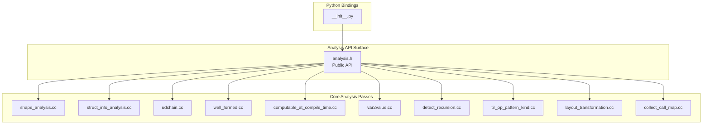

**Diagram sources**
- [analysis.h:40-619](file://include/tvm/relax/analysis.h#L40-L619)
- [shape_analysis.cc:1-56](file://src/relax/analysis/shape_analysis.cc#L1-L56)
- [struct_info_analysis.cc:1-1476](file://src/relax/analysis/struct_info_analysis.cc#L1-L1476)
- [udchain.cc:1-151](file://src/relax/analysis/udchain.cc#L1-L151)
- [well_formed.cc:1-674](file://src/relax/analysis/well_formed.cc#L1-L674)
- [computable_at_compile_time.cc:1-103](file://src/relax/analysis/computable_at_compile_time.cc#L1-L103)
- [var2value.cc:1-101](file://src/relax/analysis/var2value.cc#L1-L101)
- [detect_recursion.cc:1-403](file://src/relax/analysis/detect_recursion.cc#L1-L403)
- [tir_op_pattern_kind.cc:1-551](file://src/relax/analysis/tir_op_pattern_kind.cc#L1-L551)
- [layout_transformation.cc:1-630](file://src/relax/analysis/layout_transformation.cc#L1-L630)
- [collect_call_map.cc:1-59](file://src/relax/analysis/collect_call_map.cc#L1-L59)
- [__init__.py:104-123](file://python/tvm/relax/__init__.py#L104-L123)

**Section sources**
- [analysis.h:40-619](file://include/tvm/relax/analysis.h#L40-L619)
- [__init__.py:104-123](file://python/tvm/relax/__init__.py#L104-L123)

## Core Components
This section summarizes the principal analysis capabilities and their roles.

- Shape equality and propagation
  - CanProveShapeEqual compares symbolic shapes and shape expressions using an integer analyzer.
  - Shape propagation leverages arithmetic simplification to derive equalities.

- Structural information analysis
  - GetStaticType converts StructInfo to static types.
  - StructInfoFromType reconstructs StructInfo from static types.
  - EraseToWellDefined removes dependencies on undefined variables when returning from scopes.
  - StructInfoBaseCheck and related utilities compare StructInfo relations with fine-grained failure modes.
  - TIRVarsInStructInfo and related helpers extract symbolic variables.

- Variable analysis
  - AnalyzeVar2Value maps variables to their bound expressions.
  - CollectVarUsage and FunctionUseDef/UDChain compute use-def chains.
  - ComputableAtCompileTime identifies variables that can be computed at compile-time.

- Correctness and normalization
  - WellFormed validates IRModule and Function well-formedness, including structural info, purity, and normalization constraints.

- Graph and dependency analysis
  - DetectRecursion finds mutually recursive function groups using dependency graphs and elementary circuit detection.
  - CollectCallMap integrates with IR-level callee collection for cross-IR call graphs.

- TIR-level analysis
  - AnalyzeOpPatternKind classifies operator patterns (elemwise, broadcast, injective, reduce, out-ewise fusable).
  - HasReshapePattern detects reshape-like buffer transformations.

- Layout transformation suggestions
  - SuggestLayoutTransforms proposes block and buffer layout transformations to preserve sequential access.

Practical usage examples:
- Debugging: Use WellFormed to catch malformed IR; use StructInfoBaseCheck to diagnose type mismatches.
- Optimization planning: Use AnalyzeOpPatternKind to guide fusion; use SuggestLayoutTransforms to improve locality.
- Model verification: Use DetectRecursion to validate termination properties; use ComputableAtCompileTime to precompute constants.

**Section sources**
- [analysis.h:45-619](file://include/tvm/relax/analysis.h#L45-L619)
- [shape_analysis.cc:32-52](file://src/relax/analysis/shape_analysis.cc#L32-L52)
- [struct_info_analysis.cc:36-624](file://src/relax/analysis/struct_info_analysis.cc#L36-L624)
- [udchain.cc:41-151](file://src/relax/analysis/udchain.cc#L41-L151)
- [well_formed.cc:83-661](file://src/relax/analysis/well_formed.cc#L83-L661)
- [computable_at_compile_time.cc:35-103](file://src/relax/analysis/computable_at_compile_time.cc#L35-L103)
- [detect_recursion.cc:79-394](file://src/relax/analysis/detect_recursion.cc#L79-L394)
- [tir_op_pattern_kind.cc:34-355](file://src/relax/analysis/tir_op_pattern_kind.cc#L34-L355)
- [layout_transformation.cc:319-626](file://src/relax/analysis/layout_transformation.cc#L319-L626)
- [collect_call_map.cc:35-59](file://src/relax/analysis/collect_call_map.cc#L35-L59)

## Architecture Overview
The analysis subsystem exposes a public header with function declarations and implements them in dedicated .cc files. Python bindings are registered via reflection hooks for runtime access.

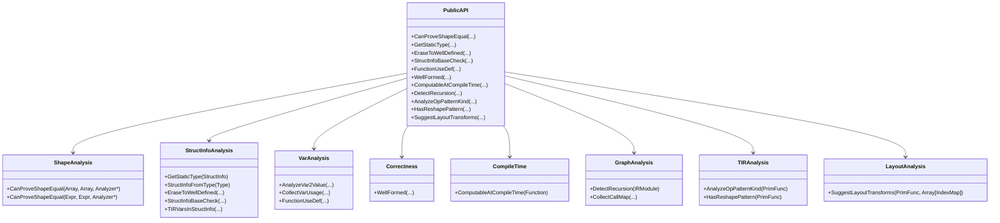

**Diagram sources**
- [analysis.h:45-619](file://include/tvm/relax/analysis.h#L45-L619)
- [shape_analysis.cc:32-52](file://src/relax/analysis/shape_analysis.cc#L32-L52)
- [struct_info_analysis.cc:36-624](file://src/relax/analysis/struct_info_analysis.cc#L36-L624)
- [udchain.cc:41-151](file://src/relax/analysis/udchain.cc#L41-L151)
- [well_formed.cc:83-661](file://src/relax/analysis/well_formed.cc#L83-L661)
- [computable_at_compile_time.cc:35-103](file://src/relax/analysis/computable_at_compile_time.cc#L35-L103)
- [detect_recursion.cc:79-394](file://src/relax/analysis/detect_recursion.cc#L79-L394)
- [tir_op_pattern_kind.cc:34-355](file://src/relax/analysis/tir_op_pattern_kind.cc#L34-L355)
- [layout_transformation.cc:544-626](file://src/relax/analysis/layout_transformation.cc#L544-L626)

## Detailed Component Analysis

### Shape Analysis
Purpose: Determine equality of symbolic shapes and propagate shape constraints.

Key functions:
- CanProveShapeEqual overloads for arrays and expressions.
- Uses an integer analyzer to check equality of PrimExpr entries.

Processing logic:
- Quick checks for identity and size equality.
- Iterates over entries and delegates to analyzer for equality.

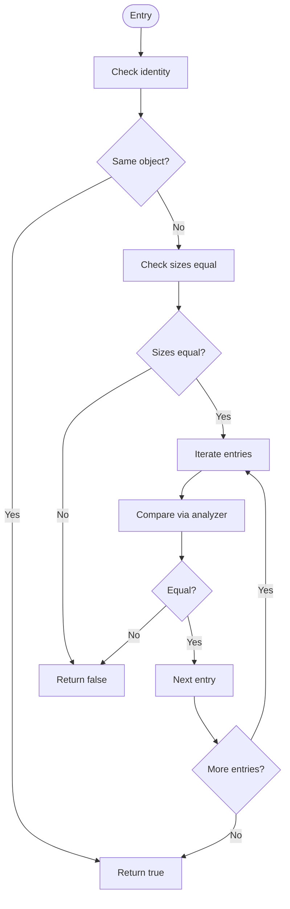

**Diagram sources**
- [shape_analysis.cc:32-52](file://src/relax/analysis/shape_analysis.cc#L32-L52)

**Section sources**
- [shape_analysis.cc:32-52](file://src/relax/analysis/shape_analysis.cc#L32-L52)
- [analysis.h:45-72](file://include/tvm/relax/analysis.h#L45-L72)

### Structural Information Analysis
Purpose: Convert between StructInfo and static types, derive call return StructInfo, erase scope-dependent information, and check subtyping relationships.

Highlights:
- GetStaticType and StructInfoFromType for type conversion.
- EraseToWellDefined erases dependencies on undefined variables when crossing scope boundaries.
- StructInfoBaseCheck provides fine-grained failure modes (kFailL0/L1/L2/kPass).
- TIRVarsInStructInfo and related helpers extract symbolic variables.

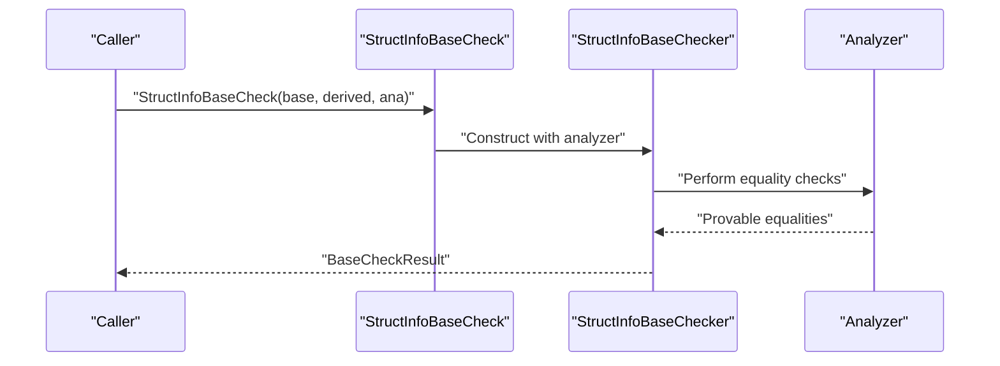

**Diagram sources**
- [struct_info_analysis.cc:597-605](file://src/relax/analysis/struct_info_analysis.cc#L597-L605)
- [struct_info_analysis.cc:305-595](file://src/relax/analysis/struct_info_analysis.cc#L305-L595)

**Section sources**
- [struct_info_analysis.cc:36-624](file://src/relax/analysis/struct_info_analysis.cc#L36-L624)
- [analysis.h:73-322](file://include/tvm/relax/analysis.h#L73-L322)

### Variable Analysis (Use-Def and Var-to-Value)
Purpose: Build variable usage maps and value bindings for debugging and optimization.

Capabilities:
- AnalyzeVar2Value for mapping variables to their bound expressions.
- CollectVarUsage and FunctionUseDef to compute use-def chains.
- GetUsedVars to collect referenced variables.

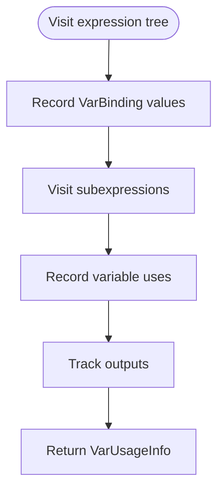

**Diagram sources**
- [udchain.cc:41-151](file://src/relax/analysis/udchain.cc#L41-L151)
- [var2value.cc:29-62](file://src/relax/analysis/var2value.cc#L29-L62)

**Section sources**
- [udchain.cc:41-151](file://src/relax/analysis/udchain.cc#L41-L151)
- [var2value.cc:29-62](file://src/relax/analysis/var2value.cc#L29-L62)
- [analysis.h:411-518](file://include/tvm/relax/analysis.h#L411-L518)

### Correctness and Normalization (Well-Formed)
Purpose: Validate IRModule and Function structures, enforce purity, and ensure structural info correctness.

Checks include:
- Struct info presence and correctness.
- GlobalVar definitions and uniqueness.
- Parameter variable uniqueness across functions.
- Symbolic variable scoping across function boundaries.
- ANF form constraints and leaf-only nesting.
- Impure call restrictions in dataflow blocks and pure functions.
- Operator normalization and validation hooks.

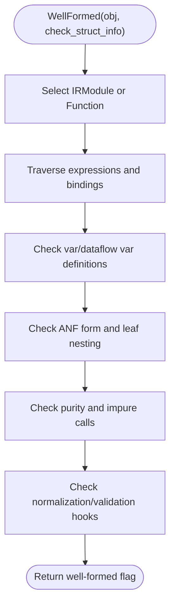

**Diagram sources**
- [well_formed.cc:83-661](file://src/relax/analysis/well_formed.cc#L83-L661)

**Section sources**
- [well_formed.cc:26-66](file://src/relax/analysis/well_formed.cc#L26-L66)
- [well_formed.cc:83-661](file://src/relax/analysis/well_formed.cc#L83-L661)
- [analysis.h:575-586](file://include/tvm/relax/analysis.h#L575-L586)

### Compile-Time Computability
Purpose: Identify variables whose values can be computed at compile-time based on known inputs and structural info.

Approach:
- Mark function parameters beyond kNumInput as known.
- Walk bindings; if all free Relax and TIR variables are known, mark the bound variable as known.
- Propagate known TIR variables from StructInfo.

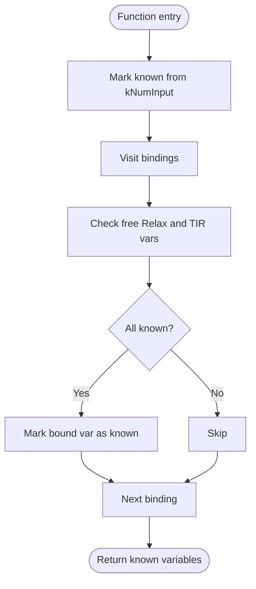

**Diagram sources**
- [computable_at_compile_time.cc:35-90](file://src/relax/analysis/computable_at_compile_time.cc#L35-L90)

**Section sources**
- [computable_at_compile_time.cc:35-103](file://src/relax/analysis/computable_at_compile_time.cc#L35-L103)
- [analysis.h:600-614](file://include/tvm/relax/analysis.h#L600-L614)

### Recursion Detection
Purpose: Detect simple and mutual recursion among global functions.

Methodology:
- Build dependency graph by scanning GlobalVar references.
- Convert to indexed adjacency structure.
- Apply Johnson’s elementary circuit-finding algorithm.
- Coalesce overlapping circuits into maximal mutually recursive groups.

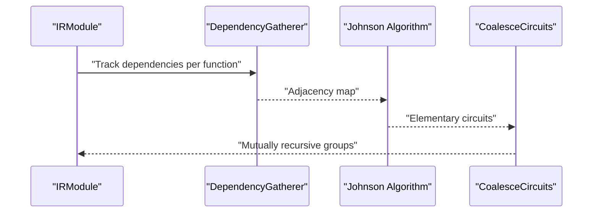

**Diagram sources**
- [detect_recursion.cc:79-394](file://src/relax/analysis/detect_recursion.cc#L79-L394)

**Section sources**
- [detect_recursion.cc:35-394](file://src/relax/analysis/detect_recursion.cc#L35-L394)
- [analysis.h:387-410](file://include/tvm/relax/analysis.h#L387-L410)

### TIR Operator Pattern Classification and Reshape Detection
Purpose: Classify operator patterns for fusion and detect reshape-like transformations.

Key functions:
- AnalyzeOpPatternKind: elemwise, broadcast, injective, comm-reduce, out-ewise fusable.
- HasReshapePattern: checks if buffer access preserves flattened index mapping.

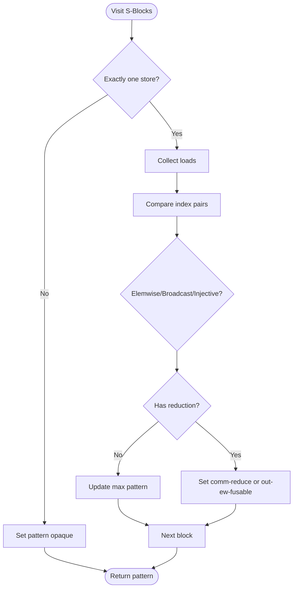

**Diagram sources**
- [tir_op_pattern_kind.cc:34-160](file://src/relax/analysis/tir_op_pattern_kind.cc#L34-L160)

**Section sources**
- [tir_op_pattern_kind.cc:34-355](file://src/relax/analysis/tir_op_pattern_kind.cc#L34-L355)
- [analysis.h:520-544](file://include/tvm/relax/analysis.h#L520-L544)

### Layout Transformation Suggestions
Purpose: Propose block and buffer layout transformations to preserve sequential access and bijectivity.

Highlights:
- Detect spatial layout from IterMap analysis.
- Infer transformations from write buffer to block and read buffers.
- Validate bijective affine mappings and sequential access.

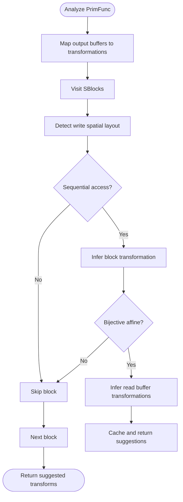

**Diagram sources**
- [layout_transformation.cc:544-626](file://src/relax/analysis/layout_transformation.cc#L544-L626)

**Section sources**
- [layout_transformation.cc:40-626](file://src/relax/analysis/layout_transformation.cc#L40-L626)
- [analysis.h:588-599](file://include/tvm/relax/analysis.h#L588-L599)

### Cross-IR Call Graph Collection
Purpose: Integrate with IR-level callee collection to build cross-IR call graphs.

Mechanism:
- Dispatch to CalleeCollector for Relax Function and ExternFunc nodes.

**Section sources**
- [collect_call_map.cc:35-59](file://src/relax/analysis/collect_call_map.cc#L35-L59)
- [analysis.h:520-528](file://include/tvm/relax/analysis.h#L520-L528)

## Dependency Analysis
The analysis module exhibits clear separation of concerns:
- Public API surface in analysis.h
- Implementation modules for specific analyses
- Reflection-based registration for Python bindings
- Interoperability with TIR-level analysis utilities

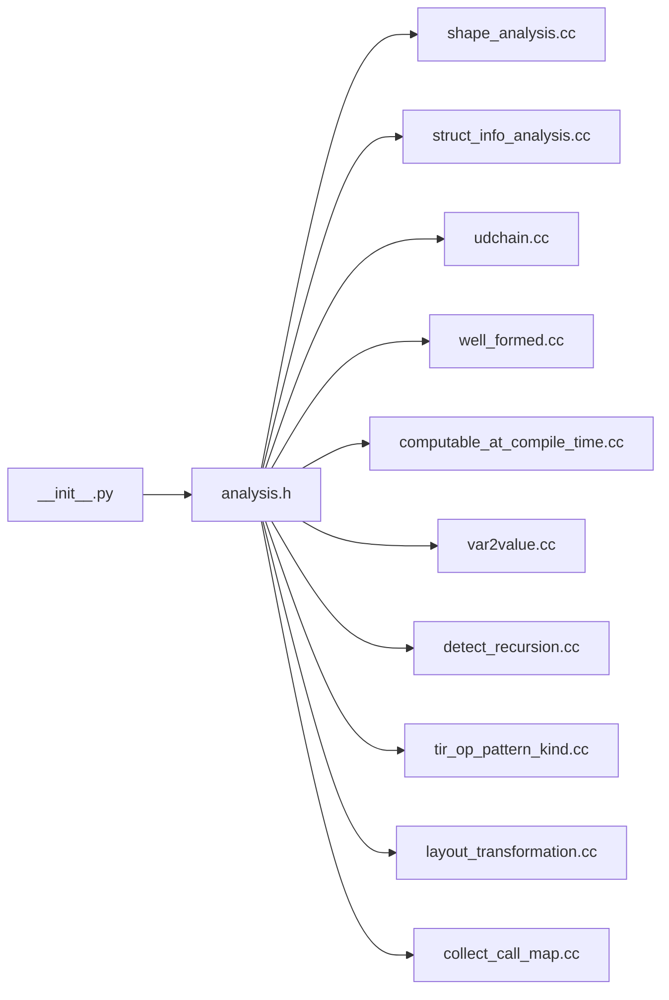

**Diagram sources**
- [analysis.h:40-619](file://include/tvm/relax/analysis.h#L40-L619)
- [__init__.py:104-123](file://python/tvm/relax/__init__.py#L104-L123)

**Section sources**
- [analysis.h:40-619](file://include/tvm/relax/analysis.h#L40-L619)
- [__init__.py:104-123](file://python/tvm/relax/__init__.py#L104-L123)

## Performance Considerations
- Shape equality checks scale linearly with number of shape dimensions; leverage analyzer simplifications to minimize redundant work.
- StructInfo comparisons traverse arrays and nested StructInfo; prefer targeted checks (e.g., specific fields) when feasible.
- Use-Def and Var2Value traversals are linear in expression size; cache results when repeatedly queried.
- Well-formedness validation performs multiple passes; enable only when diagnosing issues.
- Recursion detection involves graph algorithms; limit to modules under development.
- TIR pattern analysis and layout inference rely on IterMap detection; ensure inputs are affine for predictable performance.

[No sources needed since this section provides general guidance]

## Troubleshooting Guide
Common issues and remedies:
- Shape mismatch errors: Use StructInfoBaseCheck to pinpoint L1/L2 failures and adjust annotations accordingly.
- Malformed IR warnings: Run WellFormed with check_struct_info enabled to locate missing struct_info, improper nesting, or purity violations.
- Impure calls in dataflow blocks: Move impure operations outside dataflow blocks or mark function as impure.
- Recursion-related crashes: Use DetectRecursion to identify mutually recursive groups and refactor to eliminate deep cycles.
- Layout inefficiencies: Use SuggestLayoutTransforms to propose sequential access-preserving transformations.

**Section sources**
- [well_formed.cc:135-138](file://src/relax/analysis/well_formed.cc#L135-L138)
- [well_formed.cc:287-298](file://src/relax/analysis/well_formed.cc#L287-L298)
- [detect_recursion.cc:35-77](file://src/relax/analysis/detect_recursion.cc#L35-L77)
- [layout_transformation.cc:319-392](file://src/relax/analysis/layout_transformation.cc#L319-L392)

## Conclusion
The Relax analysis and verification system provides robust tooling for shape inference, structural information handling, correctness validation, and optimization guidance. By combining shape equality checks, StructInfo reasoning, variable analysis, recursion detection, TIR pattern classification, and layout suggestions, developers can debug models effectively, plan optimizations, and verify correctness. The modular design and reflection-based Python bindings facilitate seamless integration into development workflows.

[No sources needed since this section summarizes without analyzing specific files]

## Appendices

### Practical Examples Index
- Debugging malformed IR: Call WellFormed on IRModule or Function.
- Diagnosing type mismatches: Use StructInfoBaseCheck and inspect BaseCheckResult.
- Optimizing fusion: Analyze operator patterns with AnalyzeOpPatternKind.
- Improving memory access locality: Use SuggestLayoutTransforms with output transformations.
- Precomputing constants: Compute compile-time computable variables with ComputableAtCompileTime.
- Detecting recursion: Use DetectRecursion to identify mutually recursive functions.
- Building cross-IR call graphs: Integrate CollectCallMap with IR-level collectors.

**Section sources**
- [well_formed.cc:91-112](file://src/relax/analysis/well_formed.cc#L91-L112)
- [struct_info_analysis.cc:597-605](file://src/relax/analysis/struct_info_analysis.cc#L597-L605)
- [tir_op_pattern_kind.cc:351-355](file://src/relax/analysis/tir_op_pattern_kind.cc#L351-L355)
- [layout_transformation.cc:611-618](file://src/relax/analysis/layout_transformation.cc#L611-L618)
- [computable_at_compile_time.cc:92-94](file://src/relax/analysis/computable_at_compile_time.cc#L92-L94)
- [detect_recursion.cc:372-394](file://src/relax/analysis/detect_recursion.cc#L372-L394)
- [collect_call_map.cc:38-52](file://src/relax/analysis/collect_call_map.cc#L38-L52)