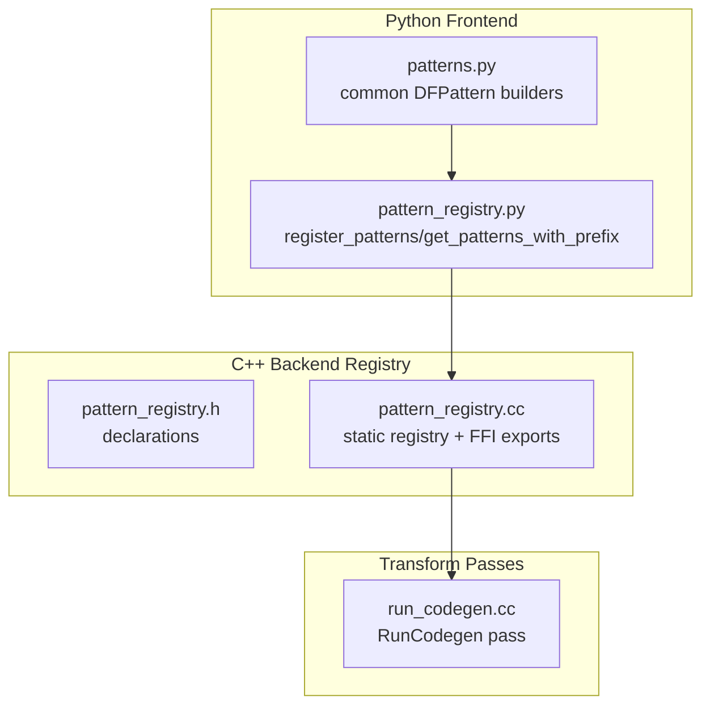
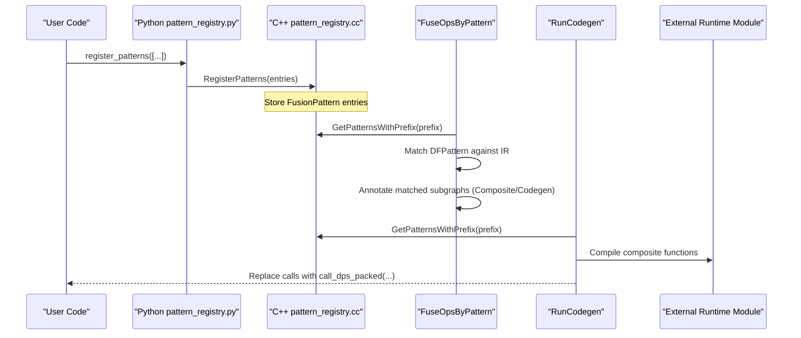
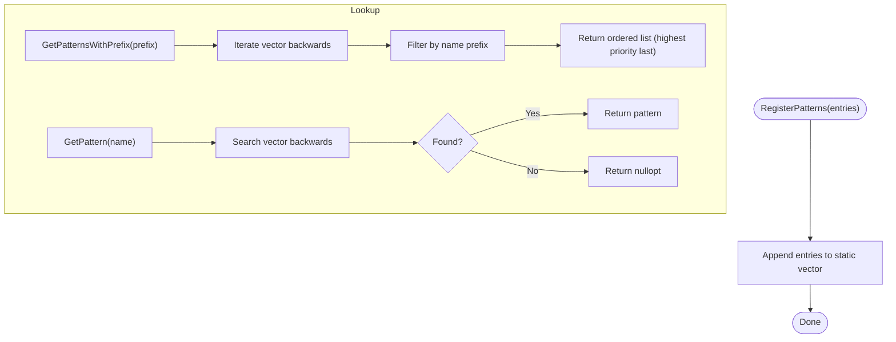
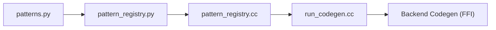

# Backend Dispatch System

<cite>
**Referenced Files in This Document**
- [pattern_registry.h](file://src/relax/backend/pattern_registry.h)
- [pattern_registry.cc](file://src/relax/backend/pattern_registry.cc)
- [pattern_registry.py](file://python/tvm/relax/backend/pattern_registry.py)
- [patterns.py](file://python/tvm/relax/backend/patterns.py)
- [backend.h](file://include/tvm/relax/backend.h)
- [run_codegen.cc](file://src/relax/transform/run_codegen.cc)
- [external_library_dispatch.rst](file://docs/arch/external_library_dispatch.rst)
- [fusion.rst](file://docs/arch/fusion.rst)
- [relax_vm.rst](file://docs/arch/relax_vm.rst)
- [dpl.rst](file://docs/deep_dive/relax/dpl.rst)
- [test_dataflow_pattern.py](file://tests/python/relax/test_dataflow_pattern.py)
</cite>

## Table of Contents
1. [Introduction](#introduction)
2. [Project Structure](#project-structure)
3. [Core Components](#core-components)
4. [Architecture Overview](#architecture-overview)
5. [Detailed Component Analysis](#detailed-component-analysis)
6. [Dependency Analysis](#dependency-analysis)
7. [Performance Considerations](#performance-considerations)
8. [Troubleshooting Guide](#troubleshooting-guide)
9. [Conclusion](#conclusion)

## Introduction
This document explains the Relax backend dispatch system in TVM. It focuses on how operator subgraphs are identified and routed to optimized external backends using a pattern registry and matching framework. The system enables:
- Pattern registration and retrieval for external backends
- Priority-based selection among overlapping matches
- Composite function creation and code generation for external libraries
- Runtime invocation of compiled external kernels

The documentation covers the pattern registry, pattern matching criteria, dispatch logic, and the end-to-end pipeline from pattern registration to code generation and runtime execution.

## Project Structure
The backend dispatch system spans C++ and Python layers:
- C++ core: pattern registry storage and FFI exports
- Python frontend: pattern registration API and reusable pattern templates
- Transform passes: pattern-based fusion and code generation
- Documentation: high-level pipeline and usage guidance

**Diagram sources**
- [pattern_registry.h:26-74](file://src/relax/backend/pattern_registry.h#L26-L74)
- [pattern_registry.cc:20-84](file://src/relax/backend/pattern_registry.cc#L20-L84)
- [pattern_registry.py:18-120](file://python/tvm/relax/backend/pattern_registry.py#L18-L120)
- [patterns.py:18-644](file://python/tvm/relax/backend/patterns.py#L18-L644)
- [run_codegen.cc](file://src/relax/transform/run_codegen.cc)

**Section sources**
- [pattern_registry.h:26-74](file://src/relax/backend/pattern_registry.h#L26-L74)
- [pattern_registry.cc:20-84](file://src/relax/backend/pattern_registry.cc#L20-L84)
- [pattern_registry.py:18-120](file://python/tvm/relax/backend/pattern_registry.py#L18-L120)
- [patterns.py:18-644](file://python/tvm/relax/backend/patterns.py#L18-L644)
- [run_codegen.cc](file://src/relax/transform/run_codegen.cc)

## Core Components
- Pattern registry: stores FusionPattern entries and exposes lookup APIs for prefix-based retrieval and exact name lookup.
- Python registration API: converts tuples to FusionPattern objects, tracks names for cleanup, and delegates to C++ FFI.
- Pattern templates: reusable DFPattern builders for common operator families (e.g., matmul, conv2d, attention).
- RunCodegen pass: scans for functions annotated with Composite/Codegen attributes, groups by backend, and invokes backend-specific code generators.

Key responsibilities:
- Registration: register_patterns adds patterns to a global static vector; removal is supported by name.
- Retrieval: get_patterns_with_prefix returns patterns with a given prefix in priority order; get_pattern returns a specific named pattern.
- Templates: patterns.py provides helpers to compose fused patterns with optional bias and activation nodes.
- Dispatch pipeline: FuseOpsByPattern matches subgraphs, annotates them, and RunCodegen compiles and replaces calls with external runtime invocations.

**Section sources**
- [pattern_registry.h:39-67](file://src/relax/backend/pattern_registry.h#L39-L67)
- [pattern_registry.cc:34-79](file://src/relax/backend/pattern_registry.cc#L34-L79)
- [pattern_registry.py:63-120](file://python/tvm/relax/backend/pattern_registry.py#L63-L120)
- [patterns.py:56-217](file://python/tvm/relax/backend/patterns.py#L56-L217)
- [run_codegen.cc](file://src/relax/transform/run_codegen.cc)

## Architecture Overview
The backend dispatch pipeline consists of:
1. Pattern registration (Python) -> registry (C++)
2. Pattern-based fusion (FuseOpsByPattern) -> composite functions with Composite/Codegen attributes
3. Code generation (RunCodegen) -> external runtime modules
4. Runtime execution -> call_dps_packed to external kernels

**Diagram sources**
- [pattern_registry.py:63-86](file://python/tvm/relax/backend/pattern_registry.py#L63-L86)
- [pattern_registry.cc:34-79](file://src/relax/backend/pattern_registry.cc#L34-L79)
- [run_codegen.cc](file://src/relax/transform/run_codegen.cc)
- [external_library_dispatch.rst:55-113](file://docs/arch/external_library_dispatch.rst#L55-L113)

**Section sources**
- [external_library_dispatch.rst:55-113](file://docs/arch/external_library_dispatch.rst#L55-L113)
- [run_codegen.cc](file://src/relax/transform/run_codegen.cc)

## Detailed Component Analysis

### Pattern Registry System
The registry is a global static vector of FusionPattern entries. It supports:
- RegisterPatterns: append entries to the registry
- RemovePatterns: remove entries by name
- GetPatternsWithPrefix: retrieve entries whose name starts with a prefix, in reverse insertion order (highest priority last)
- GetPattern: retrieve a specific named pattern

Priority ordering:
- Later registrations take precedence over earlier ones when multiple patterns match the same subgraph.

**Diagram sources**
- [pattern_registry.cc:34-79](file://src/relax/backend/pattern_registry.cc#L34-L79)

**Section sources**
- [pattern_registry.h:39-67](file://src/relax/backend/pattern_registry.h#L39-L67)
- [pattern_registry.cc:29-79](file://src/relax/backend/pattern_registry.cc#L29-L79)

### Python Registration API
The Python API:
- Accepts a list of patterns (either FusionPattern objects or 2–4-tuples)
- Converts tuples to FusionPattern instances
- Tracks registered names for cleanup on interpreter exit
- Calls the C++ FFI to register patterns

Cleanup:
- Registers an atexit handler to remove all previously registered patterns, preventing dangling references to Python-side check functions.

**Section sources**
- [pattern_registry.py:63-120](file://python/tvm/relax/backend/pattern_registry.py#L63-L120)

### Pattern Templates
Reusable DFPattern builders in patterns.py:
- make_matmul_pattern: builds fused matmul with optional bias and activation
- make_conv2d_pattern: builds fused conv2d with optional bias and activation
- make_attention_pattern and make_stacked_attention_pattern: build attention variants
- make_residual_block_pattern: composes residual connections
- Utilities for dequantize/multiply fusion and attention rewrite patterns

These templates construct DFPatterns and annotation maps that can be used downstream to extract operands and constants for backend-specific checks and code generation.

**Section sources**
- [patterns.py:56-217](file://python/tvm/relax/backend/patterns.py#L56-L217)
- [patterns.py:219-343](file://python/tvm/relax/backend/patterns.py#L219-L343)
- [patterns.py:346-441](file://python/tvm/relax/backend/patterns.py#L346-L441)
- [patterns.py:443-644](file://python/tvm/relax/backend/patterns.py#L443-L644)

### Pattern-Based Fusion and Dispatch Pipeline
High-level stages:
1. FuseOpsByPattern: matches operator subgraphs against registered patterns and groups them into composite functions annotated with Composite and optionally Codegen attributes.
2. MergeCompositeFunctions (optional): merges multiple composite functions targeting the same backend when dependencies allow.
3. RunCodegen: finds functions with Codegen attribute, groups by backend target name, looks up the backend codegen function via FFI key "relax.ext.<backend>", and replaces original calls with call_dps_packed to externally compiled functions.
4. Linking: external runtime modules are attached to the IRModule as external_mods and bundled into the final executable during relax.build().

Backend codegen registration:
- Backends register a codegen function via FFI with key "relax.ext.<backend>".
- The function receives the list of functions to compile, backend options, and a mapping of constants to names, returning an array of runtime.Module objects.

**Section sources**
- [external_library_dispatch.rst:55-113](file://docs/arch/external_library_dispatch.rst#L55-L113)
- [external_library_dispatch.rst:179-282](file://docs/arch/external_library_dispatch.rst#L179-L282)

### Dispatch Sampling and Sorting Operations
While the primary dispatch mechanism relies on pattern matching and composite function annotations, Relax also supports specialized operations for sampling and sorting:
- Sampling operations are defined under Relax attributes and can be part of composite functions targeted by backends.
- Sorting operations are similarly modeled and can be fused and dispatched to optimized implementations.

These operations integrate seamlessly into the pattern-based fusion pipeline and can be included in composite functions annotated for external code generation.

**Section sources**
- [backend.h:24-52](file://include/tvm/relax/backend.h#L24-L52)
- [relax_vm.rst:94-126](file://docs/arch/relax_vm.rst#L94-L126)

## Dependency Analysis
The dispatch system exhibits layered dependencies:
- Python registration API depends on C++ registry FFI exports
- Transform passes depend on the registry for pattern retrieval
- Backend code generators depend on the FFI keys for code generation

**Diagram sources**
- [pattern_registry.py:63-86](file://python/tvm/relax/backend/pattern_registry.py#L63-L86)
- [pattern_registry.cc:72-79](file://src/relax/backend/pattern_registry.cc#L72-L79)
- [run_codegen.cc](file://src/relax/transform/run_codegen.cc)

**Section sources**
- [pattern_registry.py:63-86](file://python/tvm/relax/backend/pattern_registry.py#L63-L86)
- [pattern_registry.cc:72-79](file://src/relax/backend/pattern_registry.cc#L72-L79)
- [run_codegen.cc](file://src/relax/transform/run_codegen.cc)

## Performance Considerations
- Pattern priority: later-registered patterns take precedence. Place more specific or preferred patterns later to avoid unintended fallbacks.
- Template reuse: leverage patterns.py helpers to reduce boilerplate and ensure consistent matching across backends.
- Composite merging: use MergeCompositeFunctions to group sequential operations targeting the same backend, reducing overhead and improving throughput.
- Runtime mode: Relax VM supports bytecode interpretation and compiled execution modes, trading off dispatch overhead versus code size.

[No sources needed since this section provides general guidance]

## Troubleshooting Guide
Common issues and remedies:
- Pattern not matched: verify the pattern name prefix aligns with the backend and that the pattern appears later in the registration list than conflicting patterns.
- Runtime crash on shutdown: ensure patterns are registered via the Python API so cleanup hooks remove entries on interpreter exit.
- Incorrect composite function: confirm FuseOpsByPattern runs before RunCodegen and that functions carry Composite/Codegen attributes.
- Backend codegen not invoked: check that the backend’s FFI key "relax.ext.<backend>" is registered and that functions are annotated with Codegen.

Validation references:
- Pattern matching behavior and composition are demonstrated in tests.
- The DPL documentation outlines the general pattern-matching workflow.

**Section sources**
- [pattern_registry.py:32-52](file://python/tvm/relax/backend/pattern_registry.py#L32-L52)
- [test_dataflow_pattern.py:129-1979](file://tests/python/relax/test_dataflow_pattern.py#L129-L1979)
- [dpl.rst:28-65](file://docs/deep_dive/relax/dpl.rst#L28-L65)

## Conclusion
The Relax backend dispatch system combines a pattern registry, DFPattern-based matching, and a code generation pipeline to route operator subgraphs to optimized external backends. By registering patterns with explicit priority, composing fused subgraphs, and invoking backend-specific code generators, the system achieves flexible and efficient dispatch across diverse hardware targets. The documented components and pipeline provide a clear path for adding new backends and optimizing common operator families.