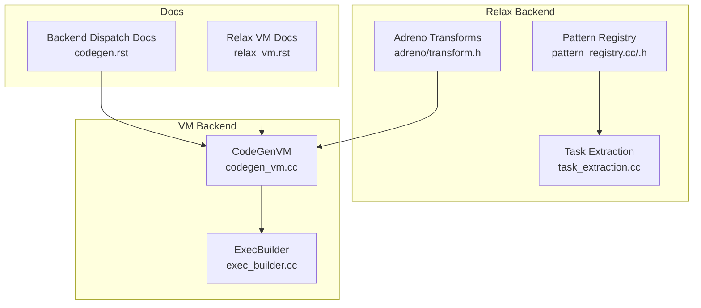
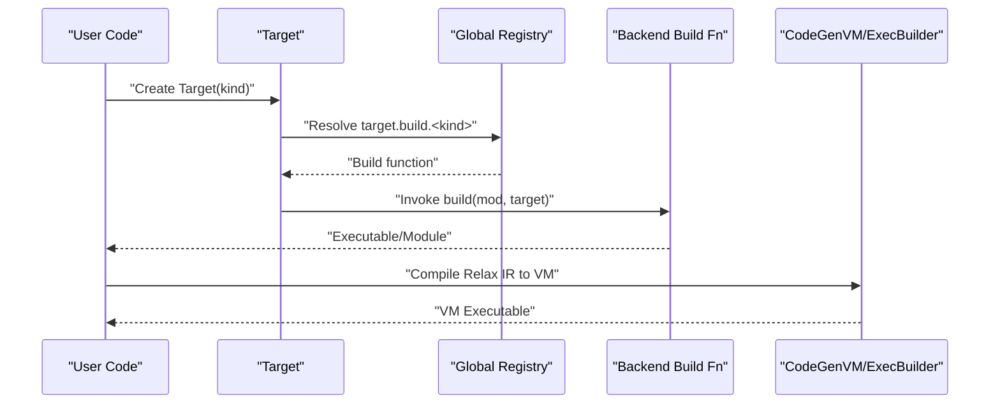
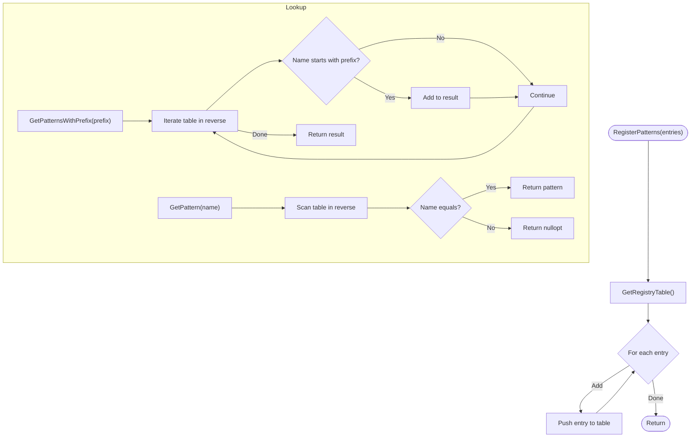
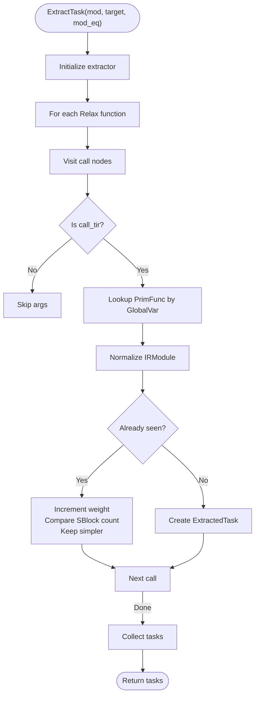
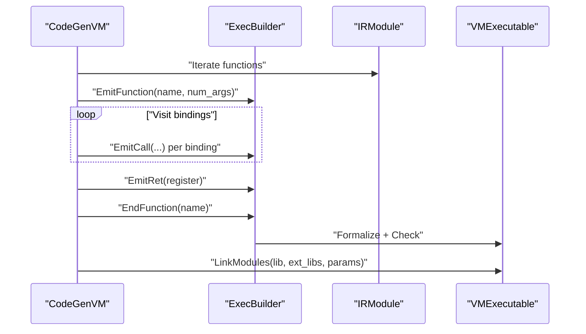
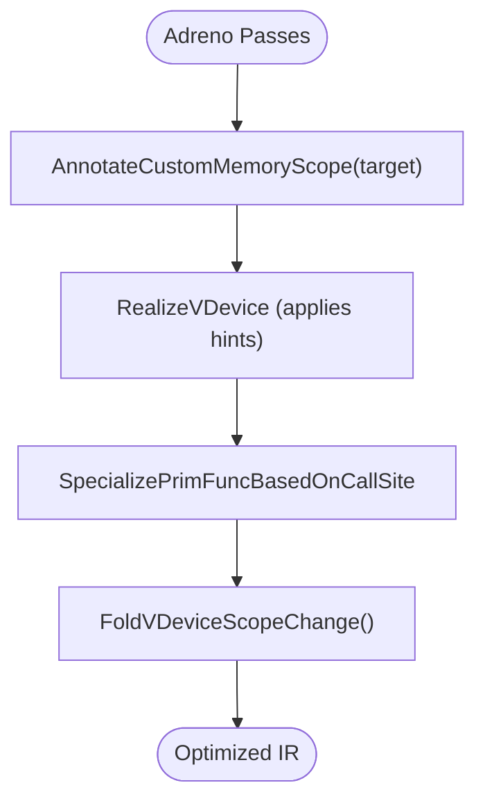
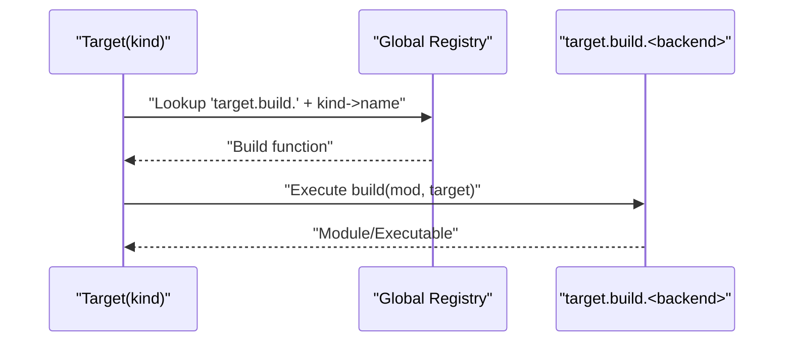
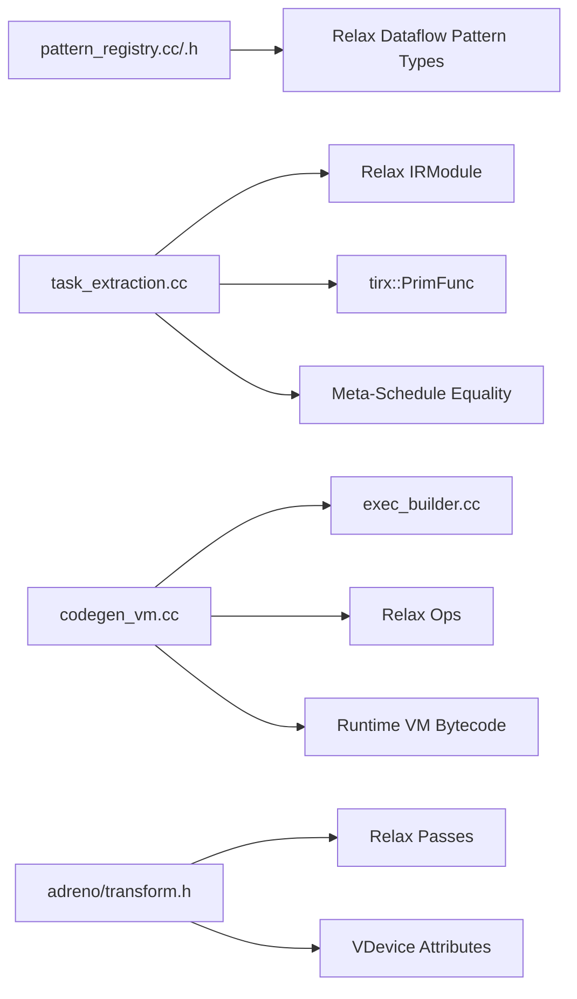

# Backend System

<cite>
**Referenced Files in This Document**
- [backend.h](file://include/tvm/relax/backend.h)
- [pattern_registry.h](file://src/relax/backend/pattern_registry.h)
- [pattern_registry.cc](file://src/relax/backend/pattern_registry.cc)
- [task_extraction.cc](file://src/relax/backend/task_extraction.cc)
- [transform.h](file://include/tvm/relax/backend/adreno/transform.h)
- [codegen_vm.cc](file://src/relax/backend/vm/codegen_vm.cc)
- [exec_builder.cc](file://src/relax/backend/vm/exec_builder.cc)
- [codegen.rst](file://docs/arch/codegen.rst)
- [relax_vm.rst](file://docs/arch/relax_vm.rst)
- [llvm_codegen_registry_test.cc](file://tests/cpp/llvm_codegen_registry_test.cc)
</cite>

## Table of Contents
1. [Introduction](#introduction)
2. [Project Structure](#project-structure)
3. [Core Components](#core-components)
4. [Architecture Overview](#architecture-overview)
5. [Detailed Component Analysis](#detailed-component-analysis)
6. [Dependency Analysis](#dependency-analysis)
7. [Performance Considerations](#performance-considerations)
8. [Troubleshooting Guide](#troubleshooting-guide)
9. [Conclusion](#conclusion)
10. [Appendices](#appendices)

## Introduction
This document explains the Relax backend system in TVM, focusing on backend dispatch mechanisms, pattern matching for fusion and partitioning, and code generation coordination. It covers backend registration, target selection, and how specialized backends (CPU generic, CUDA, ROCm, Metal, and mobile backends) integrate with the compilation pipeline. Practical guidance is included for configuring backends, registering patterns, developing custom backends, testing strategies, performance optimization, and hardware-specific tuning.

## Project Structure
The Relax backend system spans several areas:
- Relax VM backend: bytecode emission and linking for the VM runtime.
- Pattern registry: registration and retrieval of fusion patterns used to partition computation graphs for external backends.
- Task extraction: extracting tunable tasks for meta-schedule from Relax IR.
- Adreno GPU transforms: device-specific passes for memory scopes and scope folding.
- Architecture docs: high-level backend dispatch and code generation overview.

**Diagram sources**
- [pattern_registry.cc:1-84](file://src/relax/backend/pattern_registry.cc#L1-L84)
- [pattern_registry.h:1-74](file://src/relax/backend/pattern_registry.h#L1-L74)
- [task_extraction.cc:1-155](file://src/relax/backend/task_extraction.cc#L1-L155)
- [transform.h:1-68](file://include/tvm/relax/backend/adreno/transform.h#L1-L68)
- [codegen_vm.cc:1-528](file://src/relax/backend/vm/codegen_vm.cc#L1-L528)
- [exec_builder.cc:1-391](file://src/relax/backend/vm/exec_builder.cc#L1-L391)
- [codegen.rst:64-123](file://docs/arch/codegen.rst#L64-L123)
- [relax_vm.rst:94-126](file://docs/arch/relax_vm.rst#L94-L126)

**Section sources**
- [backend.h:27-48](file://include/tvm/relax/backend.h#L27-L48)
- [codegen.rst:64-123](file://docs/arch/codegen.rst#L64-L123)
- [relax_vm.rst:94-126](file://docs/arch/relax_vm.rst#L94-L126)

## Core Components
- Backend passes for Relax: LowerRuntimeBuiltin and VMShapeLower are exposed to transform Relax programs for VM execution.
- Pattern registry: Registration, removal, and lookup of fusion patterns used to partition DataflowBlocks for external backends.
- Task extraction: Extracts tunable tasks from IRModule for meta-schedule tuning, with deduplication and weighting.
- VM code generation: Converts Relax IR to VM bytecode via CodeGenVM and builds executable via ExecBuilder.
- Adreno transforms: Device-specific passes for memory scope annotation and VDevice scope folding.

**Section sources**
- [backend.h:33-45](file://include/tvm/relax/backend.h#L33-L45)
- [pattern_registry.cc:34-79](file://src/relax/backend/pattern_registry.cc#L34-L79)
- [pattern_registry.h:41-67](file://src/relax/backend/pattern_registry.h#L41-L67)
- [task_extraction.cc:68-150](file://src/relax/backend/task_extraction.cc#L68-L150)
- [codegen_vm.cc:52-109](file://src/relax/backend/vm/codegen_vm.cc#L52-L109)
- [exec_builder.cc:36-48](file://src/relax/backend/vm/exec_builder.cc#L36-L48)
- [transform.h:52-59](file://include/tvm/relax/backend/adreno/transform.h#L52-L59)

## Architecture Overview
Backend dispatch and code generation are orchestrated by the Target subsystem. The high-level flow:
- Target object determines backend selection via a global registry keyed by target kind.
- Backends register build functions under target.build.<backend> keys.
- The Relax VM backend compiles Relax functions to VM bytecode or TIR for execution.

**Diagram sources**
- [codegen.rst:71-77](file://docs/arch/codegen.rst#L71-L77)
- [codegen.rst:85-115](file://docs/arch/codegen.rst#L85-L115)
- [relax_vm.rst:94-126](file://docs/arch/relax_vm.rst#L94-L126)
- [codegen_vm.cc:546-527](file://src/relax/backend/vm/codegen_vm.cc#L546-L527)

## Detailed Component Analysis

### Pattern Registry
The pattern registry manages fusion patterns used to partition Relax graphs for external backends. It supports:
- Registering patterns with priority ordering.
- Removing patterns by name.
- Prefix-based lookup and exact lookup.

**Diagram sources**
- [pattern_registry.cc:29-79](file://src/relax/backend/pattern_registry.cc#L29-L79)
- [pattern_registry.h:47-67](file://src/relax/backend/pattern_registry.h#L47-L67)

**Section sources**
- [pattern_registry.cc:34-79](file://src/relax/backend/pattern_registry.cc#L34-L79)
- [pattern_registry.h:41-67](file://src/relax/backend/pattern_registry.h#L41-L67)

### Task Extraction for Meta-Schedule
Task extraction identifies tunable schedules from Relax IRModule:
- Traverses Relax functions and collects call_tir invocations.
- Normalizes each referenced PrimFunc and deduplicates by structural hash.
- Weights tasks by Call-TIR usage counts; prefers simpler SBlock structures when equivalent.

**Diagram sources**
- [task_extraction.cc:68-150](file://src/relax/backend/task_extraction.cc#L68-L150)

**Section sources**
- [task_extraction.cc:68-150](file://src/relax/backend/task_extraction.cc#L68-L150)

### VM Code Generation and Execution Builder
CodeGenVM lowers Relax expressions to VM instructions and uses ExecBuilder to construct the executable:
- Registers and maps variables to VM registers.
- Emits instructions for calls, conditionals, tuples, shapes, constants, and allocations.
- Links external modules and parameters into the final executable.

**Diagram sources**
- [codegen_vm.cc:85-109](file://src/relax/backend/vm/codegen_vm.cc#L85-L109)
- [codegen_vm.cc:136-166](file://src/relax/backend/vm/codegen_vm.cc#L136-L166)
- [exec_builder.cc:97-134](file://src/relax/backend/vm/exec_builder.cc#L97-L134)
- [exec_builder.cc:181-263](file://src/relax/backend/vm/exec_builder.cc#L181-L263)
- [codegen_vm.cc:446-527](file://src/relax/backend/vm/codegen_vm.cc#L446-L527)

**Section sources**
- [codegen_vm.cc:52-109](file://src/relax/backend/vm/codegen_vm.cc#L52-L109)
- [codegen_vm.cc:136-166](file://src/relax/backend/vm/codegen_vm.cc#L136-L166)
- [exec_builder.cc:36-48](file://src/relax/backend/vm/exec_builder.cc#L36-L48)
- [exec_builder.cc:97-134](file://src/relax/backend/vm/exec_builder.cc#L97-L134)
- [exec_builder.cc:181-263](file://src/relax/backend/vm/exec_builder.cc#L181-L263)
- [relax_vm.rst:94-126](file://docs/arch/relax_vm.rst#L94-L126)

### Adreno GPU Transforms
Adreno-specific passes:
- AnnotateCustomMemoryScope: Propagates operator attributes and VDevice hints for memory scope.
- FoldVDeviceScopeChange: Optimizes redundant device copies for texture scopes.

**Diagram sources**
- [transform.h:52-59](file://include/tvm/relax/backend/adreno/transform.h#L52-L59)

**Section sources**
- [transform.h:43-59](file://include/tvm/relax/backend/adreno/transform.h#L43-L59)

### Backend Registration and Target Selection
Backend registration follows a global FFI registry keyed by target kind:
- Build functions are registered under target.build.<backend>.
- The dispatcher resolves the correct backend based on Target kind.
- Tests verify availability of codegen factories for known targets.

**Diagram sources**
- [codegen.rst:71-77](file://docs/arch/codegen.rst#L71-L77)
- [codegen.rst:85-115](file://docs/arch/codegen.rst#L85-L115)
- [llvm_codegen_registry_test.cc:41-62](file://tests/cpp/llvm_codegen_registry_test.cc#L41-L62)

**Section sources**
- [codegen.rst:64-123](file://docs/arch/codegen.rst#L64-L123)
- [llvm_codegen_registry_test.cc:41-62](file://tests/cpp/llvm_codegen_registry_test.cc#L41-L62)

## Dependency Analysis
- Pattern registry depends on Relax dataflow pattern types and FFI reflection for registration.
- Task extraction depends on Relax IR traversal, TIRx PrimFunc, and meta-schedule module equality.
- VM code generation depends on ExecBuilder, Relax ops, and runtime VM bytecode definitions.
- Adreno transforms depend on Relax passes and VDevice attributes.

**Diagram sources**
- [pattern_registry.cc:20-24](file://src/relax/backend/pattern_registry.cc#L20-L24)
- [task_extraction.cc:20-28](file://src/relax/backend/task_extraction.cc#L20-L28)
- [codegen_vm.cc:24-38](file://src/relax/backend/vm/codegen_vm.cc#L24-L38)
- [exec_builder.cc:23-24](file://src/relax/backend/vm/exec_builder.cc#L23-L24)
- [transform.h:27-41](file://include/tvm/relax/backend/adreno/transform.h#L27-L41)

**Section sources**
- [pattern_registry.cc:20-24](file://src/relax/backend/pattern_registry.cc#L20-L24)
- [task_extraction.cc:20-28](file://src/relax/backend/task_extraction.cc#L20-L28)
- [codegen_vm.cc:24-38](file://src/relax/backend/vm/codegen_vm.cc#L24-L38)
- [exec_builder.cc:23-24](file://src/relax/backend/vm/exec_builder.cc#L23-L24)
- [transform.h:27-41](file://include/tvm/relax/backend/adreno/transform.h#L27-L41)

## Performance Considerations
- VM bytecode vs compiled execution: The VM supports bytecode interpretation and compiled TIR codegen; compiled mode reduces dispatch overhead at the cost of larger code size.
- Pattern registry priority: Later-registered patterns take precedence during partitioning; place high-priority patterns last to maximize fusion opportunities.
- Task extraction weighting: Tasks are weighted by Call-TIR usage; tune fusion patterns to increase weights for hot paths.
- Adreno memory scope: Proper VDevice annotation and scope folding reduce unnecessary device copies and improve throughput.

[No sources needed since this section provides general guidance]

## Troubleshooting Guide
- VM executable validation: ExecBuilder performs checks to ensure registers are defined before use, constants and functions are in bounds, and function definitions are complete.
- Codegen factory availability: Verify backend codegen factories are registered globally for the target kind.
- Pattern lookup failures: Confirm pattern names and prefixes are correct; use GetPatternsWithPrefix to enumerate candidates.

**Section sources**
- [exec_builder.cc:181-263](file://src/relax/backend/vm/exec_builder.cc#L181-L263)
- [llvm_codegen_registry_test.cc:41-62](file://tests/cpp/llvm_codegen_registry_test.cc#L41-L62)
- [pattern_registry.cc:62-70](file://src/relax/backend/pattern_registry.cc#L62-L70)

## Conclusion
The Relax backend system integrates pattern-based partitioning, meta-schedule task extraction, and VM code generation to deliver efficient execution across diverse hardware. Backend dispatch is centralized via Target and FFI registries, while specialized passes (e.g., Adreno) enable hardware-specific optimizations. By leveraging the pattern registry, task extraction, and VM compilation pipeline, developers can configure, extend, and tune backends for optimal performance.

[No sources needed since this section summarizes without analyzing specific files]

## Appendices

### Practical Examples and How-To

- Backend configuration and target selection
  - Create a Target with a specific kind (e.g., CUDA, ROCm, Metal) and resolve the backend build function via the global registry.
  - Reference: [codegen.rst:71-77](file://docs/arch/codegen.rst#L71-L77), [codegen.rst:85-115](file://docs/arch/codegen.rst#L85-L115)

- Pattern registration and lookup
  - Register fusion patterns with RegisterPatterns; remove or filter by prefix using RemovePatterns and GetPatternsWithPrefix.
  - Reference: [pattern_registry.cc:34-79](file://src/relax/backend/pattern_registry.cc#L34-L79), [pattern_registry.h:47-67](file://src/relax/backend/pattern_registry.h#L47-L67)

- Custom backend development
  - Implement a build function registered under target.build.<your_backend> and ensure codegen factories are available.
  - Reference: [codegen.rst:79-115](file://docs/arch/codegen.rst#L79-L115), [llvm_codegen_registry_test.cc:41-62](file://tests/cpp/llvm_codegen_registry_test.cc#L41-L62)

- VM code generation and linking
  - Use CodeGenVM to lower Relax IR and ExecBuilder to formalize and validate the executable; link external modules and parameters.
  - Reference: [codegen_vm.cc:52-109](file://src/relax/backend/vm/codegen_vm.cc#L52-L109), [exec_builder.cc:97-134](file://src/relax/backend/vm/exec_builder.cc#L97-L134), [relax_vm.rst:94-126](file://docs/arch/relax_vm.rst#L94-L126)

- Hardware-specific tuning (Adreno)
  - Apply AnnotateCustomMemoryScope and FoldVDeviceScopeChange to optimize memory scope and eliminate redundant copies.
  - Reference: [transform.h:52-59](file://include/tvm/relax/backend/adreno/transform.h#L52-L59)