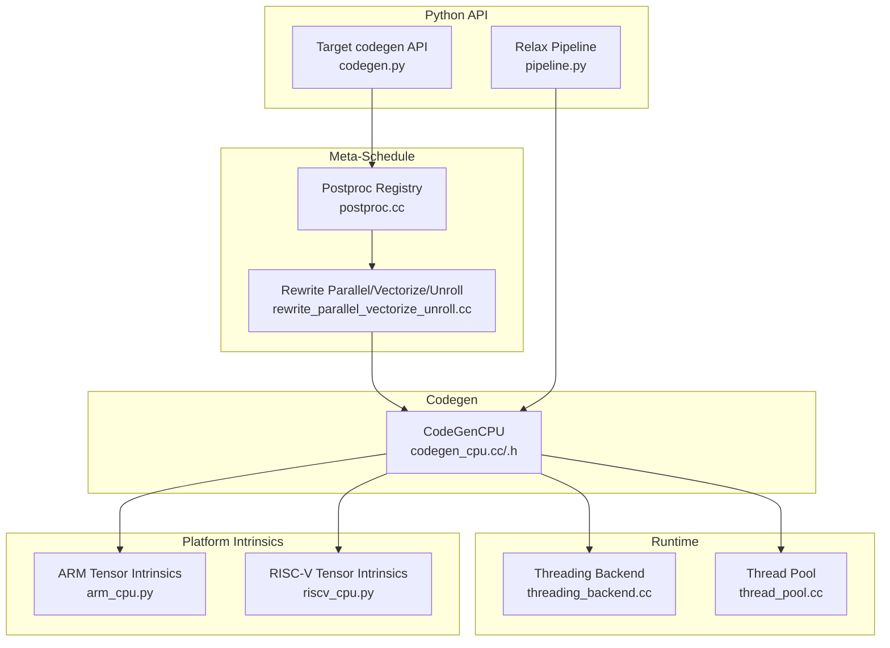
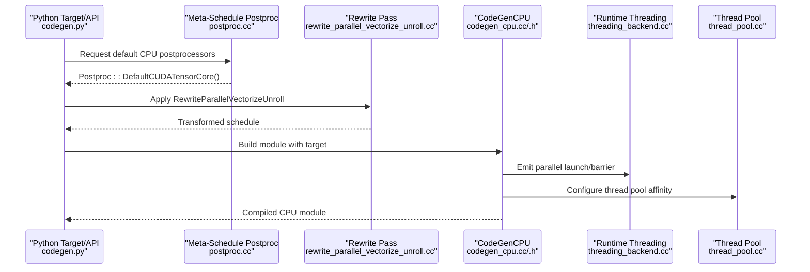
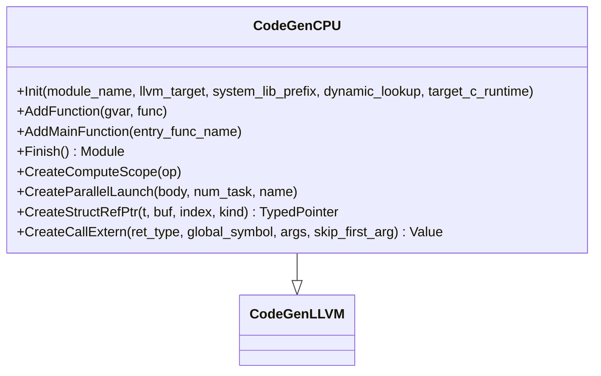
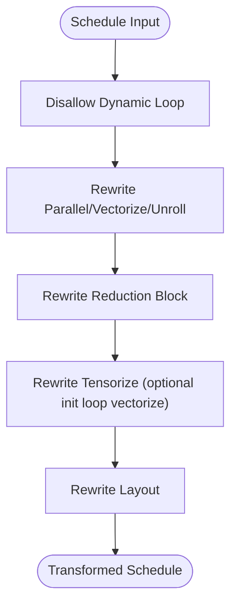
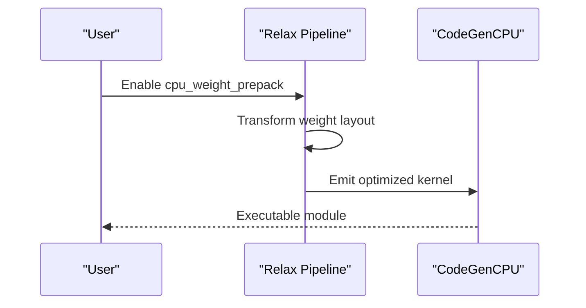
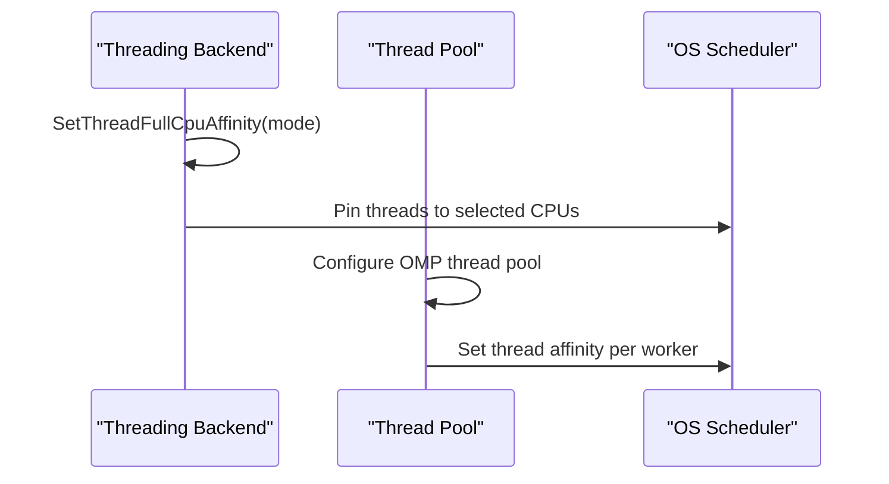
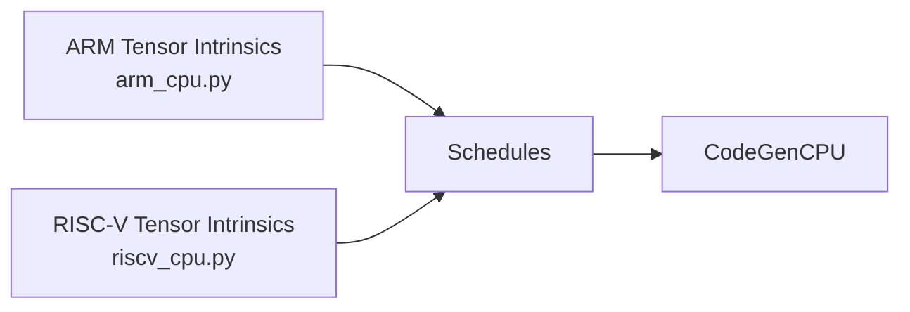
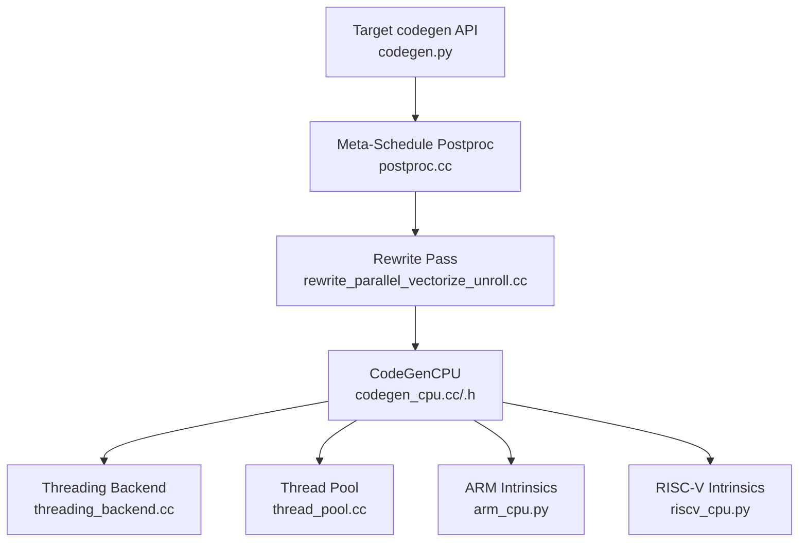

# CPU Generic Backend

<cite>
**Referenced Files in This Document**
- [codegen_cpu.cc](file://src/target/llvm/codegen_cpu.cc)
- [codegen_cpu.h](file://src/target/llvm/codegen_cpu.h)
- [codegen.py](file://python/tvm/target/codegen.py)
- [postproc.cc](file://src/s_tir/meta_schedule/postproc/postproc.cc)
- [rewrite_parallel_vectorize_unroll.cc](file://src/s_tir/meta_schedule/postproc/rewrite_parallel_vectorize_unroll.cc)
- [pipeline.py](file://python/tvm/relax/pipeline.py)
- [thread_pool.cc](file://src/runtime/thread_pool.cc)
- [threading_backend.cc](file://src/runtime/threading_backend.cc)
- [arm_cpu.py](file://python/tvm/s_tir/tensor_intrin/arm_cpu.py)
- [riscv_cpu.py](file://python/tvm/s_tir/tensor_intrin/riscv_cpu.py)
- [tag_registry/arm_cpu.py](file://python/tvm/target/tag_registry/arm_cpu.py)
- [tag_registry/riscv_cpu.py](file://python/tvm/target/tag_registry/riscv_cpu.py)
- [test_cpu_gemv.py](file://tests/python/s_tir/dlight/test_cpu_gemv.py)
- [test_cpu_reduction.py](file://tests/python/s_tir/dlight/test_cpu_reduction.py)
- [test_meta_schedule_space_cpu.py](file://tests/python/s_tir/meta_schedule/test_meta_schedule_space_cpu.py)
</cite>

## Table of Contents
1. [Introduction](#introduction)
2. [Project Structure](#project-structure)
3. [Core Components](#core-components)
4. [Architecture Overview](#architecture-overview)
5. [Detailed Component Analysis](#detailed-component-analysis)
6. [Dependency Analysis](#dependency-analysis)
7. [Performance Considerations](#performance-considerations)
8. [Troubleshooting Guide](#troubleshooting-guide)
9. [Conclusion](#conclusion)
10. [Appendices](#appendices)

## Introduction
This document explains the CPU generic backend in TVM, focusing on how CPU-specific optimizations are integrated into the code generation pipeline. It covers vectorization strategies, memory layout optimizations, loop transformations, and runtime integration for CPU targets. It also documents configuration and tuning parameters exposed via Python APIs, and highlights platform-specific optimizations for ARM and RISC-V.

## Project Structure
The CPU backend spans several layers:
- Target and code generation: CPU-specific LLVM IR emission and runtime linkage
- Meta-schedule postprocessing: automatic loop/vectorization/unrolling transformations
- Relax pipeline: optional weight prepacking for CPU inference
- Runtime threading: CPU core affinity and thread pools
- Platform intrinsics: vector instruction hints for ARM and RISC-V
- Tests: validation of CPU scheduling and tuning

**Diagram sources**
- [codegen.py:1-251](file://python/tvm/target/codegen.py#L1-L251)
- [postproc.cc:73-104](file://src/s_tir/meta_schedule/postproc/postproc.cc#L73-L104)
- [rewrite_parallel_vectorize_unroll.cc:179-210](file://src/s_tir/meta_schedule/postproc/rewrite_parallel_vectorize_unroll.cc#L179-L210)
- [codegen_cpu.cc:1-278](file://src/target/llvm/codegen_cpu.cc#L1-L278)
- [codegen_cpu.h:62-199](file://src/target/llvm/codegen_cpu.h#L62-L199)
- [threading_backend.cc:261-295](file://src/runtime/threading_backend.cc#L261-L295)
- [thread_pool.cc:409-445](file://src/runtime/thread_pool.cc#L409-L445)
- [arm_cpu.py](file://python/tvm/s_tir/tensor_intrin/arm_cpu.py)
- [riscv_cpu.py](file://python/tvm/s_tir/tensor_intrin/riscv_cpu.py)

**Section sources**
- [codegen_cpu.cc:1-278](file://src/target/llvm/codegen_cpu.cc#L1-L278)
- [codegen_cpu.h:62-199](file://src/target/llvm/codegen_cpu.h#L62-L199)
- [codegen.py:1-251](file://python/tvm/target/codegen.py#L1-L251)
- [postproc.cc:73-104](file://src/s_tir/meta_schedule/postproc/postproc.cc#L73-L104)
- [rewrite_parallel_vectorize_unroll.cc:179-210](file://src/s_tir/meta_schedule/postproc/rewrite_parallel_vectorize_unroll.cc#L179-L210)
- [pipeline.py:119-150](file://python/tvm/relax/pipeline.py#L119-L150)
- [threading_backend.cc:261-295](file://src/runtime/threading_backend.cc#L261-L295)
- [thread_pool.cc:409-445](file://src/runtime/thread_pool.cc#L409-L445)
- [arm_cpu.py](file://python/tvm/s_tir/tensor_intrin/arm_cpu.py)
- [riscv_cpu.py](file://python/tvm/s_tir/tensor_intrin/riscv_cpu.py)

## Core Components
- CodeGenCPU: CPU-specific LLVM IR emitter that initializes TVM runtime types, sets up debug info, and emits wrappers and parallel constructs.
- Meta-schedule postprocessors: Default CPU postprocessors include parallel/vectorize/unroll rewriting and layout rewrites.
- Relax pipeline: Optional CPU weight prepacking flag to improve inference performance.
- Runtime threading: CPU affinity and thread pool configuration for CPU workloads.
- Platform intrinsics: Vector instruction hints for ARM and RISC-V to guide scheduling.

Key responsibilities:
- Emitting CPU entry points and wrappers
- Managing TVM runtime function handles and context pointers
- Supporting parallel launch and barrier constructs
- Integrating with meta-schedule vectorization and loop transformations
- Exposing CPU feature detection and vector width queries

**Section sources**
- [codegen_cpu.cc:71-182](file://src/target/llvm/codegen_cpu.cc#L71-L182)
- [codegen_cpu.cc:215-278](file://src/target/llvm/codegen_cpu.cc#L215-L278)
- [codegen_cpu.h:62-199](file://src/target/llvm/codegen_cpu.h#L62-L199)
- [postproc.cc:73-104](file://src/s_tir/meta_schedule/postproc/postproc.cc#L73-L104)
- [pipeline.py:119-150](file://python/tvm/relax/pipeline.py#L119-L150)
- [threading_backend.cc:261-295](file://src/runtime/threading_backend.cc#L261-L295)
- [thread_pool.cc:409-445](file://src/runtime/thread_pool.cc#L409-L445)
- [arm_cpu.py](file://python/tvm/s_tir/tensor_intrin/arm_cpu.py)
- [riscv_cpu.py](file://python/tvm/s_tir/tensor_intrin/riscv_cpu.py)

## Architecture Overview
The CPU backend integrates Python-target configuration, meta-schedule transformations, and LLVM code emission with runtime threading and platform intrinsics.

**Diagram sources**
- [codegen.py:1-251](file://python/tvm/target/codegen.py#L1-L251)
- [postproc.cc:73-104](file://src/s_tir/meta_schedule/postproc/postproc.cc#L73-L104)
- [rewrite_parallel_vectorize_unroll.cc:179-210](file://src/s_tir/meta_schedule/postproc/rewrite_parallel_vectorize_unroll.cc#L179-L210)
- [codegen_cpu.cc:628-729](file://src/target/llvm/codegen_cpu.cc#L628-L729)
- [threading_backend.cc:261-295](file://src/runtime/threading_backend.cc#L261-L295)
- [thread_pool.cc:409-445](file://src/runtime/thread_pool.cc#L409-L445)

## Detailed Component Analysis

### CodeGenCPU: CPU Code Generation and Runtime Integration
CodeGenCPU extends the LLVM code generator to emit CPU-specific constructs:
- Initializes TVM runtime types and function signatures
- Emits a main wrapper for entry functions
- Manages packed function handles and lazy resolution
- Supports parallel launch and barrier constructs
- Provides helpers for struct field access and closure packing

**Diagram sources**
- [codegen_cpu.h:62-199](file://src/target/llvm/codegen_cpu.h#L62-L199)
- [codegen_cpu.cc:71-182](file://src/target/llvm/codegen_cpu.cc#L71-L182)
- [codegen_cpu.cc:215-278](file://src/target/llvm/codegen_cpu.cc#L215-L278)
- [codegen_cpu.cc:495-588](file://src/target/llvm/codegen_cpu.cc#L495-L588)
- [codegen_cpu.cc:628-729](file://src/target/llvm/codegen_cpu.cc#L628-L729)
- [codegen_cpu.cc:280-393](file://src/target/llvm/codegen_cpu.cc#L280-L393)

Key implementation notes:
- Debug info creation and function emission
- Struct field accessors for TVM arrays and FFI-any
- Lazy packed function handle resolution
- Parallel launch closure packing and unpacking

**Section sources**
- [codegen_cpu.cc:71-182](file://src/target/llvm/codegen_cpu.cc#L71-L182)
- [codegen_cpu.cc:184-226](file://src/target/llvm/codegen_cpu.cc#L184-L226)
- [codegen_cpu.cc:228-278](file://src/target/llvm/codegen_cpu.cc#L228-L278)
- [codegen_cpu.cc:280-393](file://src/target/llvm/codegen_cpu.cc#L280-L393)
- [codegen_cpu.cc:395-426](file://src/target/llvm/codegen_cpu.cc#L395-L426)
- [codegen_cpu.cc:428-478](file://src/target/llvm/codegen_cpu.cc#L428-L478)
- [codegen_cpu.cc:480-493](file://src/target/llvm/codegen_cpu.cc#L480-L493)
- [codegen_cpu.cc:495-588](file://src/target/llvm/codegen_cpu.cc#L495-L588)
- [codegen_cpu.cc:590-626](file://src/target/llvm/codegen_cpu.cc#L590-L626)
- [codegen_cpu.cc:628-729](file://src/target/llvm/codegen_cpu.cc#L628-L729)
- [codegen_cpu.cc:731-786](file://src/target/llvm/codegen_cpu.cc#L731-L786)
- [codegen_cpu.cc:788-806](file://src/target/llvm/codegen_cpu.cc#L788-L806)
- [codegen_cpu.h:62-199](file://src/target/llvm/codegen_cpu.h#L62-L199)

### Meta-Schedule Postprocessors: Vectorization and Loop Rewrites
The CPU default postprocessors include:
- Disallow dynamic loops
- Rewrite parallel/vectorize/unroll
- Rewrite reduction blocks
- Rewrite tensorization (vectorize init loop optional)
- Layout rewrites

**Diagram sources**
- [postproc.cc:73-104](file://src/s_tir/meta_schedule/postproc/postproc.cc#L73-L104)
- [rewrite_parallel_vectorize_unroll.cc:179-210](file://src/s_tir/meta_schedule/postproc/rewrite_parallel_vectorize_unroll.cc#L179-L210)

Implementation highlights:
- Parallel/vectorize/unroll rewrite considers contiguous memory access and loop iterator types
- Vectorization extent and parallel extent adjustments are computed from buffer access patterns

**Section sources**
- [postproc.cc:73-104](file://src/s_tir/meta_schedule/postproc/postproc.cc#L73-L104)
- [rewrite_parallel_vectorize_unroll.cc:179-210](file://src/s_tir/meta_schedule/postproc/rewrite_parallel_vectorize_unroll.cc#L179-L210)

### Relax Pipeline: CPU Weight Prepacking
The Relax pipeline exposes a CPU weight prepacking option to improve inference performance on CPU targets. Enabling this feature adds an explicit layout transformation step, which affects deployment interfaces.

**Diagram sources**
- [pipeline.py:119-150](file://python/tvm/relax/pipeline.py#L119-L150)

**Section sources**
- [pipeline.py:119-150](file://python/tvm/relax/pipeline.py#L119-L150)

### Runtime Threading: CPU Affinity and Thread Pools
The runtime integrates CPU core affinity and thread pool configuration:
- Thread group affinity modes for pinning threads to cores
- Support for little/big core selection and sharing modes
- OpenMP-based thread pool configuration

**Diagram sources**
- [threading_backend.cc:261-295](file://src/runtime/threading_backend.cc#L261-L295)
- [thread_pool.cc:409-445](file://src/runtime/thread_pool.cc#L409-L445)

**Section sources**
- [threading_backend.cc:261-295](file://src/runtime/threading_backend.cc#L261-L295)
- [thread_pool.cc:409-445](file://src/runtime/thread_pool.cc#L409-L445)

### Platform-Specific Intrinsics: ARM and RISC-V
Vector instruction hints for ARM and RISC-V are provided via tensor intrinsics modules. These help guide scheduling toward SIMD-friendly patterns.

**Diagram sources**
- [arm_cpu.py](file://python/tvm/s_tir/tensor_intrin/arm_cpu.py)
- [riscv_cpu.py](file://python/tvm/s_tir/tensor_intrin/riscv_cpu.py)
- [codegen_cpu.cc:628-729](file://src/target/llvm/codegen_cpu.cc#L628-L729)

**Section sources**
- [arm_cpu.py](file://python/tvm/s_tir/tensor_intrin/arm_cpu.py)
- [riscv_cpu.py](file://python/tvm/s_tir/tensor_intrin/riscv_cpu.py)

## Dependency Analysis
The CPU backend depends on:
- Python target codegen API for feature detection and vector width
- Meta-schedule postprocessors for automatic loop/vectorization transforms
- CodeGenCPU for emitting CPU-specific IR and runtime constructs
- Runtime threading for CPU core affinity and thread pool configuration
- Platform intrinsics for vector instruction hints

**Diagram sources**
- [codegen.py:1-251](file://python/tvm/target/codegen.py#L1-L251)
- [postproc.cc:73-104](file://src/s_tir/meta_schedule/postproc/postproc.cc#L73-L104)
- [rewrite_parallel_vectorize_unroll.cc:179-210](file://src/s_tir/meta_schedule/postproc/rewrite_parallel_vectorize_unroll.cc#L179-L210)
- [codegen_cpu.cc:628-729](file://src/target/llvm/codegen_cpu.cc#L628-L729)
- [threading_backend.cc:261-295](file://src/runtime/threading_backend.cc#L261-L295)
- [thread_pool.cc:409-445](file://src/runtime/thread_pool.cc#L409-L445)
- [arm_cpu.py](file://python/tvm/s_tir/tensor_intrin/arm_cpu.py)
- [riscv_cpu.py](file://python/tvm/s_tir/tensor_intrin/riscv_cpu.py)

**Section sources**
- [codegen.py:1-251](file://python/tvm/target/codegen.py#L1-L251)
- [postproc.cc:73-104](file://src/s_tir/meta_schedule/postproc/postproc.cc#L73-L104)
- [rewrite_parallel_vectorize_unroll.cc:179-210](file://src/s_tir/meta_schedule/postproc/rewrite_parallel_vectorize_unroll.cc#L179-L210)
- [codegen_cpu.cc:628-729](file://src/target/llvm/codegen_cpu.cc#L628-L729)
- [threading_backend.cc:261-295](file://src/runtime/threading_backend.cc#L261-L295)
- [thread_pool.cc:409-445](file://src/runtime/thread_pool.cc#L409-L445)
- [arm_cpu.py](file://python/tvm/s_tir/tensor_intrin/arm_cpu.py)
- [riscv_cpu.py](file://python/tvm/s_tir/tensor_intrin/riscv_cpu.py)

## Performance Considerations
- Vectorization and loop transformations: The meta-schedule postprocessors automatically adjust parallel and vectorization extents based on buffer access patterns and contiguous memory access.
- CPU feature detection: Use target codegen APIs to query CPU features and vector widths for selecting appropriate kernels.
- Thread affinity: Configure thread affinity to avoid contention on big.LITTLE systems and to keep compute-bound threads on suitable cores.
- Weight prepacking: Enabling CPU weight prepacking can reduce overhead during inference at the cost of an extra layout transformation step.

[No sources needed since this section provides general guidance]

## Troubleshooting Guide
Common issues and remedies:
- Parallel launch without parallel loops: Ensure that parallel regions contain at least one parallel loop; otherwise, a runtime assertion will trigger.
- Function handle resolution failures: Lazy packed function handle resolution returns early on failure; verify module context and function names.
- Vectorization not applied: Confirm that buffer accesses are sufficiently contiguous and that vectorization extents are feasible for the schedule.

**Section sources**
- [codegen_cpu.cc:677-679](file://src/target/llvm/codegen_cpu.cc#L677-L679)
- [codegen_cpu.cc:760-785](file://src/target/llvm/codegen_cpu.cc#L760-L785)
- [rewrite_parallel_vectorize_unroll.cc:179-210](file://src/s_tir/meta_schedule/postproc/rewrite_parallel_vectorize_unroll.cc#L179-L210)

## Conclusion
The CPU generic backend in TVM combines a robust LLVM-based code generator with meta-schedule-driven loop/vectorization transformations, runtime threading controls, and platform-specific intrinsics. Together, these components enable efficient CPU code generation across diverse architectures while exposing tunable parameters for performance optimization.

[No sources needed since this section summarizes without analyzing specific files]

## Appendices

### CPU Backend Configuration and Tuning Parameters
- CPU feature detection and vector width:
  - Use target codegen APIs to query CPU features and vector widths for the target triple and CPU.
- CPU weight prepacking:
  - Enable the cpu_weight_prepack option in the Relax pipeline to improve inference performance on CPU targets.

**Section sources**
- [codegen.py:173-229](file://python/tvm/target/codegen.py#L173-L229)
- [pipeline.py:119-150](file://python/tvm/relax/pipeline.py#L119-L150)

### Examples of CPU Backend Usage
- Vectorization and reduction tuning:
  - Tests demonstrate vectorization and reduction scheduling on CPU targets.
- Meta-schedule space exploration on CPU:
  - Tests show meta-schedule space generation and measurement on CPU targets.

**Section sources**
- [test_cpu_gemv.py](file://tests/python/s_tir/dlight/test_cpu_gemv.py)
- [test_cpu_reduction.py](file://tests/python/s_tir/dlight/test_cpu_reduction.py)
- [test_meta_schedule_space_cpu.py](file://tests/python/s_tir/meta_schedule/test_meta_schedule_space_cpu.py)