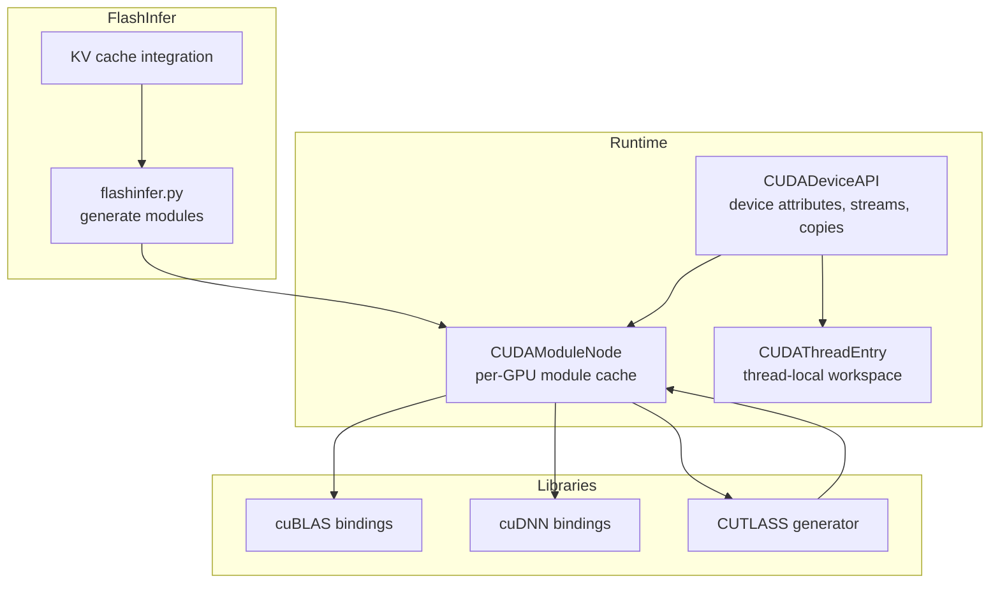
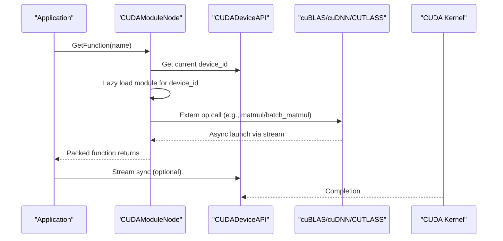
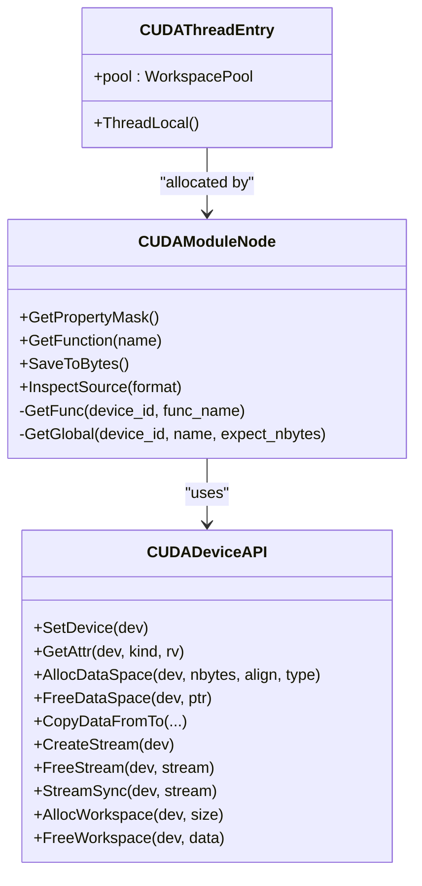
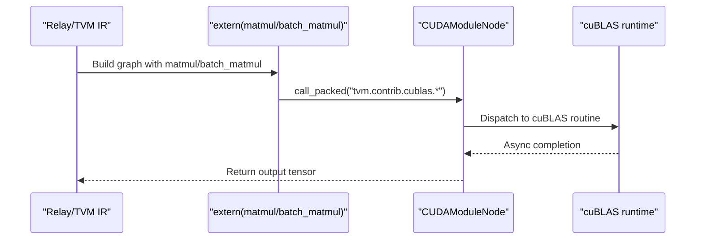
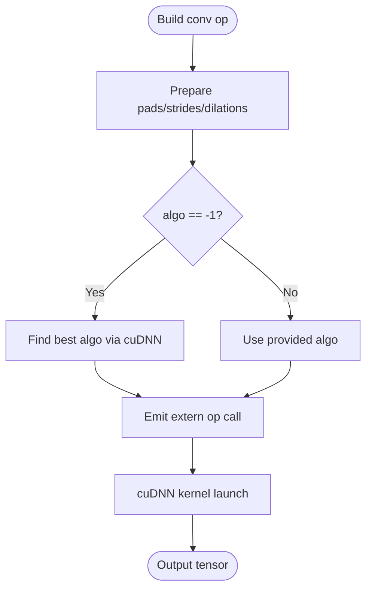
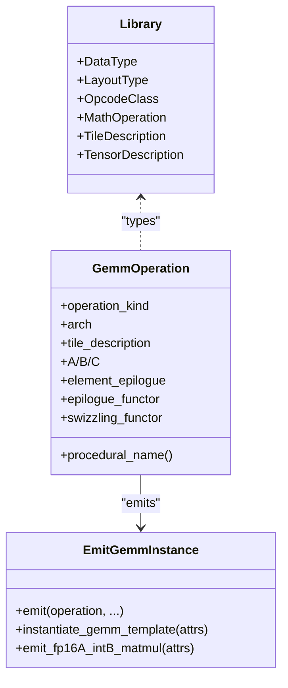
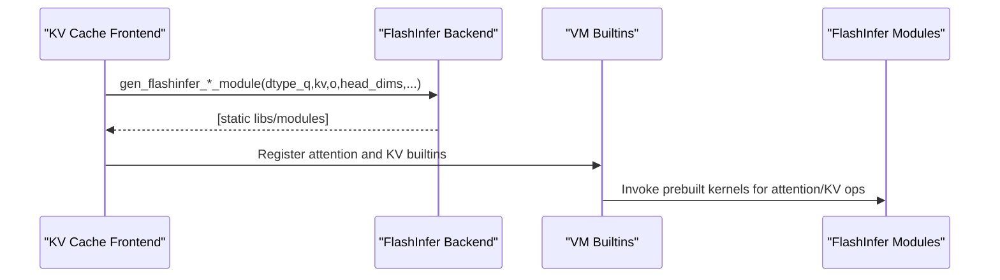
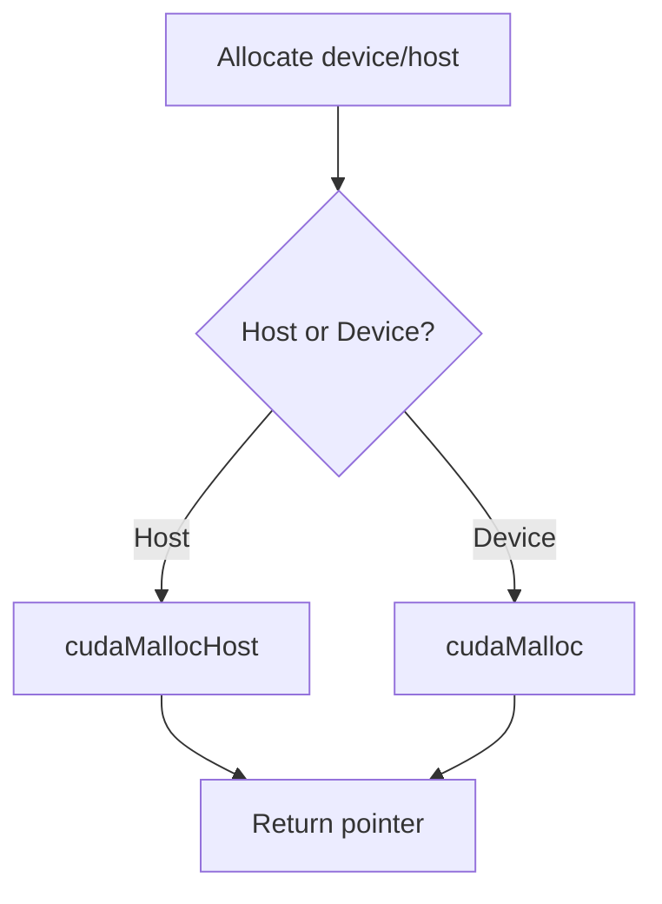
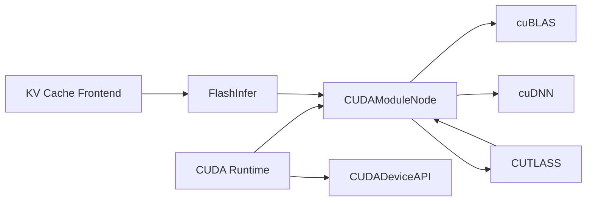

# CUDA Backend

<cite>
**Referenced Files in This Document**
- [cuda_common.h](file://src/runtime/cuda/cuda_common.h)
- [cuda_device_api.cc](file://src/runtime/cuda/cuda_device_api.cc)
- [cuda_module.cc](file://src/runtime/cuda/cuda_module.cc)
- [cublas.py](file://python/tvm/contrib/cublas.py)
- [cudnn.py](file://python/tvm/contrib/cudnn.py)
- [cutlass/__init__.py](file://python/tvm/contrib/cutlass/__init__.py)
- [cutlass/library.py](file://python/tvm/contrib/cutlass/library.py)
- [cutlass/gemm_operation.py](file://python/tvm/contrib/cutlass/gemm_operation.py)
- [flashinfer.py](file://python/tvm/relax/backend/cuda/flashinfer.py)
- [flash.cu](file://3rdparty/libflash_attn/src/flash.cu)
- [utils.h](file://3rdparty/libflash_attn/src/utils.h)
- [CMakeLists.txt](file://3rdparty/libflash_attn/src/CMakeLists.txt)
- [kv_cache.py](file://python/tvm/relax/frontend/nn/llm/kv_cache.py)
- [test_runtime_builtin_paged_attention_kv_cache_flashinfer.py](file://tests/python/relax/test_runtime_builtin_paged_attention_kv_cache_flashinfer.py)
</cite>

## Table of Contents
1. [Introduction](#introduction)
2. [Project Structure](#project-structure)
3. [Core Components](#core-components)
4. [Architecture Overview](#architecture-overview)
5. [Detailed Component Analysis](#detailed-component-analysis)
6. [Dependency Analysis](#dependency-analysis)
7. [Performance Considerations](#performance-considerations)
8. [Troubleshooting Guide](#troubleshooting-guide)
9. [Conclusion](#conclusion)
10. [Appendices](#appendices)

## Introduction
This document describes the CUDA backend system in the repository, focusing on runtime integration, external library bindings (cuBLAS, cuDNN, CUTLASS), FlashInfer optimizations, and memory management. It explains how TVM compiles and launches CUDA kernels, integrates third-party libraries, and exposes configuration points for performance tuning. It also covers multi-GPU execution, memory coalescing patterns, warp-level optimizations, and profiling hooks.

## Project Structure
The CUDA backend spans several layers:
- Runtime: device API, module loader, timers, and memory utilities
- External library bindings: cuBLAS, cuDNN, CUTLASS
- FlashInfer integration: precompiled modules for attention workloads
- Tests and examples: demonstrate configuration and usage

**Diagram sources**
- [cuda_device_api.cc:39-274](file://src/runtime/cuda/cuda_device_api.cc#L39-L274)
- [cuda_module.cc:51-174](file://src/runtime/cuda/cuda_module.cc#L51-L174)
- [cublas.py:23-87](file://python/tvm/contrib/cublas.py#L23-L87)
- [cudnn.py:529-675](file://python/tvm/contrib/cudnn.py#L529-L675)
- [cutlass/gemm_operation.py:24-118](file://python/tvm/contrib/cutlass/gemm_operation.py#L24-L118)
- [flashinfer.py](file://python/tvm/relax/backend/cuda/flashinfer.py)
- [kv_cache.py:406-443](file://python/tvm/relax/frontend/nn/llm/kv_cache.py#L406-L443)

**Section sources**
- [cuda_device_api.cc:39-274](file://src/runtime/cuda/cuda_device_api.cc#L39-L274)
- [cuda_module.cc:51-174](file://src/runtime/cuda/cuda_module.cc#L51-L174)

## Core Components
- CUDA device API: queries device attributes, allocates/free memory, synchronizes streams, and manages timers
- CUDA module loader: loads PTX/CUBIN, lazily initializes per-GPU modules, and launches kernels with configurable launch parameters
- External library bindings:
  - cuBLAS: extern ops for matrix multiplication and batched GEMM
  - cuDNN: extern ops for convolution forward/backward with algorithm selection helpers
  - CUTLASS: Python generators for GEMM/Conv templates and host code instantiation
- FlashInfer: prebuilt attention modules integrated via Relax backend and KV cache frontend

**Section sources**
- [cuda_device_api.cc:42-134](file://src/runtime/cuda/cuda_device_api.cc#L42-L134)
- [cuda_module.cc:115-135](file://src/runtime/cuda/cuda_module.cc#L115-L135)
- [cublas.py:23-87](file://python/tvm/contrib/cublas.py#L23-L87)
- [cudnn.py:529-675](file://python/tvm/contrib/cudnn.py#L529-L675)
- [cutlass/gemm_operation.py:24-118](file://python/tvm/contrib/cutlass/gemm_operation.py#L24-L118)
- [flashinfer.py](file://python/tvm/relax/backend/cuda/flashinfer.py)

## Architecture Overview
The CUDA backend composes runtime, external libraries, and attention optimizations:
- Runtime sets device, creates streams, and executes kernels
- External libraries provide optimized kernels via extern ops
- CUTLASS generates and instantiates high-performance kernels
- FlashInfer provides specialized attention kernels integrated into Relax

**Diagram sources**
- [cuda_module.cc:189-255](file://src/runtime/cuda/cuda_module.cc#L189-L255)
- [cuda_device_api.cc:223-250](file://src/runtime/cuda/cuda_device_api.cc#L223-L250)
- [cublas.py:45-53](file://python/tvm/contrib/cublas.py#L45-L53)
- [cudnn.py:628-649](file://python/tvm/contrib/cudnn.py#L628-L649)

## Detailed Component Analysis

### CUDA Runtime: Device API and Module Loader
- Device API:
  - Queries device attributes (max threads/block, warp size, L2 cache, memory)
  - Allocates device/host memory with proper alignment
  - Copies across CPU/GPU/peer devices asynchronously
  - Creates/destroys streams and synchronizes across streams
  - Provides CUDA timer backed by events
- Module loader:
  - Per-GPU module caching with lazy initialization
  - Retrieves CUfunction/CUdeviceptr and caches per device
  - Launches with cooperative or programmatic stream serialization when requested
  - Sets dynamic shared memory limits per kernel

**Diagram sources**
- [cuda_device_api.cc:39-274](file://src/runtime/cuda/cuda_device_api.cc#L39-L274)
- [cuda_module.cc:51-174](file://src/runtime/cuda/cuda_module.cc#L51-L174)
- [cuda_common.h:57-65](file://src/runtime/cuda/cuda_common.h#L57-L65)

**Section sources**
- [cuda_device_api.cc:42-134](file://src/runtime/cuda/cuda_device_api.cc#L42-L134)
- [cuda_device_api.cc:183-220](file://src/runtime/cuda/cuda_device_api.cc#L183-L220)
- [cuda_device_api.cc:223-250](file://src/runtime/cuda/cuda_device_api.cc#L223-L250)
- [cuda_device_api.cc:297-332](file://src/runtime/cuda/cuda_device_api.cc#L297-L332)
- [cuda_module.cc:115-135](file://src/runtime/cuda/cuda_module.cc#L115-L135)
- [cuda_module.cc:189-255](file://src/runtime/cuda/cuda_module.cc#L189-L255)
- [cuda_common.h:57-65](file://src/runtime/cuda/cuda_common.h#L57-L65)

### cuBLAS Integration
- Extern ops expose cuBLAS GEMM and batched GEMM to Relay/TVM IR
- Uses packed function dispatch to the runtime’s cuBLAS wrapper
- Supports transpose flags and dtype inference

**Diagram sources**
- [cublas.py:23-87](file://python/tvm/contrib/cublas.py#L23-L87)
- [cuda_module.cc:189-255](file://src/runtime/cuda/cuda_module.cc#L189-L255)

**Section sources**
- [cublas.py:23-87](file://python/tvm/contrib/cublas.py#L23-L87)

### cuDNN Support
- Extern ops for 2D/3D convolution forward/backward with algorithm selection
- Helper functions to pick best algorithms for forward/backward data/filter
- Shape inference helpers for output and data gradients
- Dynamic vs static batch handling

**Diagram sources**
- [cudnn.py:529-675](file://python/tvm/contrib/cudnn.py#L529-L675)
- [cudnn.py:300-340](file://python/tvm/contrib/cudnn.py#L300-L340)

**Section sources**
- [cudnn.py:342-401](file://python/tvm/contrib/cudnn.py#L342-L401)
- [cudnn.py:403-463](file://python/tvm/contrib/cudnn.py#L403-L463)
- [cudnn.py:529-675](file://python/tvm/contrib/cudnn.py#L529-L675)

### CUTLASS Library Integration
- Python-side generators define data types, layouts, opcodes, math instructions, tiles, and epilogue functors
- GEMM operation builder emits CUTLASS device kernels and host code to instantiate and run them
- Supports residual blocks, bias, and activation fusion in generated kernels
- Specialized generator for FP16 input with int4/int8 quantized weights

**Diagram sources**
- [cutlass/library.py:28-302](file://python/tvm/contrib/cutlass/library.py#L28-L302)
- [cutlass/gemm_operation.py:24-118](file://python/tvm/contrib/cutlass/gemm_operation.py#L24-L118)
- [cutlass/gemm_operation.py:149-274](file://python/tvm/contrib/cutlass/gemm_operation.py#L149-L274)
- [cutlass/gemm_operation.py:277-413](file://python/tvm/contrib/cutlass/gemm_operation.py#L277-L413)
- [cutlass/gemm_operation.py:415-479](file://python/tvm/contrib/cutlass/gemm_operation.py#L415-L479)

**Section sources**
- [cutlass/library.py:28-302](file://python/tvm/contrib/cutlass/library.py#L28-L302)
- [cutlass/gemm_operation.py:24-118](file://python/tvm/contrib/cutlass/gemm_operation.py#L24-L118)
- [cutlass/gemm_operation.py:149-274](file://python/tvm/contrib/cutlass/gemm_operation.py#L149-L274)
- [cutlass/gemm_operation.py:277-413](file://python/tvm/contrib/cutlass/gemm_operation.py#L277-L413)
- [cutlass/gemm_operation.py:415-479](file://python/tvm/contrib/cutlass/gemm_operation.py#L415-L479)

### FlashInfer Optimizations
- Precompiled attention modules for prefill/decode/MLA modes
- Integrates with Relax backend and KV cache frontend
- Generates static libraries and wires into VM builtins for attention and KV state operations

**Diagram sources**
- [kv_cache.py:406-443](file://python/tvm/relax/frontend/nn/llm/kv_cache.py#L406-L443)
- [flashinfer.py](file://python/tvm/relax/backend/cuda/flashinfer.py)

**Section sources**
- [kv_cache.py:406-443](file://python/tvm/relax/frontend/nn/llm/kv_cache.py#L406-L443)
- [test_runtime_builtin_paged_attention_kv_cache_flashinfer.py:100-116](file://tests/python/relax/test_runtime_builtin_paged_attention_kv_cache_flashinfer.py#L100-L116)

### Memory Management Strategies
- Device memory allocation with 256-byte alignment
- Host pinned memory for faster transfers
- Peer-to-peer copies when devices differ
- Thread-local workspace pools per device
- Optional sticky-error guard during teardown to avoid cascading CUDA errors

**Diagram sources**
- [cuda_device_api.cc:136-151](file://src/runtime/cuda/cuda_device_api.cc#L136-L151)
- [cuda_device_api.cc:153-180](file://src/runtime/cuda/cuda_device_api.cc#L153-L180)

**Section sources**
- [cuda_device_api.cc:136-151](file://src/runtime/cuda/cuda_device_api.cc#L136-L151)
- [cuda_device_api.cc:153-180](file://src/runtime/cuda/cuda_device_api.cc#L153-L180)
- [cuda_common.h:57-65](file://src/runtime/cuda/cuda_common.h#L57-L65)

### Kernel Fusion Techniques
- CUTLASS epilogue functors fuse element-wise operations (e.g., bias, GELU, SiLU) into the GEMM kernel
- FlashInfer kernels fuse attention computation with memory access patterns suited for attention
- Residual block fusion in CUTLASS GEMM supports universal mode with broadcast and activation

**Section sources**
- [cutlass/gemm_operation.py:167-180](file://python/tvm/contrib/cutlass/gemm_operation.py#L167-L180)
- [cutlass/gemm_operation.py:202-274](file://python/tvm/contrib/cutlass/gemm_operation.py#L202-L274)
- [cutlass/gemm_operation.py:376-413](file://python/tvm/contrib/cutlass/gemm_operation.py#L376-L413)
- [flash.cu:17-46](file://3rdparty/libflash_attn/src/flash.cu#L17-L46)

### Multi-GPU Support
- Per-GPU module cache avoids redundant loads
- Peer-to-peer copy path for cross-device transfers
- Cooperative launch and programmatic stream serialization for multi-GPU scenarios

**Section sources**
- [cuda_module.cc:115-135](file://src/runtime/cuda/cuda_module.cc#L115-L135)
- [cuda_device_api.cc:204-210](file://src/runtime/cuda/cuda_device_api.cc#L204-L210)
- [cuda_module.cc:209-236](file://src/runtime/cuda/cuda_module.cc#L209-L236)

### Memory Coalescing Patterns and Warp-Level Optimizations
- CUTLASS tiling and swizzling functors improve memory throughput and reduce bank conflicts
- cuTensorMap (TMA) encoding exposed via runtime for tiled tensor memory access on supported architectures
- FlashAttention uses architecture-aware kernels and fused conversions on SM80+ for fast fp32->fp16/bf16 with relu

**Section sources**
- [cutlass/library.py:190-208](file://python/tvm/contrib/cutlass/library.py#L190-L208)
- [cuda_device_api.cc:397-586](file://src/runtime/cuda/cuda_device_api.cc#L397-L586)
- [utils.h:31-49](file://3rdparty/libflash_attn/src/utils.h#L31-L49)
- [utils.h:246-272](file://3rdparty/libflash_attn/src/utils.h#L246-L272)

### Pipeline Configuration and Performance Tuning
- CUTLASS TileDescription controls threadblock/warp/instruction shapes and stage counts
- Epilogue functors and math operations selected via enums
- cuDNN algorithm selection helpers and shape inference utilities
- FlashInfer module generation allows choosing data types and head dimensions

**Section sources**
- [cutlass/library.py:280-292](file://python/tvm/contrib/cutlass/library.py#L280-L292)
- [cutlass/library.py:68-78](file://python/tvm/contrib/cutlass/library.py#L68-L78)
- [cudnn.py:342-401](file://python/tvm/contrib/cudnn.py#L342-L401)
- [flashinfer.py](file://python/tvm/relax/backend/cuda/flashinfer.py)

### Examples: Configuration and Custom Kernel Integration
- cuBLAS: construct matmul/batch_matmul extern ops and infer dtype automatically
- cuDNN: select algorithm via helper functions or pass explicit algo index
- CUTLASS: define TileDescription/MathInstruction/Layout/Epilogue and emit host code
- FlashInfer: generate prefill/decode/MLA modules and integrate with KV cache

**Section sources**
- [cublas.py:23-87](file://python/tvm/contrib/cublas.py#L23-L87)
- [cudnn.py:529-675](file://python/tvm/contrib/cudnn.py#L529-L675)
- [cutlass/gemm_operation.py:277-413](file://python/tvm/contrib/cutlass/gemm_operation.py#L277-L413)
- [kv_cache.py:406-443](file://python/tvm/relax/frontend/nn/llm/kv_cache.py#L406-L443)

### Performance Profiling Techniques
- CUDA timer backed by events for accurate kernel timing
- Runtime exposes free/total device memory and device count
- Stream synchronization points for isolating kernel durations

**Section sources**
- [cuda_device_api.cc:297-332](file://src/runtime/cuda/cuda_device_api.cc#L297-L332)
- [cuda_device_api.cc:340-371](file://src/runtime/cuda/cuda_device_api.cc#L340-L371)

## Dependency Analysis
- Runtime depends on CUDA driver/runtime APIs and exposes device capabilities
- Module loader depends on runtime for device context and stream retrieval
- External library bindings depend on runtime’s packed function dispatch
- CUTLASS relies on Python-side templates and host code generation
- FlashInfer depends on Relax backend and KV cache frontend

**Diagram sources**
- [cuda_device_api.cc:39-274](file://src/runtime/cuda/cuda_device_api.cc#L39-L274)
- [cuda_module.cc:51-174](file://src/runtime/cuda/cuda_module.cc#L51-L174)
- [cublas.py:23-87](file://python/tvm/contrib/cublas.py#L23-L87)
- [cudnn.py:529-675](file://python/tvm/contrib/cudnn.py#L529-L675)
- [cutlass/gemm_operation.py:24-118](file://python/tvm/contrib/cutlass/gemm_operation.py#L24-L118)
- [flashinfer.py](file://python/tvm/relax/backend/cuda/flashinfer.py)
- [kv_cache.py:406-443](file://python/tvm/relax/frontend/nn/llm/kv_cache.py#L406-L443)

**Section sources**
- [cuda_device_api.cc:39-274](file://src/runtime/cuda/cuda_device_api.cc#L39-L274)
- [cuda_module.cc:51-174](file://src/runtime/cuda/cuda_module.cc#L51-L174)

## Performance Considerations
- Prefer column-major layouts and aligned leading dimensions for optimal memory access
- Use CUTLASS tiles and swizzlers appropriate for the target architecture
- Enable cooperative launch and programmatic stream serialization for multi-GPU
- Fuse element-wise operations via CUTLASS epilogue functors to reduce memory bandwidth
- On SM80+, leverage fused fp32->fp16/bf16 conversion with relu in FlashAttention
- Tune cuDNN algorithm selection for convolution workloads

[No sources needed since this section provides general guidance]

## Troubleshooting Guide
- CUDA launch failures: inspect grid/block dimensions and dynamic shared memory configuration
- Sticky CUDA errors during teardown: runtime guards prevent cascading exceptions
- cuTensorMap encoding errors: verify data type, alignment, and shape constraints
- Memory issues: ensure 256-byte alignment for device allocations and check free/total memory

**Section sources**
- [cuda_module.cc:238-254](file://src/runtime/cuda/cuda_module.cc#L238-L254)
- [cuda_device_api.cc:154-170](file://src/runtime/cuda/cuda_device_api.cc#L154-L170)
- [cuda_device_api.cc:439-586](file://src/runtime/cuda/cuda_device_api.cc#L439-L586)

## Conclusion
The CUDA backend integrates tightly with TVM’s runtime to provide efficient execution of heterogeneous kernels. Through cuBLAS, cuDNN, CUTLASS, and FlashInfer, it delivers high-performance primitives for linear algebra, convolution, and attention. The runtime ensures robust device management, memory safety, and profiling hooks, while exposing flexible configuration points for performance tuning across diverse hardware targets.

[No sources needed since this section summarizes without analyzing specific files]

## Appendices

### Hardware-Specific Tuning Options
- Compute capability detection and kernel selection (FlashAttention)
- cuTensorMap TMA encoding for tiled access on supported GPUs
- CUTLASS opcode class selection (TensorOp/WmmaTensorOp/SIMT)

**Section sources**
- [flash.cu:17-46](file://3rdparty/libflash_attn/src/flash.cu#L17-L46)
- [cuda_device_api.cc:397-586](file://src/runtime/cuda/cuda_device_api.cc#L397-L586)
- [cutlass/library.py:108-124](file://python/tvm/contrib/cutlass/library.py#L108-L124)

### FlashAttention Build Flags
- Example flags include relaxed constexpr, fast math, and sm_80 target

**Section sources**
- [CMakeLists.txt:1-3](file://3rdparty/libflash_attn/src/CMakeLists.txt#L1-L3)