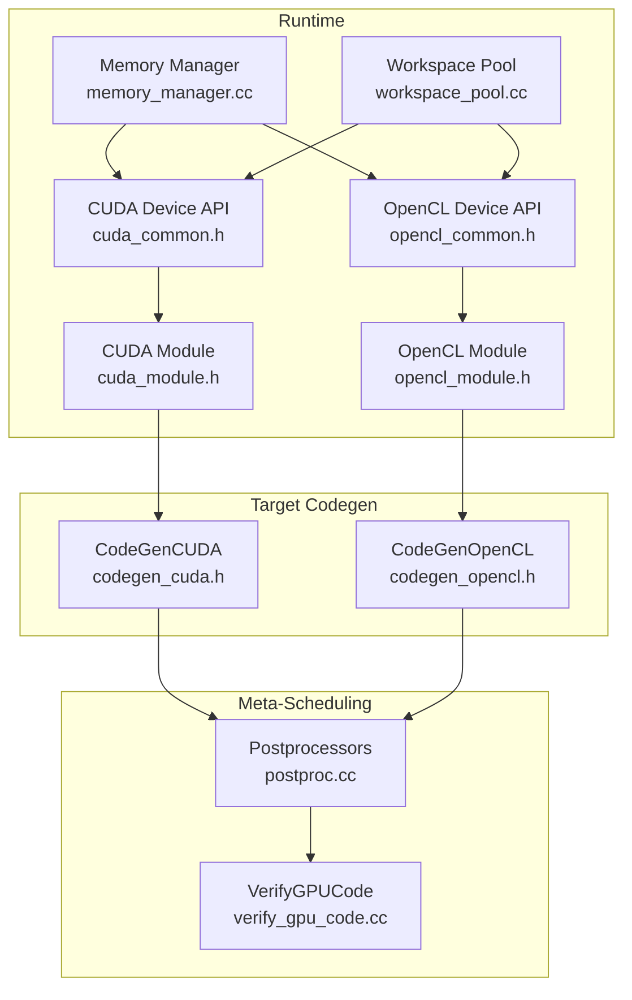
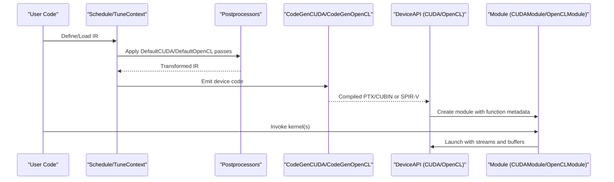
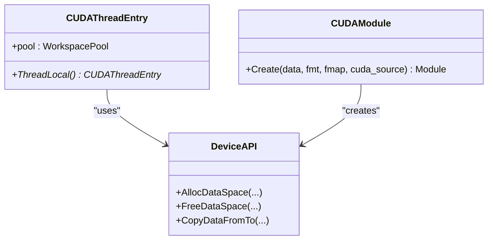
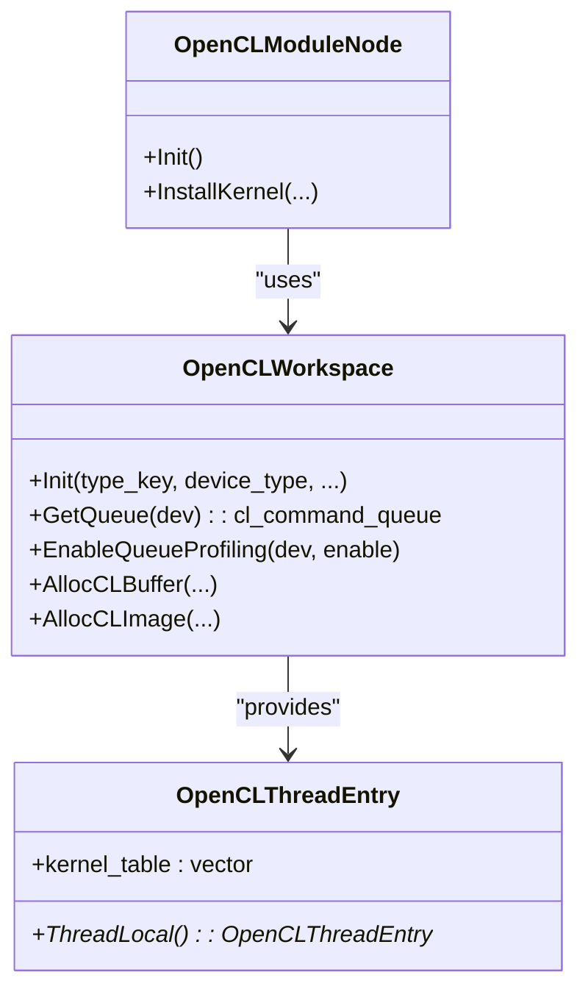
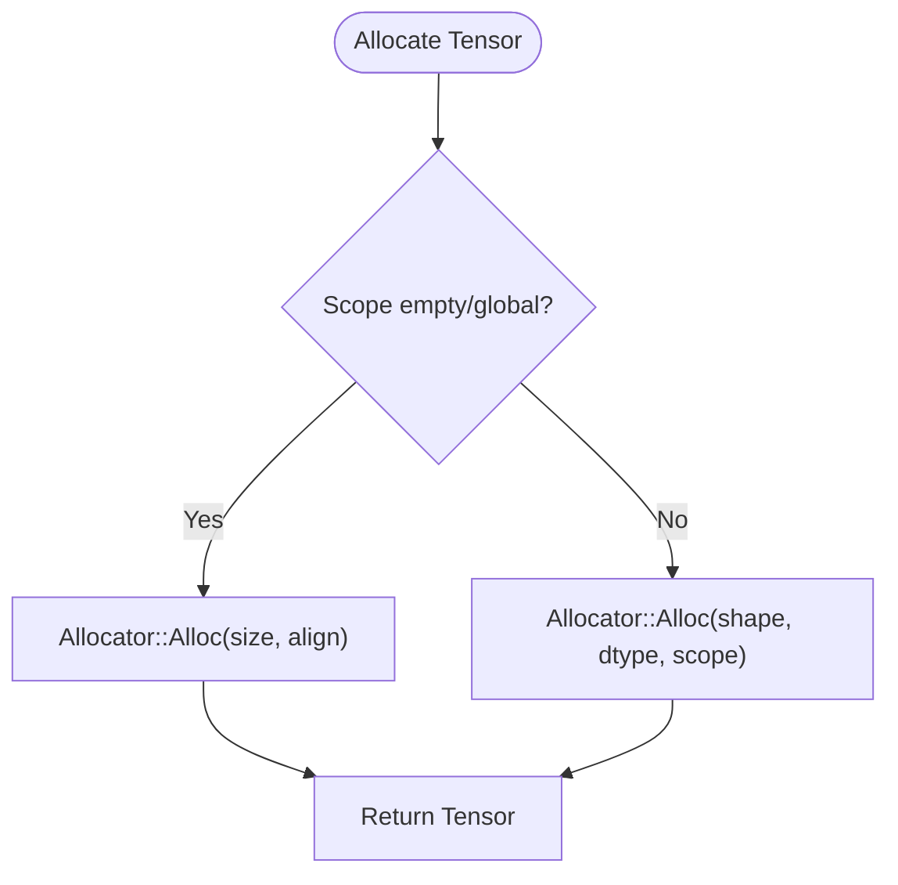
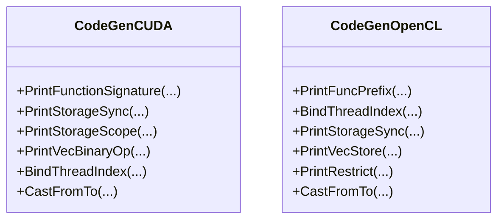
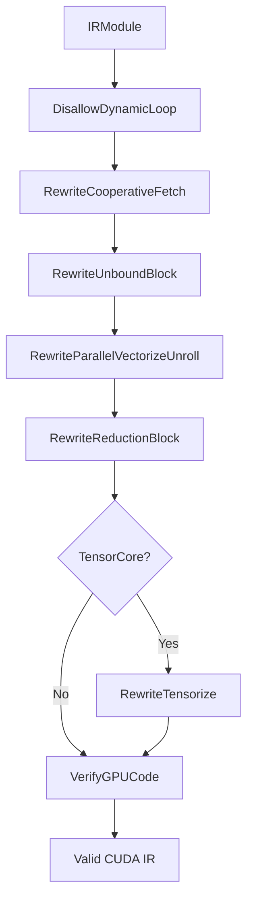
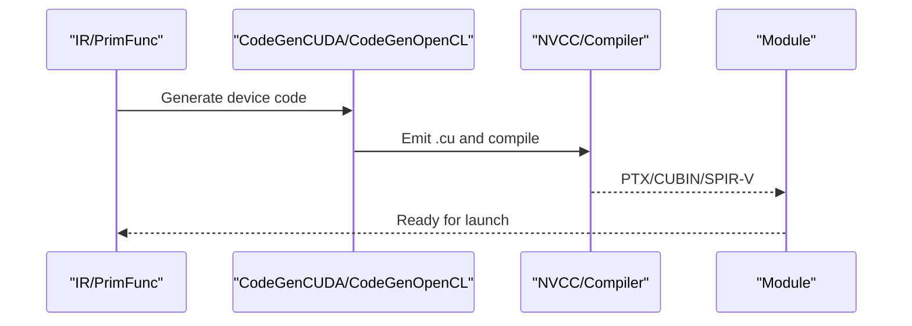
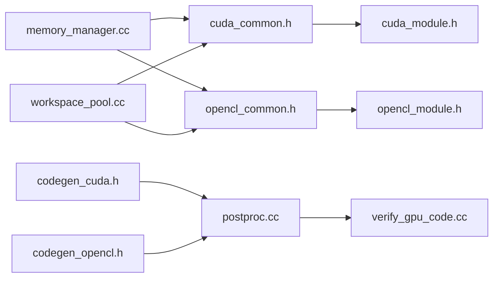

# GPU Generic Backend

<cite>
**Referenced Files in This Document**
- [cuda_common.h](file://src/runtime/cuda/cuda_common.h)
- [cuda_module.h](file://src/runtime/cuda/cuda_module.h)
- [opencl_common.h](file://src/runtime/opencl/opencl_common.h)
- [opencl_module.h](file://src/runtime/opencl/opencl_module.h)
- [memory_manager.cc](file://src/runtime/memory/memory_manager.cc)
- [workspace_pool.cc](file://src/runtime/workspace_pool.cc)
- [codegen_cuda.h](file://src/target/source/codegen_cuda.h)
- [codegen_opencl.h](file://src/target/source/codegen_opencl.h)
- [backend.h](file://include/tvm/relax/backend.h)
- [postproc.cc](file://src/s_tir/meta_schedule/postproc/postproc.cc)
- [verify_gpu_code.cc](file://src/s_tir/meta_schedule/postproc/verify_gpu_code.cc)
- [nvcc.py](file://python/tvm/contrib/nvcc.py)
</cite>

## Table of Contents
1. [Introduction](#introduction)
2. [Project Structure](#project-structure)
3. [Core Components](#core-components)
4. [Architecture Overview](#architecture-overview)
5. [Detailed Component Analysis](#detailed-component-analysis)
6. [Dependency Analysis](#dependency-analysis)
7. [Performance Considerations](#performance-considerations)
8. [Troubleshooting Guide](#troubleshooting-guide)
9. [Conclusion](#conclusion)
10. [Appendices](#appendices)

## Introduction
This document explains the GPU generic backend system in the TVM codebase. It focuses on common GPU optimizations, memory management patterns, and kernel generation strategies across CUDA and OpenCL. It covers pipeline configuration via meta-schedule post-processors, optimization passes, and hardware abstraction layers. It also documents memory coalescing, thread block organization, warp-level optimizations, and provides usage guidance for integrating custom GPU operations and tuning performance.

## Project Structure
The GPU generic backend spans runtime device APIs, target code generators, memory management, and meta-scheduling passes:
- Runtime backends: CUDA and OpenCL device APIs, module creation, and timers
- Target code generators: C/C++-based backends emitting CUDA and OpenCL device code
- Memory management: unified allocator and workspace pools
- Meta-scheduling: post-processors and verification for GPU code generation

**Diagram sources**
- [cuda_common.h:56-65](file://src/runtime/cuda/cuda_common.h#L56-L65)
- [cuda_module.h:49-50](file://src/runtime/cuda/cuda_module.h#L49-L50)
- [opencl_common.h:240-393](file://src/runtime/opencl/opencl_common.h#L240-L393)
- [opencl_module.h:46-58](file://src/runtime/opencl/opencl_module.h#L46-L58)
- [memory_manager.cc:127-132](file://src/runtime/memory/memory_manager.cc#L127-L132)
- [workspace_pool.cc:136-165](file://src/runtime/workspace_pool.cc#L136-L165)
- [codegen_cuda.h:39-131](file://src/target/source/codegen_cuda.h#L39-L131)
- [codegen_opencl.h:37-91](file://src/target/source/codegen_opencl.h#L37-L91)
- [postproc.cc:81-104](file://src/s_tir/meta_schedule/postproc/postproc.cc#L81-L104)
- [verify_gpu_code.cc:118-146](file://src/s_tir/meta_schedule/postproc/verify_gpu_code.cc#L118-L146)

**Section sources**
- [cuda_common.h:1-70](file://src/runtime/cuda/cuda_common.h#L1-L70)
- [opencl_common.h:1-608](file://src/runtime/opencl/opencl_common.h#L1-L608)
- [memory_manager.cc:1-277](file://src/runtime/memory/memory_manager.cc#L1-L277)
- [workspace_pool.cc:1-169](file://src/runtime/workspace_pool.cc#L1-L169)
- [codegen_cuda.h:1-137](file://src/target/source/codegen_cuda.h#L1-L137)
- [codegen_opencl.h:1-97](file://src/target/source/codegen_opencl.h#L1-L97)
- [postproc.cc:73-104](file://src/s_tir/meta_schedule/postproc/postproc.cc#L73-L104)
- [verify_gpu_code.cc:118-146](file://src/s_tir/meta_schedule/postproc/verify_gpu_code.cc#L118-L146)

## Core Components
- CUDA runtime and module:
  - Thread-local workspace and device API entry points
  - Module creation from PTX/CUBIN with function metadata
- OpenCL runtime and module:
  - Multi-device command queue management, profiling, and buffer/image allocation
  - Module creation from compiled binaries or SPIR-V
- Memory manager and workspace:
  - Unified allocator registry per device and scope
  - Page-aligned workspace pool for temporary allocations
- Target code generators:
  - CUDA code generator with FP4/FP6/FP8/FP16/BF16, WMMA, and warp shuffle flags
  - OpenCL code generator with vector load/store and texture scope
- Meta-scheduling post-processors:
  - Default CUDA postprocessors including cooperative fetch, unbound blocks, and GPU verification
  - Verification of shared memory, threads per block, vectorization limits, and warp alignment

**Section sources**
- [cuda_common.h:56-65](file://src/runtime/cuda/cuda_common.h#L56-L65)
- [cuda_module.h:38-50](file://src/runtime/cuda/cuda_module.h#L38-L50)
- [opencl_common.h:240-393](file://src/runtime/opencl/opencl_common.h#L240-L393)
- [opencl_module.h:39-58](file://src/runtime/opencl/opencl_module.h#L39-L58)
- [memory_manager.cc:147-191](file://src/runtime/memory/memory_manager.cc#L147-L191)
- [workspace_pool.cc:34-124](file://src/runtime/workspace_pool.cc#L34-L124)
- [codegen_cuda.h:39-131](file://src/target/source/codegen_cuda.h#L39-L131)
- [codegen_opencl.h:37-91](file://src/target/source/codegen_opencl.h#L37-L91)
- [postproc.cc:81-104](file://src/s_tir/meta_schedule/postproc/postproc.cc#L81-L104)
- [verify_gpu_code.cc:118-146](file://src/s_tir/meta_schedule/postproc/verify_gpu_code.cc#L118-L146)

## Architecture Overview
The GPU generic backend integrates device APIs, code generation, and scheduling verification into a cohesive pipeline:
- Device APIs abstract GPU memory, streams, and synchronization
- Code generators emit device-specific kernels from TIR/Relax IR
- Meta-scheduling post-processors enforce GPU-friendly transformations
- Memory manager and workspace pool reduce allocation overhead and improve locality

**Diagram sources**
- [postproc.cc:81-104](file://src/s_tir/meta_schedule/postproc/postproc.cc#L81-L104)
- [codegen_cuda.h:39-131](file://src/target/source/codegen_cuda.h#L39-L131)
- [codegen_opencl.h:37-91](file://src/target/source/codegen_opencl.h#L37-L91)
- [cuda_module.h:49-50](file://src/runtime/cuda/cuda_module.h#L49-L50)
- [opencl_module.h:46-58](file://src/runtime/opencl/opencl_module.h#L46-L58)

## Detailed Component Analysis

### CUDA Runtime and Module
- Thread-local workspace enables fast temporary allocations per thread
- Module creation accepts PTX/CUBIN and function metadata; optional CUDA source for inspection
- Device API handles memory allocation, copying, and synchronization

**Diagram sources**
- [cuda_common.h:56-65](file://src/runtime/cuda/cuda_common.h#L56-L65)
- [cuda_module.h:49-50](file://src/runtime/cuda/cuda_module.h#L49-L50)

**Section sources**
- [cuda_common.h:56-65](file://src/runtime/cuda/cuda_common.h#L56-L65)
- [cuda_module.h:38-50](file://src/runtime/cuda/cuda_module.h#L38-L50)

### OpenCL Runtime and Module
- Multi-device command queues, profiling toggling, and buffer/image allocation
- Thread-safe kernel installation via thread-local tables
- Module creation supports binary formats and SPIR-V

**Diagram sources**
- [opencl_common.h:240-393](file://src/runtime/opencl/opencl_common.h#L240-L393)
- [opencl_common.h:465-542](file://src/runtime/opencl/opencl_common.h#L465-L542)

**Section sources**
- [opencl_common.h:240-393](file://src/runtime/opencl/opencl_common.h#L240-L393)
- [opencl_module.h:39-58](file://src/runtime/opencl/opencl_module.h#L39-L58)

### Memory Management and Workspace
- Memory manager selects device-specific allocators or falls back to naive/pooled
- Per-device allocator registry ensures thread-safe reuse
- Workspace pool pages allocations aligned to 4 KiB and amortizes device calls

**Diagram sources**
- [memory_manager.cc:217-244](file://src/runtime/memory/memory_manager.cc#L217-L244)
- [workspace_pool.cc:46-86](file://src/runtime/workspace_pool.cc#L46-L86)

**Section sources**
- [memory_manager.cc:147-191](file://src/runtime/memory/memory_manager.cc#L147-L191)
- [workspace_pool.cc:34-124](file://src/runtime/workspace_pool.cc#L34-L124)

### Target Code Generation (CUDA and OpenCL)
- CodeGenCUDA:
  - Enables FP4/FP6/FP8/FP16/BF16, warp shuffle, math constants, and WMMA headers
  - Handles storage scopes, vectorization, and barrier arrays
- CodeGenOpenCL:
  - Vector load/store, restrict, and texture scope
  - Conditional FP16/FP64 and atomic extensions

**Diagram sources**
- [codegen_cuda.h:39-131](file://src/target/source/codegen_cuda.h#L39-L131)
- [codegen_opencl.h:37-91](file://src/target/source/codegen_opencl.h#L37-L91)

**Section sources**
- [codegen_cuda.h:39-131](file://src/target/source/codegen_cuda.h#L39-L131)
- [codegen_opencl.h:37-91](file://src/target/source/codegen_opencl.h#L37-L91)

### Meta-Scheduling GPU Optimization Pipeline
- DefaultCUDA postprocessors:
  - Disallow dynamic loops, rewrite cooperative fetch, unbound blocks, vectorization/unroll, reduction block, verify GPU code
- DefaultCUDATensorCore adds tensorization after verification
- VerifyGPUCode enforces target constraints: shared memory per block, threads per block, vectorization limits, warp size

**Diagram sources**
- [postproc.cc:81-104](file://src/s_tir/meta_schedule/postproc/postproc.cc#L81-L104)
- [verify_gpu_code.cc:118-146](file://src/s_tir/meta_schedule/postproc/verify_gpu_code.cc#L118-L146)

**Section sources**
- [postproc.cc:73-104](file://src/s_tir/meta_schedule/postproc/postproc.cc#L73-L104)
- [verify_gpu_code.cc:118-146](file://src/s_tir/meta_schedule/postproc/verify_gpu_code.cc#L118-L146)

### Hardware Abstraction Layers and Kernel Generation Strategies
- CUDA:
  - NVCC integration supports emitting PTX/CUBIN/FATBIN and configurable output directory via pass context
- OpenCL:
  - Binary formats (clbin), source, and SPIR-V module creation
- Relax backend:
  - Lowering passes for runtime builtins and shape lowering to VM

**Diagram sources**
- [nvcc.py:122-153](file://python/tvm/contrib/nvcc.py#L122-L153)
- [cuda_module.h:49-50](file://src/runtime/cuda/cuda_module.h#L49-L50)
- [opencl_module.h:46-58](file://src/runtime/opencl/opencl_module.h#L46-L58)

**Section sources**
- [nvcc.py:122-153](file://python/tvm/contrib/nvcc.py#L122-L153)
- [backend.h:33-45](file://include/tvm/relax/backend.h#L33-L45)

## Dependency Analysis
- CUDA runtime depends on device API and workspace pool for memory and temporaries
- OpenCL runtime depends on thread-local kernel tables and device-specific contexts
- Code generators depend on target attributes and post-processors for correctness
- Memory manager delegates to device-specific allocators

**Diagram sources**
- [cuda_common.h:56-65](file://src/runtime/cuda/cuda_common.h#L56-L65)
- [opencl_common.h:240-393](file://src/runtime/opencl/opencl_common.h#L240-L393)
- [memory_manager.cc:127-132](file://src/runtime/memory/memory_manager.cc#L127-L132)
- [workspace_pool.cc:136-165](file://src/runtime/workspace_pool.cc#L136-L165)
- [codegen_cuda.h:39-131](file://src/target/source/codegen_cuda.h#L39-L131)
- [codegen_opencl.h:37-91](file://src/target/source/codegen_opencl.h#L37-L91)
- [postproc.cc:81-104](file://src/s_tir/meta_schedule/postproc/postproc.cc#L81-L104)
- [verify_gpu_code.cc:118-146](file://src/s_tir/meta_schedule/postproc/verify_gpu_code.cc#L118-L146)

**Section sources**
- [cuda_common.h:56-65](file://src/runtime/cuda/cuda_common.h#L56-L65)
- [opencl_common.h:240-393](file://src/runtime/opencl/opencl_common.h#L240-L393)
- [memory_manager.cc:127-132](file://src/runtime/memory/memory_manager.cc#L127-L132)
- [workspace_pool.cc:136-165](file://src/runtime/workspace_pool.cc#L136-L165)
- [codegen_cuda.h:39-131](file://src/target/source/codegen_cuda.h#L39-L131)
- [codegen_opencl.h:37-91](file://src/target/source/codegen_opencl.h#L37-L91)
- [postproc.cc:81-104](file://src/s_tir/meta_schedule/postproc/postproc.cc#L81-L104)
- [verify_gpu_code.cc:118-146](file://src/s_tir/meta_schedule/postproc/verify_gpu_code.cc#L118-L146)

## Performance Considerations
- Memory coalescing:
  - Prefer row-major layouts and aligned strides for vectorized loads/stores
  - Use cooperative fetch to increase bandwidth utilization
- Thread block organization:
  - Respect max_threads_per_block and warp alignment
  - Favor multiples of warp size for uniform occupancy
- Warp-level optimizations:
  - Enable warp shuffle intrinsics when supported
  - Use vectorized types up to max_vector_bytes
- Shared memory:
  - Respect max_shared_memory_per_block and align barriers
- Compilation:
  - Emit PTX/CUBIN with appropriate compute capability and target format
  - Persist intermediate kernels for debugging and profiling

[No sources needed since this section provides general guidance]

## Troubleshooting Guide
- CUDA errors:
  - Use CUDA_CALL and CUDA_DRIVER_CALL macros to capture and throw detailed errors
  - Ensure device memory alignment and avoid cudart unloading errors
- OpenCL errors:
  - Use OPENCL_CHECK_ERROR and OPENCL_CALL to diagnose failures
  - Verify device extensions and queue properties for profiling
- Profiling:
  - Toggle queue profiling mode around timing sessions
  - Collect event timings and synchronize before reading profiling info
- Memory issues:
  - Confirm allocator type and scope compatibility
  - Validate tensor shapes and alignments before kernel launch

**Section sources**
- [cuda_common.h:37-54](file://src/runtime/cuda/cuda_common.h#L37-L54)
- [opencl_common.h:216-226](file://src/runtime/opencl/opencl_common.h#L216-L226)
- [opencl_common.h:544-592](file://src/runtime/opencl/opencl_common.h#L544-L592)
- [memory_manager.cc:147-191](file://src/runtime/memory/memory_manager.cc#L147-L191)

## Conclusion
The GPU generic backend in TVM provides a robust foundation for portable GPU computation. Through device APIs, code generators, and meta-scheduling post-processors, it enforces performance-friendly transformations while maintaining hardware abstraction. Proper use of memory managers, workspace pools, and verification passes yields efficient, compliant kernels across CUDA and OpenCL targets.

[No sources needed since this section summarizes without analyzing specific files]

## Appendices

### Example Workflows
- Building and launching CUDA kernels:
  - Generate device code with CodeGenCUDA
  - Compile via NVCC to PTX/CUBIN
  - Create CUDAModule with function metadata and launch
- Building and launching OpenCL kernels:
  - Generate device code with CodeGenOpenCL
  - Compile to clbin or SPIR-V
  - Create OpenCLModule and run with command queues

**Section sources**
- [codegen_cuda.h:39-131](file://src/target/source/codegen_cuda.h#L39-L131)
- [nvcc.py:122-153](file://python/tvm/contrib/nvcc.py#L122-L153)
- [cuda_module.h:49-50](file://src/runtime/cuda/cuda_module.h#L49-L50)
- [codegen_opencl.h:37-91](file://src/target/source/codegen_opencl.h#L37-L91)
- [opencl_module.h:46-58](file://src/runtime/opencl/opencl_module.h#L46-L58)