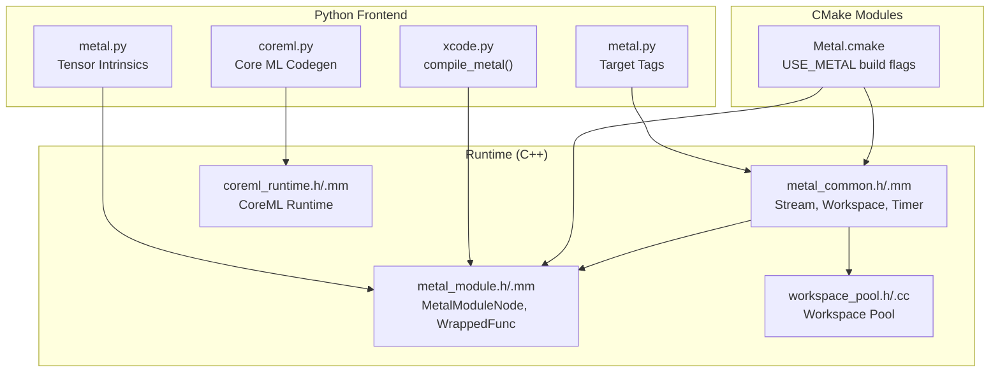
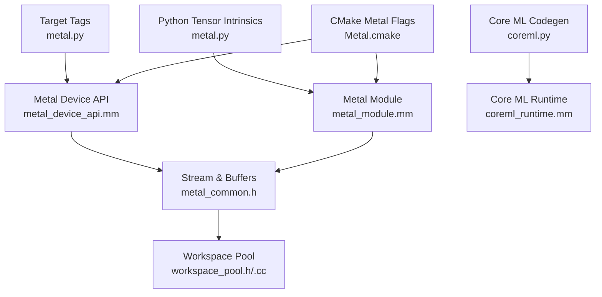
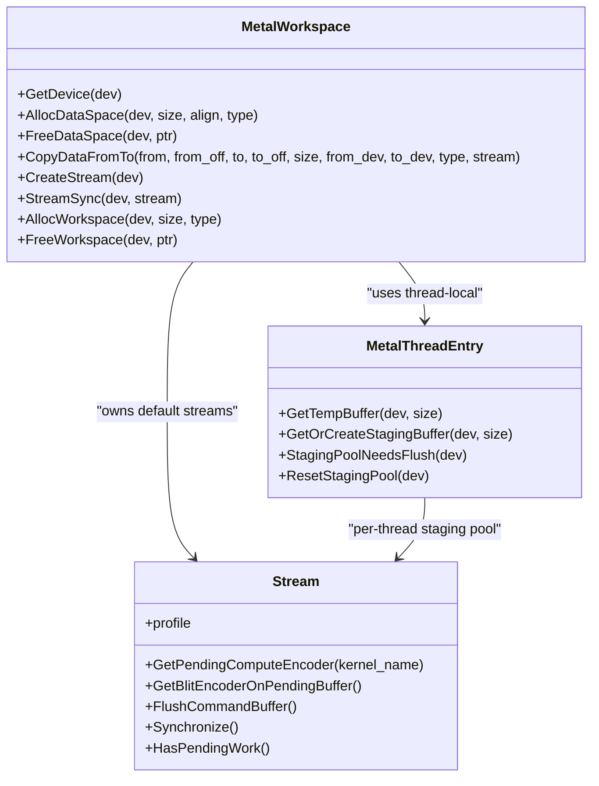
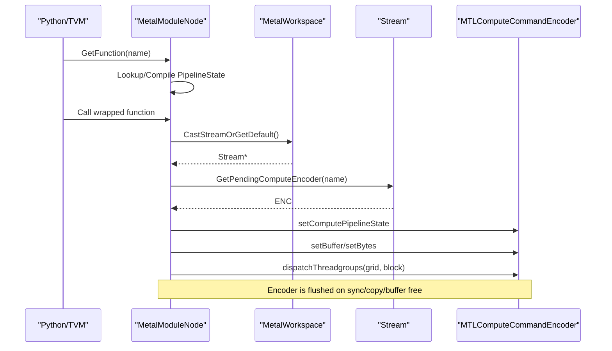
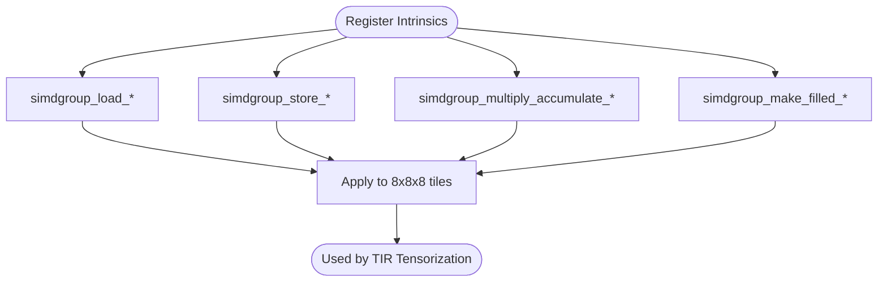
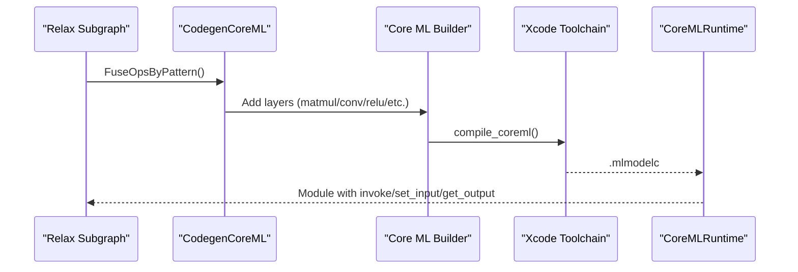
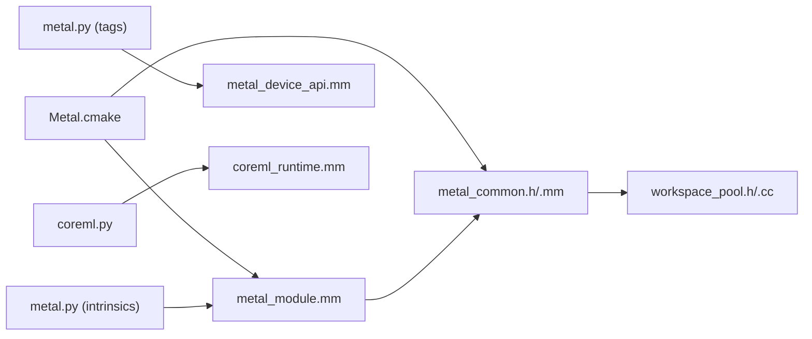

# Metal Backend

<cite>
**Referenced Files in This Document**
- [metal_common.h](file://src/runtime/metal/metal_common.h)
- [metal_device_api.mm](file://src/runtime/metal/metal_device_api.mm)
- [metal_module.h](file://src/runtime/metal/metal_module.h)
- [metal_module.mm](file://src/runtime/metal/metal_module.mm)
- [Metal.cmake](file://cmake/modules/Metal.cmake)
- [metal.py](file://python/tvm/s_tir/tensor_intrin/metal.py)
- [metal.py](file://python/tvm/target/tag_registry/metal.py)
- [coreml.py](file://python/tvm/relax/backend/metal/coreml.py)
- [coreml_runtime.h](file://src/runtime/contrib/coreml/coreml_runtime.h)
- [coreml_runtime.mm](file://src/runtime/contrib/coreml/coreml_runtime.mm)
- [test_target_codegen_metal.py](file://tests/python/codegen/test_target_codegen_metal.py)
- [xcode.py](file://python/tvm/contrib/xcode.py)
- [workspace_pool.h](file://src/runtime/workspace_pool.h)
- [workspace_pool.cc](file://src/runtime/workspace_pool.cc)
</cite>

## Table of Contents
1. [Introduction](#introduction)
2. [Project Structure](#project-structure)
3. [Core Components](#core-components)
4. [Architecture Overview](#architecture-overview)
5. [Detailed Component Analysis](#detailed-component-analysis)
6. [Dependency Analysis](#dependency-analysis)
7. [Performance Considerations](#performance-considerations)
8. [Troubleshooting Guide](#troubleshooting-guide)
9. [Conclusion](#conclusion)
10. [Appendices](#appendices)

## Introduction
This document explains the Metal backend implementation for Apple platforms in the TVM runtime. It covers Metal-specific optimizations, Core ML integration, iOS/macOS deployment strategies, kernel generation, memory management, and performance optimization techniques tailored for Apple Silicon. It also provides practical guidance on configuration, Metal kernel compilation, and platform-specific tuning.

## Project Structure
The Metal backend spans runtime C++ modules, Python integration, and build configuration:
- Runtime Metal device and module: C++ implementation under src/runtime/metal
- Python tensor intrinsics and target tags for Metal
- Core ML integration for model partitioning and runtime
- Build configuration enabling Metal support
- Tests validating Metal codegen and runtime behavior

**Diagram sources**
- [metal_common.h:105-293](file://src/runtime/metal/metal_common.h#L105-L293)
- [metal_device_api.mm:160-175](file://src/runtime/metal/metal_device_api.mm#L160-L175)
- [metal_module.mm:52-176](file://src/runtime/metal/metal_module.mm#L52-L176)
- [Metal.cmake:18-28](file://cmake/modules/Metal.cmake#L18-L28)
- [metal.py:1-352](file://python/tvm/s_tir/tensor_intrin/metal.py#L1-L352)
- [metal.py:22-42](file://python/tvm/target/tag_registry/metal.py#L22-L42)
- [coreml.py:155-176](file://python/tvm/relax/backend/metal/coreml.py#L155-L176)
- [coreml_runtime.h:47-91](file://src/runtime/contrib/coreml/coreml_runtime.h#L47-L91)
- [coreml_runtime.mm:32-116](file://src/runtime/contrib/coreml/coreml_runtime.mm#L32-L116)
- [workspace_pool.h:45-77](file://src/runtime/workspace_pool.h#L45-L77)

**Section sources**
- [Metal.cmake:18-28](file://cmake/modules/Metal.cmake#L18-L28)
- [metal_common.h:105-293](file://src/runtime/metal/metal_common.h#L105-L293)
- [metal_device_api.mm:160-175](file://src/runtime/metal/metal_device_api.mm#L160-L175)
- [metal_module.mm:52-176](file://src/runtime/metal/metal_module.mm#L52-L176)
- [metal.py:1-352](file://python/tvm/s_tir/tensor_intrin/metal.py#L1-L352)
- [metal.py:22-42](file://python/tvm/target/tag_registry/metal.py#L22-L42)
- [coreml.py:155-176](file://python/tvm/relax/backend/metal/coreml.py#L155-L176)
- [coreml_runtime.h:47-91](file://src/runtime/contrib/coreml/coreml_runtime.h#L47-L91)
- [coreml_runtime.mm:32-116](file://src/runtime/contrib/coreml/coreml_runtime.mm#L32-L116)
- [workspace_pool.h:45-77](file://src/runtime/workspace_pool.h#L45-L77)

## Core Components
- Metal device and stream management: device enumeration, attributes, memory allocation, and command batching
- Metal module execution: kernel compilation, pipeline state caching, and dispatch orchestration
- Tensor intrinsics for Apple GPU simdgroup matrix operations
- Target tags for Apple GPU configurations
- Core ML integration: pattern-based partitioning and runtime execution
- Workspace pooling for efficient temporary memory reuse

Key responsibilities:
- Stream: batch compute dispatches and blit operations, synchronize, and track profiling counters
- MetalWorkspace: device lifecycle, memory allocation/free, CPU/GPU copies, timers
- MetalModuleNode: per-device pipeline state caching, kernel dispatch wrapper
- Tensor intrinsics: simdgroup load/store/multiply-accumulate for 8x8x8 tiles
- Core ML codegen: partition Relax subgraphs and compile to Core ML models
- WorkspacePool: page-aligned, reusable temporary allocations

**Section sources**
- [metal_common.h:105-293](file://src/runtime/metal/metal_common.h#L105-L293)
- [metal_device_api.mm:160-341](file://src/runtime/metal/metal_device_api.mm#L160-L341)
- [metal_module.mm:52-176](file://src/runtime/metal/metal_module.mm#L52-L176)
- [metal.py:28-352](file://python/tvm/s_tir/tensor_intrin/metal.py#L28-L352)
- [metal.py:22-42](file://python/tvm/target/tag_registry/metal.py#L22-L42)
- [coreml.py:155-176](file://python/tvm/relax/backend/metal/coreml.py#L155-L176)
- [workspace_pool.h:45-77](file://src/runtime/workspace_pool.h#L45-L77)

## Architecture Overview
The Metal backend composes a device API, a module loader/executer, and optional Core ML integration. Python tensor intrinsics and target tags feed into the Metal runtime, while Core ML codegen partitions supported subgraphs and compiles them into Core ML models executed via a dedicated runtime.

**Diagram sources**
- [metal.py:1-352](file://python/tvm/s_tir/tensor_intrin/metal.py#L1-L352)
- [metal.py:22-42](file://python/tvm/target/tag_registry/metal.py#L22-L42)
- [metal_device_api.mm:160-175](file://src/runtime/metal/metal_device_api.mm#L160-L175)
- [metal_common.h:105-293](file://src/runtime/metal/metal_common.h#L105-L293)
- [metal_module.mm:52-176](file://src/runtime/metal/metal_module.mm#L52-L176)
- [coreml.py:155-176](file://python/tvm/relax/backend/metal/coreml.py#L155-L176)
- [coreml_runtime.mm:32-116](file://src/runtime/contrib/coreml/coreml_runtime.mm#L32-L116)
- [workspace_pool.h:45-77](file://src/runtime/workspace_pool.h#L45-L77)
- [Metal.cmake:18-28](file://cmake/modules/Metal.cmake#L18-L28)

## Detailed Component Analysis

### Metal Device API and Streams
Responsibilities:
- Enumerate Metal devices and initialize default streams
- Expose device attributes (e.g., max threads per block)
- Allocate/free GPU buffers with appropriate storage modes
- Batch compute dispatches and blit operations on a shared command buffer
- Synchronize streams and enforce ordering for GPU→CPU readbacks
- Provide profiling counters and error propagation

Key mechanisms:
- Stream batches compute encoders and interleaves blit encoders on a single command buffer; flushing commits the buffer
- CPU→GPU copies use staging buffers from a per-thread pool to avoid blocking
- GPU→CPU copies require a flush and wait; shared buffers are used when storage mode allows direct access

**Diagram sources**
- [metal_device_api.mm:160-341](file://src/runtime/metal/metal_device_api.mm#L160-L341)
- [metal_common.h:105-293](file://src/runtime/metal/metal_common.h#L105-L293)

**Section sources**
- [metal_device_api.mm:160-341](file://src/runtime/metal/metal_device_api.mm#L160-L341)
- [metal_common.h:105-293](file://src/runtime/metal/metal_common.h#L105-L293)

### Metal Module Execution
Responsibilities:
- Compile Metal kernels from source or binary metallib
- Cache pipeline states per device and function
- Wrap dispatches with a callable that sets buffers and launches compute
- Enforce launch parameter constraints and reuse pending compute encoder

**Diagram sources**
- [metal_module.mm:178-254](file://src/runtime/metal/metal_module.mm#L178-L254)
- [metal_device_api.mm:219-224](file://src/runtime/metal/metal_device_api.mm#L219-L224)

**Section sources**
- [metal_module.h:39-51](file://src/runtime/metal/metal_module.h#L39-L51)
- [metal_module.mm:52-176](file://src/runtime/metal/metal_module.mm#L52-L176)
- [metal_module.mm:178-254](file://src/runtime/metal/metal_module.mm#L178-L254)

### Tensor Intrinsics for Apple GPU
Responsibilities:
- Define simdgroup matrix intrinsics for 8x8x8 tiles
- Provide load/store/multiply-accumulate patterns for float16/bfloat16/float32
- Register named intrinsics for tensorization

Design highlights:
- Intrinsics map to Metal simdgroup operations for efficient on-chip matrix fragments
- Index computation accounts for buffer strides and tile layout

**Diagram sources**
- [metal.py:28-352](file://python/tvm/s_tir/tensor_intrin/metal.py#L28-L352)

**Section sources**
- [metal.py:28-352](file://python/tvm/s_tir/tensor_intrin/metal.py#L28-L352)

### Core ML Integration
Responsibilities:
- Partition Relax subgraphs into Core ML-supported ops
- Generate Core ML models and compile via Xcode toolchain
- Execute Core ML models through a TVM runtime module

Workflow:
- Pattern registry matches supported ops (matmul, conv2d, activations, etc.)
- CodegenCoreML traverses the subgraph, builds Core ML spec, and compiles
- CoreMLRuntime exposes invoke/set_input/get_output APIs

**Diagram sources**
- [coreml.py:155-176](file://python/tvm/relax/backend/metal/coreml.py#L155-L176)
- [coreml.py:307-432](file://python/tvm/relax/backend/metal/coreml.py#L307-L432)
- [coreml_runtime.mm:118-194](file://src/runtime/contrib/coreml/coreml_runtime.mm#L118-L194)

**Section sources**
- [coreml.py:155-176](file://python/tvm/relax/backend/metal/coreml.py#L155-L176)
- [coreml.py:307-432](file://python/tvm/relax/backend/metal/coreml.py#L307-L432)
- [coreml_runtime.h:47-91](file://src/runtime/contrib/coreml/coreml_runtime.h#L47-L91)
- [coreml_runtime.mm:118-194](file://src/runtime/contrib/coreml/coreml_runtime.mm#L118-L194)

### Target Tags and Platform Configuration
Responsibilities:
- Register Metal target tags with device capabilities (threads/block, shared mem, warp size)
- Provide host configuration for Apple Silicon (e.g., apple-m1/apple-m2)

Usage:
- Select targets like "apple/m1-gpu" or "apple/m2-gpu" to configure codegen and scheduling

**Section sources**
- [metal.py:22-42](file://python/tvm/target/tag_registry/metal.py#L22-L42)

### Kernel Generation and Compilation
Responsibilities:
- Compile Metal kernels from source or metallib
- Configure fast math and language version
- Integrate with TVM build pipeline via global function callbacks

Integration points:
- Global function "tvm_callback_metal_compile" delegates to xcode.compile_metal
- MetalModuleNode compiles kernels with MTLCompileOptions and caches pipeline state

**Section sources**
- [metal_module.mm:106-149](file://src/runtime/metal/metal_module.mm#L106-L149)
- [test_target_codegen_metal.py:189-210](file://tests/python/codegen/test_target_codegen_metal.py#L189-L210)
- [xcode.py:111-169](file://python/tvm/contrib/xcode.py#L111-L169)

## Dependency Analysis
- Build-time linkage: Metal.cmake adds Metal and Foundation libraries and compiles runtime Metal sources
- Runtime dependencies: MetalCommon depends on workspace_pool for temporary allocations; MetalModuleNode depends on MetalWorkspace for device and streams
- Python integration: tensor intrinsics and target tags are consumed by TIR/Relax passes; Core ML codegen depends on coremltools and Xcode toolchain

**Diagram sources**
- [Metal.cmake:18-28](file://cmake/modules/Metal.cmake#L18-L28)
- [metal_module.mm:52-176](file://src/runtime/metal/metal_module.mm#L52-L176)
- [metal_common.h:105-293](file://src/runtime/metal/metal_common.h#L105-L293)
- [workspace_pool.h:45-77](file://src/runtime/workspace_pool.h#L45-L77)
- [metal.py:1-352](file://python/tvm/s_tir/tensor_intrin/metal.py#L1-L352)
- [metal_device_api.mm:160-175](file://src/runtime/metal/metal_device_api.mm#L160-L175)
- [coreml.py:155-176](file://python/tvm/relax/backend/metal/coreml.py#L155-L176)
- [coreml_runtime.mm:118-194](file://src/runtime/contrib/coreml/coreml_runtime.mm#L118-L194)

**Section sources**
- [Metal.cmake:18-28](file://cmake/modules/Metal.cmake#L18-L28)
- [metal_module.mm:52-176](file://src/runtime/metal/metal_module.mm#L52-L176)
- [metal_common.h:105-293](file://src/runtime/metal/metal_common.h#L105-L293)
- [workspace_pool.h:45-77](file://src/runtime/workspace_pool.h#L45-L77)
- [metal.py:1-352](file://python/tvm/s_tir/tensor_intrin/metal.py#L1-L352)
- [metal_device_api.mm:160-175](file://src/runtime/metal/metal_device_api.mm#L160-L175)
- [coreml.py:155-176](file://python/tvm/relax/backend/metal/coreml.py#L155-L176)
- [coreml_runtime.mm:118-194](file://src/runtime/contrib/coreml/coreml_runtime.mm#L118-L194)

## Performance Considerations
- Command batching and encoder reuse: Stream batches compute dispatches and interleaves blits on a single command buffer; flushing occurs on sync/copy/buffer free to maintain correctness
- Staging buffers: CPU→GPU copies use a per-thread staging buffer pool to avoid frequent flushes; pool limits prevent unbounded growth
- Memory layout: Prefer shared storage mode for buffers that benefit from direct CPU access; otherwise use private storage and blit explicitly
- Fast math: Enable fast math during Metal kernel compilation to improve throughput
- Simdgoup intrinsics: Use 8x8x8 simdgroup tiles for efficient on-chip matrix operations
- Workspace pooling: Reuse temporaries across runs with page-aligned allocation to reduce fragmentation

[No sources needed since this section provides general guidance]

## Troubleshooting Guide
Common issues and remedies:
- GPU errors during dispatch: Stream tracks last kernel name and propagates Metal error messages; check error description and ensure pipeline state is cached per device
- Crashes on buffer deallocation: FreeDataSpace synchronizes if there is pending work; ensure FlushCommandBuffer or StreamSync is called before freeing buffers referenced by pending command buffers
- Cross-device copies: Metal disallows GPU→GPU across devices; verify device IDs match
- Unsupported data types in Core ML runtime: Only Float32/Float64/Int32 are supported; verify input/output dtypes
- Kernel compilation failures: Review compile options and language version; confirm Metal library creation succeeds

**Section sources**
- [metal_common.h:243-292](file://src/runtime/metal/metal_common.h#L243-L292)
- [metal_device_api.mm:201-217](file://src/runtime/metal/metal_device_api.mm#L201-L217)
- [metal_device_api.mm:239-307](file://src/runtime/metal/metal_device_api.mm#L239-L307)
- [coreml_runtime.mm:48-101](file://src/runtime/contrib/coreml/coreml_runtime.mm#L48-L101)

## Conclusion
The Metal backend provides a robust, high-performance runtime for Apple GPUs, integrating tightly with Metal’s compute and blit encoders, simdgroup tensor intrinsics, and Core ML for model execution. Through careful memory management, command batching, and platform-specific optimizations, it enables efficient inference and compute on Apple Silicon. The included Python integrations and build configuration simplify deployment across iOS and macOS.

[No sources needed since this section summarizes without analyzing specific files]

## Appendices

### Metal Backend Configuration Examples
- Select target tags for Apple GPUs:
  - "apple/m1-gpu" or "apple/m2-gpu" with specified thread and shared memory constraints
- Enable Metal support at build time:
  - USE_METAL flag in CMake links Metal and Foundation and compiles runtime Metal sources
- Compile Metal kernels:
  - Use xcode.compile_metal to produce metallib artifacts; integrate via global function callback

**Section sources**
- [metal.py:22-42](file://python/tvm/target/tag_registry/metal.py#L22-L42)
- [Metal.cmake:18-28](file://cmake/modules/Metal.cmake#L18-L28)
- [xcode.py:111-169](file://python/tvm/contrib/xcode.py#L111-L169)

### Metal Performance Shaders Integration
- The runtime focuses on Metal compute and blit encoders; MPS is not integrated in the referenced sources
- For MPS-backed operations, consider Core ML codegen paths that leverage Core ML’s built-in layers

[No sources needed since this section provides general guidance]

### Memory Layout Considerations
- Storage modes:
  - Private storage for GPU-only buffers
  - Shared storage for buffers allowing CPU access
- Readback strategy:
  - GPU→CPU requires flush/wait; shared buffers can be mapped directly
- Workspace reuse:
  - Page-aligned allocation and pooling reduce fragmentation and improve locality

**Section sources**
- [metal_device_api.mm:187-196](file://src/runtime/metal/metal_device_api.mm#L187-L196)
- [metal_device_api.mm:252-274](file://src/runtime/metal/metal_device_api.mm#L252-L274)
- [workspace_pool.h:45-77](file://src/runtime/workspace_pool.h#L45-L77)

### Power Efficiency Optimizations
- Minimize command buffer flushes by batching compute and blit operations
- Use simdgroup intrinsics to exploit vectorized on-chip computations
- Prefer shared storage only when necessary to avoid extra blits
- Align allocations to page boundaries for efficient memory bandwidth utilization

[No sources needed since this section provides general guidance]